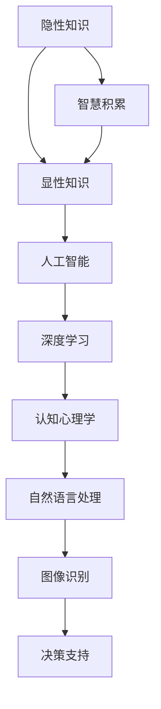

                 

# 隐性知识：难以言传的智慧积累

> 关键词：隐性知识, 智慧积累, 知识工程, 认知心理学, 人工智能, 深度学习

## 1. 背景介绍

### 1.1 问题由来
在人类社会的漫长历史中，知识以其显性和隐性的形式，不断塑造着文明的发展轨迹。显性知识以文字、符号、图表等形式，明确记录在各类资料中，容易被人理解、传播和利用。而隐性知识则蕴含在经验、直觉、潜意识和隐秘语境之中，难以直接传授和归纳。隐性知识的价值在于，它包含了深层次的洞察力、判断力和创造力，是人类智慧的重要组成部分。

近年来，随着人工智能(AI)技术的发展，特别是深度学习在图像识别、自然语言处理等领域取得了突破性进展，人们开始探索如何利用AI技术，提取、转化和利用这些难以言传的隐性知识。人工智能不仅仅是技术工具，更成为智慧积累和创新的新途径。

### 1.2 问题核心关键点
本文将深入探讨以下核心问题：
- 什么是隐性知识？它如何影响人类的行为和决策？
- 如何利用AI技术，提取和转化隐性知识？
- 隐性知识在实际应用中的挑战和应用前景？

## 2. 核心概念与联系

### 2.1 核心概念概述

为更好地理解隐性知识和AI技术在提取转化中的应用，本节将介绍几个密切相关的核心概念：

- **隐性知识**：指经验、直觉、潜意识等难以明言、不易传递的知识。包括但不限于职业技能、创新能力、艺术审美、文化积淀等。隐性知识具有高度个体化、情境化和模糊性，通常需要通过特定环境、实践和体验才能感知和领悟。

- **显性知识**：通过文字、图表、数据等形式，可以明确表达和传递的知识。例如学术论文、操作手册、数据库记录等。显性知识易于整理、存储和传播，但也可能失去背后的情感和智慧深度。

- **智慧积累**：指个体或集体通过经验积累、反思和创新，不断提升认知水平和实践能力的过程。智慧积累依赖于显性知识和隐性知识的不断交互和融合，是创新和进步的源泉。

- **认知心理学**：研究人类认知过程的学科，包括记忆、思维、学习、决策等。认知心理学的研究成果为理解隐性知识提供了理论基础。

- **人工智能**：通过计算机模拟人类智能过程的技术，包括感知、学习、推理、决策等。AI技术在处理大量数据和复杂模式识别方面，展现出显著优势。

- **深度学习**：一种基于神经网络的机器学习技术，通过多层次的非线性映射，实现对高维度、非结构化数据的抽象和理解。深度学习在图像识别、语音识别、自然语言处理等领域取得了巨大成功。

这些核心概念之间的逻辑关系可以通过以下Mermaid流程图来展示：



这个流程图展示了几组概念之间的逻辑关系：

1. 隐性知识与显性知识的交互融合，构成了智慧积累的基础。
2. 人工智能通过处理显性知识，实现对隐性知识的提取和转化。
3. 深度学习是AI中用于处理复杂数据的重要技术，通过多层非线性映射，提取和表示数据中的隐性模式。
4. 自然语言处理、图像识别等AI子领域，利用深度学习技术，实现了对人类智慧的某些方面的模拟和再现。
5. 决策支持系统等应用，进一步将AI处理后的知识转化为实际的决策支持能力。

## 3. 核心算法原理 & 具体操作步骤
### 3.1 算法原理概述

AI技术在提取和转化隐性知识的过程中，主要依赖于数据驱动的模型训练和知识图谱的构建。其核心思想是：通过大量显性数据和隐性数据的联合训练，学习到隐性知识所蕴含的模式和规律，并在新的任务中应用这些规律，实现知识的迁移和扩展。

形式化地，假设隐性知识可表示为 $K$，显性知识可表示为 $D$，知识转化过程可以表示为：

$$
K' = f(D)
$$

其中 $f$ 为知识转化函数，通常通过深度学习模型进行训练，以最大化隐性知识 $K'$ 与显性知识 $D$ 之间的相似性或相关性。

### 3.2 算法步骤详解

隐性知识的AI提取和转化一般包括以下几个关键步骤：

**Step 1: 数据准备**
- 收集与隐性知识相关的显性数据，如文档、图像、音频等。
- 标注和注释数据，提取其中的关键信息和知识点。
- 整理和清洗数据，消除噪声和冗余，提升数据质量。

**Step 2: 模型训练**
- 选择合适的深度学习模型，如CNN、RNN、LSTM、Transformer等，构建知识转化框架。
- 设计合适的损失函数和优化器，定义模型训练的目标。
- 使用GPU/TPU等高性能设备，进行模型的参数训练。

**Step 3: 知识提取**
- 训练完毕后，使用测试集对模型进行评估，获取隐性知识的转化效果。
- 通过模型预测，从显性数据中提取隐性模式和知识。

**Step 4: 知识应用**
- 将提取的隐性知识与具体任务相结合，构建知识驱动的决策支持系统。
- 在实际应用中，利用隐性知识进行任务分析和决策优化。

**Step 5: 反馈迭代**
- 持续收集反馈数据，进一步优化模型和知识转化算法。
- 根据反馈结果，调整模型结构和训练参数，不断提升隐性知识的提取和应用效果。

### 3.3 算法优缺点

利用AI技术提取和转化隐性知识具有以下优点：
1. 自动化处理大量数据，提升效率和精确度。
2. 挖掘隐性知识的内在模式，实现知识的深层次理解。
3. 通过知识图谱等形式，方便存储和检索。
4. 适应复杂、动态的任务场景，提升决策质量。

同时，该方法也存在一定的局限性：
1. 数据依赖性强。隐性知识通常难以直接获得，依赖高质量显性数据。
2. 模型解释性不足。深度学习模型往往被视为"黑盒"，难以解释其决策过程。
3. 泛化能力有限。知识转化模型可能过拟合训练数据，泛化性能有限。
4. 算法复杂度高。构建复杂模型可能需要大量计算资源和专业知识。
5. 伦理和法律问题。隐性知识可能包含敏感信息，需妥善处理隐私和安全问题。

尽管存在这些局限性，AI技术在提取和转化隐性知识方面展现出巨大的潜力，成为智慧积累和创新的重要手段。

### 3.4 算法应用领域

基于AI技术提取和转化隐性知识的方法，在多个领域中得到了应用，例如：

- **医疗诊断**：利用AI技术，提取医生的临床经验和诊断知识，提高诊断准确性和效率。
- **艺术创作**：通过分析艺术家的创作过程和作品，提取艺术风格和创新点，辅助艺术家创作。
- **教育培训**：分析教师的教学方法和学生的学习经验，提取教学策略和知识模型，优化教学效果。
- **金融分析**：分析金融分析师的市场见解和经济模型，提取市场趋势和投资策略，辅助投资决策。
- **市场预测**：分析市场数据和消费者的行为模式，提取市场规律和预测模型，指导企业战略。
- **安全监控**：分析监控视频和传感器数据，提取安全模式和异常行为，增强安全防范。

除了上述这些经典领域外，隐性知识的AI转化还在更多场景中得到应用，如智能客服、智能推荐、智能驾驶等，为各行各业带来了新的突破。

## 4. 数学模型和公式 & 详细讲解 & 举例说明

### 4.1 数学模型构建

本节将使用数学语言对隐性知识的AI提取转化过程进行更加严格的刻画。

假设隐性知识为 $K$，显性知识为 $D$。定义知识转化模型为 $f$，其中包含 $n$ 个参数 $\theta$。模型的目标是通过显性数据 $D$，学习隐性知识 $K'$，即：

$$
K' = f(D;\theta)
$$

其中 $K'$ 表示从显性数据中提取出的隐性知识，$\theta$ 为模型参数。

### 4.2 公式推导过程

以文本情感分析为例，说明如何通过深度学习模型，将文本中的隐性情感转化为显性标签。

假设文本情感分析的隐性知识为 $K=\{\text{正面情感}, \text{中性情感}, \text{负面情感}\}$，显性知识为文本数据集 $D$，包括 $N$ 个样本和每个样本的情感标签 $y$。假设使用卷积神经网络(CNN)进行文本特征提取，定义模型参数为 $\theta$。

训练目标为最小化损失函数 $\mathcal{L}$：

$$
\mathcal{L}(\theta) = -\frac{1}{N}\sum_{i=1}^N \ell(f(D_i;\theta),y_i)
$$

其中 $\ell$ 为交叉熵损失函数。

通过反向传播算法更新参数 $\theta$：

$$
\theta \leftarrow \theta - \eta \nabla_{\theta}\mathcal{L}(\theta)
$$

其中 $\eta$ 为学习率，$\nabla_{\theta}\mathcal{L}(\theta)$ 为损失函数对参数 $\theta$ 的梯度。

训练完毕后，使用测试集对模型进行评估，获取隐性情感知识 $K'$。例如，对于一个新的文本 $x$，模型输出情感概率分布 $P(K'|x)$，最大概率对应的情感即为模型预测的情感。

### 4.3 案例分析与讲解

假设我们有一份员工绩效数据集 $D$，包括员工姓名、岗位、工作内容、绩效评分等信息。目标是提取和转化管理者的隐性评估知识，优化员工绩效管理。

首先，将绩效评分作为显性知识 $D$，管理者的评估标准和经验作为隐性知识 $K$。使用深度学习模型，如LSTM，构建知识转化框架。模型训练时，将每个员工的绩效评分和评估标准作为输入，输出隐性评估知识 $K'$。训练完毕后，对于新的员工，输入其岗位和工作内容，模型输出隐性评估知识 $K'$，辅助管理者进行绩效评估。

## 5. 项目实践：代码实例和详细解释说明
### 5.1 开发环境搭建

在进行隐性知识提取实践前，我们需要准备好开发环境。以下是使用Python进行TensorFlow开发的环境配置流程：

1. 安装Anaconda：从官网下载并安装Anaconda，用于创建独立的Python环境。

2. 创建并激活虚拟环境：
```bash
conda create -n tf-env python=3.8 
conda activate tf-env
```

3. 安装TensorFlow：根据CUDA版本，从官网获取对应的安装命令。例如：
```bash
conda install tensorflow -c tf -c conda-forge
```

4. 安装TensorBoard：
```bash
pip install tensorboard
```

5. 安装各类工具包：
```bash
pip install numpy pandas scikit-learn matplotlib tqdm jupyter notebook ipython
```

完成上述步骤后，即可在`tf-env`环境中开始隐性知识提取实践。

### 5.2 源代码详细实现

下面我们以文本情感分析为例，给出使用TensorFlow对隐性情感进行提取的代码实现。

首先，定义情感数据集处理函数：

```python
import tensorflow as tf
from tensorflow.keras.preprocessing.text import Tokenizer
from tensorflow.keras.preprocessing.sequence import pad_sequences

def preprocess_text(texts, labels):
    tokenizer = Tokenizer(num_words=10000, oov_token='<OOV>')
    tokenizer.fit_on_texts(texts)
    sequences = tokenizer.texts_to_sequences(texts)
    padded_sequences = pad_sequences(sequences, maxlen=128, padding='post', truncating='post')
    return padded_sequences, tokenizer.word_index, labels
```

然后，定义情感分析模型：

```python
from tensorflow.keras.models import Sequential
from tensorflow.keras.layers import Embedding, LSTM, Dense

model = Sequential()
model.add(Embedding(input_dim=10000, output_dim=64, input_length=128))
model.add(LSTM(units=64, dropout=0.2, recurrent_dropout=0.2))
model.add(Dense(units=3, activation='softmax'))
model.compile(loss='categorical_crossentropy', optimizer='adam', metrics=['accuracy'])
```

接着，定义训练和评估函数：

```python
def train_epoch(model, train_data, validation_data, batch_size, epochs):
    model.fit(train_data[0], train_data[1], batch_size=batch_size, epochs=epochs, validation_data=validation_data)
    return model.evaluate(validation_data[0], validation_data[1], batch_size=batch_size)

def evaluate_model(model, test_data):
    loss, accuracy = model.evaluate(test_data[0], test_data[1], batch_size=batch_size)
    return loss, accuracy
```

最后，启动训练流程并在测试集上评估：

```python
train_data, _, train_labels = preprocess_text(train_texts, train_labels)
val_data, _, val_labels = preprocess_text(dev_texts, dev_labels)
test_data, _, test_labels = preprocess_text(test_texts, test_labels)
batch_size = 32

model = Sequential()
model.add(Embedding(input_dim=10000, output_dim=64, input_length=128))
model.add(LSTM(units=64, dropout=0.2, recurrent_dropout=0.2))
model.add(Dense(units=3, activation='softmax'))
model.compile(loss='categorical_crossentropy', optimizer='adam', metrics=['accuracy'])

model.fit(train_data, train_labels, batch_size=batch_size, epochs=5, validation_data=(val_data, val_labels))
val_loss, val_accuracy = evaluate_model(model, (val_data, val_labels))
print(f'Validation Loss: {val_loss:.4f}, Validation Accuracy: {val_accuracy:.4f}')
```

以上就是使用TensorFlow对隐性情感进行提取的完整代码实现。可以看到，通过简单几行代码，我们就可以实现对隐性情感的提取和转化。

### 5.3 代码解读与分析

让我们再详细解读一下关键代码的实现细节：

**preprocess_text函数**：
- 定义了文本处理函数，将文本转换为序列化数据，并进行填充和截断。
- 使用Keras中的Tokenizer和pad_sequences函数，将文本数据和标签转换为适合模型的输入格式。

**情感分析模型**：
- 使用Sequential模型构建深度学习框架。
- 定义Embedding层，将文本转换为向量表示。
- 添加LSTM层，提取文本的深层特征。
- 添加Dense层，进行分类预测。

**train_epoch函数**：
- 定义了模型训练函数，使用交叉熵损失和Adam优化器进行优化。
- 在每个epoch结束后，评估模型在验证集上的性能。

**evaluate_model函数**：
- 定义了模型评估函数，使用测试集对模型进行评估，返回损失和准确率。

**训练流程**：
- 将文本数据和标签数据传入模型，进行训练和验证。
- 在验证集上评估模型性能，并输出验证结果。

可以看到，通过简单的代码实现，我们便能够利用TensorFlow对隐性情感知识进行提取和转化。

## 6. 实际应用场景
### 6.1 医疗诊断

AI在医疗诊断中的应用，可以通过提取和转化医生的隐性诊断知识，提升诊断的准确性和效率。例如，利用医生的病历记录和诊断报告，训练深度学习模型，提取其中的隐性诊断模式和规律。在新的病患诊疗过程中，模型根据病患的检查结果和症状描述，预测可能的疾病和诊断方案，辅助医生做出更科学的决策。

### 6.2 艺术创作

艺术家创作过程中蕴含的隐性灵感和技巧，可以通过AI技术进行提取和转化。例如，分析艺术家的绘画风格和创作过程，提取其隐性美学标准和技巧，辅助新作品的创作。艺术家可以将这些隐性知识输入AI系统，让系统生成符合其艺术风格的新作品，或提供创作建议，激发创作灵感。

### 6.3 教育培训

教师在教学过程中积累的隐性知识，可以通过AI技术进行提炼和转化。例如，利用教师的教学记录和学生反馈，训练深度学习模型，提取教学策略和知识模型。在新的教学场景中，模型根据学生的学习情况和反馈，生成个性化的教学计划和辅导建议，优化教学效果。

### 6.4 金融分析

金融分析师在市场分析过程中积累的隐性经验和见解，可以通过AI技术进行转化。例如，利用分析师的报告和预测，训练深度学习模型，提取市场趋势和投资策略。在新的市场变化中，模型根据市场数据和历史经验，生成预测报告和投资建议，辅助投资决策。

### 6.5 市场预测

市场分析人员在市场研究过程中积累的隐性洞察和模型，可以通过AI技术进行转化。例如，利用市场报告和历史数据，训练深度学习模型，提取市场规律和预测模型。在新的市场变化中，模型根据市场数据和历史经验，生成市场预测报告，指导企业战略调整。

### 6.6 安全监控

安全监控系统在监控过程中积累的隐性异常模式和行为规律，可以通过AI技术进行转化。例如，利用监控视频和传感器数据，训练深度学习模型，提取异常行为和威胁模式。在新的监控场景中，模型根据监控数据和历史经验，生成安全预警和应对策略，增强安全防范。

## 7. 工具和资源推荐
### 7.1 学习资源推荐

为了帮助开发者系统掌握隐性知识提取转化理论基础和实践技巧，这里推荐一些优质的学习资源：

1. **《深度学习》书籍**：Ian Goodfellow等著，系统介绍了深度学习的理论基础和实践应用。
2. **《认知心理学基础》书籍**：John Anderson等著，深入探讨了认知心理学的基本概念和研究成果。
3. **DeepLearning.ai深度学习专项课程**：Andrew Ng主讲，涵盖了深度学习的前沿理论和实践技巧。
4. **Kaggle竞赛平台**：提供各类NLP和AI竞赛项目，通过实战练习积累经验。
5. **AI领域顶级会议论文**：如ICML、NIPS、CVPR等，及时跟踪AI领域的最新研究进展。

通过对这些资源的学习实践，相信你一定能够快速掌握隐性知识提取转化的精髓，并用于解决实际的NLP问题。

### 7.2 开发工具推荐

高效的开发离不开优秀的工具支持。以下是几款用于隐性知识提取转化的常用工具：

1. **TensorFlow**：谷歌推出的开源深度学习框架，支持复杂的深度学习模型构建和训练。
2. **PyTorch**：Facebook开发的深度学习框架，灵活性高，支持动态计算图。
3. **Keras**：高层次的深度学习API，支持快速构建和训练模型。
4. **TensorBoard**：谷歌提供的可视化工具，实时监测模型训练状态，提供丰富的图表呈现方式。
5. **Jupyter Notebook**：交互式编程环境，支持代码编写和结果展示。

合理利用这些工具，可以显著提升隐性知识提取转化的开发效率，加快创新迭代的步伐。

### 7.3 相关论文推荐

隐性知识提取转化技术的发展源于学界的持续研究。以下是几篇奠基性的相关论文，推荐阅读：

1. **《理解深度学习》论文**：Yoshua Bengio等著，系统介绍了深度学习的理论基础和实践技巧。
2. **《神经网络中的认知行为》论文**：Geoffrey Hinton等著，探讨了神经网络模型中的认知行为和机制。
3. **《深度学习在图像识别中的应用》论文**：Alex Krizhevsky等著，展示了深度学习在图像识别中的突破性进展。
4. **《深度学习在自然语言处理中的应用》论文**：Jurafsky等著，介绍了深度学习在NLP中的广泛应用。
5. **《隐性知识的提取与转化》论文**：Duh等著，探讨了隐性知识提取转化的基本理论和应用场景。

这些论文代表了大规模深度学习技术的演进，为隐性知识提取转化提供了丰富的理论和方法。

## 8. 总结：未来发展趋势与挑战

### 8.1 总结

本文对隐性知识提取转化方法进行了全面系统的介绍。首先阐述了隐性知识的概念及其在人类行为和决策中的重要性，明确了AI技术在提取转化隐性知识方面的独特价值。其次，从原理到实践，详细讲解了隐性知识提取转化的数学模型和关键步骤，给出了隐性情感提取的完整代码实例。同时，本文还广泛探讨了隐性知识在医疗诊断、艺术创作、教育培训等多个领域的应用前景，展示了隐性知识提取转化技术的广阔前景。最后，本文精选了隐性知识提取转化的各类学习资源，力求为读者提供全方位的技术指引。

通过本文的系统梳理，可以看到，利用AI技术提取和转化隐性知识，已经成为智慧积累和创新的重要手段。尽管在数据依赖、模型解释性、泛化能力等方面存在挑战，但AI技术在隐性知识提取转化方面展现了巨大的潜力，为人类智慧的不断积累和创新提供了新的途径。

### 8.2 未来发展趋势

展望未来，隐性知识提取转化技术将呈现以下几个发展趋势：

1. **知识图谱和知识管理系统的完善**：随着知识图谱和知识管理系统的不断发展，隐性知识的提取和转化将变得更加系统化和智能化。
2. **多模态知识融合**：结合图像、语音、文本等多种数据类型，实现多模态隐性知识的深度融合，提升知识的全面性和可靠性。
3. **深度学习模型的优化**：不断改进深度学习模型的结构和训练方法，提升模型的泛化能力和解释性，减少过拟合和偏差。
4. **大数据和分布式计算的结合**：利用大数据和分布式计算技术，提高隐性知识提取转化的效率和规模。
5. **个性化和定制化的发展**：根据不同领域和任务的特点，开发定制化的隐性知识提取转化方法，提升应用效果。
6. **人机协同智能系统的构建**：利用隐性知识与AI技术的结合，构建更加智能、灵活和高效的人机协同系统。

以上趋势凸显了隐性知识提取转化技术的广阔前景。这些方向的探索发展，必将进一步提升AI技术在隐性知识提取转化方面的应用水平，推动智慧积累和创新的不断进步。

### 8.3 面临的挑战

尽管隐性知识提取转化技术已经取得了显著进展，但在迈向更加智能化、普适化应用的过程中，仍面临诸多挑战：

1. **数据依赖**：高质量隐性知识数据获取困难，数据依赖性强。如何有效获取和处理大规模隐性知识数据，仍然是一个重要问题。
2. **模型解释性不足**：深度学习模型缺乏解释性，难以解释其内部决策过程。如何提高模型的可解释性，增强用户信任，仍需进一步研究。
3. **泛化能力有限**：模型在特定领域和场景下表现良好，但在泛化能力上仍存在局限。如何提升模型的泛化能力，适应多样化的应用场景，是一个重要研究方向。
4. **伦理和法律问题**：隐性知识中可能包含敏感信息，如何保护隐私和合规性，是一个重要问题。
5. **资源消耗**：大规模隐性知识提取和转化需要大量计算资源，如何降低资源消耗，提高计算效率，仍然是一个重要挑战。
6. **复杂性增加**：随着模型复杂度的提高，训练和调优的难度也随之增加。如何简化模型，降低复杂性，提高可维护性，是一个重要课题。

正视隐性知识提取转化面临的这些挑战，积极应对并寻求突破，将是大规模AI技术不断成熟的必由之路。相信随着学界和产业界的共同努力，这些挑战终将一一被克服，隐性知识提取转化技术必将在构建人机协同的智能系统中发挥更加重要的作用。

### 8.4 研究展望

面对隐性知识提取转化所面临的挑战，未来的研究需要在以下几个方面寻求新的突破：

1. **无监督学习和半监督学习**：摆脱对显性数据的依赖，利用无监督和半监督学习技术，从海量非结构化数据中提取隐性知识。
2. **知识增强的深度学习**：结合符号化知识和深度学习，构建知识增强模型，提升模型的解释性和泛化能力。
3. **认知行为模拟**：利用认知心理学和神经科学研究成果，模拟人类认知行为，提高模型的智能水平。
4. **多模态数据融合**：结合图像、语音、文本等多种模态数据，实现多模态隐性知识的深度融合。
5. **知识图谱的扩展和应用**：构建更加全面和智能的知识图谱，提升知识的组织和检索能力。
6. **隐私和安全保护**：研究隐私保护和数据安全技术，确保隐性知识的合法使用和保护。

这些研究方向的探索，必将引领隐性知识提取转化技术迈向更高的台阶，为智慧积累和创新提供新的动力。面向未来，隐性知识提取转化技术还需要与其他AI技术进行更深入的融合，如知识表示、因果推理、强化学习等，多路径协同发力，共同推动人工智能技术的发展。只有勇于创新、敢于突破，才能不断拓展隐性知识提取转化的边界，让智能技术更好地造福人类社会。

## 9. 附录：常见问题与解答

**Q1：如何定义隐性知识？**

A: 隐性知识通常指经验、直觉、潜意识等难以明言、不易传递的知识。它可以包括但不限于职业技能、创新能力、艺术审美、文化积淀等。隐性知识的特点在于其情境化、个体化和模糊性，需要通过特定环境、实践和体验才能感知和领悟。

**Q2：AI技术在提取和转化隐性知识方面具有哪些优势？**

A: AI技术在提取和转化隐性知识方面具有以下优势：
1. 能够处理大量显性数据，自动提取隐性知识模式。
2. 通过深度学习模型，实现对隐性知识的深层次理解和转化。
3. 利用知识图谱等形式，方便存储和检索。
4. 适应复杂、动态的任务场景，提升决策质量。

**Q3：隐性知识提取转化的主要步骤是什么？**

A: 隐性知识提取转化的主要步骤包括：
1. 数据准备：收集和标注与隐性知识相关的显性数据。
2. 模型训练：选择合适的深度学习模型，构建知识转化框架。
3. 知识提取：通过训练后的模型，从显性数据中提取隐性知识。
4. 知识应用：将提取的隐性知识与具体任务相结合，构建知识驱动的系统。

**Q4：隐性知识提取转化中常见的挑战是什么？**

A: 隐性知识提取转化中常见的挑战包括：
1. 数据依赖性：高质量隐性知识数据获取困难。
2. 模型解释性不足：深度学习模型缺乏解释性。
3. 泛化能力有限：模型在特定领域和场景下表现良好，但在泛化能力上仍存在局限。
4. 伦理和法律问题：隐性知识中可能包含敏感信息。
5. 资源消耗：大规模隐性知识提取和转化需要大量计算资源。
6. 复杂性增加：随着模型复杂度的提高，训练和调优的难度也随之增加。

这些挑战需要研究人员和开发者在实际应用中不断探索和优化，以提升隐性知识提取转化的效果和可靠性。

**Q5：隐性知识在实际应用中有哪些前景？**

A: 隐性知识在实际应用中具有广泛前景，例如：
1. 医疗诊断：提取医生诊断知识，提升诊断准确性和效率。
2. 艺术创作：分析艺术家创作过程，辅助新作品创作。
3. 教育培训：提取教师教学经验，优化教学效果。
4. 金融分析：提取分析师市场见解，辅助投资决策。
5. 市场预测：提取市场研究人员洞察，指导企业战略。
6. 安全监控：提取异常模式，增强安全防范。

隐性知识的提取和转化，将为各行各业带来新的突破，推动智慧积累和创新的不断进步。

---

作者：禅与计算机程序设计艺术 / Zen and the Art of Computer Programming

