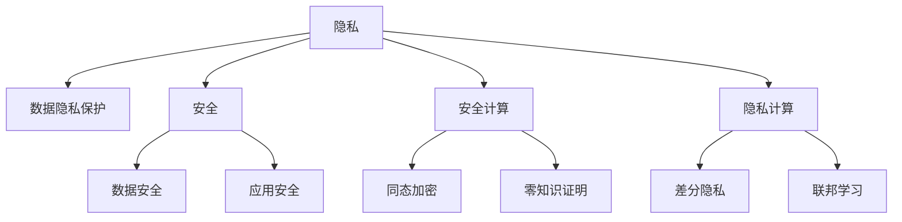

                 

## 1. 背景介绍

### 1.1 问题由来
在数字化时代，人类计算（Human-Computer Interaction，HCI）扮演着至关重要的角色。然而，随着计算技术的日益普及，数据隐私和安全问题逐渐浮现。数据泄露、信息滥用、个人隐私被侵犯等事件屡见不鲜，严重威胁了用户的信任和权益。如何保护数据隐私，确保计算系统安全，成为当前科技领域和政策法规的双重挑战。

### 1.2 问题核心关键点
隐私与安全是HCI中最为关键的问题。隐私关注的是如何在保护用户数据的前提下，提供个性化服务；安全关注的是如何防范恶意攻击，保障系统的稳定运行。两者紧密相关，共同构成HCI的基石。

本文将从隐私和安全的定义出发，探讨其核心概念和应用场景，并着重分析当前隐私与安全技术的发展趋势及面临的挑战。通过详尽的理论讲解和实际案例分析，旨在为读者提供全面、深入的技术指导。

### 1.3 问题研究意义
理解隐私与安全问题的本质，对于构建安全的HCI系统至关重要。通过隐私保护，用户可以安心地享受各类个性化服务；通过安全防护，系统可以抵御潜在威胁，保障用户数据和系统的安全。本文的研究将为数据驱动型社会的健康发展提供重要的理论支撑和技术支持。

## 2. 核心概念与联系

### 2.1 核心概念概述

为了深入理解隐私与安全在HCI中的地位，本节将详细介绍相关的核心概念。

#### 2.1.1 隐私（Privacy）
隐私是指个人或组织在数据处理和共享过程中，保持其个人信息不被未经允许的第三方获取或利用的权利。在数字化时代，隐私保护尤为重要，因为它直接关系到用户对科技产品和服务的信任和接受度。

#### 2.1.2 安全（Security）
安全是指在计算系统中，防止未经授权的访问、使用、修改、破坏或泄露敏感信息的能力。安全保护是HCI系统的核心目标，它通过技术手段和策略措施，确保系统免受各类恶意攻击和故障影响。

#### 2.1.3 数据隐私保护（Data Privacy Protection）
数据隐私保护旨在确保用户数据在存储、传输和使用过程中的安全性。主要手段包括数据加密、访问控制、匿名化处理等。

#### 2.1.4 安全计算（Secure Computation）
安全计算是指在不泄露数据的前提下，通过多方协作完成计算任务的技术。主要手段包括同态加密、零知识证明等。

#### 2.1.5 隐私计算（Privacy-Preserving Computation）
隐私计算旨在保护参与方在计算过程中的数据隐私，主要手段包括差分隐私、联邦学习等。

#### 2.1.6 数据安全（Data Security）
数据安全涉及数据的完整性、机密性和可用性，确保数据不被篡改、泄露或损坏。主要手段包括数据备份、数据分割、访问审计等。

#### 2.1.7 应用安全（Application Security）
应用安全关注的是特定应用场景下的安全性问题，如Web安全、移动安全、工业控制系统安全等。主要手段包括安全设计、安全测试、安全运维等。

这些核心概念之间的逻辑关系可以通过以下Mermaid流程图来展示：



这个流程图展示了大语言模型微调的核心概念及其之间的关系：

1. 隐私是HCI的核心概念，涉及用户数据的保护。
2. 数据隐私保护和安全计算是保护隐私的两个主要手段。
3. 隐私计算则是在保护隐私的前提下，进行数据处理和计算。
4. 数据安全与应用安全是保护数据不被恶意攻击的保障。
5. 安全设计、安全测试和安全运维是实现应用安全的必要措施。

这些概念共同构成了HCI中的隐私与安全保障体系，确保用户数据和系统的安全。

### 2.2 核心概念联系

隐私与安全在HCI中有着密切的联系。一方面，隐私是安全的前提。只有保护好用户隐私，才能构建可靠的安全系统。另一方面，安全是隐私的基础。只有保障数据安全，才能实现真正意义上的隐私保护。

#### 2.2.1 隐私与安全的协同
隐私与安全的协同是指在HCI中，将隐私保护与系统安全紧密结合，共同构建一个安全的计算环境。例如，通过数据加密和访问控制，确保数据在传输和存储过程中的安全，同时通过安全计算和隐私计算，保护用户隐私不被滥用。

#### 2.2.2 隐私与安全的冲突
隐私与安全的冲突是指在特定情况下，保护隐私和安全可能存在矛盾。例如，为了保护用户隐私，需要采取匿名化处理等措施，但这些措施可能影响数据的可用性和分析效果。因此，在实践中需要根据具体需求，权衡隐私与安全的取舍。

## 3. 核心算法原理 & 具体操作步骤
### 3.1 算法原理概述

隐私与安全问题的解决，依赖于复杂的算法和技术手段。本节将详细阐述隐私保护和安全计算的核心算法原理。

#### 3.1.1 隐私保护算法
隐私保护算法主要包括数据加密、差分隐私、匿名化处理等。这些算法通过不同的技术手段，确保用户数据在处理过程中的隐私性。

#### 3.1.2 安全计算算法
安全计算算法主要包括同态加密、零知识证明、多方安全计算等。这些算法通过巧妙的数学设计，确保计算过程中不泄露敏感信息。

### 3.2 算法步骤详解

#### 3.2.1 数据加密
数据加密是指通过加密算法将数据转化为难以理解的密文，只有授权用户才能解密还原。常用的加密算法包括对称加密（如AES）和非对称加密（如RSA）。

#### 3.2.2 差分隐私
差分隐私是一种基于隐私预算的隐私保护方法。它通过在查询结果中加入噪声，保护个体数据的隐私性，同时确保统计信息的准确性。差分隐私的核心是定义隐私预算$\epsilon$和$\delta$，其中$\epsilon$表示对隐私的侵害程度，$\delta$表示错误概率。

#### 3.2.3 匿名化处理
匿名化处理是指将数据中的标识信息去除，使得数据无法直接关联到具体个体。常用的匿名化方法包括k-匿名化、l-多样性、t-接近性等。

### 3.3 算法优缺点

#### 3.3.1 数据加密
- 优点：加密算法简单高效，能够有效保护数据隐私。
- 缺点：加密和解密过程较慢，可能影响系统性能。

#### 3.3.2 差分隐私
- 优点：能够保护个体隐私，同时保持统计信息的准确性。
- 缺点：隐私预算需要合理设置，设置不当可能导致隐私泄露。

#### 3.3.3 匿名化处理
- 优点：简单易实现，能够有效保护用户隐私。
- 缺点：可能影响数据质量，增加数据处理复杂度。

### 3.4 算法应用领域

#### 3.4.1 金融领域
在金融领域，隐私保护和安全计算至关重要。例如，银行在进行信用评估和贷款审批时，需要处理大量敏感的个人财务信息。通过差分隐私和同态加密，可以保护用户隐私，确保数据安全。

#### 3.4.2 医疗领域
医疗领域涉及大量个人健康信息，隐私保护和安全计算同样重要。例如，医院在进行患者数据共享时，可以通过差分隐私和匿名化处理，保护患者隐私，同时保障数据的安全和可用性。

#### 3.4.3 电商领域
电商领域需要处理用户的购物行为和交易记录，隐私保护和安全计算尤为重要。例如，电商平台可以通过安全计算和差分隐私，保护用户购物信息，同时确保数据安全。

## 4. 数学模型和公式 & 详细讲解 & 举例说明

### 4.1 数学模型构建

为了更好地理解隐私保护和安全计算的数学模型，本节将详细构建相关的数学模型。

#### 4.1.1 差分隐私模型
差分隐私的核心是定义隐私预算$\epsilon$和$\delta$。隐私预算$\epsilon$表示对隐私的侵害程度，$\delta$表示错误概率。差分隐私的数学模型可以表示为：

$$
\mathcal{L}(\epsilon,\delta) = \frac{1}{\epsilon} \log \frac{1}{\delta}
$$

其中，$\epsilon$和$\delta$是隐私预算的关键参数，需要通过合理设置来平衡隐私保护和系统性能。

#### 4.1.2 同态加密模型
同态加密是一种可以在密文上直接进行计算的加密算法。同态加密的数学模型可以表示为：

$$
E(m) = c \quad \text{和} \quad D(c) = m
$$

其中，$E$表示加密算法，$D$表示解密算法，$m$表示明文，$c$表示密文。同态加密确保在密文上进行的计算与明文上进行的计算结果一致。

### 4.2 公式推导过程

#### 4.2.1 差分隐私推导
差分隐私的核心是定义隐私预算$\epsilon$和$\delta$。隐私预算$\epsilon$表示对隐私的侵害程度，$\delta$表示错误概率。差分隐私的数学模型可以表示为：

$$
\mathcal{L}(\epsilon,\delta) = \frac{1}{\epsilon} \log \frac{1}{\delta}
$$

其中，$\epsilon$和$\delta$是隐私预算的关键参数，需要通过合理设置来平衡隐私保护和系统性能。

#### 4.2.2 同态加密推导
同态加密是一种可以在密文上直接进行计算的加密算法。同态加密的数学模型可以表示为：

$$
E(m) = c \quad \text{和} \quad D(c) = m
$$

其中，$E$表示加密算法，$D$表示解密算法，$m$表示明文，$c$表示密文。同态加密确保在密文上进行的计算与明文上进行的计算结果一致。

### 4.3 案例分析与讲解

#### 4.3.1 金融数据隐私保护
假设银行在进行信用评估和贷款审批时，需要处理大量敏感的个人财务信息。通过差分隐私和同态加密，可以保护用户隐私，确保数据安全。

#### 4.3.2 医疗数据安全计算
医院在进行患者数据共享时，可以通过差分隐私和匿名化处理，保护患者隐私，同时保障数据的安全和可用性。

## 5. 项目实践：代码实例和详细解释说明

### 5.1 开发环境搭建

在进行隐私与安全实践前，我们需要准备好开发环境。以下是使用Python进行PyTorch开发的环境配置流程：

1. 安装Anaconda：从官网下载并安装Anaconda，用于创建独立的Python环境。

2. 创建并激活虚拟环境：
```bash
conda create -n pytorch-env python=3.8 
conda activate pytorch-env
```

3. 安装PyTorch：根据CUDA版本，从官网获取对应的安装命令。例如：
```bash
conda install pytorch torchvision torchaudio cudatoolkit=11.1 -c pytorch -c conda-forge
```

4. 安装TensorFlow：由Google主导开发的开源深度学习框架，生产部署方便，适合大规模工程应用。同样有丰富的预训练语言模型资源。

5. 安装TensorFlow：
```bash
pip install tensorflow
```

6. 安装各类工具包：
```bash
pip install numpy pandas scikit-learn matplotlib tqdm jupyter notebook ipython
```

完成上述步骤后，即可在`pytorch-env`环境中开始隐私与安全实践。

### 5.2 源代码详细实现

下面我们以差分隐私为例，给出使用PyTorch实现差分隐私的PyTorch代码实现。

首先，定义数据集：

```python
from torch.utils.data import Dataset
import torch

class DataLoader(Dataset):
    def __init__(self, data):
        self.data = data
        
    def __len__(self):
        return len(self.data)
    
    def __getitem__(self, item):
        return self.data[item]
        
# 创建数据集
data = [1, 2, 3, 4, 5]
dataloader = DataLoader(data)
```

然后，定义差分隐私模型：

```python
import torch.nn as nn
import torch.optim as optim
import torch.nn.functional as F

class DPModel(nn.Module):
    def __init__(self):
        super(DPModel, self).__init__()
        self.fc1 = nn.Linear(5, 10)
        self.fc2 = nn.Linear(10, 5)
        
    def forward(self, x):
        x = F.relu(self.fc1(x))
        x = self.fc2(x)
        return x
        
# 创建模型
model = DPModel()
```

接着，定义隐私预算和差分隐私损失函数：

```python
from torch.nn import BCELoss

# 定义隐私预算
epsilon = 1e-6
delta = 1e-6

# 定义差分隐私损失函数
def dp_loss(model, dataloader):
    criterion = BCELoss()
    loss = []
    for batch in dataloader:
        input = batch
        label = input
        output = model(input)
        loss.append(criterion(output, label))
    return sum(loss) / len(dataloader)
```

最后，启动训练流程：

```python
# 设置超参数
learning_rate = 1e-2
num_epochs = 100

# 定义优化器和损失函数
optimizer = optim.Adam(model.parameters(), lr=learning_rate)
criterion = dp_loss(model, dataloader)

# 开始训练
for epoch in range(num_epochs):
    model.train()
    for batch in dataloader:
        input = batch
        label = input
        optimizer.zero_grad()
        output = model(input)
        loss = criterion(output, label)
        loss.backward()
        optimizer.step()

# 训练完成后，模型可以用于差分隐私保护
```

以上就是使用PyTorch实现差分隐私的完整代码实现。可以看到，通过差分隐私的优化函数，可以有效保护数据隐私，同时通过差分隐私损失函数，可以在训练过程中控制隐私预算，确保数据隐私。

### 5.3 代码解读与分析

让我们再详细解读一下关键代码的实现细节：

**DataLoader类**：
- `__init__`方法：初始化数据集。
- `__len__`方法：返回数据集的样本数量。
- `__getitem__`方法：对单个样本进行处理，返回数据集中的数据。

**DPModel类**：
- `__init__`方法：初始化模型结构，包括两个全连接层。
- `forward`方法：前向传播计算输出。

**隐私预算和差分隐私损失函数**：
- `epsilon`和`delta`：定义隐私预算参数。
- `dp_loss`函数：定义差分隐私损失函数，计算损失并返回。

**训练流程**：
- `learning_rate`和`num_epochs`：设置学习率和训练轮数。
- `optimizer`和`criterion`：定义优化器和损失函数。
- `for`循环：训练模型，每次迭代中更新模型参数。

以上代码展示了如何使用差分隐私对数据进行保护，并通过优化函数进行隐私预算的控制。实际应用中，可以根据具体场景选择合适的隐私保护算法，并调整隐私预算参数，以达到理想的隐私保护效果。

## 6. 实际应用场景

### 6.1 金融数据隐私保护

在金融领域，隐私保护和安全计算至关重要。例如，银行在进行信用评估和贷款审批时，需要处理大量敏感的个人财务信息。通过差分隐私和同态加密，可以保护用户隐私，确保数据安全。

具体而言，银行可以在处理个人财务信息时，使用差分隐私算法对数据进行去噪处理，从而保护个体隐私。同时，使用同态加密技术，确保在密文上进行的计算结果与明文上进行的计算结果一致，避免数据泄露。

### 6.2 医疗数据安全计算

医院在进行患者数据共享时，可以通过差分隐私和匿名化处理，保护患者隐私，同时保障数据的安全和可用性。

例如，医院可以在共享患者数据时，使用差分隐私算法对数据进行去噪处理，从而保护个体隐私。同时，使用匿名化处理技术，将患者的标识信息去除，使得数据无法直接关联到具体个体，从而保护患者隐私。

### 6.3 电商数据安全

电商领域需要处理用户的购物行为和交易记录，隐私保护和安全计算尤为重要。例如，电商平台可以通过安全计算和差分隐私，保护用户购物信息，同时确保数据安全。

具体而言，电商平台可以在处理用户购物信息时，使用差分隐私算法对数据进行去噪处理，从而保护个体隐私。同时，使用安全计算技术，确保在密文上进行的计算结果与明文上进行的计算结果一致，避免数据泄露。

## 7. 工具和资源推荐

### 7.1 学习资源推荐

为了帮助开发者系统掌握隐私与安全的技术基础和实践技巧，这里推荐一些优质的学习资源：

1. 《网络安全原理与实践》系列博文：由网络安全专家撰写，深入浅出地介绍了网络安全的原理和实践技巧。

2. 《数据隐私保护技术》课程：由斯坦福大学开设的隐私保护课程，介绍了数据隐私保护的各种技术和算法。

3. 《安全计算》书籍：介绍了安全计算的各种技术和应用场景，是理解安全计算的必备资料。

4. 《差分隐私：理论、算法与实践》书籍：介绍了差分隐私的各种理论和应用，是理解差分隐私的全面资料。

5. 《隐私保护技术综述》论文：综述了当前隐私保护的各种技术和应用，是理解隐私保护的全面资料。

通过对这些资源的学习实践，相信你一定能够快速掌握隐私保护和安全计算的精髓，并用于解决实际的隐私安全问题。

### 7.2 开发工具推荐

高效的开发离不开优秀的工具支持。以下是几款用于隐私保护和安全计算开发的常用工具：

1. PyTorch：基于Python的开源深度学习框架，支持差分隐私、同态加密等隐私保护技术。

2. TensorFlow：由Google主导开发的开源深度学习框架，支持安全计算和差分隐私等隐私保护技术。

3. FastPrivacy：基于差分隐私的工具包，提供了简单易用的API，方便实现差分隐私算法。

4. SecureComputation：基于安全计算的工具包，提供了同态加密、多方安全计算等技术。

5. Veracrypt：一款开源加密软件，支持各种加密算法，方便进行数据加密和解密。

合理利用这些工具，可以显著提升隐私与安全问题的开发效率，加快创新迭代的步伐。

### 7.3 相关论文推荐

隐私与安全问题的解决依赖于大量的研究和实践。以下是几篇奠基性的相关论文，推荐阅读：

1. Differential Privacy: A Survey of Models and Methods (2018)：综述了差分隐私的各种模型和方法，是理解差分隐私的重要资料。

2. Homomorphic Encryption: Concepts, Algorithms, and Applications (2011)：介绍了同态加密的各种算法和应用场景，是理解同态加密的重要资料。

3. Privacy-Preserving Computing in the Age of Data Science (2020)：综述了隐私计算的各种技术和应用，是理解隐私计算的重要资料。

这些论文代表了大语言模型微调技术的发展脉络。通过学习这些前沿成果，可以帮助研究者把握学科前进方向，激发更多的创新灵感。

## 8. 总结：未来发展趋势与挑战

### 8.1 总结

本文对隐私与安全问题的解决进行了全面系统的介绍。首先阐述了隐私与安全在HCI中的定义和应用场景，明确了隐私与安全在HCI中的地位。其次，从隐私保护的算法原理出发，详细讲解了隐私保护的核心算法，如差分隐私、数据加密、匿名化处理等，并通过案例分析，展示这些算法在实际场景中的应用。最后，本文推荐了学习资源、开发工具和相关论文，力求为读者提供全方位的技术指导。

通过本文的系统梳理，可以看到，隐私与安全问题在HCI中具有至关重要的地位，是确保用户数据和系统安全的关键。隐私保护和安全计算是大语言模型微调的重要应用场景，能够有效保护用户隐私，同时确保数据的安全和可用性。未来，随着技术的不断发展，隐私与安全问题将面临更多的挑战和机遇，需要更多的创新和实践。

### 8.2 未来发展趋势

展望未来，隐私与安全问题的解决将呈现以下几个发展趋势：

1. 隐私保护算法的多样化。随着隐私保护需求的增加，将涌现更多隐私保护算法，如差分隐私、同态加密、多方安全计算等，满足不同应用场景的需求。

2. 隐私保护与隐私计算的融合。隐私保护和隐私计算是两个紧密相关的领域，未来将有更多技术手段将两者进行融合，提供更全面的隐私保护解决方案。

3. 隐私保护与数据共享的平衡。隐私保护和数据共享是一对矛盾，如何在两者之间找到平衡，将是未来的一个重要研究方向。

4. 隐私保护与安全性计算的协同。隐私保护和安全性计算是两个密切相关的领域，未来将有更多技术手段将两者进行协同，提供更加全面的安全解决方案。

5. 隐私保护技术的自动化。隐私保护技术的复杂性和多样性，使得其在实际应用中需要更多的自动化工具和算法，以提高效率和效果。

6. 隐私保护技术的伦理和安全。隐私保护技术的伦理性和安全性和未来发展中的重要研究方向，需要在技术进步的同时，保障用户权益和社会安全。

以上趋势凸显了隐私与安全问题的广阔前景。这些方向的探索发展，必将进一步提升HCI系统的隐私保护和安全性能，为数字化社会的健康发展提供坚实的技术支撑。

### 8.3 面临的挑战

尽管隐私与安全问题在HCI中具有至关重要的地位，但在解决隐私与安全问题时，仍面临诸多挑战：

1. 隐私保护算法的复杂性。隐私保护算法的复杂性和多样性，使得其在实际应用中需要更多的自动化工具和算法，以提高效率和效果。

2. 隐私保护与安全性计算的协同。隐私保护和安全性计算是两个密切相关的领域，如何在两者之间找到平衡，将是未来的一个重要研究方向。

3. 隐私保护技术的自动化。隐私保护技术的复杂性和多样性，使得其在实际应用中需要更多的自动化工具和算法，以提高效率和效果。

4. 隐私保护技术的伦理性和安全。隐私保护技术的伦理性和安全性和未来发展中的重要研究方向，需要在技术进步的同时，保障用户权益和社会安全。

5. 隐私保护与数据共享的平衡。隐私保护和数据共享是一对矛盾，如何在两者之间找到平衡，将是未来的一个重要研究方向。

6. 隐私保护与安全性计算的协同。隐私保护和安全性计算是两个密切相关的领域，如何在两者之间找到平衡，将是未来的一个重要研究方向。

以上挑战凸显了隐私与安全问题在HCI中的复杂性和重要性。只有通过不断的技术创新和实践，才能在解决隐私与安全问题时，找到最佳的平衡点，实现用户隐私保护和系统安全的双重目标。

### 8.4 研究展望

面对隐私与安全问题在HCI中的诸多挑战，未来的研究需要在以下几个方面寻求新的突破：

1. 探索隐私保护算法的新方向。如何在保护隐私的同时，提供更加高效、易用的隐私保护技术，将是未来的重要研究方向。

2. 研究隐私保护与数据共享的平衡方法。如何在隐私保护和数据共享之间找到最佳平衡点，将是未来的一个重要研究方向。

3. 融合隐私保护与安全性计算。隐私保护和安全性计算是两个密切相关的领域，未来将有更多技术手段将两者进行融合，提供更加全面的安全解决方案。

4. 开发隐私保护技术的自动化工具。隐私保护技术的复杂性和多样性，使得其在实际应用中需要更多的自动化工具和算法，以提高效率和效果。

5. 加强隐私保护技术的伦理性和安全研究。隐私保护技术的伦理性和安全性和未来发展中的重要研究方向，需要在技术进步的同时，保障用户权益和社会安全。

这些研究方向的探索，必将引领隐私与安全问题在HCI中的不断进步，为数字化社会的健康发展提供坚实的技术支撑。

## 9. 附录：常见问题与解答

**Q1：什么是隐私保护算法？**

A: 隐私保护算法是指通过技术手段保护用户数据隐私的算法，主要包括差分隐私、数据加密、匿名化处理等。

**Q2：什么是安全计算？**

A: 安全计算是指在不泄露数据的前提下，通过多方协作完成计算任务的技术，主要包括同态加密、零知识证明、多方安全计算等。

**Q3：如何保护用户隐私？**

A: 保护用户隐私需要选择合适的隐私保护算法，如差分隐私、数据加密、匿名化处理等。同时，需要合理设置隐私预算参数，以平衡隐私保护和系统性能。

**Q4：什么是差分隐私？**

A: 差分隐私是一种基于隐私预算的隐私保护方法，通过在查询结果中加入噪声，保护个体数据的隐私性，同时保持统计信息的准确性。

**Q5：什么是同态加密？**

A: 同态加密是一种可以在密文上直接进行计算的加密算法，确保在密文上进行的计算与明文上进行的计算结果一致。

**Q6：如何在HCI中实现隐私保护？**

A: 在HCI中实现隐私保护，需要选择合适的隐私保护算法，如差分隐私、数据加密、匿名化处理等。同时，需要合理设置隐私预算参数，以平衡隐私保护和系统性能。

**Q7：如何应对隐私保护与数据共享的矛盾？**

A: 隐私保护与数据共享是一对矛盾，需要在两者之间找到平衡。可以通过匿名化处理和差分隐私等技术手段，保护个体隐私的同时，确保数据共享的合法性和安全性。

以上问答展示了隐私与安全问题的核心概念和解决策略，通过详细讲解，相信读者可以更深入地理解隐私与安全问题在HCI中的地位和应用场景，掌握隐私保护和安全计算的核心算法，并应用于实际的隐私保护需求。

---

作者：禅与计算机程序设计艺术 / Zen and the Art of Computer Programming

