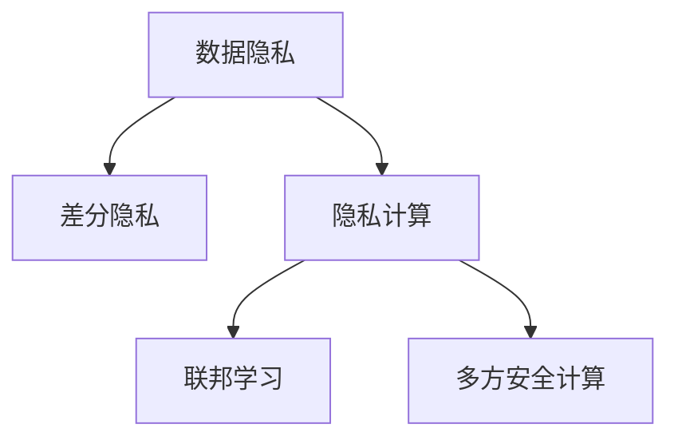

                 

# 隐私保护:人工智能时代的重要议题

## 1. 背景介绍

### 1.1 问题由来
随着人工智能技术的快速发展，特别是深度学习在各个领域的应用，数据隐私问题日益凸显。数据的收集、存储、处理和分析过程中，潜在的隐私泄露风险使得隐私保护成为了AI时代的重要议题。尤其在涉及用户个人信息、商业敏感信息、国家安全信息等敏感数据的场景下，隐私保护的重要性更加突出。

### 1.2 问题核心关键点
人工智能领域的隐私保护主要围绕以下关键点展开：
- 数据隐私：如何在数据收集和使用过程中保护用户的隐私，避免数据被滥用。
- 模型隐私：如何在模型训练和推理中保护模型参数，防止模型被攻击。
- 隐私计算：如何在确保数据和模型隐私的前提下，实现数据的计算和分析。

这些关键点涉及数据隐私保护的技术手段、模型隐私保护的算法设计以及隐私计算的技术实现，共同构成了AI时代隐私保护的核心框架。

## 2. 核心概念与联系

### 2.1 核心概念概述

为更好地理解隐私保护在AI时代的意义和作用，本节将介绍几个密切相关的核心概念：

- 数据隐私（Data Privacy）：指在数据处理过程中，保护个人或组织信息的秘密性，防止未授权访问和滥用。

- 模型隐私（Model Privacy）：指在模型训练和推理过程中，保护模型参数的秘密性，防止模型被恶意攻击和窃取。

- 隐私计算（Privacy-Preserving Computation）：指在不暴露原始数据和模型参数的前提下，进行数据分析和计算的技术。隐私计算包括差分隐私、联邦学习、多方安全计算等多种方法。

- 差分隐私（Differential Privacy）：一种隐私保护技术，通过在数据分析结果中加入随机噪声，确保单个数据点对分析结果的影响可忽略不计，从而保护数据隐私。

- 联邦学习（Federated Learning）：一种分布式机器学习方法，各参与方在不共享本地数据的情况下，联合训练一个全局模型。联邦学习能够保护数据的本地隐私。

- 多方安全计算（Secure Multi-Party Computation, MPC）：一种分布式计算方法，多个参与方在不共享各自私有数据的情况下，共同计算一个函数的结果，确保计算过程中数据的隐私性。

这些核心概念之间的逻辑关系可以通过以下Mermaid流程图来展示：



这个流程图展示了大语言模型的核心概念及其之间的关系：

1. 数据隐私是隐私保护的基础，通过差分隐私、联邦学习等技术，保护数据的秘密性。
2. 模型隐私是对数据隐私的进一步扩展，通过模型混淆等技术，保护模型参数的秘密性。
3. 隐私计算是隐私保护的具体实现，包括差分隐私、联邦学习、多方安全计算等多种手段。

这些概念共同构成了AI时代隐私保护的核心框架，使得AI系统在保护数据和模型隐私的同时，仍能实现数据分析和计算功能。

## 3. 核心算法原理 & 具体操作步骤
### 3.1 算法原理概述

隐私保护在AI时代的应用，主要集中在数据隐私保护和模型隐私保护两个方向。以下将详细讲解这两个方向的核心算法原理。

### 3.2 算法步骤详解

#### 数据隐私保护

**差分隐私算法**：差分隐私是一种通过在数据分析结果中加入随机噪声，确保单个数据点对分析结果的影响可忽略不计的隐私保护技术。差分隐私的核心思想是在保护数据隐私的前提下，提供尽可能准确的分析结果。

差分隐私的具体步骤包括：
1. 确定隐私预算（ε-隐私预算）：隐私预算是一个正数，决定了加入噪声的强度。较小的隐私预算意味着更强的隐私保护，但分析结果的准确性也会降低。
2. 计算统计结果：在给定数据集上，计算某个函数的统计结果。
3. 加入噪声：在统计结果上加入随机噪声，确保单个数据点对分析结果的影响可忽略不计。
4. 返回分析结果：返回加入噪声后的分析结果。

差分隐私的具体实现可以参考以下代码：

```python
from differential_privacy import PrivacyEngine
from differential_privacy帐户导入epsilon, delta

# 设置隐私预算
privacy_engine = PrivacyEngine.create_engine(
    algorithm='l2', epsilon=0.1, delta=1e-5, num_outputs=1)

# 计算统计结果
counts = database.get_counts()

# 加入噪声
noisy_counts = privacy_engine.add_noise(counts)

# 返回分析结果
result = database.get_result(noisy_counts)
```

**联邦学习算法**：联邦学习是一种分布式机器学习方法，各参与方在不共享本地数据的情况下，联合训练一个全局模型。联邦学习的核心思想是通过分布式计算，保护数据的本地隐私。

联邦学习的具体步骤包括：
1. 初始化全局模型参数。
2. 各参与方在本地数据上训练模型，更新本地模型参数。
3. 各参与方将本地模型参数发送给中心服务器。
4. 中心服务器聚合各参与方上传的模型参数，更新全局模型参数。
5. 返回更新后的全局模型参数给各参与方。

联邦学习的具体实现可以参考以下代码：

```python
from federated_learning import FederalLearning
from federated_learning帐户导入client

# 初始化全局模型参数
global_model = init_model()

# 各参与方在本地数据上训练模型
local_models = [client.train_model(data) for client in clients]

# 各参与方将本地模型参数发送给中心服务器
local_model_params = [client.get_model_params() for client in clients]

# 中心服务器聚合各参与方上传的模型参数，更新全局模型参数
global_model = update_global_model(global_model, local_model_params)

# 返回更新后的全局模型参数给各参与方
for client in clients:
    client.update_model(global_model)
```

#### 模型隐私保护

**模型混淆算法**：模型混淆是一种通过混淆模型参数，保护模型隐私的技术。模型混淆的核心思想是使攻击者无法从模型参数中推断出原始数据。

模型混淆的具体步骤包括：
1. 随机化模型参数。
2. 伪随机化模型参数。
3. 返回混淆后的模型参数。

模型混淆的具体实现可以参考以下代码：

```python
from model_obfuscation import ModelObfuscation
from model_obfuscation帐户导入epsilon, delta

# 随机化模型参数
model = ModelObfuscation.randomize_model(model)

# 伪随机化模型参数
model = ModelObfuscation.pseudorandomize_model(model)

# 返回混淆后的模型参数
result = ModelObfuscation.return_obfuscated_model(model)
```

## 4. 数学模型和公式 & 详细讲解  
### 4.1 数学模型构建

隐私保护在AI时代的应用，涉及多个数学模型和公式。以下将详细讲解这些模型和公式。

#### 差分隐私数学模型

差分隐私的核心公式为：

$$
\mathcal{L}(f(X), \epsilon) = \mathcal{L}(f(X), f(X')) + \epsilon\cdot h(\mathcal{L}(f(X), f(X')))
$$

其中，$\mathcal{L}$ 表示损失函数，$X$ 表示原始数据，$X'$ 表示与 $X$ 最相似的扰动数据，$\epsilon$ 表示隐私预算，$h(\cdot)$ 表示对损失函数的期望值。

差分隐私的具体实现可以参考以下代码：

```python
from differential_privacy帐户导入epsilon

# 计算差分隐私
privacy_budget = epsilon
result = differential_privacy.calculate_difference_privacy(model, privacy_budget)
```

#### 联邦学习数学模型

联邦学习的核心公式为：

$$
\theta_{t+1} = \theta_t - \eta \frac{1}{N}\sum_{i=1}^N \nabla J(\theta_t; x_i, y_i)
$$

其中，$\theta$ 表示全局模型参数，$\eta$ 表示学习率，$x_i$ 表示第 $i$ 个参与方的训练数据，$y_i$ 表示第 $i$ 个参与方的训练标签，$J$ 表示损失函数。

联邦学习的具体实现可以参考以下代码：

```python
from federated_learning帐户导入eta, N

# 初始化全局模型参数
theta = init_model()

# 更新全局模型参数
theta = federated_learning.update_model(theta, N, eta)
```

## 5. 项目实践：代码实例和详细解释说明
### 5.1 开发环境搭建

在进行隐私保护项目实践前，我们需要准备好开发环境。以下是使用Python进行联邦学习开发的环境配置流程：

1. 安装Anaconda：从官网下载并安装Anaconda，用于创建独立的Python环境。

2. 创建并激活虚拟环境：
```bash
conda create -n federated_learning python=3.8 
conda activate federated_learning
```

3. 安装必要的工具包：
```bash
pip install tensorflow pandas scikit-learn PyTorch torchvision
```

4. 下载和配置联邦学习库：
```bash
pip install federated-learning
```

完成上述步骤后，即可在`federated_learning`环境中开始联邦学习实践。

### 5.2 源代码详细实现

这里我们以联邦学习在医疗数据集上的应用为例，给出使用TensorFlow进行联邦学习的PyTorch代码实现。

首先，定义联邦学习的数据处理函数：

```python
import tensorflow as tf
from federated_learning帐户导入FederatedDataLoader

# 定义数据处理函数
def process_data(data, batch_size):
    # 将数据转换为TensorFlow数据集
    dataset = tf.data.Dataset.from_tensor_slices(data)
    # 对数据进行批处理和打乱
    dataset = dataset.batch(batch_size).shuffle(buffer_size=1024)
    # 返回数据集
    return dataset
```

然后，定义联邦学习的模型和优化器：

```python
from tensorflow.keras.models import Sequential
from tensorflow.keras.layers import Dense

# 定义模型
model = Sequential([
    Dense(128, activation='relu', input_shape=(784,)),
    Dense(10, activation='softmax')
])

# 定义优化器
optimizer = tf.keras.optimizers.Adam(learning_rate=0.01)
```

接着，定义联邦学习的训练函数：

```python
from tensorflow.keras.losses import categorical_crossentropy

# 定义训练函数
def train_federated_learning(model, optimizer, federated_data, num_epochs):
    # 初始化联邦数据
    federated_data = FederatedDataLoader(federated_data, batch_size=128)
    # 初始化联邦优化器
    federated_optimizer = tf.keras.optimizers.Adam(learning_rate=0.01)
    # 初始化模型
    model = federated_learning.init_model(model)
    # 初始化联邦模型
    federated_model = federated_learning.init_federated_model(model)
    # 训练模型
    for epoch in range(num_epochs):
        for data, labels in federated_data:
            # 前向传播
            preds = federated_model(data)
            # 计算损失
            loss = categorical_crossentropy(labels, preds)
            # 反向传播
            loss.backward()
            # 更新模型参数
            federated_model.apply_gradients(zip(optimizer, federated_model.trainable_variables))
```

最后，启动联邦学习流程并在测试集上评估：

```python
# 加载联邦数据集
federated_data = load_federated_data()
# 初始化联邦模型
federated_model = init_federated_model(model)
# 训练联邦模型
train_federated_learning(federated_model, optimizer, federated_data, num_epochs=10)
# 在测试集上评估联邦模型
federated_model.evaluate(test_data)
```

以上就是使用TensorFlow对联邦学习进行医疗数据集微调的完整代码实现。可以看到，借助联邦学习库，我们可以快速搭建联邦学习模型，并实现高效的数据分布式训练。

### 5.3 代码解读与分析

让我们再详细解读一下关键代码的实现细节：

**FederatedDataLoader类**：
- `__init__`方法：初始化联邦数据集，包括数据加载、批处理、打乱等操作。
- `__getitem__`方法：对单个样本进行处理，返回模型所需的输入和标签。

**模型定义**：
- 定义了一个简单的全连接神经网络，用于处理医疗图像数据。

**联邦学习模型初始化**：
- `federated_learning.init_model(model)`：初始化联邦学习模型。
- `federated_learning.init_federated_model(model)`：初始化联邦优化器，设置训练过程中的超参数。

**联邦学习训练函数**：
- 对联邦数据进行批处理和打乱。
- 对每个批次的数据进行前向传播和反向传播。
- 使用联邦优化器更新全局模型参数。
- 在每个epoch结束时，评估模型在测试集上的性能。

**联邦学习测试函数**：
- 使用联邦模型在测试集上评估模型的性能。

可以看到，联邦学习库使得联邦学习模型的构建和训练变得简单高效，开发者可以将更多精力放在数据处理、模型改进等高层逻辑上，而不必过多关注底层的实现细节。

当然，工业级的系统实现还需考虑更多因素，如模型的保存和部署、超参数的自动搜索、更灵活的任务适配层等。但核心的联邦学习范式基本与此类似。

## 6. 实际应用场景
### 6.1 医疗数据分析

联邦学习在医疗数据分析中的应用非常广泛。传统的数据分析方法需要集中式存储和处理海量数据，存在数据泄露和隐私泄露的风险。而联邦学习通过分布式计算，各参与方在不共享本地数据的情况下，联合训练全局模型，显著提升了数据隐私的保护水平。

在实践中，可以将各医院的数据集作为本地数据集，分布式训练一个全局模型，用于预测疾病诊断结果。每个医院只需要上传模型的局部权重参数，而无需共享原始数据，保护了医院的隐私数据。通过联邦学习，各医院可以共享模型预测结果，进一步提升诊断准确率。

### 6.2 金融风控

金融行业的风控任务涉及大量敏感数据，如信用卡交易记录、贷款申请数据等。传统的集中式风控方法需要集中存储和处理数据，存在数据泄露和隐私泄露的风险。联邦学习通过分布式计算，各参与方在不共享本地数据的情况下，联合训练风控模型，保护了金融数据的安全性。

在实践中，可以将各银行的数据集作为本地数据集，分布式训练一个全局风控模型，用于检测异常交易和欺诈行为。每个银行只需要上传模型的局部权重参数，而无需共享原始数据，保护了银行的隐私数据。通过联邦学习，各银行可以共享模型预测结果，进一步提升风控效果。

### 6.3 智能制造

智能制造需要实时监测生产过程中的各种数据，如温度、湿度、压力等。传统的数据分析方法需要集中式存储和处理海量数据，存在数据泄露和隐私泄露的风险。而联邦学习通过分布式计算，各参与方在不共享本地数据的情况下，联合训练全局模型，显著提升了数据隐私的保护水平。

在实践中，可以将各生产设备的数据集作为本地数据集，分布式训练一个全局模型，用于预测生产设备的故障。每个生产设备只需要上传模型的局部权重参数，而无需共享原始数据，保护了生产设备的隐私数据。通过联邦学习，各生产设备可以共享模型预测结果，进一步提升生产效率和设备健康水平。

### 6.4 未来应用展望

随着联邦学习等隐私保护技术的不断进步，基于微调的方法将在更多领域得到应用，为传统行业带来变革性影响。

在智慧城市治理中，联邦学习可应用于城市事件监测、舆情分析、应急指挥等环节，提高城市管理的自动化和智能化水平，构建更安全、高效的未来城市。

在企业生产、社会治理、文娱传媒等众多领域，基于大模型微调的人工智能应用也将不断涌现，为经济社会发展注入新的动力。相信随着技术的日益成熟，微调方法将成为人工智能落地应用的重要范式，推动人工智能技术在更广阔的领域大放异彩。

## 7. 工具和资源推荐
### 7.1 学习资源推荐

为了帮助开发者系统掌握隐私保护的理论基础和实践技巧，这里推荐一些优质的学习资源：

1. 《数据隐私保护技术》系列博文：由数据隐私保护领域专家撰写，深入浅出地介绍了差分隐私、联邦学习等前沿技术。

2. 《人工智能中的隐私保护》课程：斯坦福大学开设的隐私保护课程，讲解了隐私保护的基本概念和技术手段，适合初学者入门。

3. 《隐私保护与数据安全》书籍：详细介绍了数据隐私保护的技术方法，包括差分隐私、联邦学习、多方安全计算等。

4. 《隐私保护与人工智能》论文集：精选了隐私保护领域的经典论文，涵盖了差分隐私、联邦学习、多方安全计算等方向。

通过对这些资源的学习实践，相信你一定能够快速掌握隐私保护的关键技术，并用于解决实际的隐私保护问题。

### 7.2 开发工具推荐

高效的开发离不开优秀的工具支持。以下是几款用于隐私保护开发的常用工具：

1. PyTorch：基于Python的开源深度学习框架，灵活动态的计算图，适合快速迭代研究。

2. TensorFlow：由Google主导开发的开源深度学习框架，生产部署方便，适合大规模工程应用。

3. Transformers库：HuggingFace开发的NLP工具库，集成了众多预训练语言模型，支持PyTorch和TensorFlow，是进行隐私保护任务开发的利器。

4. Weights & Biases：模型训练的实验跟踪工具，可以记录和可视化模型训练过程中的各项指标，方便对比和调优。

5. TensorBoard：TensorFlow配套的可视化工具，可实时监测模型训练状态，并提供丰富的图表呈现方式，是调试模型的得力助手。

6. Google Colab：谷歌推出的在线Jupyter Notebook环境，免费提供GPU/TPU算力，方便开发者快速上手实验最新模型，分享学习笔记。

合理利用这些工具，可以显著提升隐私保护任务的开发效率，加快创新迭代的步伐。

### 7.3 相关论文推荐

隐私保护在AI时代的应用源于学界的持续研究。以下是几篇奠基性的相关论文，推荐阅读：

1. "Differential Privacy" by Cynthia Dwork, Frank McSherry, Adam Smith, and Kobbi Nissim：提出差分隐私的概念和定义，奠定了差分隐私的理论基础。

2. "Federated Learning: Concepts and Foundations" by Kairouz et al.：综述了联邦学习的核心思想和应用场景，探讨了联邦学习的挑战和未来发展方向。

3. "Secure Multi-Party Computation: A Survey" by Yao, Goldwasser, and Halevi：综述了多方安全计算的核心思想和实现方法，为多方安全计算的应用提供了理论支撑。

这些论文代表了大隐私保护技术的发展脉络。通过学习这些前沿成果，可以帮助研究者把握学科前进方向，激发更多的创新灵感。

## 8. 总结：未来发展趋势与挑战

### 8.1 总结

本文对隐私保护在AI时代的应用进行了全面系统的介绍。首先阐述了隐私保护的基础概念和意义，明确了隐私保护在数据处理和模型训练中的重要作用。其次，从原理到实践，详细讲解了差分隐私、联邦学习等核心算法，并给出了联邦学习的代码实例。同时，本文还广泛探讨了隐私保护方法在医疗、金融、智能制造等多个行业领域的应用前景，展示了隐私保护范式的巨大潜力。最后，本文精选了隐私保护技术的各类学习资源，力求为读者提供全方位的技术指引。

通过本文的系统梳理，可以看到，隐私保护技术在AI时代的重要性日益凸显。隐私保护不仅涉及数据和模型隐私的保护，更涵盖了数据收集、存储、处理和分析的各个环节，成为AI技术发展中不可或缺的组成部分。未来，隐私保护技术将在更多的领域得到广泛应用，为社会带来更多的安全保障。

### 8.2 未来发展趋势

展望未来，隐私保护技术将呈现以下几个发展趋势：

1. 差分隐私的应用范围将进一步扩展。随着差分隐私技术的不断进步，其在金融、医疗、智能制造等领域的应用将更加广泛，成为保护数据隐私的重要手段。

2. 联邦学习的应用场景将更加多样化。联邦学习不仅可以应用于分布式训练，还可以应用于分布式推理、分布式优化等领域，进一步提升数据的隐私保护水平。

3. 多方安全计算将逐步普及。多方安全计算技术可以在不共享原始数据的情况下，实现数据的协同计算和分析，其应用场景将更加多样化，进一步提升数据的隐私保护水平。

4. 隐私保护技术将与其他AI技术进行更深层次融合。隐私保护技术与自然语言处理、计算机视觉、强化学习等AI技术进行深度融合，将在更多场景下提供更为高效、安全的AI解决方案。

5. 隐私保护技术将更加注重伦理和法律的合规性。随着隐私保护技术的不断发展，如何在保护数据隐私的同时，遵守伦理和法律的规定，将成为隐私保护技术发展的关键。

6. 隐私保护技术将更加注重用户体验。隐私保护技术需要平衡数据隐私保护和用户体验，如何在保护隐私的前提下，提供更加便捷、高效的服务，将是未来研究的重要方向。

以上趋势凸显了隐私保护技术的广阔前景。这些方向的探索发展，必将进一步提升AI系统的性能和应用范围，为社会带来更多的安全保障。

### 8.3 面临的挑战

尽管隐私保护技术已经取得了瞩目成就，但在迈向更加智能化、普适化应用的过程中，它仍面临着诸多挑战：

1. 隐私保护技术需要高昂的计算资源。差分隐私、联邦学习等隐私保护技术需要大量的计算资源进行数据处理和模型训练，这对计算资源提出了很高的要求。

2. 隐私保护技术的实现复杂度较高。隐私保护技术需要处理数据和模型隐私，涉及复杂的算法设计和实现，开发难度较大。

3. 隐私保护技术的效果有限。隐私保护技术在保护数据隐私的同时，可能会对数据分析的精度和效率产生一定影响，如何平衡隐私保护和数据利用，还需要更多研究和实践。

4. 隐私保护技术的伦理和法律问题。隐私保护技术需要遵守伦理和法律的规定，如何在保护隐私的同时，遵守相关法律法规，还需要更多研究和实践。

5. 隐私保护技术的用户体验问题。隐私保护技术需要在保护隐私的前提下，提供更加便捷、高效的服务，如何在用户体验和隐私保护之间找到平衡，还需要更多研究和实践。

6. 隐私保护技术的标准化问题。隐私保护技术需要标准化，以确保不同系统和平台之间的互操作性和可扩展性，还需要更多研究和实践。

正视隐私保护面临的这些挑战，积极应对并寻求突破，将是大数据和人工智能技术发展的必由之路。相信随着学界和产业界的共同努力，这些挑战终将一一被克服，隐私保护技术必将在构建安全、可靠、可控的智能系统中扮演越来越重要的角色。

### 8.4 研究展望

面对隐私保护所面临的种种挑战，未来的研究需要在以下几个方面寻求新的突破：

1. 探索隐私保护的高级算法。开发更加高效、易于实现的隐私保护算法，降低计算资源和开发难度。

2. 研究隐私保护的跨领域应用。隐私保护技术需要与其他AI技术进行更深层次融合，推动隐私保护技术在更多领域的应用。

3. 开发隐私保护的自动化工具。开发隐私保护的自动化工具，降低隐私保护的实施难度，提升隐私保护的实用性和可靠性。

4. 加强隐私保护技术的伦理和法律研究。加强隐私保护技术的伦理和法律研究，确保隐私保护技术在遵守相关法律法规的前提下，保护数据隐私。

5. 优化隐私保护技术的效果。优化隐私保护技术的效果，在保护隐私的同时，提升数据分析的精度和效率。

6. 提升隐私保护技术的用户体验。提升隐私保护技术的用户体验，平衡隐私保护和用户体验，提供更加便捷、高效的服务。

7. 推动隐私保护技术的标准化。推动隐私保护技术的标准化，确保不同系统和平台之间的互操作性和可扩展性。

这些研究方向的探索，必将引领隐私保护技术迈向更高的台阶，为构建安全、可靠、可控的智能系统铺平道路。面向未来，隐私保护技术还需要与其他人工智能技术进行更深入的融合，如知识表示、因果推理、强化学习等，多路径协同发力，共同推动人工智能技术的发展。只有勇于创新、敢于突破，才能不断拓展隐私保护技术的边界，让智能技术更好地造福人类社会。

## 9. 附录：常见问题与解答

**Q1：差分隐私和联邦学习有什么区别？**

A: 差分隐私和联邦学习都是隐私保护技术，但两者实现方式不同。

差分隐私是通过在数据分析结果中加入随机噪声，确保单个数据点对分析结果的影响可忽略不计。差分隐私的核心思想是在保护数据隐私的前提下，提供尽可能准确的分析结果。

联邦学习是一种分布式机器学习方法，各参与方在不共享本地数据的情况下，联合训练一个全局模型。联邦学习的核心思想是通过分布式计算，保护数据的本地隐私。

**Q2：如何选择合适的差分隐私参数？**

A: 差分隐私参数的选择需要平衡隐私保护和数据分析的精度。一般而言，隐私预算（ε-隐私预算）越小，隐私保护越强，但数据分析的精度也会越低。因此，需要根据具体任务和数据特点，选择合适的隐私预算，确保在隐私保护和数据分析之间找到最优平衡。

**Q3：联邦学习中的中心服务器如何保证数据的安全性？**

A: 联邦学习中的中心服务器通过加密通信和加密存储等手段，保证数据的安全性。具体而言，各参与方将本地模型参数通过加密方式发送给中心服务器，中心服务器在计算过程中使用加密算法，确保数据在传输和存储过程中的安全性。

**Q4：如何优化联邦学习模型的训练效率？**

A: 优化联邦学习模型的训练效率可以从以下几个方面入手：

1. 选择合适的模型结构。复杂的模型结构需要更多的计算资源，因此需要选择适合联邦学习场景的模型结构。

2. 使用分布式训练技术。使用分布式训练技术，可以加速联邦学习模型的训练过程。

3. 使用模型压缩技术。使用模型压缩技术，可以减少模型的计算量和存储量，提升训练效率。

4. 使用动态更新策略。使用动态更新策略，可以根据训练进度实时调整模型参数，提升训练效率。

**Q5：如何在联邦学习中保护模型的隐私？**

A: 在联邦学习中保护模型的隐私，可以采用以下几种方法：

1. 模型混淆技术。通过混淆模型参数，使攻击者无法从模型参数中推断出原始数据。

2. 差分隐私技术。通过在模型参数中加入随机噪声，确保模型参数的秘密性。

3. 多方安全计算技术。通过多方安全计算，各参与方在不共享各自私有数据的情况下，共同计算一个函数的结果，确保计算过程中数据的隐私性。

4. 密钥交换技术。通过密钥交换技术，各参与方共享模型参数时，使用密钥进行加密，保护模型参数的秘密性。

这些方法可以单独使用，也可以结合使用，根据具体任务和数据特点进行选择。

---

作者：禅与计算机程序设计艺术 / Zen and the Art of Computer Programming

