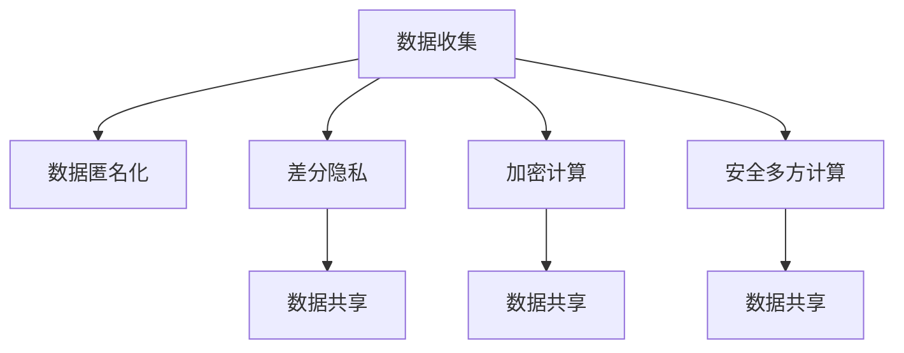

                 

# 隐私保护：保障人类计算中的数据安全

> 关键词：隐私保护, 数据安全, 人工智能, 人类计算, 数据隐私, 数据匿名化, 差分隐私, 加密计算, 安全多方计算, 数据共享

## 1. 背景介绍

### 1.1 问题由来

在数字化时代，数据成为了经济社会运行的重要基础，也是人工智能(AI)技术发展的核心要素。然而，伴随数据收集、存储和应用的广泛化，隐私保护问题日益突出。数据泄露、用户隐私滥用、个人信息被滥用等问题屡见不鲜，严重威胁到用户权益和信息安全。特别是在人工智能应用场景中，数据的隐私保护尤为重要。

人工智能技术的快速发展，极大地依赖于大量高质量数据。数据预处理、模型训练和应用推理等环节，都涉及数据的敏感处理。如何确保数据在收集、存储和使用的过程中，既能被有效利用，又能严格保护用户隐私，成为当前人工智能领域面临的重要挑战。本文将探讨隐私保护在人工智能应用中的核心技术和策略，以期为构建安全可信的AI系统提供理论支持和实践指导。

### 1.2 问题核心关键点

隐私保护在人工智能应用中，通常涉及以下几个关键问题：

- 数据匿名化：通过变换数据形式，去除或模糊用户身份信息，以降低数据被逆向识别的风险。
- 差分隐私：通过在数据处理过程中引入随机噪声，确保个体数据隐私不被泄露。
- 加密计算：采用加密技术对数据进行加密处理，使得数据仅在计算过程中暂时暴露，计算完成后自动解密。
- 安全多方计算：通过多方协作，在不共享原始数据的情况下，共同计算数据结果，保障数据隐私。
- 数据共享机制：在共享数据时，确保数据以加密形式传输，并且只能由授权用户访问。

这些问题构成了隐私保护的总体框架，需要在数据生命周期的各个阶段加以考虑和解决。

## 2. 核心概念与联系

### 2.1 核心概念概述

为更好地理解隐私保护在人工智能应用中的作用，本节将介绍几个关键概念：

- 数据隐私：指用户对其个人信息的掌控权和使用权，包括数据的收集、存储、使用和共享等环节。
- 数据匿名化：通过数据处理技术，去除或模糊化用户身份信息，使得数据无法被逆向识别。
- 差分隐私：一种数据保护技术，通过在统计数据分析中引入随机噪声，保护个体数据隐私。
- 加密计算：利用加密技术对数据进行加密处理，确保数据在传输和处理过程中的安全性。
- 安全多方计算：一种密码学技术，允许多方在不共享数据的情况下，共同计算数据结果，保障数据隐私。
- 数据共享机制：通过加密、权限控制等手段，确保数据在共享过程中的安全性。

这些概念之间的逻辑关系可以通过以下Mermaid流程图来展示：



这个流程图展示了大数据隐私保护的关键步骤：

1. 数据收集阶段，采用匿名化、差分隐私等技术保护用户隐私。
2. 数据存储和传输过程中，使用加密计算和安全多方计算保护数据安全性。
3. 数据共享时，结合加密、权限控制等手段，确保数据只能被授权用户访问。

## 3. 核心算法原理 & 具体操作步骤

### 3.1 算法原理概述

隐私保护在人工智能应用中的核心算法原理主要包括：

- 数据匿名化：通过变换数据形式，去除或模糊化用户身份信息，使得数据无法被逆向识别。
- 差分隐私：在数据分析过程中，通过引入随机噪声，使得个体数据隐私不被泄露。
- 加密计算：对数据进行加密处理，确保数据在传输和处理过程中的安全性。
- 安全多方计算：通过多方协作，在不共享数据的情况下，共同计算数据结果，保障数据隐私。

### 3.2 算法步骤详解

#### 3.2.1 数据匿名化

数据匿名化的主要步骤包括：

1. 标识符去标识：去除或模糊化用户标识信息，如姓名、身份证号等，防止直接识别用户身份。
2. 属性泛化：将数据中的属性值泛化为统计范围或分组，减少个体特征的泄露。
3. 数据替换：将数据中的敏感信息替换为假值或随机值，减少隐私泄露风险。
4. 数据扰动：对数据进行扰动处理，使得数据在统计上难以被逆向识别。

具体实现时，可以使用K-匿名化、L-多样性、T-接近性等技术，根据数据敏感程度和应用场景，选择合适的匿名化策略。

#### 3.2.2 差分隐私

差分隐私的基本原理是在数据分析过程中引入随机噪声，确保个体数据隐私不被泄露。差分隐私的核心公式为：

$$
\forall x, \epsilon: Pr[M(x) = y] \leq e^\epsilon Pr[M(x') = y] + \frac{\delta}{2}
$$

其中，$x$ 和 $x'$ 表示两个非常接近的数据点，$y$ 表示输出，$\epsilon$ 是隐私保护参数，$\delta$ 是错误概率。差分隐私的实现方法包括：

1. 随机化算法：如Laplace噪声、高斯噪声等，通过在输入中引入随机噪声，保护个体数据隐私。
2. 聚合式差分隐私：通过在聚合操作中引入随机噪声，保护群体数据隐私。
3. 加密式差分隐私：通过加密处理后引入随机噪声，保护数据隐私。

#### 3.2.3 加密计算

加密计算的核心思想是对数据进行加密处理，确保数据在传输和处理过程中的安全性。常用的加密算法包括：

1. 对称加密：使用同一个密钥加密和解密数据，效率高，但密钥管理复杂。
2. 非对称加密：使用公钥加密，私钥解密，安全性高，但加密解密效率较低。
3. 哈希函数：将数据哈希为固定长度的摘要，不可逆，用于数据完整性校验。

具体实现时，可以使用AES、RSA、SHA-256等加密算法，根据数据敏感程度和应用场景，选择合适的加密策略。

#### 3.2.4 安全多方计算

安全多方计算的核心思想是通过多方协作，在不共享数据的情况下，共同计算数据结果，保障数据隐私。具体实现方法包括：

1. 多方计算协议：如不经意传输(OT)、秘密共享(SS)、安全多方计算(SMC)等，通过协议设计，确保数据隐私。
2. 加密算法：如同态加密、零知识证明等，通过加密处理，确保数据安全性。

具体实现时，可以使用SPDZ、ABY等安全多方计算库，根据计算需求和数据隐私要求，选择合适的协议和算法。

### 3.3 算法优缺点

数据匿名化和差分隐私等技术，能够在一定程度上保护数据隐私，但其对数据质量有一定影响，且实现复杂度较高。加密计算在数据处理过程中能够保障数据安全性，但加密解密操作会带来额外的计算开销。安全多方计算能够在多方协作中保障数据隐私，但其通信复杂度较高，实现难度较大。

### 3.4 算法应用领域

隐私保护技术在人工智能应用中，具有广泛的应用前景，涵盖以下几个主要领域：

1. 医疗健康：保护患者隐私，确保医疗数据的安全使用。
2. 金融服务：保护用户隐私，确保金融数据的安全处理。
3. 政府公共服务：保护公民隐私，确保公共数据的安全共享。
4. 教育培训：保护学生隐私，确保教育数据的安全使用。
5. 智能家居：保护用户隐私，确保家居数据的安全处理。

## 4. 数学模型和公式 & 详细讲解 & 举例说明

### 4.1 数学模型构建

隐私保护在人工智能应用中的数学模型主要涉及以下几个方面：

- 数据匿名化模型：通过变换数据形式，去除或模糊化用户身份信息。
- 差分隐私模型：在数据分析过程中，引入随机噪声，保护个体数据隐私。
- 加密计算模型：对数据进行加密处理，确保数据在传输和处理过程中的安全性。
- 安全多方计算模型：通过多方协作，在不共享数据的情况下，共同计算数据结果，保障数据隐私。

### 4.2 公式推导过程

#### 4.2.1 数据匿名化公式

假设原始数据集为 $D=\{(x_i, y_i)\}_{i=1}^N$，其中 $x_i$ 表示属性，$y_i$ 表示标签。数据匿名化的目标是将 $x_i$ 转换为 $x_i'$，使得 $x_i'$ 无法被逆向识别个体身份。

K-匿名化公式为：

$$
x_i' = f_k(x_i)
$$

其中，$f_k$ 是匿名化函数，$k$ 是匿名化程度。具体实现时，可以使用K-匿名化算法，确保每个匿名分组内至少有 $k$ 个记录。

#### 4.2.2 差分隐私公式

差分隐私的核心公式为：

$$
\forall x, \epsilon: Pr[M(x) = y] \leq e^\epsilon Pr[M(x') = y] + \frac{\delta}{2}
$$

其中，$x$ 和 $x'$ 表示两个非常接近的数据点，$y$ 表示输出，$\epsilon$ 是隐私保护参数，$\delta$ 是错误概率。差分隐私的实现方法包括：

1. Laplace噪声：引入Laplace分布的随机噪声，保护个体数据隐私。
   $$
   M(x) = f(x) + \mathcal{N}(0, \Delta)
   $$

2. 高斯噪声：引入高斯分布的随机噪声，保护个体数据隐私。
   $$
   M(x) = f(x) + \mathcal{N}(0, \sigma^2)
   $$

#### 4.2.3 加密计算公式

对称加密算法：

$$
c = E_k(m)
$$

其中，$E_k$ 表示加密函数，$k$ 是加密密钥，$m$ 是明文，$c$ 是密文。解密过程为：

$$
m' = D_k(c)
$$

其中，$D_k$ 表示解密函数。

非对称加密算法：

$$
c = E_{pub}(m)
$$

其中，$E_{pub}$ 表示公钥加密函数，$pub$ 是公钥，$m$ 是明文，$c$ 是密文。解密过程为：

$$
m' = D_{priv}(c)
$$

其中，$D_{priv}$ 表示私钥解密函数，$priv$ 是私钥。

### 4.3 案例分析与讲解

#### 4.3.1 医疗数据隐私保护

医疗数据隐私保护是隐私保护的重要应用场景。患者隐私数据在医疗服务、研究、统计分析等环节需要得到充分保护。

以电子病历数据为例，假设原始数据集为 $D=\{(x_i, y_i)\}_{i=1}^N$，其中 $x_i$ 表示患者的医疗信息，$y_i$ 表示诊断结果。为保护患者隐私，可以将 $x_i$ 进行匿名化处理，如去除患者姓名、身份证号等敏感信息，确保数据无法被逆向识别。

在数据分析过程中，可以采用差分隐私技术，引入随机噪声，保护个体数据隐私。例如，使用Laplace噪声，确保每个患者的诊断结果无法被逆向识别。

在数据传输和存储过程中，可以采用加密计算技术，确保数据的安全性。例如，使用AES加密算法，对电子病历数据进行加密处理，确保数据在传输和存储过程中无法被非法访问。

#### 4.3.2 金融数据隐私保护

金融数据隐私保护是隐私保护的重要应用场景。用户金融数据在交易、分析、报告等环节需要得到充分保护。

以用户交易数据为例，假设原始数据集为 $D=\{(x_i, y_i)\}_{i=1}^N$，其中 $x_i$ 表示用户的交易记录，$y_i$ 表示交易标签。为保护用户隐私，可以将 $x_i$ 进行匿名化处理，如去除用户姓名、身份证号等敏感信息，确保数据无法被逆向识别。

在数据分析过程中，可以采用差分隐私技术，引入随机噪声，保护个体数据隐私。例如，使用高斯噪声，确保每个用户的交易记录无法被逆向识别。

在数据传输和存储过程中，可以采用加密计算技术，确保数据的安全性。例如，使用RSA加密算法，对用户交易数据进行加密处理，确保数据在传输和存储过程中无法被非法访问。

## 5. 项目实践：代码实例和详细解释说明

### 5.1 开发环境搭建

在进行隐私保护实践前，我们需要准备好开发环境。以下是使用Python进行PyTorch开发的环境配置流程：

1. 安装Anaconda：从官网下载并安装Anaconda，用于创建独立的Python环境。

2. 创建并激活虚拟环境：
```bash
conda create -n pytorch-env python=3.8 
conda activate pytorch-env
```

3. 安装PyTorch：根据CUDA版本，从官网获取对应的安装命令。例如：
```bash
conda install pytorch torchvision torchaudio cudatoolkit=11.1 -c pytorch -c conda-forge
```

4. 安装各类工具包：
```bash
pip install numpy pandas scikit-learn matplotlib tqdm jupyter notebook ipython
```

完成上述步骤后，即可在`pytorch-env`环境中开始隐私保护实践。

### 5.2 源代码详细实现

这里我们以差分隐私技术为例，给出使用PyTorch实现差分隐私的完整代码实现。

首先，定义差分隐私函数：

```python
import torch
from torch.distributions import Laplace

def laplace_diff_privacy(x, epsilon):
    n = x.size(0)
    scale = 1 / epsilon
    noise = torch.zeros_like(x)
    noise.normal_(0, scale)
    return x + noise
```

然后，在训练过程中应用差分隐私技术：

```python
import torch.nn as nn
import torch.optim as optim

model = nn.Linear(10, 2)
optimizer = optim.SGD(model.parameters(), lr=0.01)
epsilon = 0.1
x = torch.randn(1000, 10)
y = torch.randint(0, 2, (1000,))
for i in range(100):
    x_privacy = laplace_diff_privacy(x, epsilon)
    y_pred = model(x_privacy)
    loss = nn.BCELoss()(y_pred, y)
    optimizer.zero_grad()
    loss.backward()
    optimizer.step()
```

在这个例子中，我们定义了一个简单的线性模型，并应用差分隐私技术对其进行训练。在每次迭代中，使用Laplace噪声对输入数据进行处理，从而保护个体数据隐私。

### 5.3 代码解读与分析

让我们再详细解读一下关键代码的实现细节：

**LaplaceDiffPrivacy函数**：
- 使用Laplace分布生成随机噪声，并将其添加到输入数据中。
- 参数 $\epsilon$ 控制隐私保护强度，越大表示隐私保护越弱，越小表示隐私保护越强。

**训练过程**：
- 定义线性模型和优化器。
- 在每次迭代中，将输入数据进行差分隐私处理，得到隐私保护后的数据。
- 将隐私保护后的数据输入模型进行训练，计算损失并反向传播更新模型参数。
- 重复上述过程，直至模型收敛。

这个例子展示了如何使用差分隐私技术对模型进行训练，确保模型输出的隐私保护性。在实际应用中，差分隐私技术可以应用于各种机器学习任务，确保模型训练过程中个体数据的隐私保护。

## 6. 实际应用场景

### 6.1 医疗数据隐私保护

在医疗数据隐私保护中，隐私保护技术的应用场景包括：

1. 电子病历隐私保护：对电子病历数据进行匿名化处理，确保患者隐私不被泄露。
2. 医疗数据分析隐私保护：在医疗数据分析过程中，采用差分隐私技术，保护个体数据隐私。
3. 医疗统计隐私保护：在医疗统计分析中，采用加密计算技术，保护统计数据的隐私。

### 6.2 金融数据隐私保护

在金融数据隐私保护中，隐私保护技术的应用场景包括：

1. 用户交易隐私保护：对用户交易数据进行匿名化处理，确保用户隐私不被泄露。
2. 金融数据分析隐私保护：在金融数据分析过程中，采用差分隐私技术，保护个体数据隐私。
3. 金融报告隐私保护：在金融报告生成过程中，采用加密计算技术，保护数据隐私。

### 6.3 政府公共服务数据隐私保护

在政府公共服务数据隐私保护中，隐私保护技术的应用场景包括：

1. 公民隐私保护：对公民个人信息进行匿名化处理，确保数据隐私不被泄露。
2. 公共数据分析隐私保护：在公共数据分析过程中，采用差分隐私技术，保护个体数据隐私。
3. 公共报告隐私保护：在公共报告生成过程中，采用加密计算技术，保护数据隐私。

## 7. 工具和资源推荐

### 7.1 学习资源推荐

为了帮助开发者系统掌握隐私保护的理论基础和实践技巧，这里推荐一些优质的学习资源：

1. 《Data Privacy and Statistical Learning》书籍：由隐私保护专家撰写，深入浅出地介绍了隐私保护的基本概念和技术。
2. Coursera《Data Privacy and Ethics》课程：由斯坦福大学开设的隐私保护课程，涵盖隐私保护的基本理论和实践方法。
3. arXiv上关于隐私保护的研究论文：包括差分隐私、安全多方计算、数据匿名化等领域的最新研究成果。
4. HuggingFace官方文档：提供了丰富的隐私保护样例代码，是上手实践的必备资料。
5. Kaggle上的隐私保护竞赛：通过实际竞赛数据，锻炼隐私保护技术的实际应用能力。

通过对这些资源的学习实践，相信你一定能够快速掌握隐私保护技术的精髓，并用于解决实际的隐私保护问题。

### 7.2 开发工具推荐

高效的开发离不开优秀的工具支持。以下是几款用于隐私保护开发的常用工具：

1. PyTorch：基于Python的开源深度学习框架，适合快速迭代研究。
2. TensorFlow：由Google主导开发的开源深度学习框架，生产部署方便，适合大规模工程应用。
3. PySyft：隐私保护开源框架，支持分布式机器学习和差分隐私等隐私保护技术。
4. Turi Create：支持安全多方计算和差分隐私等隐私保护技术的开源框架。
5. Datavega：可视化工具，支持数据隐私分析，帮助开发者快速构建可视化仪表板。

合理利用这些工具，可以显著提升隐私保护开发的效率，加快创新迭代的步伐。

### 7.3 相关论文推荐

隐私保护技术的研究涉及多个领域，以下是几篇奠基性的相关论文，推荐阅读：

1. "Differential Privacy" by Dwork et al.：差分隐私技术的重要论文，提出了差分隐私的基本概念和应用方法。
2. "Secure Computation" by Goldreich et al.：安全多方计算技术的重要论文，介绍了安全多方计算的基本原理和应用场景。
3. "Homomorphic Encryption" by Rabin：同态加密技术的重要论文，提出了同态加密的基本概念和应用方法。
4. "Anonymization Techniques" by Curty et al.：数据匿名化技术的重要论文，介绍了多种数据匿名化方法及其应用效果。

这些论文代表了大数据隐私保护的发展脉络。通过学习这些前沿成果，可以帮助研究者把握学科前进方向，激发更多的创新灵感。

## 8. 总结：未来发展趋势与挑战

### 8.1 总结

本文对隐私保护在人工智能应用中的核心技术和策略进行了全面系统的介绍。首先阐述了隐私保护在数据处理、存储、使用和共享等环节的重要性，明确了隐私保护在人工智能应用中的核心作用。其次，从原理到实践，详细讲解了隐私保护的数学模型和具体实现方法，提供了完整的代码实例和详细解释。同时，本文还广泛探讨了隐私保护技术在医疗健康、金融服务、政府公共服务等领域的应用前景，展示了隐私保护技术的广阔应用空间。

通过本文的系统梳理，可以看到，隐私保护技术在人工智能应用中具有重要的战略地位，是构建安全可信的AI系统的关键保障。未来，伴随隐私保护技术的不断发展，基于隐私保护的AI系统必将更加普及和强大。

### 8.2 未来发展趋势

展望未来，隐私保护技术将呈现以下几个发展趋势：

1. 隐私保护技术将更加多样化。差分隐私、安全多方计算、数据匿名化等技术将不断演进，形成多样化的隐私保护解决方案。
2. 隐私保护技术将更加自动化。隐私保护技术将与机器学习算法进行深度融合，自动化处理隐私保护任务，减少人工干预。
3. 隐私保护技术将更加智能化。隐私保护技术将与智能决策系统相结合，动态调整隐私保护参数，优化隐私保护效果。
4. 隐私保护技术将更加标准化。隐私保护标准将逐步完善，促进隐私保护技术的规范化应用。
5. 隐私保护技术将更加协同化。隐私保护技术将与其他安全技术协同工作，形成更加完善的隐私保护体系。

这些趋势凸显了隐私保护技术的广阔前景。这些方向的探索发展，必将进一步提升AI系统的安全性和可靠性，为构建安全可信的AI系统铺平道路。

### 8.3 面临的挑战

尽管隐私保护技术已经取得了显著进展，但在实际应用中，仍面临诸多挑战：

1. 隐私保护技术实现复杂度高。隐私保护技术需要在数据生命周期的各个环节加以考虑，实现难度大。
2. 隐私保护技术性能损耗大。隐私保护技术往往需要在隐私保护和数据利用之间进行平衡，性能损耗较大。
3. 隐私保护技术应用场景广泛。隐私保护技术需要根据不同的应用场景，选择适合的隐私保护策略。
4. 隐私保护技术资源消耗大。隐私保护技术需要大量计算资源，对硬件和算力要求较高。
5. 隐私保护技术应用标准不足。隐私保护技术的应用标准和规范尚未完全统一，应用难度较大。

这些挑战需要学界和产业界共同努力，不断创新突破，才能构建更加安全可信的AI系统。

### 8.4 研究展望

隐私保护技术的研究需要在以下几个方面寻求新的突破：

1. 隐私保护技术与AI算法的深度融合。将隐私保护技术与机器学习算法深度结合，实现隐私保护和数据利用的双赢。
2. 隐私保护技术的自动化和智能化。开发自动化隐私保护工具，减少人工干预，提高隐私保护效率。
3. 隐私保护技术的标准化和协同化。制定隐私保护标准和规范，推动隐私保护技术的规范化应用。
4. 隐私保护技术的跨领域应用。探索隐私保护技术在跨领域数据共享和协作中的应用，实现隐私保护技术的普适化应用。
5. 隐私保护技术的协同计算。结合安全多方计算等技术，实现跨机构、跨领域的协同计算，保障数据隐私的同时，实现数据共享和协作。

这些方向的研究，必将进一步推动隐私保护技术的演进和应用，为构建安全可信的AI系统提供更加强大的技术保障。

## 9. 附录：常见问题与解答

**Q1：隐私保护技术是否会影响数据质量？**

A: 隐私保护技术会在一定程度上影响数据质量，但通过适当的技术手段，可以最大限度地减少这种影响。例如，在数据匿名化和差分隐私中，可以通过选择合适的参数和算法，确保数据质量不会受到过多影响。

**Q2：隐私保护技术与数据共享如何平衡？**

A: 隐私保护技术与数据共享的平衡主要取决于具体的应用场景。在需要共享数据的情况下，可以采用安全多方计算等技术，在不共享原始数据的情况下，共同计算数据结果。在数据共享时，可以采用加密计算等技术，确保数据以加密形式传输，并且只能由授权用户访问。

**Q3：如何实现隐私保护的自动化和智能化？**

A: 实现隐私保护的自动化和智能化，需要开发自动化隐私保护工具，结合机器学习算法，自动处理隐私保护任务。例如，使用差分隐私技术，自动调整隐私保护参数，优化隐私保护效果。同时，可以开发智能隐私保护系统，根据数据敏感度和应用场景，动态调整隐私保护策略。

**Q4：隐私保护技术在实际应用中存在哪些挑战？**

A: 隐私保护技术在实际应用中存在隐私保护技术实现复杂度高、隐私保护技术性能损耗大、隐私保护技术应用场景广泛、隐私保护技术资源消耗大、隐私保护技术应用标准不足等挑战。需要通过技术创新和标准化工作，解决这些问题，推动隐私保护技术的普及和应用。

**Q5：隐私保护技术如何与AI算法深度融合？**

A: 隐私保护技术可以与AI算法深度融合，实现隐私保护和数据利用的双赢。例如，在数据预处理阶段，采用差分隐私技术，保护个体数据隐私。在模型训练阶段，使用安全多方计算技术，保护数据隐私。在模型推理阶段，采用加密计算技术，保护数据隐私。

这些研究方向的探索，必将引领隐私保护技术的演进和应用，为构建安全可信的AI系统提供更加强大的技术保障。面向未来，隐私保护技术需要与其他安全技术协同发力，共同推动AI系统的进步。总之，隐私保护技术是大数据应用的关键保障，只有勇于创新、敢于突破，才能不断拓展隐私保护技术的边界，让AI技术更好地造福人类社会。

---

作者：禅与计算机程序设计艺术 / Zen and the Art of Computer Programming

