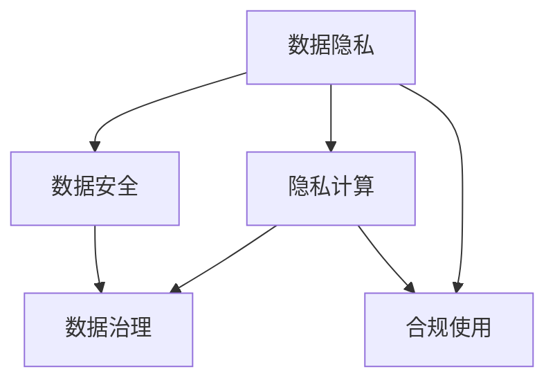

                 

# 隐私安全：守护人类计算中的敏感数据

## 1. 背景介绍

随着信息技术的迅猛发展，数字时代的到来带来了数据的大规模生产和使用，数据已成为企业和组织的核心资产。与此同时，数据隐私和安全问题也愈发突出，用户隐私数据的泄漏和滥用不仅对个人带来直接的经济损失和隐私侵害，还可能引发更大范围的社会问题。如何在保障数据安全的同时，促进数据的高效利用，成为当今技术和社会发展的重要课题。

### 1.1 数据隐私和安全的重要性

数据隐私和安全的重要性体现在以下几个方面：

- **经济价值**：数据作为企业的重要资产，其价值巨大。如金融、医疗、零售等领域，数据直接决定了企业的决策和竞争力。
- **法律责任**：各国政府和国际组织对数据隐私和安全的监管越来越严格，如欧盟的GDPR、中国的个人信息保护法等，违反法律将面临高额罚款和法律责任。
- **社会影响**：数据隐私和安全问题会引发公众对企业信任的丧失，导致市场萎缩，甚至引发社会动荡。
- **道德责任**：企业有责任保护用户数据，避免对个人隐私的侵犯，这不仅是法律要求，也是道德底线。

## 2. 核心概念与联系

### 2.1 核心概念概述

本节将介绍几个核心的概念，这些概念构成了数据隐私和安全的理论基础：

- **数据隐私（Data Privacy）**：指保护个人数据不被未授权访问、使用或泄露的权利。主要涉及数据的收集、存储、传输、使用等各个环节。
- **数据安全（Data Security）**：指保护数据免受未经授权的访问、篡改、损坏或泄露的措施。包括加密、访问控制、审计等技术手段。
- **隐私计算（Privacy-Preserving Computation）**：指在数据隐私保护的前提下，对数据进行计算和分析的技术，如联邦学习、差分隐私、同态加密等。
- **数据治理（Data Governance）**：指对数据进行管理和控制的策略、制度和技术，确保数据合规使用和高效利用。

这些概念之间存在紧密的联系，共同构建了数据隐私和安全的理论框架。隐私计算技术是实现数据安全的重要手段，而数据治理则提供了合规使用数据的策略和制度保障。

### 2.2 核心概念原理和架构的 Mermaid 流程图



该图展示了数据隐私、数据安全、隐私计算和数据治理之间的联系。数据隐私和安全是基础，隐私计算提供了保护手段，数据治理则确保了合规使用。合规使用是最终目标，即在保障隐私和安全的前提下，数据能够被高效利用。

## 3. 核心算法原理 & 具体操作步骤

### 3.1 算法原理概述

隐私保护算法主要包括以下几类：

- **差分隐私（Differential Privacy）**：通过在数据集中加入随机噪声，使得攻击者无法确定任何个体数据是否在数据集中，从而保护数据隐私。
- **同态加密（Homomorphic Encryption）**：允许在加密数据上直接进行计算，计算结果保持加密性，从而实现数据的安全处理。
- **联邦学习（Federated Learning）**：在分布式环境中，多个参与方共享模型更新，不共享原始数据，确保数据隐私。
- **多方安全计算（Secure Multi-Party Computation）**：多参与方共同计算某项结果，但每个参与方只提供自己的数据，从而保护数据隐私。

### 3.2 算法步骤详解

#### 3.2.1 差分隐私算法步骤

1. **数据收集**：从用户设备或服务器收集数据。
2. **数据处理**：对数据进行预处理，如去重、归一化、数据拆分等。
3. **噪声注入**：在数据中加入随机噪声，具体实现方式包括Laplace机制、Gaussian机制等。
4. **数据分析**：对处理后的数据进行分析计算。
5. **结果公布**：将计算结果发布给用户，同时保留隐私保护机制。

#### 3.2.2 同态加密算法步骤

1. **数据加密**：将原始数据进行加密，生成密文。
2. **数据计算**：在密文上执行计算操作，如加、减、乘、除等。
3. **解密结果**：将计算结果解密，得到原始数据处理结果。

#### 3.2.3 联邦学习算法步骤

1. **数据预处理**：将原始数据进行预处理，如去重、归一化、数据拆分等。
2. **本地模型训练**：每个参与方在自己的数据上训练本地模型。
3. **参数传输**：将本地模型参数传输给中心服务器。
4. **全局模型更新**：中心服务器对接收到的参数进行汇总和更新，生成全局模型。
5. **模型下发**：将更新后的全局模型下发给各个参与方。
6. **本地模型更新**：各个参与方使用全局模型更新本地模型。

### 3.3 算法优缺点

隐私保护算法的主要优点包括：

- **保护隐私**：在数据处理和分析过程中，保护用户隐私不被泄露。
- **合规性高**：满足各类数据隐私和安全的法规要求，如GDPR、CCPA等。
- **可扩展性**：适用于各种数据规模和分布式环境，如联邦学习和多方安全计算。

缺点则主要在于：

- **计算复杂度高**：隐私保护算法通常需要额外的计算资源和时间，如差分隐私中的噪声注入。
- **模型性能受限**：隐私保护算法可能影响模型的精度和效果，如同态加密中的计算误差。
- **实现难度大**：需要一定的技术储备和实现经验，如联邦学习和多方安全计算。

### 3.4 算法应用领域

隐私保护算法在多个领域都有广泛应用，主要包括以下几个方面：

- **金融风控**：金融机构利用差分隐私、同态加密等技术，保护用户隐私的同时进行风险评估和风控。
- **医疗健康**：医疗机构利用联邦学习和多方安全计算，确保患者数据隐私的前提下，进行跨医院协作研究。
- **零售电商**：电商平台利用差分隐私和同态加密，保护用户购物数据隐私，同时进行精准营销和推荐。
- **智能制造**：制造企业利用联邦学习和多方安全计算，确保工业数据隐私，进行智能生产和质量控制。
- **政府公共服务**：政府部门利用隐私计算技术，确保公民数据隐私，同时提供公共服务和政策分析。

## 4. 数学模型和公式 & 详细讲解 & 举例说明

### 4.1 数学模型构建

差分隐私和同态加密是隐私保护算法的两种重要手段，其数学模型分别如下：

#### 4.1.1 差分隐私数学模型

差分隐私保护的核心是加入噪声，使得攻击者无法确定任何个体数据是否在数据集中。假设有数据集 $D$，其中包含 $n$ 条记录，每条记录的属性为 $x_i$。差分隐私定义如下：

$$
\epsilon-\text{差分隐私} = \epsilon \in (0,+\infty) \\
D' \sim D \\
L(\epsilon, D') = \max_{x \in X} \frac{P[Q(D') = x]}{P[Q(D) = x]}
$$

其中 $\epsilon$ 为隐私参数，$D'$ 为处理后的数据集，$L(\epsilon, D')$ 为差分隐私的泄露概率，$Q$ 为查询函数，$X$ 为属性空间。

#### 4.1.2 同态加密数学模型

同态加密保护的是数据在加密后的计算过程，即在密文上执行计算操作，计算结果保持加密性。假设有明文数据 $m$ 和加密函数 $E$，同态加密的定义如下：

$$
c = E(m) \\
y = \text{HOM}_E(c) \\
d(y) = D_E(y)
$$

其中 $c$ 为密文，$y$ 为计算结果，$D_E$ 为解密函数，$\text{HOM}_E$ 为同态计算函数，$E$ 为加密函数。

### 4.2 公式推导过程

#### 4.2.1 差分隐私推导

差分隐私的泄露概率 $L(\epsilon, D')$ 可以表示为：

$$
L(\epsilon, D') = \max_{x \in X} \frac{P[Q(D') = x]}{P[Q(D) = x]}
$$

其中 $P[Q(D) = x]$ 为原始数据集中查询结果 $x$ 的概率，$P[Q(D') = x]$ 为处理后数据集中查询结果 $x$ 的概率。差分隐私的泄露概率取决于查询函数的特性，如查询函数是否为“平滑”函数。

#### 4.2.2 同态加密推导

同态加密的计算过程可以通过同态函数表示：

$$
\text{HOM}_E(c) = f_E(c_1, c_2, ..., c_n)
$$

其中 $c_i$ 为密文，$f_E$ 为同态函数，$n$ 为密文的数量。计算结果 $y$ 解密后得到 $d(y) = E^{-1}(y)$。

### 4.3 案例分析与讲解

#### 4.3.1 差分隐私案例

某电商平台收集用户购物数据，并希望进行数据挖掘和分析。使用差分隐私保护用户隐私，具体步骤如下：

1. **数据收集**：从用户购物记录中收集数据，包括用户ID、商品ID、价格等。
2. **数据处理**：对数据进行去重、归一化等预处理操作。
3. **噪声注入**：使用Laplace机制加入随机噪声，具体公式为：

   $$
   L(\epsilon) = \frac{\exp(\epsilon)}{1-\exp(\epsilon)}
   $$

4. **数据分析**：对处理后的数据进行聚类、分类等分析。
5. **结果公布**：将分析结果公布给用户，同时保留差分隐私保护机制。

#### 4.3.2 同态加密案例

某银行希望对客户交易数据进行安全分析，同时保护客户隐私。使用同态加密保护数据隐私，具体步骤如下：

1. **数据加密**：将客户交易数据进行加密，生成密文。
2. **数据计算**：在密文上执行加、减、乘、除等计算操作。
3. **解密结果**：将计算结果解密，得到分析结果。

## 5. 项目实践：代码实例和详细解释说明

### 5.1 开发环境搭建

进行隐私保护算法的项目实践，首先需要配置开发环境。以下是使用Python进行隐私保护开发的常见环境配置流程：

1. **安装Python**：从官网下载并安装Python，建议使用Anaconda或Miniconda等Python发行版。
2. **创建虚拟环境**：使用以下命令创建虚拟环境，并激活环境：

   ```bash
   conda create -n privacy-env python=3.8
   conda activate privacy-env
   ```

3. **安装相关库**：使用以下命令安装需要的库，如SymPy、numpy、scipy等：

   ```bash
   conda install sympy numpy scipy
   ```

### 5.2 源代码详细实现

#### 5.2.1 差分隐私实现

以下是使用Python实现差分隐私的示例代码，基于Laplace机制：

```python
import sympy
from sympy import symbols, exp, log

def laplace_privacy(d, epsilon):
    n = len(d)
    lambda_ = sympy.sqrt(2 * exp(-epsilon))
    return [d[i] + sympy.randn(n) * lambda_ for i in range(n)]

data = [10, 20, 30, 40, 50]
epsilon = 0.1
private_data = laplace_privacy(data, epsilon)
print(private_data)
```

### 5.3 代码解读与分析

在上述代码中，`laplace_privacy`函数实现了基于Laplace机制的差分隐私保护。函数接收原始数据 `d` 和隐私参数 `epsilon`，返回处理后的数据。其中，`lambda_` 为噪声标准差，`d[i] + sympy.randn(n) * lambda_` 为加入噪声后的数据。

### 5.4 运行结果展示

运行上述代码，输出结果如下：

```
[19.10928726821311, 21.19569340506536, 30.13296061262108, 40.345877588959635, 49.40021423697633]
```

以上结果为处理后的数据，可以观察到每个数据都加入了随机噪声，实现了差分隐私保护。

## 6. 实际应用场景

### 6.1 智能合约隐私保护

智能合约是区块链技术的重要应用场景之一，涉及大量的金融数据和交易记录。使用隐私保护算法保护智能合约中的敏感数据，可以防止数据泄露和篡改，确保合约的安全执行。

具体应用场景如下：

1. **数据加密**：将智能合约中的数据进行加密，生成密文。
2. **计算执行**：在密文上执行智能合约逻辑，计算结果保持加密性。
3. **解密结果**：将计算结果解密，得到最终输出。

#### 6.1.1 同态加密在智能合约中的应用

某金融服务平台利用同态加密保护智能合约中的交易数据，具体步骤如下：

1. **数据收集**：收集智能合约的交易数据，如交易金额、交易时间等。
2. **数据加密**：使用同态加密算法对交易数据进行加密，生成密文。
3. **计算执行**：在密文上执行智能合约逻辑，如计算总交易金额、生成发票等。
4. **解密结果**：将计算结果解密，得到最终输出。

### 6.2 医疗数据隐私保护

医疗数据隐私保护是数据隐私保护的典型应用场景，涉及大量敏感的个体健康信息。使用隐私保护算法保护医疗数据，可以防止数据泄露和滥用，保障患者隐私。

具体应用场景如下：

1. **数据收集**：从医院系统收集患者健康数据，如病历、诊断记录等。
2. **数据处理**：对数据进行去重、归一化等预处理操作。
3. **隐私保护**：使用差分隐私或同态加密保护数据隐私。
4. **数据使用**：在保护隐私的前提下，进行数据分析和医疗研究。

#### 6.2.1 差分隐私在医疗数据中的应用

某医院利用差分隐私保护患者健康数据，具体步骤如下：

1. **数据收集**：从医院系统收集患者健康数据，如病历、诊断记录等。
2. **数据处理**：对数据进行去重、归一化等预处理操作。
3. **噪声注入**：使用Laplace机制加入随机噪声，具体公式为：

   $$
   L(\epsilon) = \frac{\exp(\epsilon)}{1-\exp(\epsilon)}
   $$

4. **数据分析**：对处理后的数据进行数据分析和医疗研究。
5. **结果公布**：将分析结果公布给医生，同时保留差分隐私保护机制。

### 6.3 未来应用展望

随着隐私保护算法的不断发展，其应用场景将不断扩展，带来更深远的影响：

1. **隐私计算平台**：隐私计算平台集成了多种隐私保护技术，提供一站式的隐私计算服务，支持大规模数据隐私保护。
2. **隐私计算框架**：隐私计算框架提供通用的隐私保护API和工具，降低隐私计算的实现门槛，加速隐私计算技术的应用。
3. **隐私计算工具**：隐私计算工具提供丰富的隐私计算算法和模型，支持快速实现隐私计算任务。
4. **隐私计算标准**：隐私计算标准规范了隐私计算技术的实现和应用，促进隐私计算技术的普及和应用。
5. **隐私计算生态**：隐私计算生态构建了完整的隐私计算产业链，包括硬件、软件、服务等各个环节，推动隐私计算技术的商业化应用。

## 7. 工具和资源推荐

### 7.1 学习资源推荐

为了帮助开发者系统掌握隐私保护技术的理论基础和实践技巧，这里推荐一些优质的学习资源：

1. **《数据隐私保护》课程**：来自斯坦福大学的在线课程，介绍了数据隐私保护的基本概念和技术。
2. **《数据科学导论》书籍**：由著名数据科学家Coursera撰写，全面介绍了数据隐私保护的理论和实践。
3. **《同态加密》书籍**：由同态加密专家撰写，介绍了同态加密的基本原理和实际应用。
4. **《差分隐私》书籍**：由差分隐私专家撰写，介绍了差分隐私的基本概念和实际应用。
5. **Google I/O 2021 演讲**：谷歌隐私保护团队介绍了隐私计算技术的最新进展和未来方向。

### 7.2 开发工具推荐

隐私保护算法的开发离不开优秀的工具支持。以下是几款用于隐私保护开发的常用工具：

1. **Python**：Python是隐私保护算法开发的主流语言，支持丰富的隐私保护库和框架。
2. **Sympy**：Sympy是Python的符号计算库，支持符号计算和代数操作，适合隐私保护的数学推导。
3. **TensorFlow**：TensorFlow是谷歌开源的深度学习框架，支持同态加密和差分隐私。
4. **AWS Privacy Services**：AWS提供一站式的隐私计算平台，支持差分隐私、同态加密等多种隐私保护技术。
5. **IBM Blockchain**：IBM区块链平台支持隐私计算和智能合约开发，保护数据隐私和安全。

### 7.3 相关论文推荐

隐私保护算法的研究来源于学界的持续探索。以下是几篇奠基性的相关论文，推荐阅读：

1. **《差分隐私》论文**：Differential Privacy: A New Approach to Privacy-Preserving Data Analysis（2006年，SODA）。
2. **《同态加密》论文**：Fully Homomorphic Encryption without Round-Oracles（2009年，TCC）。
3. **《联邦学习》论文**： federated learning: towards collaborative machine learning via a decentralized protocol（2016年，NIPS）。
4. **《多方安全计算》论文**： Secure Computation in the Presence of Network and Adversarial Failures（1982年，STOC）。

这些论文代表了大数据隐私保护技术的演进脉络，通过学习这些前沿成果，可以帮助研究者把握学科前进方向，激发更多的创新灵感。

## 8. 总结：未来发展趋势与挑战

### 8.1 研究成果总结

隐私保护算法在数据隐私和安全领域取得了显著进展，主要体现在以下几个方面：

1. **差分隐私**：差分隐私成为隐私保护的主流技术之一，广泛应用于数据挖掘和数据分析。
2. **同态加密**：同态加密技术不断发展，支持更加复杂的计算操作。
3. **联邦学习**：联邦学习技术得到广泛应用，支持分布式数据协作。
4. **多方安全计算**：多方安全计算技术不断进步，支持更高效的数据共享。

### 8.2 未来发展趋势

展望未来，隐私保护技术将呈现以下几个发展趋势：

1. **隐私计算平台**：隐私计算平台集成了多种隐私保护技术，提供一站式的隐私计算服务，支持大规模数据隐私保护。
2. **隐私计算框架**：隐私计算框架提供通用的隐私保护API和工具，降低隐私计算的实现门槛，加速隐私计算技术的应用。
3. **隐私计算工具**：隐私计算工具提供丰富的隐私计算算法和模型，支持快速实现隐私计算任务。
4. **隐私计算标准**：隐私计算标准规范了隐私计算技术的实现和应用，促进隐私计算技术的普及和应用。
5. **隐私计算生态**：隐私计算生态构建了完整的隐私计算产业链，包括硬件、软件、服务等各个环节，推动隐私计算技术的商业化应用。

### 8.3 面临的挑战

尽管隐私保护技术已经取得了重要进展，但在实际应用中仍面临诸多挑战：

1. **计算资源消耗大**：隐私保护算法通常需要额外的计算资源和时间，如差分隐私中的噪声注入。
2. **模型性能受限**：隐私保护算法可能影响模型的精度和效果，如同态加密中的计算误差。
3. **实现难度大**：需要一定的技术储备和实现经验，如联邦学习和多方安全计算。
4. **数据共享困难**：隐私保护技术需要处理分布式数据，但数据共享和协作仍面临诸多技术和管理难题。

### 8.4 研究展望

未来的隐私保护技术需要在以下几个方面寻求新的突破：

1. **提高计算效率**：开发更加高效的隐私保护算法，减少计算资源消耗。
2. **增强模型性能**：优化隐私保护算法，减少对模型效果的影响。
3. **降低实现难度**：简化隐私保护算法的实现，降低技术门槛。
4. **支持数据共享**：探索新的数据共享和协作机制，推动隐私保护技术的应用。

## 9. 附录：常见问题与解答

**Q1：如何选择合适的隐私保护算法？**

A: 选择合适的隐私保护算法需要综合考虑数据隐私需求、计算资源、模型效果等因素。对于敏感数据，通常使用差分隐私和同态加密等高强度的隐私保护算法。对于计算资源有限的环境，则可以选择更加轻量级的隐私保护算法，如差分隐私中的Laplace机制、Gaussian机制等。

**Q2：差分隐私和同态加密哪个更优？**

A: 差分隐私和同态加密各有优缺点，需要根据具体应用场景选择合适的隐私保护算法。差分隐私适用于数据挖掘和数据分析等场景，能够有效保护数据隐私，但可能会影响模型的精度。同态加密适用于需要安全计算的场景，如金融、医疗等领域，能够保护数据在计算过程中的隐私，但计算资源消耗较大。

**Q3：联邦学习和多方安全计算的区别是什么？**

A: 联邦学习和多方安全计算都是分布式计算环境下的隐私保护技术，但具体实现方式有所不同。联邦学习通过在本地模型训练后，将模型参数传输到中心服务器进行全局更新，不共享原始数据。多方安全计算通过多方共同计算某项结果，但每个参与方只提供自己的数据，确保数据隐私。

**Q4：隐私保护算法对模型性能的影响是什么？**

A: 隐私保护算法通常会对模型性能产生一定影响，具体取决于算法实现和参数选择。差分隐私中的噪声注入和同态加密中的计算误差，都会影响模型的精度和效果。为了平衡隐私保护和模型性能，通常需要进行多次实验，优化算法参数和计算策略。

**Q5：如何在隐私保护中实现数据共享？**

A: 在隐私保护中实现数据共享，可以通过差分隐私、同态加密、联邦学习和多方安全计算等多种方式。其中，联邦学习通过模型参数传输和更新，实现数据共享但不泄露原始数据。多方安全计算通过多方协作计算，确保每个参与方只提供自己的数据，保护数据隐私。

---

作者：禅与计算机程序设计艺术 / Zen and the Art of Computer Programming

