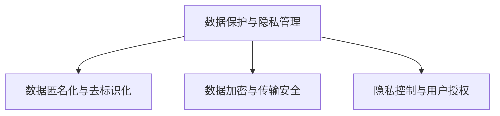

                 

## 1. 背景介绍

### 1.1 问题由来
在现代社会，数据隐私和安全问题愈发受到关注。随着云计算、大数据、物联网等技术的发展，人们的生活、工作和社交方式发生了深刻变化，大量个人和敏感信息被数字化，存储在云端服务器中。与此同时，数据泄露、网络攻击、恶意软件等安全威胁也愈发严重，给社会带来了巨大风险。

据统计，每年有数十亿条个人信息被盗取，包括姓名、地址、电话号码、信用卡号等，用于诈骗、勒索等非法活动。例如，2017年的Equifax数据泄露事件，导致1.43亿美国人的信息被泄露，引发了全球范围的舆论关注。

这些隐私安全问题，不仅侵犯了个人隐私，还可能导致重大的经济损失和社会信任危机。因此，如何保护数据安全，成为当下亟需解决的重要课题。

### 1.2 问题核心关键点
隐私安全问题涉及多个层面，包括数据收集、存储、传输和使用等环节。核心关键点包括：

- **数据保护与隐私管理**：如何确保个人数据不被未授权访问，防止数据泄露。
- **数据匿名化与去标识化**：如何处理敏感数据，使其无法识别具体个人身份，从而保障隐私。
- **数据加密与传输安全**：如何对数据进行加密，确保在传输过程中不被窃取或篡改。
- **隐私控制与用户授权**：如何实现用户对数据使用的知情权和控制权，保护其隐私权益。

本文将从数据保护与隐私管理、数据匿名化与去标识化、数据加密与传输安全、隐私控制与用户授权四个方面，系统介绍隐私安全的原理与技术。

## 2. 核心概念与联系

### 2.1 核心概念概述

为更好地理解隐私安全的核心概念，本节将介绍几个关键概念：

- **数据保护与隐私管理**：指通过法律法规和技术手段，确保个人数据不被未授权访问和泄露，保障个人隐私权益。
- **数据匿名化与去标识化**：指通过技术手段，使数据无法直接识别个人身份，从而达到保护隐私的目的。
- **数据加密与传输安全**：指通过加密算法，将数据转换为难以识别的形式，保障数据在传输和存储过程中的安全性。
- **隐私控制与用户授权**：指用户对其数据的收集、存储和使用进行控制，确保其知情权和授权权。

这些概念之间的逻辑关系可以通过以下Mermaid流程图来展示：



这个流程图展示了这个体系的基本框架：

1. **数据保护与隐私管理**：是整个隐私安全体系的基础。
2. **数据匿名化与去标识化**：是保障隐私的具体手段。
3. **数据加密与传输安全**：是数据传输中的隐私保护措施。
4. **隐私控制与用户授权**：是用户对数据使用的控制和授权方式。

这些核心概念共同构成了隐私安全的理论基础和实践框架，帮助我们更好地理解隐私安全问题的本质和解决方法。

## 3. 核心算法原理 & 具体操作步骤
### 3.1 算法原理概述

隐私安全的实现涉及多种算法和技术手段，以下是几个关键算法和理论原理：

1. **数据加密算法**：通过将数据转换为不可识别的形式，保障数据在传输和存储过程中的安全性。常见的加密算法包括对称加密、非对称加密、哈希函数等。
2. **匿名化技术**：通过对数据进行处理，使其无法直接识别个人身份，从而保护隐私。常用的匿名化技术包括数据泛化、数据扰动、假名化等。
3. **去标识化技术**：通过移除或模糊化数据中的识别信息，确保数据无法被用于识别个人身份。
4. **访问控制技术**：通过权限管理和策略，确保只有授权用户或系统才能访问数据。
5. **差分隐私技术**：通过在数据中引入噪声，使得攻击者无法通过数据分析推断出个人身份，从而保护隐私。

这些算法和理论原理，共同构成了隐私安全的核心算法框架。

### 3.2 算法步骤详解

基于上述算法原理，隐私安全的实现通常包括以下几个步骤：

**Step 1: 数据收集与预处理**
- 收集需要处理的数据，对其进行清洗和预处理，确保数据质量。
- 对数据进行分类，识别出敏感信息，并采取相应保护措施。

**Step 2: 数据加密与传输**
- 对数据进行加密处理，确保数据在传输过程中不被窃取或篡改。
- 使用安全的传输协议（如TLS、SSH）进行数据传输，保障传输过程的安全性。

**Step 3: 数据存储与访问控制**
- 将加密后的数据存储在安全的数据库或云存储中。
- 设置访问控制策略，确保只有授权用户或系统才能访问数据。

**Step 4: 数据匿名化与去标识化**
- 对存储的数据进行匿名化处理，使其无法直接识别个人身份。
- 根据具体需求，选择合适的方法进行去标识化处理，进一步提升数据隐私性。

**Step 5: 数据使用与隐私控制**
- 在数据使用过程中，确保用户对其数据的使用知情权和控制权。
- 记录数据使用日志，便于追踪和审计。

**Step 6: 数据监测与审计**
- 对数据使用和存储进行持续监测，及时发现和应对安全威胁。
- 定期进行隐私安全审计，确保隐私保护措施的有效性。

### 3.3 算法优缺点

隐私安全的实现涉及多种算法和技术手段，以下是对其优缺点的简要分析：

**优点：**
1. **安全性高**：通过加密、匿名化等技术手段，有效保障了数据在传输、存储和使用过程中的安全性。
2. **灵活性大**：可以根据具体需求，选择不同的隐私保护方法，确保隐私保护的针对性和有效性。
3. **适应性强**：适用于多种场景和应用，如云计算、大数据、物联网等。

**缺点：**
1. **计算开销大**：加密、匿名化等操作会增加计算复杂度和资源消耗，影响系统性能。
2. **管理复杂**：隐私安全保护涉及多层次的技术和管理，需要专业的知识和技能。
3. **隐私泄露风险**：尽管采用了多种技术手段，仍无法完全避免隐私泄露风险，特别是在复杂的网络环境中。

尽管存在这些局限性，但隐私安全仍是当前信息时代不可或缺的重要技术，广泛应用于金融、医疗、政府、企业等各个领域。未来，随着技术的发展和应用的深入，隐私安全将更加智能和高效，为人们带来更全面的保护。

### 3.4 算法应用领域

隐私安全技术在多个领域得到了广泛应用，以下是几个典型应用场景：

**金融行业**：在金融数据存储、交易和分析中，采用加密、匿名化等技术手段，确保客户隐私不被泄露。
**医疗行业**：在医疗数据共享、患者隐私保护中，采用去标识化、差分隐私等技术，保障患者隐私权益。
**政府行业**：在政府数据管理、公开透明中，采用访问控制、数据脱敏等技术，确保数据安全和公众知情权。
**企业行业**：在企业数据管理和用户授权中，采用数据加密、访问控制等技术，保护企业数据和用户隐私。

这些应用场景展示了隐私安全技术的广泛性和重要性，凸显了其对社会和经济发展的影响力。

## 4. 数学模型和公式 & 详细讲解  
### 4.1 数学模型构建

隐私安全的实现涉及到多个数学模型和技术原理，以下是对其中几个关键模型的详细介绍。

**差分隐私模型**：

差分隐私是一种通过在数据中引入噪声，保障数据隐私的技术。其核心思想是在查询结果中引入随机性，使得攻击者无法通过数据分析推断出具体个人身份。

假设有一组数据 $D=\{x_1, x_2, ..., x_n\}$，其中 $x_i$ 为第 $i$ 个数据点，$L:D \rightarrow [0,1]$ 为查询函数，$P$ 为概率分布。差分隐私的目标是在查询 $L$ 时，引入噪声 $\epsilon$，使得攻击者无法推断出具体数据点。

差分隐私模型的数学公式为：

$$
\epsilon-DP(L) = \max_{x \in \Delta} \left| Pr[L(D)] - Pr[L(D')] \right| \leq \frac{\epsilon}{\delta}
$$

其中 $\Delta$ 为查询函数的概率分布，$\delta$ 为隐私保护参数。

**数据加密模型**：

数据加密是一种通过将数据转换为难以识别的形式，保障数据安全的技术。常用的加密算法包括对称加密和非对称加密。

对称加密模型的数学公式为：

$$
E_k(x) = C \oplus x
$$

其中 $x$ 为明文，$C$ 为密文，$\oplus$ 为异或运算，$k$ 为密钥。

非对称加密模型的数学公式为：

$$
E_{pk}(x) = M \cdot pk
$$

其中 $x$ 为明文，$M$ 为密文，$pk$ 为公钥。

### 4.2 公式推导过程

以下是几个关键模型的公式推导过程。

**差分隐私公式推导**：

差分隐私模型通过在查询结果中引入随机性，使得攻击者无法推断出具体数据点。其数学公式为：

$$
\epsilon-DP(L) = \max_{x \in \Delta} \left| Pr[L(D)] - Pr[L(D')] \right| \leq \frac{\epsilon}{\delta}
$$

其中 $\Delta$ 为查询函数的概率分布，$\delta$ 为隐私保护参数。

推导过程如下：

1. **查询函数的概率分布**：假设查询函数 $L$ 的概率分布为 $P$，则查询结果的概率为 $Pr[L(D)]$。
2. **差分隐私的定义**：差分隐私的定义为在查询 $L$ 时，引入噪声 $\epsilon$，使得攻击者无法推断出具体数据点。
3. **隐私保护参数**：隐私保护参数 $\delta$ 表示攻击者无法推断出具体数据点的概率，通常取值为 $10^{-6}$。
4. **差分隐私公式**：差分隐私的公式为 $\epsilon-DP(L) = \max_{x \in \Delta} \left| Pr[L(D)] - Pr[L(D')] \right| \leq \frac{\epsilon}{\delta}$。

**数据加密公式推导**：

数据加密模型通过将数据转换为难以识别的形式，保障数据安全。其数学公式为：

$$
E_k(x) = C \oplus x
$$

其中 $x$ 为明文，$C$ 为密文，$\oplus$ 为异或运算，$k$ 为密钥。

推导过程如下：

1. **明文和密文的关系**：明文 $x$ 和密文 $C$ 的关系为 $C = E_k(x)$。
2. **解密过程**：解密过程为 $x = C \oplus k$。
3. **加密过程**：加密过程为 $C = E_k(x)$。
4. **数据加密公式**：数据加密的公式为 $E_k(x) = C \oplus x$。

## 5. 项目实践：代码实例和详细解释说明
### 5.1 开发环境搭建

在进行隐私安全实践前，我们需要准备好开发环境。以下是使用Python进行加密实践的环境配置流程：

1. 安装Anaconda：从官网下载并安装Anaconda，用于创建独立的Python环境。

2. 创建并激活虚拟环境：
```bash
conda create -n cryptography-env python=3.8 
conda activate cryptography-env
```

3. 安装相关库：
```bash
pip install cryptography pycryptodome openssl
```

4. 安装各类工具包：
```bash
pip install numpy pandas scikit-learn matplotlib tqdm jupyter notebook ipython
```

完成上述步骤后，即可在`cryptography-env`环境中开始加密实践。

### 5.2 源代码详细实现

这里我们以AES加密算法为例，给出使用Python进行加密的PyTorch代码实现。

```python
from cryptography.fernet import Fernet
import base64
import os

# 生成密钥
key = Fernet.generate_key()
print("Key: ", key)

# 加密数据
data = "Hello, world!".encode('utf-8')
f = Fernet(key)
cipher_suite = f.encrypt(data)
print("Cipher suite: ", cipher_suite)

# 解密数据
f = Fernet(key)
decrypted_data = f.decrypt(cipher_suite)
print("Decrypted data: ", decrypted_data.decode('utf-8'))
```

在代码中，我们首先使用`Fernet.generate_key()`函数生成密钥，然后使用该密钥进行数据加密和解密。

### 5.3 代码解读与分析

让我们再详细解读一下关键代码的实现细节：

**生成密钥**：
- 使用`Fernet.generate_key()`函数生成密钥，保存在变量`key`中。

**加密数据**：
- 使用`Fernet(key)`创建加密对象`f`。
- 使用`f.encrypt(data)`对数据进行加密，保存在变量`cipher_suite`中。

**解密数据**：
- 使用`Fernet(key)`创建加密对象`f`。
- 使用`f.decrypt(cipher_suite)`对数据进行解密，保存在变量`decrypted_data`中。

可以看到，使用Python进行加密操作非常简单，只需几行代码即可完成。在实际应用中，可以根据需求选择不同的加密算法和模式，实现更加复杂的数据加密和解密。

## 6. 实际应用场景
### 6.1 金融数据安全

在金融行业，数据安全和隐私保护尤为重要。金融机构需要处理大量的个人和敏感信息，如账户余额、交易记录等。为了保护客户隐私，金融机构通常采用以下措施：

**数据加密**：
- 在数据传输过程中，使用SSL/TLS协议进行加密。
- 在数据存储过程中，使用AES、RSA等加密算法进行加密保护。

**访问控制**：
- 设置严格的访问控制策略，确保只有授权用户和系统才能访问敏感数据。
- 使用身份认证和权限管理工具，如LDAP、OAuth等，确保数据访问的安全性。

**差分隐私**：
- 在数据分析和报告生成过程中，使用差分隐私技术，防止数据泄露。

### 6.2 医疗数据保护

医疗行业的数据隐私保护也非常关键。医院和诊所需要处理大量的患者信息，如病历、治疗记录等。为了保护患者隐私，医疗机构通常采用以下措施：

**数据匿名化**：
- 在数据存储过程中，使用去标识化技术，确保数据无法直接识别患者身份。
- 在数据分析和报告生成过程中，使用数据泛化技术，降低数据隐私风险。

**访问控制**：
- 设置严格的访问控制策略，确保只有授权用户和系统才能访问患者数据。
- 使用身份认证和权限管理工具，如Kerberos、Active Directory等，确保数据访问的安全性。

**差分隐私**：
- 在数据分析和报告生成过程中，使用差分隐私技术，防止数据泄露。

### 6.3 政府数据透明

政府行业的数据安全和隐私保护也至关重要。政府需要处理大量的公共数据，如人口信息、教育记录等。为了保护公众隐私，政府通常采用以下措施：

**数据加密**：
- 在数据传输过程中，使用SSL/TLS协议进行加密。
- 在数据存储过程中，使用AES、RSA等加密算法进行加密保护。

**访问控制**：
- 设置严格的访问控制策略，确保只有授权用户和系统才能访问敏感数据。
- 使用身份认证和权限管理工具，如OAuth、OpenID Connect等，确保数据访问的安全性。

**数据去标识化**：
- 在数据存储过程中，使用去标识化技术，确保数据无法直接识别个人身份。
- 在数据分析和报告生成过程中，使用数据泛化技术，降低数据隐私风险。

### 6.4 企业数据保护

企业行业的数据安全和隐私保护也非常关键。企业需要处理大量的员工和客户信息，如薪资记录、购买记录等。为了保护员工和客户隐私，企业通常采用以下措施：

**数据加密**：
- 在数据传输过程中，使用SSL/TLS协议进行加密。
- 在数据存储过程中，使用AES、RSA等加密算法进行加密保护。

**访问控制**：
- 设置严格的访问控制策略，确保只有授权用户和系统才能访问敏感数据。
- 使用身份认证和权限管理工具，如LDAP、OAuth等，确保数据访问的安全性。

**数据匿名化**：
- 在数据存储过程中，使用去标识化技术，确保数据无法直接识别个人身份。
- 在数据分析和报告生成过程中，使用数据泛化技术，降低数据隐私风险。

## 7. 工具和资源推荐
### 7.1 学习资源推荐

为了帮助开发者系统掌握隐私安全的理论基础和实践技巧，这里推荐一些优质的学习资源：

1. 《信息安全基础》系列博文：由信息安全专家撰写，深入浅出地介绍了信息安全的基本概念和常用技术。

2. 《网络安全导论》课程：中国科学技术大学开设的课程，介绍了网络安全的核心原理和实际应用。

3. 《数据隐私与保护》书籍：全面介绍了数据隐私和保护的理论和实践，涵盖隐私模型、加密算法、匿名化技术等多个方面。

4. 《数据安全与隐私保护》白皮书：多家知名企业发布的白皮书，介绍了数据安全与隐私保护的最佳实践和未来趋势。

5. 《隐私保护技术》论文集：国际隐私保护会议的论文集，展示了隐私保护领域的最新研究成果和前沿技术。

通过对这些资源的学习实践，相信你一定能够快速掌握隐私安全的精髓，并用于解决实际的隐私安全问题。

### 7.2 开发工具推荐

高效的开发离不开优秀的工具支持。以下是几款用于隐私安全开发的常用工具：

1. OpenSSL：开源的加密和安全套接字库，支持多种加密算法和协议，是数据加密和传输的标准工具。

2. PyCryptodome：Python的加密和解密库，支持多种加密算法和协议，提供了简单易用的API接口。

3. Fernet：加密库，提供了AES-128-CBC加密算法，支持数据加密和解密。

4. pip：Python的包管理工具，可以快速安装和更新加密库和依赖包。

5. Jupyter Notebook：交互式编程环境，支持Python代码的编写和执行，方便调试和展示结果。

合理利用这些工具，可以显著提升隐私安全实践的效率，加快创新迭代的步伐。

### 7.3 相关论文推荐

隐私安全技术的发展源于学界的持续研究。以下是几篇奠基性的相关论文，推荐阅读：

1. Secure Multi-Party Computation（SMPC）：介绍多方安全计算技术，保障数据安全的同时，实现多方合作。

2. Homomorphic Encryption（HE）：介绍同态加密技术，允许在数据加密的情况下进行计算。

3. Secure Multi-Party Database（SMPD）：介绍多方数据库技术，保障数据安全和隐私。

4. Differential Privacy（DP）：介绍差分隐私技术，保障数据隐私的同时，允许数据分析。

5. Secure Multi-Party Communication（SMP）：介绍多方通信技术，保障数据传输过程中的安全性。

这些论文代表了大数据安全领域的最新进展，通过学习这些前沿成果，可以帮助研究者把握学科前进方向，激发更多的创新灵感。

## 8. 总结：未来发展趋势与挑战

### 8.1 总结

本文对隐私安全进行了全面系统的介绍。首先阐述了隐私安全的背景和意义，明确了数据保护与隐私管理、数据匿名化与去标识化、数据加密与传输安全、隐私控制与用户授权四个核心概念。其次，从算法原理和操作步骤两个方面，详细讲解了隐私安全的具体实现过程，提供了代码实例和解释说明。同时，本文还介绍了隐私安全在金融、医疗、政府和企业等多个行业的应用场景，展示了隐私安全技术的广泛性和重要性。最后，本文推荐了隐私安全的各类学习资源和开发工具，力求为读者提供全方位的技术指引。

通过本文的系统梳理，可以看到，隐私安全是信息时代不可或缺的重要技术，对社会的各个方面都具有深远的影响。未来，随着技术的不断进步和应用的深入，隐私安全将更加智能和高效，为人们带来更全面的保护。

### 8.2 未来发展趋势

展望未来，隐私安全的实现将呈现以下几个发展趋势：

1. **自动化与智能化**：隐私安全的实现将更加自动化和智能化，通过AI技术优化隐私保护策略，提高效率和效果。

2. **跨平台与跨领域**：隐私安全将跨越不同的平台和领域，实现统一的安全保护策略，提升整体安全性。

3. **区块链与分布式**：区块链和分布式技术将广泛应用于隐私保护，提高数据安全和透明度。

4. **联邦学习与边缘计算**：联邦学习和边缘计算技术将应用于数据隐私保护，保障数据安全和隐私。

5. **零信任与安全监控**：零信任架构和安全监控技术将应用于隐私保护，确保数据访问的安全性和可控性。

这些趋势展示了隐私安全技术的未来发展方向，相信随着技术的发展和应用的深入，隐私安全将更加智能和高效，为人们带来更全面的保护。

### 8.3 面临的挑战

尽管隐私安全技术已经取得了显著进展，但在实际应用中仍面临诸多挑战：

1. **计算资源限制**：隐私安全保护往往需要复杂的算法和大量计算资源，对硬件设施提出了高要求。

2. **数据隐私泄露**：尽管采用了多种技术手段，仍无法完全避免数据隐私泄露风险，特别是在复杂的网络环境中。

3. **隐私保护与业务需求冲突**：隐私保护往往与业务需求存在冲突，如何在保障隐私的同时，满足业务需求，是一个重要挑战。

4. **技术复杂度高**：隐私安全保护涉及多层次的技术和管理，需要专业的知识和技能，增加了技术难度。

5. **法规和标准不完善**：隐私保护的法律法规和标准尚不完善，需要进一步推动相关法规的制定和完善。

尽管存在这些挑战，隐私安全仍是一个重要且亟需解决的问题。未来，需要从技术、法律、管理等多个维度协同发力，才能实现隐私安全的全面保障。

### 8.4 研究展望

面对隐私安全面临的种种挑战，未来的研究需要在以下几个方面寻求新的突破：

1. **隐私保护的自动化与智能化**：通过AI技术优化隐私保护策略，提高效率和效果。

2. **跨平台与跨领域隐私保护**：实现统一的安全保护策略，提升整体安全性。

3. **区块链与分布式隐私保护**：利用区块链和分布式技术，提高数据安全和透明度。

4. **联邦学习与边缘计算隐私保护**：利用联邦学习和边缘计算技术，保障数据安全和隐私。

5. **零信任架构与安全监控**：利用零信任架构和安全监控技术，确保数据访问的安全性和可控性。

6. **隐私保护法规和标准**：推动隐私保护的法律法规和标准制定和完善，提供政策保障。

这些研究方向的探索，将引领隐私安全技术迈向更高的台阶，为构建安全、可靠、可控的智能系统铺平道路。面向未来，隐私安全技术还需要与其他人工智能技术进行更深入的融合，如知识表示、因果推理、强化学习等，多路径协同发力，共同推动隐私安全技术的进步。

## 9. 附录：常见问题与解答

**Q1：数据加密与数据去标识化有什么区别？**

A: 数据加密和数据去标识化是两种不同的隐私保护技术，区别如下：

1. **数据加密**：通过将数据转换为难以识别的形式，保障数据在传输和存储过程中的安全性。加密后的数据无法直接识别，但可以解密恢复为原始数据。

2. **数据去标识化**：通过移除或模糊化数据中的识别信息，确保数据无法直接识别个人身份。去标识化后的数据无法被还原为原始数据，但可以重新生成与原始数据相似的样本。

**Q2：差分隐私和同态加密有什么区别？**

A: 差分隐私和同态加密是两种不同的隐私保护技术，区别如下：

1. **差分隐私**：通过在数据中引入随机性，保障数据隐私。差分隐私的目标是在查询结果中引入随机性，使得攻击者无法推断出具体数据点。

2. **同态加密**：允许在数据加密的情况下进行计算。同态加密的目标是在数据加密的情况下，进行计算操作，得到加密后的结果。

**Q3：如何进行数据匿名化？**

A: 数据匿名化是指通过处理数据，使其无法直接识别个人身份。常用的数据匿名化技术包括：

1. **假名化**：将数据中的敏感信息替换为假名，使得数据无法直接识别个人身份。

2. **泛化**：将数据中的敏感信息泛化，使得数据无法直接识别个人身份。

3. **扰动**：在数据中引入噪声，使得数据无法直接识别个人身份。

4. **模糊化**：对数据中的敏感信息进行模糊化处理，使得数据无法直接识别个人身份。

这些技术可以根据具体需求选择使用，确保数据匿名化的效果。

---

作者：禅与计算机程序设计艺术 / Zen and the Art of Computer Programming

