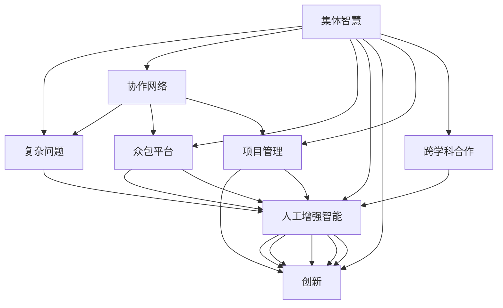

                 

# 集体智慧的力量：解决复杂问题的创新途径

> 关键词：集体智慧,复杂问题,协作网络,众包平台,人工增强智能,创新,项目管理,跨学科合作

## 1. 背景介绍

在现代社会中，复杂问题的解决已经超越了个体能力的边界。无论是科学探索、工程设计还是商业决策，都需要多方协作才能突破传统的瓶颈。随着技术的进步，特别是互联网和计算技术的发展，我们可以更加有效地整合个体的智慧和资源，形成“集体智慧”，协同解决各种复杂问题。集体智慧的运用已经渗透到各行各业，成为推动人类进步的重要动力。本文将深入探讨集体智慧的力量，介绍其原理、实施方法和实际应用案例，并展望未来发展趋势。

## 2. 核心概念与联系

### 2.1 核心概念概述

- **集体智慧**：通过协同工作、跨学科合作和信息共享，整合多个个体的知识和技能，以解决单一个体难以应对的复杂问题。
- **复杂问题**：涉及多个学科、领域和利益相关方的问题，难以通过传统方法或单一视角快速解决。
- **协作网络**：由个体、团队和组织组成的社交网络，旨在促进信息交流、知识共享和协同工作。
- **众包平台**：提供在线任务和协作工具，支持个人或团队参与解决问题的平台。
- **人工增强智能**：利用人类智慧与计算机智能结合，提升解决问题的效率和质量。
- **创新**：通过集体智慧的应用，开发新方法、新产品或新服务，推动技术和社会进步。
- **项目管理**：协调集体智慧的运用，制定项目计划、分配资源、跟踪进展，确保项目成功。
- **跨学科合作**：跨越不同学科和领域的合作，整合多元视角和方法，提升解决问题的深度和广度。

这些核心概念通过协作网络、众包平台、人工增强智能等手段有机结合，形成了集体智慧的应用框架。通过理解和应用这些概念，可以有效解决复杂问题，推动创新和社会发展。

### 2.2 核心概念原理和架构的 Mermaid 流程图



这个流程图展示了集体智慧的不同组成部分及其相互关系：
1. **复杂问题**通过协作网络、众包平台和人工增强智能的方式来解决。
2. **协作网络**和**跨学科合作**为知识共享和协同工作提供了基础设施。
3. **众包平台**则通过任务分配和在线协作工具，连接个体和团队。
4. **人工增强智能**利用机器学习等技术，提升问题解决的效率和准确性。
5. **创新**是集体智慧应用的目标，通过整合多方的智慧和资源，实现技术和社会进步。

## 3. 核心算法原理 & 具体操作步骤

### 3.1 算法原理概述

解决复杂问题通常涉及以下几个步骤：
1. **问题定义**：明确问题类型、范围和目标，形成问题描述。
2. **数据收集**：从不同渠道收集相关数据，确保数据的多样性和代表性。
3. **模型选择**：根据问题类型选择合适的模型，如决策树、神经网络、支持向量机等。
4. **数据处理**：对数据进行清洗、转换和标注，使其符合模型输入要求。
5. **模型训练**：利用标记数据训练模型，调整参数以优化模型性能。
6. **结果验证**：通过测试集评估模型性能，验证模型在新数据上的泛化能力。
7. **结果应用**：将模型应用到实际问题中，解决复杂问题。

### 3.2 算法步骤详解

以解决一个多变量优化问题为例，其具体操作步骤如下：

1. **问题定义**：假设问题为最大化一个复杂函数 $f(x)$ 的值，其中 $x$ 为多变量向量。
2. **数据收集**：收集与 $x$ 相关的历史数据和模拟数据，组成数据集。
3. **模型选择**：选择适合的多变量优化算法，如梯度下降、遗传算法等。
4. **数据处理**：对数据进行归一化、特征选择等预处理步骤，提高模型性能。
5. **模型训练**：使用数据集训练优化算法，不断调整参数以优化函数值。
6. **结果验证**：使用测试集验证模型性能，评估模型泛化能力。
7. **结果应用**：将模型应用于实际问题，找到最优解。

### 3.3 算法优缺点

**优点**：
- **高效性**：利用集体的智慧和计算能力，可以大大加速问题解决过程。
- **多样性**：多学科、多领域专家合作，提供更丰富的视角和方法。
- **创新性**：突破单一思维的限制，探索新的解决方案。

**缺点**：
- **复杂性**：协调多方合作、处理复杂数据和模型需要较高的组织和管理能力。
- **资源依赖**：需要投入大量时间和资源，尤其是在数据收集和模型训练阶段。
- **隐私问题**：涉及敏感数据时，需要严格的隐私保护措施。

### 3.4 算法应用领域

集体智慧的应用领域广泛，包括：
- **科学研究**：如基因组学、天文学等跨学科研究项目，通过多方合作攻克科学难题。
- **工程设计**：如大型建筑、复杂系统设计，通过跨领域协作提升设计质量和效率。
- **商业决策**：如市场分析、产品开发，利用集体智慧预测市场趋势、优化产品设计。
- **社会问题解决**：如公共卫生、环境保护，通过跨学科合作解决复杂的社会问题。

## 4. 数学模型和公式 & 详细讲解

### 4.1 数学模型构建

以解决一个多目标优化问题为例，数学模型可以表示为：
$$
\min \limits_{x} f_1(x) \quad \text{subject to} \quad g_i(x) \leq 0 \quad (i=1,...,m) \quad \text{and} \quad h_j(x) = 0 \quad (j=1,...,p)
$$

其中 $f_1(x)$ 为优化目标，$g_i(x)$ 和 $h_j(x)$ 为约束条件。

### 4.2 公式推导过程

首先，使用拉格朗日乘子法，将约束条件转化为目标函数的扩展：
$$
L(x,\lambda,\mu) = f_1(x) + \sum_{i=1}^m \lambda_i g_i(x) + \sum_{j=1}^p \mu_j h_j(x)
$$

然后，利用梯度下降等优化算法，求解上述扩展函数的最小值。

### 4.3 案例分析与讲解

例如，在航空器设计中，设计团队需优化飞机的空气动力性能和结构强度。设计变量包括翼型形状、材料厚度等，目标函数为最小化空气阻力，约束条件包括结构强度、生产成本等。通过多学科专家协作，建立数学模型，利用优化算法求解，得到最优设计方案。

## 5. 项目实践：代码实例和详细解释说明

### 5.1 开发环境搭建

搭建开发环境需要以下步骤：
1. **安装编程工具**：如Python、R等编程语言。
2. **配置开发环境**：如安装NumPy、SciPy等科学计算库，以及相关软件包。
3. **部署应用平台**：如选择适合的项目管理工具和众包平台，确保系统稳定运行。

### 5.2 源代码详细实现

以下是一个使用Python和SciPy库解决多目标优化问题的示例代码：

```python
from scipy.optimize import minimize

# 定义目标函数和约束条件
def objective(x):
    return [x[0]**2 + x[1]**2, 2*x[0] - x[1]]

def constraint(x):
    return [x[0]**2 + x[1]**2 - 1, x[0] + x[1] - 2]

# 定义优化参数
x0 = [1, 1]
bounds = [(0, None), (0, None)]
constraints = {'type': 'ineq', 'fun': constraint}

# 优化求解
result = minimize(objective, x0, method='SLSQP', bounds=bounds, constraints=constraints)

# 输出结果
print(result.x, result.fun)
```

### 5.3 代码解读与分析

**解释**：
1. **目标函数** `objective`：定义待优化的问题，返回一个向量表示多个目标函数值。
2. **约束条件** `constraint`：定义不等式约束条件，返回一个向量表示多个约束条件值。
3. **优化参数**：定义初始解 `x0` 和上下界 `bounds`，以及约束类型和函数 `constraints`。
4. **求解**：使用SciPy库中的 `minimize` 函数，指定优化方法 `SLSQP`，进行求解。
5. **输出结果**：输出最优解和目标函数值。

## 6. 实际应用场景

### 6.1 科学研究

**案例**：人类基因组计划（Human Genome Project）
- **背景**：基因组学研究需要整合生物学、计算学、统计学等多学科知识，解决复杂的生物学问题。
- **方法**：建立跨学科团队，利用集体智慧和先进计算技术，解析人类基因组信息。
- **成果**：完成了人类基因组的测序，推动了生命科学和医学的进步。

### 6.2 工程设计

**案例**：国际空间站（International Space Station, ISS）
- **背景**：国际空间站的设计和建设需要跨领域的协作，解决复杂的航天工程技术问题。
- **方法**：各国航天机构和科研机构合作，利用集体智慧和计算技术，优化设计方案。
- **成果**：成功发射并运行了国际空间站，开展了大量航天科研活动。

### 6.3 商业决策

**案例**：亚马逊（Amazon）推荐系统
- **背景**：推荐系统需要综合考虑用户行为、商品属性、市场趋势等多方面因素，解决用户个性化需求。
- **方法**：利用机器学习和数据分析技术，整合用户数据和商品信息，优化推荐算法。
- **成果**：提高了用户满意度，提升了销售额。

### 6.4 社会问题解决

**案例**：全球环境变化应对
- **背景**：环境问题需要全球协作，整合多方智慧和资源，制定解决方案。
- **方法**：通过国际合作和科学研究，制定应对气候变化的政策和措施。
- **成果**：推动了全球环境保护进程，减缓了气候变化的影响。

## 7. 工具和资源推荐

### 7.1 学习资源推荐

1. **《群体智能》（Swarm Intelligence）**：一部详细介绍集体智慧和协作网络的经典著作，涵盖多个案例和实际应用。
2. **Coursera的“Collaborative Filtering and Recommender Systems”课程**：教授推荐系统设计方法和技术，包括集体智慧的应用。
3. **Kaggle竞赛平台**：提供多个数据分析和机器学习竞赛，实践集体智慧的解决复杂问题。
4. **LinkedIn的《Data Science》课程**：介绍数据处理、分析、可视化等技术，提升解决问题的能力。

### 7.2 开发工具推荐

1. **Jupyter Notebook**：交互式的编程环境，支持多语言编程和数据分析。
2. **Git和GitHub**：版本控制和代码托管工具，支持协作开发和项目跟踪。
3. **Google Colab**：在线编程平台，提供免费GPU资源，支持实时计算和共享。
4. **AWS和Google Cloud**：云服务平台，支持大规模数据处理和分布式计算。

### 7.3 相关论文推荐

1. **《The Science of Collective Intelligence》**：探讨集体智慧的科学原理和应用方法，由多位专家合著。
2. **《A Survey on Crowdsourcing and Crowdsourcing Platforms》**：综述众包平台的发展现状和应用案例，提供实践指导。
3. **《Decentralized Optimization for Machine Learning》**：讨论分布式优化算法，利用集体智慧提升模型训练效率。
4. **《An Overview of Artificial Intelligence Applications in Smart Cities》**：介绍AI在智慧城市建设中的应用，包括集体智慧的实践。

## 8. 总结：未来发展趋势与挑战

### 8.1 研究成果总结

- **集体智慧**已经成为解决复杂问题的关键工具，推动了科学、工程、商业等多个领域的发展。
- **多学科合作**和**跨领域协作**已经成为解决复杂问题的标配。
- **计算技术**和**数据分析**技术的发展，为集体智慧的应用提供了坚实的基础。

### 8.2 未来发展趋势

- **自动化协作**：未来将进一步提升协作网络的管理自动化水平，减少人工干预，提升效率。
- **人工智能增强**：通过引入AI技术，提升集体智慧的计算能力和问题解决能力。
- **开源社区**：开源社区将为集体智慧的应用提供更多资源和工具，降低应用门槛。
- **伦理和社会责任**：集体智慧的应用需要更多的伦理和社会责任约束，确保公平和透明。

### 8.3 面临的挑战

- **数据隐私**：处理敏感数据时，需要严格的隐私保护措施。
- **协作管理**：多方协作需要良好的管理和沟通机制，避免信息孤岛和效率低下。
- **技术依赖**：依赖于先进技术和计算资源，对基础设施的要求较高。
- **资源分配**：在资源有限的情况下，如何高效分配资源是一个挑战。

### 8.4 研究展望

- **多目标优化**：研究更高效的多目标优化算法，提升问题解决能力。
- **分布式协作**：研究分布式协作和计算技术，提升大规模问题解决的效率。
- **伦理和社会责任**：建立集体智慧应用的伦理和社会责任框架，确保应用的正向价值。
- **跨学科融合**：推动不同学科的融合和创新，提升集体智慧的广度和深度。

## 9. 附录：常见问题与解答

**Q1: 什么是集体智慧？**
A: 集体智慧是通过多方协作和知识共享，整合多个个体的智慧和资源，解决单一个体难以应对的复杂问题。

**Q2: 集体智慧与群体智能的区别是什么？**
A: 集体智慧强调多方协作和知识共享，而群体智能更侧重于群体行为的模拟和优化。

**Q3: 如何提高集体智慧的效率？**
A: 可以通过自动化协作、引入人工智能技术、使用开源社区资源等方法，提升集体智慧的效率和效果。

**Q4: 集体智慧有哪些应用领域？**
A: 集体智慧广泛应用于科学研究、工程设计、商业决策、社会问题解决等多个领域。

**Q5: 集体智慧的挑战有哪些？**
A: 数据隐私、协作管理、技术依赖和资源分配是集体智慧面临的主要挑战。

---

作者：禅与计算机程序设计艺术 / Zen and the Art of Computer Programming

