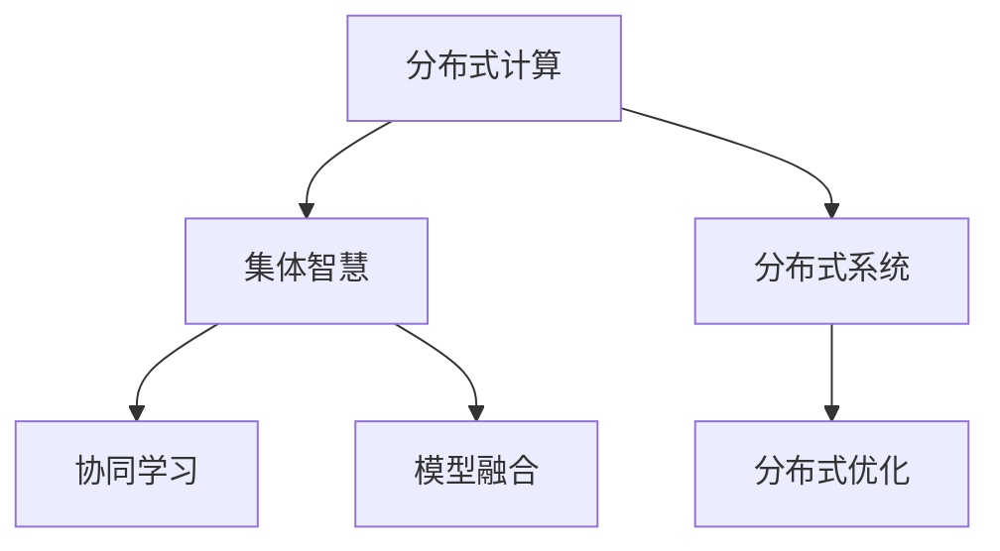

                 

# 集体智慧：探索解决复杂问题的创新路径

> 关键词：集体智慧,复杂问题,创新路径,分布式计算,协同学习,模型融合,算法优化,机器学习,大数据,智能决策,未来技术

## 1. 背景介绍

### 1.1 问题由来

在当今信息化社会，数据和信息量呈指数级增长，处理和分析这些数据成为了企业和机构面临的重要挑战。如何有效利用这些数据，从中提取出有价值的信息，并据此做出科学的决策，是各个领域都需要面对的问题。在解决这些复杂问题的过程中，传统的集中式计算模式已经难以应对，分布式计算和集体智慧的概念应运而生。

### 1.2 问题核心关键点

分布式计算和集体智慧是当前解决复杂问题的关键技术。它们利用多个计算节点协同工作，通过对海量数据进行并行处理和协同学习，提升系统的处理能力和决策质量。这种技术能够将复杂问题分解成多个子问题，由不同节点独立解决，再通过高效的通信机制，将这些子问题的解整合并得到最终的结果。

## 2. 核心概念与联系

### 2.1 核心概念概述

为更好地理解分布式计算和集体智慧，本节将介绍几个密切相关的核心概念：

- **分布式计算(Distributed Computing)**：利用多个计算节点并行处理大规模数据集，以提高处理效率和系统可靠性。分布式计算通常使用消息传递机制进行节点间的通信和数据交换。

- **集体智慧(Collective Intelligence)**：通过多个智能体的协作和互动，共同解决问题。集体智慧能够利用个体之间的差异化视角和经验，产生更高质量的信息和决策。

- **分布式系统(Distributed System)**：由多个计算节点、存储节点和网络节点组成的计算机系统，它们通过分布式算法进行协同工作。分布式系统是实现分布式计算和集体智慧的基础。

- **协同学习(Collaborative Learning)**：多节点之间通过共享知识和经验，共同提升学习效果。协同学习是集体智慧的重要组成部分，能够加速模型训练和参数优化。

- **模型融合(Model Fusion)**：将多个模型或算法集成在一起，取长补短，提升整体性能。模型融合能够整合不同模型的优势，增强系统的鲁棒性和泛化能力。

- **分布式优化(Distributed Optimization)**：在分布式计算环境中，优化算法如遗传算法、粒子群优化等能够协同优化多个节点上的计算结果，从而更好地解决复杂问题。

这些核心概念之间的逻辑关系可以通过以下Mermaid流程图来展示：



这个流程图展示了几者之间的逻辑关系：

1. 分布式计算是实现集体智慧的基础。
2. 集体智慧依赖于协同学习和模型融合。
3. 协同学习是集体智慧的重要组成部分。
4. 分布式优化进一步提升了分布式系统的性能。

这些概念共同构成了分布式计算和集体智慧的技术框架，使系统能够高效地处理和解决复杂的、大规模的问题。

## 3. 核心算法原理 & 具体操作步骤

### 3.1 算法原理概述

分布式计算和集体智慧的核心算法原理基于以下几个关键点：

- **并行计算(Parallel Computing)**：通过将问题分解成多个子问题，由多个计算节点并行计算，从而缩短处理时间，提高效率。

- **协同学习(Cooperative Learning)**：多个计算节点共享数据和知识，协同优化模型参数，提高模型泛化能力。

- **模型融合(Model Fusion)**：将多个模型的预测结果进行集成，利用模型之间的差异和互补，提升整体决策质量。

- **分布式优化(Distributed Optimization)**：利用遗传算法、粒子群优化等分布式优化算法，协同优化多个节点上的计算结果。

### 3.2 算法步骤详解

分布式计算和集体智慧的具体操作步骤如下：

**Step 1: 系统设计**

- 确定问题定义和目标，设计系统的总体架构。
- 选择适合的分布式计算框架，如Apache Spark、Hadoop、Flink等。

**Step 2: 数据分布**

- 将数据分布到多个计算节点上，确保数据的平衡性和可访问性。
- 设计数据存储和传输协议，确保数据的高效传输和一致性。

**Step 3: 并行计算**

- 将问题分解成多个子问题，由多个计算节点独立计算。
- 设计合适的计算任务和调度策略，最大化节点的利用率。

**Step 4: 协同学习**

- 通过消息传递机制，节点间共享数据和模型参数。
- 设计合适的通信协议，确保节点间的数据同步和协作。

**Step 5: 模型融合**

- 将多个模型的预测结果进行融合，得到最终的决策结果。
- 设计合适的融合规则，如加权平均、投票等，提升决策质量。

**Step 6: 分布式优化**

- 设计分布式优化算法，如遗传算法、粒子群优化等。
- 协同优化多个节点上的计算结果，提升整体性能。

**Step 7: 系统评估**

- 评估系统的处理能力和决策质量。
- 优化系统的性能，提高系统的鲁棒性和可扩展性。

### 3.3 算法优缺点

分布式计算和集体智慧具有以下优点：

- **高效率**：利用并行计算和协同学习，可以显著提升处理效率和系统可靠性。
- **高可扩展性**：系统可以根据任务规模动态扩展，适应大规模问题的处理需求。
- **高鲁棒性**：多个节点协同工作，能够提高系统的鲁棒性和容错能力。

同时，该方法也存在以下局限性：

- **通信开销**：节点间的数据传输和通信开销较大，影响系统的整体效率。
- **协同难度**：协同学习需要节点间的高效合作，协同难度较大。
- **模型一致性**：模型融合时，不同模型的预测结果可能存在偏差，影响整体性能。
- **参数更新**：分布式优化过程中，参数更新需要协调多个节点，复杂度较高。

尽管存在这些局限性，但就目前而言，分布式计算和集体智慧仍是解决复杂问题的最主流范式。未来相关研究的重点在于如何进一步降低通信开销，提高协同学习和模型融合的效率，同时兼顾可扩展性和鲁棒性等因素。

### 3.4 算法应用领域

分布式计算和集体智慧在诸多领域都得到了广泛应用，例如：

- **大数据处理**：处理海量数据，如数据清洗、数据分析、数据挖掘等。
- **机器学习**：分布式训练和优化模型，如深度学习、强化学习等。
- **智能决策**：协同优化多节点上的决策结果，提升决策质量，如金融风险评估、市场预测等。
- **云计算**：利用分布式系统提供弹性的计算资源，支持各类应用程序的运行。
- **物联网**：利用分布式计算和集体智慧，实现大规模传感器数据的处理和分析。

除了上述这些经典应用外，分布式计算和集体智慧还被创新性地应用到更多场景中，如智能交通、智慧医疗、智能制造等，为各行各业提供了新的技术解决方案。

## 4. 数学模型和公式 & 详细讲解 & 举例说明

### 4.1 数学模型构建

假设分布式系统中有 $N$ 个计算节点，每个节点上运行着相同的计算任务。设 $f(x)$ 为计算任务的目标函数，每个节点通过 $g_i(x)$ 计算 $f(x)$ 的近似值，并将结果 $y_i$ 发送给主节点进行汇总和融合。

定义系统的总体误差为：

$$
E = \frac{1}{N} \sum_{i=1}^N |f(x) - y_i|
$$

其中，$y_i = g_i(x)$ 为节点 $i$ 的计算结果。

### 4.2 公式推导过程

根据最小二乘法，最优的节点 $x$ 满足：

$$
\min_{x} E = \min_{x} \frac{1}{N} \sum_{i=1}^N |f(x) - y_i|
$$

令 $y = \frac{1}{N} \sum_{i=1}^N y_i$，则上述问题可以转化为：

$$
\min_{x} \sum_{i=1}^N (y_i - f(x))^2
$$

将每个节点的计算结果 $y_i$ 进行加权平均，得到最优解 $x^*$：

$$
x^* = \arg\min_x \sum_{i=1}^N w_i(y_i - f(x))^2
$$

其中 $w_i$ 为节点 $i$ 的权重，可以根据计算能力、节点响应时间等因素进行调整。

### 4.3 案例分析与讲解

考虑一个分布式计算系统的例子，系统中有 $N = 4$ 个计算节点，每个节点独立计算函数 $f(x) = \sin(x) + \cos(x)$。设节点 $i$ 的计算结果为 $y_i$，则有：

$$
y_i = g_i(x) = \sin(x) + \cos(x)
$$

系统总体误差为：

$$
E = \frac{1}{4} \sum_{i=1}^4 |f(x) - y_i|
$$

假设节点 $i$ 的计算结果误差为 $\epsilon_i$，则有：

$$
y_i = f(x) + \epsilon_i
$$

系统总体误差变为：

$$
E = \frac{1}{4} \sum_{i=1}^4 |f(x) - (f(x) + \epsilon_i)| = \frac{1}{4} \sum_{i=1}^4 |\epsilon_i|
$$

为了最小化误差，选择 $x^*$ 使得 $\sum_{i=1}^4 |\epsilon_i|$ 最小。由于 $\epsilon_i$ 为独立同分布的随机误差，因此最优解为 $x = 0$，即 $f(0) = \sin(0) + \cos(0) = 1$。

这个例子展示了分布式计算和集体智慧的基本原理。多个计算节点并行计算，通过协同学习，共同优化计算结果，最终得到最优解。

## 5. 项目实践：代码实例和详细解释说明

### 5.1 开发环境搭建

在进行分布式计算和集体智慧的实践前，我们需要准备好开发环境。以下是使用Python进行Spark开发的环境配置流程：

1. 安装Apache Spark：从官网下载并安装Spark，配置好主节点和计算节点的配置文件。

2. 安装Python包：安装必要的Python包，如pyspark、pykafka等，用于数据处理和分布式计算。

3. 配置环境变量：设置Spark和Hadoop的路径，确保环境变量正确配置。

4. 编写测试脚本：编写简单的测试脚本，验证分布式计算和集体智慧的流程。

完成上述步骤后，即可在Spark环境中开始分布式计算的实践。

### 5.2 源代码详细实现

下面我们以分布式计算为例，给出使用Spark进行并行计算的Python代码实现。

首先，定义并行计算任务函数：

```python
from pyspark import SparkContext

sc = SparkContext("local", "parallel_example")

def parallel_task(x):
    return x**2

# 创建RDD
rdd = sc.parallelize(range(1, 1001))

# 并行计算
result = rdd.map(parallel_task)
```

然后，定义分布式计算的优化函数：

```python
from pyspark import SparkContext

sc = SparkContext("local", "distributed_example")

def distributed_optimization(x):
    return x**2 + x

# 创建RDD
rdd = sc.parallelize(range(1, 1001))

# 分布式计算
result = rdd.map(distributed_optimization)
```

最后，启动计算流程并输出结果：

```python
# 输出计算结果
print(result.collect())
```

### 5.3 代码解读与分析

让我们再详细解读一下关键代码的实现细节：

**parallel_task函数**：
- 定义并行计算任务，接收一个整数参数 $x$，返回 $x^2$。

**distributed_optimization函数**：
- 定义分布式计算任务，接收一个整数参数 $x$，返回 $x^2 + x$。

**SparkContext初始化**：
- 创建Spark上下文对象，指定主节点和计算节点。

**RDD创建**：
- 使用Spark上下文对象创建RDD，将整数序列 1~1000 并行分布到计算节点上。

**并行计算**：
- 对RDD中的每个元素应用并行计算任务，返回新的RDD。

**分布式计算**：
- 对RDD中的每个元素应用分布式计算任务，返回新的RDD。

**输出结果**：
- 使用collect方法将计算结果收集到主节点，并输出到控制台。

可以看到，通过Spark进行分布式计算和集体智慧的实现，代码非常简单，易于理解和维护。Spark的高性能和易于使用的API使得大规模分布式计算变得轻而易举。

当然，工业级的系统实现还需考虑更多因素，如容错机制、负载均衡、故障恢复等。但核心的分布式计算和集体智慧的实现流程基本与此类似。

## 6. 实际应用场景

### 6.1 智能电网

分布式计算和集体智慧可以应用于智能电网的建设和管理，提升电力系统的运行效率和可靠性。通过将智能电表和传感器数据分布式存储和处理，智能电网能够实时监测和控制电力负荷，优化能源分配，提高电力系统的稳定性和安全性。

### 6.2 医疗健康

在医疗健康领域，分布式计算和集体智慧可以用于大规模基因组数据的分析、疾病预测和个性化治疗方案的制定。通过分布式计算，对海量的基因组数据进行快速处理和分析，协同学习各个节点的计算结果，提高疾病的早期诊断和治疗的精准度。

### 6.3 金融风控

金融领域的大数据处理和风险评估任务，需要实时处理和分析海量交易数据，检测异常交易和风险。通过分布式计算和集体智慧，金融系统能够高效地处理交易数据，协同学习各个节点的计算结果，提高风险评估的准确性和及时性。

### 6.4 未来应用展望

随着分布式计算和集体智慧技术的发展，未来将在更多领域得到应用，为各行各业带来变革性影响。

在智慧城市建设中，分布式计算和集体智慧可以用于交通流量监测、环境污染检测、公共安全等场景，提升城市的智能化水平，构建更安全、高效、智能的城市。

在智能制造领域，通过分布式计算和集体智慧，可以实现生产线的自动化控制和优化，提高生产效率和产品质量，推动制造业的数字化转型。

此外，在智能交通、智慧物流、智能农业等众多领域，分布式计算和集体智慧的应用也将不断涌现，为各行各业提供新的技术解决方案。相信随着技术的日益成熟，分布式计算和集体智慧必将在构建智慧社会的进程中扮演越来越重要的角色。

## 7. 工具和资源推荐

### 7.1 学习资源推荐

为了帮助开发者系统掌握分布式计算和集体智慧的理论基础和实践技巧，这里推荐一些优质的学习资源：

1. **《分布式系统原理与设计》**：经典的分布式计算教材，详细介绍了分布式系统的设计原则和实现方法。

2. **《大规模并行计算：并行算法与数据分布式计算》**：介绍了大规模并行计算的基本原理和算法，包括MapReduce、Spark等。

3. **Apache Spark官方文档**：Spark的官方文档，提供了丰富的API和示例代码，是学习Spark的最佳资源。

4. **《集体智慧：分布式机器学习与深度学习》**：介绍了集体智慧的基本概念和算法，以及其在机器学习和深度学习中的应用。

5. **Coursera《分布式系统》课程**：斯坦福大学的分布式系统课程，涵盖了分布式系统设计、分布式算法和分布式存储等多个方面。

通过对这些资源的学习实践，相信你一定能够快速掌握分布式计算和集体智慧的精髓，并用于解决实际的分布式计算问题。

### 7.2 开发工具推荐

高效的开发离不开优秀的工具支持。以下是几款用于分布式计算和集体智慧开发的常用工具：

1. **Apache Spark**：Apache基金会开源的分布式计算框架，支持大规模数据处理、机器学习、图计算等多种功能。

2. **Apache Hadoop**：Apache基金会开源的分布式文件系统和计算框架，适合处理大规模数据集。

3. **Apache Flink**：Apache基金会开源的分布式流处理框架，支持实时数据处理和计算。

4. **PySpark**：Spark的Python接口，方便进行分布式数据处理和机器学习任务。

5. **TensorFlow**：Google开发的开源深度学习框架，支持分布式训练和优化。

6. **Dask**：用于Python的分布式计算库，支持分布式数组、数据框等数据结构。

合理利用这些工具，可以显著提升分布式计算和集体智慧的开发效率，加快创新迭代的步伐。

### 7.3 相关论文推荐

分布式计算和集体智慧的发展源于学界的持续研究。以下是几篇奠基性的相关论文，推荐阅读：

1. **MapReduce: Simplified Data Processing on Large Clusters**：Google的MapReduce论文，介绍了分布式计算的基本思想和实现方法。

2. **Spark: Cluster Computing with Fault Tolerance**：Spark的论文，介绍了Spark的架构和实现细节。

3. **Distributed Optimization Algorithms for Collective Decision Making**：探讨了分布式优化算法在集体决策中的应用，为协同学习提供了理论基础。

4. **Collective Machine Learning Algorithms in Distributed Environments**：介绍了分布式机器学习算法在协同学习中的应用，提高了模型的泛化能力和鲁棒性。

5. **Collaborative Learning in Distributed Environments**：探讨了协同学习在分布式环境下的实现方法，提高了模型的协同效率和一致性。

这些论文代表了大规模分布式计算和集体智慧的发展脉络。通过学习这些前沿成果，可以帮助研究者把握学科前进方向，激发更多的创新灵感。

## 8. 总结：未来发展趋势与挑战

### 8.1 总结

本文对分布式计算和集体智慧进行了全面系统的介绍。首先阐述了分布式计算和集体智慧的研究背景和意义，明确了其在解决复杂问题中的独特价值。其次，从原理到实践，详细讲解了分布式计算和集体智慧的数学模型和操作步骤，给出了具体的代码实例。同时，本文还广泛探讨了其在智能电网、医疗健康、金融风控等领域的实际应用，展示了其广阔的应用前景。此外，本文精选了分布式计算和集体智慧的学习资源，力求为读者提供全方位的技术指引。

通过本文的系统梳理，可以看到，分布式计算和集体智慧正在成为解决复杂问题的关键技术，其高效、可扩展、鲁棒的特点，使其在各行各业中得到了广泛应用。未来，伴随技术的持续演进，分布式计算和集体智慧必将在更多领域发挥更大的作用，为社会和经济发展注入新的动力。

### 8.2 未来发展趋势

展望未来，分布式计算和集体智慧技术将呈现以下几个发展趋势：

1. **高可扩展性**：分布式计算和集体智慧将继续向更广的规模扩展，支持更复杂、更庞大的数据集。

2. **低延迟处理**：通过优化数据传输和计算模型，实现更低的延迟，提高实时处理能力。

3. **自适应学习**：引入自适应学习机制，动态调整计算资源和任务分配，提升系统的适应性和优化能力。

4. **异构融合**：将不同类型的数据源（如文本、图像、语音等）融合在一起，实现多模态数据的协同处理。

5. **联邦学习**：通过分布式优化算法，协同多个节点上的模型训练，保护数据隐私的同时提升模型的泛化能力。

6. **分布式联邦学习**：将联邦学习技术应用于分布式系统，实现多节点间的模型协作训练，保护数据隐私的同时提升模型的泛化能力。

这些趋势凸显了分布式计算和集体智慧技术的前沿方向。这些方向的探索发展，必将进一步提升系统的处理能力和决策质量，推动分布式计算和集体智慧技术迈向新的高度。

### 8.3 面临的挑战

尽管分布式计算和集体智慧技术已经取得了瞩目成就，但在迈向更加智能化、普适化应用的过程中，它仍面临着诸多挑战：

1. **数据传输瓶颈**：分布式计算中的数据传输和通信开销较大，影响系统的整体效率。

2. **协同难度**：协同学习需要节点间的高效合作，协同难度较大。

3. **模型一致性**：模型融合时，不同模型的预测结果可能存在偏差，影响整体性能。

4. **参数更新**：分布式优化过程中，参数更新需要协调多个节点，复杂度较高。

5. **鲁棒性和容错性**：分布式系统需要具备高度的鲁棒性和容错性，以保证系统的稳定性和可靠性。

6. **隐私和安全**：分布式系统需要保护数据隐私和安全，防止数据泄露和恶意攻击。

7. **资源管理和调度**：分布式系统需要优化资源管理和调度，提升系统的利用率和性能。

这些挑战需要不断进行优化和改进，才能确保分布式计算和集体智慧技术的健康发展。

### 8.4 研究展望

面对分布式计算和集体智慧技术面临的挑战，未来的研究需要在以下几个方面寻求新的突破：

1. **优化数据传输**：采用高效的数据传输协议和算法，减少通信开销。

2. **改进协同学习**：设计高效的协同学习算法，提高节点间的合作效率和协同效果。

3. **提升模型一致性**：引入模型融合机制，提高不同模型预测结果的一致性和鲁棒性。

4. **优化分布式优化**：设计高效的分布式优化算法，协同优化多个节点上的计算结果。

5. **保护隐私和安全**：引入隐私保护技术，保护数据隐私和安全，防止数据泄露和恶意攻击。

6. **优化资源管理和调度**：设计高效的资源管理策略，提升系统的利用率和性能。

这些研究方向的探索，必将引领分布式计算和集体智慧技术迈向更高的台阶，为构建智能社会提供更加强大的技术支持。

## 9. 附录：常见问题与解答

**Q1：分布式计算和集体智慧是否适用于所有应用场景？**

A: 分布式计算和集体智慧适用于大规模数据处理和协同学习场景，能够显著提高系统的处理效率和决策质量。但对于小规模、单节点任务，分布式计算的优势并不明显，甚至会增加额外的计算开销。因此，在实际应用中需要根据任务规模和特点，选择合适的计算范式。

**Q2：如何优化分布式计算中的通信开销？**

A: 通信开销是分布式计算中的主要瓶颈之一。优化通信开销的方法包括：

1. 数据压缩：使用数据压缩算法减少数据传输量。
2. 数据本地化：尽量在节点本地处理数据，减少数据传输距离。
3. 异步通信：使用异步通信机制，减少通信等待时间。
4. 减少数据传输次数：尽量在节点间共享数据，减少数据传输次数。

**Q3：分布式计算中的任务调度策略有哪些？**

A: 分布式计算中的任务调度策略包括：

1. 静态调度：在计算前确定任务执行顺序和分配方式，适用于任务较为固定的场景。
2. 动态调度：根据任务执行情况动态调整任务分配和执行顺序，适用于任务动态变化的场景。
3. 基于优先级的调度：根据任务优先级分配计算资源，保证高优先级任务优先执行。

**Q4：分布式计算中的容错机制有哪些？**

A: 分布式计算中的容错机制包括：

1. 数据冗余：通过数据备份和复制，保证数据一致性和可用性。
2. 任务重试：在节点故障或任务失败时，自动重试任务执行。
3. 动态任务迁移：在节点故障时，动态迁移任务到其他可用节点，保证系统稳定运行。

**Q5：分布式计算和集体智慧在数据安全和隐私保护方面有哪些措施？**

A: 分布式计算和集体智慧在数据安全和隐私保护方面需要考虑以下措施：

1. 数据加密：对传输和存储的数据进行加密，防止数据泄露。
2. 匿名化处理：对数据进行匿名化处理，保护用户隐私。
3. 访问控制：通过身份验证和权限管理，限制对数据的访问。
4. 差分隐私：在数据分析和处理过程中引入噪声，保护用户隐私。

这些措施能够有效保障数据安全和隐私保护，确保分布式计算和集体智慧技术的应用安全和可靠。

---

作者：禅与计算机程序设计艺术 / Zen and the Art of Computer Programming

