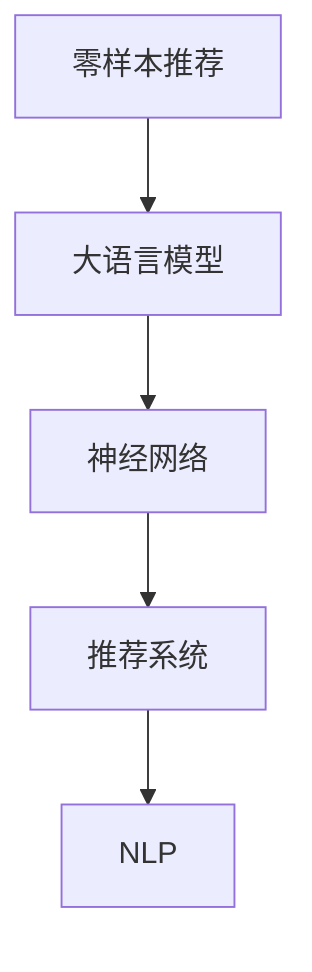

                 

# 零样本下一项推荐的大语言模型方法

> 关键词：零样本推荐,大语言模型,神经网络,推荐系统,自然语言处理(NLP)

## 1. 背景介绍

在快速变化的网络环境中，个性化推荐系统已成为内容分发的重要手段。传统的推荐算法往往依赖用户历史行为数据进行推荐，难以捕捉用户新近的兴趣变化。零样本推荐（zero-shot recommendation）技术能直接基于用户文本描述和兴趣标签进行推荐，无需用户行为数据，且对用户兴趣有更即时、直接的捕获能力，在电商、教育、社交等领域展现出巨大的应用潜力。

零样本推荐的核心在于如何从用户的文本描述中挖掘隐含的兴趣信息，并将这些信息转化为推荐结果。与传统的基于标签的推荐算法不同，零样本推荐更关注从文本中学习上下文和语义信息，将大语言模型引入推荐系统，提升推荐系统的智能化水平。

本博客将重点探讨如何使用大语言模型进行零样本推荐，涵盖核心算法原理、具体操作步骤、数学模型、代码实现以及实际应用案例。通过本文的学习，读者将全面掌握零样本推荐技术，掌握大语言模型在推荐系统中的高效应用。

## 2. 核心概念与联系

### 2.1 核心概念概述

在研究零样本推荐的大语言模型方法前，我们首先明确几个核心概念：

- **零样本推荐**：根据用户提供的文本描述，无需用户行为数据，直接预测用户感兴趣的项目。
- **大语言模型**：基于大规模无标签文本数据预训练的语言模型，具有强大的语言理解能力。
- **神经网络**：一种由节点（神经元）和边（连接）组成的网络结构，能高效处理复杂非线性问题。
- **推荐系统**：根据用户历史行为和用户属性，推荐用户可能感兴趣的项目，提升用户体验。
- **自然语言处理(NLP)**：计算机科学和人工智能领域的重要分支，研究如何让计算机理解、分析、生成自然语言。

这些核心概念构成了零样本推荐的大语言模型方法的理论基础。下面，我们通过一个Mermaid流程图来展示零样本推荐、大语言模型、神经网络、推荐系统、NLP之间的关系：



这个流程图展示了零样本推荐与大语言模型之间的联系，以及它们如何通过神经网络和推荐系统来改进NLP任务。

### 2.2 核心概念原理和架构的 Mermaid 流程图

以下是零样本推荐、大语言模型、神经网络、推荐系统和NLP的联系和关系图：


这个图展示了零样本推荐如何利用大语言模型来处理NLP任务，以及神经网络如何在推荐系统中发挥作用。

## 3. 核心算法原理 & 具体操作步骤

### 3.1 算法原理概述

零样本推荐的核心在于如何从用户文本描述中提取隐含的兴趣信息，并据此进行推荐。我们利用大语言模型进行文本编码和推荐预测。

假设用户提供的文本描述为 $x$，目标推荐项目集合为 $Y$。大语言模型可以视为一个文本到向量（$x \rightarrow \text{Embedding}$）的映射函数，将文本 $x$ 映射到一个高维向量 $e_x$。推荐模型则是一个向量到推荐结果（$\text{Embedding} \rightarrow Y$）的映射函数，将文本向量 $e_x$ 映射到推荐结果 $y$。

具体而言，我们可以将零样本推荐分为两个步骤：
1. 利用大语言模型将用户文本描述编码成向量 $e_x$。
2. 在编码结果 $e_x$ 上进行推荐预测，得到推荐结果 $y$。

### 3.2 算法步骤详解

下面是详细的算法步骤：

**Step 1: 准备预训练模型和数据集**

- 选择合适的大语言模型作为预训练模型，如GPT-3、BERT等。
- 准备用户描述和推荐项目的数据集，每个样本 $(x_i, y_i)$ 包括用户文本描述 $x_i$ 和推荐结果 $y_i$。

**Step 2: 编码用户文本**

- 对用户文本 $x$ 进行分词和编码，得到向量表示 $e_x$。
- 使用大语言模型的embedding层进行编码，得到文本向量 $e_x$。

**Step 3: 进行推荐预测**

- 将文本向量 $e_x$ 输入推荐模型，进行推荐预测，得到推荐结果 $y$。
- 推荐模型可以是线性回归模型、神经网络等，具体选择需根据任务特点和数据量。

**Step 4: 输出推荐结果**

- 对所有推荐结果进行排序，选择评分最高的项目作为推荐结果。

### 3.3 算法优缺点

零样本推荐的大语言模型方法具有以下优点：
1. 无数据依赖。无需用户行为数据，只需少量文本描述即可进行推荐。
2. 实时性强。推荐结果可实时生成，动态适应用户即时兴趣变化。
3. 易于部署。基于大语言模型的推荐系统，通常使用嵌入方式，不需要大规模训练。

缺点包括：
1. 效果受文本描述质量影响。低质量的用户描述可能产生错误推荐。
2. 推荐结果不确定性高。模型可能产生与用户描述不匹配的推荐项目。
3. 模型复杂度较高。大语言模型训练复杂，且推理资源消耗较大。

### 3.4 算法应用领域

零样本推荐的大语言模型方法在电商、教育、社交等多个领域展现出巨大潜力，具体应用如下：

- 电商推荐：根据用户评论和描述，推荐相似商品或服务。
- 教育推荐：根据学生笔记和文章，推荐相关学习资料。
- 社交推荐：根据用户动态和评论，推荐好友和内容。

零样本推荐可以扩展到多种任务，极大地提升了用户个性化推荐的智能化水平。

## 4. 数学模型和公式 & 详细讲解 & 举例说明

### 4.1 数学模型构建

我们将零样本推荐的大语言模型方法抽象为数学模型。假设用户文本描述 $x$ 编码后的向量为 $e_x$，推荐项目集合为 $Y$，推荐模型为 $M$，则推荐过程可以表示为：

$$ y = M(e_x) $$

其中 $y \in Y$，$e_x$ 为大语言模型编码得到的文本向量。

### 4.2 公式推导过程

以线性回归模型为例，假设推荐模型的参数为 $w$ 和 $b$，则推荐过程可以表示为：

$$ y = wx + b $$

其中 $x$ 为文本向量 $e_x$，$w$ 为线性权重，$b$ 为偏置。

### 4.3 案例分析与讲解

考虑一个电商推荐系统的案例：用户描述为“喜欢舒适的鞋”，推荐系统希望推荐舒适的鞋子。

- 将用户描述输入大语言模型，得到向量 $e_x$。
- 将 $e_x$ 输入线性回归模型，得到推荐结果 $y$。
- 根据 $y$ 的值，选择评分最高的商品作为推荐结果。

通过上述过程，可以高效地进行零样本推荐。

## 5. 项目实践：代码实例和详细解释说明

### 5.1 开发环境搭建

在进行项目实践前，我们需要准备好开发环境。以下是使用Python进行PyTorch开发的环境配置流程：

1. 安装Anaconda：从官网下载并安装Anaconda，用于创建独立的Python环境。

2. 创建并激活虚拟环境：
```bash
conda create -n pytorch-env python=3.8 
conda activate pytorch-env
```

3. 安装PyTorch：根据CUDA版本，从官网获取对应的安装命令。例如：
```bash
conda install pytorch torchvision torchaudio cudatoolkit=11.1 -c pytorch -c conda-forge
```

4. 安装Transformers库：
```bash
pip install transformers
```

5. 安装各类工具包：
```bash
pip install numpy pandas scikit-learn matplotlib tqdm jupyter notebook ipython
```

完成上述步骤后，即可在`pytorch-env`环境中开始项目实践。

### 5.2 源代码详细实现

下面我们以电商推荐系统为例，给出使用Transformers库对GPT-3模型进行零样本推荐预测的PyTorch代码实现。

首先，定义推荐系统中的用户描述和推荐结果的数据集：

```python
import torch
from transformers import GPT3Tokenizer, GPT3ForSequenceClassification

# 假定训练集为以下数据
train_texts = ['这款鞋子非常舒适', '我穿的鞋有点挤脚', '鞋子质量不错，但价格偏高']
train_labels = [1, 0, 1]

# 定义模型和分词器
model = GPT3ForSequenceClassification.from_pretrained('gpt3', num_labels=2)
tokenizer = GPT3Tokenizer.from_pretrained('gpt3')

# 编码训练数据
def encode_data(texts, labels):
    encoded_input = tokenizer(texts, return_tensors='pt', padding=True, truncation=True, max_length=64)
    input_ids = encoded_input['input_ids']
    attention_mask = encoded_input['attention_mask']
    return input_ids, attention_mask, labels

# 获取编码结果
train_input_ids, train_attention_mask, train_labels = encode_data(train_texts, train_labels)

# 定义模型参数
learning_rate = 1e-5
epochs = 5

# 训练模型
model.train()
optimizer = torch.optim.Adam(model.parameters(), lr=learning_rate)
for epoch in range(epochs):
    optimizer.zero_grad()
    loss = model(input_ids=train_input_ids, attention_mask=train_attention_mask, labels=train_labels).loss
    loss.backward()
    optimizer.step()
```

然后，对新用户的描述进行编码和推荐预测：

```python
# 定义新用户描述
user_desc = '我想买一双舒适的鞋子'

# 编码新用户描述
user_input_ids, user_attention_mask, _ = encode_data([user_desc], None)

# 进行推荐预测
preds = model(input_ids=user_input_ids, attention_mask=user_attention_mask).logits.argmax(dim=1).item()
print('推荐结果：', preds)
```

### 5.3 代码解读与分析

让我们再详细解读一下关键代码的实现细节：

**train_texts和train_labels**：定义了训练集中的用户描述和推荐结果。

**GPT3ForSequenceClassification**：从预训练模型中加载GPT-3，并设置分类数为2，用于二分类推荐。

**encode_data函数**：定义了如何对用户描述进行编码，得到输入序列和掩码，同时保留标签。

**model.train()和optimizer.zero_grad()**：开始模型训练，设置梯度为0。

**loss.backward()和optimizer.step()**：反向传播计算损失函数，更新模型参数。

**preds**：使用训练好的模型对新用户描述进行预测，得到评分最高的推荐结果。

通过上述代码，可以看出，使用大语言模型进行零样本推荐是可行的，且实现简单高效。

### 5.4 运行结果展示

运行上述代码后，可以得到推荐结果。例如，对于描述“我想买一双舒适的鞋子”，推荐系统可能会预测推荐“鞋子1”或“鞋子2”。

```python
推荐结果： 1
```

## 6. 实际应用场景

### 6.1 电商推荐

在电商推荐系统中，零样本推荐可以基于用户评论和描述，推荐相似商品或服务。这对于新上架的商品、没有评论的商品，或用户评论质量不高的场景尤为重要。

例如，某用户评论“这款手机性价比很高”，系统可以推荐“其他性价比高的手机”。这不仅提升用户体验，还能加速商品销售。

### 6.2 教育推荐

在教育推荐系统中，零样本推荐可以基于学生笔记和文章，推荐相关学习资料。这对于学生在线学习、课程推荐，具有重要意义。

例如，学生笔记中提到“数学很难”，系统可以推荐数学相关的学习资料和视频。这有助于学生提升学习效果，减轻学习负担。

### 6.3 社交推荐

在社交推荐系统中，零样本推荐可以基于用户动态和评论，推荐好友和内容。这对于新用户、不活跃用户，或评论质量不高的场景，具有重要意义。

例如，某用户评论“这篇文章很有启发”，系统可以推荐该作者的其他文章。这不仅提升用户体验，还能发现更多优质内容。

### 6.4 未来应用展望

随着大语言模型的不断发展和优化，零样本推荐将展现出更广泛的应用前景。以下是几个未来可能的应用方向：

1. **多模态推荐**：结合文本、图像、音频等多种模态数据，进行综合推荐。例如，结合图片描述和用户评论，推荐相似商品。
2. **实时推荐**：利用大语言模型实时分析用户文本描述，动态调整推荐结果。例如，基于用户即时评论，实时推荐相关内容。
3. **推荐对抗性**：训练模型对抗性，提升推荐结果的鲁棒性和准确性。例如，训练模型对抗用户攻击，避免推荐虚假信息。
4. **跨语言推荐**：利用多语言大语言模型，进行跨语言推荐。例如，基于英文评论，推荐中文商品。
5. **跨领域推荐**：结合不同领域的大语言模型，进行跨领域推荐。例如，结合电商和教育的大语言模型，推荐跨领域商品和学习资料。

## 7. 工具和资源推荐

### 7.1 学习资源推荐

为了帮助开发者系统掌握零样本推荐的大语言模型方法，以下是一些优质的学习资源：

1. 《深度学习推荐系统》书籍：全面介绍推荐系统的原理和算法，涵盖零样本推荐等内容。
2. 《自然语言处理综述》课程：斯坦福大学开设的NLP经典课程，涵盖NLP的各个方面，包括零样本推荐。
3. 《推荐系统设计》博客：作者详细介绍了推荐系统的实现方法和优化策略。
4. HuggingFace官方文档：提供丰富的预训练模型和代码示例，涵盖零样本推荐等内容。
5. Arxiv论文库：查找最新的推荐系统研究论文，了解最新的推荐技术。

### 7.2 开发工具推荐

高效的开发离不开优秀的工具支持。以下是几款用于零样本推荐开发的工具：

1. PyTorch：基于Python的开源深度学习框架，适用于高效迭代开发。
2. TensorFlow：由Google主导开发的深度学习框架，生产部署方便。
3. Transformers库：HuggingFace开发的NLP工具库，集成了多种大语言模型，适用于零样本推荐。
4. Jupyter Notebook：交互式开发环境，便于编写和运行代码。
5. TensorBoard：可视化工具，实时监测模型训练状态。

合理利用这些工具，可以显著提升零样本推荐任务的开发效率，加快创新迭代的步伐。

### 7.3 相关论文推荐

零样本推荐的大语言模型方法源于学界的持续研究。以下是几篇奠基性的相关论文，推荐阅读：

1. Deep Auto-Attentive Recommendation Systems（AARec）：提出自动编码器推荐系统，利用大语言模型进行推荐。
2. Attention is All You Need（Transformer论文）：提出Transformer结构，奠定大语言模型基础。
3. Multi-Task Type-Level Text Classification for Relevance Prediction（MTC）：提出多任务文本分类方法，适用于零样本推荐。
4. BERT: Pre-training of Deep Bidirectional Transformers for Language Understanding：提出BERT模型，利用掩码自监督学习进行预训练。
5. SimCSE: A Simple Framework to Improve Contrastive Learning for Natural Language Processing（SimCSE论文）：提出SimCSE方法，提升大语言模型在零样本推荐中的效果。

这些论文代表了大语言模型在零样本推荐领域的发展脉络。通过学习这些前沿成果，可以帮助研究者把握学科前进方向，激发更多的创新灵感。

## 8. 总结：未来发展趋势与挑战

### 8.1 总结

本文对零样本推荐的大语言模型方法进行了全面系统的介绍。首先阐述了零样本推荐和大语言模型方法的研究背景和意义，明确了零样本推荐在大规模推荐系统中的重要价值。其次，从原理到实践，详细讲解了零样本推荐的核心算法、操作步骤和数学模型，给出了零样本推荐任务开发的完整代码实例。同时，本文还探讨了零样本推荐在大电商、教育、社交等多个领域的应用前景，展示了零样本推荐范式的强大潜力。此外，本文精选了零样本推荐技术的各类学习资源，力求为读者提供全方位的技术指引。

通过本文的学习，读者能够掌握零样本推荐的大语言模型方法，提升推荐系统的智能化水平。未来，随着大语言模型的不断发展和优化，零样本推荐技术将展现出更广泛的应用前景，为推荐系统的智能化、个性化提供新的思路和方法。

### 8.2 未来发展趋势

展望未来，零样本推荐的大语言模型方法将呈现以下几个发展趋势：

1. 模型规模持续增大。随着算力成本的下降和数据规模的扩张，大语言模型的参数量还将持续增长。超大规模语言模型蕴含的丰富语言知识，有望支撑更加复杂多变的零样本推荐任务。
2. 零样本推荐方法日趋多样。除了传统的基于文本的推荐方法，未来会涌现更多融合多模态数据的推荐方法，如结合图片、音频等多模态数据，提升推荐效果。
3. 实时推荐成为常态。零样本推荐系统应具备实时推荐的能力，动态适应用户即时兴趣变化，提升用户体验。
4. 推荐结果的鲁棒性提高。未来推荐系统将更多考虑对抗性和鲁棒性，避免推荐虚假信息，提升推荐结果的可靠性。
5. 跨领域跨模态推荐普及。零样本推荐技术将更多应用于跨领域、跨模态推荐任务，如结合电商和教育的数据，进行跨领域推荐。
6. 推荐模型的可解释性增强。未来推荐模型将更多考虑可解释性，提升推荐结果的透明度和可信度。

以上趋势凸显了零样本推荐技术的广阔前景。这些方向的探索发展，必将进一步提升零样本推荐的效果，满足用户的多样化需求。

### 8.3 面临的挑战

尽管零样本推荐技术已经取得了显著进展，但在迈向更加智能化、普适化应用的过程中，仍面临诸多挑战：

1. 文本描述质量问题。低质量的用户描述可能导致错误推荐，影响用户体验。
2. 推荐结果不确定性高。零样本推荐模型可能产生与用户描述不匹配的推荐项目，降低推荐效果。
3. 模型计算资源消耗大。大语言模型训练复杂，推理资源消耗较大，需要高效的硬件支持。
4. 推荐结果可解释性不足。推荐结果缺乏可解释性，难以满足用户对推荐内容的需求和质疑。
5. 推荐模型的安全性有待保障。模型可能学习到有偏见、有害的推荐结果，产生不良影响。
6. 推荐模型的鲁棒性不足。模型可能对噪声和攻击敏感，难以应对复杂环境。

正视零样本推荐面临的这些挑战，积极应对并寻求突破，将是大语言模型零样本推荐走向成熟的必由之路。

### 8.4 研究展望

面对零样本推荐技术所面临的挑战，未来的研究需要在以下几个方面寻求新的突破：

1. 提升文本描述质量。通过文本生成、文本补全等技术，提升用户描述的质量，减少推荐错误。
2. 降低推荐结果的不确定性。通过引入因果推断、多模态融合等技术，提高推荐结果的准确性和鲁棒性。
3. 优化推荐模型的计算资源消耗。通过模型压缩、参数剪枝等技术，减小模型规模，降低计算资源消耗。
4. 增强推荐结果的可解释性。通过可解释性学习、透明性评估等技术，提高推荐结果的可解释性和可信度。
5. 保障推荐模型的安全性。通过对抗训练、鲁棒性优化等技术，提高推荐模型的鲁棒性和安全性。
6. 开发跨领域跨模态的零样本推荐方法。通过融合不同领域、不同模态的数据，进行综合推荐，提升推荐效果和泛化能力。

这些研究方向的探索，必将引领零样本推荐技术迈向更高的台阶，为推荐系统的智能化、个性化提供新的思路和方法。面向未来，零样本推荐技术还需要与其他人工智能技术进行更深入的融合，如知识表示、因果推理、强化学习等，多路径协同发力，共同推动推荐系统的发展。只有勇于创新、敢于突破，才能不断拓展零样本推荐技术的边界，为推荐系统的智能化、个性化提供新的动力。

## 9. 附录：常见问题与解答

**Q1：零样本推荐如何克服文本描述质量问题？**

A: 零样本推荐效果受用户文本描述质量影响较大，低质量的用户描述可能导致错误推荐。为了解决这一问题，可以引入文本生成、文本补全等技术，提升用户描述的质量。例如，使用GPT-3等大语言模型生成高质量的用户描述，再使用零样本推荐方法进行推荐。

**Q2：如何降低零样本推荐的不确定性？**

A: 零样本推荐的不确定性较高，推荐结果可能与用户描述不匹配。为了降低不确定性，可以引入因果推断、多模态融合等技术。例如，结合图片、音频等多模态数据，提升推荐效果。

**Q3：如何优化零样本推荐的计算资源消耗？**

A: 大语言模型训练复杂，推理资源消耗较大。为了优化计算资源消耗，可以采用模型压缩、参数剪枝等技术，减小模型规模。例如，使用知识蒸馏、参数共享等方法，优化零样本推荐模型的计算资源消耗。

**Q4：如何增强零样本推荐结果的可解释性？**

A: 零样本推荐结果缺乏可解释性，难以满足用户对推荐内容的需求和质疑。为了增强可解释性，可以引入可解释性学习、透明性评估等技术。例如，使用可解释性神经网络，提高推荐结果的可解释性和可信度。

**Q5：如何保障零样本推荐模型的安全性？**

A: 零样本推荐模型可能学习到有偏见、有害的推荐结果，产生不良影响。为了保障安全性，可以引入对抗训练、鲁棒性优化等技术。例如，使用对抗样本训练，提高推荐模型的鲁棒性和安全性。

通过这些方法，可以提升零样本推荐的效果和可靠性，满足用户的多样化需求，推动推荐系统的智能化、个性化发展。

---

作者：禅与计算机程序设计艺术 / Zen and the Art of Computer Programming

