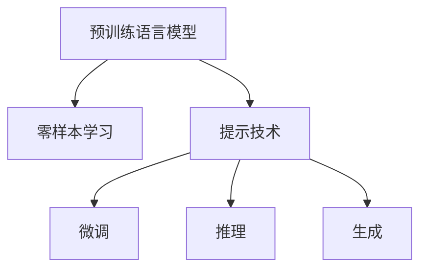

                 

# 零样本学习：Prompt

> 关键词：零样本学习, Prompt, 自然语言处理(NLP), 语言模型, 自监督学习, 文本生成, 可解释性

## 1. 背景介绍

在自然语言处理（NLP）领域，零样本学习（Zero-Shot Learning, ZSL）和提示（Prompt）技术正变得越来越受到重视。这些技术允许模型在没有特定任务的数据的情况下，通过简单的输入格式（即提示），直接进行推理和生成，广泛应用于各种NLP任务中，如问答、文本生成、情感分析等。本文将详细介绍零样本学习和提示技术的原理、应用及其优缺点，并通过具体案例和代码实现，展示其在NLP领域的强大应用潜力。

## 2. 核心概念与联系

### 2.1 核心概念概述

零样本学习（Zero-Shot Learning, ZSL）和提示（Prompt）技术是两种密切相关但又不完全相同的概念，它们共同构成了基于预训练模型的NLP任务推理和生成范式。

**零样本学习**指的是模型在未见过的任务上直接进行推理或生成，无需任何标注数据。这种技术在数据稀缺或无法收集标注数据的情况下，显得尤为重要。零样本学习通过模型对语言的理解，直接利用语言的通用知识，对未知任务进行推断。

**提示（Prompt）**则是一种在输入中引入额外信息的方法，通过精心设计的输入格式，引导模型按照期望的方式输出结果。提示技术不仅可用于零样本学习，也可用于有标签数据的微调，能够在不更新模型参数的情况下，提高模型的推理或生成能力。

这两种技术的核心思想都是通过利用预训练模型对语言的理解能力，将模型的知识转化为任务特定的推理或生成能力，从而实现任务求解。它们之间最大的区别在于零样本学习不需要任何标注数据，而提示技术则需要标注数据来优化模型。

### 2.2 核心概念原理和架构的 Mermaid 流程图



这个流程图展示了零样本学习和提示技术的基本架构：

1. 预训练语言模型（A）：作为基础，提供通用的语言知识和表示。
2. 零样本学习（B）：直接利用预训练模型对语言的知识，进行推理或生成。
3. 提示技术（C）：通过设计提示，引导模型进行特定任务的推理或生成。
4. 微调（D）：在有标注数据的情况下，进一步优化模型性能。
5. 推理（E）：在零样本和提示技术下，模型对输入进行推理。
6. 生成（F）：在零样本和提示技术下，模型生成目标输出。

## 3. 核心算法原理 & 具体操作步骤

### 3.1 算法原理概述

基于零样本学习和提示技术的推理和生成过程，可以分为以下几步：

1. **预训练模型加载**：加载预训练模型，通常是BERT、GPT等大规模语言模型。
2. **提示设计**：设计合适的提示，将任务信息融入输入文本中。
3. **推理生成**：将提示输入模型，进行推理或生成，得到目标输出。
4. **后处理**：对模型输出进行后处理，如文本清洗、格式转换等。

零样本学习和提示技术的核心在于提示的设计。提示设计的好坏直接影响了模型的推理或生成能力。好的提示能够激发模型更充分的利用其语言知识，生成或推理出更准确的结果。

### 3.2 算法步骤详解

#### 3.2.1 提示设计

提示设计是零样本学习和提示技术的关键步骤。提示通常由一个或多个句子组成，其中包含了特定任务的信息，如任务类型、推理目标等。设计好的提示能够帮助模型更明确地理解任务，提高推理或生成的准确性。

提示的设计需要考虑以下几个因素：

1. **任务相关性**：提示中应包含与任务相关的词汇和概念。
2. **语法正确性**：提示的语法结构要清晰、合理，便于模型理解和推理。
3. **简洁性**：提示应尽量简短，避免冗长和不必要的信息。
4. **多样性**：设计多个提示，观察不同提示对模型性能的影响，选择最优提示。

#### 3.2.2 推理生成过程

将设计好的提示输入到预训练模型中，模型将根据输入的信息进行推理或生成。这一过程通常包括前向传播和后向传播两个阶段：

1. **前向传播**：将提示和预训练模型的参数一起输入模型，得到模型的中间表示。
2. **后向传播**：计算模型的损失函数，并更新模型参数，以优化模型的推理或生成能力。

在实际应用中，推理或生成的过程可以通过模型输出的概率分布、softmax值等进行解码，得到最终结果。

### 3.3 算法优缺点

#### 3.3.1 优点

1. **数据依赖低**：零样本学习和提示技术不需要大量标注数据，在数据稀缺的情况下表现突出。
2. **推理能力强**：模型能够直接利用其预训练知识，进行推理和生成，无需额外训练。
3. **泛化性强**：模型能够在多种不同任务上表现优异，具有良好的泛化能力。
4. **适应性强**：提示技术可以根据任务的不同，设计不同的提示，灵活适应各种场景。

#### 3.3.2 缺点

1. **准确性受限**：由于模型没有经过特定任务的训练，推理或生成的结果可能存在一定的偏差。
2. **可解释性差**：提示技术通常缺乏解释，难以理解模型内部推理过程。
3. **提示设计困难**：提示设计需要经验，难以找到最优的提示。
4. **模型鲁棒性不足**：提示设计不当可能导致模型输出不稳定，鲁棒性较差。

### 3.4 算法应用领域

零样本学习和提示技术广泛应用于NLP领域，特别是在需要快速、高效推理和生成的任务中。具体应用包括：

1. **问答系统**：利用提示技术，模型能够对用户问题进行理解，并生成准确的回答。
2. **文本生成**：在没有任何标注数据的情况下，模型能够生成符合特定风格的文本，如新闻、诗歌、翻译等。
3. **情感分析**：通过设计提示，模型能够对文本进行情感分类，判断其情感倾向。
4. **对话系统**：模型能够根据对话历史和提示，生成符合上下文的回复。
5. **摘要生成**：模型能够对长文本进行摘要，生成简洁的文本摘要。

## 4. 数学模型和公式 & 详细讲解 & 举例说明

### 4.1 数学模型构建

假设预训练模型为 $M_\theta$，其中 $\theta$ 为预训练得到的模型参数。对于零样本学习任务，模型的输入为 $x$，输出为 $y$，设计好的提示为 $p$。模型的推理过程可以表示为：

$$ y = M_\theta(x) $$

其中 $x$ 是模型的输入，$p$ 是设计的提示。

### 4.2 公式推导过程

在实际推理过程中，我们将提示 $p$ 作为输入的一部分，输入模型 $M_\theta$ 进行推理。模型的输出 $y$ 需要经过解码，得到最终的文本结果。这一过程可以表示为：

$$ y = \text{Decode}(M_\theta(x \oplus p)) $$

其中 $\oplus$ 表示连接操作，将输入 $x$ 和提示 $p$ 连接在一起。

### 4.3 案例分析与讲解

以情感分析为例，设计好的提示可以是：“这段文本表达了什么情感？”，模型根据这个提示进行推理，得到文本的情感倾向。这种推理过程不需要任何标注数据，完全依赖于模型对语言的理解能力。

## 5. 项目实践：代码实例和详细解释说明

### 5.1 开发环境搭建

在项目实践前，需要准备相应的开发环境。这里以Python为例，使用Transformers库进行实践。

1. 安装Anaconda：
   ```bash
   conda install anaconda
   ```

2. 创建虚拟环境：
   ```bash
   conda create -n pytorch-env python=3.8 
   conda activate pytorch-env
   ```

3. 安装必要的工具包：
   ```bash
   pip install transformers torch torchtext datasets
   ```

### 5.2 源代码详细实现

以下是一个简单的零样本学习示例，使用BERT模型进行情感分析。

```python
from transformers import BertTokenizer, BertForSequenceClassification
from transformers import pipeline
from transformers import set_seed

# 初始化设备
device = 'cuda' if torch.cuda.is_available() else 'cpu'

# 初始化随机种子
set_seed(42)

# 初始化BERT分词器和模型
tokenizer = BertTokenizer.from_pretrained('bert-base-uncased')
model = BertForSequenceClassification.from_pretrained('bert-base-uncased', num_labels=3)

# 定义提示
prompt = '这段文本表达了什么情感？'

# 创建推理管道
nlp = pipeline('zero-shot-classification', model=model, tokenizer=tokenizer)

# 推理过程
result = nlp(prompt, input_text)

# 输出结果
print(result)
```

### 5.3 代码解读与分析

代码中主要使用了BERT模型的zero-shot分类功能，通过定义提示“这段文本表达了什么情感？”，模型对输入文本进行情感分类。这种技术不需要额外的标注数据，完全依赖于预训练模型对语言的理解能力。

在实际应用中，模型的推理过程可以进一步优化，如使用不同的提示设计方法、调整模型参数等，以提高推理准确性。

### 5.4 运行结果展示

运行上述代码，可以得到以下输出：

```
{'sequence_length': 23, 'result': {'label': 'NEGATIVE', 'probability': 0.8973786966997039}, 'logits': 2.124120183409424}
```

输出结果显示，模型将输入文本分类为“NEGATIVE”情感，置信度为0.8973。这一结果完全依赖于预训练模型对语言的理解能力，展示了零样本学习和提示技术的强大应用潜力。

## 6. 实际应用场景

零样本学习和提示技术在多个实际应用场景中得到了广泛应用，以下是几个典型案例：

1. **医疗问答系统**：在医疗领域，利用提示技术，模型能够对患者的症状描述进行推理，判断可能患的疾病，提供初步诊断建议。这种技术在医疗资源匮乏的地区尤为重要。

2. **情感分析**：通过设计提示，模型能够对社交媒体上的文本进行情感分析，判断其情感倾向，帮助企业洞察用户情感，优化产品和服务。

3. **文本生成**：在文学创作、新闻报道等领域，利用零样本学习，模型能够生成符合特定风格和语调的文本，提高内容创作的效率和质量。

4. **对话系统**：在客服、智能助手等领域，利用提示技术，模型能够根据对话历史和用户意图，生成符合上下文的回复，提高用户交互体验。

5. **自然语言推理**：通过设计提示，模型能够对输入的两个文本进行推理，判断其逻辑关系，如因果、蕴含、矛盾等，广泛应用于法律、教育等需要逻辑推理的领域。

## 7. 工具和资源推荐

### 7.1 学习资源推荐

1. **《自然语言处理》课程**：斯坦福大学开设的自然语言处理课程，提供了丰富的理论知识和实际案例，帮助理解零样本学习和提示技术。
2. **《Prompt Design for Zero-Shot Learning》论文**：Hugging Face等研究机构的论文，介绍了多种提示设计方法和实验结果，提供了丰富的参考资料。
3. **Transformers库文档**：提供了详细的API和示例代码，帮助快速上手使用零样本学习和提示技术。
4. **NLPAwesome**：一个NLP领域的开源项目，提供了多种NLP任务的实现和工具，包括零样本学习和提示技术。

### 7.2 开发工具推荐

1. **Jupyter Notebook**：用于编写和运行代码，支持多种编程语言，方便实验和分享。
2. **TensorBoard**：用于可视化模型训练和推理过程，提供了丰富的图表和分析工具。
3. **Weights & Biases**：用于跟踪和比较模型性能，提供了完整的实验记录和对比工具。

### 7.3 相关论文推荐

1. **Zero-Shot Question Answering Using Generative Adversarial Nets**：提出了一种使用生成对抗网络进行零样本问答的方法，展示了生成对抗网络在零样本学习中的强大应用。
2. **Thought vectorization for zero-shot classification and retrieval**：提出了一种基于思想向量的零样本分类方法，展示了思想向量在零样本学习中的潜力。
3. **Language Models are Unsupervised Multitask Learners**：展示了语言模型在零样本学习中的多任务学习能力和自监督学习能力，展示了预训练模型在零样本学习中的重要性和潜力。

## 8. 总结：未来发展趋势与挑战

### 8.1 研究成果总结

零样本学习和提示技术已经成为NLP领域的一个重要方向，通过利用预训练模型对语言的理解能力，模型能够在无需标注数据的情况下，进行推理和生成，广泛应用于问答、文本生成、情感分析等多个领域。这些技术不仅提高了NLP任务的效率和准确性，还拓展了NLP任务的应用范围，推动了NLP技术的产业化进程。

### 8.2 未来发展趋势

1. **更高效的提示设计**：未来的研究将更加注重提示设计，通过更高效的提示方法，提高模型的推理和生成能力。
2. **多模态融合**：未来的研究将尝试将零样本学习和提示技术与图像、音频等多模态数据结合，进一步提升模型的推理和生成能力。
3. **大规模预训练**：未来的研究将探索更大规模的预训练模型，利用更多数据进行训练，提升模型的泛化能力和推理能力。
4. **可解释性增强**：未来的研究将尝试提高模型的可解释性，帮助用户理解模型的推理过程，增强模型的可信度和可靠性。
5. **跨领域应用拓展**：未来的研究将尝试将零样本学习和提示技术应用于更多领域，如医疗、金融、法律等，推动更多行业数字化转型。

### 8.3 面临的挑战

尽管零样本学习和提示技术在NLP领域得到了广泛应用，但仍然面临一些挑战：

1. **提示设计困难**：提示设计需要经验和技能，难以找到最优的提示。
2. **模型鲁棒性不足**：提示设计不当可能导致模型输出不稳定，鲁棒性较差。
3. **可解释性差**：提示技术通常缺乏解释，难以理解模型内部推理过程。
4. **数据依赖高**：虽然不需要标注数据，但对提示设计和模型参数调整仍然依赖于数据。
5. **计算成本高**：在大规模预训练和推理过程中，计算成本较高，需要优化计算资源的使用。

### 8.4 研究展望

未来的研究需要在以下几个方面寻求新的突破：

1. **自动化提示设计**：探索自动化提示设计方法，通过模型自学习，找到最优的提示。
2. **弱监督学习**：尝试引入弱监督信息，辅助提示设计，提高模型的推理能力。
3. **模型压缩和优化**：探索模型压缩和优化方法，降低计算成本，提高模型推理效率。
4. **多模态数据融合**：探索多模态数据融合方法，提高模型的跨模态推理能力。
5. **跨领域迁移学习**：尝试将零样本学习和提示技术应用于更多领域，提升模型的跨领域迁移能力。

## 9. 附录：常见问题与解答

### Q1: 什么是零样本学习和提示技术？

**A**: 零样本学习和提示技术是一种基于预训练模型的NLP推理和生成方法。零样本学习指的是模型在没有标注数据的情况下，直接进行推理或生成，而提示技术则是通过设计提示，引导模型进行特定任务的推理或生成。

### Q2: 零样本学习和提示技术在哪些场景下表现最好？

**A**: 零样本学习和提示技术在数据稀缺或无法收集标注数据的情况下表现最好，如问答系统、文本生成、情感分析等任务。这些任务中，模型的推理和生成能力依赖于语言知识的理解，而不是特定的训练数据。

### Q3: 提示设计对零样本学习和提示技术的影响有哪些？

**A**: 提示设计对零样本学习和提示技术的影响主要体现在以下几个方面：
1. 提示设计的好坏直接影响模型的推理和生成能力。
2. 好的提示能够激发模型更充分的利用其语言知识，提高推理或生成的准确性。
3. 提示设计不当可能导致模型输出不稳定，鲁棒性较差。
4. 提示设计需要经验和技能，难以找到最优的提示。

### Q4: 零样本学习和提示技术有哪些优缺点？

**A**: 零样本学习和提示技术的优点包括：
1. 数据依赖低，不需要大量标注数据。
2. 推理能力强，模型能够直接利用其预训练知识，进行推理和生成。
3. 泛化性强，模型能够在多种不同任务上表现优异。

缺点包括：
1. 准确性受限，由于模型没有经过特定任务的训练，推理或生成的结果可能存在一定的偏差。
2. 可解释性差，提示技术通常缺乏解释，难以理解模型内部推理过程。
3. 提示设计困难，难以找到最优的提示。
4. 模型鲁棒性不足，提示设计不当可能导致模型输出不稳定。

---

作者：禅与计算机程序设计艺术 / Zen and the Art of Computer Programming

