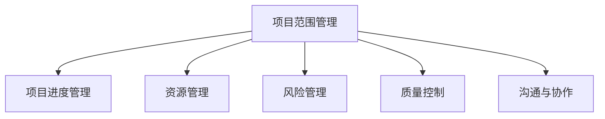

                 

# 项目管理：从启动到收尾的全流程指南

> 关键词：项目管理,敏捷开发,迭代式管理,项目进度跟踪,质量控制,风险管理,沟通与协作,项目收尾

## 1. 背景介绍

### 1.1 问题由来

在现代软件开发过程中，项目管理的复杂性和重要性愈发凸显。随着软件规模和复杂度的不断提升，跨部门协作、跨团队协作、跨周期交付等要求日益增加。面对多变的市场需求和不断变化的技术栈，如何在保证质量的前提下，高效、可靠地交付高质量的软件产品，成为每个项目管理团队都必须解决的核心问题。

项目管理不仅是确保项目按时按预算完成，更关乎如何整合各项资源，协同各相关方，确保最终产出符合预期。本文将深入探讨项目管理的关键概念和核心流程，全面阐述如何从项目启动到项目收尾，系统性地开展项目管理活动。

### 1.2 问题核心关键点

项目管理包括策划、执行、监控和收尾四个阶段，每个阶段都需要科学合理的管理方法，以及有效的工具和流程支撑。在实践中，项目管理的核心挑战包括以下几个方面：

- 如何确定项目范围和目标，并在此基础上制定详细的项目计划。
- 如何高效配置和利用各类资源，包括人力、技术、工具等。
- 如何通过迭代式管理和持续交付，提升项目交付速度和质量。
- 如何实施有效的项目监控和质量控制，保证项目按预期推进。
- 如何在项目收尾阶段进行评估和总结，确保项目成功交付，并积累经验教训。

本文将围绕这些问题，通过理论知识与实践案例相结合的方式，系统阐述如何运用科学的项目管理方法，克服项目管理中的各种挑战，确保项目高效、可靠地推进。

## 2. 核心概念与联系

### 2.1 核心概念概述

项目管理作为一门系统化的学科，涉及众多关键概念。以下将简要介绍几个核心概念，并说明它们之间的联系。

- **项目范围管理**：定义项目的具体目标、工作内容，确保项目与需求保持一致。
- **项目进度管理**：制定详细的项目时间表，跟踪项目进度，确保项目按时完成。
- **资源管理**：配置和利用各种资源，包括人力资源、物资、技术等，确保资源的高效利用。
- **风险管理**：识别、分析和应对项目过程中可能出现的各种风险。
- **质量控制**：确保项目交付的成果符合既定标准，包括功能、性能、安全性等。
- **沟通与协作**：在项目过程中，保持团队成员和利益相关方之间的良好沟通与协作，确保项目顺利推进。

这些概念之间的逻辑关系可以通过以下Mermaid流程图来展示：



这个流程图展示了项目管理的核心概念及其相互关系。项目范围管理定义项目目标和任务，进而决定项目进度、资源需求、风险和质量控制的方向。沟通与协作贯穿整个项目管理过程，是确保其他管理活动有效进行的基础。

## 3. 核心算法原理 & 具体操作步骤

### 3.1 算法原理概述

项目管理的核心算法原理可概括为以下几个方面：

- **迭代式管理**：通过小步快跑、多次迭代的方式，逐步推进项目。每次迭代后进行评估和反馈，及时调整项目方向和资源分配。
- **敏捷开发**：采用Scrum、Kanban等敏捷开发框架，强调团队协作和快速交付。
- **精益管理**：通过消除浪费、持续改进的方式，提升项目管理效率。
- **项目跟踪与控制**：利用甘特图、看板、JIRA等工具，实时监控项目进展，确保项目按计划推进。
- **质量保证**：采用测试驱动开发(TDD)、持续集成(CI)等方法，确保每次交付的质量。

### 3.2 算法步骤详解

基于上述原理，项目管理的具体操作步骤包括以下几个阶段：

#### 3.2.1 项目启动阶段

1. **项目规划**：确定项目目标、范围、需求和资源，制定详细项目计划。
2. **团队组建**：根据项目需求，组建合适的项目团队，并进行角色分配。
3. **利益相关者沟通**：与项目各利益相关者沟通，明确项目目标和期望，确保项目推进顺利。

#### 3.2.2 项目执行阶段

1. **任务分解**：将项目目标分解为可执行的任务，分配给具体团队成员。
2. **迭代开发**：采用Scrum等敏捷方法，进行小步快跑、多次迭代开发。
3. **资源配置**：根据项目需求，动态配置和优化各类资源，确保资源高效利用。
4. **风险管理**：识别和分析项目风险，制定应对策略，减少风险对项目的影响。
5. **质量控制**：实施代码审查、单元测试、功能测试等质量保证措施，确保交付质量。

#### 3.2.3 项目监控阶段

1. **进度跟踪**：利用甘特图、看板等工具，实时监控项目进度，确保按时完成。
2. **质量评估**：定期进行代码评审、性能测试等质量评估活动，确保交付质量。
3. **沟通与协作**：保持团队成员和利益相关者之间的良好沟通，及时解决问题。

#### 3.2.4 项目收尾阶段

1. **成果验收**：与利益相关者确认项目交付成果，进行验收和评估。
2. **总结和评估**：总结项目经验教训，评估项目成果，为后续项目提供参考。
3. **项目文档归档**：整理和归档项目文档，确保知识传承和经验积累。

### 3.3 算法优缺点

项目管理的主要优点包括：

- **提升效率**：通过科学的方法和工具，提升项目管理效率，减少不必要的浪费。
- **提高质量**：通过持续的质量保证措施，确保项目交付的质量符合预期。
- **增强灵活性**：通过敏捷开发和迭代式管理，增强项目的灵活性和适应性。
- **加强协作**：通过有效的沟通和协作机制，确保团队成员和利益相关者之间的紧密合作。

同时，项目管理也存在一些局限性：

- **复杂度高**：项目管理的复杂性较高，需要较多的资源和精力投入。
- **风险多变**：项目过程中可能出现各种未知风险，需要及时应对。
- **沟通成本**：需要大量的沟通和协作活动，可能耗费较多时间和人力。
- **成果验证难度**：项目成果的验收和评估需要多方面参与，有时难以达成一致。

在实际项目管理中，需要综合考虑其优缺点，根据具体情况灵活运用。

### 3.4 算法应用领域

项目管理的方法和技术广泛应用于各种领域，包括软件开发、制造业、金融、医疗等。以下是一些典型的应用场景：

- **软件开发**：在软件开发项目中，项目管理用于定义需求、规划开发、跟踪进度、确保质量等。
- **制造行业**：在制造业项目中，项目管理用于管理生产计划、资源配置、质量控制等。
- **金融领域**：在金融项目中，项目管理用于评估投资风险、监控交易过程、确保合规性等。
- **医疗卫生**：在医疗项目中，项目管理用于协调医疗资源、监控医疗过程、确保医疗质量等。

这些领域的项目管理具有共性，但也各有其特殊性。因此，项目管理的核心方法和技术需要结合具体场景进行灵活应用。

## 4. 数学模型和公式 & 详细讲解 & 举例说明

### 4.1 数学模型构建

项目管理的核心数学模型包括进度模型和资源模型。以下将简要介绍这两个模型及其构建方法。

#### 4.1.1 进度模型

项目进度模型用于描述项目各个阶段的工作量和进度情况。常见的进度模型包括甘特图和PERT图。

- **甘特图**：用于直观展示项目各阶段的进度情况，便于跟踪和管理。甘特图的基本元素包括任务、时间和资源。
- **PERT图**：用于展示项目关键路径和各个任务之间的依赖关系，便于进行风险分析和优化。PERT图的基本元素包括事件、任务和路径。

#### 4.1.2 资源模型

项目资源模型用于描述项目所需的各类资源，包括人力、物力和财力等。常见的资源模型包括资源分配图和资源平衡图。

- **资源分配图**：用于展示各项资源在不同阶段的需求情况，便于进行资源调配和优化。
- **资源平衡图**：用于展示不同阶段的资源需求和供应情况，便于进行资源平衡和优化。

### 4.2 公式推导过程

以下是进度模型和资源模型的一些常用公式及其推导过程：

#### 4.2.1 甘特图公式

假设项目共有n个任务，每个任务的工期为ti（i=1,...,n），依赖关系为ij（i依赖于j），则甘特图的进度公式为：

$$
C_i = \sum_{j=i}^{n} (1 - p_{ij}) \cdot C_j
$$

其中，C_i表示任务i的进度，p_{ij}表示任务j对任务i的依赖关系。

#### 4.2.2 PERT图公式

PERT图的主要目标是确定项目的关键路径，公式如下：

$$
L_k = \max \{ C_k \}
$$

其中，L_k表示任务k的路径长度，C_k表示任务k的完成时间。

#### 4.2.3 资源分配图公式

资源分配图主要用于描述各项资源在不同阶段的需求情况，公式如下：

$$
R_{i,t} = \sum_{j \in \text{predecessors of i}} R_{j,t-1}
$$

其中，R_{i,t}表示任务i在第t阶段的资源需求，predecessors of i表示任务i的前驱任务。

#### 4.2.4 资源平衡图公式

资源平衡图主要用于描述不同阶段的资源需求和供应情况，公式如下：

$$
S_t = \sum_{i \in \text{independent tasks}} R_{i,t}
$$

其中，S_t表示第t阶段的资源供应，R_{i,t}表示任务i在第t阶段的资源需求。

### 4.3 案例分析与讲解

以软件开发项目为例，以下将具体讲解如何使用甘特图和资源模型进行项目管理：

#### 案例1：甘特图应用

假设项目有6个任务，分别为T1到T6，每个任务的工期分别为7天、5天、3天、5天、4天和6天，依赖关系为T1依赖于T2，T2依赖于T3和T4，T3依赖于T5，T4依赖于T5，T5依赖于T6，T6依赖于T1和T4。下图展示了如何使用甘特图进行进度跟踪：

```
1
|--- T1 ------------------- 7
|     |
|     |--- T2 --- 5
|     |
|     |--- T3 --- 3
|     |
|     |--- T4 --- 5
|     |
|     |--- T5 --- 4
|     |
|--- T6 --- 6
```

#### 案例2：资源模型应用

假设项目需要3名开发人员，每个开发人员的日产能分别为2个任务、3个任务和1个任务。项目总工期为21天，任务分配情况如下：

- 前5天，开发人员1和开发人员2负责T1任务，开发人员3负责T2任务。
- 第6天至第9天，开发人员1和开发人员3负责T3任务，开发人员2负责T4任务。
- 第10天至第15天，开发人员1和开发人员2负责T5任务，开发人员3负责T6任务。
- 第16天至第21天，开发人员1和开发人员2负责T1任务，开发人员3负责T2任务。

根据以上需求，资源分配图和资源平衡图如下：

```
Resource Allocation Chart:
T1 | T2 | T3 | T4 | T5 | T6
--- | --- | --- | --- | --- | ---
1   | 0   | 0   | 0   | 0   | 0
2   | 0   | 0   | 0   | 0   | 0
3   | 0   | 1   | 1   | 1   | 1

Resource Balance Chart:
Day | Resource Supply | T1 | T2 | T3 | T4 | T5 | T6
--- | --- | --- | --- | --- | --- | --- | ---
0   | 0     | 0   | 0   | 0   | 0   | 0   | 0
1   | 0     | 0   | 0   | 0   | 0   | 0   | 0
2   | 0     | 0   | 0   | 0   | 0   | 0   | 0
3   | 0     | 0   | 0   | 1   | 1   | 1   | 0
4   | 0     | 0   | 0   | 1   | 1   | 1   | 0
5   | 0     | 0   | 0   | 1   | 1   | 1   | 0
6   | 0     | 0   | 1   | 1   | 1   | 0   | 1
7   | 0     | 0   | 1   | 1   | 0   | 0   | 1
8   | 0     | 0   | 1   | 1   | 0   | 0   | 1
9   | 0     | 0   | 1   | 0   | 1   | 1   | 1
10  | 0     | 0   | 0   | 0   | 0   | 0   | 0
11  | 0     | 0   | 0   | 0   | 0   | 0   | 0
12  | 0     | 0   | 0   | 0   | 0   | 0   | 0
13  | 0     | 0   | 0   | 0   | 0   | 0   | 0
14  | 0     | 0   | 0   | 0   | 0   | 0   | 0
15  | 0     | 0   | 0   | 0   | 0   | 0   | 0
16  | 0     | 1   | 1   | 0   | 0   | 0   | 0
17  | 0     | 1   | 1   | 0   | 0   | 0   | 0
18  | 0     | 1   | 0   | 0   | 0   | 0   | 0
19  | 0     | 1   | 0   | 0   | 0   | 0   | 0
20  | 0     | 1   | 0   | 0   | 0   | 0   | 0
21  | 0     | 0   | 1   | 1   | 1   | 0   | 0
```

通过以上案例，可以直观了解甘特图和资源模型在项目管理中的具体应用。

## 5. 项目实践：代码实例和详细解释说明

### 5.1 开发环境搭建

在进行项目管理实践前，我们需要准备好开发环境。以下是使用Python进行JIRA开发的环境配置流程：

1. 安装Anaconda：从官网下载并安装Anaconda，用于创建独立的Python环境。

2. 创建并激活虚拟环境：
```bash
conda create -n jira-env python=3.8 
conda activate jira-env
```

3. 安装JIRA、JIRA-REST和requests库：
```bash
pip install jira-py2
pip install jira-rest-python
pip install requests
```

4. 安装各类工具包：
```bash
pip install numpy pandas scikit-learn matplotlib tqdm jupyter notebook ipython
```

完成上述步骤后，即可在`jira-env`环境中开始JIRA集成开发。

### 5.2 源代码详细实现

这里我们以JIRA项目监控为例，给出使用Python集成JIRA进行项目管理开发的具体实现。

首先，定义JIRA API接口：

```python
from jira import JIRA
import requests

class JIRAService:
    def __init__(self, jira_url, jira_api_key):
        self.jira_url = jira_url
        self.jira_api_key = jira_api_key
        self.jira = JIRA(self.jira_url, self.jira_api_key)

    def get_project(self, project_key):
        return self.jira.project(project_key)

    def get_issues(self, project_key, issue_query):
        return self.jira.search_issues(issue_query, project_key=project_key)
```

然后，定义JIRA数据处理函数：

```python
from collections import defaultdict

class JIRADataProcessor:
    def __init__(self, jira_service):
        self.jira_service = jira_service

    def process_project(self, project_key):
        project = self.jira_service.get_project(project_key)
        print(f"Project Name: {project.name}")
        print(f"Project ID: {project.id}")

        issues = self.jira_service.get_issues(project_key, "JIRA-1")
        for issue in issues:
            print(f"Issue ID: {issue.id}")
            print(f"Issue Key: {issue.key}")
            print(f"Issue Summary: {issue.summary}")
            print(f"Issue Status: {issue.status.name}")
            print("---------------------------")
```

接着，定义JIRA数据可视化函数：

```python
import matplotlib.pyplot as plt

class JIRAVisualizer:
    def __init__(self, jira_service):
        self.jira_service = jira_service

    def visualize_project(self, project_key):
        project = self.jira_service.get_project(project_key)
        print(f"Project Name: {project.name}")

        issues = self.jira_service.get_issues(project_key, "JIRA-1")
        labels = defaultdict(int)
        for issue in issues:
            labels[issue.status.name] += 1
        print("Labels by Issue Status:")
        for label, count in labels.items():
            print(f"{label}: {count}")
        
        # 绘制柱状图
        labels = list(labels.keys())
        counts = list(labels.values())
        plt.bar(labels, counts)
        plt.xlabel("Issue Status")
        plt.ylabel("Count")
        plt.title(f"Issue Status Distribution of {project.name}")
        plt.show()
```

最后，启动JIRA集成开发流程：

```python
jira_service = JIRAService("https://your-jira-url", "your-jira-api-key")
data_processor = JIRADataProcessor(jira_service)
visualizer = JIRAVisualizer(jira_service)

data_processor.process_project("YOUR-PROJECT-KEY")
visualizer.visualize_project("YOUR-PROJECT-KEY")
```

以上就是使用Python集成JIRA进行项目管理开发的具体代码实现。可以看到，通过JIRA API接口，JIRA的各项功能被有效封装，开发者可以根据需要进行灵活调用。

### 5.3 代码解读与分析

让我们再详细解读一下关键代码的实现细节：

**JIRAService类**：
- `__init__`方法：初始化JIRA的URL和API key，并创建JIRA对象。
- `get_project`方法：根据项目key获取项目信息。
- `get_issues`方法：根据项目key和查询语句获取项目中所有任务的信息。

**JIRADataProcessor类**：
- `__init__`方法：初始化JIRA服务对象。
- `process_project`方法：获取项目信息，并遍历项目中的所有任务，打印任务的基本信息。

**JIRAVisualizer类**：
- `__init__`方法：初始化JIRA服务对象。
- `visualize_project`方法：获取项目信息，并统计项目中所有任务的标签分布情况，使用柱状图进行可视化展示。

通过这些代码实现，JIRA集成开发的具体流程被有效封装，开发者可以灵活调用API接口，实现各种功能。

当然，在实际开发中，还需要考虑更多的优化和改进，如异常处理、性能优化等。但核心的集成开发框架已经初步建立，后续的开发工作可以以此为基础。

## 6. 实际应用场景

### 6.1 软件开发项目管理

软件开发项目管理是项目管理技术的重要应用领域。通过JIRA等项目管理工具，软件开发团队可以实现任务分配、进度跟踪、质量控制等功能，确保项目高效、可靠地推进。

在实际开发中，团队成员可以在JIRA上创建任务、更新进度、记录问题和反馈，管理层则可以通过JIRA获取项目整体进展情况，进行风险评估和资源调配。JIRA的甘特图和看板功能，更是方便团队成员和利益相关者随时查看项目进度和任务状态。

### 6.2 制造业生产项目管理

制造业生产项目管理需要处理大量的生产数据和资源信息。通过JIRA等项目管理工具，可以将生产任务、资源配置、质量控制等信息集成在一起，实现高效的生产管理。

在制造业项目中，JIRA可以帮助管理层实时监控生产进度，评估资源使用情况，进行生产优化和调整。JIRA的任务分配和进度跟踪功能，则有助于生产团队快速响应需求，确保生产任务按时完成。

### 6.3 医疗项目质量管理

医疗项目涉及大量的医疗数据和复杂的医疗流程。通过JIRA等项目管理工具，可以有效地管理医疗项目中的各项任务和资源，确保医疗质量和安全。

在医疗项目中，JIRA可以帮助管理层实时监控医疗过程，评估医疗质量，进行风险评估和资源调配。JIRA的任务分配和进度跟踪功能，则有助于医疗团队快速响应需求，确保医疗任务按时完成。

### 6.4 金融项目风险管理

金融项目涉及复杂的市场和投资环境，需要及时进行风险评估和管理。通过JIRA等项目管理工具，可以实现实时风险监控和预警，确保项目顺利推进。

在金融项目中，JIRA可以帮助管理层实时监控市场情况，评估投资风险，进行风险预警和资源调配。JIRA的任务分配和进度跟踪功能，则有助于金融团队快速响应市场变化，确保投资任务按时完成。

## 7. 工具和资源推荐

### 7.1 学习资源推荐

为了帮助开发者系统掌握项目管理的理论基础和实践技巧，这里推荐一些优质的学习资源：

1. 《项目管理五大过程组》系列博文：由项目管理专家撰写，深入浅出地介绍了项目管理的五大过程组，包括策划、执行、监控、收尾等。

2. 《敏捷开发》课程：由Coursera等平台提供，涵盖了敏捷开发的基本概念和实践方法，适合初学者入门。

3. 《精益管理》书籍：本书详细介绍了精益管理的理念和方法，适合项目管理从业人员阅读。

4. 《项目管理知识体系》（PMBOK）指南：这是项目管理领域的权威指南，涵盖了项目管理的各个方面，适合项目管理专业人员阅读。

5. JIRA官方文档：JIRA的官方文档，提供了详细的API接口和示例代码，是JIRA开发的重要参考资料。

通过对这些资源的学习实践，相信你一定能够快速掌握项目管理的精髓，并用于解决实际的NLP问题。

### 7.2 开发工具推荐

高效的开发离不开优秀的工具支持。以下是几款用于项目管理开发的常用工具：

1. JIRA：JIRA是Atlassian开发的流行项目管理工具，支持任务分配、进度跟踪、质量控制等各类功能。

2. Trello：Trello是一款流程管理工具，通过看板的方式，方便团队成员和利益相关者随时查看任务状态。

3. Confluence：Confluence是一款协作工具，方便团队成员和利益相关者进行文档管理、知识共享等。

4. GitHub：GitHub是一款开源项目管理工具，支持代码版本控制、协作开发等功能。

5. Slack：Slack是一款团队协作工具，方便团队成员进行实时沟通和协作。

合理利用这些工具，可以显著提升项目管理的效率和质量，确保项目顺利推进。

### 7.3 相关论文推荐

项目管理作为一门系统化的学科，涉及众多前沿研究成果。以下是几篇具有代表性的论文，推荐阅读：

1. "A Guide to the Project Management Body of Knowledge (PMBOK Guide)"：这是项目管理领域的权威指南，涵盖了项目管理的各个方面，适合项目管理专业人员阅读。

2. "Agile Manifesto"：这是敏捷开发的核心理念，适合敏捷开发从业人员阅读。

3. "Lean in Action"：本书详细介绍了精益管理的理念和方法，适合项目管理从业人员阅读。

4. "Project Management for the Unofficial Project Manager"：这是项目管理领域的经典入门书籍，适合初学者阅读。

这些论文代表了大项目管理领域的发展脉络。通过学习这些前沿成果，可以帮助研究者把握学科前进方向，激发更多的创新灵感。

## 8. 总结：未来发展趋势与挑战

### 8.1 总结

本文对项目管理的基本概念、核心流程和具体实现方法进行了全面系统的介绍。从项目启动到项目收尾，详细阐述了如何通过科学的管理方法，高效地推进项目。通过项目管理的理论知识与实践案例相结合的方式，系统展示了项目管理的应用范围和实际效果。

通过本文的系统梳理，可以看到，项目管理作为一门系统化的学科，具有广阔的应用前景。科学的项目管理方法，可以有效提升项目管理效率和质量，确保项目顺利推进。面向未来，项目管理技术还需要与其他人工智能技术进行更深入的融合，如大数据、人工智能、区块链等，多路径协同发力，共同推动项目管理技术的进步。

### 8.2 未来发展趋势

展望未来，项目管理技术将呈现以下几个发展趋势：

1. **智能项目管理**：通过引入AI和大数据分析技术，实现项目进度的实时监控和预测，优化项目资源配置，提升项目管理效率。

2. **自动化项目管理**：利用RPA和自动化工具，实现任务分配、进度跟踪、质量控制等自动化，提升项目管理效率和准确性。

3. **区块链项目管理**：通过区块链技术，实现项目文档和进度信息的不可篡改和透明化，提升项目管理的可信度和透明度。

4. **全生命周期项目管理**：将项目管理贯穿项目的全生命周期，从需求分析到项目交付，实现高效的项目管理和交付。

5. **多模态项目管理**：将文本、图像、语音等多种数据形态融合，提升项目管理工具的感知能力和交互体验。

以上趋势凸显了项目管理技术的不断进步，必将进一步提升项目管理效率和质量，推动项目管理的现代化。

### 8.3 面临的挑战

尽管项目管理技术已经取得了长足发展，但在迈向更加智能化、高效化、透明化的过程中，它仍面临诸多挑战：

1. **数据质量问题**：项目管理依赖大量的数据支持，数据质量的准确性和完整性对项目管理的有效性有重要影响。数据采集、处理和存储过程中可能存在各种问题，需要进一步提升数据治理能力。

2. **技术集成难度**：多种项目管理工具和技术之间的集成，可能面临兼容性和互操作性问题，需要进一步提升技术集成能力。

3. **资源管理复杂性**：项目过程中涉及的资源种类繁多，资源管理和调配的复杂度较高，需要进一步提升资源管理能力。

4. **风险评估困难**：项目过程中可能遇到各种未知风险，如何及时发现并应对风险，需要进一步提升风险评估和管理能力。

5. **跨部门协作问题**：项目过程中涉及多部门、多团队协作，如何确保协作高效顺畅，需要进一步提升沟通和协作能力。

6. **项目交付质量控制**：如何确保项目交付质量，需要进行全面的质量控制和评估，需要进一步提升质量控制能力。

这些挑战在项目管理实践中需要不断优化和改进，以确保项目顺利推进，实现预期目标。

### 8.4 研究展望

面对项目管理所面临的挑战，未来的研究需要在以下几个方面寻求新的突破：

1. **数据治理能力提升**：通过数据清洗、标准化、自动化处理等手段，提升数据治理能力，确保项目管理数据的高质量和完整性。

2. **技术集成能力提升**：开发更加开放、兼容的项目管理工具和技术平台，提升技术集成能力，确保项目管理的无缝衔接。

3. **资源管理能力提升**：利用AI和大数据技术，实现资源需求的预测和优化，提升资源管理能力，确保项目资源的高效利用。

4. **风险评估和管理能力提升**：通过引入AI和大数据分析技术，提升风险评估和管理能力，及时发现并应对风险，确保项目顺利推进。

5. **沟通和协作能力提升**：通过引入AI和大数据分析技术，提升沟通和协作能力，确保跨部门协作高效顺畅。

6. **质量控制能力提升**：通过引入AI和大数据分析技术，提升质量控制能力，确保项目交付质量，实现预期目标。

这些研究方向的探索，必将引领项目管理技术迈向更高的台阶，为构建高效、可靠、智能的项目管理工具和系统铺平道路。面向未来，项目管理技术还需要与其他人工智能技术进行更深入的融合，如大数据、人工智能、区块链等，多路径协同发力，共同推动项目管理技术的进步。只有勇于创新、敢于突破，才能不断拓展项目管理技术的边界，让项目管理技术更好地服务于各个行业的发展。

## 9. 附录：常见问题与解答

**Q1：什么是敏捷开发？**

A: 敏捷开发是一种以用户需求和反馈驱动的软件开发方法，强调快速迭代、持续交付和团队协作。敏捷开发的核心理念包括迭代式开发、自组织团队、客户参与等。

**Q2：如何使用JIRA进行任务分配和进度跟踪？**

A: 在JIRA中，任务分配和进度跟踪主要通过问题（Issue）和看板（Board）来实现。具体步骤如下：
1. 创建问题：在JIRA中创建一个问题，指定任务名称、负责人、优先级、截止日期等信息。
2. 分配任务：将问题分配给具体的团队成员，指定任务状态（如待处理、进行中、已解决等）。
3. 看板跟踪：在JIRA中创建一个看板，按照任务状态、优先级、截止日期等维度进行排列，方便团队成员和利益相关者随时查看任务状态和进度。

**Q3：项目管理中如何进行质量控制？**

A: 项目管理中的质量控制主要通过代码审查、单元测试、功能测试等方法来实现。具体步骤如下：
1. 代码审查：团队成员之间互相审查代码，确保代码质量符合标准。
2. 单元测试：编写单元测试用例，对代码的各个模块进行测试，确保代码的正确性和稳定性。
3. 功能测试：进行功能测试，确保项目交付的功能符合预期。

**Q4：如何进行风险评估和管理？**

A: 风险评估和管理是项目管理中的重要环节，主要通过以下步骤进行：
1. 识别风险：通过问卷调查、历史数据分析等方式，识别项目中可能出现的风险。
2. 评估风险：对识别出的风险进行评估，确定风险的严重程度和影响范围。
3. 应对风险：制定应对策略，采取措施降低风险对项目的影响。
4. 监控风险：实时监控项目进展，及时发现并应对新的风险。

**Q5：如何进行有效的团队沟通和协作？**

A: 有效的团队沟通和协作主要通过以下方法实现：
1. 定期会议：定期召开项目会议，讨论项目进展、问题和解决方案，确保团队成员之间的信息同步。
2. 工具支持：利用JIRA、Trello、Slack等工具，进行实时沟通和协作。
3. 文档管理：利用Confluence等工具，进行文档管理和知识共享，确保团队成员之间的信息透明和协作顺畅。

通过以上解答，可以更好地理解项目管理的核心概念和关键方法，确保项目顺利推进，实现预期目标。

---

作者：禅与计算机程序设计艺术 / Zen and the Art of Computer Programming

