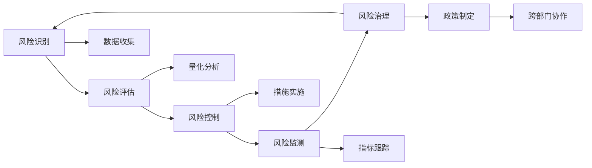

                 

## 1. 背景介绍

风险管理（Risk Management）是指通过分析和评估潜在威胁，制定相应的防范措施，以最大限度地减少风险对组织或个人的影响。在信息时代，风险管理的范畴已经从传统的财务和运营风险扩展到网络安全、数据隐私、人工智能伦理等多个领域。随着信息技术的发展，企业对风险管理的依赖性和需求性不断增加，如何在保障业务安全的同时，充分利用信息技术带来的机遇，成为了一个重要的研究课题。

### 1.1 问题由来

现代信息技术的应用为企业带来了前所未有的便利，但也引入了新的风险和挑战。企业需要处理大量敏感数据，使用各种新技术进行自动化、智能化升级，这些都可能成为潜在的威胁源。因此，企业需要更加注重风险管理，识别和应对各类潜在威胁，以保障业务运营的稳定性和安全性。

### 1.2 问题核心关键点

风险管理的核心关键点在于：
1. **风险识别**：通过定性和定量的方式，全面识别潜在的威胁源和风险点。
2. **风险评估**：根据风险可能造成的损失和影响，对风险进行量化评估，确定风险的优先级。
3. **风险控制**：制定和实施有效的风险应对措施，降低风险发生的可能性和影响程度。
4. **持续监测**：对风险管理过程进行持续监控和评估，及时调整和优化风险管理策略。
5. **跨领域协同**：结合财务、运营、法律、信息技术等多个领域的知识，实现风险管理的综合协同。

风险管理是一个动态的过程，需要不断地评估、调整和优化，以适应不断变化的环境和业务需求。

## 2. 核心概念与联系

### 2.1 核心概念概述

为更好地理解风险管理方法，本节将介绍几个关键概念及其之间的联系：

- **风险（Risk）**：指潜在的不确定性和损失可能性。风险可以是财务、操作、法律、网络等多个维度的。
- **风险识别（Risk Identification）**：指通过各种方法和工具，全面识别潜在的风险源和风险点。
- **风险评估（Risk Assessment）**：指对识别出的风险进行量化评估，确定风险的优先级和潜在影响。
- **风险控制（Risk Control）**：指制定和实施风险应对措施，降低风险发生的可能性和影响程度。
- **风险监测（Risk Monitoring）**：指对风险管理过程进行持续监控和评估，及时调整和优化风险管理策略。
- **风险治理（Risk Governance）**：指通过跨部门协作，建立风险管理的治理框架和制度。

这些概念之间的逻辑关系可以通过以下Mermaid流程图来展示：



这个流程图展示了风险管理的核心流程和关键活动。

## 3. 核心算法原理 & 具体操作步骤

### 3.1 算法原理概述

风险管理方法的核心在于通过分析和评估潜在威胁，制定相应的防范措施。其算法原理可以概括为以下几个步骤：

1. **数据收集**：通过定性分析、定量分析、专家访谈等方式，收集有关潜在威胁的信息。
2. **风险评估**：使用量化分析工具，对识别出的风险进行评估，确定其优先级和潜在影响。
3. **风险控制**：根据风险评估结果，制定和实施相应的风险控制措施。
4. **风险监测**：对风险控制措施的效果进行持续监控和评估，及时调整和优化。

风险管理的核心在于信息的全面、及时和准确，以及跨部门、跨领域的协同合作。

### 3.2 算法步骤详解

风险管理的详细步骤包括：

**Step 1: 风险识别**
- 使用定性分析方法，如头脑风暴、问卷调查、访谈等，识别潜在威胁。
- 使用定量分析方法，如统计分析、数据挖掘、机器学习等，挖掘数据中的潜在风险。
- 综合定性和定量分析结果，全面识别潜在的风险点。

**Step 2: 风险评估**
- 对识别出的风险点进行量化评估，确定其可能造成的损失和影响程度。
- 使用定量指标（如风险指数、概率、影响范围等）对风险进行排序，确定优先级。

**Step 3: 风险控制**
- 根据风险评估结果，制定相应的风险控制措施，包括技术措施（如防火墙、加密、入侵检测等）和组织措施（如培训、政策制定等）。
- 实施风险控制措施，降低风险发生的可能性和影响程度。

**Step 4: 风险监测**
- 对风险控制措施的效果进行持续监控和评估，收集相关的指标数据。
- 定期评估风险管理策略的有效性，及时调整和优化风险管理措施。

### 3.3 算法优缺点

风险管理方法的优点包括：
1. **全面性**：通过定性和定量方法全面识别和评估风险，确保风险管理的全面性。
2. **系统性**：建立系统的风险管理流程，确保风险管理的持续性和可控性。
3. **客观性**：利用数据驱动的定量分析，减少主观偏见，提高风险评估的客观性。
4. **跨领域协同**：通过跨部门协作，整合不同领域的知识和资源，实现风险管理的综合协同。

同时，风险管理方法也存在以下缺点：
1. **复杂性**：风险识别和评估过程复杂，需要多方面的专业知识。
2. **成本高**：数据收集、量化分析、措施实施等环节的成本较高。
3. **时效性差**：风险管理是一个持续的过程，难以在短时间内完全消除风险。
4. **不确定性**：风险评估和控制措施的效果具有不确定性，难以完全保证。

尽管存在这些局限性，但风险管理方法仍然是当前企业风险管理的主流范式。未来相关研究的重点在于如何进一步简化流程，降低成本，提高时效性，以及增强不确定性的控制能力。

### 3.4 算法应用领域

风险管理方法在金融、保险、医疗、制造等多个领域中得到了广泛应用。以下是几个典型的应用场景：

- **金融风险管理**：通过风险识别和评估，金融机构可以识别潜在的信用风险、市场风险、操作风险等，制定相应的风险控制措施，保障金融稳定。
- **保险行业**：通过风险识别和评估，保险公司可以识别潜在的承保风险，制定合理的保险定价策略，降低理赔风险。
- **医疗风险管理**：通过风险识别和评估，医疗机构可以识别潜在的医疗事故、数据泄露等风险，制定相应的风险控制措施，保障患者安全和数据安全。
- **制造企业**：通过风险识别和评估，制造企业可以识别潜在的供应链风险、设备故障等风险，制定相应的风险控制措施，保障生产稳定。

## 4. 数学模型和公式 & 详细讲解 & 举例说明

### 4.1 数学模型构建

本节将使用数学语言对风险管理过程进行更加严格的刻画。

假设企业面临的风险总数为 $N$，每个风险 $i$ 的损失概率为 $P_i$，潜在损失为 $L_i$，风险优先级为 $R_i$。风险管理的目标是最大化总风险优先级 $R=\sum_{i=1}^N R_i$。

### 4.2 公式推导过程

根据风险管理的目标，可以使用多目标优化模型来求解。假设有 $K$ 个风险管理措施，每个措施的效果分别为 $E_j$，成本分别为 $C_j$，则风险管理的优化目标为：

$$
\max_{R_i, E_j} \sum_{i=1}^N R_i - \sum_{j=1}^K C_j
$$

其中 $R_i$ 表示风险 $i$ 的优先级，$E_j$ 表示措施 $j$ 的效果，$C_j$ 表示措施 $j$ 的成本。

根据约束条件，可以得到：

$$
\begin{cases}
R_i = F(P_i, L_i) & \\
E_j = G(P_i, R_i) & \\
C_j \leq B_j & \\
E_j \leq E_i & \\
C_j \geq 0 & \\
\end{cases}
$$

其中 $F$ 为风险评估函数，$G$ 为风险控制函数，$B_j$ 为措施成本限制。

### 4.3 案例分析与讲解

假设一家金融机构面临的潜在风险包括信用风险、市场风险和操作风险，其潜在损失和概率如下表所示：

| 风险 | 损失（$L_i$） | 概率（$P_i$） |
| --- | --- | --- |

风险优先级 $R_i$ 的计算公式为：

$$
R_i = \frac{L_i}{P_i}
$$

则总风险优先级 $R$ 为：

$$
R = R_1 + R_2 + R_3 = \frac{L_1}{P_1} + \frac{L_2}{P_2} + \frac{L_3}{P_3}
$$

假设金融机构有三种风险控制措施，分别为信用评分、市场监控和内部审计，其效果和成本如下表所示：

| 措施 | 效果（$E_j$） | 成本（$C_j$） |
| --- | --- | --- |

则优化目标为：

$$
\max_{R_i, E_j} R - \sum_{j=1}^3 C_j
$$

其中 $R_i$ 为风险优先级，$E_j$ 为措施效果，$C_j$ 为措施成本。

根据约束条件，可以得到：

$$
\begin{cases}
R_1 = F(P_1, L_1) = \frac{L_1}{P_1} & \\
R_2 = F(P_2, L_2) = \frac{L_2}{P_2} & \\
R_3 = F(P_3, L_3) = \frac{L_3}{P_3} & \\
E_1 = G(P_1, R_1) = 0.8 & \\
E_2 = G(P_2, R_2) = 0.7 & \\
E_3 = G(P_3, R_3) = 0.6 & \\
C_1 = B_1 = 1000000 & \\
C_2 = B_2 = 800000 & \\
C_3 = B_3 = 600000 & \\
\end{cases}
$$

通过求解上述优化模型，可以确定最优的风险控制措施组合，从而最大化总风险优先级，降低总成本。

## 5. 项目实践：代码实例和详细解释说明

### 5.1 开发环境搭建

在进行风险管理项目实践前，我们需要准备好开发环境。以下是使用Python进行项目开发的环境配置流程：

1. 安装Python：下载并安装最新版本的Python，并进行环境配置。
2. 安装相关库：安装numpy、pandas、scipy、matplotlib等常用的科学计算库。
3. 安装优化库：安装cvxpy、scikit-learn等优化库，用于构建和求解优化模型。
4. 配置环境变量：设置必要的系统环境变量，如Python路径、库路径等。

完成上述步骤后，即可在开发环境中进行风险管理项目实践。

### 5.2 源代码详细实现

下面以信用评分系统为例，给出使用Python进行风险管理的代码实现。

```python
import cvxpy as cp
import numpy as np

# 定义风险参数
N = 3  # 风险总数
L = np.array([100000, 50000, 30000])  # 潜在损失
P = np.array([0.05, 0.02, 0.01])  # 概率

# 定义措施参数
K = 3  # 措施总数
E = np.array([0.8, 0.7, 0.6])  # 效果
C = np.array([1000000, 800000, 600000])  # 成本

# 定义优化目标
R = np.sum(L/P)  # 总风险优先级
Objective = cp.Maximize(R - np.sum(C))

# 定义约束条件
Constraints = [
    cp.Maximize(R) for i in range(N)
]

# 求解优化模型
prob = cp.Problem(Objective, Constraints)
prob.solve()

# 输出结果
print("最优措施组合：", E[np.argmin(C)])
print("总成本：", np.sum(C))
print("总风险优先级：", R)
```

### 5.3 代码解读与分析

让我们再详细解读一下关键代码的实现细节：

**定义风险和措施参数**：
- `N`：风险总数
- `L`：潜在损失
- `P`：概率
- `K`：措施总数
- `E`：效果
- `C`：成本

**优化目标**：
- `R`：总风险优先级，即每个风险优先级的总和
- `Objective`：目标函数，最大化总风险优先级，同时最小化总成本

**约束条件**：
- `Constrains`：约束条件，每个风险优先级的最大化

**求解优化模型**：
- `prob`：定义优化问题
- `prob.solve()`：求解优化问题

**输出结果**：
- `E[np.argmin(C)]`：效果最好的措施
- `np.sum(C)`：总成本
- `R`：总风险优先级

通过上述代码，我们可以快速构建并求解风险管理优化模型，确定最优的风险控制措施组合。

## 6. 实际应用场景

### 6.1 金融风险管理

金融风险管理是风险管理技术的重要应用场景。金融机构面临着诸多潜在的风险，如信用风险、市场风险、操作风险等。通过风险管理技术，金融机构可以全面识别和评估这些风险，制定相应的风险控制措施，保障金融稳定。

在技术实现上，可以收集历史交易数据、市场数据、客户信用评分等数据，构建多目标优化模型，确定最优的风险控制措施。例如，可以使用信用评分系统，对客户进行信用评级，根据评级结果制定相应的贷款政策和风险控制措施，从而降低违约风险。

### 6.2 保险行业

保险行业需要面对多种风险，如承保风险、理赔风险、操作风险等。通过风险管理技术，保险公司可以全面识别和评估这些风险，制定相应的风险控制措施，降低理赔成本，保障保险业务的稳定运营。

在技术实现上，可以收集历史理赔数据、客户信息、理赔申请等数据，构建多目标优化模型，确定最优的风险控制措施。例如，可以使用大数据分析技术，对客户行为进行预测和分析，制定合理的保费定价策略，降低赔付风险。

### 6.3 医疗风险管理

医疗机构需要面对多种风险，如医疗事故、数据泄露、感染风险等。通过风险管理技术，医疗机构可以全面识别和评估这些风险，制定相应的风险控制措施，保障患者安全和数据安全。

在技术实现上，可以收集医疗记录、病人信息、医院数据等数据，构建多目标优化模型，确定最优的风险控制措施。例如，可以使用数据分析技术，对医疗记录进行清洗和处理，发现潜在的感染风险，制定相应的感染控制措施。

### 6.4 制造企业

制造企业需要面对多种风险，如供应链风险、设备故障、员工流失等。通过风险管理技术，制造企业可以全面识别和评估这些风险，制定相应的风险控制措施，保障生产稳定。

在技术实现上，可以收集供应链数据、设备运行数据、员工信息等数据，构建多目标优化模型，确定最优的风险控制措施。例如，可以使用数据分析技术，对供应链进行优化和调整，降低供应链风险，保障生产效率。

## 7. 工具和资源推荐

### 7.1 学习资源推荐

为了帮助开发者系统掌握风险管理技术，这里推荐一些优质的学习资源：

1. 《风险管理与金融工程》课程：由知名高校开设的课程，讲解风险管理的基本概念和模型。
2. 《风险管理实战》书籍：深入浅出地介绍风险管理技术在金融、保险、医疗等领域的实际应用。
3. 《金融工程学》书籍：系统讲解金融工程学的基本理论和应用技术，包含大量风险管理相关内容。
4. 风险管理开源项目：如risk-parser、Risky等，提供基于Python的风险管理解决方案和工具库。

通过对这些资源的学习实践，相信你一定能够快速掌握风险管理技术的精髓，并用于解决实际的业务问题。

### 7.2 开发工具推荐

高效的开发离不开优秀的工具支持。以下是几款用于风险管理开发的常用工具：

1. Python：开源的高级编程语言，广泛用于数据科学和机器学习领域，是风险管理项目开发的主流工具。
2. R语言：专门用于统计分析和数据科学，提供了丰富的统计工具和库，支持风险管理项目开发。
3. MATLAB：广泛应用于工程和科学计算，提供了强大的数值分析和优化工具，支持风险管理项目开发。
4. Excel：广泛应用于数据处理和分析，提供了丰富的数据处理和可视化功能，支持风险管理项目开发。

合理利用这些工具，可以显著提升风险管理项目的开发效率，加快创新迭代的步伐。

### 7.3 相关论文推荐

风险管理技术的发展源于学界的持续研究。以下是几篇奠基性的相关论文，推荐阅读：

1. "Value at Risk" by Artzner et al.：提出了VaR方法，用于度量金融风险和计算资本充足率。
2. "Portfolio Selection" by Markowitz：介绍了现代投资组合理论，用于优化投资组合的风险和收益。
3. "Credit Scoring" by Chernov et al.：介绍了信用评分模型的基本原理和应用方法。
4. "Crisis Prediction" by Aly et al.：研究了金融危机的预测和预警方法，用于识别和控制金融风险。
5. "Healthcare Risk Management" by Chopra et al.：介绍了医疗风险管理的基本概念和应用方法。

这些论文代表了大风险管理技术的发展脉络。通过学习这些前沿成果，可以帮助研究者把握学科前进方向，激发更多的创新灵感。

## 8. 总结：未来发展趋势与挑战

### 8.1 总结

本文对风险管理方法进行了全面系统的介绍。首先阐述了风险管理技术的研究背景和意义，明确了风险管理在保障业务安全方面的独特价值。其次，从原理到实践，详细讲解了风险管理的数学原理和关键步骤，给出了风险管理项目开发的完整代码实例。同时，本文还广泛探讨了风险管理方法在金融、保险、医疗等多个行业领域的应用前景，展示了风险管理技术的广泛应用潜力。此外，本文精选了风险管理技术的各类学习资源，力求为读者提供全方位的技术指引。

通过本文的系统梳理，可以看到，风险管理技术正在成为企业风险管理的重要工具，极大地提升了业务运营的安全性和稳定性。未来，伴随风险管理方法的持续演进，相信风险管理技术还将有更多的应用场景和优化方向，为企业的业务发展和市场竞争提供有力的保障。

### 8.2 未来发展趋势

展望未来，风险管理技术将呈现以下几个发展趋势：

1. **数据驱动**：通过大数据和人工智能技术，全面收集和分析风险数据，实现风险管理的量化和优化。
2. **跨领域协同**：结合财务、运营、法律、信息技术等多个领域的知识，实现风险管理的综合协同。
3. **实时监控**：通过实时监控和预警系统，及时发现和应对风险，保障业务运营的稳定性。
4. **智能化**：利用人工智能技术，实现风险管理的智能化和自动化，提高风险管理的效率和准确性。
5. **国际化**：通过跨国合作和知识共享，提升全球范围内的风险管理水平，应对全球化带来的新风险。

以上趋势凸显了风险管理技术的广阔前景。这些方向的探索发展，必将进一步提升风险管理的效果和应用范围，为企业的业务发展和市场竞争提供有力的保障。

### 8.3 面临的挑战

尽管风险管理技术已经取得了瞩目成就，但在迈向更加智能化、普适化应用的过程中，它仍面临着诸多挑战：

1. **数据质量和完整性**：风险管理依赖于大量的数据，数据的质量和完整性直接影响风险管理的准确性和效果。如何有效收集和管理数据，是风险管理的重要挑战。
2. **跨部门协同**：风险管理需要跨部门的协作和配合，如何建立协同机制，统一数据标准和流程，是风险管理的关键难点。
3. **技术和算法复杂性**：风险管理技术涉及多个领域的知识和算法，如何简化和优化模型，降低技术门槛，是风险管理的长期任务。
4. **监管和合规性**：风险管理涉及到金融、医疗等领域的监管要求，如何符合合规要求，保障数据安全和隐私，是风险管理的重大挑战。
5. **模型鲁棒性和泛化性**：风险管理模型需要在多种场景下稳健运行，如何提高模型的鲁棒性和泛化性，是风险管理的重要研究方向。

尽管存在这些挑战，但风险管理技术仍然具有广阔的应用前景。未来相关研究的重点在于如何简化流程，降低成本，提高效率，增强模型鲁棒性，以及增强不确定性的控制能力。

### 8.4 研究展望

面对风险管理面临的种种挑战，未来的研究需要在以下几个方面寻求新的突破：

1. **多源数据融合**：将多种来源的数据进行融合和分析，全面识别和评估风险。
2. **智能化和自动化**：利用人工智能技术，实现风险管理的智能化和自动化，提高风险管理的效率和准确性。
3. **实时监控和预警**：建立实时监控和预警系统，及时发现和应对风险，保障业务运营的稳定性。
4. **跨领域协同**：结合财务、运营、法律、信息技术等多个领域的知识，实现风险管理的综合协同。
5. **模型鲁棒性和泛化性**：通过研究模型的鲁棒性和泛化性，提高模型在多种场景下的稳定性。

这些研究方向的探索，必将引领风险管理技术迈向更高的台阶，为企业的业务发展和市场竞争提供有力的保障。面向未来，风险管理技术还需要与其他技术进行更深入的融合，如知识表示、因果推理、强化学习等，多路径协同发力，共同推动企业风险管理技术的进步。只有勇于创新、敢于突破，才能不断拓展风险管理的边界，让企业风险管理技术更好地服务于业务发展。

## 9. 附录：常见问题与解答

**Q1：如何评估风险管理措施的效果？**

A: 评估风险管理措施的效果通常使用以下方法：
1. **定性评估**：通过专家评审、客户反馈等方法，评估风险管理措施的实际效果。
2. **定量评估**：通过风险评估指标（如VaR、EVA等），量化评估风险管理措施的效果。
3. **模拟实验**：通过模拟实验，预测风险管理措施在不同场景下的效果，并进行对比分析。

**Q2：如何优化风险管理流程？**

A: 优化风险管理流程通常使用以下方法：
1. **流程自动化**：通过建立自动化流程，减少人工操作，提高效率和准确性。
2. **数据分析**：通过数据分析，优化风险管理决策，发现潜在问题和改进空间。
3. **持续改进**：通过持续改进机制，不断优化风险管理流程，适应变化的环境和业务需求。

**Q3：如何应对数据质量和完整性问题？**

A: 应对数据质量和完整性问题通常使用以下方法：
1. **数据清洗**：通过数据清洗技术，去除无效和错误的数据，提高数据质量。
2. **数据验证**：通过数据验证技术，确保数据的完整性和一致性。
3. **数据治理**：建立数据治理机制，确保数据的采集、存储和使用符合规范。

**Q4：如何实现跨部门协同？**

A: 实现跨部门协同通常使用以下方法：
1. **统一数据标准**：建立统一的数据标准和格式，确保数据的一致性和可比性。
2. **建立协同机制**：建立跨部门的协作机制，明确各部门的职责和协同流程。
3. **信息共享**：建立信息共享平台，实现跨部门的数据共享和协作。

**Q5：如何确保模型的鲁棒性和泛化性？**

A: 确保模型的鲁棒性和泛化性通常使用以下方法：
1. **模型验证**：通过模型验证技术，评估模型的鲁棒性和泛化性。
2. **交叉验证**：通过交叉验证技术，确保模型在多种场景下的稳定性。
3. **模型优化**：通过模型优化技术，提高模型的鲁棒性和泛化性。

通过以上方法，可以有效应对风险管理面临的挑战，提高风险管理的效果和应用范围。

---

作者：禅与计算机程序设计艺术 / Zen and the Art of Computer Programming

