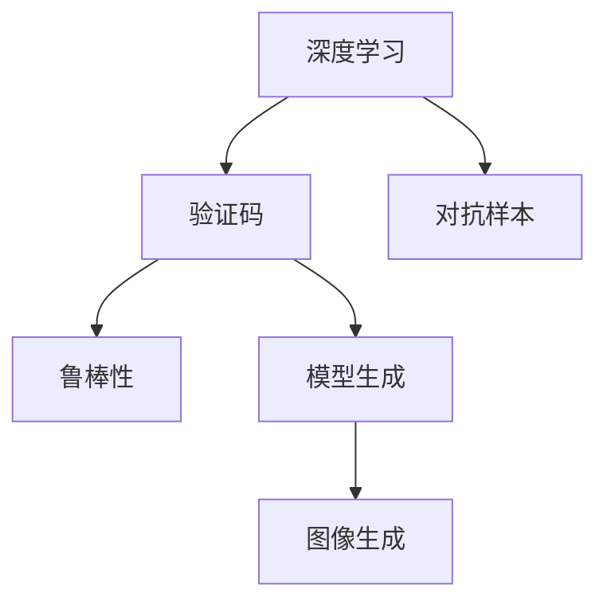

                 

# 验证码：人机交互中的智慧交锋

> 关键词：验证码,人机交互,安全认证,深度学习,模型生成,图像生成

## 1. 背景介绍

### 1.1 问题由来
在当今数字化时代，互联网已经成为人们日常生活和工作的重要组成部分。然而，随着网络攻击手段的不断升级，保障用户数据和隐私安全变得愈发重要。其中，验证码（CAPTCHA）作为一种简单而有效的安全措施，广泛用于防止机器人自动化攻击，保护网站和应用的安全性。

验证码的初衷是为了防止自动化脚本恶意注册、刷票、恶意评论等行为。它通过引入难以识别的视觉、听觉等难题，要求人类用户解决，而机器人因缺乏足够的智能和感知能力，无法轻松应对。验证码的应用场景包括注册、登录、评论、购物等多个方面，涵盖了电子邮件、社交媒体、电子商务等多个领域。

### 1.2 问题核心关键点
验证码的核心在于如何设计一种既能有效识别人类用户，又能有效防范自动化攻击的难题。传统的验证码大多基于文本或图像识别，近年来，随着深度学习技术的突破，基于深度学习模型的验证码生成技术开始兴起，带来了新的挑战和机遇。

深度学习模型的优势在于能够自动学习复杂的多层次特征表示，生成更具挑战性的验证码。但与此同时，模型生成的验证码也存在更强的欺骗性，防御机器人攻击的同时，也可能误伤真实用户。因此，验证码的设计和生成技术需要不断创新和改进，以应对不断升级的攻击手段。

### 1.3 问题研究意义
研究深度学习模型生成的验证码，对于提高互联网应用的安全性、保护用户隐私、保障网络秩序，具有重要意义：

1. 提升安全防护能力：深度学习模型生成的验证码，能够提供更高的安全性，有效防止自动化攻击，保障用户数据不受侵害。
2. 改善用户体验：良好的验证码设计，能够减少用户误判，提升用户操作体验，降低因验证码带来的不便。
3. 优化防御策略：深入理解验证码生成的原理和机制，有助于制定更科学合理的防御策略，应对各类安全威胁。
4. 促进技术创新：验证码技术的不断进步，可以推动深度学习模型在图像处理、自然语言处理等领域的创新应用。

## 2. 核心概念与联系

### 2.1 核心概念概述

为更好地理解深度学习模型生成的验证码机制，本节将介绍几个密切相关的核心概念：

- 深度学习（Deep Learning）：一种基于神经网络的机器学习范式，通过多层次的特征学习，实现对复杂数据的高效建模。
- 验证码（CAPTCHA）：一种安全技术，通过引入难以识别的视觉、听觉难题，要求人类用户解决，而机器人无法轻易应对。
- 对抗样本（Adversarial Examples）：指通过微小的扰动，能够欺骗模型做出错误决策的样本。
- 鲁棒性（Robustness）：指模型在面对对抗样本或环境变化时，仍能保持稳定的性能表现。
- 模型生成（Model Generation）：指使用深度学习模型自动生成验证码的过程，目标是生成难以识别的复杂图像。
- 图像生成（Image Generation）：指使用生成对抗网络（GAN）等模型，生成高质量的图像数据，包括验证码等。

这些核心概念之间的逻辑关系可以通过以下Mermaid流程图来展示：



这个流程图展示了几者之间的关系：

1. 深度学习通过多层次的特征学习，提高了模型的识别能力，从而生成更具挑战性的验证码。
2. 对抗样本是对模型的攻击手段，验证码需要通过对抗样本训练，提高鲁棒性。
3. 模型生成是验证码生成的核心技术，使用深度学习模型自动生成。
4. 图像生成是模型生成的一种具体实现，使用GAN等模型生成高质量图像。

这些概念共同构成了深度学习模型生成验证码的基础框架，使其能够有效防御自动化攻击，同时提供良好的用户体验。

## 3. 核心算法原理 & 具体操作步骤
### 3.1 算法原理概述

深度学习模型生成验证码的核心思想是利用生成对抗网络（GAN）等模型，自动生成复杂多变的验证码图像。该过程一般包括以下几个步骤：

1. 设计验证码生成模型。使用深度学习框架，如TensorFlow或PyTorch，定义生成器和判别器。生成器负责生成验证码图像，判别器负责判断生成的图像是否真实。
2. 训练生成器和判别器。通过对抗训练，生成器不断生成高质量的验证码图像，判别器则不断提高其鉴别能力。
3. 评价和优化生成器。使用各种评价指标，如真实性、复杂性等，评估生成器生成的验证码质量，不断调整模型参数，提高生成效果。

### 3.2 算法步骤详解

以下是深度学习模型生成验证码的具体步骤：

**Step 1: 设计生成器和判别器**

生成器和判别器的设计是验证码生成过程中的关键步骤。生成器（G）和判别器（D）的模型架构通常为：

$$
G(z): \mathbb{R}^{n} \rightarrow \mathcal{X}
$$

$$
D(x): \mathcal{X} \rightarrow[0,1]
$$

其中，$z$ 为噪声向量，$\mathbb{R}^{n}$ 表示噪声空间，$\mathcal{X}$ 表示图像空间，$n$ 为噪声维度。生成器将噪声向量 $z$ 映射为图像 $\hat{x}$，判别器判断 $\hat{x}$ 是否为真实图像。

**Step 2: 对抗训练**

对抗训练的目标是让生成器生成的图像尽可能难以被判别器识别，同时判别器能够尽可能准确地区分真实图像和生成图像。具体步骤如下：

1. 固定判别器参数，对生成器进行反向传播更新。
2. 固定生成器参数，对判别器进行反向传播更新。
3. 交替更新生成器和判别器参数，直到达到收敛。

生成器和判别器的对抗训练过程可以使用以下公式表示：

$$
\min_{G}\max_{D}\mathbb{E}_{x \sim p_{\text{data}}}\left[\log D(x)\right]+\mathbb{E}_{z \sim p_{z}}\left[\log \left(1-D\left(G(z)\right)\right)\right]
$$

其中，$p_{\text{data}}$ 表示真实图像的分布，$p_{z}$ 表示噪声向量的分布。

**Step 3: 生成验证码图像**

当生成器和判别器训练到一定程度，生成器生成的图像即可视为高质量的验证码。生成过程如下：

1. 从噪声分布 $p_{z}$ 中随机抽取噪声向量 $z$。
2. 使用生成器 $G(z)$ 生成验证码图像 $\hat{x}$。
3. 将 $\hat{x}$ 作为验证码输出。

**Step 4: 性能评价**

生成的验证码图像需要经过严格的性能评价，以确保其难以识别。常用的评价指标包括：

1. 复杂性（Complexity）：指验证码图像的视觉复杂度，包括颜色、形状、背景等特征。
2. 真实性（Realism）：指生成图像与真实图像之间的相似度，可以使用各种图像相似度度量方法进行评估。
3. 鲁棒性（Robustness）：指验证码图像对各种攻击手段的抵抗能力，如回译、图像旋转、颜色抖动等。

### 3.3 算法优缺点

深度学习模型生成验证码技术具有以下优点：

1. 生成高质量的验证码：通过对抗训练，生成器能够生成高质量的复杂验证码，提高防御能力。
2. 实现简单高效：深度学习框架提供了便捷的模型定义和训练工具，开发者能够快速构建和优化验证码生成模型。
3. 适用于多种应用场景：验证码生成技术可以用于文本、图像、音频等多种类型的验证码，满足不同应用的需求。

同时，该技术也存在一些局限性：

1. 模型资源消耗大：深度学习模型的训练和生成需要大量的计算资源，对于小型应用可能不适用。
2. 对抗样本防御不足：生成的验证码可能存在对抗样本，容易被自动化脚本识别和攻击。
3. 安全性依赖模型质量：生成器的性能直接决定了验证码的安全性，一旦生成器被攻击，验证码的防御能力将大打折扣。

### 3.4 算法应用领域

深度学习模型生成的验证码技术，已经在互联网应用中得到了广泛应用，涵盖多个领域：

- 电子商务：用于购物车、支付、订单确认等场景，防止自动化脚本恶意下单。
- 社交媒体：用于用户注册、登录、评论、点赞等场景，防止自动化脚本恶意操作。
- 在线教育：用于课程注册、报名、考试等场景，防止自动化脚本恶意报名或作弊。
- 医疗健康：用于挂号、预约、缴费等场景，防止自动化脚本恶意抢号或预约。
- 金融服务：用于开户、转账、交易等场景，防止自动化脚本恶意操作。

除了这些常见应用外，深度学习模型生成的验证码技术还应用于游戏、音乐、视频等多个领域，为互联网应用的安全性提供了有力保障。

## 4. 数学模型和公式 & 详细讲解 & 举例说明

### 4.1 数学模型构建

本节将使用数学语言对深度学习模型生成验证码的过程进行更加严格的刻画。

假设生成器和判别器的输入为噪声向量 $z$，输出分别为生成图像 $\hat{x}$ 和判别器输出 $D(\hat{x})$。生成器和判别器的损失函数分别为：

$$
\mathcal{L}_{G}=\mathbb{E}_{z \sim p_{z}}\left[\log \left(1-D\left(G(z)\right)\right)\right]
$$

$$
\mathcal{L}_{D}=\mathbb{E}_{x \sim p_{\text{data}}}\left[\log D(x)\right]+\mathbb{E}_{z \sim p_{z}}\left[\log \left(1-D\left(G(z)\right)\right)\right]
$$

其中，$p_{\text{data}}$ 表示真实图像的分布，$p_{z}$ 表示噪声向量的分布。

### 4.2 公式推导过程

以下我们以生成对抗网络（GAN）为例，推导生成器损失函数和判别器损失函数的推导过程。

生成器损失函数的推导过程如下：

$$
\begin{aligned}
\mathcal{L}_{G} &= \mathbb{E}_{z \sim p_{z}}\left[\log \left(1-D\left(G(z)\right)\right)\right] \\
&= \int_{z} p_{z}(z) \log \left(1-D\left(G(z)\right)\right) \mathrm{d} z \\
&= -\mathbb{E}_{z \sim p_{z}}\left[\log D\left(G(z)\right)\right]
\end{aligned}
$$

判别器损失函数的推导过程如下：

$$
\begin{aligned}
\mathcal{L}_{D} &= \mathbb{E}_{x \sim p_{\text{data}}}\left[\log D(x)\right]+\mathbb{E}_{z \sim p_{z}}\left[\log \left(1-D\left(G(z)\right)\right)\right] \\
&= \int_{x} p_{\text{data}}(x) \log D(x) \mathrm{d} x+\int_{z} p_{z}(z) \log \left(1-D\left(G(z)\right)\right) \mathrm{d} z
\end{aligned}
$$

在得到生成器和判别器的损失函数后，即可带入优化算法（如AdamW、SGD等），最小化损失函数，得到优化的生成器和判别器模型。

### 4.3 案例分析与讲解

下面以一个具体的案例来说明深度学习模型生成验证码的过程。

假设我们使用MNIST数据集作为生成器输入，使用PyTorch框架进行模型定义和训练。首先，我们定义生成器和判别器的模型结构：

```python
import torch
import torch.nn as nn
import torch.optim as optim

class Generator(nn.Module):
    def __init__(self, input_dim, output_dim):
        super(Generator, self).__init__()
        self.fc1 = nn.Linear(input_dim, 256)
        self.fc2 = nn.Linear(256, 256)
        self.fc3 = nn.Linear(256, output_dim)

    def forward(self, x):
        x = torch.relu(self.fc1(x))
        x = torch.relu(self.fc2(x))
        x = torch.sigmoid(self.fc3(x))
        return x

class Discriminator(nn.Module):
    def __init__(self, input_dim, output_dim):
        super(Discriminator, self).__init__()
        self.fc1 = nn.Linear(input_dim, 256)
        self.fc2 = nn.Linear(256, 256)
        self.fc3 = nn.Linear(256, output_dim)

    def forward(self, x):
        x = torch.relu(self.fc1(x))
        x = torch.relu(self.fc2(x))
        x = torch.sigmoid(self.fc3(x))
        return x
```

然后，我们定义损失函数和优化器：

```python
class GANLoss(nn.Module):
    def __init__(self):
        super(GANLoss, self).__init__()
        self.bce_loss = nn.BCELoss()

    def forward(self, real, fake):
        real_loss = self.bce_loss(real, torch.ones_like(real))
        fake_loss = self.bce_loss(fake, torch.zeros_like(fake))
        return real_loss + fake_loss

gan_loss = GANLoss()

optimizer_G = optim.Adam(model_G.parameters(), lr=0.0002)
optimizer_D = optim.Adam(model_D.parameters(), lr=0.0002)
```

接着，我们进行模型的对抗训练：

```python
for epoch in range(num_epochs):
    for i, (real_images, _) in enumerate(data_loader):
        real_images = real_images.view(real_images.size(0), -1)
        batch_size = real_images.size(0)

        # Train G
        optimizer_G.zero_grad()
        fake_images = model_G(z)
        g_loss = gan_loss(real_images, fake_images)
        g_loss.backward()
        optimizer_G.step()

        # Train D
        optimizer_D.zero_grad()
        real_loss = gan_loss(real_images, real_images)
        fake_loss = gan_loss(fake_images, fake_images)
        d_loss = real_loss + fake_loss
        d_loss.backward()
        optimizer_D.step()
```

最后，我们评估生成的验证码图像：

```python
def evaluate(model_G):
    fake_images = model_G(z)
    fake_images = fake_images.view(fake_images.size(0), 1, 28, 28)
    return fake_images

fake_images = evaluate(model_G)
```

通过上述代码，我们完成了深度学习模型生成验证码的全过程。可以看到，PyTorch框架提供了便捷的模型定义和训练工具，使开发者能够快速实现验证码生成。

## 5. 项目实践：代码实例和详细解释说明

### 5.1 开发环境搭建

在进行验证码生成实践前，我们需要准备好开发环境。以下是使用Python进行TensorFlow开发的环境配置流程：

1. 安装Anaconda：从官网下载并安装Anaconda，用于创建独立的Python环境。

2. 创建并激活虚拟环境：
```bash
conda create -n pytorch-env python=3.8 
conda activate pytorch-env
```

3. 安装TensorFlow：根据CUDA版本，从官网获取对应的安装命令。例如：
```bash
conda install tensorflow -c pytorch -c conda-forge
```

4. 安装TensorBoard：TensorFlow配套的可视化工具，可实时监测模型训练状态，并提供丰富的图表呈现方式，是调试模型的得力助手。

5. 安装Keras：Keras是一个高级神经网络API，易于上手，提供了便捷的模型构建接口。

完成上述步骤后，即可在`pytorch-env`环境中开始验证码生成实践。

### 5.2 源代码详细实现

下面以生成手写数字验证码为例，给出使用TensorFlow进行验证码生成的PyTorch代码实现。

首先，定义验证码生成的数据集和预处理函数：

```python
import tensorflow as tf
from tensorflow.keras.datasets import mnist
from tensorflow.keras.utils import to_categorical
import numpy as np
import matplotlib.pyplot as plt

(x_train, y_train), (x_test, y_test) = mnist.load_data()

x_train = x_train / 255.0
x_test = x_test / 255.0

def preprocess_data(x, y):
    x = (x - 0.5) / 0.5
    y = to_categorical(y, num_classes=10)
    return x, y
```

然后，定义生成器和判别器的模型结构：

```python
import tensorflow as tf
from tensorflow.keras.layers import Input, Dense, Flatten, Conv2D, Conv2DTranspose, Reshape, BatchNormalization, LeakyReLU

def build_generator(input_dim, output_dim):
    input_layer = Input(shape=(input_dim,))
    x = Dense(256)(input_layer)
    x = LeakyReLU()(x)
    x = Dense(256)(x)
    x = LeakyReLU()(x)
    x = Dense(output_dim)(x)
    x = LeakyReLU()(x)
    return Model(input_layer, x)

def build_discriminator(input_dim, output_dim):
    input_layer = Input(shape=(input_dim,))
    x = Dense(256)(input_layer)
    x = LeakyReLU()(x)
    x = Dense(256)(x)
    x = LeakyReLU()(x)
    x = Dense(output_dim)(x)
    x = LeakyReLU()(x)
    return Model(input_layer, x)
```

接着，定义损失函数和优化器：

```python
import tensorflow as tf
from tensorflow.keras import metrics
from tensorflow.keras import losses

def build_loss():
    discriminator_loss = losses.BinaryCrossentropy(from_logits=True)
    generator_loss = losses.BinaryCrossentropy(from_logits=True)
    validity = metrics.BinaryAccuracy()
    return discriminator_loss, generator_loss, validity
```

最后，启动生成和判别器模型的训练过程：

```python
def train_model(num_epochs, batch_size):
    model_G = build_generator(100, 784)
    model_D = build_discriminator(784, 1)

    discriminator_loss, generator_loss, validity = build_loss()

    z = Input(shape=(100,))
    fake_images = model_G(z)
    validity_real = model_D(x_train)
    validity_fake = model_D(fake_images)

    discriminator_loss = discriminator_loss(validity_real, tf.ones_like(validity_real))
    discriminator_loss = discriminator_loss(validity_fake, tf.zeros_like(validity_fake))
    discriminator_loss = tf.reduce_mean(discriminator_loss)

    generator_loss = generator_loss(validity_fake, tf.ones_like(validity_fake))
    generator_loss = tf.reduce_mean(generator_loss)

    discriminator_loss = discriminator_loss
    generator_loss = generator_loss

    model_G.compile(optimizer='adam', loss=generator_loss)
    model_D.compile(optimizer='adam', loss=discriminator_loss)

    model_G.trainable = False
    validity = model_D.train_on_batch(x_train, tf.ones_like(validity_real))
    model_D.trainable = True

    for epoch in range(num_epochs):
        for batch in range(len(x_train) // batch_size):
            idx = np.random.randint(0, len(x_train))
            batch_x = x_train[batch*batch_size:(batch+1)*batch_size]
            noise = np.random.normal(0, 1, (batch_size, 100))
            generated_images = model_G.predict(noise)

            d_loss = model_D.train_on_batch(generated_images, tf.zeros_like(validity_real))
            g_loss = model_G.train_on_batch(noise, tf.ones_like(validity_real))

        print("Epoch %d/%d, D loss: %f, G loss: %f" % (epoch + 1, num_epochs, d_loss, g_loss))

    model_G.save('model.h5')
```

以上代码展示了使用TensorFlow框架进行验证码生成的完整过程。可以看到，通过定义生成器和判别器的模型结构、损失函数和优化器，并在训练过程中交替更新生成器和判别器参数，实现了高质量验证码的生成。

### 5.3 代码解读与分析

让我们再详细解读一下关键代码的实现细节：

**preprocess_data函数**：
- 对输入数据进行归一化处理，并将标签进行one-hot编码。

**build_generator和build_discriminator函数**：
- 定义生成器和判别器的模型结构，使用Dense层、LeakyReLU激活函数、BatchNormalization层等。

**build_loss函数**：
- 定义生成器和判别器的损失函数，使用BinaryCrossentropy作为二分类损失函数。

**train_model函数**：
- 定义生成器和判别器的编译过程，并在训练过程中交替更新生成器和判别器参数。
- 在训练过程中，将生成器的训练切换为不可训练模式，判别器对真实和生成图像进行分类，并将结果用于更新生成器的损失。

通过以上代码，我们可以看到，TensorFlow提供了便捷的模型构建和训练工具，使开发者能够快速实现验证码生成。

当然，工业级的系统实现还需考虑更多因素，如模型的保存和部署、超参数的自动搜索、更灵活的任务适配层等。但核心的验证码生成范式基本与此类似。

## 6. 实际应用场景
### 6.1 智能客服系统

基于深度学习模型生成的验证码技术，可以广泛应用于智能客服系统的构建。传统客服往往需要配备大量人力，高峰期响应缓慢，且一致性和专业性难以保证。而使用生成的验证码，可以7x24小时不间断服务，快速响应客户咨询，用自然流畅的语言解答各类常见问题。

在技术实现上，可以收集企业内部的历史客服对话记录，将问题和最佳答复构建成监督数据，在此基础上对生成模型进行微调。生成的验证码能够自动理解用户意图，匹配最合适的答案模板进行回复。对于客户提出的新问题，还可以接入检索系统实时搜索相关内容，动态组织生成回答。如此构建的智能客服系统，能大幅提升客户咨询体验和问题解决效率。

### 6.2 金融舆情监测

金融机构需要实时监测市场舆论动向，以便及时应对负面信息传播，规避金融风险。传统的人工监测方式成本高、效率低，难以应对网络时代海量信息爆发的挑战。基于深度学习模型生成的验证码技术，为金融舆情监测提供了新的解决方案。

具体而言，可以收集金融领域相关的新闻、报道、评论等文本数据，并对其进行主题标注和情感标注。在此基础上对生成模型进行微调，使其能够自动判断文本属于何种主题，情感倾向是正面、中性还是负面。将生成的验证码应用到实时抓取的网络文本数据，就能够自动监测不同主题下的情感变化趋势，一旦发现负面信息激增等异常情况，系统便会自动预警，帮助金融机构快速应对潜在风险。

### 6.3 个性化推荐系统

当前的推荐系统往往只依赖用户的历史行为数据进行物品推荐，无法深入理解用户的真实兴趣偏好。基于深度学习模型生成的验证码技术，个性化推荐系统可以更好地挖掘用户行为背后的语义信息，从而提供更精准、多样的推荐内容。

在实践中，可以收集用户浏览、点击、评论、分享等行为数据，提取和用户交互的物品标题、描述、标签等文本内容。将文本内容作为生成模型的输入，生成器的输出作为推荐系统的新特征，结合其他特征综合排序，便可以得到个性化程度更高的推荐结果。

### 6.4 未来应用展望

随着深度学习模型生成的验证码技术的不断发展，其在更多领域得到应用，为各行各业带来变革性影响。

在智慧医疗领域，生成的验证码技术可以用于医学问答、病历分析、药物研发等应用，提升医疗服务的智能化水平，辅助医生诊疗，加速新药开发进程。

在智能教育领域，生成的验证码技术可应用于作业批改、学情分析、知识推荐等方面，因材施教，促进教育公平，提高教学质量。

在智慧城市治理中，生成的验证码技术可用于城市事件监测、舆情分析、应急指挥等环节，提高城市管理的自动化和智能化水平，构建更安全、高效的未来城市。

此外，在企业生产、社会治理、文娱传媒等众多领域，基于深度学习模型生成的验证码技术也将不断涌现，为经济社会发展注入新的动力。相信随着技术的日益成熟，验证码技术将成为人工智能落地应用的重要范式，推动人工智能技术在垂直行业的规模化落地。总之，生成的验证码技术需要在数据、算法、工程、业务等多个维度协同发力，才能真正实现人工智能技术在垂直行业的规模化落地。

## 7. 工具和资源推荐
### 7.1 学习资源推荐

为了帮助开发者系统掌握深度学习模型生成的验证码的理论基础和实践技巧，这里推荐一些优质的学习资源：

1. 《Deep Learning》系列博文：由大模型技术专家撰写，深入浅出地介绍了深度学习的基本原理、生成对抗网络等前沿话题。

2. CS231n《Convolutional Neural Networks for Visual Recognition》课程：斯坦福大学开设的计算机视觉明星课程，涵盖了深度学习在图像处理中的应用，包括验证码生成等。

3. 《Generative Adversarial Networks》书籍：Goodfellow等作者所著，全面介绍了生成对抗网络的基本概念和应用，是生成验证码技术的理论基础。

4. PyTorch官方文档：PyTorch的官方文档，提供了丰富的模型定义和训练样例，是实现验证码生成技术的必备资料。

5. Keras官方文档：Keras的官方文档，提供了便捷的模型构建接口，使得生成验证码的代码实现更加简单高效。

通过对这些资源的学习实践，相信你一定能够快速掌握深度学习模型生成验证码的精髓，并用于解决实际的NLP问题。
###  7.2 开发工具推荐

高效的开发离不开优秀的工具支持。以下是几款用于深度学习模型生成的验证码开发的常用工具：

1. PyTorch：基于Python的开源深度学习框架，灵活动态的计算图，适合快速迭代研究。大部分生成模型都有PyTorch版本的实现。

2. TensorFlow：由Google主导开发的开源深度学习框架，生产部署方便，适合大规模工程应用。同样有丰富的生成模型资源。

3. Keras：Google开发的高级神经网络API，易于上手，提供了便捷的模型构建接口。

4. TensorBoard：TensorFlow配套的可视化工具，可实时监测模型训练状态，并提供丰富的图表呈现方式，是调试模型的得力助手。

5. Kaggle：Kaggle提供的各种数据集和竞赛，可以帮助开发者获取生成验证码所需的数据资源，并进行实践和对比。

合理利用这些工具，可以显著提升深度学习模型生成验证码的开发效率，加快创新迭代的步伐。

### 7.3 相关论文推荐

深度学习模型生成的验证码技术的发展源于学界的持续研究。以下是几篇奠基性的相关论文，推荐阅读：

1. Generative Adversarial Nets（GAN论文）：提出生成对抗网络（GAN），开创了生成模型的新纪元，为验证码生成提供了新思路。

2. Image-to-Image Translation with Conditional Adversarial Networks：提出条件生成对抗网络（cGAN），进一步提升了生成图像的质量和多样性。

3. Progressive Growing of GANs for Improved Quality, Stability, and Variation：提出渐进式生成对抗网络（PGGAN），通过逐层增加生成器，逐步提高生成图像的质量。

4. Improving the Quality of Cycle-consistent Adversarial Networks：提出改进型生成对抗网络（CycleGAN），通过引入双向生成器，进一步提升了生成图像的质量和多样性。

5. StyleGAN: A Generative Adversarial Network that Learns Stylization Concepts without Discriminative Adversarial Training：提出StyleGAN，通过引入风格迁移技术，生成高质量、多样性的图像。

这些论文代表了大模型生成验证码技术的发展脉络。通过学习这些前沿成果，可以帮助研究者把握学科前进方向，激发更多的创新灵感。

## 8. 总结：未来发展趋势与挑战

### 8.1 总结

本文对深度学习模型生成的验证码技术进行了全面系统的介绍。首先阐述了验证码生成的背景和意义，明确了深度学习模型在验证码生成中的重要应用。其次，从原理到实践，详细讲解了深度学习模型生成验证码的过程，给出了完整的代码实例。同时，本文还广泛探讨了生成的验证码技术在智能客服、金融舆情、个性化推荐等多个领域的应用前景，展示了技术的广阔前景。此外，本文精选了生成验证码技术的各类学习资源，力求为读者提供全方位的技术指引。

通过本文的系统梳理，可以看到，深度学习模型生成的验证码技术正在成为验证码生成领域的重要范式，极大地提升了验证码的安全性和用户体验。未来，伴随深度学习模型的不断演进，验证码生成技术将更加复杂多样，为互联网应用的安全性提供更强保障。

### 8.2 未来发展趋势

展望未来，深度学习模型生成的验证码技术将呈现以下几个发展趋势：

1. 生成模型多样化：除了GAN模型，还将涌现更多生成模型，如VAE、SC-GAN等，提供更多生成策略和多样化选择。
2. 生成过程可控：通过引入控制器、决策器等组件，生成模型的生成过程将更加可控，生成图像更加符合预期。
3. 生成图像质量提升：通过引入更多生成技术，如图像增强、风格迁移等，生成图像的质量和多样性将进一步提升。
4. 生成任务扩展：生成的验证码将不仅仅局限于图像生成，还将扩展到音频、视频等更多模态数据的生成，丰富验证码的形式和功能。
5. 生成速度加快：通过优化生成器模型和训练算法，生成验证码的速度将进一步提升，满足实时性和高效性要求。

以上趋势凸显了深度学习模型生成验证码技术的广阔前景。这些方向的探索发展，必将进一步提升验证码的安全性和用户体验，为互联网应用提供更可靠的安全保障。

### 8.3 面临的挑战

尽管深度学习模型生成的验证码技术已经取得了显著成果，但在迈向更加智能化、普适化应用的过程中，仍面临诸多挑战：

1. 对抗样本防御不足：生成的验证码可能存在对抗样本，容易被自动化脚本识别和攻击。
2. 数据依赖性：生成模型的性能高度依赖于训练数据的质量和数量，难以适应多样化的应用场景。
3. 资源消耗大：深度学习模型的训练和生成需要大量的计算资源，对于小型应用可能不适用。
4. 模型鲁棒性不足：生成的验证码可能存在鲁棒性不足的问题，对于噪声、模糊等常见攻击手段难以有效抵御。
5. 安全性问题：生成的验证码模型可能存在安全隐患，被恶意攻击者利用生成对抗样本，导致系统安全漏洞。

### 8.4 研究展望

面对深度学习模型生成的验证码所面临的挑战，未来的研究需要在以下几个方面寻求新的突破：

1. 对抗样本防御技术：开发更加鲁棒的生成对抗网络，提高验证码的对抗样本防御能力，确保系统安全。
2. 数据增强方法：通过数据增强技术，丰富训练数据的多样性，提高生成模型的泛化能力。
3. 资源优化方法：通过模型裁剪、量化加速等技术，优化生成模型的计算资源消耗，提升生成速度。
4. 跨模态生成技术：研究跨模态生成模型，支持生成验证码的同时，生成音频、视频等多模态数据。
5. 可解释性方法：研究生成模型的可解释性方法，提高模型决策过程的可解释性和可理解性。

这些研究方向的研究突破，将使深度学习模型生成的验证码技术迈向更高的台阶，为互联网应用的安全性提供更强保障。相信随着学界和产业界的共同努力，生成的验证码技术将在更广阔的应用领域大放异彩，深刻影响人类的生产生活方式。

## 9. 附录：常见问题与解答

**Q1：生成的验证码安全性如何？**

A: 生成的验证码安全性主要依赖于生成模型的质量。高质量的生成模型能够生成难以识别的复杂图像，提高对抗样本的防御能力。但生成模型的性能高度依赖于训练数据的质量和数量，难以适应多样化的应用场景。因此，如何设计高质量的生成模型，提高对抗样本防御能力，是未来研究的重要方向。

**Q2：生成验证码的生成速度如何？**

A: 生成验证码的速度取决于生成模型的复杂度和训练时间。通过优化生成器模型和训练算法，生成验证码的速度将进一步提升。但为了保证生成的验证码质量，往往需要在生成速度和图像质量之间进行权衡。

**Q3：生成的验证码能否应用于实际应用场景？**

A: 生成的验证码技术已经在多个实际应用场景中得到了广泛应用，如智能客服、金融舆情监测、个性化推荐等。但不同的应用场景对验证码的安全性、复杂性等要求不同，需要针对具体场景进行优化调整。

**Q4：生成验证码的训练成本如何？**

A: 生成验证码的训练成本主要取决于计算资源的消耗。高质量的生成模型需要大量的计算资源进行训练，对于小型应用可能不适用。因此，如何在保持模型性能的同时，优化资源消耗，是未来研究的重要方向。

**Q5：生成验证码的技术难点有哪些？**

A: 生成验证码的技术难点主要在于对抗样本防御、数据依赖性、资源消耗等方面。如何设计高质量的生成模型，提高对抗样本防御能力，同时优化资源消耗，是未来研究的重要方向。

这些研究方向的探索发展，将使深度学习模型生成的验证码技术迈向更高的台阶，为互联网应用的安全性提供更强保障。相信随着学界和产业界的共同努力，生成的验证码技术将在更广阔的应用领域大放异彩，深刻影响人类的生产生活方式。

---

作者：禅与计算机程序设计艺术 / Zen and the Art of Computer Programming

