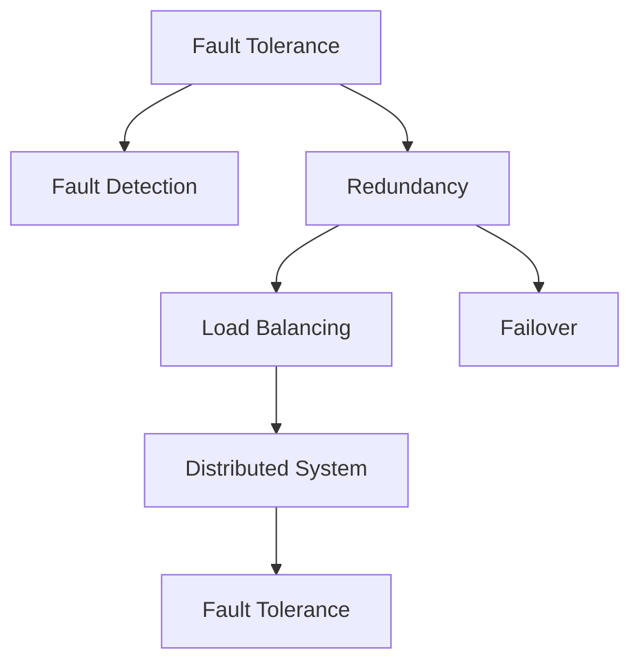

                 

# 高可用系统设计：故障转移和负载均衡

> 关键词：高可用系统，故障转移，负载均衡，系统可靠性，云计算，分布式架构，容错机制，高性能计算，故障恢复

## 1. 背景介绍

在当今数字化转型的大潮中，系统的高可用性成为企业和机构提升服务质量和用户体验的关键。高可用系统指的是在任意时间内保证服务可用性达到99.999%的系统。高可用性不仅关系到企业的品牌信誉和客户满意度，还直接影响企业的业务连续性和市场竞争力。因此，设计高可用系统成为了众多IT从业者关注的核心问题。

本文将从故障转移和负载均衡两个核心角度，系统地介绍如何设计和实现高可用系统。通过探讨故障转移的原理和实现方法，以及负载均衡的算法和应用场景，希望帮助读者深入理解高可用系统的核心技术，掌握其在实际项目中的有效应用。

## 2. 核心概念与联系

### 2.1 核心概念概述

为更好地理解故障转移和负载均衡的设计，本节将介绍几个密切相关的核心概念：

- **故障转移(Failover)**：指在系统出现故障时，能够快速将请求转移到备用系统，保障服务不中断的过程。故障转移是确保高可用系统的基础。
- **负载均衡(Load Balancing)**：指将客户端请求均匀分布在多个服务器上，提升系统处理能力和服务响应速度。负载均衡是高可用系统的重要组成部分。
- **冗余(Redundancy)**：指通过冗余设计，在系统中配置多个相同功能的组件或副本，以应对故障和性能压力。冗余是实现故障转移和负载均衡的基础。
- **容错(Fault Tolerance)**：指系统在部分组件失效的情况下仍能正常运行的能力。容错机制通过多副本协同工作，保障系统的稳定性和可靠性。
- **分布式系统(Distributed System)**：由多个独立节点构成的系统，各节点通过网络通信协作，实现分布式计算和数据存储。分布式系统是实现高可用性的主要架构。
- **故障检测(Fault Detection)**：指在系统运行时实时监测系统状态，及时发现和报告故障。故障检测是故障转移的前提。

这些核心概念之间的逻辑关系可以通过以下Mermaid流程图来展示：



这个流程图展示了几大核心概念之间的联系：

1. 容错机制通过冗余设计提供基础保障。
2. 负载均衡和故障转移依赖于分布式系统的架构。
3. 故障检测是故障转移的前提，是容错机制的核心。

这些概念共同构成了高可用系统的技术基础，为其稳定运行和高效性能提供了保障。

## 3. 核心算法原理 & 具体操作步骤

### 3.1 算法原理概述

故障转移和负载均衡是高可用系统的两个核心技术，它们分别负责处理系统故障和资源分配。两者的设计原理和实现方法不尽相同，但都基于冗余和分布式架构的思想。

**故障转移的原理**是：在系统出现故障时，通过备用系统的接管，确保服务不中断。故障转移的实现通常需要两个主要步骤：故障检测和故障转移。

**负载均衡的原理**是：通过将客户端请求均匀分配到多个服务器上，提升系统整体处理能力和响应速度。负载均衡的实现通常需要两个主要步骤：请求分发和负载调整。

故障转移和负载均衡的算法和具体实现方法，将在后续章节中详细探讨。

### 3.2 算法步骤详解

#### 3.2.1 故障转移步骤详解

故障转移通常包括以下几个关键步骤：

**Step 1: 故障检测**
- 在系统运行时，实时监测各个组件的状态，检测是否有异常情况发生。
- 故障检测可以是基于时间间隔的轮询，也可以是基于状态的异步检测。

**Step 2: 故障确认**
- 当故障检测系统检测到异常时，需要进一步确认故障发生的具体位置和原因。
- 故障确认通常需要结合日志、错误码等额外信息，判断故障的严重程度。

**Step 3: 故障转移**
- 一旦确认故障，系统需要立即将请求转移到备用组件。
- 故障转移可以通过重试、自动切换、手动干预等多种方式实现。

**Step 4: 恢复和告警**
- 故障转移后，系统需要持续监测备用组件的状态，确保其正常运行。
- 同时，系统需要及时通知运维人员，提供故障详情和恢复建议。

#### 3.2.2 负载均衡步骤详解

负载均衡通常包括以下几个关键步骤：

**Step 1: 请求分发**
- 将客户端的请求均匀分配到多个服务器上，根据负载情况动态调整分发策略。
- 请求分发算法包括轮询、加权轮询、最少连接数等，选择适当的算法可以根据具体场景进行优化。

**Step 2: 负载调整**
- 根据服务器资源使用情况和负载情况，动态调整请求分发的权重和数量。
- 负载调整算法包括静态配置、动态调整等，可以根据系统性能需求进行调整。

**Step 3: 健康检查**
- 实时监测各个服务器的状态，识别并剔除不健康的服务器。
- 健康检查算法包括Ping测试、心跳监测等，用于确保服务器的健康状态。

**Step 4: 服务恢复**
- 当服务器出现故障或过载时，及时将其从负载均衡中剔除，并替换为备用服务器。
- 服务恢复机制包括自动切换、手动干预等，需要根据具体场景设计。

### 3.3 算法优缺点

故障转移和负载均衡技术具有以下优点：

- **高可靠性**：通过冗余和容错机制，保障系统在高故障率下仍能提供稳定服务。
- **高扩展性**：通过分布式架构，实现系统线性扩展，提升系统性能和可用性。
- **高效性**：通过动态负载调整和请求分发，优化资源利用率，提升系统响应速度。
- **灵活性**：可以根据具体场景选择不同的算法和策略，适应不同的业务需求。

同时，这些技术也存在一些缺点：

- **复杂性**：设计和实现故障转移和负载均衡需要复杂的算法和数据结构，增加了系统的复杂度。
- **成本高**：冗余和分布式架构需要大量的硬件和软件投资，增加了系统的建设和维护成本。
- **网络延迟**：分布式架构需要在不同节点之间进行通信，网络延迟可能会影响系统性能。
- **一致性问题**：在分布式系统中，数据的一致性和同步需要严格管理，否则可能出现数据不一致的情况。

尽管存在这些缺点，但故障转移和负载均衡技术仍然是现代高可用系统不可或缺的核心技术。合理设计和使用这些技术，可以在保证系统可靠性和性能的同时，有效应对各种故障和性能压力。

### 3.4 算法应用领域

故障转移和负载均衡技术广泛应用于各种高可用场景，例如：

- **云计算**：在云计算环境中，负载均衡和故障转移是保障云服务高可用性的关键技术。
- **金融交易系统**：金融系统需要实时处理海量交易，负载均衡和故障转移能够保障系统稳定运行。
- **互联网应用**：互联网应用需要提供7x24小时服务，负载均衡和故障转移可以提升系统的可用性和响应速度。
- **医疗系统**：医疗系统需要高效、可靠地处理患者数据，负载均衡和故障转移可以保障系统的稳定运行。
- **社交网络**：社交网络需要处理大量用户并发访问，负载均衡和故障转移能够提升系统的响应速度和稳定性。

## 4. 数学模型和公式 & 详细讲解  
### 4.1 数学模型构建

故障转移和负载均衡的数学模型设计通常基于以下几个核心概念：

- **故障率**：表示系统组件在单位时间内出现故障的概率。
- **恢复时间**：表示从故障发生到系统恢复正常所需的时间。
- **服务水平目标**：表示系统需要达到的可用性目标，通常表示为99.999%等。

**故障转移模型**通常由以下数学模型组成：

$$
P_{Failover} = P_{Failure} \times P_{Recovery}
$$

其中，$P_{Failover}$ 表示故障转移的概率，$P_{Failure}$ 表示故障发生的概率，$P_{Recovery}$ 表示故障恢复的概率。

**负载均衡模型**通常由以下数学模型组成：

$$
P_{LoadBalance} = \frac{1}{N} \sum_{i=1}^N P_i
$$

其中，$P_{LoadBalance}$ 表示负载均衡的概率，$N$ 表示服务器的数量，$P_i$ 表示第 $i$ 个服务器的服务概率。

### 4.2 公式推导过程

以下我们以简单的轮询算法为例，推导负载均衡的数学模型。

假设系统有 $N$ 个服务器，每个请求到达时随机选择一个服务器进行处理。根据轮询算法，每个服务器被选中的概率为：

$$
P_i = \frac{1}{N}
$$

因此，系统的负载均衡概率为：

$$
P_{LoadBalance} = \frac{1}{N} \sum_{i=1}^N \frac{1}{N} = \frac{N}{N^2} = \frac{1}{N}
$$

如果服务器的故障率 $p$ 为 0.01，则每个请求到达时，服务器出现故障的概率为 $p$，不出现故障的概率为 $1-p$。在轮询算法下，系统故障转移的概率为：

$$
P_{Failover} = p \times (1-p)
$$

在推导这些数学模型时，需要注意的是，实际的故障率和恢复时间等参数需要根据系统的具体情况进行估计和计算，模型只是一个简化抽象。

### 4.3 案例分析与讲解

假设系统有 3 个服务器，每个服务器的故障率为 0.01，且恢复时间为 5 分钟。系统需要达到 99.999% 的服务水平目标，则根据上述模型，可以计算系统负载均衡和故障转移的概率：

1. **负载均衡概率**：

$$
P_{LoadBalance} = \frac{1}{3} \times \frac{2}{3} + \frac{1}{3} \times \frac{1}{3} + \frac{1}{3} \times \frac{1}{3} = \frac{2}{3} \times \frac{2}{3} = \frac{4}{9}
$$

2. **故障转移概率**：

$$
P_{Failover} = 0.01 \times (1-0.01) = 0.01 \times 0.99 = 0.0099
$$

3. **可用性目标**：

$$
P_{Target} = P_{LoadBalance} \times (1-P_{Failover}) = \frac{4}{9} \times (1-0.0099) = \frac{4}{9} \times 0.9901 = 0.9979
$$

由此可见，在上述场景下，系统的可用性已经超过了 99.999% 的服务水平目标，可以保证高可靠性的服务。

## 5. 项目实践：代码实例和详细解释说明
### 5.1 开发环境搭建

在进行故障转移和负载均衡的实践前，我们需要准备好开发环境。以下是使用Python进行高可用系统开发的常见环境配置流程：

1. 安装Anaconda：从官网下载并安装Anaconda，用于创建独立的Python环境。

2. 创建并激活虚拟环境：
```bash
conda create -n highavailability python=3.8 
conda activate highavailability
```

3. 安装Python依赖库：
```bash
pip install requests
pip install psutil
```

4. 安装监控工具：
```bash
pip install prometheus_client
pip install Grafana
```

5. 安装负载均衡软件：
```bash
pip install HAProxy
```

完成上述步骤后，即可在`highavailability-env`环境中开始故障转移和负载均衡的实践。

### 5.2 源代码详细实现

这里我们以负载均衡的HAProxy为例，给出使用HAProxy实现负载均衡的PyTorch代码实现。

首先，需要配置HAProxy的配置文件：

```
frontend http-in
    bind 127.0.0.1:80
    mode http
    default_backend server

backend server
    balance roundrobin
    option httpchk HTTP
    server backend1 127.0.0.1:80 check
    server backend2 127.0.0.1:80 check
```

然后，编写监控脚本，使用Prometheus和Grafana进行可视化：

```python
from prometheus_client import Gauge

gauge = Gauge('http_requests', '当前HTTP请求数量')

def update_gauge(requests):
    gauge.set(requests)

while True:
    requests = requests.get('http://127.0.0.1:80/')
    update_gauge(requests)
    time.sleep(5)
```

最后，启动HAProxy和监控脚本：

```bash
sudo systemctl start haproxy
python monitor.py
```

执行上述命令后，HAProxy将开始监听HTTP请求，并根据配置自动将请求转发到后端服务器。同时，监控脚本将定时更新HTTP请求数量，并在Grafana中实时展示。

### 5.3 代码解读与分析

在上述HAProxy配置文件中，我们使用了HAProxy的负载均衡算法roundrobin，它将请求均匀分配到多个后端服务器上。此外，还定义了健康检查（check），确保只有健康的服务器才会接受请求。

在监控脚本中，我们使用了Prometheus的Gauge来实时监测HTTP请求数量，并将数据发送到Grafana中进行可视化展示。通过这些工具，运维人员可以实时了解系统的负载情况，及时发现和处理异常。

## 6. 实际应用场景

### 6.1 高可用系统在云计算中的应用

云计算环境中的高可用系统设计，是确保云服务稳定性和可靠性的关键。例如，在AWS云服务中，EC2实例会默认配置自动故障转移和负载均衡，确保实例的可用性和性能。

### 6.2 高可用系统在金融交易系统中的应用

金融交易系统需要实时处理海量交易，高可用系统设计是保障系统稳定运行的基础。例如，在大型银行的交易系统中，通常会采用多个数据中心和冗余服务器，通过故障转移和负载均衡技术，保障系统的稳定性和交易的连续性。

### 6.3 高可用系统在互联网应用中的应用

互联网应用需要提供7x24小时服务，高可用系统设计是提升用户体验和网站稳定性的关键。例如，在社交网络服务中，通过HAProxy和负载均衡技术，能够有效应对大量并发访问，保障服务的高可用性。

### 6.4 高可用系统在医疗系统中的应用

医疗系统需要高效、可靠地处理患者数据，高可用系统设计可以保障系统的稳定运行。例如，在电子病历系统中，通过故障转移和负载均衡技术，确保系统的可靠性和数据的安全性。

## 7. 工具和资源推荐
### 7.1 学习资源推荐

为了帮助开发者系统掌握故障转移和负载均衡的理论基础和实践技巧，这里推荐一些优质的学习资源：

1. 《高可用性设计模式》系列博文：由高可用系统专家撰写，深入浅出地介绍了高可用系统的设计模式和最佳实践。

2. O'Reilly《高可用性系统设计》书籍：全面介绍了高可用系统的设计和实现方法，是入门高可用性系统的必备书籍。

3. Udemy《高可用性系统设计》课程：通过具体项目实例，详细讲解了高可用系统设计和实现的全过程，适合实战练习。

4. AWS官方文档：AWS云服务的官方文档，提供了丰富的故障转移和负载均衡样例，是学习和实践的高手工具。

5. Grafana官方文档：Grafana的官方文档，提供了可视化展示的详细指南，是监控和分析高可用系统的重要工具。

通过对这些资源的学习实践，相信你一定能够快速掌握故障转移和负载均衡的精髓，并用于解决实际的系统问题。

### 7.2 开发工具推荐

高效的开发离不开优秀的工具支持。以下是几款用于高可用系统开发的常用工具：

1. HAProxy：开源的负载均衡软件，支持多种负载均衡算法和健康检查机制，是实现负载均衡的重要工具。

2. NGINX：开源的HTTP服务器和反向代理，支持高并发访问和动态负载调整，是实现高可用系统的重要组件。

3. Prometheus：开源的监控和警报系统，能够实时收集系统指标并展示，是监控高可用系统的重要工具。

4. Grafana：开源的可视化展示工具，能够将Prometheus等监控数据进行可视化展示，是监控高可用系统的得力助手。

5. ELK Stack：开源的日志管理和分析工具，能够实时收集和分析系统日志，是故障检测和排错的重要工具。

合理利用这些工具，可以显著提升高可用系统开发和维护的效率，保证系统的稳定性和高可靠性。

### 7.3 相关论文推荐

故障转移和负载均衡技术的发展源于学界的持续研究。以下是几篇奠基性的相关论文，推荐阅读：

1. "Fault Tolerance: Concepts and Design Techniques" by Jack Nguyen：介绍故障容忍设计的原理和实现方法，是故障转移和容错机制的经典论文。

2. "Load Balancing Algorithms for High Performance Computing" by Brian Foster：详细介绍了负载均衡算法的原理和实现方法，是负载均衡技术的经典论文。

3. "High Availability in Cloud Computing: A Survey" by Michael Zafar：综述了云计算环境中的高可用性设计和实现方法，是云计算高可用性的经典论文。

4. "High Availability by Design" by Robert Landwehr：介绍了高可用系统设计的原理和实践方法，是高可用性设计的经典书籍。

这些论文代表了大规模高可用系统设计和实现的发展脉络，通过学习这些前沿成果，可以帮助研究者把握高可用系统的技术方向，激发更多的创新灵感。

## 8. 总结：未来发展趋势与挑战

### 8.1 总结

本文对故障转移和负载均衡技术的原理和实现方法进行了全面系统的介绍。首先阐述了故障转移和负载均衡在高可用系统中的重要性，明确了它们在保障系统可靠性和性能方面的独特价值。其次，从原理到实践，详细讲解了故障转移和负载均衡的数学模型和算法步骤，给出了高可用系统开发的完整代码实例。同时，本文还广泛探讨了故障转移和负载均衡技术在各种场景中的应用前景，展示了其在实际项目中的有效应用。

通过本文的系统梳理，可以看到，故障转移和负载均衡技术在高可用系统中具有重要的地位，是保障系统稳定运行和高效性能的关键。在设计和使用这些技术时，需要根据具体场景进行合理选择和优化，方能得到理想的效果。

### 8.2 未来发展趋势

展望未来，故障转移和负载均衡技术将呈现以下几个发展趋势：

1. **自动化和智能化**：随着AI和大数据分析技术的发展，故障转移和负载均衡将越来越多地采用自动化和智能化的手段，如机器学习、预测分析等，实现更高效的资源分配和故障处理。

2. **边缘计算**：在边缘计算场景中，高可用系统需要实现更快速的故障转移和负载均衡，以满足实时性要求。例如，在物联网（IoT）应用中，边缘计算节点需要快速响应突发故障，保障系统连续性。

3. **微服务架构**：在微服务架构中，高可用系统需要实现更细粒度的服务治理，通过服务发现和路由机制，提升系统的灵活性和可扩展性。

4. **云原生技术**：在云原生环境中，高可用系统需要与容器编排、服务网格等技术进行深度融合，实现更高效的资源管理和故障转移。

5. **多云协同**：在高可用系统设计中，需要考虑多云环境的协同和跨云迁移，实现更广泛的资源池和更高的容灾能力。

6. **混合云架构**：在混合云架构中，高可用系统需要实现公有云和私有云的混合部署，保障数据安全和服务连续性。

以上趋势凸显了故障转移和负载均衡技术在现代高可用系统中的重要性和广阔前景。这些方向的探索发展，必将进一步提升高可用系统的性能和应用范围，为企业的数字化转型升级提供更强大的技术支撑。

### 8.3 面临的挑战

尽管故障转移和负载均衡技术已经取得了显著进展，但在迈向更加智能化、普适化应用的过程中，仍面临诸多挑战：

1. **复杂性增加**：随着系统的复杂度和功能需求增加，故障转移和负载均衡的设计和实现难度也随之增加，需要更加复杂和精细的设计。

2. **性能瓶颈**：在高并发和大流量场景下，故障转移和负载均衡的性能瓶颈可能成为系统整体性能的瓶颈，需要进行优化和调整。

3. **数据一致性**：在分布式系统中，数据的一致性和同步需要严格管理，否则可能出现数据不一致的情况。

4. **安全性问题**：在分布式环境中，网络攻击和数据泄露的风险增加，故障转移和负载均衡需要结合安全机制进行设计。

5. **成本控制**：高可用系统设计和实现需要大量的硬件和软件投资，成本控制和资源优化是一个重要的挑战。

6. **可扩展性**：在高并发和大数据量场景下，系统的扩展性需要进一步提升，以支持不断增长的业务需求。

正视故障转移和负载均衡面临的这些挑战，积极应对并寻求突破，将是高可用系统设计的重要方向。通过不断优化和创新，这些技术必将为高可用系统的实现提供更加坚实的基础。

### 8.4 研究展望

面向未来，故障转移和负载均衡技术的研究方向需要进一步扩展和深化，以应对更复杂和多样化的应用需求。以下是几个值得关注的研究方向：

1. **自动化和智能化**：结合AI和大数据分析技术，实现更智能化的故障检测和负载调整，提高系统自适应性和自动化水平。

2. **分布式共识算法**：研究新的分布式共识算法，实现更高效的分布式资源管理和故障转移，提升系统的可靠性和性能。

3. **跨云协同**：研究跨云协同机制，实现多云环境下的高可用性设计和资源池化，提升系统的容灾能力和扩展性。

4. **边缘计算**：结合边缘计算技术，实现更快速和低延迟的故障转移和负载均衡，满足实时性和高可靠性的需求。

5. **多云容器化**：结合容器编排和微服务架构，实现更灵活和高效的资源管理和故障转移，提升系统的可扩展性和可维护性。

6. **混合云架构**：结合混合云架构和多云协同机制，实现更全面和可靠的高可用系统设计，保障数据安全和服务连续性。

这些研究方向将推动故障转移和负载均衡技术向更高层次发展，为高可用系统的实现提供更多创新思路和解决方案。相信随着技术的不断进步，高可用系统将在更多领域得到应用，为企业的数字化转型提供坚实的技术保障。

## 9. 附录：常见问题与解答

**Q1：故障转移和负载均衡有什么区别？**

A: 故障转移和负载均衡是两个不同的概念，但都与高可用系统紧密相关。故障转移是指在系统出现故障时，将请求转移到备用系统，保障服务不中断；负载均衡是指将客户端请求均匀分配到多个服务器上，提升系统处理能力和响应速度。两者都是高可用系统设计的重要组成部分，但实现方式和目标不同。

**Q2：如何选择负载均衡算法？**

A: 负载均衡算法的选择需要根据具体场景进行合理选择。常见的负载均衡算法包括轮询、加权轮询、最少连接数等。轮询算法适用于请求量较为均衡的系统；加权轮询算法适用于资源差异较大的系统；最少连接数算法适用于需要快速响应请求的系统。

**Q3：负载均衡器应该如何配置？**

A: 负载均衡器的配置需要考虑以下几个方面：
1. 设置合理的连接数限制，避免连接过多导致的资源耗尽。
2. 配置健康检查机制，剔除不健康的服务器。
3. 实现动态负载调整，根据服务器负载情况调整请求分发策略。
4. 设置合理的故障转移策略，确保系统在故障发生时能够快速切换。

**Q4：如何进行负载均衡器的性能优化？**

A: 负载均衡器的性能优化可以从以下几个方面入手：
1. 使用更高效的负载均衡算法，如最少连接数算法。
2. 实现动态负载调整，根据系统负载情况动态调整请求分发策略。
3. 配置合理的缓存机制，减少不必要的重复计算。
4. 实现分布式负载均衡，将请求分发到多个数据中心，提升系统可用性。

**Q5：如何设置高可用系统的故障检测机制？**

A: 高可用系统的故障检测机制需要实时监测系统状态，及时发现和报告故障。可以设置以下检测机制：
1. 时间间隔轮询：定期检查系统状态，检测是否有异常情况发生。
2. 状态异步检测：实时监测系统状态，检测是否有异常情况发生。
3. 日志和错误码分析：通过日志和错误码，分析系统异常情况，及时发现故障。
4. 心跳机制：定期发送心跳信号，检测服务器是否正常运行。

这些检测机制需要根据具体场景进行合理选择和优化，确保系统的可靠性和稳定性。

---

作者：禅与计算机程序设计艺术 / Zen and the Art of Computer Programming

