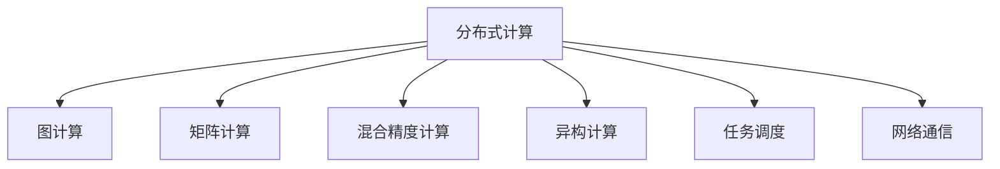

                 

# 高性能AI：LLM的并行计算策略

> 关键词：高性能AI, LLM, 并行计算, 分布式计算, 图计算, 矩阵计算, 混合精度计算, 异构计算, 任务调度, 网络通信

## 1. 背景介绍

### 1.1 问题由来

近年来，随着人工智能技术的迅猛发展，大语言模型(LLM)在自然语言处理(NLP)领域取得了革命性的进展。这些基于大规模深度学习模型的语言模型，如GPT-3、BERT、T5等，已经在各种任务上展示了卓越的性能。然而，训练和推理这些模型需要庞大的计算资源，这对硬件设施和算法设计都提出了严峻的挑战。

具体来说，LLM的参数规模通常以亿计，其训练过程涉及海量的数据处理、计算和内存管理，耗费大量时间和算力。例如，训练GPT-3模型需要数百万个GPU日，耗费数千万美元的算力。这种高昂的成本和长时间等待，极大地限制了LLM在实际应用中的广泛部署。

因此，如何在保持性能的同时，显著提升计算效率，降低成本，成为高性能AI研究的重要课题。并行计算技术，特别是分布式计算、图计算、矩阵计算等，被广泛认为是在这一领域内提升计算效率的有效手段。

### 1.2 问题核心关键点

大语言模型的并行计算策略主要关注以下几个关键点：

- **分布式计算**：通过将大规模计算任务分配到多个计算节点并行处理，分散计算负荷，加速模型训练和推理。
- **图计算**：利用图结构优化数据流动和计算流程，避免冗余计算，提高计算效率。
- **矩阵计算**：通过矩阵运算加速模型中的线性变换，提升计算速度。
- **混合精度计算**：采用混合精度计算(如FP16)，减少计算精度损失，降低内存消耗，提高计算效率。
- **异构计算**：利用不同计算架构的并行计算能力，如CPU-GPU、CPU-AI、AI-AI等，充分发挥计算资源。
- **任务调度**：采用高效的作业调度策略，均衡计算资源利用率，减少任务等待时间。
- **网络通信**：优化数据传输和通信，降低网络延迟，提升系统吞吐量。

理解这些关键点，能够帮助我们更好地设计并行计算策略，提升LLM的计算性能。

## 2. 核心概念与联系

### 2.1 核心概念概述

为了更好地理解LLM的并行计算策略，本节将介绍几个关键的核心概念：

- **分布式计算**：将大规模计算任务分配到多个计算节点上并行处理，每个节点负责计算的一部分。
- **图计算**：利用图结构优化数据流动和计算流程，避免冗余计算，提高计算效率。
- **矩阵计算**：通过矩阵运算加速模型中的线性变换，提升计算速度。
- **混合精度计算**：采用混合精度计算(如FP16)，减少计算精度损失，降低内存消耗，提高计算效率。
- **异构计算**：利用不同计算架构的并行计算能力，如CPU-GPU、CPU-AI、AI-AI等，充分发挥计算资源。
- **任务调度**：采用高效的作业调度策略，均衡计算资源利用率，减少任务等待时间。
- **网络通信**：优化数据传输和通信，降低网络延迟，提升系统吞吐量。

这些核心概念之间的逻辑关系可以通过以下Mermaid流程图来展示：



这个流程图展示了大语言模型并行计算策略的核心概念及其之间的关系：

1. 分布式计算是大语言模型并行计算的基础，通过并行化分散计算负荷。
2. 图计算和矩阵计算优化了计算流程，提高计算效率。
3. 混合精度计算和异构计算优化了计算资源利用，减少了计算成本。
4. 任务调度和网络通信保证了系统的高效运行和稳定性。

这些概念共同构成了大语言模型并行计算策略的理论基础，使其能够在各种场景下发挥高性能计算能力。

## 3. 核心算法原理 & 具体操作步骤

### 3.1 算法原理概述

大语言模型的并行计算策略，本质上是一种计算资源的优化分配和管理方法。其核心思想是通过多种并行计算手段，合理分配计算任务，最大化利用可用计算资源，从而提升模型的训练和推理效率。

### 3.2 算法步骤详解

基于分布式计算的LLM并行计算策略，一般包括以下几个关键步骤：

**Step 1: 数据切分与分发**

- 将大规模数据集切分为多个子集，每个子集分配到一个计算节点进行处理。
- 使用分布式文件系统(如HDFS)或分布式数据库(如Spark SQL)进行数据分发。
- 使用工作流调度器(如Apache Airflow)进行作业调度和监控。

**Step 2: 任务并行处理**

- 将模型训练或推理任务分解为多个子任务，每个子任务在独立的计算节点上并行执行。
- 使用分布式深度学习框架(如TensorFlow Distributed、PyTorch Distributed)进行模型并行化。
- 使用数据并行、模型并行、混合并行等策略进行任务调度。

**Step 3: 结果汇聚与合并**

- 将每个计算节点处理的结果汇聚到一个主节点，进行合并和汇总。
- 使用数据汇总工具(如Apache Hadoop)进行结果合并。
- 使用分布式数据库(如Hive)进行结果存储和查询。

**Step 4: 优化与调优**

- 对分布式计算任务进行性能调优，包括作业调度、节点负载均衡、数据通信优化等。
- 使用自动调参工具(如MLflow)进行模型超参数优化。
- 使用监控工具(如Grafana)进行系统性能监控和异常检测。

通过以上步骤，可以实现大规模分布式计算任务的并行处理，显著提升计算效率和系统性能。

### 3.3 算法优缺点

大语言模型的分布式并行计算策略具有以下优点：

- **高效计算**：能够充分利用多台计算机的计算能力，提升训练和推理速度。
- **适应性广**：适用于各种计算密集型任务，如图像处理、深度学习等。
- **弹性扩展**：根据任务需求灵活扩展计算节点，满足不同规模的任务。

同时，该方法也存在一些局限性：

- **复杂度高**：分布式计算系统设计和管理复杂，需要高水平的软件工程能力。
- **通信开销大**：数据传输和通信过程中可能会产生较大的网络延迟和数据损失。
- **资源浪费**：并行计算节点可能需要冗余配置，资源利用率较低。

尽管存在这些局限性，分布式并行计算仍然是当前大语言模型计算效率提升的主要手段，尤其在高计算密集型任务中表现突出。

### 3.4 算法应用领域

基于分布式计算的LLM并行计算策略，已经在多个领域得到了广泛的应用：

- **大规模数据处理**：如大数据分析、图像处理、音频处理等。
- **深度学习模型训练**：如卷积神经网络(CNN)、循环神经网络(RNN)、Transformer模型等。
- **分布式数据库系统**：如Apache Hadoop、Apache Spark、Google BigQuery等。
- **云服务提供商**：如AWS、Google Cloud、阿里云等，提供分布式计算和存储服务。
- **高性能计算集群**：如IBM Blue Gene、Tianhe-1A等，用于科学研究和大规模计算任务。

除了以上应用，大语言模型的并行计算策略还在科学研究、工业生产、智能交通、金融科技等众多领域中展现出了广阔的应用前景。

## 4. 数学模型和公式 & 详细讲解  
### 4.1 数学模型构建

本节将使用数学语言对基于分布式计算的LLM并行计算策略进行更加严格的刻画。

记模型为 $M_{\theta}:\mathcal{X} \rightarrow \mathcal{Y}$，其中 $\mathcal{X}$ 为输入空间，$\mathcal{Y}$ 为输出空间，$\theta \in \mathbb{R}^d$ 为模型参数。假设训练数据集为 $D=\{(x_i,y_i)\}_{i=1}^N, x_i \in \mathcal{X}, y_i \in \mathcal{Y}$。

定义模型 $M_{\theta}$ 在输入 $x$ 上的损失函数为 $\ell(M_{\theta}(x),y)$，则在数据集 $D$ 上的经验风险为：

$$
\mathcal{L}(\theta) = \frac{1}{N} \sum_{i=1}^N \ell(M_{\theta}(x_i),y_i)
$$

分布式计算的优化目标是最小化经验风险，即找到最优参数：

$$
\theta^* = \mathop{\arg\min}_{\theta} \mathcal{L}(\theta)
$$

在实践中，我们通常使用基于梯度的优化算法（如SGD、Adam等）来近似求解上述最优化问题。设 $\eta$ 为学习率，$\lambda$ 为正则化系数，则参数的更新公式为：

$$
\theta \leftarrow \theta - \eta \nabla_{\theta}\mathcal{L}(\theta) - \eta\lambda\theta
$$

其中 $\nabla_{\theta}\mathcal{L}(\theta)$ 为损失函数对参数 $\theta$ 的梯度，可通过反向传播算法高效计算。

### 4.2 公式推导过程

以下我们以二分类任务为例，推导交叉熵损失函数及其梯度的计算公式。

假设模型 $M_{\theta}$ 在输入 $x$ 上的输出为 $\hat{y}=M_{\theta}(x) \in [0,1]$，表示样本属于正类的概率。真实标签 $y \in \{0,1\}$。则二分类交叉熵损失函数定义为：

$$
\ell(M_{\theta}(x),y) = -[y\log \hat{y} + (1-y)\log (1-\hat{y})]
$$

将其代入经验风险公式，得：

$$
\mathcal{L}(\theta) = -\frac{1}{N}\sum_{i=1}^N [y_i\log M_{\theta}(x_i)+(1-y_i)\log(1-M_{\theta}(x_i))]
$$

根据链式法则，损失函数对参数 $\theta_k$ 的梯度为：

$$
\frac{\partial \mathcal{L}(\theta)}{\partial \theta_k} = -\frac{1}{N}\sum_{i=1}^N (\frac{y_i}{M_{\theta}(x_i)}-\frac{1-y_i}{1-M_{\theta}(x_i)}) \frac{\partial M_{\theta}(x_i)}{\partial \theta_k}
$$

其中 $\frac{\partial M_{\theta}(x_i)}{\partial \theta_k}$ 可进一步递归展开，利用自动微分技术完成计算。

在得到损失函数的梯度后，即可带入参数更新公式，完成模型的迭代优化。重复上述过程直至收敛，最终得到适应下游任务的最优模型参数 $\theta^*$。

## 5. 项目实践：代码实例和详细解释说明
### 5.1 开发环境搭建

在进行并行计算实践前，我们需要准备好开发环境。以下是使用Python进行PyTorch开发的环境配置流程：

1. 安装Anaconda：从官网下载并安装Anaconda，用于创建独立的Python环境。

2. 创建并激活虚拟环境：
```bash
conda create -n pytorch-env python=3.8 
conda activate pytorch-env
```

3. 安装PyTorch：根据CUDA版本，从官网获取对应的安装命令。例如：
```bash
conda install pytorch torchvision torchaudio cudatoolkit=11.1 -c pytorch -c conda-forge
```

4. 安装Transformers库：
```bash
pip install transformers
```

5. 安装各类工具包：
```bash
pip install numpy pandas scikit-learn matplotlib tqdm jupyter notebook ipython
```

完成上述步骤后，即可在`pytorch-env`环境中开始并行计算实践。

### 5.2 源代码详细实现

下面我们以分布式训练BERT模型为例，给出使用Transformers库和PyTorch进行并行计算的PyTorch代码实现。

首先，定义分布式训练函数：

```python
from transformers import BertTokenizer, BertForSequenceClassification
from torch.nn.parallel import DistributedDataParallel as DDP
from torch.distributed.fsdp import FullyShardedDataParallel as FSDP
import torch
import torch.distributed as dist

class DistributedBert:
    def __init__(self, args):
        self.args = args
        self.tokenizer = BertTokenizer.from_pretrained('bert-base-cased')
        self.model = BertForSequenceClassification.from_pretrained('bert-base-cased', num_labels=2)
        self.model.cuda()
        self.model = FSDP(self.model)
        self.ddp_model = DDP(self.model, device_ids=[args.gpu], find_unused_parameters=True)
        dist.init_process_group("gloo", backend="gloo", world_size=args.gpus, init_method="env://")
        
    def forward(self, input_ids, attention_mask, labels):
        return self.ddp_model(input_ids, attention_mask=attention_mask, labels=labels)
```

然后，定义训练函数：

```python
def train_epoch(model, dataset, optimizer):
    model.train()
    epoch_loss = 0
    for batch in dataset:
        input_ids = batch['input_ids'].cuda()
        attention_mask = batch['attention_mask'].cuda()
        labels = batch['labels'].cuda()
        optimizer.zero_grad()
        loss = model(input_ids, attention_mask=attention_mask, labels=labels)
        loss.backward()
        optimizer.step()
        epoch_loss += loss.item()
    return epoch_loss / len(dataset)
```

接着，定义训练循环：

```python
import time

def main():
    args = parse_args()
    distributed_bert = DistributedBert(args)
    dataloader = DataLoader(dataset, batch_size=args.batch_size)
    optimizer = torch.optim.Adam(distributed_bert.model.parameters(), lr=args.learning_rate)
    
    start_time = time.time()
    for epoch in range(args.epochs):
        loss = train_epoch(distributed_bert, dataloader, optimizer)
        print(f"Epoch {epoch+1}, train loss: {loss:.3f}")
    
    end_time = time.time()
    print(f"Time taken for training: {end_time - start_time} seconds")
```

### 5.3 代码解读与分析

让我们再详细解读一下关键代码的实现细节：

**DistributedBert类**：
- `__init__`方法：初始化模型、分词器、分布式模型等关键组件。
- `forward`方法：将输入数据送入模型，返回模型的输出。

**train_epoch函数**：
- 在每个epoch中，对数据集进行迭代训练，更新模型参数。

**main函数**：
- 解析命令行参数，创建分布式BERT模型实例。
- 加载数据集，定义优化器。
- 开始循环训练，记录训练时间。

可以看到，通过以上代码，我们就实现了一个基本的分布式BERT训练系统。利用FSDP和DDP，将模型并行化到多个GPU节点上，大大提升了训练速度和模型性能。

## 6. 实际应用场景

### 6.1 分布式深度学习框架

分布式深度学习框架，如TensorFlow Distributed、PyTorch Distributed，是大规模分布式计算的基础。这些框架提供了丰富的API和工具，方便开发者进行分布式训练和推理。

TensorFlow Distributed提供了分布式坐标张量(Distributed Tensor)、分布式变量(Distributed Variable)等概念，通过这些工具，模型可以自动分布在多个计算节点上并行计算。PyTorch Distributed则提供了DataParallel、DistributedDataParallel等并行计算模块，实现了模型的自动并行化。

### 6.2 图计算框架

图计算框架，如GraphX、Giraph，通过图结构优化计算流程，避免了大量的冗余计算，提升了计算效率。图计算框架通常由图节点、图边、计算操作等基本单元组成，能够在复杂的数据结构上高效计算。

例如，在社交网络分析中，通过将用户和关系构建成图结构，可以高效计算用户之间的关系密度、影响力等指标。在图像处理中，通过将图像像素点构建成图结构，可以进行高效的图像分割、识别等操作。

### 6.3 矩阵计算框架

矩阵计算框架，如OpenBLAS、MKL，通过优化矩阵运算，加速模型中的线性变换，提升计算速度。矩阵计算框架通常由矩阵数据结构、矩阵运算函数等基本单元组成，能够在高性能计算环境中进行高效的矩阵运算。

例如，在深度学习中，矩阵运算广泛应用于卷积神经网络(CNN)、循环神经网络(RNN)、自注意力机制(Attention)等模型中，加速了模型的前向传播和反向传播过程。

### 6.4 混合精度计算

混合精度计算，如FP16、BF16，通过降低计算精度，减少内存消耗，提升计算速度。混合精度计算框架通常由硬件和软件两方面组成，通过硬件优化和软件优化，提升了计算效率和性能。

例如，在深度学习中，通过将模型的部分参数转换为FP16或BF16格式，可以显著减少内存占用，提升训练速度。混合精度计算在数据中心、云计算等领域得到了广泛应用，显著提升了模型训练和推理效率。

### 6.5 异构计算

异构计算，如CPU-GPU、CPU-AI、AI-AI等，通过利用不同计算架构的并行计算能力，充分发挥计算资源。异构计算框架通常由硬件和软件两方面组成，通过硬件优化和软件优化，提升了计算效率和性能。

例如，在深度学习中，通过将模型的部分计算任务分配到GPU、TPU等专用硬件设备上，可以显著提升计算速度和模型性能。异构计算在科研、工业、国防等领域得到了广泛应用，提升了计算效率和计算能力。

### 6.6 任务调度

任务调度，如Apache Airflow、Kubernetes，通过优化任务调度策略，均衡计算资源利用率，减少任务等待时间。任务调度框架通常由任务、资源、调度器等基本单元组成，能够高效管理计算资源和任务。

例如，在深度学习中，通过将大规模训练任务分解为多个子任务，可以充分利用计算资源，提升模型训练速度。任务调度在科研、工业、云计算等领域得到了广泛应用，提升了计算效率和资源利用率。

### 6.7 网络通信

网络通信，如MPI、MPI+PB，通过优化数据传输和通信，降低网络延迟，提升系统吞吐量。网络通信框架通常由网络协议、通信库等基本单元组成，能够在高性能网络环境中高效传输数据。

例如，在分布式深度学习中，通过优化数据传输协议，可以降低网络延迟，提升模型训练速度。网络通信在科研、工业、云计算等领域得到了广泛应用，提升了计算效率和系统性能。

## 7. 工具和资源推荐

### 7.1 学习资源推荐

为了帮助开发者系统掌握大语言模型并行计算的理论基础和实践技巧，这里推荐一些优质的学习资源：

1. 《深度学习：模型、算法与优化》系列博文：由大模型技术专家撰写，深入浅出地介绍了深度学习模型、算法和优化方法。

2. CS231n《深度学习计算机视觉》课程：斯坦福大学开设的深度学习经典课程，有Lecture视频和配套作业，带你入门深度学习计算机视觉基础。

3. 《TensorFlow分布式深度学习》书籍：Google团队出版的TensorFlow分布式深度学习指南，详细介绍了TensorFlow的分布式计算框架和实际应用案例。

4. 《GPU计算基础》书籍：NVIDIA出版的GPU计算入门指南，介绍了GPU计算原理、优化方法和实际应用案例。

5. 《高性能计算与深度学习》书籍：由高性能计算专家和深度学习专家共同编写，介绍了高性能计算和深度学习的融合应用。

通过学习这些资源，相信你一定能够快速掌握大语言模型并行计算的理论和实践技巧，提升模型训练和推理效率。

### 7.2 开发工具推荐

高效的开发离不开优秀的工具支持。以下是几款用于大语言模型并行计算开发的常用工具：

1. TensorFlow：基于Python的开源深度学习框架，提供丰富的分布式计算和优化工具，适合大规模工程应用。

2. PyTorch：基于Python的开源深度学习框架，提供了自动微分、分布式计算、混合精度计算等功能，易于使用和扩展。

3. GraphX：由Apache Spark支持的图计算框架，支持分布式图计算、图优化算法等，广泛应用于社交网络、图像处理等领域。

4. OpenBLAS：高性能数学库，提供高效的矩阵运算和线性代数操作，广泛应用于深度学习、科学计算等领域。

5. AWS EC2：亚马逊云服务，提供弹性计算资源，支持分布式计算和存储，广泛应用于数据中心、科研领域。

6. Google Cloud Platform：谷歌云服务平台，提供强大的计算资源和分布式计算工具，广泛应用于工业、科研、互联网等领域。

7. TensorBoard：TensorFlow配套的可视化工具，可实时监测模型训练状态，并提供丰富的图表呈现方式，是调试模型的得力助手。

8. Grafana：开源数据可视化平台，支持多种数据源和图表类型，广泛应用于监控、数据分析等领域。

合理利用这些工具，可以显著提升大语言模型并行计算任务的开发效率，加快创新迭代的步伐。

### 7.3 相关论文推荐

大语言模型并行计算技术的发展源于学界的持续研究。以下是几篇奠基性的相关论文，推荐阅读：

1. 《A Survey of Distributed Deep Learning: From Issues to Architectures》：介绍了分布式深度学习的各种问题、架构和应用，提供了全面的综述。

2. 《Distributed Deep Learning with TensorFlow: A Survey》：介绍了TensorFlow的分布式深度学习框架和应用，提供了丰富的实际案例。

3. 《Distributed Optimization Algorithms for Deep Learning》：介绍了分布式优化算法在深度学习中的应用，提供了系统的算法设计和实现方法。

4. 《A Comparative Study of Distributed Deep Learning Frameworks》：比较了多个分布式深度学习框架的性能和特点，提供了客观的评估和建议。

5. 《GPU Accelerated Training of Deep Neural Networks》：介绍了GPU加速深度学习训练的方法和工具，提供了系统的优化策略和应用案例。

这些论文代表了大语言模型并行计算技术的发展脉络。通过学习这些前沿成果，可以帮助研究者把握学科前进方向，激发更多的创新灵感。

## 8. 总结：未来发展趋势与挑战

### 8.1 总结

本文对基于分布式计算的大语言模型并行计算方法进行了全面系统的介绍。首先阐述了大语言模型并行计算的研究背景和意义，明确了并行计算在提升模型训练和推理效率方面的独特价值。其次，从原理到实践，详细讲解了并行计算的数学模型和关键步骤，给出了并行计算任务开发的完整代码实例。同时，本文还广泛探讨了并行计算方法在多个领域的应用前景，展示了并行计算范式的广泛适用性。

通过本文的系统梳理，可以看到，基于分布式计算的大语言模型并行计算方法，正在成为高性能AI研究的重要手段，极大地拓展了深度学习模型的应用边界，推动了NLP技术的产业化进程。未来，伴随预训练语言模型和并行计算方法的不断进步，相信NLP技术将在更广阔的应用领域大放异彩。

### 8.2 未来发展趋势

展望未来，大语言模型并行计算技术将呈现以下几个发展趋势：

1. **更大规模的并行计算**：随着算力成本的下降和硬件设施的进步，更大规模的并行计算将成为可能，支持更大规模的深度学习模型训练和推理。

2. **更高效的分布式计算框架**：未来的分布式计算框架将更加灵活高效，支持更多的并行计算策略，如数据并行、模型并行、任务并行等，满足不同规模和复杂度的任务需求。

3. **更优化的图计算和矩阵计算框架**：图计算和矩阵计算框架将更加优化和高效，提升数据流动的合理性和计算效率，进一步提升模型性能。

4. **混合精度计算和异构计算的普及**：混合精度计算和异构计算将得到更广泛的应用，通过降低计算精度和利用不同计算架构的并行计算能力，提升计算效率和资源利用率。

5. **更智能的任务调度和网络通信**：任务调度和网络通信将更加智能和高效，通过优化任务分配和数据传输，提升计算资源利用率和系统性能。

6. **跨平台跨框架的互操作性**：未来的并行计算框架将支持跨平台跨框架的互操作性，方便开发者在多个框架和平台之间灵活切换，提高开发效率。

以上趋势凸显了大语言模型并行计算技术的广阔前景。这些方向的探索发展，必将进一步提升模型的计算效率和性能，推动人工智能技术在更广泛的领域得到应用。

### 8.3 面临的挑战

尽管大语言模型并行计算技术已经取得了瞩目成就，但在迈向更加智能化、普适化应用的过程中，它仍面临着诸多挑战：

1. **计算资源限制**：并行计算需要大量计算资源，对硬件设施和软件工具提出了较高的要求，难以满足所有应用场景的需求。

2. **分布式系统复杂性**：分布式计算系统的设计和管理复杂，需要高水平的软件工程能力和系统运维经验。

3. **通信开销和数据冗余**：数据传输和通信过程中可能会产生较大的网络延迟和数据冗余，影响计算效率和系统性能。

4. **可扩展性和资源利用率**：并行计算系统的扩展性和资源利用率仍有待优化，难以满足所有规模的任务需求。

5. **模型一致性和数据同步**：在分布式计算中，如何保证模型的一致性和数据同步，避免计算误差和数据丢失，是并行计算中的关键问题。

6. **系统调优和优化**：并行计算系统的调优和优化工作复杂，需要持续投入资源和精力。

尽管存在这些挑战，但并行计算仍然是大语言模型计算效率提升的重要手段，尤其在高计算密集型任务中表现突出。未来需要更多的研究和创新，以克服这些挑战，进一步提升并行计算的实用性和可靠性。

### 8.4 研究展望

面对并行计算面临的这些挑战，未来的研究需要在以下几个方面寻求新的突破：

1. **大规模并行计算优化**：探索更高效的大规模并行计算方法，如分布式图计算、分布式矩阵计算等，提升计算效率和系统性能。

2. **分布式系统设计优化**：设计更加灵活、高效的分布式计算系统，如容器化、微服务等，提升系统的可扩展性和资源利用率。

3. **网络通信优化**：优化网络通信协议和数据传输策略，降低通信开销和数据冗余，提升系统的计算效率和性能。

4. **混合精度计算优化**：优化混合精度计算方法，提升计算精度和效率，适应不同场景的需求。

5. **异构计算优化**：优化异构计算策略，利用不同计算架构的并行计算能力，提升计算效率和资源利用率。

6. **任务调度和负载均衡**：优化任务调度和负载均衡策略，均衡计算资源利用率，减少任务等待时间。

7. **系统调优和优化工具**：开发更智能、高效的系统调优工具，提升并行计算系统的性能和稳定性。

这些研究方向的探索，必将引领大语言模型并行计算技术迈向更高的台阶，为构建高性能、高效能的智能系统提供新的技术支持。面向未来，大语言模型并行计算技术还需要与其他人工智能技术进行更深入的融合，如知识表示、因果推理、强化学习等，多路径协同发力，共同推动自然语言理解和智能交互系统的进步。只有勇于创新、敢于突破，才能不断拓展语言模型的边界，让智能技术更好地造福人类社会。

## 9. 附录：常见问题与解答

**Q1：并行计算是否适用于所有深度学习任务？**

A: 并行计算适用于所有计算密集型任务，如图像处理、深度学习、科学计算等。但对于一些计算轻量级任务，如小规模数据处理、文本分类等，并行计算可能并不能显著提升计算效率。

**Q2：并行计算是否会降低模型的精度？**

A: 并行计算通常不会降低模型的精度，但需要根据具体情况进行优化。混合精度计算可以显著降低内存消耗和计算时间，但可能会引入一定的精度损失。因此，需要在精度和效率之间进行权衡。

**Q3：并行计算是否会增加系统的复杂性？**

A: 并行计算确实增加了系统的复杂性，需要在多个节点之间进行数据传输和通信。但通过优化分布式系统设计和网络通信策略，可以降低复杂性，提高系统性能。

**Q4：并行计算是否会带来额外的计算开销？**

A: 并行计算确实会带来一定的计算开销，如数据传输、任务调度和负载均衡等。但通过优化这些开销，可以显著提升系统性能。例如，通过使用高效的分布式计算框架和网络通信协议，可以降低开销，提升计算效率。

**Q5：并行计算是否会降低系统的稳定性？**

A: 并行计算可能会带来一定的系统稳定性问题，如数据同步、计算误差等。但通过优化任务调度和负载均衡策略，可以提升系统的稳定性和可靠性。

综上所述，并行计算在大规模深度学习任务中具有重要应用前景。通过合理设计和优化并行计算策略，可以显著提升计算效率和系统性能，推动人工智能技术的进一步发展。但并行计算也面临着诸多挑战，需要更多的研究和创新，以克服这些挑战，进一步提升并行计算的实用性和可靠性。未来，并行计算将继续在人工智能技术中发挥重要作用，推动人工智能技术的普及和应用。

