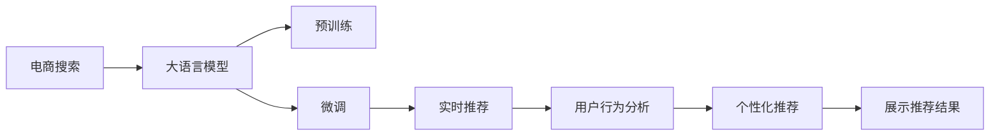

                 

# AI 大模型在电商搜索推荐中的实时推荐策略：抓住用户瞬时需求与行为偏好

> 关键词：电商搜索推荐,大模型,实时推荐,用户行为分析,个性化推荐

## 1. 背景介绍

### 1.1 问题由来

随着电商行业的快速发展，用户对商品搜索推荐的体验要求越来越高。传统的推荐算法虽然可以基于用户历史行为数据，为用户推荐个性化的商品，但往往忽略用户瞬时需求和行为偏好的变化。因此，如何实时捕捉用户瞬时需求，快速提供精准的商品推荐，成为了电商搜索推荐系统的核心挑战。

近年来，随着深度学习和大模型技术的不断进步，大语言模型在电商搜索推荐中的应用逐渐被广泛关注。通过预训练-微调的方式，大语言模型可以从海量文本数据中学习到丰富的语义和知识，快速适应新任务，生成更加个性化的推荐结果。特别是在实时推荐场景中，大模型可以实时获取用户输入的查询信息，并通过微调优化生成响应，极大地提升了推荐系统的响应速度和效果。

### 1.2 问题核心关键点

为了更深入地理解AI大模型在电商搜索推荐中的应用，本节将详细介绍以下几个关键点：

- 大语言模型预训练与微调的基本原理。
- 实时推荐系统架构的搭建方法。
- 用户行为分析和个性化推荐的核心算法。
- 推荐系统的优化和性能评估指标。

### 1.3 问题研究意义

大模型在电商搜索推荐中的应用，能够从海量文本数据中学习到用户的行为习惯和偏好，从而快速适应新的查询需求，生成精准的个性化推荐结果。这不仅能够提升用户体验，还能显著提升电商平台的转化率和销售量。

此外，实时推荐系统基于大模型的特点，能够快速响应用户的瞬时需求，避免用户等待过长时间才能看到推荐结果。这在提升用户满意度和留存率方面也具有重要意义。

## 2. 核心概念与联系

### 2.1 核心概念概述

为了更好地理解大模型在实时推荐系统中的应用，本节将详细介绍以下核心概念：

- **大语言模型**：以自回归或自编码模型为代表的大规模预训练语言模型。通过在大规模无标签文本语料上进行预训练，学习通用的语言表示，具备强大的语言理解和生成能力。

- **预训练**：指在大规模无标签文本语料上，通过自监督学习任务训练通用语言模型的过程。常见的预训练任务包括言语建模、遮挡语言模型等。

- **微调**：指在预训练模型的基础上，使用下游任务的少量标注数据，通过有监督学习优化模型在特定任务上的性能。通常只需要调整顶层分类器或解码器，并以较小的学习率更新全部或部分的模型参数。

- **实时推荐系统**：根据用户当前行为和偏好，实时生成个性化推荐结果的系统。通常需要快速响应、高并发处理能力。

- **用户行为分析**：通过分析用户的历史行为数据，挖掘用户的兴趣偏好和瞬时需求，为推荐系统提供输入。

- **个性化推荐**：基于用户的历史行为数据和实时行为数据，生成个性化的推荐结果，提升用户满意度。

### 2.2 核心概念联系的Mermaid流程图



该流程图展示了电商搜索推荐系统中大语言模型的应用路径：

1. 电商搜索请求传入大语言模型。
2. 大语言模型先进行预训练，获得通用语言表示。
3. 然后对电商搜索推荐任务进行微调，生成推荐结果。
4. 推荐结果经实时推荐系统处理，展示给用户。
5. 用户行为分析模块从推荐系统中获取用户行为数据。
6. 个性化推荐模块根据用户行为数据和实时数据生成新的推荐。
7. 新的推荐再次展示给用户，完成循环。

## 3. 核心算法原理 & 具体操作步骤

### 3.1 算法原理概述

基于大语言模型的实时推荐系统，其核心算法原理可以概括为以下几个步骤：

1. 在大规模无标签文本数据上进行预训练，获得通用语言表示。
2. 在电商搜索推荐任务的标注数据上进行微调，优化模型在推荐任务上的性能。
3. 实时获取用户输入的查询信息，通过微调生成个性化推荐结果。
4. 将推荐结果展示给用户，并收集用户反馈数据，进行二次微调，不断优化推荐策略。

### 3.2 算法步骤详解

以下是详细的算法步骤和具体操作步骤：

#### 3.2.1 预训练阶段

在预训练阶段，大模型需要通过大量的无标签文本数据进行预训练，学习通用的语言表示。

1. 收集大规模无标签文本数据，如维基百科、新闻、社交媒体等。
2. 将数据进行预处理，包括分词、去除停用词、构建词汇表等。
3. 使用自监督学习任务进行预训练，如掩码语言模型Masked Language Modeling（MLM）、下一个句子预测Next Sentence Prediction（NSP）等。
4. 根据预训练效果，调整预训练的超参数，如学习率、批大小、迭代次数等。

#### 3.2.2 微调阶段

在微调阶段，将预训练模型应用于电商搜索推荐任务，优化模型性能。

1. 收集电商搜索推荐任务的标注数据，包括商品ID、价格、描述、评分等。
2. 将数据进行预处理，包括分词、去除停用词、构建词汇表等。
3. 使用微调任务进行训练，如基于用户查询的推荐商品分类、商品匹配度评分等。
4. 根据微调效果，调整微调的超参数，如学习率、批大小、迭代次数等。
5. 保存微调后的模型参数，作为实时推荐系统的一部分。

#### 3.2.3 实时推荐阶段

在实时推荐阶段，根据用户输入的查询信息，快速生成个性化推荐结果。

1. 实时获取用户输入的查询信息，包括搜索关键词、用户ID等。
2. 将查询信息传入微调后的模型，获取推荐结果。
3. 根据推荐结果，选择最佳的推荐商品展示给用户。
4. 收集用户点击、购买等反馈数据，进行二次微调，不断优化推荐策略。

### 3.3 算法优缺点

基于大语言模型的实时推荐系统具有以下优点：

- **性能高效**：大模型可以并行计算，快速生成推荐结果。
- **适应性强**：微调后的模型能够快速适应新任务，生成个性化推荐。
- **鲁棒性高**：大模型具备强大的泛化能力，能够在不同场景下生成稳定推荐。
- **用户体验好**：实时响应用户查询，提升用户满意度和留存率。

但该系统也存在一些缺点：

- **资源消耗大**：大模型需要大量的计算资源进行预训练和微调。
- **数据依赖强**：推荐结果的精度取决于标注数据的丰富程度和质量。
- **隐私问题**：用户数据需要存储和处理，存在隐私泄露风险。
- **可解释性差**：大模型的决策过程难以解释，不利于用户理解和信任。

### 3.4 算法应用领域

基于大语言模型的实时推荐系统，可以应用于各种电商搜索推荐场景，包括：

- 商品搜索推荐：根据用户输入的关键词，快速生成相关商品推荐。
- 个性化购物车推荐：根据用户浏览、添加的商品历史数据，推荐更多符合用户喜好的商品。
- 新用户引导推荐：根据新用户的行为数据，推荐可能感兴趣的商品。
- 跨平台推荐：在不同电商平台上，基于用户行为数据进行一致的推荐。

## 4. 数学模型和公式 & 详细讲解 & 举例说明

### 4.1 数学模型构建

本节将使用数学语言对大语言模型在电商搜索推荐中的应用进行更加严格的刻画。

记大语言模型为 $M_{\theta}$，其中 $\theta$ 为模型参数。电商搜索推荐任务的目标是最大化用户点击率和转化率，可以使用以下数学模型表示：

$$
\max_{\theta} \mathbb{E}_{x,y} [log\sigma(\theta x) - log(1 - \sigma(\theta x))]
$$

其中 $x$ 为电商搜索查询信息，$y$ 为用户点击或购买的标签（0或1），$\sigma(\cdot)$ 为 sigmoid 函数，表示模型输出的预测概率。

### 4.2 公式推导过程

以下我们以推荐商品的分类任务为例，推导交叉熵损失函数及其梯度的计算公式。

假设模型 $M_{\theta}$ 在输入 $x$ 上的输出为 $\hat{y}=M_{\theta}(x) \in [0,1]$，表示商品属于正类的概率。真实标签 $y \in \{0,1\}$。则二分类交叉熵损失函数定义为：

$$
\ell(M_{\theta}(x),y) = -[y\log \hat{y} + (1-y)\log (1-\hat{y})]
$$

将其代入期望值，得：

$$
\max_{\theta} \mathbb{E}_{x,y} [-ylog\hat{y} - (1-y)log(1-\hat{y})]
$$

根据梯度下降等优化算法，微调过程不断更新模型参数 $\theta$，最小化损失函数，使得模型输出逼近真实标签。

### 4.3 案例分析与讲解

以某电商平台为例，假设收集了 $N$ 个用户的搜索查询信息 $x_i$ 和对应的商品ID $y_i$。在预训练和微调阶段，使用大模型对用户搜索查询进行特征提取，并在此基础上进行分类任务训练。假设使用交叉熵损失函数，优化器的学习率为 $\eta$，超参数 $\lambda$ 为正则化系数，则参数更新公式为：

$$
\theta \leftarrow \theta - \eta \nabla_{\theta}\mathcal{L}(\theta) - \eta\lambda\theta
$$

其中 $\nabla_{\theta}\mathcal{L}(\theta)$ 为损失函数对参数 $\theta$ 的梯度，可通过反向传播算法高效计算。

在实时推荐阶段，假设用户输入的查询为 $x$，模型输出为 $\hat{y}=M_{\theta}(x)$，则损失函数为：

$$
\ell(M_{\theta}(x),y) = -[y\log \hat{y} + (1-y)\log (1-\hat{y})]
$$

通过前向传播计算损失函数，并根据梯度下降等优化算法更新模型参数 $\theta$，使得模型输出逼近真实标签。

## 5. 项目实践：代码实例和详细解释说明

### 5.1 开发环境搭建

在进行实时推荐系统开发前，我们需要准备好开发环境。以下是使用Python进行PyTorch开发的环境配置流程：

1. 安装Anaconda：从官网下载并安装Anaconda，用于创建独立的Python环境。

2. 创建并激活虚拟环境：
```bash
conda create -n pytorch-env python=3.8 
conda activate pytorch-env
```

3. 安装PyTorch：根据CUDA版本，从官网获取对应的安装命令。例如：
```bash
conda install pytorch torchvision torchaudio cudatoolkit=11.1 -c pytorch -c conda-forge
```

4. 安装TensorFlow：使用以下命令安装TensorFlow：
```bash
pip install tensorflow
```

5. 安装各类工具包：
```bash
pip install numpy pandas scikit-learn matplotlib tqdm jupyter notebook ipython
```

完成上述步骤后，即可在`pytorch-env`环境中开始实时推荐系统的开发。

### 5.2 源代码详细实现

下面我们以推荐商品的分类任务为例，给出使用PyTorch和TensorFlow进行实时推荐系统的代码实现。

首先，定义模型和优化器：

```python
from transformers import BertTokenizer, BertForSequenceClassification
import torch
import tensorflow as tf
from transformers import BertTokenizer, BertForSequenceClassification

model = BertForSequenceClassification.from_pretrained('bert-base-uncased', num_labels=2)
optimizer = torch.optim.Adam(model.parameters(), lr=2e-5)

tokenizer = BertTokenizer.from_pretrained('bert-base-uncased')
```

然后，定义训练和评估函数：

```python
def train_epoch(model, dataset, batch_size, optimizer):
    model.train()
    total_loss = 0
    for batch in dataset:
        inputs, labels = batch
        input_ids = tokenizer(inputs, padding='max_length', truncation=True, max_length=512)
        attention_mask = input_ids['attention_mask']
        labels = input_ids['labels']
        outputs = model(input_ids, attention_mask=attention_mask)
        loss = outputs.loss
        total_loss += loss.item()
        optimizer.zero_grad()
        loss.backward()
        optimizer.step()
    return total_loss / len(dataset)

def evaluate(model, dataset, batch_size):
    model.eval()
    total_loss = 0
    correct_predictions = 0
    with torch.no_grad():
        for batch in dataset:
            inputs, labels = batch
            input_ids = tokenizer(inputs, padding='max_length', truncation=True, max_length=512)
            attention_mask = input_ids['attention_mask']
            labels = input_ids['labels']
            outputs = model(input_ids, attention_mask=attention_mask)
            loss = outputs.loss
            total_loss += loss.item()
            predictions = outputs.logits.argmax(dim=1)
            correct_predictions += (predictions == labels).sum().item()
    return total_loss / len(dataset), correct_predictions / len(dataset)
```

接着，加载数据集并进行模型训练和评估：

```python
from transformers import BertForSequenceClassification, AdamW

# 加载数据集
train_dataset = ...
dev_dataset = ...
test_dataset = ...

# 训练模型
epochs = 5
batch_size = 16

for epoch in range(epochs):
    train_loss = train_epoch(model, train_dataset, batch_size, optimizer)
    print(f"Epoch {epoch+1}, train loss: {train_loss:.3f}")
    
    dev_loss, dev_acc = evaluate(model, dev_dataset, batch_size)
    print(f"Epoch {epoch+1}, dev results:")
    print(f"Loss: {dev_loss:.3f}, Acc: {dev_acc:.3f}")
    
print("Test results:")
test_loss, test_acc = evaluate(model, test_dataset, batch_size)
print(f"Test Loss: {test_loss:.3f}, Test Acc: {test_acc:.3f}")
```

以上是使用PyTorch进行实时推荐系统开发的完整代码实现。开发者可以根据具体需求，进一步改进和优化模型架构和训练过程。

## 6. 实际应用场景

### 6.1 智能客服推荐

基于实时推荐系统的智能客服推荐，可以显著提升客服系统的效率和用户体验。传统客服推荐往往依赖人工干预，响应时间长，推荐结果不稳定。

在智能客服推荐中，实时推荐系统可以根据用户的实时语音输入或文字查询，快速生成个性化推荐商品或服务，引导用户自助解决常见问题。这不仅缩短了用户等待时间，还能提高客服系统的智能化水平。

### 6.2 个性化购物推荐

个性化购物推荐是实时推荐系统的重要应用场景之一。通过实时获取用户的浏览、购买行为数据，推荐系统可以动态生成符合用户喜好的商品，提升用户购买转化率。

在个性化购物推荐中，实时推荐系统可以根据用户浏览历史、收藏商品、购买记录等信息，实时调整推荐策略，为用户提供更精准的商品推荐。这不仅能够提升用户的购物体验，还能增加平台的销售额。

### 6.3 跨平台推荐

跨平台推荐是实时推荐系统的另一大应用场景。在电商平台上，不同平台的商品和用户数据可能存在差异，如何实现一致的推荐策略，提升用户体验，是推荐系统面临的重要挑战。

在跨平台推荐中，实时推荐系统可以根据用户在各个平台的浏览、购买行为数据，综合考虑各平台的用户偏好和商品特性，实现一致的推荐策略。这不仅能够提升用户的购物体验，还能增加平台的综合竞争力。

### 6.4 未来应用展望

随着实时推荐系统的不断发展，其在电商搜索推荐中的应用前景将更加广阔。未来，实时推荐系统将进一步优化算法，提升推荐效果，并与其他AI技术进行深度融合，构建更加智能、个性化的推荐系统。

在智慧医疗领域，实时推荐系统可以基于用户的历史健康数据和实时健康查询，推荐合适的医疗资源和服务，提升医疗服务的智能化水平。

在智能教育领域，实时推荐系统可以基于用户的学习历史和实时学习行为，推荐合适的学习资源和课程，提升教学效果和学习体验。

在智慧城市治理中，实时推荐系统可以基于用户的出行历史和实时出行需求，推荐合适的出行路线和服务，提升城市管理的智能化水平。

总之，实时推荐系统将会在更多领域得到应用，为社会各行业的智能化发展提供强有力的支持。

## 7. 工具和资源推荐

### 7.1 学习资源推荐

为了帮助开发者系统掌握实时推荐系统的理论基础和实践技巧，这里推荐一些优质的学习资源：

1. 《深度学习实战》系列书籍：由深度学习专家撰写，深入浅出地介绍了深度学习的基础知识和经典模型。

2. 《TensorFlow实战》系列书籍：由TensorFlow官方团队编写，详细介绍了TensorFlow的使用方法和典型应用场景。

3. 《自然语言处理入门》课程：斯坦福大学开设的NLP课程，涵盖了NLP领域的基本概念和经典模型。

4. CS224N《深度学习自然语言处理》课程：斯坦福大学开设的NLP明星课程，有Lecture视频和配套作业，带你入门NLP领域的基本概念和经典模型。

5. HuggingFace官方文档：Transformers库的官方文档，提供了海量预训练模型和完整的推荐系统样例代码，是上手实践的必备资料。

通过对这些资源的学习实践，相信你一定能够快速掌握实时推荐系统的精髓，并用于解决实际的电商推荐问题。

### 7.2 开发工具推荐

高效的开发离不开优秀的工具支持。以下是几款用于实时推荐系统开发的常用工具：

1. PyTorch：基于Python的开源深度学习框架，灵活动态的计算图，适合快速迭代研究。大部分预训练语言模型都有PyTorch版本的实现。

2. TensorFlow：由Google主导开发的开源深度学习框架，生产部署方便，适合大规模工程应用。同样有丰富的预训练语言模型资源。

3. Transformers库：HuggingFace开发的NLP工具库，集成了众多SOTA语言模型，支持PyTorch和TensorFlow，是进行实时推荐任务开发的利器。

4. Weights & Biases：模型训练的实验跟踪工具，可以记录和可视化模型训练过程中的各项指标，方便对比和调优。与主流深度学习框架无缝集成。

5. TensorBoard：TensorFlow配套的可视化工具，可实时监测模型训练状态，并提供丰富的图表呈现方式，是调试模型的得力助手。

6. Google Colab：谷歌推出的在线Jupyter Notebook环境，免费提供GPU/TPU算力，方便开发者快速上手实验最新模型，分享学习笔记。

合理利用这些工具，可以显著提升实时推荐系统的开发效率，加快创新迭代的步伐。

### 7.3 相关论文推荐

实时推荐系统的发展源于学界的持续研究。以下是几篇奠基性的相关论文，推荐阅读：

1. Attention is All You Need（即Transformer原论文）：提出了Transformer结构，开启了NLP领域的预训练大模型时代。

2. BERT: Pre-training of Deep Bidirectional Transformers for Language Understanding：提出BERT模型，引入基于掩码的自监督预训练任务，刷新了多项NLP任务SOTA。

3. Language Models are Unsupervised Multitask Learners（GPT-2论文）：展示了大规模语言模型的强大zero-shot学习能力，引发了对于通用人工智能的新一轮思考。

4. Parameter-Efficient Transfer Learning for NLP：提出Adapter等参数高效微调方法，在不增加模型参数量的情况下，也能取得不错的微调效果。

5. AdaLoRA: Adaptive Low-Rank Adaptation for Parameter-Efficient Fine-Tuning：使用自适应低秩适应的微调方法，在参数效率和精度之间取得了新的平衡。

这些论文代表了大模型在实时推荐系统中的应用方向。通过学习这些前沿成果，可以帮助研究者把握学科前进方向，激发更多的创新灵感。

## 8. 总结：未来发展趋势与挑战

### 8.1 总结

本文对基于大语言模型的实时推荐系统进行了全面系统的介绍。首先阐述了实时推荐系统在电商搜索推荐中的应用背景和意义，明确了实时推荐系统在提升用户体验和销售转化率方面的重要价值。其次，从原理到实践，详细讲解了实时推荐系统的构建方法、用户行为分析的核心算法和个性化推荐的技术实现。最后，本文还探讨了实时推荐系统在实际应用中的具体场景和未来发展方向，给出了系统的学习资源和工具推荐。

通过本文的系统梳理，可以看到，基于大语言模型的实时推荐系统正在成为电商搜索推荐的重要技术范式，极大地提升了推荐系统的响应速度和效果。未来，伴随大语言模型和微调方法的持续演进，实时推荐系统将更加高效、智能，为电商搜索推荐带来更多的创新和突破。

### 8.2 未来发展趋势

展望未来，实时推荐系统将呈现以下几个发展趋势：

1. **推荐算法复杂化**：未来推荐算法将更加复杂，能够实时捕捉用户瞬时需求和行为偏好，生成更加精准的推荐结果。

2. **多模态融合**：推荐系统将融合多种模态信息，如图像、语音、视频等，提升推荐效果和用户体验。

3. **实时计算优化**：推荐系统将优化计算图，减少资源消耗，实现更加轻量级、实时性的部署。

4. **联邦学习应用**：推荐系统将引入联邦学习技术，保护用户隐私的同时，实现跨平台数据融合和模型训练。

5. **多智能体协同**：推荐系统将实现多智能体的协同优化，提升推荐策略的稳定性和鲁棒性。

以上趋势凸显了实时推荐系统的广阔前景。这些方向的探索发展，将进一步提升推荐系统的性能和应用范围，为电商搜索推荐带来更多的创新和突破。

### 8.3 面临的挑战

尽管实时推荐系统已经取得了瞩目成就，但在迈向更加智能化、普适化应用的过程中，它仍面临着诸多挑战：

1. **数据质量**：推荐系统需要大量高质量的用户行为数据，数据缺失、噪声等问题会影响推荐效果。

2. **计算资源**：实时推荐系统需要快速计算，对计算资源和硬件设备提出了较高的要求。

3. **隐私保护**：用户数据需要存储和处理，存在隐私泄露风险，需要采取有效的隐私保护措施。

4. **模型可解释性**：大模型的决策过程难以解释，不利于用户理解和信任，需要加强可解释性和可审计性。

5. **跨平台协同**：不同平台的用户行为数据可能存在差异，如何实现跨平台的协同推荐，需要更复杂的算法和模型。

6. **推荐泛化性**：推荐系统需要在不同场景下生成稳定推荐，如何提升模型的泛化能力，仍需进一步研究。

正视实时推荐系统面临的这些挑战，积极应对并寻求突破，将是大模型实时推荐系统走向成熟的必由之路。相信随着学界和产业界的共同努力，这些挑战终将一一被克服，实时推荐系统必将在构建人机协同的智能推荐系统中扮演越来越重要的角色。

### 8.4 未来突破

面对实时推荐系统面临的种种挑战，未来的研究需要在以下几个方面寻求新的突破：

1. **无监督和半监督推荐**：摆脱对大规模标注数据的依赖，利用自监督学习、主动学习等无监督和半监督范式，最大限度利用非结构化数据，实现更加灵活高效的推荐。

2. **参数高效推荐**：开发更加参数高效的推荐方法，在固定大部分预训练参数的同时，只更新极少量的任务相关参数。同时优化推荐系统的计算图，减少资源消耗，实现更加轻量级、实时性的部署。

3. **多智能体协同优化**：引入多智能体协同优化技术，提升推荐策略的稳定性和鲁棒性。

4. **跨平台推荐**：实现跨平台数据的协同推荐，提升推荐的综合效果。

5. **推荐系统的自适应性**：实现推荐系统的自适应，根据用户行为实时调整推荐策略，提升推荐效果。

6. **推荐系统的可解释性**：引入可解释性技术，提升推荐系统的可信度和透明性。

这些研究方向的探索，将引领实时推荐系统迈向更高的台阶，为构建安全、可靠、可解释、可控的智能推荐系统铺平道路。面向未来，实时推荐系统还需要与其他AI技术进行更深入的融合，如知识表示、因果推理、强化学习等，多路径协同发力，共同推动推荐系统的发展。

## 9. 附录：常见问题与解答

**Q1：实时推荐系统是否适用于所有电商场景？**

A: 实时推荐系统适用于大部分电商场景，特别是对于数据量较小、用户行为变化快速的场景。但对于一些特殊电商场景，如大宗商品、高端定制商品等，由于数据稀疏和用户行为复杂，推荐系统需要更复杂的算法和模型。

**Q2：如何选择适合的实时推荐算法？**

A: 实时推荐算法的选择取决于电商平台的业务特点和用户需求。对于高价值商品，可以使用基于用户行为的推荐算法；对于长尾商品，可以使用基于内容的推荐算法；对于实时性要求高的场景，可以使用基于实时行为的推荐算法。

**Q3：实时推荐系统如何处理用户行为数据？**

A: 实时推荐系统通过实时获取用户的行为数据，如浏览、购买、评价等，进行分析处理，生成推荐结果。可以使用时间序列分析、关联规则挖掘等方法，对用户行为进行建模和预测。

**Q4：实时推荐系统如何保证推荐结果的个性化？**

A: 实时推荐系统通过学习用户的历史行为数据和实时行为数据，动态调整推荐策略，生成符合用户喜好的推荐结果。可以使用协同过滤、内容推荐、混合推荐等方法，提升推荐结果的个性化程度。

**Q5：实时推荐系统如何保证推荐结果的多样性？**

A: 实时推荐系统通过引入多样性惩罚、轮播推荐等机制，避免推荐结果过于集中，提升推荐结果的多样性。同时可以通过随机森林、神经网络等模型，增强推荐结果的多样性。

通过回答这些问题，可以帮助开发者更好地理解实时推荐系统的实现方法和优化策略，从而构建更加高效、智能的推荐系统。

---

作者：禅与计算机程序设计艺术 / Zen and the Art of Computer Programming

