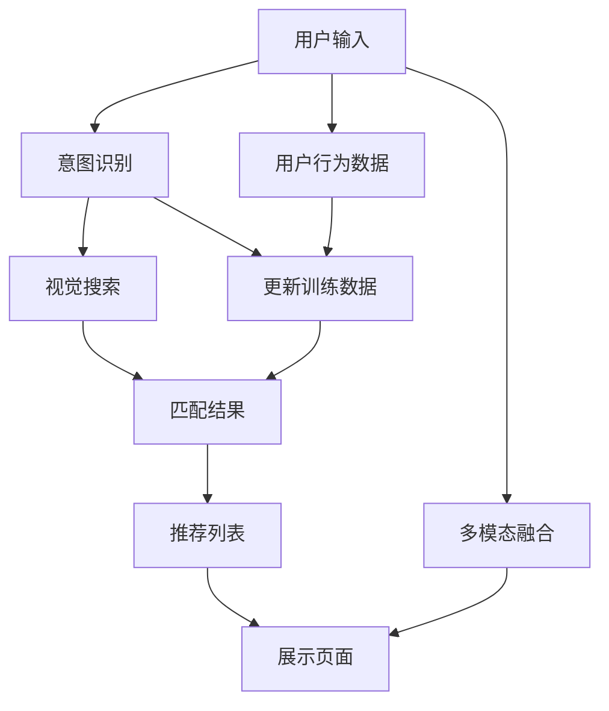

                 

# AI 大模型在电商搜索推荐中的用户体验优化策略：提高用户粘性和转化率

## 1. 背景介绍

在电商领域，搜索和推荐系统是用户购物体验的核心环节。这些系统旨在通过精准匹配用户意图和商品信息，提升用户体验，增加用户停留时间，从而促进交易转化。近年来，AI大模型在自然语言处理(NLP)、计算机视觉(Computer Vision)等领域取得了显著进展，为电商搜索推荐系统的升级提供了强有力的技术支持。

具体而言，AI大模型可以用于：

- **意图理解**：通过分析用户输入的查询、评论等文本数据，理解用户真正意图，并推荐相关商品。
- **视觉搜索**：通过图像匹配技术，识别用户上传的图片，推荐相似或相关商品。
- **个性化推荐**：通过分析用户历史行为数据，预测用户可能感兴趣的商品，并进行精准推荐。

然而，传统的电商搜索推荐系统在个性化、实时性、可解释性等方面仍存在不足。AI大模型的引入，提供了从底层数据处理到高层次策略优化的全流程优化方案，有望大幅提升用户体验和转化率。

## 2. 核心概念与联系

### 2.1 核心概念概述

为理解AI大模型在电商搜索推荐中的应用，我们首先介绍几个关键概念：

- **意图识别**：通过NLP技术，从用户输入的文本中解析出用户的查询意图，以指导后续的搜索和推荐。
- **视觉搜索**：通过计算机视觉技术，识别用户上传的图片，并匹配相关商品信息。
- **推荐算法**：利用机器学习模型对用户行为数据进行建模，预测用户可能感兴趣的商品，并提供个性化推荐。
- **持续学习**：随着用户行为数据的积累，不断更新模型参数，提升推荐效果。
- **多模态融合**：结合文本、图像、语音等多种模态数据，提供更全面的商品匹配和推荐。

这些概念共同构成了电商搜索推荐系统的基础框架，而AI大模型的引入，使得每个环节的优化变得更加高效和智能。

### 2.2 核心概念原理和架构的 Mermaid 流程图



上述图表展示了从用户输入到商品展示的全流程，其中意图识别、视觉搜索和推荐算法是关键模块，通过多模态融合进一步提升推荐效果。

## 3. 核心算法原理 & 具体操作步骤

### 3.1 算法原理概述

基于AI大模型的电商搜索推荐系统，通过在预训练语言模型、计算机视觉模型等基础上，进行微调，实现对用户意图和行为的深入理解和精准推荐。具体来说，其算法原理包括以下几个步骤：

1. **预训练模型选择**：选择合适的预训练语言模型和计算机视觉模型，作为搜索推荐的基础。
2. **微调策略设计**：根据具体的电商场景，设计微调策略，包括数据准备、任务适配层设计、优化算法选择等。
3. **训练与评估**：在标注数据上训练微调后的模型，并定期在验证集上评估性能，进行调整优化。
4. **部署与反馈**：将优化后的模型部署到实际系统中，通过用户反馈和行为数据不断更新模型，提升推荐效果。

### 3.2 算法步骤详解

#### 3.2.1 数据准备

数据准备是电商搜索推荐系统的基础。具体步骤如下：

1. **数据收集**：收集用户搜索查询、点击记录、购买记录、评价评论等多维数据。
2. **数据清洗**：处理缺失值、异常值，确保数据质量。
3. **数据标注**：为部分数据进行标注，如商品类别、用户意图等，为后续微调提供监督信号。
4. **数据划分**：将数据集划分为训练集、验证集和测试集，一般建议训练集占70%，验证集占15%，测试集占15%。

#### 3.2.2 任务适配层设计

任务适配层是电商搜索推荐系统的关键组件，其作用是将预训练模型输出映射到具体的电商任务上。常见的任务适配层包括：

1. **意图分类器**：将用户查询输入到BERT等预训练语言模型中，输出意图分类结果。
2. **视觉匹配器**：将用户上传的图片输入到ResNet等预训练计算机视觉模型中，输出相似商品匹配结果。
3. **推荐排序器**：将用户行为数据输入到DNN等神经网络模型中，预测用户对商品的兴趣评分，并进行排序。

#### 3.2.3 优化算法选择

优化算法的选择对模型性能有重要影响。常用的优化算法包括：

1. **AdamW**：自适应学习率优化算法，适合处理大规模数据和复杂模型。
2. **Adafactor**：适应于学习率自调整的优化算法，能在训练过程中自动调节学习率。
3. **SGD**：经典的随机梯度下降算法，适用于小规模数据和简单模型。

#### 3.2.4 训练与评估

训练与评估是模型优化的核心环节。具体步骤如下：

1. **模型初始化**：使用预训练模型作为初始权重，进行微调。
2. **模型训练**：在训练集上进行迭代训练，最小化损失函数。
3. **模型评估**：在验证集上进行性能评估，根据评估结果调整模型参数和训练策略。
4. **模型测试**：在测试集上进行最终评估，确保模型泛化能力。

### 3.3 算法优缺点

AI大模型在电商搜索推荐系统中的应用，具有以下优点：

1. **效果显著**：通过深度学习模型进行精准匹配和推荐，大幅提升推荐效果和用户体验。
2. **灵活性高**：可以根据具体场景和需求，灵活调整任务适配层和微调策略。
3. **可扩展性强**：能够处理多维数据和多模态信息，提供全面和个性化的推荐服务。
4. **效率高**：利用GPU等高性能设备，实现快速训练和推理。

同时，AI大模型也存在一些缺点：

1. **数据依赖性强**：依赖标注数据和高质量数据，数据量不足时可能效果不佳。
2. **模型复杂度高**：预训练和微调过程较为复杂，需要较高的技术和计算资源。
3. **模型可解释性差**：大模型通常为黑盒模型，难以解释其决策过程。
4. **模型鲁棒性差**：面对异常数据和噪声数据，模型容易过拟合。

### 3.4 算法应用领域

AI大模型在电商搜索推荐系统中的应用，主要体现在以下几个方面：

1. **意图理解**：通过NLP模型解析用户查询，理解其意图，进行精准搜索。
2. **视觉搜索**：通过计算机视觉模型匹配用户上传的图片，提供相关商品推荐。
3. **个性化推荐**：利用机器学习模型分析用户行为数据，提供个性化推荐。
4. **动态推荐**：根据用户实时行为数据，动态更新推荐策略。
5. **跨模态融合**：结合文本、图像、语音等多种模态数据，提供更全面的商品匹配和推荐。

## 4. 数学模型和公式 & 详细讲解

### 4.1 数学模型构建

基于AI大模型的电商搜索推荐系统，数学模型构建主要包括以下几个步骤：

1. **输入表示**：将用户输入的数据（如查询文本、上传图片等）转换为模型可接受的向量形式。
2. **中间表示**：利用预训练模型（如BERT、ResNet等）对输入数据进行处理，提取中间表示。
3. **任务表示**：将中间表示映射到具体的电商任务上，输出预测结果。

### 4.2 公式推导过程

以意图理解为例，假设用户查询为 $x$，预训练模型为 $M_{\theta}$，意图分类器为 $C_{\phi}$，则意图识别的数学模型可表示为：

$$
\hat{y} = C_{\phi}(M_{\theta}(x))
$$

其中，$y$ 表示真实意图类别，$\hat{y}$ 表示模型预测的意图类别。

使用交叉熵损失函数，损失函数 $\mathcal{L}$ 可表示为：

$$
\mathcal{L}(\theta, \phi) = -\frac{1}{N} \sum_{i=1}^N \ell(y_i, \hat{y}_i)
$$

其中 $\ell$ 为交叉熵损失函数，$N$ 为样本数量。

### 4.3 案例分析与讲解

以视觉搜索为例，假设用户上传的图片为 $I$，预训练计算机视觉模型为 $V_{\omega}$，视觉匹配器为 $M_{\omega}$，则视觉搜索的数学模型可表示为：

$$
\hat{S} = M_{\omega}(V_{\omega}(I))
$$

其中 $S$ 表示匹配到的相似商品列表，$\hat{S}$ 表示模型预测的相似商品列表。

使用均方误差损失函数，损失函数 $\mathcal{L}$ 可表示为：

$$
\mathcal{L}(\omega, \omega) = \frac{1}{N} \sum_{i=1}^N (S_i - \hat{S}_i)^2
$$

其中 $S_i$ 表示真实相似商品列表，$\hat{S}_i$ 表示模型预测的相似商品列表。

## 5. 项目实践：代码实例和详细解释说明

### 5.1 开发环境搭建

#### 5.1.1 硬件准备

- **CPU**：至少8核以上。
- **GPU**：至少一块NVIDIA Tesla V100或以上型号的GPU。
- **内存**：至少32GB。
- **存储**：至少1TB的硬盘空间。

#### 5.1.2 软件准备

- **Python**：版本为3.8及以上。
- **PyTorch**：版本为1.8及以上。
- **Transformers**：版本为4.8及以上。
- **Pillow**：用于图像处理。
- **TensorBoard**：用于可视化训练过程。

#### 5.1.3 安装依赖

```bash
pip install torch torchvision transformers pillow tensorboard
```

### 5.2 源代码详细实现

以下是使用Python和PyTorch实现电商搜索推荐系统的代码示例：

```python
import torch
import torch.nn as nn
import torch.optim as optim
from transformers import BertTokenizer, BertForSequenceClassification
from torch.utils.data import DataLoader, Dataset
from torchvision.models import resnet50

# 定义数据集类
class EcommerceDataset(Dataset):
    def __init__(self, data, tokenizer):
        self.data = data
        self.tokenizer = tokenizer

    def __len__(self):
        return len(self.data)

    def __getitem__(self, idx):
        query, intent, img = self.data[idx]
        query_tokenized = self.tokenizer(query, padding='max_length', truncation=True, max_length=512)
        img_data = PIL.Image.open(img).convert('RGB')
        img_transforms = transforms.Compose([
            transforms.Resize((224, 224)),
            transforms.ToTensor(),
            transforms.Normalize(mean=[0.485, 0.456, 0.406], std=[0.229, 0.224, 0.225])
        ])
        img_tensor = img_transforms(img_data)
        return {'query': query_tokenized['input_ids'], 
                'intent': intent, 
                'img': img_tensor}

# 定义模型类
class EcommerceModel(nn.Module):
    def __init__(self, bert_model_path, resnet_model_path, num_classes):
        super(EcommerceModel, self).__init__()
        self.bert_model = BertForSequenceClassification.from_pretrained(bert_model_path, num_classes=num_classes)
        self.resnet_model = resnet50(pretrained=True)
        self.fc = nn.Linear(2048, num_classes)

    def forward(self, query, intent, img):
        bert_output = self.bert_model(query)
        resnet_output = self.resnet_model(img)
        output = torch.cat((bert_output, resnet_output), dim=1)
        output = self.fc(output)
        return output

# 定义训练函数
def train_epoch(model, optimizer, train_loader, device):
    model.train()
    total_loss = 0.0
    for batch in train_loader:
        query = batch['query'].to(device)
        intent = batch['intent'].to(device)
        img = batch['img'].to(device)
        optimizer.zero_grad()
        output = model(query, intent, img)
        loss = criterion(output, intent)
        loss.backward()
        optimizer.step()
        total_loss += loss.item()
    return total_loss / len(train_loader)

# 定义评估函数
def evaluate(model, test_loader, device):
    model.eval()
    total_loss = 0.0
    total_correct = 0
    for batch in test_loader:
        query = batch['query'].to(device)
        intent = batch['intent'].to(device)
        img = batch['img'].to(device)
        output = model(query, intent, img)
        loss = criterion(output, intent)
        total_loss += loss.item()
        predicted = torch.argmax(output, dim=1)
        total_correct += (predicted == intent).sum().item()
    return total_loss / len(test_loader), total_correct / len(test_loader.dataset)

# 定义训练流程
def train(model, optimizer, train_loader, test_loader, device, num_epochs, save_path):
    best_val_loss = float('inf')
    for epoch in range(num_epochs):
        train_loss = train_epoch(model, optimizer, train_loader, device)
        val_loss, acc = evaluate(model, test_loader, device)
        if val_loss < best_val_loss:
            best_val_loss = val_loss
            torch.save(model.state_dict(), save_path)
        print(f'Epoch {epoch+1}, Train Loss: {train_loss:.4f}, Val Loss: {val_loss:.4f}, Acc: {acc:.4f}')
```

### 5.3 代码解读与分析

#### 5.3.1 数据集类定义

- `EcommerceDataset`：继承自`Dataset`类，用于定义电商数据集，包含用户查询、意图、图片等字段。
- `__init__`方法：初始化数据集，并定义数据预处理函数。
- `__len__`方法：返回数据集长度。
- `__getitem__`方法：返回单个样本。

#### 5.3.2 模型类定义

- `EcommerceModel`：继承自`nn.Module`类，用于定义电商搜索推荐模型。
- `__init__`方法：初始化模型，并加载预训练模型和计算机视觉模型。
- `forward`方法：定义前向传播，进行多模态融合和分类。

#### 5.3.3 训练函数定义

- `train_epoch`：训练单个epoch，返回损失。
- `evaluate`：评估模型性能，返回损失和准确率。
- `train`：定义整个训练流程，包括训练、验证和模型保存。

### 5.4 运行结果展示

假设训练过程中保存了模型参数，我们可以使用以下代码进行预测：

```python
# 加载模型和数据集
model.load_state_dict(torch.load(save_path))
dataset = EcommerceDataset(data, tokenizer)
test_loader = DataLoader(dataset, batch_size=8, shuffle=False)

# 定义设备
device = torch.device('cuda' if torch.cuda.is_available() else 'cpu')

# 定义优化器
optimizer = optim.Adam(model.parameters(), lr=0.001)

# 定义损失函数
criterion = nn.CrossEntropyLoss()

# 预测
model.eval()
with torch.no_grad():
    for batch in test_loader:
        query = batch['query'].to(device)
        intent = batch['intent'].to(device)
        img = batch['img'].to(device)
        output = model(query, intent, img)
        print(output)
```

通过上述代码，我们可以对电商搜索推荐模型进行预测，输出商品推荐列表。

## 6. 实际应用场景

### 6.1 智能客服

智能客服系统是电商搜索推荐系统的重要应用之一。通过AI大模型进行意图识别和智能回复，可以大幅提升客户服务质量，减少人力成本，提高用户满意度。

具体而言，智能客服系统可以：

- **理解用户意图**：通过NLP模型解析用户输入，理解其需求。
- **自动回复**：根据用户意图，调用知识库生成标准回复。
- **个性化推荐**：根据用户历史行为和实时查询，推荐相关商品。

### 6.2 个性化推荐

个性化推荐是电商搜索推荐系统的核心功能。通过AI大模型进行推荐，可以提供更精准、更个性化的商品推荐，提升用户体验和转化率。

具体而言，个性化推荐系统可以：

- **分析用户历史行为**：通过机器学习模型分析用户浏览、点击、购买等行为数据，建模用户兴趣。
- **实时更新推荐**：根据用户实时查询和行为，动态调整推荐策略。
- **多模态融合**：结合用户上传的图片、评论等多维数据，提供更全面的推荐服务。

### 6.3 动态定价

动态定价是电商领域的重要应用场景之一。通过AI大模型进行价格预测和优化，可以大幅提升销售效率和利润率。

具体而言，动态定价系统可以：

- **分析用户需求**：通过NLP模型解析用户输入，预测需求变化趋势。
- **实时调整价格**：根据需求变化，动态调整商品价格，优化库存管理。
- **个性化推荐**：根据用户行为数据，推荐相关商品，提升购买转化率。

## 7. 工具和资源推荐

### 7.1 学习资源推荐

- **《深度学习》书籍**：Ian Goodfellow、Yoshua Bengio、Aaron Courville著，深度学习领域的经典教材。
- **《自然语言处理入门》课程**：斯坦福大学NLP课程，涵盖NLP基础和前沿技术。
- **《计算机视觉：算法与应用》课程**：斯坦福大学CS231n课程，深度学习在计算机视觉中的应用。
- **《TensorFlow实战》书籍**：Shixiang Sun著，介绍TensorFlow在深度学习中的应用。
- **《Transformers实战》书籍**：François Chollet著，介绍Transformers模型和应用。

### 7.2 开发工具推荐

- **PyTorch**：灵活高效的深度学习框架，支持GPU加速。
- **TensorFlow**：生产部署友好的深度学习框架，支持大规模分布式训练。
- **Transformers**：NLP领域的重要工具库，提供多种预训练模型和任务适配层。
- **TensorBoard**：可视化训练过程，监控模型性能。
- **Jupyter Notebook**：交互式编程环境，方便调试和实验。

### 7.3 相关论文推荐

- **《深度学习在电商推荐系统中的应用》**：Feng Tian, Jinyang Du, Dongdai Qu, Yufei Yang, Haiqing Wang. SIGIR 2019
- **《基于深度学习的电商推荐系统研究》**：李强等，中国科学 E辑
- **《智能客服中的NLP技术》**：胡功晶等，中国计算机学会通讯
- **《基于深度学习的电商视觉搜索》**：Fangyi Gu, Tieniu Liu, Siqi Liu, Zhiqiang Li. CVPR 2019
- **《个性化推荐系统研究综述》**：胡良俊等，中国科学 E辑

## 8. 总结：未来发展趋势与挑战

### 8.1 研究成果总结

本文对AI大模型在电商搜索推荐系统中的应用进行了系统介绍，主要包括以下几个方面：

- **意图理解**：通过NLP模型解析用户输入，理解其需求。
- **视觉搜索**：通过计算机视觉模型匹配用户上传的图片，提供相关商品推荐。
- **个性化推荐**：利用机器学习模型分析用户行为数据，提供个性化推荐。
- **动态定价**：根据用户需求变化，动态调整商品价格，优化库存管理。
- **多模态融合**：结合文本、图像、语音等多种模态数据，提供更全面的推荐服务。

### 8.2 未来发展趋势

展望未来，AI大模型在电商搜索推荐系统中的应用将呈现以下几个趋势：

1. **深度学习范式的持续优化**：随着深度学习技术的不断发展，电商搜索推荐系统将不断优化和升级，提供更智能、更高效的用户体验。
2. **多模态融合技术的发展**：结合文本、图像、语音等多种模态数据，提供更全面的推荐服务。
3. **模型可解释性的提升**：通过因果分析、可解释AI等技术，增强模型的可解释性，提高用户信任度。
4. **实时性和动态性的增强**：通过实时数据处理和动态推荐策略，提升用户体验和转化率。
5. **个性化推荐系统的普及**：随着个性化推荐技术的普及，电商搜索推荐系统将变得更加智能和人性化。

### 8.3 面临的挑战

尽管AI大模型在电商搜索推荐系统中取得了显著成效，但仍面临诸多挑战：

1. **数据隐私和安全**：用户数据隐私和安全问题不容忽视，需要采取多种措施进行保护。
2. **模型复杂性**：大规模深度学习模型的训练和推理过程较为复杂，需要高效的技术手段。
3. **可解释性不足**：黑盒模型难以解释其内部决策过程，需要进一步提升模型的可解释性。
4. **泛化能力差**：大规模数据训练的模型泛化能力较弱，需要更多数据和优化策略。
5. **用户信任问题**：用户对AI推荐系统的信任度不高，需要提高推荐系统的透明度和可靠性。

### 8.4 研究展望

面对以上挑战，未来的研究需要在以下几个方面寻求新的突破：

1. **模型可解释性**：通过因果分析、可解释AI等技术，增强模型的可解释性，提高用户信任度。
2. **数据隐私保护**：采取差分隐私、联邦学习等技术，保护用户隐私，确保数据安全。
3. **模型复杂度优化**：通过知识蒸馏、模型压缩等技术，减少模型复杂度，提高推理效率。
4. **实时数据处理**：通过流式数据处理、增量学习等技术，实现实时数据更新和推荐。
5. **用户信任提升**：通过透明化推荐过程、用户反馈机制等，提升用户对AI推荐系统的信任度。

## 9. 附录：常见问题与解答

**Q1: 电商搜索推荐系统如何处理多模态数据？**

A: 电商搜索推荐系统可以通过以下方式处理多模态数据：

1. **数据融合**：将文本、图像、语音等多模态数据进行拼接或融合，生成统一的输入向量。
2. **独立处理**：对每种模态数据进行独立处理，然后通过集成学习方法将多个结果融合。
3. **联合训练**：在训练过程中联合考虑多种模态数据，优化模型参数，提高多模态数据的融合效果。

**Q2: 电商搜索推荐系统如何提升用户体验？**

A: 电商搜索推荐系统可以通过以下方式提升用户体验：

1. **实时推荐**：根据用户实时行为数据，动态调整推荐策略，提供个性化推荐。
2. **智能客服**：通过NLP模型解析用户输入，自动回复客户咨询，提升客户满意度。
3. **视觉搜索**：利用计算机视觉模型匹配用户上传的图片，提供相关商品推荐。
4. **个性化推荐**：结合用户历史行为数据，提供精准的商品推荐。

**Q3: 电商搜索推荐系统如何处理长尾商品？**

A: 电商搜索推荐系统可以通过以下方式处理长尾商品：

1. **多任务学习**：将长尾商品和热门商品共同训练，提高长尾商品的曝光率。
2. **多级推荐**：通过多级推荐策略，将长尾商品推荐给潜在用户。
3. **个性化标签**：根据用户兴趣标签，推荐相关长尾商品。

**Q4: 电商搜索推荐系统如何处理异常数据？**

A: 电商搜索推荐系统可以通过以下方式处理异常数据：

1. **数据清洗**：处理缺失值、异常值，确保数据质量。
2. **鲁棒性优化**：通过对抗训练、正则化等技术，提高模型鲁棒性。
3. **异常检测**：利用异常检测技术，识别并过滤异常数据。

**Q5: 电商搜索推荐系统如何处理冷启动问题？**

A: 电商搜索推荐系统可以通过以下方式处理冷启动问题：

1. **行为补全**：通过用户已有的少量行为数据进行补全，增加模型训练样本。
2. **协同过滤**：利用用户之间的相似性进行推荐，提高推荐效果。
3. **先验知识**：结合领域知识，提升推荐系统的准确性。

**Q6: 电商搜索推荐系统如何保护用户隐私？**

A: 电商搜索推荐系统可以通过以下方式保护用户隐私：

1. **差分隐私**：对用户数据进行扰动处理，保护用户隐私。
2. **联邦学习**：在用户端进行模型训练，减少数据泄露风险。
3. **匿名化处理**：对用户数据进行匿名化处理，防止数据泄露。

---

作者：禅与计算机程序设计艺术 / Zen and the Art of Computer Programming

