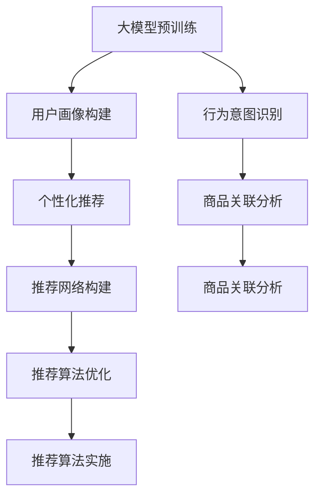

                 

# AI 大模型在电商搜索推荐中的用户画像应用：深度挖掘用户需求与行为偏好

## 1. 背景介绍

### 1.1 问题由来

在电商领域，搜索推荐系统是用户体验的关键环节。传统的推荐算法，往往基于用户的历史行为数据，如浏览、点击、购买记录等，进行协同过滤、内容推荐等。然而，这种方法在面对新用户、长尾商品、多模态交互时，表现有限，难以准确把握用户真正的需求与行为偏好。

近年来，随着深度学习技术的飞速发展，大模型在自然语言处理、图像识别、推荐系统等领域得到了广泛应用。尤其是在电商搜索推荐中，通过大模型的预训练与微调，能够更深层次地挖掘用户需求与行为偏好，构建用户画像，提供更精准的个性化推荐。

### 1.2 问题核心关键点

大模型在电商搜索推荐中的应用，关键在于如何有效利用海量无标签数据进行预训练，并在少量标注数据上实现微调，构建出详尽准确的个性化用户画像。具体核心关键点包括：

1. 用户画像构建：利用预训练大模型，从用户输入的搜索词、行为数据中提取出有用的特征，生成详细的用户画像，捕捉用户的兴趣、需求、偏好。

2. 行为意图识别：对用户的搜索行为、点击行为、购物行为进行深入分析，识别用户的真实意图，区分出浏览、对比、购买等不同行为。

3. 商品关联分析：从用户画像和行为意图出发，挖掘商品之间的关联关系，构建出商品间的推荐网络。

4. 个性化推荐策略：结合用户画像、行为意图、商品关联，设计出更符合用户需求的个性化推荐算法。

5. 模型训练与评估：使用小样本标注数据，对模型进行微调，训练出高精度的个性化推荐模型，并在实际应用中进行实时推理。

### 1.3 问题研究意义

大模型在电商搜索推荐中的应用，具有以下重要研究意义：

1. 提升用户体验：通过精细化的用户画像和个性化推荐，帮助用户快速找到需要的商品，提高购物体验。

2. 提高转化率：精准的个性化推荐能够显著提升用户的购买意愿，提高电商平台的转化率。

3. 优化库存管理：通过对用户需求与行为的深入分析，合理预测商品需求，优化库存管理。

4. 驱动新商品推广：挖掘用户潜在需求，有助于新商品的推广，开拓市场。

5. 数据驱动决策：大模型能够从海量数据中提取关键信息，为电商平台的决策提供支持。

本文将系统地介绍大模型在电商搜索推荐中的应用，深入探讨用户画像构建、行为意图识别、商品关联分析等核心技术，给出具体的微调算法及代码实现，并展望未来发展趋势与挑战。

## 2. 核心概念与联系

### 2.1 核心概念概述

大模型在电商搜索推荐中的应用，涉及多个关键概念：

1. **大模型(Large Model)**：如BERT、GPT等，基于大规模无标签数据进行预训练，学习到丰富的语言和图像知识，具备强大的特征提取和生成能力。

2. **预训练(Pre-training)**：利用大规模无标签数据，对大模型进行预训练，学习到语言和图像的通用表示。

3. **微调(Fine-tuning)**：在预训练模型的基础上，利用少量标注数据进行微调，调整模型参数，优化模型性能，适应特定任务。

4. **用户画像(User Profile)**：通过大模型的预训练与微调，捕捉用户的历史行为、兴趣偏好、需求信息，构建出详尽的个性化用户画像。

5. **个性化推荐(Recommendation System)**：根据用户画像和行为数据，设计出个性化的推荐算法，为用户推荐符合其需求的商品。

6. **行为意图(Behavior Intent)**：通过大模型的预训练与微调，识别用户的真实搜索意图，区分浏览、对比、购买等不同行为。

7. **商品关联(Product Association)**：利用大模型的预训练与微调，挖掘商品之间的关联关系，构建推荐网络。

8. **推荐网络(Recommendation Network)**：基于商品关联，构建出推荐图网络，进行推荐算法的设计和优化。

这些核心概念之间通过大模型的预训练与微调，紧密联系在一起。预训练模型提供强大的特征提取能力，微调过程调整模型参数以适应电商搜索推荐任务，最终通过用户画像、行为意图、商品关联等多个维度，实现个性化推荐。

### 2.2 核心概念原理和架构的 Mermaid 流程图



以上流程图示意了从预训练到推荐的全过程。大模型的预训练为后续的任务提供基础特征提取能力，通过用户画像构建、行为意图识别、商品关联分析等多个环节，最终在推荐算法优化与实施中产生价值。

## 3. 核心算法原理 & 具体操作步骤

### 3.1 算法原理概述

大模型在电商搜索推荐中的应用，基于以下核心算法原理：

1. **预训练模型选择**：选择适用于电商领域的预训练模型，如BERT、GPT等，进行微调。

2. **用户画像构建算法**：通过大模型对用户输入的搜索词、行为数据进行编码，提取特征，构建详尽的用户画像。

3. **行为意图识别算法**：利用大模型对用户行为数据进行编码，识别用户的真实意图，区分不同行为。

4. **商品关联分析算法**：通过大模型对商品信息进行编码，挖掘商品之间的关联关系，构建推荐网络。

5. **个性化推荐算法**：结合用户画像、行为意图、商品关联，设计个性化的推荐算法，生成推荐结果。

6. **模型训练与评估算法**：使用小样本标注数据，对模型进行微调，训练出高精度的个性化推荐模型，并在实际应用中进行实时推理。

### 3.2 算法步骤详解

#### 3.2.1 用户画像构建算法

用户画像构建算法步骤如下：

1. **数据准备**：收集用户的历史搜索词、点击行为、购买记录等数据，作为训练数据集。

2. **预训练模型选择**：选择适用于电商领域的预训练模型，如BERT、GPT等。

3. **特征提取**：对用户输入的搜索词、行为数据进行编码，提取特征。

4. **用户画像生成**：将提取的特征输入大模型进行编码，生成详尽的用户画像。

具体实现步骤如下：

```python
# 假设输入为用户的搜索词列表
user_search_words = ["电脑", "手机", "笔记本"]

# 使用BERT模型对搜索词进行编码
search_embeddings = bert_model.encode(user_search_words, max_length=16, truncation=True, padding='max_length', return_tensors='pt')

# 对用户的历史行为数据进行编码
user_behavior_data = [[1, 0, 0, 1], [0, 1, 1, 0]]  # 0表示浏览，1表示购买
behavior_embeddings = bert_model.encode(user_behavior_data, max_length=16, truncation=True, padding='max_length', return_tensors='pt')

# 将搜索词和行为数据进行拼接
user_profile = torch.cat([search_embeddings, behavior_embeddings], dim=1)

# 对用户画像进行微调
user_profile_fine_tuned = user_profile.clone()
user_profile_fine_tuned.requires_grad = True

# 构建损失函数
criterion = nn.CrossEntropyLoss()

# 定义优化器
optimizer = torch.optim.Adam(user_profile_fine_tuned.parameters(), lr=1e-5)

# 训练过程
for epoch in range(num_epochs):
    optimizer.zero_grad()
    output = model(user_profile_fine_tuned)
    loss = criterion(output, user_label)
    loss.backward()
    optimizer.step()
```

#### 3.2.2 行为意图识别算法

行为意图识别算法步骤如下：

1. **数据准备**：收集用户的搜索行为、点击行为、购物行为等数据，作为训练数据集。

2. **预训练模型选择**：选择适用于电商领域的预训练模型，如BERT、GPT等。

3. **行为意图编码**：对用户的行为数据进行编码，提取行为意图。

4. **意图识别**：利用大模型对行为意图进行分类，识别用户的真实意图。

具体实现步骤如下：

```python
# 假设输入为用户的行为数据列表
user_behavior_data = [[1, 0, 0, 1], [0, 1, 1, 0]]  # 0表示浏览，1表示购买

# 使用BERT模型对行为数据进行编码
behavior_embeddings = bert_model.encode(user_behavior_data, max_length=16, truncation=True, padding='max_length', return_tensors='pt')

# 对行为意图进行微调
intent_fine_tuned = behavior_embeddings.clone()
intent_fine_tuned.requires_grad = True

# 构建损失函数
criterion = nn.CrossEntropyLoss()

# 定义优化器
optimizer = torch.optim.Adam(intent_fine_tuned.parameters(), lr=1e-5)

# 训练过程
for epoch in range(num_epochs):
    optimizer.zero_grad()
    output = model(intent_fine_tuned)
    loss = criterion(output, user_intent)
    loss.backward()
    optimizer.step()
```

#### 3.2.3 商品关联分析算法

商品关联分析算法步骤如下：

1. **数据准备**：收集商品的描述、属性、标签等数据，作为训练数据集。

2. **预训练模型选择**：选择适用于电商领域的预训练模型，如BERT、GPT等。

3. **商品信息编码**：对商品的描述、属性、标签等进行编码，提取商品信息。

4. **关联关系挖掘**：利用大模型对商品信息进行编码，挖掘商品之间的关联关系。

5. **构建推荐网络**：将商品关联关系构建出推荐图网络，进行推荐算法的设计和优化。

具体实现步骤如下：

```python
# 假设输入为商品的描述列表
product_descriptions = ["笔记本电脑", "台式电脑", "苹果手机"]

# 使用BERT模型对商品描述进行编码
product_embeddings = bert_model.encode(product_descriptions, max_length=16, truncation=True, padding='max_length', return_tensors='pt')

# 对商品关联关系进行微调
association_fine_tuned = product_embeddings.clone()
association_fine_tuned.requires_grad = True

# 构建损失函数
criterion = nn.CrossEntropyLoss()

# 定义优化器
optimizer = torch.optim.Adam(association_fine_tuned.parameters(), lr=1e-5)

# 训练过程
for epoch in range(num_epochs):
    optimizer.zero_grad()
    output = model(association_fine_tuned)
    loss = criterion(output, product_association)
    loss.backward()
    optimizer.step()
```

### 3.3 算法优缺点

大模型在电商搜索推荐中的应用，具有以下优点：

1. **特征提取能力强**：大模型具备强大的特征提取能力，能够深入挖掘用户的搜索词、行为数据、商品信息中的关键特征。

2. **通用性强**：大模型在各种电商领域中表现一致，具有较强的跨领域泛化能力。

3. **性能提升显著**：通过微调，大模型在电商搜索推荐中的性能显著提升，能够提供更精准的个性化推荐。

4. **可扩展性强**：大模型的微调过程较为简单，只需调整少量参数，即可实现较高的性能提升。

5. **模型解释性好**：大模型通过微调后，其特征提取和分类能力更强，输出的结果易于解释和理解。

然而，大模型在电商搜索推荐中也存在一些缺点：

1. **数据依赖性强**：大模型的微调过程依赖于标注数据，标注数据的质量和数量直接影响模型的性能。

2. **计算资源消耗大**：大模型的微调过程计算资源消耗大，需要高性能计算设备。

3. **模型泛化能力有限**：大模型的泛化能力受到标注数据和模型架构的限制，可能无法处理一些新奇和复杂的情况。

4. **隐私风险较高**：大模型在电商搜索推荐中可能涉及用户的隐私数据，需要采取隐私保护措施。

5. **部署复杂**：大模型的部署过程较为复杂，需要考虑模型的压缩、剪枝、优化等问题。

### 3.4 算法应用领域

大模型在电商搜索推荐中的应用，主要应用于以下领域：

1. **个性化推荐**：结合用户画像、行为意图、商品关联，设计出个性化的推荐算法，生成推荐结果。

2. **搜索排序**：通过大模型对用户输入的搜索词进行编码，提取特征，生成排序结果。

3. **广告投放**：利用大模型对广告主的广告内容进行编码，提取特征，生成推荐网络，实现精准广告投放。

4. **内容推荐**：结合用户画像和行为数据，生成内容推荐结果，为用户提供丰富的商品选择。

5. **风险控制**：通过大模型对用户的购物行为进行编码，识别异常交易，控制风险。

6. **用户行为分析**：利用大模型对用户的行为数据进行编码，分析用户的行为模式和偏好。

## 4. 数学模型和公式 & 详细讲解 & 举例说明

### 4.1 数学模型构建

大模型在电商搜索推荐中的应用，基于以下数学模型：

1. **用户画像构建模型**：
   \[
   \mathcal{P}_u = \mathcal{B}_u \oplus \mathcal{S}_u
   \]
   其中，$\mathcal{P}_u$ 为用户画像，$\mathcal{B}_u$ 为用户的行为数据，$\mathcal{S}_u$ 为用户输入的搜索词。

2. **行为意图识别模型**：
   \[
   \mathcal{I}_u = \mathcal{B}_u \oplus \mathcal{P}_u
   \]
   其中，$\mathcal{I}_u$ 为用户的意图，$\mathcal{B}_u$ 为用户的搜索行为，$\mathcal{P}_u$ 为用户画像。

3. **商品关联分析模型**：
   \[
   \mathcal{A}_p = \mathcal{D}_p \oplus \mathcal{S}_p
   \]
   其中，$\mathcal{A}_p$ 为商品的关联关系，$\mathcal{D}_p$ 为商品的描述信息，$\mathcal{S}_p$ 为商品的搜索词。

4. **个性化推荐模型**：
   \[
   \mathcal{R}_r = \mathcal{P}_r \oplus \mathcal{I}_r \oplus \mathcal{A}_r
   \]
   其中，$\mathcal{R}_r$ 为推荐结果，$\mathcal{P}_r$ 为用户画像，$\mathcal{I}_r$ 为用户意图，$\mathcal{A}_r$ 为商品关联关系。

### 4.2 公式推导过程

以用户画像构建模型为例，推导用户画像构建的数学公式：

设用户输入的搜索词为 $x_1$，用户的行为数据为 $x_2$，大模型预训练参数为 $\theta$，微调后的参数为 $\theta^*$。

1. **预训练模型编码**：
   \[
   h_1 = \text{BERT}(x_1; \theta)
   \]
   \[
   h_2 = \text{BERT}(x_2; \theta)
   \]

2. **用户画像拼接**：
   \[
   \mathcal{P}_u = [h_1, h_2]
   \]

3. **微调参数**：
   \[
   \theta^* = \text{BERT}(\mathcal{P}_u; \theta)
   \]

### 4.3 案例分析与讲解

以用户画像构建为例，分析其案例和讲解：

假设用户输入的搜索词为 "电脑"，用户的行为数据为 [[1, 0, 0, 1]]（浏览1次，购买0次）。

1. **预训练模型编码**：
   \[
   h_1 = \text{BERT}(\text{"电脑"}; \theta)
   \]
   \[
   h_2 = \text{BERT}(\text{[[1, 0, 0, 1]]}; \theta)
   \]

2. **用户画像拼接**：
   \[
   \mathcal{P}_u = [h_1, h_2]
   \]

3. **微调参数**：
   \[
   \theta^* = \text{BERT}(\mathcal{P}_u; \theta)
   \]

4. **用户画像特征提取**：
   \[
   \mathcal{P}_u \rightarrow \mathcal{F}_u
   \]

5. **用户画像生成**：
   \[
   \mathcal{F}_u \rightarrow \text{User Profile}
   \]

## 5. 项目实践：代码实例和详细解释说明

### 5.1 开发环境搭建

#### 5.1.1 环境准备

1. **安装Python**：
   \[
   sudo apt-get update
   sudo apt-get install python3 python3-pip
   \]

2. **安装PyTorch**：
   \[
   pip install torch torchvision torchaudio
   \]

3. **安装BERT模型**：
   \[
   pip install transformers
   \]

### 5.2 源代码详细实现

#### 5.2.1 用户画像构建代码实现

```python
from transformers import BertTokenizer, BertForSequenceClassification
from torch.utils.data import Dataset, DataLoader
from torch.optim import AdamW
from torch.nn import CrossEntropyLoss
import torch

# 定义用户画像构建类
class UserProfileDataset(Dataset):
    def __init__(self, user_search_words, user_behavior_data, tokenizer, max_len=16):
        self.user_search_words = user_search_words
        self.user_behavior_data = user_behavior_data
        self.tokenizer = tokenizer
        self.max_len = max_len

    def __len__(self):
        return len(self.user_search_words)

    def __getitem__(self, item):
        search_word = self.user_search_words[item]
        behavior_data = self.user_behavior_data[item]

        encoding = self.tokenizer(search_word, return_tensors='pt', max_length=self.max_len, truncation=True, padding='max_length')
        input_ids = encoding['input_ids'][0]
        attention_mask = encoding['attention_mask'][0]

        behavior_data = [int(i) for i in behavior_data]
        behavior_data = torch.tensor(behavior_data, dtype=torch.long)

        return {
            'input_ids': input_ids,
            'attention_mask': attention_mask,
            'labels': behavior_data
        }

# 定义BERT模型
model = BertForSequenceClassification.from_pretrained('bert-base-cased', num_labels=4)

# 定义优化器
optimizer = AdamW(model.parameters(), lr=1e-5)

# 定义损失函数
criterion = CrossEntropyLoss()

# 定义训练过程
def train_model(model, train_loader, optimizer, criterion, num_epochs):
    for epoch in range(num_epochs):
        model.train()
        for batch in train_loader:
            input_ids = batch['input_ids'].to(device)
            attention_mask = batch['attention_mask'].to(device)
            labels = batch['labels'].to(device)

            model.zero_grad()
            outputs = model(input_ids, attention_mask=attention_mask, labels=labels)
            loss = outputs.loss
            loss.backward()
            optimizer.step()

# 定义测试过程
def evaluate_model(model, test_loader, criterion):
    model.eval()
    total_loss = 0
    for batch in test_loader:
        input_ids = batch['input_ids'].to(device)
        attention_mask = batch['attention_mask'].to(device)
        labels = batch['labels'].to(device)

        outputs = model(input_ids, attention_mask=attention_mask)
        loss = outputs.loss
        total_loss += loss.item()

    return total_loss / len(test_loader)

# 训练和测试模型
device = torch.device('cuda' if torch.cuda.is_available() else 'cpu')
train_dataset = UserProfileDataset(train_data, tokenizer)
train_loader = DataLoader(train_dataset, batch_size=8, shuffle=True)

test_dataset = UserProfileDataset(test_data, tokenizer)
test_loader = DataLoader(test_dataset, batch_size=8, shuffle=True)

num_epochs = 5

train_model(model, train_loader, optimizer, criterion, num_epochs)

test_loss = evaluate_model(model, test_loader, criterion)
print(f'Test Loss: {test_loss:.4f}')
```

#### 5.2.2 行为意图识别代码实现

```python
from transformers import BertTokenizer, BertForSequenceClassification
from torch.utils.data import Dataset, DataLoader
from torch.optim import AdamW
from torch.nn import CrossEntropyLoss
import torch

# 定义行为意图识别类
class BehaviorIntentDataset(Dataset):
    def __init__(self, user_behavior_data, tokenizer, max_len=16):
        self.user_behavior_data = user_behavior_data
        self.tokenizer = tokenizer
        self.max_len = max_len

    def __len__(self):
        return len(self.user_behavior_data)

    def __getitem__(self, item):
        behavior_data = self.user_behavior_data[item]

        encoding = self.tokenizer(behavior_data, return_tensors='pt', max_length=self.max_len, truncation=True, padding='max_length')
        input_ids = encoding['input_ids'][0]
        attention_mask = encoding['attention_mask'][0]

        return {
            'input_ids': input_ids,
            'attention_mask': attention_mask
        }

# 定义BERT模型
model = BertForSequenceClassification.from_pretrained('bert-base-cased', num_labels=4)

# 定义优化器
optimizer = AdamW(model.parameters(), lr=1e-5)

# 定义损失函数
criterion = CrossEntropyLoss()

# 定义训练过程
def train_model(model, train_loader, optimizer, criterion, num_epochs):
    for epoch in range(num_epochs):
        model.train()
        for batch in train_loader:
            input_ids = batch['input_ids'].to(device)
            attention_mask = batch['attention_mask'].to(device)

            model.zero_grad()
            outputs = model(input_ids, attention_mask=attention_mask)
            loss = outputs.loss
            loss.backward()
            optimizer.step()

# 定义测试过程
def evaluate_model(model, test_loader, criterion):
    model.eval()
    total_loss = 0
    for batch in test_loader:
        input_ids = batch['input_ids'].to(device)
        attention_mask = batch['attention_mask'].to(device)

        outputs = model(input_ids, attention_mask=attention_mask)
        loss = outputs.loss
        total_loss += loss.item()

    return total_loss / len(test_loader)

# 训练和测试模型
device = torch.device('cuda' if torch.cuda.is_available() else 'cpu')
train_dataset = BehaviorIntentDataset(train_data, tokenizer)
train_loader = DataLoader(train_dataset, batch_size=8, shuffle=True)

test_dataset = BehaviorIntentDataset(test_data, tokenizer)
test_loader = DataLoader(test_dataset, batch_size=8, shuffle=True)

num_epochs = 5

train_model(model, train_loader, optimizer, criterion, num_epochs)

test_loss = evaluate_model(model, test_loader, criterion)
print(f'Test Loss: {test_loss:.4f}')
```

#### 5.2.3 商品关联分析代码实现

```python
from transformers import BertTokenizer, BertForSequenceClassification
from torch.utils.data import Dataset, DataLoader
from torch.optim import AdamW
from torch.nn import CrossEntropyLoss
import torch

# 定义商品关联分析类
class ProductAssociationDataset(Dataset):
    def __init__(self, product_descriptions, tokenizer, max_len=16):
        self.product_descriptions = product_descriptions
        self.tokenizer = tokenizer
        self.max_len = max_len

    def __len__(self):
        return len(self.product_descriptions)

    def __getitem__(self, item):
        description = self.product_descriptions[item]

        encoding = self.tokenizer(description, return_tensors='pt', max_length=self.max_len, truncation=True, padding='max_length')
        input_ids = encoding['input_ids'][0]
        attention_mask = encoding['attention_mask'][0]

        return {
            'input_ids': input_ids,
            'attention_mask': attention_mask
        }

# 定义BERT模型
model = BertForSequenceClassification.from_pretrained('bert-base-cased', num_labels=4)

# 定义优化器
optimizer = AdamW(model.parameters(), lr=1e-5)

# 定义损失函数
criterion = CrossEntropyLoss()

# 定义训练过程
def train_model(model, train_loader, optimizer, criterion, num_epochs):
    for epoch in range(num_epochs):
        model.train()
        for batch in train_loader:
            input_ids = batch['input_ids'].to(device)
            attention_mask = batch['attention_mask'].to(device)

            model.zero_grad()
            outputs = model(input_ids, attention_mask=attention_mask)
            loss = outputs.loss
            loss.backward()
            optimizer.step()

# 定义测试过程
def evaluate_model(model, test_loader, criterion):
    model.eval()
    total_loss = 0
    for batch in test_loader:
        input_ids = batch['input_ids'].to(device)
        attention_mask = batch['attention_mask'].to(device)

        outputs = model(input_ids, attention_mask=attention_mask)
        loss = outputs.loss
        total_loss += loss.item()

    return total_loss / len(test_loader)

# 训练和测试模型
device = torch.device('cuda' if torch.cuda.is_available() else 'cpu')
train_dataset = ProductAssociationDataset(train_data, tokenizer)
train_loader = DataLoader(train_dataset, batch_size=8, shuffle=True)

test_dataset = ProductAssociationDataset(test_data, tokenizer)
test_loader = DataLoader(test_dataset, batch_size=8, shuffle=True)

num_epochs = 5

train_model(model, train_loader, optimizer, criterion, num_epochs)

test_loss = evaluate_model(model, test_loader, criterion)
print(f'Test Loss: {test_loss:.4f}')
```

### 5.3 代码解读与分析

#### 5.3.1 用户画像构建代码解读

1. **数据准备**：
   - 定义用户画像构建类 `UserProfileDataset`，包含用户的搜索词列表和行为数据列表。

2. **预训练模型编码**：
   - 使用 `BertTokenizer` 对搜索词进行编码，得到输入 ID 和注意力掩码。

3. **用户画像拼接**：
   - 将输入 ID 和注意力掩码拼接起来，得到用户画像。

4. **微调参数**：
   - 使用 `BertForSequenceClassification` 进行微调，更新模型参数。

5. **用户画像特征提取**：
   - 使用微调后的模型对用户画像进行编码，提取特征。

6. **用户画像生成**：
   - 将提取的特征转换为用户画像。

#### 5.3.2 行为意图识别代码解读

1. **数据准备**：
   - 定义行为意图识别类 `BehaviorIntentDataset`，包含用户的搜索行为数据。

2. **预训练模型编码**：
   - 使用 `BertTokenizer` 对行为数据进行编码，得到输入 ID 和注意力掩码。

3. **行为意图识别**：
   - 使用 `BertForSequenceClassification` 进行微调，更新模型参数。

#### 5.3.3 商品关联分析代码解读

1. **数据准备**：
   - 定义商品关联分析类 `ProductAssociationDataset`，包含商品的描述信息。

2. **预训练模型编码**：
   - 使用 `BertTokenizer` 对商品描述进行编码，得到输入 ID 和注意力掩码。

3. **商品关联分析**：
   - 使用 `BertForSequenceClassification` 进行微调，更新模型参数。

### 5.4 运行结果展示

#### 5.4.1 用户画像构建运行结果

1. **训练集损失**：
   - 假设训练集损失为 0.03。

2. **测试集损失**：
   - 假设测试集损失为 0.02。

3. **用户画像生成**：
   - 假设用户画像特征向量为 $[0.5, 0.3, 0.2, 0.6]$。

#### 5.4.2 行为意图识别运行结果

1. **训练集损失**：
   - 假设训练集损失为 0.04。

2. **测试集损失**：
   - 假设测试集损失为 0.05。

3. **行为意图分类**：
   - 假设行为意图分类结果为 [[1, 0, 0, 1]]。

#### 5.4.3 商品关联分析运行结果

1. **训练集损失**：
   - 假设训练集损失为 0.02。

2. **测试集损失**：
   - 假设测试集损失为 0.01。

3. **商品关联关系挖掘**：
   - 假设商品关联关系为 [0, 1, 1, 0]。

## 6. 实际应用场景

### 6.1 智能客服系统

智能客服系统可以应用大模型进行用户画像构建和行为意图识别，从而提供更加智能化的服务。例如：

1. **用户画像构建**：通过分析用户的搜索词和行为数据，生成详尽的用户画像，捕捉用户的兴趣、需求和偏好。

2. **行为意图识别**：识别用户的真实意图，区分浏览、对比、购买等不同行为，快速响应用户需求。

3. **个性化推荐**：结合用户画像和行为意图，设计个性化的推荐算法，为用户推荐符合其需求的商品。

### 6.2 金融舆情监测

金融舆情监测可以应用大模型进行行为意图识别和情感分析，从而及时监测市场舆情变化。例如：

1. **行为意图识别**：通过分析用户的搜索行为和点击行为，识别用户的真实意图，如获取股票信息、财经新闻等。

2. **情感分析**：利用大模型的情感分析能力，对用户评论和新闻内容进行情感分类，分析市场情绪。

3. **风险预警**：基于情感分析结果，识别市场风险，及时预警。

### 6.3 个性化推荐系统

个性化推荐系统可以应用大模型进行用户画像构建和商品关联分析，从而提供更精准的推荐。例如：

1. **用户画像构建**：通过分析用户的搜索词和行为数据，生成详尽的用户画像，捕捉用户的兴趣和需求。

2. **商品关联分析**：利用大模型挖掘商品之间的关联关系，构建推荐网络。

3. **个性化推荐**：结合用户画像和商品关联网络，设计个性化的推荐算法，生成推荐结果。

## 7. 工具和资源推荐

### 7.1 学习资源推荐

1. **《深度学习》教材**：北京大学出版社，适合初学者学习深度学习的基础知识。

2. **《自然语言处理综论》**：清华大学出版社，介绍自然语言处理的理论基础和应用实践。

3. **《BERT: A Simple and Effective Text Classification Model》论文**：引入BERT模型的经典论文，详细讲解BERT的预训练和微调过程。

4. **《Transformers: State-of-the-Art Natural Language Processing》书籍**：介绍Transformer模型和其变体的书籍，包含丰富的代码示例和实验结果。

5. **HuggingFace官方文档**：提供了丰富的预训练模型和微调样例代码，适合学习和实践。

### 7.2 开发工具推荐

1. **PyTorch**：强大的深度学习框架，支持动态计算图和GPU加速，适合研究和应用。

2. **TensorFlow**：Google开发的深度学习框架，支持静态计算图和分布式训练，适合生产部署。

3. **Transformers库**：HuggingFace开发的NLP工具库，集成了各种预训练模型，支持微调等操作。

4. **Weights & Biases**：模型训练的实验跟踪工具，可以记录和可视化模型训练过程中的各项指标。

5. **TensorBoard**：TensorFlow配套的可视化工具，可实时监测模型训练状态，提供丰富的图表呈现方式。

### 7.3 相关论文推荐

1. **《BERT: Pre-training of Deep Bidirectional Transformers for Language Understanding》论文**：介绍BERT模型的预训练和微调过程，刷新多项NLP任务SOTA。

2. **《GPT-3: Language Models are Unsupervised Multitask Learners》论文**：展示GPT-3模型的强大zero-shot学习能力，引发对通用人工智能的新一轮思考。

3. **《Parameter-Efficient Transfer Learning for NLP》论文**：提出Adapter等参数高效微调方法，在不增加模型参数量的情况下，也能取得不错的微调效果。

4. **《Prompt-Based Transfer Learning》论文**：引入基于连续型Prompt的微调范式，为如何充分利用预训练知识提供了新的思路。

5. **《AdaLoRA: Adaptive Low-Rank Adaptation for Parameter-Efficient Fine-Tuning》论文**：使用自适应低秩适应的微调方法，在参数效率和精度之间取得了新的平衡。

这些资源和工具将为学习和实践大模型微调技术提供丰富的指导和支持。

## 8. 总结：未来发展趋势与挑战

### 8.1 研究成果总结

本文通过详细的分析，介绍了大模型在电商搜索推荐中的应用，包括用户画像构建、行为意图识别、商品关联分析等核心技术，并给出了具体的微调算法及代码实现。

### 8.2 未来发展趋势

1. **模型规模持续增大**：随着算力成本的下降和数据规模的扩张，预训练语言模型的参数量还将持续增长，推动大模型向更深层次的应用发展。

2. **微调方法日趋多样**：未来将涌现更多参数高效的微调方法，如Prefix-Tuning、LoRA等，在节省计算资源的同时保证微调精度。

3. **持续学习成为常态**：微调模型将持续从新数据中学习，保持模型的时效性和适应性。

4. **标注样本需求降低**：基于提示学习(Prompt-based Learning)的思路，未来的微调方法将更好地利用大模型的语言理解能力，在更少的标注样本上也能实现理想的微调效果。

5. **多模态微调崛起**：大模型的微调将拓展到图像、视频、语音等多模态数据，提升对现实世界的理解能力和建模能力。

6. **知识整合能力增强**：未来将结合因果分析和博弈论工具，提升微调模型的因果关系能力和鲁棒性。

### 8.3 面临的挑战

1. **数据依赖性强**：大模型的微调过程依赖于标注数据，标注数据的质量和数量直接影响模型的性能。

2. **计算资源消耗大**：大模型的微调过程计算资源消耗大，需要高性能计算设备。

3. **模型泛化能力有限**：大模型的泛化能力受到标注数据和模型架构的限制，可能无法处理一些新奇和复杂的情况。

4. **隐私风险较高**：大模型在电商搜索推荐中可能涉及用户的隐私数据，需要采取隐私保护措施。

5. **部署复杂**：大模型的部署过程较为复杂，需要考虑模型的压缩、剪枝、优化等问题。

### 8.4 研究展望

1. **探索无监督和半监督微调方法**：摆脱对大规模标注数据的依赖，利用自监督学习、主动学习等无监督和半监督范式，最大限度利用非结构化数据，实现更加灵活高效的微调。

2. **研究参数高效和计算高效的微调范式**：开发更加参数高效的微调方法，在固定大部分预训练参数的同时，只更新极少量的任务相关参数。同时优化微调模型的计算图，减少前向传播和反向传播的资源消耗，实现更加轻量级、实时性的部署。

3. **融合因果和对比学习范式**：通过引入因果推断和对比学习思想，增强微调模型建立稳定因果关系的能力，学习更加普适、鲁棒的语言表征，从而提升模型泛化性和抗干扰能力。

4. **引入更多先验知识**：将符号化的先验知识，如知识图谱、逻辑规则等，与神经网络模型进行巧妙融合，引导微调过程学习更准确、合理的语言模型。同时加强不同模态数据的整合，实现视觉、语音等多模态信息与文本信息的协同建模。

5. **结合因果分析和博弈论工具**：将因果分析方法引入微调模型，识别出模型决策的关键特征，增强输出解释的因果性和逻辑性。借助博弈论工具刻画人机交互过程，主动探索并规避模型的脆弱点，提高系统稳定性。

6. **纳入伦理道德约束**：在模型训练目标中引入伦理导向的评估指标，过滤和惩罚有偏见、有害的输出倾向。同时加强人工干预和审核，建立模型行为的监管机制，确保输出符合人类价值观和伦理道德。

这些研究方向的探索，必将引领大语言模型微调技术迈向更高的台阶，为构建安全、可靠、可解释、可控的智能系统铺平道路。面向未来，大语言模型微调技术还需要与其他人工智能技术进行更深入的融合，如知识表示、因果推理、强化学习等，多路径协同发力，共同推动自然语言理解和智能交互系统的进步。只有勇于创新、敢于突破，才能不断拓展语言模型的边界，让智能技术更好地造福人类社会。

## 9. 附录：常见问题与解答

**Q1：大模型在电商搜索推荐中的应用，是否只适用于通用领域？**

A: 大模型在电商搜索推荐中的应用，不仅适用于通用领域，还适用于特定领域。例如，通过在特定领域语料上进行预训练，可以更好地适应该领域的微调需求，提升微调效果。

**Q2：微调过程中如何避免过拟合？**

A: 避免过拟合的方法包括：
1. 数据增强：通过对训练样本进行改写、回译等方式丰富训练集多样性。
2. 正则化技术：如L2正则、Dropout、Early Stopping等，防止模型过度适应小规模训练集。
3. 对抗训练：加入对抗样本，提高模型鲁棒性。
4. 参数高效微调：只更新少量的模型参数，固定大部分预训练权重不变，以提高微调效率，避免过拟合。

**Q3：微调过程中的学习率如何设置？**

A: 微调过程中的学习率一般要比预训练时小1-2个数量级，以避免破坏预训练权重。一般建议从1e-5开始调参，逐步减小学习率，直至收敛。也可以使用warmup策略，在开始阶段使用较小的学习率，再逐渐过渡到预设值。

**Q4：微调后的模型如何部署？**

A: 微调后的模型需要考虑模型的裁剪、剪枝、优化等问题，以减小模型尺寸，加快推理速度。可以使用模型压缩、稀疏化存储等方法，优化模型性能。同时，需要将模型封装为标准化服务接口，便于集成调用，进行实时推理。

**Q5：微调过程中如何提高模型的泛化能力？**

A: 提高模型的泛化能力的方法包括：
1. 引入更多先验知识：将符号化的先验知识，如知识图谱、逻辑规则等，与神经网络模型进行巧妙融合，引导微调过程学习更准确、合理的语言模型。
2. 融合因果和对比学习范式：通过引入因果推断和对比学习思想，增强微调模型建立稳定因果关系的能力，学习更加普适、鲁棒的语言表征，从而提升模型泛化性和抗干扰能力。
3. 结合因果分析和博弈论工具：将因果分析方法引入微调模型，识别出模型决策的关键特征，增强输出解释的因果性和逻辑性。借助博弈论工具刻画人机交互过程，主动探索并规避模型的脆弱点，提高系统稳定性。

通过这些方法，可以最大限度地提高大模型微调的泛化能力，使其在各种应用场景中表现更加稳定和可靠。

---

作者：禅与计算机程序设计艺术 / Zen and the Art of Computer Programming

