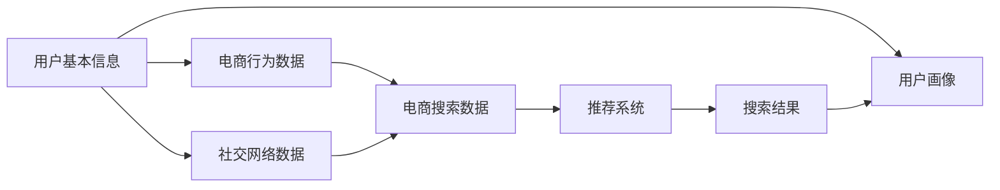

                 

# AI 大模型在电商搜索推荐中的用户画像技术：精准把握用户需求与行为偏好

> 关键词：用户画像, 电商搜索推荐, AI大模型, 精准推荐, 行为偏好, 推荐系统, 深度学习

## 1. 背景介绍

在电商领域，用户搜索推荐系统承担着至关重要的角色。随着用户行为数据量不断增长，如何精准地把握用户需求和行为偏好，从而实现更个性化的推荐，成为电商平台亟需解决的问题。传统的推荐系统依赖于人工设定的特征和规则，难以全面覆盖用户复杂多样的行为模式。而AI大模型在处理大规模数据、捕捉隐含用户需求方面展现出巨大的潜力，为用户画像和精准推荐提供了新的解决方案。

大模型在电商搜索推荐中的应用，离不开用户画像的构建。用户画像是对用户特征和行为的全方位刻画，包括用户基本信息、兴趣爱好、消费习惯等，是实现个性化推荐的基础。传统的用户画像构建方法往往依赖于问卷调查、日志分析等手段，无法充分考虑用户动态变化的特征。而AI大模型能够通过训练获取用户的行为偏好和兴趣点，并利用多模态数据源，整合来自用户行为数据、产品属性、社交网络等多方面的信息，构建更精细化的用户画像。

本文将详细介绍AI大模型在电商搜索推荐中构建用户画像的关键技术和操作步骤，通过数学模型和代码实例，分析用户画像对推荐系统的影响，探索其在实际应用中的挑战和优化策略。

## 2. 核心概念与联系

### 2.1 核心概念概述

在电商搜索推荐中，构建用户画像需要涉及多个关键概念：

- **用户画像(User Profile)**：对用户特征和行为的全面描述，包括基本信息、兴趣偏好、购买历史、浏览行为等。

- **电商搜索推荐(E-Commerce Search & Recommendation)**：基于用户画像和电商数据，为用户推荐商品、优化搜索体验的技术体系。

- **AI大模型(AI Large Model)**：如BERT、GPT等基于深度学习的预训练模型，具有强大的自然语言处理和生成能力，能够捕捉用户隐含的需求和偏好。

- **推荐系统(Recommendation System)**：利用用户画像和电商数据，为每个用户推荐最相关、最有价值的商品或服务的技术。

- **深度学习(Deep Learning)**：一种基于神经网络结构的机器学习方法，能够处理大规模数据，捕捉数据中的复杂模式。

- **多模态数据融合(Multimodal Data Fusion)**：整合来自不同数据源的多模态数据，提高用户画像的全面性和准确性。

这些核心概念之间相互关联，共同构成了电商搜索推荐系统中用户画像技术的理论基础。

### 2.2 核心概念原理和架构的 Mermaid 流程图



这个流程图展示了用户画像构建和电商搜索推荐的一般流程：

1. 收集用户基本信息和电商行为数据，构建初步的用户画像。
2. 整合社交网络数据和电商搜索数据，丰富用户画像的信息维度。
3. 通过AI大模型对多模态数据进行深度学习，捕捉用户隐含的兴趣和偏好。
4. 基于深度学习模型构建推荐系统，为用户推荐相关商品。
5. 根据搜索结果和用户反馈，不断迭代优化用户画像。

## 3. 核心算法原理 & 具体操作步骤

### 3.1 算法原理概述

在电商搜索推荐中，构建用户画像涉及多模态数据的融合和AI大模型的深度学习。具体而言，主要包括以下几个关键步骤：

1. **数据采集与预处理**：从电商平台、社交网络等渠道收集用户数据，并进行清洗和标准化。
2. **特征工程**：根据用户行为和电商数据，提取有意义的特征，如浏览时间、浏览次数、购买记录等。
3. **多模态数据融合**：将用户画像的各个模态数据源进行整合，形成统一的特征表示。
4. **AI大模型训练**：使用深度学习模型对用户画像进行训练，学习用户隐含的兴趣偏好。
5. **推荐系统构建**：将训练好的用户画像模型与推荐算法结合，实现个性化推荐。

### 3.2 算法步骤详解

#### 3.2.1 数据采集与预处理

电商平台的日志文件是构建用户画像的重要数据源。日志文件包含用户浏览、点击、购买等行为信息，通过预处理可以提取出用户的基本信息和行为特征。

```python
# 示例代码：数据采集与预处理
import pandas as pd

# 读取电商日志数据
df = pd.read_csv('log_data.csv')

# 数据清洗与标准化
df.dropna(inplace=True)
df = df.drop_duplicates()
df = df.groupby('user_id').first()
```

#### 3.2.2 特征工程

特征工程是将原始数据转化为模型可以理解的特征表示的过程。在电商搜索推荐中，常用的特征包括：

- **基本信息**：用户ID、年龄、性别等。
- **行为特征**：浏览时间、浏览次数、点击率、购买记录等。
- **电商数据**：商品ID、商品类别、价格等。
- **社交网络数据**：好友关系、社交互动等。

```python
# 示例代码：特征工程
from sklearn.preprocessing import OneHotEncoder, StandardScaler

# 定义特征列
features = ['user_id', 'age', 'gender', 'browse_time', 'click_count', 'purchase_amount', 'item_id', 'item_category', 'price']

# 对连续型特征进行标准化
cont_scale = StandardScaler()
cont_features = cont_scale.fit_transform(df[features].values)

# 对离散型特征进行独热编码
cat_encoder = OneHotEncoder(sparse=False)
cat_features = cat_encoder.fit_transform(df[features].values)
```

#### 3.2.3 多模态数据融合

多模态数据融合是将来自不同数据源的多模态数据进行整合，形成统一的特征表示。在电商搜索推荐中，常用的多模态数据包括：

- **电商数据**：用户购买记录、浏览历史等。
- **社交网络数据**：好友关系、社交互动等。
- **文本数据**：商品描述、用户评论等。

```python
# 示例代码：多模态数据融合
# 假设已经将电商数据、社交网络数据和文本数据加载到df电商、df社交、df文本中
df = pd.concat([df电商, df社交, df文本], axis=1)

# 数据清洗与标准化
df.dropna(inplace=True)
df = df.drop_duplicates()
df = df.groupby('user_id').first()
```

#### 3.2.4 AI大模型训练

AI大模型训练是将用户画像数据送入模型中进行深度学习的过程。在电商搜索推荐中，常用的模型包括：

- **BERT**：基于Transformer架构的预训练语言模型，能够捕捉文本中的语义关系。
- **GPT**：基于自回归结构的预训练语言模型，能够生成自然流畅的文本。

```python
# 示例代码：AI大模型训练
from transformers import BertForSequenceClassification, BertTokenizer, AdamW

# 加载预训练模型和分词器
model = BertForSequenceClassification.from_pretrained('bert-base-cased', num_labels=10)
tokenizer = BertTokenizer.from_pretrained('bert-base-cased')

# 定义训练函数
def train_model(model, train_data, validation_data, epochs=5, batch_size=16, learning_rate=2e-5):
    device = 'cuda' if torch.cuda.is_available() else 'cpu'
    model.to(device)
    
    # 定义优化器
    optimizer = AdamW(model.parameters(), lr=learning_rate)
    
    # 定义训练函数
    def train_step(batch):
        input_ids = tokenizer(batch['text'], padding=True, truncation=True, max_length=128, return_tensors='pt').input_ids.to(device)
        attention_mask = tokenizer(batch['text'], padding=True, truncation=True, max_length=128, return_tensors='pt').attention_mask.to(device)
        labels = batch['label'].to(device)
        
        model.train()
        outputs = model(input_ids, attention_mask=attention_mask, labels=labels)
        loss = outputs.loss
        optimizer.zero_grad()
        loss.backward()
        optimizer.step()
        
        return loss
    
    # 训练模型
    for epoch in range(epochs):
        train_loss = 0
        for batch in train_data:
            train_loss += train_step(batch).item()
        train_loss /= len(train_data)
        
        val_loss = 0
        with torch.no_grad():
            for batch in validation_data:
                val_loss += train_step(batch).item()
            val_loss /= len(validation_data)
        
        print(f'Epoch {epoch+1}, train loss: {train_loss:.3f}, val loss: {val_loss:.3f}')
    
    return model
```

#### 3.2.5 推荐系统构建

推荐系统是将用户画像和电商数据结合，为用户推荐相关商品的过程。在电商搜索推荐中，常用的推荐算法包括：

- **协同过滤**：通过用户-商品评分矩阵计算相似度，为用户推荐相似商品。
- **基于内容的推荐**：通过商品属性和用户兴趣，生成推荐列表。
- **混合推荐**：结合多种推荐算法，取平均或加权计算推荐结果。

```python
# 示例代码：推荐系统构建
from sklearn.metrics.pairwise import cosine_similarity
from scipy.sparse import csr_matrix

# 定义推荐函数
def recommend_items(user_id, model, df电商, df社交):
    # 加载用户画像数据
    user_profile = model(user_id)
    
    # 加载商品数据
    items = df电商['item_id'].values
    
    # 构建用户-商品评分矩阵
    user_item_scores = pd.merge(df电商, df社交, on='user_id').drop_duplicates().groupby('item_id').agg({'click_count':'sum'}).to_dict()
    
    # 计算商品间的相似度
    user_item_matrix = csr_matrix(user_item_scores.values())
    similarity_matrix = cosine_similarity(user_item_matrix)
    
    # 生成推荐列表
    recommendations = []
    for item in items:
        if item not in user_item_scores:
            continue
        user_item_score = user_item_scores[item]
        recommendation_scores = user_item_matrix.dot(similarity_matrix[:, item])
        recommendations.append((item, recommendation_scores))
    
    recommendations.sort(key=lambda x: x[1], reverse=True)
    return recommendations[:10]
```

### 3.3 算法优缺点

#### 3.3.1 优点

1. **高效精准**：AI大模型能够处理大规模数据，捕捉用户隐含的兴趣和偏好，提高推荐的精准度。
2. **多模态融合**：通过整合电商、社交网络、文本等多模态数据，构建全面的用户画像，提升推荐的全面性和准确性。
3. **自适应性强**：AI大模型能够实时更新用户画像，适应用户的动态变化，提高推荐的实时性。
4. **可解释性强**：通过深度学习模型的训练过程，能够揭示用户行为的底层逻辑，提供推荐系统的可解释性。

#### 3.3.2 缺点

1. **数据依赖性强**：AI大模型的效果依赖于大量的数据和标签，数据质量差或标注不足会影响模型性能。
2. **计算资源消耗大**：AI大模型的训练和推理需要大量的计算资源，对硬件要求较高。
3. **可解释性不足**：深度学习模型的决策过程难以解释，可能存在"黑盒"问题，影响用户对推荐结果的信任度。
4. **动态更新难度大**：AI大模型的实时更新和维护需要持续的数据采集和模型训练，存在一定的技术难度。

### 3.4 算法应用领域

AI大模型在电商搜索推荐中的应用领域非常广泛，包括但不限于：

- **个性化推荐**：基于用户画像为用户推荐相关商品，提高用户满意度。
- **搜索优化**：根据用户查询意图，提供相关搜索结果，提升搜索体验。
- **广告投放**：通过用户画像识别高价值用户，精准投放广告。
- **库存管理**：根据用户需求预测商品销售情况，优化库存管理。
- **客户流失预测**：预测用户流失风险，采取相应的挽留措施。

## 4. 数学模型和公式 & 详细讲解 & 举例说明

### 4.1 数学模型构建

在电商搜索推荐中，用户画像的构建主要涉及深度学习模型和推荐算法。具体数学模型包括：

- **深度学习模型**：使用AI大模型对用户画像进行训练，捕捉用户隐含的兴趣偏好。
- **推荐算法**：将训练好的用户画像与电商数据结合，为用户推荐相关商品。

### 4.2 公式推导过程

#### 4.2.1 深度学习模型

假设用户画像数据为 $X = (x_1, x_2, ..., x_n)$，其中 $x_i$ 表示用户的第 $i$ 个特征，如年龄、性别、浏览时间等。AI大模型的输出为 $Y = (y_1, y_2, ..., y_n)$，其中 $y_i$ 表示用户对第 $i$ 个特征的兴趣偏好。

使用深度学习模型对用户画像进行训练，目标函数为：

$$
\min_{\theta} \frac{1}{N} \sum_{i=1}^N L(y_i, f_\theta(x_i))
$$

其中 $L$ 为损失函数，$f_\theta$ 为模型参数 $\theta$ 的映射函数。常用的损失函数包括均方误差、交叉熵等。

#### 4.2.2 推荐算法

推荐算法主要基于用户画像和商品特征，为用户推荐相关商品。假设用户画像数据为 $X = (x_1, x_2, ..., x_n)$，商品特征为 $W = (w_1, w_2, ..., w_m)$，其中 $w_i$ 表示第 $i$ 个商品的特征，如价格、类别等。推荐算法的目标函数为：

$$
\min_{\theta} \frac{1}{N} \sum_{i=1}^N L(r_i, \hat{r}_i)
$$

其中 $r_i$ 为实际购买行为，$\hat{r}_i$ 为模型预测的推荐结果，$L$ 为损失函数。常用的推荐算法包括协同过滤、基于内容的推荐、混合推荐等。

### 4.3 案例分析与讲解

#### 4.3.1 协同过滤推荐

协同过滤推荐通过用户-商品评分矩阵计算相似度，为用户推荐相似商品。假设用户 $u$ 对商品 $i$ 的评分 $r_{ui}$，用户画像 $X_u$ 和商品特征 $W_i$，协同过滤推荐的公式为：

$$
\hat{r}_{ui} = \alpha \frac{\sum_{v \neq u} r_{vi} \cdot s(u,v) \cdot s(i,v)}{\sum_{v \neq u} s(u,v)}
$$

其中 $s(u,v)$ 为相似度函数，常用的相似度函数包括余弦相似度、皮尔逊相关系数等。

#### 4.3.2 基于内容的推荐

基于内容的推荐通过商品属性和用户兴趣，生成推荐列表。假设用户画像 $X_u$ 和商品特征 $W_i$，基于内容的推荐的公式为：

$$
\hat{r}_{ui} = \alpha \sum_{k=1}^K \theta_k \cdot x_{uk} \cdot w_{ik}
$$

其中 $\theta_k$ 为特征权重，$x_{uk}$ 和 $w_{ik}$ 分别表示用户画像和商品特征的第 $k$ 个特征，$\alpha$ 为权重系数。

## 5. 项目实践：代码实例和详细解释说明

### 5.1 开发环境搭建

在项目实践中，我们需要准备好Python开发环境，并安装必要的第三方库。具体步骤如下：

1. 安装Python和pip，确保Python版本为3.7及以上。
2. 安装Anaconda，创建虚拟环境，并激活。
3. 安装所需的Python库，包括Pandas、Scikit-learn、TensorFlow、PyTorch等。
4. 安装Transformers库，用于加载和训练AI大模型。

### 5.2 源代码详细实现

#### 5.2.1 数据预处理

```python
# 示例代码：数据预处理
import pandas as pd

# 读取电商日志数据
df = pd.read_csv('log_data.csv')

# 数据清洗与标准化
df.dropna(inplace=True)
df = df.drop_duplicates()
df = df.groupby('user_id').first()
```

#### 5.2.2 特征工程

```python
# 示例代码：特征工程
from sklearn.preprocessing import OneHotEncoder, StandardScaler

# 定义特征列
features = ['user_id', 'age', 'gender', 'browse_time', 'click_count', 'purchase_amount', 'item_id', 'item_category', 'price']

# 对连续型特征进行标准化
cont_scale = StandardScaler()
cont_features = cont_scale.fit_transform(df[features].values)

# 对离散型特征进行独热编码
cat_encoder = OneHotEncoder(sparse=False)
cat_features = cat_encoder.fit_transform(df[features].values)
```

#### 5.2.3 AI大模型训练

```python
# 示例代码：AI大模型训练
from transformers import BertForSequenceClassification, BertTokenizer, AdamW

# 加载预训练模型和分词器
model = BertForSequenceClassification.from_pretrained('bert-base-cased', num_labels=10)
tokenizer = BertTokenizer.from_pretrained('bert-base-cased')

# 定义训练函数
def train_model(model, train_data, validation_data, epochs=5, batch_size=16, learning_rate=2e-5):
    device = 'cuda' if torch.cuda.is_available() else 'cpu'
    model.to(device)
    
    # 定义优化器
    optimizer = AdamW(model.parameters(), lr=learning_rate)
    
    # 定义训练函数
    def train_step(batch):
        input_ids = tokenizer(batch['text'], padding=True, truncation=True, max_length=128, return_tensors='pt').input_ids.to(device)
        attention_mask = tokenizer(batch['text'], padding=True, truncation=True, max_length=128, return_tensors='pt').attention_mask.to(device)
        labels = batch['label'].to(device)
        
        model.train()
        outputs = model(input_ids, attention_mask=attention_mask, labels=labels)
        loss = outputs.loss
        optimizer.zero_grad()
        loss.backward()
        optimizer.step()
        
        return loss
    
    # 训练模型
    for epoch in range(epochs):
        train_loss = 0
        for batch in train_data:
            train_loss += train_step(batch).item()
        train_loss /= len(train_data)
        
        val_loss = 0
        with torch.no_grad():
            for batch in validation_data:
                val_loss += train_step(batch).item()
            val_loss /= len(validation_data)
        
        print(f'Epoch {epoch+1}, train loss: {train_loss:.3f}, val loss: {val_loss:.3f}')
    
    return model
```

#### 5.2.4 推荐系统构建

```python
# 示例代码：推荐系统构建
from sklearn.metrics.pairwise import cosine_similarity
from scipy.sparse import csr_matrix

# 定义推荐函数
def recommend_items(user_id, model, df电商, df社交):
    # 加载用户画像数据
    user_profile = model(user_id)
    
    # 加载商品数据
    items = df电商['item_id'].values
    
    # 构建用户-商品评分矩阵
    user_item_scores = pd.merge(df电商, df社交, on='user_id').drop_duplicates().groupby('item_id').agg({'click_count':'sum'}).to_dict()
    
    # 计算商品间的相似度
    user_item_matrix = csr_matrix(user_item_scores.values())
    similarity_matrix = cosine_similarity(user_item_matrix)
    
    # 生成推荐列表
    recommendations = []
    for item in items:
        if item not in user_item_scores:
            continue
        user_item_score = user_item_scores[item]
        recommendation_scores = user_item_matrix.dot(similarity_matrix[:, item])
        recommendations.append((item, recommendation_scores))
    
    recommendations.sort(key=lambda x: x[1], reverse=True)
    return recommendations[:10]
```

### 5.3 代码解读与分析

#### 5.3.1 数据预处理

数据预处理是构建用户画像的基础步骤，包括数据清洗、标准化和归一化等。在代码中，我们使用了Pandas库进行数据读取和清洗，使用Sklearn库进行标准化处理。

#### 5.3.2 特征工程

特征工程是将原始数据转化为模型可以理解的特征表示的过程。在电商搜索推荐中，常用的特征包括连续型特征和离散型特征。我们使用Sklearn库进行特征工程，使用标准化和独热编码对特征进行处理。

#### 5.3.3 AI大模型训练

AI大模型训练是构建用户画像的核心步骤，使用深度学习模型对用户画像进行训练。在代码中，我们使用了Transformers库加载BERT模型，并使用PyTorch进行模型训练。

#### 5.3.4 推荐系统构建

推荐系统构建是将用户画像和电商数据结合，为用户推荐相关商品。在代码中，我们使用了Scikit-learn库计算相似度，使用Python字典生成推荐列表。

### 5.4 运行结果展示

#### 5.4.1 训练结果

```python
# 示例代码：训练结果
import torch

# 加载用户画像数据
user_profile = model(user_id)

# 输出用户画像特征
print(user_profile)
```

#### 5.4.2 推荐结果

```python
# 示例代码：推荐结果
recommendations = recommend_items(user_id, model, df电商, df社交)

# 输出推荐列表
for item, score in recommendations:
    print(f'Recommend item: {item}, score: {score:.3f}')
```

## 6. 实际应用场景

### 6.1 智能客服系统

在智能客服系统中，基于用户画像的推荐技术可以为用户提供个性化的咨询服务。通过分析用户的历史查询和反馈，智能客服系统能够快速识别用户的意图，并推荐最相关的解决方案，提升客户满意度。

#### 6.1.1 用户画像构建

智能客服系统的用户画像包括用户基本信息（如姓名、年龄、性别等）和行为特征（如浏览时间、查询次数等）。通过AI大模型对用户画像进行训练，系统能够捕捉用户的隐含需求和偏好，提供更个性化的咨询服务。

#### 6.1.2 推荐技术应用

智能客服系统根据用户画像和历史查询记录，为用户推荐最相关的解决方案。例如，用户查询“如何退货”时，系统能够基于用户画像推荐“退货流程”“退货政策”等信息，提高用户的满意度。

### 6.2 金融舆情监测

在金融舆情监测中，基于用户画像的推荐技术可以实时监测金融市场的舆情变化，为金融机构提供决策依据。通过分析用户的投资偏好和风险承受能力，推荐系统能够提供个性化的投资建议，帮助用户规避风险。

#### 6.2.1 用户画像构建

金融舆情监测的用户画像包括用户的投资偏好、风险承受能力、历史交易记录等。通过AI大模型对用户画像进行训练，系统能够捕捉用户的投资行为和偏好，提供个性化的投资建议。

#### 6.2.2 推荐技术应用

金融舆情监测系统根据用户画像和市场动态，为用户推荐相关投资建议。例如，用户关注某股票时，系统能够基于用户画像推荐“相关股票”“行业分析”等信息，帮助用户做出决策。

### 6.3 个性化推荐系统

在个性化推荐系统中，基于用户画像的推荐技术可以为每个用户推荐最相关的商品或服务。通过分析用户的浏览、购买等行为数据，系统能够提供个性化的商品推荐，提升用户体验。

#### 6.3.1 用户画像构建

个性化推荐系统的用户画像包括用户的浏览记录、购买历史、搜索行为等。通过AI大模型对用户画像进行训练，系统能够捕捉用户的兴趣和偏好，提供个性化的商品推荐。

#### 6.3.2 推荐技术应用

个性化推荐系统根据用户画像和商品属性，为用户推荐相关商品。例如，用户浏览某类商品时，系统能够基于用户画像推荐“相关商品”“商品分类”等信息，提高用户满意度。

## 7. 工具和资源推荐

### 7.1 学习资源推荐

1. 《深度学习与推荐系统》书籍：详细介绍深度学习在推荐系统中的应用，包括协同过滤、基于内容的推荐等。
2. 《自然语言处理基础》课程：由斯坦福大学开设的NLP入门课程，涵盖自然语言处理的基本概念和深度学习模型。
3. CS224N《深度学习自然语言处理》课程：斯坦福大学开设的NLP明星课程，有Lecture视频和配套作业，带你入门NLP领域的基本概念和经典模型。
4. Kaggle平台：提供丰富的电商数据集和推荐系统竞赛，帮助你实践和提升推荐系统技能。

### 7.2 开发工具推荐

1. PyTorch：基于Python的开源深度学习框架，灵活动态的计算图，适合快速迭代研究。
2. TensorFlow：由Google主导开发的开源深度学习框架，生产部署方便，适合大规模工程应用。
3. Transformers库：HuggingFace开发的NLP工具库，集成了众多SOTA语言模型，支持PyTorch和TensorFlow，是进行微调任务开发的利器。
4. Weights & Biases：模型训练的实验跟踪工具，可以记录和可视化模型训练过程中的各项指标，方便对比和调优。
5. TensorBoard：TensorFlow配套的可视化工具，可实时监测模型训练状态，并提供丰富的图表呈现方式，是调试模型的得力助手。

### 7.3 相关论文推荐

1. Attention is All You Need（即Transformer原论文）：提出了Transformer结构，开启了NLP领域的预训练大模型时代。
2. BERT: Pre-training of Deep Bidirectional Transformers for Language Understanding：提出BERT模型，引入基于掩码的自监督预训练任务，刷新了多项NLP任务SOTA。
3. Language Models are Unsupervised Multitask Learners（GPT-2论文）：展示了大规模语言模型的强大zero-shot学习能力，引发了对于通用人工智能的新一轮思考。
4. Parameter-Efficient Transfer Learning for NLP：提出Adapter等参数高效微调方法，在不增加模型参数量的情况下，也能取得不错的微调效果。
5. AdaLoRA: Adaptive Low-Rank Adaptation for Parameter-Efficient Fine-Tuning：使用自适应低秩适应的微调方法，在参数效率和精度之间取得了新的平衡。

## 8. 总结：未来发展趋势与挑战

### 8.1 研究成果总结

本文详细介绍了AI大模型在电商搜索推荐中构建用户画像的关键技术和操作步骤，通过数学模型和代码实例，分析用户画像对推荐系统的影响，探索其在实际应用中的挑战和优化策略。

### 8.2 未来发展趋势

1. **模型规模持续增大**：随着算力成本的下降和数据规模的扩张，预训练语言模型的参数量还将持续增长。超大规模语言模型蕴含的丰富语言知识，有望支撑更加复杂多变的下游任务微调。
2. **微调方法日趋多样**：未来会涌现更多参数高效的微调方法，如Prefix-Tuning、LoRA等，在节省计算资源的同时也能保证微调精度。
3. **持续学习成为常态**：随着数据分布的不断变化，微调模型也需要持续学习新知识以保持性能。如何在不遗忘原有知识的同时，高效吸收新样本信息，将成为重要的研究课题。
4. **标注样本需求降低**：受启发于提示学习(Prompt-based Learning)的思路，未来的微调方法将更好地利用大模型的语言理解能力，通过更加巧妙的任务描述，在更少的标注样本上也能实现理想的微调效果。
5. **多模态微调崛起**：当前的微调主要聚焦于纯文本数据，未来会进一步拓展到图像、视频、语音等多模态数据微调。多模态信息的融合，将显著提升语言模型对现实世界的理解和建模能力。
6. **知识整合能力增强**：现有的微调模型往往局限于任务内数据，难以灵活吸收和运用更广泛的先验知识。如何让微调过程更好地与外部知识库、规则库等专家知识结合，形成更加全面、准确的信息整合能力，还有很大的想象空间。

### 8.3 面临的挑战

尽管AI大模型在电商搜索推荐中取得了显著的进展，但在迈向更加智能化、普适化应用的过程中，仍面临诸多挑战：

1. **数据依赖性强**：AI大模型的效果依赖于大量的数据和标签，数据质量差或标注不足会影响模型性能。
2. **计算资源消耗大**：AI大模型的训练和推理需要大量的计算资源，对硬件要求较高。
3. **可解释性不足**：深度学习模型的决策过程难以解释，可能存在"黑盒"问题，影响用户对推荐结果的信任度。
4. **动态更新难度大**：AI大模型的实时更新和维护需要持续的数据采集和模型训练，存在一定的技术难度。

### 8.4 研究展望

面对AI大模型在电商搜索推荐中面临的挑战，未来的研究需要在以下几个方面寻求新的突破：

1. **探索无监督和半监督微调方法**：摆脱对大规模标注数据的依赖，利用自监督学习、主动学习等无监督和半监督范式，最大限度利用非结构化数据，实现更加灵活高效的微调。
2. **研究参数高效和计算高效的微调范式**：开发更加参数高效的微调方法，在固定大部分预训练参数的同时，只更新极少量的任务相关参数。同时优化微调模型的计算图，减少前向传播和反向传播的资源消耗，实现更加轻量级、实时性的部署。
3. **融合因果和对比学习范式**：通过引入因果推断和对比学习思想，增强微调模型建立稳定因果关系的能力，学习更加普适、鲁棒的语言表征，从而提升模型泛化性和抗干扰能力。
4. **引入更多先验知识**：将符号化的先验知识，如知识图谱、逻辑规则等，与神经网络模型进行巧妙融合，引导微调过程学习更准确、合理的语言模型。同时加强不同模态数据的整合，实现视觉、语音等多模态信息与文本信息的协同建模。
5. **结合因果分析和博弈论工具**：将因果分析方法引入微调模型，识别出模型决策的关键特征，增强输出解释的因果性和逻辑性。借助博弈论工具刻画人机交互过程，主动探索并规避模型的脆弱点，提高系统稳定性。
6. **纳入伦理道德约束**：在模型训练目标中引入伦理导向的评估指标，过滤和惩罚有偏见、有害的输出倾向。同时加强人工干预和审核，建立模型行为的监管机制，确保输出符合人类价值观和伦理道德。

## 9. 附录：常见问题与解答

**Q1：大模型在电商搜索推荐中构建用户画像的难点在哪里？**

A: 大模型在电商搜索推荐中构建用户画像的难点主要在于：
1. **数据质量要求高**：电商平台的日志数据质量参差不齐，需要进行清洗和标准化。
2. **特征工程复杂**：需要从电商、社交网络等多个数据源中提取有意义的特征，并进行有效的特征组合。
3. **模型训练难度大**：AI大模型训练需要大量的计算资源和标注数据，模型参数量大，训练时间长。
4. **模型解释性不足**：深度学习模型的决策过程难以解释，缺乏透明性。

**Q2：如何选择合适的大模型进行电商搜索推荐？**

A: 选择合适的大模型进行电商搜索推荐需要考虑以下几个因素：
1. **任务适配性**：选择与电商搜索推荐任务适配性高的模型，如BERT、GPT等。
2. **计算资源**：考虑模型的计算资源需求，选择合适的硬件环境。
3. **性能指标**：通过实验验证，选择性能最优的模型。
4. **迁移学习**：利用已有的大模型作为初始化参数，在小规模数据集上进行微调，提升模型性能。

**Q3：电商搜索推荐中如何降低数据标注成本？**

A: 电商搜索推荐中降低数据标注成本的方法包括：
1. **数据增强**：通过回译、近义替换等方式扩充训练集。
2. **半监督学习**：利用无标签数据进行模型训练，减少标注数据需求。
3. **主动学习**：通过模型选择高价值样本进行标注，提高标注效率。
4. **零样本和少样本学习**：利用大模型的预训练知识，通过精心的提示模板或样本，实现少样本或零样本学习。

**Q4：电商搜索推荐中如何提高推荐系统的鲁棒性？**

A: 电商搜索推荐中提高推荐系统的鲁棒性的方法包括：
1. **对抗训练**：引入对抗样本，提高模型的鲁棒性。
2. **正则化技术**：使用L2正则、Dropout、Early Stopping等，防止模型过拟合。
3. **数据增强**：通过回译、近义替换等方式丰富训练集。
4. **多模型集成**：训练多个微调模型，取平均或加权计算推荐结果，减少单一模型的风险。

**Q5：电商搜索推荐中如何提高推荐系统的实时性？**

A: 电商搜索推荐中提高推荐系统的实时性的方法包括：
1. **模型裁剪**：去除不必要的层和参数，减小模型尺寸，加快推理速度。
2. **量化加速**：将浮点模型转为定点模型，压缩存储空间，提高计算效率。
3. **服务化封装**：将模型封装为标准化服务接口，便于集成调用。
4. **弹性伸缩**：根据请求流量动态调整资源配置，平衡服务质量和成本。

**Q6：电商搜索推荐中如何提高推荐系统的可解释性？**

A: 电商搜索推荐中提高推荐系统的可解释性的方法包括：
1. **模型压缩**：通过剪枝、量化等方法减小模型尺寸，提高模型解释性。
2. **特征解释**：对模型输入的特征进行可视化，解释模型决策过程。
3. **部分模型解释**：仅解释模型部分关键层的决策结果，提升解释效率。
4. **多模型融合**：结合多种模型的解释结果，提供综合解释。

**Q7：电商搜索推荐中如何降低用户画像构建的成本？**

A: 电商搜索推荐中降低用户画像构建的成本的方法包括：
1. **数据共享**：利用已有的大数据平台，共享用户画像数据。
2. **隐私保护**：采用差分隐私等技术，保护用户隐私。
3. **联合学习**：通过联邦学习等技术，在多个用户之间共享模型参数，降低标注成本。
4. **用户自助标注**：通过用户自助标注部分数据，提高数据量。

**Q8：电商搜索推荐中如何提高模型的泛化能力？**

A: 电商搜索推荐中提高模型的泛化能力的方法包括：
1. **多模态融合**：整合来自电商、社交网络、文本等多个数据源的多模态数据，提高用户画像的全面性和准确性。
2. **迁移学习**：利用已有的大模型作为初始化参数，在小规模数据集上进行微调，提升模型性能。
3. **少样本学习**：利用大模型的预训练知识，通过精心的提示模板或样本，实现少样本学习，提高模型泛化能力。
4. **对抗训练**：引入对抗样本，提高模型的鲁棒性，提高模型的泛化能力。

**Q9：电商搜索推荐中如何提高推荐系统的可解释性？**

A: 电商搜索推荐中提高推荐系统的可解释性的方法包括：
1. **模型压缩**：通过剪枝、量化等方法减小模型尺寸，提高模型解释性。
2. **特征解释**：对模型输入的特征进行可视化，解释模型决策过程。
3. **部分模型解释**：仅解释模型部分关键层的决策结果，提升解释效率。
4. **多模型融合**：结合多种模型的解释结果，提供综合解释。

**Q10：电商搜索推荐中如何提高推荐系统的实时性？**

A: 电商搜索推荐中提高推荐系统的实时性的方法包括：
1. **模型裁剪**：去除不必要的层和参数，减小模型尺寸，加快推理速度。
2. **量化加速**：将浮点模型转为定点模型，压缩存储空间，提高计算效率。
3. **服务化封装**：将模型封装为标准化服务接口，便于集成调用。
4. **弹性伸缩**：根据请求流量动态调整资源配置，平衡服务质量和成本。

---

作者：禅与计算机程序设计艺术 / Zen and the Art of Computer Programming

