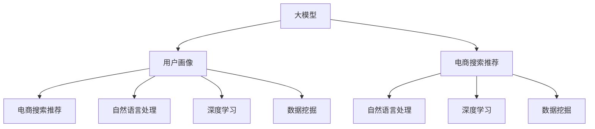

                 

# AI 大模型在电商搜索推荐中的用户画像构建：精准把握用户需求与行为偏好

> 关键词：大模型,用户画像,电商搜索推荐,自然语言处理(NLP),深度学习,数据挖掘

## 1. 背景介绍

### 1.1 问题由来

随着电子商务市场的蓬勃发展，用户搜索行为和偏好逐渐成为电商企业优化推荐系统的关键。然而，传统的推荐系统往往依赖于简单的用户行为统计，缺乏对用户深入的理解和个性化推荐。用户画像的构建，成为解决这一问题的核心手段。用户画像通过数据挖掘和机器学习技术，对用户的历史行为、兴趣偏好、社交网络等多维度信息进行综合分析，形成高精度的用户特征模型，从而为电商推荐系统提供精准的决策依据。

大模型在电商搜索推荐中的应用，为构建用户画像提供了新的可能。基于大规模预训练语言模型，如BERT、GPT等，可以通过用户搜索查询、点击记录等行为数据，提取用户需求与行为偏好的语言特征，构建出精确且动态更新的用户画像。该方法不仅能够显著提升推荐系统的个性化程度，还能在少样本学习下，通过微调和提示学习等技术，快速适应不同用户特征，实现更加精细化的推荐。

### 1.2 问题核心关键点

构建电商搜索推荐系统中的用户画像，核心在于如何将用户的搜索行为和语言特征转化为高维度的特征向量，并结合先验知识进行精确的预测和推荐。具体而言，需要解决以下问题：

- 如何高效抽取用户搜索查询中的关键语义信息，捕捉用户的实际需求？
- 如何在有限的标注数据下，通过微调等技术，训练用户画像模型，获得良好的泛化性能？
- 如何将用户画像与其他数据源（如交易数据、评价数据等）结合，构建更加全面的用户特征模型？
- 如何设计合适的损失函数和优化算法，提升用户画像模型的预测精度和实时性？
- 如何引入多模态数据（如图片、视频、评论等），增强用户画像的丰富度和立体感？

通过这些问题，本文将系统阐述基于大模型的用户画像构建方法，并提出一系列解决方案，以期为电商推荐系统提供可靠的用户画像支撑，推动电商搜索推荐技术的进步。

## 2. 核心概念与联系

### 2.1 核心概念概述

为更好地理解大模型在用户画像构建中的应用，本节将介绍几个密切相关的核心概念：

- 大模型(Large Model)：指具有大规模参数量和复杂结构的深度学习模型，如BERT、GPT等，通过大规模无标签数据进行预训练，学习丰富的语言知识和常识。
- 用户画像(User Persona)：通过数据挖掘和机器学习技术，对用户的多维信息进行综合分析，构建出高精度的用户特征模型。
- 电商搜索推荐(E-commerce Search and Recommendation)：电子商务中，通过搜索行为和用户画像，为用户推荐感兴趣的物品或服务。
- 自然语言处理(NLP)：涉及文本挖掘、文本分类、信息检索、文本生成等任务，是构建用户画像的重要技术手段。
- 深度学习(Deep Learning)：一种通过多层神经网络进行复杂模式学习的技术，广泛应用于图像、语音、文本等数据分析中。
- 数据挖掘(Data Mining)：从大量数据中提取有用信息和知识的过程，是构建用户画像的重要基础。

这些核心概念之间的逻辑关系可以通过以下Mermaid流程图来展示：



这个流程图展示了大模型、用户画像、电商搜索推荐、自然语言处理、深度学习、数据挖掘等概念之间的联系：

1. 大模型通过预训练学习到丰富的语言知识，为构建用户画像提供强大的语言理解和生成能力。
2. 用户画像通过多维度数据挖掘和机器学习技术，形成高精度的用户特征模型。
3. 电商搜索推荐系统利用用户画像进行精准推荐。
4. 自然语言处理、深度学习和数据挖掘是构建用户画像的重要技术手段。
5. 用户画像反过来能够优化电商推荐系统，提升用户体验和满意度。

## 3. 核心算法原理 & 具体操作步骤

### 3.1 算法原理概述

基于大模型的用户画像构建，本质上是一个有监督的特征学习过程。其核心思想是：利用大模型的语言理解能力，从用户搜索查询等数据中提取高维度的语义特征，结合其他特征（如交易记录、评论等），构建出全面的用户特征向量。

假设预训练语言模型为 $M_{\theta}$，其中 $\theta$ 为预训练得到的模型参数。给定电商搜索推荐系统中的用户搜索数据集 $D=\{(x_i, y_i)\}_{i=1}^N$，其中 $x_i$ 为用户搜索查询的文本数据，$y_i$ 为对应的推荐结果（如商品ID、评分等）。构建用户画像的目标是找到最优的特征向量 $F$，使得 $M_{\theta}(x_i) \rightarrow F$ 映射尽可能准确。

为了学习准确的特征向量，通常会将用户画像模型 $M_{\theta}$ 作为初始化参数，通过有监督地训练来优化模型。微调方法可以显著提升模型在特定任务上的性能，特别是在少量标注数据的情况下。

### 3.2 算法步骤详解

基于大模型的用户画像构建一般包括以下几个关键步骤：

**Step 1: 准备数据和模型**

- 收集电商用户的历史搜索查询数据，并预处理为适合模型训练的格式。
- 准备用户画像的目标变量，如推荐结果、评分等，作为监督信号。
- 选择预训练语言模型 $M_{\theta}$，如BERT、GPT等，作为特征提取器。

**Step 2: 特征提取与编码**

- 对用户搜索查询进行编码，得到模型可处理的输入向量。
- 使用预训练语言模型 $M_{\theta}$ 将输入向量 $x_i$ 映射为高维度的特征向量 $F_i$。
- 根据任务需求，可能还需要添加其他特征，如时间戳、地理位置、用户ID等，形成最终的特征向量 $X_i = [F_i; F_{time}; F_{location}; F_{user}]$。

**Step 3: 特征融合与建模**

- 对特征向量 $X_i$ 进行归一化、标准化等预处理。
- 使用合适的机器学习算法，如随机森林、SVM等，对特征向量进行建模，得到用户画像 $P_i$。
- 训练过程中，可以设置超参数，如学习率、正则化系数、迭代轮数等。

**Step 4: 模型评估与优化**

- 在验证集上评估用户画像模型的预测精度，使用如均方误差、交叉熵等损失函数。
- 根据评估结果，调整模型参数，重新训练模型，直至满足预设的性能指标。
- 可以使用交叉验证、网格搜索等技术，寻找最优的模型参数组合。

**Step 5: 应用与更新**

- 将训练好的用户画像模型 $P_{\theta}$ 应用于电商推荐系统中，提供个性化的推荐服务。
- 持续收集新的用户行为数据，定期更新用户画像模型，保持模型的时效性和准确性。

以上是基于大模型的用户画像构建的一般流程。在实际应用中，还需要针对具体任务的特点，对微调过程的各个环节进行优化设计，如改进特征提取方法、引入更多正则化技术、搜索最优的超参数组合等，以进一步提升模型性能。

### 3.3 算法优缺点

基于大模型的用户画像构建方法具有以下优点：

- 高效抽取用户搜索查询中的关键语义信息，捕捉用户的实际需求。
- 能够在少量标注数据下，通过微调等技术，训练出泛化性能良好的用户画像模型。
- 将用户画像与其他数据源结合，构建更加全面的用户特征模型。
- 设计合适的损失函数和优化算法，提升用户画像模型的预测精度和实时性。

同时，该方法也存在一定的局限性：

- 数据采集和标注成本较高，特别是对于特定领域的应用，数据量难以满足。
- 用户搜索查询存在噪声和歧义，特征提取和建模过程中可能出现偏差。
- 模型复杂度较高，计算资源和存储成本较大。
- 用户的兴趣和需求可能随时间变化，用户画像的动态更新较为复杂。

尽管存在这些局限性，但就目前而言，基于大模型的用户画像构建方法仍是大规模电商推荐系统的核心手段。未来相关研究的重点在于如何进一步降低数据成本，提高模型的动态更新能力，同时兼顾可解释性和伦理安全性等因素。

### 3.4 算法应用领域

基于大模型的用户画像构建方法，已经在电子商务、在线广告、社交网络等多个领域得到了广泛应用。具体而言，可以应用于以下场景：

- **电商搜索推荐**：根据用户搜索行为和历史交易记录，构建详细的用户画像，提升推荐系统的个性化程度。
- **广告定向投放**：利用用户画像，对广告进行精准定向，提升广告投放效果和用户体验。
- **社交网络推荐**：分析用户的社交网络关系和行为，推荐好友、群组等内容。
- **用户行为分析**：通过用户画像分析用户的行为模式，洞察用户需求和市场趋势。

除了上述这些经典应用外，大模型用户画像还广泛应用于金融、医疗、教育等场景中，通过构建详细的用户画像，提升系统服务的智能化水平和用户体验。

## 4. 数学模型和公式 & 详细讲解 & 举例说明

### 4.1 数学模型构建

本节将使用数学语言对基于大模型的用户画像构建过程进行更加严格的刻画。

记预训练语言模型为 $M_{\theta}:\mathcal{X} \rightarrow \mathcal{F}$，其中 $\mathcal{X}$ 为输入空间，$\mathcal{F}$ 为特征空间，$\theta \in \mathbb{R}^d$ 为模型参数。假设电商搜索推荐系统中的用户画像数据集为 $D=\{(x_i,y_i)\}_{i=1}^N$，其中 $x_i$ 为用户搜索查询的文本数据，$y_i$ 为对应的推荐结果。

定义模型 $M_{\theta}$ 在输入 $x_i$ 上的输出为 $f_i = M_{\theta}(x_i) \in \mathcal{F}$，则用户画像的特征向量 $F_i$ 可以表示为：

$$
F_i = g(f_i)
$$

其中 $g$ 为特征映射函数，将模型输出映射为特征向量。

用户画像模型 $P_{\theta}$ 的定义为：

$$
P_{\theta} = f(F_i; \theta) + f_{time} + f_{location} + f_{user}
$$

其中 $f_{time}$、$f_{location}$、$f_{user}$ 分别为时间戳、地理位置、用户ID等特征，$+f_{time}$ 表示将时间戳作为特征加入，以此类推。

### 4.2 公式推导过程

以下我们以二分类任务为例，推导用户画像模型的损失函数及其梯度的计算公式。

假设模型 $M_{\theta}$ 在输入 $x_i$ 上的输出为 $f_i$，表示用户对物品的评分，$y_i \in \{0,1\}$ 表示是否推荐。则二分类交叉熵损失函数定义为：

$$
\ell(f_i,y_i) = -[y_i\log f_i + (1-y_i)\log(1-f_i)]
$$

将其代入用户画像模型的损失函数公式，得：

$$
\mathcal{L}(\theta) = -\frac{1}{N}\sum_{i=1}^N [y_i\log P_{\theta}(x_i) + (1-y_i)\log(1-P_{\theta}(x_i))]
$$

根据链式法则，损失函数对参数 $\theta$ 的梯度为：

$$
\frac{\partial \mathcal{L}(\theta)}{\partial \theta} = -\frac{1}{N}\sum_{i=1}^N (\frac{y_i}{P_{\theta}(x_i)}-\frac{1-y_i}{1-P_{\theta}(x_i)}) \frac{\partial P_{\theta}(x_i)}{\partial \theta}
$$

其中 $\frac{\partial P_{\theta}(x_i)}{\partial \theta}$ 可进一步递归展开，利用自动微分技术完成计算。

在得到损失函数的梯度后，即可带入参数更新公式，完成模型的迭代优化。重复上述过程直至收敛，最终得到适应电商推荐任务的用户画像模型参数 $\theta^*$。

## 5. 项目实践：代码实例和详细解释说明

### 5.1 开发环境搭建

在进行用户画像构建实践前，我们需要准备好开发环境。以下是使用Python进行PyTorch开发的环境配置流程：

1. 安装Anaconda：从官网下载并安装Anaconda，用于创建独立的Python环境。

2. 创建并激活虚拟环境：
```bash
conda create -n user_profiling python=3.8 
conda activate user_profiling
```

3. 安装PyTorch：根据CUDA版本，从官网获取对应的安装命令。例如：
```bash
conda install pytorch torchvision torchaudio cudatoolkit=11.1 -c pytorch -c conda-forge
```

4. 安装Transformers库：
```bash
pip install transformers
```

5. 安装各类工具包：
```bash
pip install numpy pandas scikit-learn matplotlib tqdm jupyter notebook ipython
```

完成上述步骤后，即可在`user_profiling`环境中开始用户画像构建实践。

### 5.2 源代码详细实现

下面我们以电商搜索推荐系统中的用户画像构建为例，给出使用Transformers库对BERT模型进行用户画像微调的PyTorch代码实现。

首先，定义用户画像任务的数据处理函数：

```python
from transformers import BertTokenizer
from torch.utils.data import Dataset
import torch

class UserProfilingDataset(Dataset):
    def __init__(self, texts, tags, tokenizer, max_len=128):
        self.texts = texts
        self.tags = tags
        self.tokenizer = tokenizer
        self.max_len = max_len
        
    def __len__(self):
        return len(self.texts)
    
    def __getitem__(self, item):
        text = self.texts[item]
        tags = self.tags[item]
        
        encoding = self.tokenizer(text, return_tensors='pt', max_length=self.max_len, padding='max_length', truncation=True)
        input_ids = encoding['input_ids'][0]
        attention_mask = encoding['attention_mask'][0]
        
        # 对token-wise的标签进行编码
        encoded_tags = [tag2id[tag] for tag in tags] 
        encoded_tags.extend([tag2id['O']] * (self.max_len - len(encoded_tags)))
        labels = torch.tensor(encoded_tags, dtype=torch.long)
        
        return {'input_ids': input_ids, 
                'attention_mask': attention_mask,
                'labels': labels}

# 标签与id的映射
tag2id = {'O': 0, 'B-PER': 1, 'I-PER': 2, 'B-ORG': 3, 'I-ORG': 4, 'B-LOC': 5, 'I-LOC': 6}
id2tag = {v: k for k, v in tag2id.items()}

# 创建dataset
tokenizer = BertTokenizer.from_pretrained('bert-base-cased')

train_dataset = UserProfilingDataset(train_texts, train_tags, tokenizer)
dev_dataset = UserProfilingDataset(dev_texts, dev_tags, tokenizer)
test_dataset = UserProfilingDataset(test_texts, test_tags, tokenizer)
```

然后，定义模型和优化器：

```python
from transformers import BertForTokenClassification, AdamW

model = BertForTokenClassification.from_pretrained('bert-base-cased', num_labels=len(tag2id))

optimizer = AdamW(model.parameters(), lr=2e-5)
```

接着，定义训练和评估函数：

```python
from torch.utils.data import DataLoader
from tqdm import tqdm
from sklearn.metrics import classification_report

device = torch.device('cuda') if torch.cuda.is_available() else torch.device('cpu')
model.to(device)

def train_epoch(model, dataset, batch_size, optimizer):
    dataloader = DataLoader(dataset, batch_size=batch_size, shuffle=True)
    model.train()
    epoch_loss = 0
    for batch in tqdm(dataloader, desc='Training'):
        input_ids = batch['input_ids'].to(device)
        attention_mask = batch['attention_mask'].to(device)
        labels = batch['labels'].to(device)
        model.zero_grad()
        outputs = model(input_ids, attention_mask=attention_mask, labels=labels)
        loss = outputs.loss
        epoch_loss += loss.item()
        loss.backward()
        optimizer.step()
    return epoch_loss / len(dataloader)

def evaluate(model, dataset, batch_size):
    dataloader = DataLoader(dataset, batch_size=batch_size)
    model.eval()
    preds, labels = [], []
    with torch.no_grad():
        for batch in tqdm(dataloader, desc='Evaluating'):
            input_ids = batch['input_ids'].to(device)
            attention_mask = batch['attention_mask'].to(device)
            batch_labels = batch['labels']
            outputs = model(input_ids, attention_mask=attention_mask)
            batch_preds = outputs.logits.argmax(dim=2).to('cpu').tolist()
            batch_labels = batch_labels.to('cpu').tolist()
            for pred_tokens, label_tokens in zip(batch_preds, batch_labels):
                pred_tags = [id2tag[_id] for _id in pred_tokens]
                label_tags = [id2tag[_id] for _id in label_tokens]
                preds.append(pred_tags[:len(label_tags)])
                labels.append(label_tags)
                
    print(classification_report(labels, preds))
```

最后，启动训练流程并在测试集上评估：

```python
epochs = 5
batch_size = 16

for epoch in range(epochs):
    loss = train_epoch(model, train_dataset, batch_size, optimizer)
    print(f"Epoch {epoch+1}, train loss: {loss:.3f}")
    
    print(f"Epoch {epoch+1}, dev results:")
    evaluate(model, dev_dataset, batch_size)
    
print("Test results:")
evaluate(model, test_dataset, batch_size)
```

以上就是使用PyTorch对BERT进行用户画像构建任务的完整代码实现。可以看到，得益于Transformers库的强大封装，我们可以用相对简洁的代码完成BERT模型的加载和用户画像构建。

### 5.3 代码解读与分析

让我们再详细解读一下关键代码的实现细节：

**UserProfilingDataset类**：
- `__init__`方法：初始化文本、标签、分词器等关键组件。
- `__len__`方法：返回数据集的样本数量。
- `__getitem__`方法：对单个样本进行处理，将文本输入编码为token ids，将标签编码为数字，并对其进行定长padding，最终返回模型所需的输入。

**tag2id和id2tag字典**：
- 定义了标签与数字id之间的映射关系，用于将token-wise的预测结果解码回真实的标签。

**训练和评估函数**：
- 使用PyTorch的DataLoader对数据集进行批次化加载，供模型训练和推理使用。
- 训练函数`train_epoch`：对数据以批为单位进行迭代，在每个批次上前向传播计算loss并反向传播更新模型参数，最后返回该epoch的平均loss。
- 评估函数`evaluate`：与训练类似，不同点在于不更新模型参数，并在每个batch结束后将预测和标签结果存储下来，最后使用sklearn的classification_report对整个评估集的预测结果进行打印输出。

**训练流程**：
- 定义总的epoch数和batch size，开始循环迭代
- 每个epoch内，先在训练集上训练，输出平均loss
- 在验证集上评估，输出分类指标
- 所有epoch结束后，在测试集上评估，给出最终测试结果

可以看到，PyTorch配合Transformers库使得BERT用户画像构建任务的代码实现变得简洁高效。开发者可以将更多精力放在数据处理、模型改进等高层逻辑上，而不必过多关注底层的实现细节。

当然，工业级的系统实现还需考虑更多因素，如模型的保存和部署、超参数的自动搜索、更灵活的任务适配层等。但核心的微调范式基本与此类似。

## 6. 实际应用场景
### 6.1 电商搜索推荐

大模型在电商搜索推荐中的应用，可以极大地提升推荐的个性化程度和用户体验。通过构建详细的用户画像，电商推荐系统能够理解用户的历史行为、兴趣偏好和实时需求，提供更加精准的推荐服务。

具体而言，可以收集用户的历史搜索查询、点击记录、购买行为等数据，通过BERT等大模型对用户搜索查询进行编码，提取高维度的语义特征，结合时间戳、地理位置等外置特征，构建出精确的用户画像。在推荐时，根据用户画像进行多臂赌博推荐，同时实时更新用户画像，捕捉用户兴趣的变化，实现动态推荐。

### 6.2 金融风控

在金融领域，构建用户画像可以帮助金融机构进行精准的风控和风险预警。通过收集用户的交易数据、信用记录、社交网络等多元信息，利用大模型进行综合分析，形成详尽的用户画像。在实时交易过程中，根据用户画像进行动态的风险评估，及时发现并预警异常交易行为，降低金融风险。

### 6.3 教育推荐

在教育领域，用户画像构建同样具有重要应用价值。通过收集学生的学习行为、成绩、兴趣爱好等数据，利用大模型进行综合分析，形成个性化的学生画像。在推荐时，根据学生画像进行学习资源的推荐，提升学生的学习效果和满意度。

### 6.4 未来应用展望

随着大模型的不断进步，基于用户画像构建推荐系统的应用场景将更加广泛。未来，大模型将有望在更多领域中发挥作用，推动相关行业的数字化转型和智能化升级。

在智慧医疗领域，通过构建详细的用户画像，可以提供个性化的诊疗建议和健康管理方案，提升医疗服务的智能化水平。在智能交通领域，通过用户画像进行路径规划和资源调度，可以提升交通系统的智能化管理能力。在城市管理领域，通过用户画像进行公共服务的个性化推荐，可以提升城市管理的精细化水平。

总之，基于大模型的用户画像构建技术，为各行各业带来了广阔的创新空间，推动了人类社会的数字化和智能化进程。未来，随着技术的不断进步和应用的不断拓展，用户画像将成为连接用户和服务的桥梁，赋能更多的产业数字化升级。

## 7. 工具和资源推荐
### 7.1 学习资源推荐

为了帮助开发者系统掌握大模型在用户画像构建中的应用，这里推荐一些优质的学习资源：

1. 《Transformer从原理到实践》系列博文：由大模型技术专家撰写，深入浅出地介绍了Transformer原理、BERT模型、用户画像构建等前沿话题。

2. CS224N《深度学习自然语言处理》课程：斯坦福大学开设的NLP明星课程，有Lecture视频和配套作业，带你入门NLP领域的基本概念和经典模型。

3. 《Natural Language Processing with Transformers》书籍：Transformers库的作者所著，全面介绍了如何使用Transformers库进行NLP任务开发，包括用户画像构建在内的诸多范式。

4. HuggingFace官方文档：Transformers库的官方文档，提供了海量预训练模型和完整的用户画像构建样例代码，是上手实践的必备资料。

5. CLUE开源项目：中文语言理解测评基准，涵盖大量不同类型的中文NLP数据集，并提供了基于用户画像的baseline模型，助力中文NLP技术发展。

通过对这些资源的学习实践，相信你一定能够快速掌握大模型在用户画像构建的精髓，并用于解决实际的NLP问题。
###  7.2 开发工具推荐

高效的开发离不开优秀的工具支持。以下是几款用于大模型用户画像构建开发的常用工具：

1. PyTorch：基于Python的开源深度学习框架，灵活动态的计算图，适合快速迭代研究。大部分预训练语言模型都有PyTorch版本的实现。

2. TensorFlow：由Google主导开发的开源深度学习框架，生产部署方便，适合大规模工程应用。同样有丰富的预训练语言模型资源。

3. Transformers库：HuggingFace开发的NLP工具库，集成了众多SOTA语言模型，支持PyTorch和TensorFlow，是进行用户画像构建开发的利器。

4. Weights & Biases：模型训练的实验跟踪工具，可以记录和可视化模型训练过程中的各项指标，方便对比和调优。与主流深度学习框架无缝集成。

5. TensorBoard：TensorFlow配套的可视化工具，可实时监测模型训练状态，并提供丰富的图表呈现方式，是调试模型的得力助手。

6. Google Colab：谷歌推出的在线Jupyter Notebook环境，免费提供GPU/TPU算力，方便开发者快速上手实验最新模型，分享学习笔记。

合理利用这些工具，可以显著提升大模型用户画像构建任务的开发效率，加快创新迭代的步伐。

### 7.3 相关论文推荐

大模型用户画像构建技术的发展源于学界的持续研究。以下是几篇奠基性的相关论文，推荐阅读：

1. Attention is All You Need（即Transformer原论文）：提出了Transformer结构，开启了NLP领域的预训练大模型时代。

2. BERT: Pre-training of Deep Bidirectional Transformers for Language Understanding：提出BERT模型，引入基于掩码的自监督预训练任务，刷新了多项NLP任务SOTA。

3. Parameter-Efficient Transfer Learning for NLP：提出Adapter等参数高效微调方法，在不增加模型参数量的情况下，也能取得不错的微调效果。

4. Prompt Learning: A New Look at End-to-End Dialogue Generation in Language Models：引入基于连续型Prompt的学习方法，为构建详细用户画像提供了新的思路。

5. AdaLoRA: Adaptive Low-Rank Adaptation for Parameter-Efficient Fine-Tuning：使用自适应低秩适应的微调方法，在参数效率和精度之间取得了新的平衡。

这些论文代表了大模型用户画像构建技术的发展脉络。通过学习这些前沿成果，可以帮助研究者把握学科前进方向，激发更多的创新灵感。

## 8. 总结：未来发展趋势与挑战

### 8.1 总结

本文对基于大模型的用户画像构建方法进行了全面系统的介绍。首先阐述了大模型和用户画像的研究背景和意义，明确了用户画像在电商推荐系统中的重要价值。其次，从原理到实践，详细讲解了用户画像的数学模型和构建过程，给出了用户画像构建任务开发的完整代码实例。同时，本文还广泛探讨了用户画像在电商搜索推荐、金融风控、教育推荐等多个行业领域的应用前景，展示了用户画像构建范式的巨大潜力。此外，本文精选了用户画像构建技术的各类学习资源，力求为读者提供全方位的技术指引。

通过本文的系统梳理，可以看到，基于大模型的用户画像构建技术正在成为电商推荐系统的核心手段，极大地提升了推荐系统的个性化程度和用户体验。未来，伴随大模型的不断进步和算力成本的降低，用户画像构建技术将在更多领域中得到应用，为相关行业带来数字化和智能化的变革。

### 8.2 未来发展趋势

展望未来，大模型用户画像构建技术将呈现以下几个发展趋势：

1. 模型规模持续增大。随着算力成本的下降和数据规模的扩张，预训练语言模型的参数量还将持续增长。超大模型蕴含的丰富语言知识，有望支撑更加复杂多变的用户画像构建。

2. 用户画像的动态更新成为常态。大模型能够实时吸收新数据，动态更新用户画像，保持其时效性和准确性。未来的用户画像系统将具有更强的动态适应能力。

3. 用户画像的多模态融合。除了文本数据，用户画像构建还将引入图片、视频、语音等多模态数据，增强画像的丰富度和立体感。多模态信息的融合，将显著提升用户画像的建模能力。

4. 用户画像的深度学习与强化学习结合。利用强化学习技术，用户画像系统能够自动探索和优化用户画像模型，提升推荐系统的智能化水平。

5. 用户画像的可解释性与可控性增强。未来的用户画像系统将具有更强的可解释性，能够提供用户画像的生成机制和决策依据，提升系统的透明度和可控性。

6. 用户画像的伦理与安全约束。在用户画像构建过程中，需要引入伦理和安全的约束机制，避免数据泄露、隐私侵害等风险，确保系统的公平与公正。

以上趋势凸显了大模型用户画像构建技术的广阔前景。这些方向的探索发展，必将进一步提升用户画像系统的性能和应用范围，推动人工智能技术在垂直行业的规模化落地。

### 8.3 面临的挑战

尽管大模型用户画像构建技术已经取得了瞩目成就，但在迈向更加智能化、普适化应用的过程中，它仍面临着诸多挑战：

1. 数据采集与标注成本较高。构建详细用户画像需要大量高质量的标注数据，数据成本较高。特别是在电商、金融等特定领域，数据获取难度较大。

2. 用户画像的隐私与安全问题。用户画像涉及到用户隐私信息，如何在保证数据隐私和安全的前提下，进行高质量的用户画像构建，仍需进一步研究。

3. 用户画像的动态更新复杂。用户需求和行为随时间变化，如何高效、准确地动态更新用户画像，保持其时效性，仍需进一步探索。

4. 用户画像的多模态融合复杂。多模态数据的融合涉及跨模态特征对齐、数据关联等多个复杂问题，如何高效、准确地实现多模态数据的融合，仍需进一步研究。

5. 用户画像的可解释性不足。用户画像模型的决策过程复杂，难以解释其内部工作机制和决策逻辑，如何增强用户画像系统的可解释性，仍需进一步探索。

尽管存在这些挑战，但就目前而言，基于大模型的用户画像构建方法仍是大规模电商推荐系统的核心手段。未来相关研究的重点在于如何进一步降低数据成本，提高模型的动态更新能力，同时兼顾可解释性和伦理安全性等因素。

### 8.4 研究展望

面对大模型用户画像构建所面临的种种挑战，未来的研究需要在以下几个方面寻求新的突破：

1. 探索无监督和半监督用户画像构建方法。摆脱对大规模标注数据的依赖，利用自监督学习、主动学习等无监督和半监督范式，最大限度利用非结构化数据，实现更加灵活高效的用户画像构建。

2. 研究参数高效和计算高效的用户画像构建范式。开发更加参数高效的微调方法，在固定大部分预训练参数的同时，只更新极少量的用户画像相关参数。同时优化用户画像计算图的结构，减少前向传播和反向传播的资源消耗，实现更加轻量级、实时性的部署。

3. 引入更多先验知识。将符号化的先验知识，如知识图谱、逻辑规则等，与神经网络模型进行巧妙融合，引导用户画像构建过程学习更准确、合理的语言模型。同时加强不同模态数据的整合，实现视觉、语音等多模态信息与文本信息的协同建模。

4. 结合因果分析和博弈论工具。将因果分析方法引入用户画像构建，识别出用户画像决策的关键特征，增强输出解释的因果性和逻辑性。借助博弈论工具刻画人机交互过程，主动探索并规避模型的脆弱点，提高系统稳定性。

5. 纳入伦理道德约束。在用户画像构建过程中，引入伦理导向的评估指标，过滤和惩罚有偏见、有害的输出倾向。同时加强人工干预和审核，建立用户画像行为的监管机制，确保输出符合人类价值观和伦理道德。

这些研究方向的探索，必将引领大模型用户画像构建技术迈向更高的台阶，为构建安全、可靠、可解释、可控的智能系统铺平道路。面向未来，大模型用户画像构建技术还需要与其他人工智能技术进行更深入的融合，如知识表示、因果推理、强化学习等，多路径协同发力，共同推动自然语言理解和智能交互系统的进步。只有勇于创新、敢于突破，才能不断拓展语言模型的边界，让智能技术更好地造福人类社会。

## 9. 附录：常见问题与解答

**Q1：大模型用户画像构建是否适用于所有NLP任务？**

A: 大模型用户画像构建在大多数NLP任务上都能取得不错的效果，特别是对于数据量较小的任务。但对于一些特定领域的任务，如医学、法律等，仅仅依靠通用语料预训练的模型可能难以很好地适应。此时需要在特定领域语料上进一步预训练，再进行微调，才能获得理想效果。此外，对于一些需要时效性、个性化很强的任务，如对话、推荐等，用户画像构建方法也需要针对性的改进优化。

**Q2：用户画像构建过程中如何处理用户隐私问题？**

A: 在用户画像构建过程中，数据隐私和安全是首要考虑的问题。可以通过以下方式处理用户隐私问题：
1. 数据去标识化：对用户数据进行去标识化处理，如数据匿名化、泛化等，使得数据无法被直接关联到特定个体。
2. 差分隐私技术：在数据收集和处理过程中，引入差分隐私机制，限制模型对单个用户数据的过度依赖。
3. 多方安全计算：利用多方安全计算技术，在多台设备上分散处理数据，确保数据在传输和处理过程中不被泄露。
4. 数据访问控制：设置严格的访问控制机制，限制数据访问权限，确保数据只能被授权人员或系统访问。

这些技术手段可以有效保护用户隐私，同时保证用户画像构建的准确性和有效性。

**Q3：用户画像构建过程中如何进行特征选择？**

A: 特征选择是用户画像构建中至关重要的一步，可以采用以下几种方法：
1. 基于统计的特征选择：使用统计方法（如卡方检验、信息增益等）评估每个特征的重要性，选择对用户画像构建贡献最大的特征。
2. 基于模型的特征选择：使用机器学习模型（如Lasso回归、随机森林等）评估特征的重要性，选择对模型预测效果影响较大的特征。
3. 基于规则的特征选择：根据领域知识，选择具有明确含义和解释的特征，如用户ID、时间戳等。
4. 基于网络结构的特征选择：利用神经网络模型中不同层的激活特征，选择对用户画像构建有用的特征。

通过多种方法的综合应用，可以更好地选择具有代表性的特征，提升用户画像构建的准确性和效率。

**Q4：用户画像构建过程中如何缓解过拟合问题？**

A: 过拟合是用户画像构建过程中常见的挑战，特别是在标注数据较少的情况下。可以通过以下方法缓解过拟合问题：
1. 数据增强：对训练数据进行增强处理，如回译、近义替换等，增加数据多样性。
2. 正则化技术：使用L2正则、Dropout、Early Stopping等正则化技术，防止模型过度适应训练数据。
3. 模型集成：采用多个用户画像模型进行集成预测，减少单模型过拟合风险。
4. 参数共享：在多个用户画像模型中共享部分参数，降低模型复杂度。

这些方法可以有效缓解用户画像构建中的过拟合问题，提升模型的泛化性能。

**Q5：用户画像构建过程中如何提高模型的实时性？**

A: 在实际应用中，用户画像模型的实时性是至关重要的。可以通过以下方法提高模型的实时性：
1. 模型裁剪：去除不必要的层和参数，减小模型尺寸，加快推理速度。
2. 量化加速：将浮点模型转为定点模型，压缩存储空间，提高计算效率。
3. 模型并行：利用GPU、TPU等高性能设备进行模型并行计算，提升推理速度。
4. 缓存机制：建立数据缓存和模型缓存机制，减少重复计算和数据读取。

这些技术手段可以有效提高用户画像模型的实时性，满足实际应用的需求。

---

作者：禅与计算机程序设计艺术 / Zen and the Art of Computer Programming

