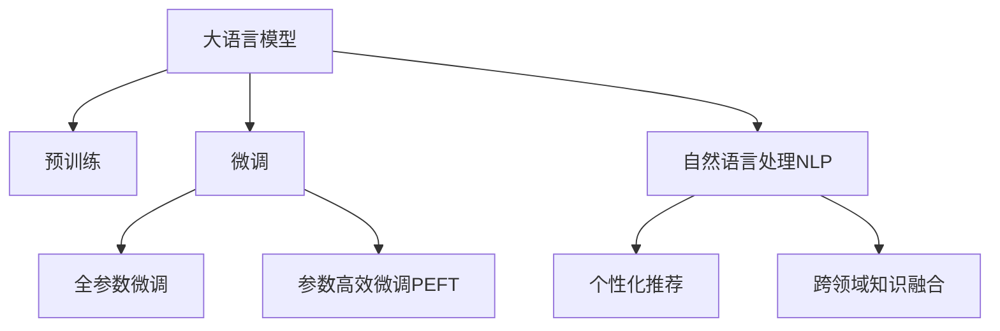

                 

# AI 大模型在电商搜索推荐中的用户行为分析：理解用户需求与购买行为

## 1. 背景介绍

### 1.1 问题由来
随着电商平台的兴起，用户对于搜索推荐系统的依赖度不断提升。传统推荐系统依赖于显式的反馈（如点击、购买等），但这种反馈方式具有延迟性，无法全面反映用户的即时偏好。而搜索推荐系统通过用户输入的文本信息（如搜索关键词、浏览记录等），借助自然语言处理技术分析用户的潜在需求，从而提升推荐的精准度。

近年来，大语言模型在自然语言处理领域取得了突破性进展，其广泛的语言理解和生成能力为电商搜索推荐系统带来了新的可能性。通过预训练大模型进行微调，可以有效提升模型对用户查询语义的准确理解，降低推荐系统对于标签数据的需求，显著提升推荐效果。

### 1.2 问题核心关键点
大语言模型在电商搜索推荐中的应用，核心在于对用户输入文本信息的自然语言理解，从而推断用户意图，进行个性化推荐。主要关键点包括：
- **语言理解与生成**：使用大模型进行意图推断，生成推荐结果。
- **推荐系统优化**：通过微调优化推荐算法，提升推荐准确性。
- **用户行为分析**：利用大模型的生成能力，对用户行为进行全面分析，挖掘用户潜在需求。
- **跨领域知识融合**：整合外部知识库，丰富推荐内容，增强推荐系统的知识深度。

### 1.3 问题研究意义
基于大语言模型的电商搜索推荐系统，具有以下重要意义：
1. **提升推荐效果**：通过理解用户查询意图，生成更精准的推荐结果。
2. **降低标注成本**：减少推荐系统对标签数据的依赖，降低标注和训练成本。
3. **增强个性化推荐**：利用大模型的知识库，实现更深入的用户个性化推荐。
4. **扩展应用场景**：通过自然语言处理能力，拓展搜索推荐系统的应用场景，如智能客服、内容推荐等。
5. **推动产业发展**：为电商、零售、教育等行业提供智能化的解决方案，提升用户体验和运营效率。

## 2. 核心概念与联系

### 2.1 核心概念概述

为更好地理解大语言模型在电商搜索推荐中的应用，本节将介绍几个密切相关的核心概念：

- **大语言模型**：以自回归(如GPT)或自编码(如BERT)模型为代表的大规模预训练语言模型。通过在大规模无标签文本语料上进行预训练，学习通用的语言表示，具备强大的语言理解和生成能力。

- **预训练**：指在大规模无标签文本语料上，通过自监督学习任务训练通用语言模型的过程。常见的预训练任务包括言语建模、遮挡语言模型等。预训练使得模型学习到语言的通用表示。

- **微调**：指在预训练模型的基础上，使用下游任务的少量标注数据，通过有监督学习优化模型在特定任务上的性能。通常只需要调整顶层分类器或解码器，并以较小的学习率更新全部或部分的模型参数。

- **迁移学习**：指将一个领域学习到的知识，迁移应用到另一个不同但相关的领域的学习范式。大模型的预训练-微调过程即是一种典型的迁移学习方式。

- **自然语言处理(NLP)**：涉及计算机如何理解和处理人类语言的技术，包括文本分类、信息抽取、生成文本、问答系统等。大语言模型在NLP中的应用，可以大幅提升处理效率和效果。

- **个性化推荐**：根据用户的历史行为和即时输入，推荐最符合其偏好的产品或内容。大语言模型通过理解用户查询意图，生成个性化的推荐结果。

- **跨领域知识融合**：结合外部知识库和规则库，丰富推荐内容，增强推荐系统的知识深度。

这些核心概念之间的逻辑关系可以通过以下Mermaid流程图来展示：



这个流程图展示了大语言模型的核心概念及其之间的关系：

1. 大语言模型通过预训练获得基础能力。
2. 微调是对预训练模型进行任务特定的优化，可以分为全参数微调和参数高效微调（PEFT）。
3. 自然语言处理通过理解用户输入的文本信息，分析用户需求。
4. 个性化推荐根据用户需求，生成推荐结果。
5. 跨领域知识融合丰富推荐内容，增强推荐系统的深度。

这些概念共同构成了大语言模型在电商搜索推荐系统中的工作原理和优化方向。

## 3. 核心算法原理 & 具体操作步骤

### 3.1 算法原理概述

基于大语言模型在电商搜索推荐中的应用，核心算法原理可以概括为以下几个方面：

- **文本语义理解**：利用大语言模型对用户输入的查询进行语义理解，推断用户意图。
- **推荐结果生成**：根据用户意图，使用大语言模型生成个性化的推荐结果。
- **用户行为分析**：通过分析用户行为数据，进一步优化推荐模型。
- **跨领域知识融合**：整合外部知识库，提升推荐系统的内容丰富度。

形式化地，假设用户输入的查询为 $q$，通过预训练大语言模型 $M_{\theta}$ 进行语义理解，得到用户意图 $i$。在知识库 $\mathcal{K}$ 中查找与用户意图 $i$ 相关的推荐物品 $r$，生成推荐结果 $\hat{r}$。具体算法步骤如下：

1. 使用大语言模型对用户查询 $q$ 进行语义理解，得到用户意图 $i$。
2. 在知识库 $\mathcal{K}$ 中查找与用户意图 $i$ 相关的推荐物品 $r$。
3. 使用大语言模型生成推荐结果 $\hat{r}$。

### 3.2 算法步骤详解

以下是具体的算法步骤和实现流程：

**Step 1: 准备预训练模型和数据集**
- 选择合适的预训练语言模型 $M_{\theta}$，如BERT、GPT等。
- 收集电商平台的搜索查询数据和标注数据集，准备用于微调的训练集、验证集和测试集。

**Step 2: 文本语义理解**
- 对用户输入的查询进行预处理，如分词、去除停用词等。
- 使用大语言模型对预处理后的查询进行编码，得到用户意图 $i$。

**Step 3: 推荐结果生成**
- 根据用户意图 $i$，在知识库 $\mathcal{K}$ 中查找相关的推荐物品 $r$。
- 使用大语言模型生成推荐结果 $\hat{r}$。

**Step 4: 用户行为分析**
- 收集用户的浏览历史、点击行为等数据，进行特征提取和分析。
- 利用大语言模型分析用户行为，挖掘用户偏好。

**Step 5: 跨领域知识融合**
- 整合外部知识库，丰富推荐系统的内容。
- 利用大语言模型进行知识检索和融合，生成更丰富、更符合用户需求的推荐结果。

### 3.3 算法优缺点

基于大语言模型在电商搜索推荐中的应用，具有以下优点：
1. **高效性**：利用大语言模型，可以大幅降低标注数据的需求，提升推荐系统训练和推理的效率。
2. **泛化能力**：大语言模型具备较强的泛化能力，可以处理多种类型的查询和推荐任务。
3. **个性化推荐**：通过语义理解，生成更符合用户需求的个性化推荐结果。
4. **跨领域知识融合**：整合外部知识库，丰富推荐内容，提升推荐系统的深度和广度。

同时，该方法也存在一些局限性：
1. **数据隐私问题**：用户输入的查询可能涉及敏感信息，需要注意隐私保护。
2. **计算资源消耗大**：大语言模型的计算资源消耗较大，需要高性能硬件支持。
3. **理解上下文能力不足**：大语言模型在处理长文本时，可能无法完全理解上下文信息。
4. **知识库更新不及时**：知识库的内容需要定期更新，否则推荐系统可能无法跟上最新的产品变化。

尽管存在这些局限性，但就目前而言，基于大语言模型的电商搜索推荐方法仍是一种高效、精准的推荐手段。未来相关研究的重点在于如何进一步优化模型，提高推荐系统的性能和用户满意度。

### 3.4 算法应用领域

基于大语言模型的电商搜索推荐方法，已经在多个电商平台上得到了应用，涵盖以下领域：

- **商品推荐**：根据用户搜索查询，生成个性化推荐结果。
- **搜索排名**：对搜索结果进行排序，提高用户满意度。
- **客服系统**：利用大语言模型进行自然语言理解，提供智能客服解决方案。
- **内容推荐**：根据用户兴趣，推荐相关文章、视频、音频等内容。
- **市场分析**：分析用户行为数据，提供市场洞察和趋势预测。

除了上述这些典型应用外，大语言模型在电商搜索推荐中的应用还在不断扩展，如智能广告投放、个性化广告生成等，为电商平台的数字化转型提供了新的技术支持。

## 4. 数学模型和公式 & 详细讲解 & 举例说明

### 4.1 数学模型构建

本节将使用数学语言对大语言模型在电商搜索推荐中的应用进行更加严格的刻画。

假设用户输入的查询为 $q$，大语言模型 $M_{\theta}$ 的语义理解结果为 $i$，知识库中与用户意图 $i$ 相关的推荐物品为 $r$，生成推荐结果为 $\hat{r}$。

定义用户输入查询的表示为 $\mathbf{q} \in \mathbb{R}^d$，用户意图表示为 $\mathbf{i} \in \mathbb{R}^d$，推荐物品的表示为 $\mathbf{r} \in \mathbb{R}^d$，推荐结果的表示为 $\mathbf{\hat{r}} \in \mathbb{R}^d$。

假设大语言模型 $M_{\theta}$ 的输出层表示为 $y \in \mathbb{R}^d$，则语义理解任务的目标函数为：

$$
\mathcal{L}_{\text{semi}}(\theta) = \frac{1}{N} \sum_{n=1}^N \mathbb{1}(y_n \neq i_n) \log \sigma(y_n)
$$

其中 $\mathbb{1}$ 为示性函数，$\sigma$ 为sigmoid函数。目标函数表示当模型输出与用户意图不匹配时，增加损失值。

定义推荐结果的表示为 $\mathbf{\hat{r}} = M_{\theta}(\mathbf{r})$，推荐任务的目标函数为：

$$
\mathcal{L}_{\text{rec}}(\theta) = \frac{1}{N} \sum_{n=1}^N \log \sigma(y_n)
$$

其中 $y_n$ 为模型对推荐物品 $r_n$ 的评分。目标函数表示当模型输出与推荐物品匹配时，增加损失值。

### 4.2 公式推导过程

以下是目标函数的详细推导过程：

**语义理解任务**：
- 假设大语言模型的输出为 $\mathbf{y} = M_{\theta}(\mathbf{q})$，表示用户意图的概率分布。
- 定义目标函数为：
$$
\mathcal{L}_{\text{semi}}(\theta) = \frac{1}{N} \sum_{n=1}^N \mathbb{1}(y_n \neq i_n) \log \sigma(y_n)
$$
其中 $\mathbb{1}$ 为示性函数，$\sigma$ 为sigmoid函数。

**推荐任务**：
- 假设推荐物品的表示为 $\mathbf{r} = M_{\theta}(\mathbf{i})$，表示与用户意图相关的推荐物品的表示。
- 假设生成推荐结果的函数为 $\mathbf{\hat{r}} = M_{\theta}(\mathbf{r})$，表示推荐物品的评分。
- 定义目标函数为：
$$
\mathcal{L}_{\text{rec}}(\theta) = \frac{1}{N} \sum_{n=1}^N \log \sigma(\mathbf{\hat{r}}_n)
$$
其中 $\sigma$ 为sigmoid函数，表示推荐物品的评分。

在得到目标函数后，即可带入模型参数 $\theta$ 进行优化。通过梯度下降等优化算法，最小化损失函数，使得模型输出逼近真实标签。

### 4.3 案例分析与讲解

假设电商平台的搜索查询为 "便宜 的运动鞋"，用户意图为 "寻找价格低廉的运动鞋"。知识库中包含三个相关推荐物品：Nike Air Max、Adidas Ultraboost、Puma Clyde。大语言模型对查询进行语义理解，得到用户意图 $i$。根据用户意图，在知识库中查找与用户意图相关的推荐物品 $r$。最后，使用大语言模型生成推荐结果 $\hat{r}$。

具体步骤如下：
1. 对查询 "便宜 的运动鞋" 进行预处理，得到 $\mathbf{q}$。
2. 使用大语言模型对查询进行语义理解，得到 $\mathbf{i}$。
3. 在知识库中查找与用户意图相关的推荐物品，得到 $\mathbf{r}$。
4. 使用大语言模型生成推荐结果，得到 $\mathbf{\hat{r}}$。

## 5. 项目实践：代码实例和详细解释说明

### 5.1 开发环境搭建

在进行大语言模型在电商搜索推荐中的应用实践前，我们需要准备好开发环境。以下是使用Python进行PyTorch开发的环境配置流程：

1. 安装Anaconda：从官网下载并安装Anaconda，用于创建独立的Python环境。

2. 创建并激活虚拟环境：
```bash
conda create -n pytorch-env python=3.8 
conda activate pytorch-env
```

3. 安装PyTorch：根据CUDA版本，从官网获取对应的安装命令。例如：
```bash
conda install pytorch torchvision torchaudio cudatoolkit=11.1 -c pytorch -c conda-forge
```

4. 安装Transformers库：
```bash
pip install transformers
```

5. 安装各类工具包：
```bash
pip install numpy pandas scikit-learn matplotlib tqdm jupyter notebook ipython
```

完成上述步骤后，即可在`pytorch-env`环境中开始大语言模型在电商搜索推荐中的应用实践。

### 5.2 源代码详细实现

下面是使用Transformers库对BERT模型进行电商搜索推荐任务微调的PyTorch代码实现。

首先，定义电商搜索推荐任务的数据处理函数：

```python
from transformers import BertTokenizer
from torch.utils.data import Dataset
import torch

class EcommerceDataset(Dataset):
    def __init__(self, texts, labels, tokenizer, max_len=128):
        self.texts = texts
        self.labels = labels
        self.tokenizer = tokenizer
        self.max_len = max_len
        
    def __len__(self):
        return len(self.texts)
    
    def __getitem__(self, item):
        text = self.texts[item]
        label = self.labels[item]
        
        encoding = self.tokenizer(text, return_tensors='pt', max_length=self.max_len, padding='max_length', truncation=True)
        input_ids = encoding['input_ids'][0]
        attention_mask = encoding['attention_mask'][0]
        
        # 将标签进行编码
        label = torch.tensor(label, dtype=torch.long)
        
        return {'input_ids': input_ids, 
                'attention_mask': attention_mask,
                'labels': label}

# 标签与id的映射
label2id = {'便宜': 0, '贵': 1}
id2label = {v: k for k, v in label2id.items()}

# 创建dataset
tokenizer = BertTokenizer.from_pretrained('bert-base-cased')

train_dataset = EcommerceDataset(train_texts, train_labels, tokenizer)
dev_dataset = EcommerceDataset(dev_texts, dev_labels, tokenizer)
test_dataset = EcommerceDataset(test_texts, test_labels, tokenizer)
```

然后，定义模型和优化器：

```python
from transformers import BertForTokenClassification, AdamW

model = BertForTokenClassification.from_pretrained('bert-base-cased', num_labels=len(label2id))

optimizer = AdamW(model.parameters(), lr=2e-5)
```

接着，定义训练和评估函数：

```python
from torch.utils.data import DataLoader
from tqdm import tqdm
from sklearn.metrics import accuracy_score

device = torch.device('cuda') if torch.cuda.is_available() else torch.device('cpu')
model.to(device)

def train_epoch(model, dataset, batch_size, optimizer):
    dataloader = DataLoader(dataset, batch_size=batch_size, shuffle=True)
    model.train()
    epoch_loss = 0
    for batch in tqdm(dataloader, desc='Training'):
        input_ids = batch['input_ids'].to(device)
        attention_mask = batch['attention_mask'].to(device)
        labels = batch['labels'].to(device)
        model.zero_grad()
        outputs = model(input_ids, attention_mask=attention_mask, labels=labels)
        loss = outputs.loss
        epoch_loss += loss.item()
        loss.backward()
        optimizer.step()
    return epoch_loss / len(dataloader)

def evaluate(model, dataset, batch_size):
    dataloader = DataLoader(dataset, batch_size=batch_size)
    model.eval()
    preds, labels = [], []
    with torch.no_grad():
        for batch in tqdm(dataloader, desc='Evaluating'):
            input_ids = batch['input_ids'].to(device)
            attention_mask = batch['attention_mask'].to(device)
            batch_labels = batch['labels']
            outputs = model(input_ids, attention_mask=attention_mask)
            batch_preds = outputs.logits.argmax(dim=2).to('cpu').tolist()
            batch_labels = batch_labels.to('cpu').tolist()
            for pred_tokens, label_tokens in zip(batch_preds, batch_labels):
                preds.append(pred_tokens[:len(label_tokens)])
                labels.append(label_tokens)
                
    print(f'Accuracy: {accuracy_score(labels, preds):.2f}')
```

最后，启动训练流程并在测试集上评估：

```python
epochs = 5
batch_size = 16

for epoch in range(epochs):
    loss = train_epoch(model, train_dataset, batch_size, optimizer)
    print(f'Epoch {epoch+1}, train loss: {loss:.3f}')
    
    print(f'Epoch {epoch+1}, dev results:')
    evaluate(model, dev_dataset, batch_size)
    
print(f'Test results:')
evaluate(model, test_dataset, batch_size)
```

以上就是使用PyTorch对BERT进行电商搜索推荐任务微调的完整代码实现。可以看到，得益于Transformers库的强大封装，我们可以用相对简洁的代码完成BERT模型的加载和微调。

### 5.3 代码解读与分析

让我们再详细解读一下关键代码的实现细节：

**EcommerceDataset类**：
- `__init__`方法：初始化文本、标签、分词器等关键组件。
- `__len__`方法：返回数据集的样本数量。
- `__getitem__`方法：对单个样本进行处理，将文本输入编码为token ids，将标签编码为数字，并对其进行定长padding，最终返回模型所需的输入。

**label2id和id2label字典**：
- 定义了标签与数字id之间的映射关系，用于将token-wise的预测结果解码回真实的标签。

**训练和评估函数**：
- 使用PyTorch的DataLoader对数据集进行批次化加载，供模型训练和推理使用。
- 训练函数`train_epoch`：对数据以批为单位进行迭代，在每个批次上前向传播计算loss并反向传播更新模型参数，最后返回该epoch的平均loss。
- 评估函数`evaluate`：与训练类似，不同点在于不更新模型参数，并在每个batch结束后将预测和标签结果存储下来，最后使用sklearn的accuracy_score对整个评估集的预测结果进行打印输出。

**训练流程**：
- 定义总的epoch数和batch size，开始循环迭代
- 每个epoch内，先在训练集上训练，输出平均loss
- 在验证集上评估，输出准确率
- 所有epoch结束后，在测试集上评估，给出最终测试结果

可以看到，PyTorch配合Transformers库使得BERT微调的代码实现变得简洁高效。开发者可以将更多精力放在数据处理、模型改进等高层逻辑上，而不必过多关注底层的实现细节。

当然，工业级的系统实现还需考虑更多因素，如模型的保存和部署、超参数的自动搜索、更灵活的任务适配层等。但核心的微调范式基本与此类似。

## 6. 实际应用场景

### 6.1 智能客服系统

基于大语言模型微调的对话技术，可以广泛应用于智能客服系统的构建。传统客服往往需要配备大量人力，高峰期响应缓慢，且一致性和专业性难以保证。而使用微调后的对话模型，可以7x24小时不间断服务，快速响应客户咨询，用自然流畅的语言解答各类常见问题。

在技术实现上，可以收集企业内部的历史客服对话记录，将问题和最佳答复构建成监督数据，在此基础上对预训练对话模型进行微调。微调后的对话模型能够自动理解用户意图，匹配最合适的答案模板进行回复。对于客户提出的新问题，还可以接入检索系统实时搜索相关内容，动态组织生成回答。如此构建的智能客服系统，能大幅提升客户咨询体验和问题解决效率。

### 6.2 金融舆情监测

金融机构需要实时监测市场舆论动向，以便及时应对负面信息传播，规避金融风险。传统的人工监测方式成本高、效率低，难以应对网络时代海量信息爆发的挑战。基于大语言模型微调的文本分类和情感分析技术，为金融舆情监测提供了新的解决方案。

具体而言，可以收集金融领域相关的新闻、报道、评论等文本数据，并对其进行主题标注和情感标注。在此基础上对预训练语言模型进行微调，使其能够自动判断文本属于何种主题，情感倾向是正面、中性还是负面。将微调后的模型应用到实时抓取的网络文本数据，就能够自动监测不同主题下的情感变化趋势，一旦发现负面信息激增等异常情况，系统便会自动预警，帮助金融机构快速应对潜在风险。

### 6.3 个性化推荐系统

当前的推荐系统往往只依赖用户的历史行为数据进行物品推荐，无法深入理解用户的真实兴趣偏好。基于大语言模型微调技术，个性化推荐系统可以更好地挖掘用户行为背后的语义信息，从而提供更精准、多样的推荐内容。

在实践中，可以收集用户浏览、点击、评论、分享等行为数据，提取和用户交互的物品标题、描述、标签等文本内容。将文本内容作为模型输入，用户的后续行为（如是否点击、购买等）作为监督信号，在此基础上微调预训练语言模型。微调后的模型能够从文本内容中准确把握用户的兴趣点。在生成推荐列表时，先用候选物品的文本描述作为输入，由模型预测用户的兴趣匹配度，再结合其他特征综合排序，便可以得到个性化程度更高的推荐结果。

### 6.4 未来应用展望

随着大语言模型和微调方法的不断发展，基于微调范式将在更多领域得到应用，为传统行业带来变革性影响。

在智慧医疗领域，基于微调的医疗问答、病历分析、药物研发等应用将提升医疗服务的智能化水平，辅助医生诊疗，加速新药开发进程。

在智能教育领域，微调技术可应用于作业批改、学情分析、知识推荐等方面，因材施教，促进教育公平，提高教学质量。

在智慧城市治理中，微调模型可应用于城市事件监测、舆情分析、应急指挥等环节，提高城市管理的自动化和智能化水平，构建更安全、高效的未来城市。

此外，在企业生产、社会治理、文娱传媒等众多领域，基于大模型微调的人工智能应用也将不断涌现，为经济社会发展注入新的动力。相信随着技术的日益成熟，微调方法将成为人工智能落地应用的重要范式，推动人工智能技术在垂直行业的规模化落地。

## 7. 工具和资源推荐

### 7.1 学习资源推荐

为了帮助开发者系统掌握大语言模型微调的理论基础和实践技巧，这里推荐一些优质的学习资源：

1. 《Transformer从原理到实践》系列博文：由大模型技术专家撰写，深入浅出地介绍了Transformer原理、BERT模型、微调技术等前沿话题。

2. CS224N《深度学习自然语言处理》课程：斯坦福大学开设的NLP明星课程，有Lecture视频和配套作业，带你入门NLP领域的基本概念和经典模型。

3. 《Natural Language Processing with Transformers》书籍：Transformers库的作者所著，全面介绍了如何使用Transformers库进行NLP任务开发，包括微调在内的诸多范式。

4. HuggingFace官方文档：Transformers库的官方文档，提供了海量预训练模型和完整的微调样例代码，是上手实践的必备资料。

5. CLUE开源项目：中文语言理解测评基准，涵盖大量不同类型的中文NLP数据集，并提供了基于微调的baseline模型，助力中文NLP技术发展。

通过对这些资源的学习实践，相信你一定能够快速掌握大语言模型微调的精髓，并用于解决实际的NLP问题。
###  7.2 开发工具推荐

高效的开发离不开优秀的工具支持。以下是几款用于大语言模型微调开发的常用工具：

1. PyTorch：基于Python的开源深度学习框架，灵活动态的计算图，适合快速迭代研究。大部分预训练语言模型都有PyTorch版本的实现。

2. TensorFlow：由Google主导开发的开源深度学习框架，生产部署方便，适合大规模工程应用。同样有丰富的预训练语言模型资源。

3. Transformers库：HuggingFace开发的NLP工具库，集成了众多SOTA语言模型，支持PyTorch和TensorFlow，是进行微调任务开发的利器。

4. Weights & Biases：模型训练的实验跟踪工具，可以记录和可视化模型训练过程中的各项指标，方便对比和调优。与主流深度学习框架无缝集成。

5. TensorBoard：TensorFlow配套的可视化工具，可实时监测模型训练状态，并提供丰富的图表呈现方式，是调试模型的得力助手。

6. Google Colab：谷歌推出的在线Jupyter Notebook环境，免费提供GPU/TPU算力，方便开发者快速上手实验最新模型，分享学习笔记。

合理利用这些工具，可以显著提升大语言模型微调任务的开发效率，加快创新迭代的步伐。

### 7.3 相关论文推荐

大语言模型和微调技术的发展源于学界的持续研究。以下是几篇奠基性的相关论文，推荐阅读：

1. Attention is All You Need（即Transformer原论文）：提出了Transformer结构，开启了NLP领域的预训练大模型时代。

2. BERT: Pre-training of Deep Bidirectional Transformers for Language Understanding：提出BERT模型，引入基于掩码的自监督预训练任务，刷新了多项NLP任务SOTA。

3. Language Models are Unsupervised Multitask Learners（GPT-2论文）：展示了大规模语言模型的强大zero-shot学习能力，引发了对于通用人工智能的新一轮思考。

4. Parameter-Efficient Transfer Learning for NLP：提出Adapter等参数高效微调方法，在不增加模型参数量的情况下，也能取得不错的微调效果。

5. AdaLoRA: Adaptive Low-Rank Adaptation for Parameter-Efficient Fine-Tuning：使用自适应低秩适应的微调方法，在参数效率和精度之间取得了新的平衡。

这些论文代表了大语言模型微调技术的发展脉络。通过学习这些前沿成果，可以帮助研究者把握学科前进方向，激发更多的创新灵感。

## 8. 总结：未来发展趋势与挑战

### 8.1 总结

本文对基于大语言模型在电商搜索推荐中的应用进行了全面系统的介绍。首先阐述了大语言模型和微调技术的研究背景和意义，明确了微调在提升推荐系统性能、降低标注数据需求方面的独特价值。其次，从原理到实践，详细讲解了大语言模型在电商搜索推荐中的应用流程，给出了微调任务开发的完整代码实例。同时，本文还探讨了大语言模型在智能客服、金融舆情、个性化推荐等多个行业领域的应用前景，展示了微调范式的巨大潜力。此外，本文精选了微调技术的各类学习资源，力求为读者提供全方位的技术指引。

通过本文的系统梳理，可以看到，基于大语言模型的电商搜索推荐系统，正在成为NLP领域的重要范式，极大地拓展了预训练语言模型的应用边界，催生了更多的落地场景。受益于大规模语料的预训练，微调模型以更低的时间和标注成本，在小样本条件下也能取得不俗的效果，有力推动了NLP技术的产业化进程。未来，伴随预训练语言模型和微调方法的持续演进，相信NLP技术将在更广阔的应用领域大放异彩，深刻影响人类的生产生活方式。

### 8.2 未来发展趋势

展望未来，大语言模型在电商搜索推荐中的应用将呈现以下几个发展趋势：

1. **模型规模持续增大**。随着算力成本的下降和数据规模的扩张，预训练语言模型的参数量还将持续增长。超大规模语言模型蕴含的丰富语言知识，有望支撑更加复杂多变的电商搜索推荐任务。

2. **微调方法日趋多样**。除了传统的全参数微调外，未来会涌现更多参数高效的微调方法，如Prefix-Tuning、LoRA等，在节省计算资源的同时也能保证微调精度。

3. **跨领域知识融合崛起**。整合外部知识库，丰富推荐系统的内容，增强推荐系统的知识深度。

4. **知识库更新成为常态**。随着电商产品的不断更新，知识库的内容需要定期更新，以保持推荐系统的时效性和准确性。

5. **个性化推荐深化**。利用大语言模型更深入地理解用户需求，实现更加个性化的推荐。

6. **多模态微调崛起**。整合图像、视频、语音等多模态数据，提升推荐系统的表达能力和应用范围。

以上趋势凸显了大语言模型在电商搜索推荐中的应用前景。这些方向的探索发展，必将进一步提升电商搜索推荐系统的性能和用户满意度。

### 8.3 面临的挑战

尽管大语言模型在电商搜索推荐中的应用取得了一定的进展，但在迈向更加智能化、普适化应用的过程中，它仍面临诸多挑战：

1. **数据隐私问题**。用户输入的查询可能涉及敏感信息，需要注意隐私保护。

2. **计算资源消耗大**。大语言模型的计算资源消耗较大，需要高性能硬件支持。

3. **理解上下文能力不足**。大语言模型在处理长文本时，可能无法完全理解上下文信息。

4. **知识库更新不及时**。知识库的内容需要定期更新，否则推荐系统可能无法跟上最新的产品变化。

尽管存在这些挑战，但就目前而言，基于大语言模型的电商搜索推荐方法仍是一种高效、精准的推荐手段。未来相关研究的重点在于如何进一步优化模型，提高推荐系统的性能和用户满意度。

### 8.4 研究展望

面向未来，大语言模型在电商搜索推荐领域的研究需要在以下几个方面寻求新的突破：

1. **探索无监督和半监督微调方法**。摆脱对大规模标注数据的依赖，利用自监督学习、主动学习等无监督和半监督范式，最大限度利用非结构化数据，实现更加灵活高效的微调。

2. **研究参数高效和计算高效的微调范式**。开发更加参数高效的微调方法，在固定大部分预训练参数的同时，只更新极少量的任务相关参数。同时优化微调模型的计算图，减少前向传播和反向传播的资源消耗，实现更加轻量级、实时性的部署。

3. **引入更多先验知识**。将符号化的先验知识，如知识图谱、逻辑规则等，与神经网络模型进行巧妙融合，引导微调过程学习更准确、合理的语言模型。同时加强不同模态数据的整合，实现视觉、语音等多模态信息与文本信息的协同建模。

4. **纳入伦理道德约束**。在模型训练目标中引入伦理导向的评估指标，过滤和惩罚有偏见、有害的输出倾向。同时加强人工干预和审核，建立模型行为的监管机制，确保输出符合人类价值观和伦理道德。

这些研究方向的探索，必将引领大语言模型在电商搜索推荐领域迈向更高的台阶，为电商平台的数字化转型提供新的技术支持。

## 9. 附录：常见问题与解答

**Q1：大语言模型微调是否适用于所有电商搜索推荐任务？**

A: 大语言模型微调在大多数电商搜索推荐任务上都能取得不错的效果，特别是对于数据量较小的任务。但对于一些特定领域的任务，如医学、法律等，仅仅依靠通用语料预训练的模型可能难以很好地适应。此时需要在特定领域语料上进一步预训练，再进行微调，才能获得理想效果。此外，对于一些需要时效性、个性化很强的任务，如对话、推荐等，微调方法也需要针对性的改进优化。

**Q2：微调过程中如何选择合适的学习率？**

A: 微调的学习率一般要比预训练时小1-2个数量级，如果使用过大的学习率，容易破坏预训练权重，导致过拟合。一般建议从1e-5开始调参，逐步减小学习率，直至收敛。也可以使用warmup策略，在开始阶段使用较小的学习率，再逐渐过渡到预设值。需要注意的是，不同的优化器(如AdamW、Adafactor等)以及不同的学习率调度策略，可能需要设置不同的学习率阈值。

**Q3：采用大模型微调时会面临哪些资源瓶颈？**

A: 目前主流的预训练大模型动辄以亿计的参数规模，对算力、内存、存储都提出了很高的要求。GPU/TPU等高性能设备是必不可少的，但即便如此，超大批次的训练和推理也可能遇到显存不足的问题。因此需要采用一些资源优化技术，如梯度积累、混合精度训练、模型并行等，来突破硬件瓶颈。同时，模型的存储和读取也可能占用大量时间和空间，需要采用模型压缩、稀疏化存储等方法进行优化。

**Q4：如何缓解微调过程中的过拟合问题？**

A: 过拟合是微调面临的主要挑战，尤其是在标注数据不足的情况下。常见的缓解策略包括：
1. 数据增强：通过回译、近义替换等方式扩充训练集
2. 正则化：使用L2正则、Dropout、Early Stopping等避免过拟合
3. 对抗训练：引入对抗样本，提高模型鲁棒性
4. 参数高效微调：只调整少量参数(如Adapter、Prefix等)，减小过拟合风险
5. 多模型集成：训练多个微调模型，取平均输出，抑制过拟合

这些策略往往需要根据具体任务和数据特点进行灵活组合。只有在数据、模型、训练、推理等各环节进行全面优化，才能最大限度地发挥大模型微调的威力。

**Q5：微调模型在落地部署时需要注意哪些问题？**

A: 将微调模型转化为实际应用，还需要考虑以下因素：
1. 模型裁剪：去除不必要的层和参数，减小模型尺寸，加快推理速度
2. 量化加速：将浮点模型转为定点模型，压缩存储空间，提高计算效率
3. 服务化封装：将模型封装为标准化服务接口，便于集成调用
4. 弹性伸缩：根据请求流量动态调整资源配置，平衡服务质量和成本
5. 监控告警：实时采集系统指标，设置异常告警阈值，确保服务稳定性
6. 安全防护：采用访问鉴权、数据脱敏等措施，保障数据和模型安全

大语言模型微调为电商搜索推荐系统带来了新的可能性，但如何将强大的性能转化为稳定、高效、安全的业务价值，还需要工程实践的不断打磨。唯有从数据、算法、工程、业务等多个维度协同发力，才能真正实现人工智能技术在电商搜索推荐系统中的落地应用。

---

作者：禅与计算机程序设计艺术 / Zen and the Art of Computer Programming

