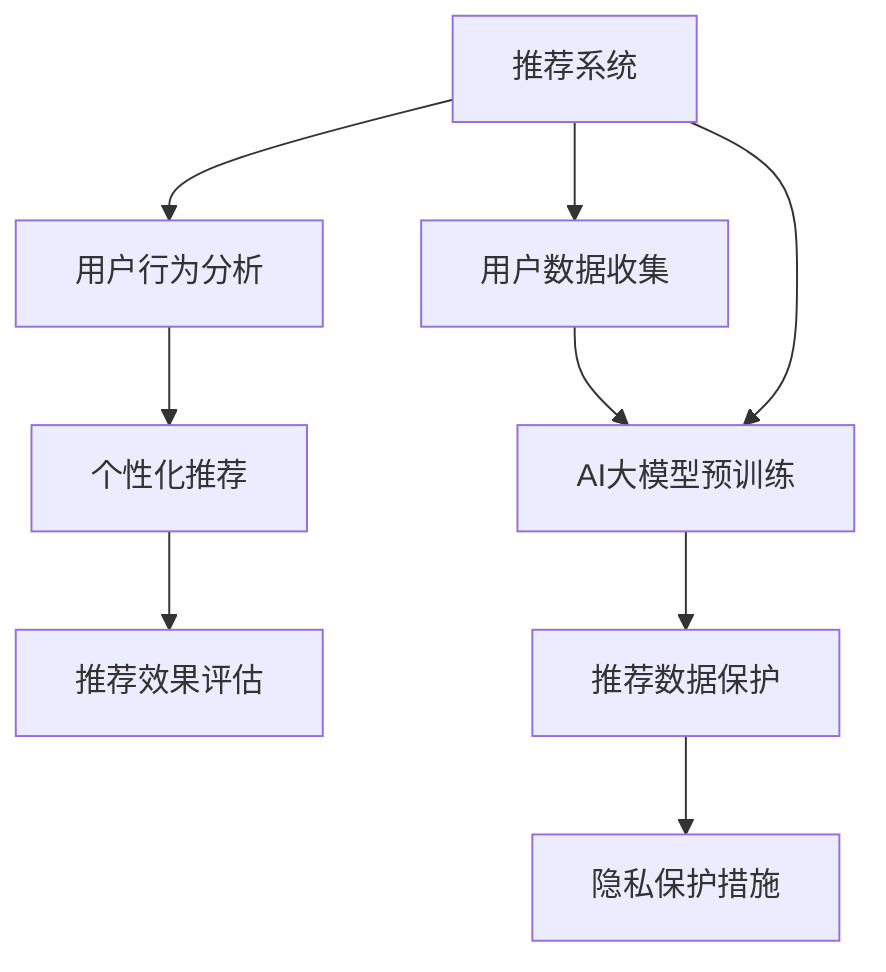

                 

# AI 大模型在电商搜索推荐中的用户隐私保护：平衡推荐效果与用户权利

在电子商务领域，推荐系统已经成为提升用户体验、增加销售的关键技术之一。然而，随着推荐系统对用户行为的深入分析和个性化推荐，用户隐私保护也成为了一个亟待解决的重大问题。本文将探讨AI大模型在电商搜索推荐中的应用，并提出一些在保护用户隐私的同时提升推荐效果的策略。

## 1. 背景介绍

随着电子商务的快速发展，推荐系统逐渐成为电商平台不可或缺的一部分。推荐系统通过分析用户的历史行为数据、浏览记录、购买习惯等，为用户提供个性化的商品推荐，从而提高用户满意度、促进消费。然而，推荐系统的广泛应用也引发了用户隐私保护的担忧。用户的购买记录、浏览历史等敏感信息被收集和分析，存在被滥用或泄露的风险。

## 2. 核心概念与联系

### 2.1 核心概念概述

为更好地理解AI大模型在电商推荐中的应用与隐私保护，我们首先介绍几个关键概念：

- **推荐系统**：通过算法预测用户可能感兴趣的商品或服务，并为其推荐，以提高用户满意度和平台销售额。推荐算法通常基于用户历史数据和商品特征，通过学习模型进行预测。
- **隐私保护**：保护用户个人信息不被未授权获取和使用，防止数据滥用或泄露。隐私保护涉及数据收集、存储、传输和使用各个环节。
- **AI大模型**：基于深度学习的大规模神经网络模型，如BERT、GPT等，通过大量无标签数据预训练，具备强大的语言理解和生成能力。在推荐系统中，可以用于用户行为分析、商品语义匹配等。

这些概念之间存在密切的联系。AI大模型在电商推荐系统中发挥着重要的作用，但同时必须确保用户隐私得到充分保护，以维持用户信任和平台声誉。

### 2.2 核心概念原理和架构的 Mermaid 流程图(Mermaid 流程节点中不要有括号、逗号等特殊字符)



该流程图展示了推荐系统的主要流程及其与AI大模型的关系。用户数据收集后，首先通过AI大模型进行预训练，然后在用户行为分析环节，模型用于分析用户行为特征。接着，系统根据分析结果进行个性化推荐，并评估推荐效果。同时，在数据保护环节，采取隐私保护措施，确保用户数据安全。

## 3. 核心算法原理 & 具体操作步骤

### 3.1 算法原理概述

AI大模型在电商推荐中的应用主要体现在两个方面：

1. **用户行为分析**：通过分析用户的历史行为数据，如浏览记录、点击行为、购买记录等，预测用户兴趣和需求，为其推荐相关商品。
2. **商品语义匹配**：利用大模型的语言理解能力，分析和匹配商品描述与用户查询之间的语义相似度，提高推荐准确性。

### 3.2 算法步骤详解

AI大模型在电商推荐中的具体步骤如下：

1. **数据收集**：收集用户历史行为数据和商品特征数据，包括浏览记录、点击行为、购买记录、商品描述等。
2. **数据预处理**：清洗和处理数据，去除噪声和异常值，确保数据质量。
3. **模型训练**：使用AI大模型进行预训练，学习通用语言知识和商品语义表示。
4. **行为分析**：利用预训练模型分析用户行为，提取用户兴趣和需求。
5. **个性化推荐**：根据用户兴趣和商品特征，生成个性化推荐列表。
6. **推荐效果评估**：通过用户反馈和实际点击率等指标，评估推荐效果，不断优化模型。

### 3.3 算法优缺点

AI大模型在电商推荐中具有以下优点：

- **强大的语义理解能力**：大模型能够理解商品描述和用户查询的语义，提高推荐准确性。
- **丰富的语料来源**：可以基于大规模无标签文本进行预训练，学习丰富的语言知识。
- **灵活的微调能力**：通过微调模型，适应特定领域或特定用户的推荐需求。

同时，也存在一些缺点：

- **数据依赖性强**：需要大量标注数据进行微调，数据收集成本较高。
- **计算资源需求高**：大模型训练和推理需要高性能计算资源，成本较高。
- **模型复杂度高**：模型参数众多，难以解释和调试。

### 3.4 算法应用领域

AI大模型在电商推荐中的应用领域广泛，包括：

- **商品推荐**：根据用户历史行为，推荐相关商品。
- **个性化广告**：根据用户兴趣，推送个性化广告。
- **搜索排序**：提高搜索结果的个性化和相关性，提升用户搜索体验。
- **交叉销售**：利用用户兴趣，推荐相关附加商品或服务。
- **内容推荐**：推荐相关的新闻、视频、文章等。

## 4. 数学模型和公式 & 详细讲解 & 举例说明

### 4.1 数学模型构建

在电商推荐中，常用的数学模型包括协同过滤、内容推荐、矩阵分解等。以协同过滤为例，用户行为可以用以下矩阵表示：

$$
R_{ij} =
\begin{cases}
1, & \text{用户i对商品j感兴趣} \\
0, & \text{用户i对商品j不感兴趣}
\end{cases}
$$

其中，$R$ 为用户行为矩阵，$R_{ij}$ 表示用户i对商品j的兴趣度。

### 4.2 公式推导过程

在协同过滤推荐系统中，常用的算法包括基于矩阵分解的推荐算法。基于用户-商品矩阵$R$，可以分解为两个低秩矩阵$U$和$V$：

$$
R \approx UV^\top
$$

其中，$U$ 为用户的隐式特征矩阵，$V$ 为商品的隐式特征矩阵。用户i对商品j的兴趣度可以通过矩阵乘积$R_{ij} \approx U_iV_j$进行预测。

### 4.3 案例分析与讲解

以用户推荐为例，假设一个用户A浏览过商品X和商品Y，推荐系统可以根据这些行为，使用协同过滤算法预测用户A可能感兴趣的其他商品。具体计算步骤如下：

1. 构建用户-商品矩阵$R$，其中$R_{AX}=1$，$R_{AY}=1$。
2. 对$R$进行矩阵分解，得到$U$和$V$。
3. 计算用户A的隐式特征向量$U_A$和商品X、Y的隐式特征向量$V_X$、$V_Y$。
4. 通过$U_AV_X^\top$和$U_AV_Y^\top$计算用户A对商品X、Y的兴趣度预测值。
5. 根据预测值，推荐系统为A推荐相关商品。

## 5. 项目实践：代码实例和详细解释说明

### 5.1 开发环境搭建

进行电商推荐系统开发前，我们需要准备好开发环境。以下是使用Python进行推荐系统开发的常见环境配置流程：

1. 安装Anaconda：从官网下载并安装Anaconda，用于创建独立的Python环境。
2. 创建并激活虚拟环境：
```bash
conda create -n recommender-env python=3.8 
conda activate recommender-env
```

3. 安装相关库：
```bash
conda install pandas numpy scikit-learn tqdm scikit-learn
```

完成上述步骤后，即可在`recommender-env`环境中开始推荐系统开发。

### 5.2 源代码详细实现

以下是使用Python和Scikit-learn实现协同过滤推荐系统的示例代码：

```python
import pandas as pd
import numpy as np
from sklearn.decomposition import TruncatedSVD
from sklearn.metrics.pairwise import cosine_similarity

# 构建用户-商品矩阵
R = pd.DataFrame({'X': [1, 1, 0, 0, 1, 0],
                  'Y': [1, 0, 1, 0, 0, 1],
                  'Z': [0, 1, 1, 0, 1, 1],
                  'W': [0, 1, 0, 1, 1, 0]})

# 矩阵分解
U, V = TruncatedSVD(n_components=2).fit_transform(R)

# 预测用户对商品的兴趣度
def predict_interest(user, item):
    return np.dot(U[user], V[item])

# 推荐商品
def recommend_items(user, top_n=5):
    item_similarities = cosine_similarity(U[user].reshape(1, -1), V)
    item_indices = np.argsort(item_similarities.flatten())[::-1]
    recommended_items = R.columns[item_indices[1:top_n+1]]
    return recommended_items

# 测试推荐结果
recommended_items = recommend_items(1)
print(recommended_items)
```

### 5.3 代码解读与分析

上述代码实现了一个简单的协同过滤推荐系统，使用了矩阵分解方法进行推荐预测。首先，使用`TruncatedSVD`进行矩阵分解，得到用户和商品的隐式特征矩阵。然后，通过计算用户对商品的兴趣度预测值，推荐相关商品。最后，使用`cosine_similarity`计算商品之间的相似度，并根据相似度进行商品推荐。

## 6. 实际应用场景

### 6.1 智能客服系统

智能客服系统结合了AI大模型和推荐技术，能够根据用户需求提供个性化的服务。例如，用户询问商品信息时，系统可以推荐相关的商品或服务，提升用户体验和满意度。

### 6.2 个性化推荐广告

电商平台利用用户行为数据，通过推荐系统向用户推送个性化的广告。根据用户的兴趣和需求，推荐相关商品或服务，提高广告点击率和转化率。

### 6.3 搜索排序

推荐系统可以应用于商品搜索排序，提高搜索结果的个性化和相关性。根据用户的搜索行为和历史数据，推荐可能感兴趣的商品，提升用户搜索体验。

### 6.4 交叉销售

利用推荐系统，可以分析用户兴趣，推荐相关附加商品或服务，增加销售额。例如，用户购买某商品后，系统可以推荐相关商品或服务，提高用户的购买意愿。

### 6.5 内容推荐

推荐系统可以用于新闻、视频、文章等内容推荐，根据用户的历史阅读记录，推荐相关内容，提高用户的粘性和互动率。

## 7. 工具和资源推荐

### 7.1 学习资源推荐

为了帮助开发者系统掌握推荐系统和AI大模型的理论和实践，这里推荐一些优质的学习资源：

1. 《推荐系统实战》：介绍推荐系统的主要算法和应用，涵盖协同过滤、内容推荐、深度学习推荐等。
2. 《深度学习基础》：由吴恩达教授主讲的Coursera课程，涵盖深度学习的基础理论和应用。
3. 《TensorFlow实战》：介绍TensorFlow的使用方法和深度学习模型实现，适合实践推荐系统开发。
4. Kaggle竞赛：参加Kaggle推荐系统竞赛，实践推荐算法，提升实际应用能力。

通过这些资源的学习实践，相信你一定能够掌握推荐系统和AI大模型的开发和应用。

### 7.2 开发工具推荐

高效的开发离不开优秀的工具支持。以下是几款用于推荐系统开发的常用工具：

1. TensorFlow：由Google主导开发的深度学习框架，适用于推荐系统的建模和训练。
2. PyTorch：Facebook开发的深度学习框架，适用于推荐系统的模型开发和优化。
3. Scikit-learn：用于数据预处理和模型评估，适合推荐系统的特征工程和实验设计。
4. Spark：用于大规模数据处理和推荐系统的分布式实现。

合理利用这些工具，可以显著提升推荐系统的开发效率，加快创新迭代的步伐。

### 7.3 相关论文推荐

推荐系统和AI大模型的研究源于学界的持续探索。以下是几篇奠基性的相关论文，推荐阅读：

1. "Collaborative Filtering for Implicit Feedback Datasets"：介绍协同过滤算法的基本原理和实现方法。
2. "Matrix Factorization Techniques for Recommender Systems"：总结了矩阵分解等推荐算法的研究进展。
3. "Feature Engineering for Implicit Feedback Data in Recommender Systems"：探讨了特征工程在推荐系统中的应用。
4. "Deep Learning Recommender Systems"：讨论了深度学习在推荐系统中的应用前景。

这些论文代表了这个领域的最新进展，阅读这些文献可以系统了解推荐系统和AI大模型的前沿动态。

## 8. 总结：未来发展趋势与挑战

### 8.1 研究成果总结

本文对AI大模型在电商推荐中的应用进行了详细探讨，介绍了推荐系统的基本原理和AI大模型的应用。通过案例分析和代码实现，展示了推荐系统的具体应用。同时，文章探讨了推荐系统中的隐私保护问题，提出了一些解决策略。

### 8.2 未来发展趋势

展望未来，推荐系统和AI大模型将呈现以下几个发展趋势：

1. **推荐算法的智能化**：随着深度学习和强化学习等技术的发展，推荐算法将变得更加智能和高效。
2. **个性化推荐的精准度提升**：通过用户行为数据的多维度分析和深度学习模型的应用，推荐系统的精准度将不断提升。
3. **实时推荐**：结合实时数据流处理技术，推荐系统将能够实时响应用户需求，提供即时推荐。
4. **跨平台推荐**：推荐系统将应用于不同平台，实现跨平台数据的整合和推荐。
5. **多模态推荐**：结合视觉、语音、文本等多模态数据，提高推荐系统的综合能力。
6. **推荐系统的公平性**：重视推荐系统的公平性和透明性，避免偏见和歧视。

### 8.3 面临的挑战

尽管推荐系统和AI大模型在电商推荐中取得了显著进展，但仍然面临诸多挑战：

1. **用户隐私保护**：如何平衡推荐效果和用户隐私保护，是一个重要挑战。
2. **数据稀疏性**：推荐系统通常面临数据稀疏性问题，即部分用户和商品没有历史行为数据，难以进行推荐。
3. **计算资源需求高**：推荐系统需要大量计算资源进行模型训练和推理，成本较高。
4. **推荐模型的可解释性**：推荐模型的复杂性高，难以解释和调试。
5. **推荐系统的公平性**：推荐系统容易出现偏见，导致不公平的推荐结果。

### 8.4 研究展望

未来研究需要在以下几个方面寻求新的突破：

1. **隐私保护技术**：开发隐私保护技术，如差分隐私、联邦学习等，确保用户数据安全。
2. **数据增强技术**：利用数据增强技术，提高数据质量和数量，缓解数据稀疏性问题。
3. **模型压缩与优化**：开发高效推荐算法和模型压缩技术，降低计算资源需求。
4. **多模态数据融合**：结合视觉、语音、文本等多模态数据，提高推荐系统的综合能力。
5. **推荐系统的公平性**：引入公平性约束和评估指标，避免偏见和歧视。

## 9. 附录：常见问题与解答

**Q1：推荐系统中的隐私保护问题如何解决？**

A: 推荐系统中的隐私保护问题可以通过以下方法解决：

1. **差分隐私**：在数据收集和处理过程中，采用差分隐私技术，确保用户数据的匿名性和安全性。
2. **联邦学习**：通过联邦学习技术，在用户端进行数据本地化处理，只共享模型参数，不共享原始数据。
3. **去标识化**：在数据预处理阶段，采用去标识化技术，去除用户个人身份信息，保护用户隐私。
4. **数据加密**：对用户数据进行加密处理，确保数据在传输和存储过程中的安全性。

**Q2：如何提高推荐系统的精准度？**

A: 提高推荐系统精准度的方法包括：

1. **数据预处理**：清洗和处理数据，去除噪声和异常值，提高数据质量。
2. **特征工程**：提取和选择有意义的特征，提升模型的拟合能力。
3. **模型选择**：选择合适的推荐算法和模型，如协同过滤、内容推荐、深度学习等。
4. **模型优化**：通过交叉验证和超参数调优，优化模型性能。
5. **实时推荐**：结合实时数据流处理技术，实时响应用户需求，提供即时推荐。

**Q3：推荐系统中的计算资源需求高，如何解决？**

A: 推荐系统中的计算资源需求高，可以通过以下方法解决：

1. **分布式计算**：使用分布式计算框架，如Hadoop、Spark等，加速数据处理和模型训练。
2. **模型压缩**：采用模型压缩技术，如剪枝、量化、蒸馏等，降低模型复杂度，提高推理速度。
3. **模型并行**：使用模型并行技术，如数据并行、模型并行等，提升计算效率。
4. **硬件优化**：使用高性能计算设备，如GPU、TPU等，加速模型训练和推理。

**Q4：推荐系统中的公平性问题如何解决？**

A: 推荐系统中的公平性问题可以通过以下方法解决：

1. **公平性评估指标**：引入公平性评估指标，如平衡精度、机会均等等，评估推荐系统的公平性。
2. **公平性约束**：在模型训练过程中，引入公平性约束，避免偏见和歧视。
3. **多样性增强**：增加推荐结果的多样性，减少用户对某一类商品的过度偏好。
4. **数据增强**：通过数据增强技术，增加少数群体的数据量，提升少数群体的推荐效果。
5. **用户反馈**：收集用户反馈，及时调整推荐策略，避免歧视和不公平现象。

**Q5：推荐系统中的实时推荐如何实现？**

A: 推荐系统中的实时推荐可以通过以下方法实现：

1. **数据流处理**：使用流处理框架，如Apache Kafka、Apache Flink等，处理实时数据流。
2. **实时模型训练**：采用在线学习技术，如在线梯度下降、增量学习等，实时更新模型参数。
3. **缓存机制**：使用缓存机制，减少数据流的延迟和计算时间，提高推荐效率。
4. **异步计算**：使用异步计算技术，如异步TensorFlow、异步PyTorch等，加速推荐过程。

---

作者：禅与计算机程序设计艺术 / Zen and the Art of Computer Programming

