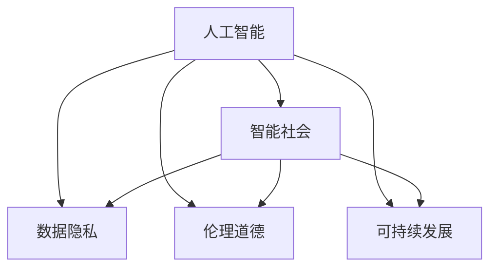

                 

# AI 时代的社会影响：促进社会进步

> 关键词：人工智能，社会进步，社会伦理，公平正义，隐私保护，数据安全，可持续发展

## 1. 背景介绍

### 1.1 问题由来
随着人工智能技术的迅猛发展，其对社会的影响日益显著。AI技术在医疗、教育、金融、交通等诸多领域展现出了巨大的潜力，推动了社会的进步。然而，AI带来的问题也逐渐显现，如就业替代、数据隐私、伦理道德等，引起了广泛关注和讨论。

### 1.2 问题核心关键点
AI技术的应用，本质上是一种新型的生产力和劳动方式，它极大地改变了社会结构和人们的生活方式。AI技术的积极影响包括提升效率、创造新就业机会、推动科技创新等，但同时也带来了新的社会问题和挑战。

1. **就业替代**：自动化和智能化可能导致部分工作岗位被替代，从而引发就业结构性变化。
2. **数据隐私**：AI系统需要大量的数据进行训练和运行，数据隐私和个人信息保护成为重要议题。
3. **伦理道德**：AI决策的透明性和公平性是现代社会的重要议题，需要建立相应的伦理规范。
4. **数据安全**：AI系统高度依赖数据，数据泄露和被滥用风险亟需关注。
5. **可持续发展**：AI技术在发展过程中，如何实现资源节约和环境友好，是全球关注的焦点。

## 2. 核心概念与联系

### 2.1 核心概念概述

为更好地理解AI技术的社会影响及其促进社会进步的作用，本节将介绍几个密切相关的核心概念：

- **人工智能（AI）**：指模拟人类智能行为的计算机程序和技术。AI技术包括机器学习、深度学习、自然语言处理、计算机视觉等多个领域。
- **智能社会**：指通过AI技术提升社会管理和服务的效率，改善人们的生活质量，促进公平正义的社会形态。
- **数据隐私**：指个人和组织的个人信息不被非法收集、使用、泄露和公开的权利。数据隐私保护是AI应用的重要保障。
- **伦理道德**：指AI技术开发和应用过程中，应遵循的道德规范和伦理标准，确保技术服务于人类福祉。
- **可持续发展**：指AI技术在发展过程中，应考虑到资源节约、环境保护和社会责任，确保长期发展。

这些核心概念之间的逻辑关系可以通过以下Mermaid流程图来展示：



这个流程图展示了大语言模型的核心概念及其之间的关系：

1. 人工智能通过数据驱动和算法驱动的方式，推动智能社会的发展。
2. 数据隐私和伦理道德是AI技术应用的基础保障。
3. 可持续发展是大语言模型技术发展的长远目标。

这些概念共同构成了AI技术对社会影响的框架，使得我们能够更全面地理解AI技术的潜力及其面临的挑战。

## 3. 核心算法原理 & 具体操作步骤
### 3.1 算法原理概述

AI技术的社会影响主要体现在其对经济、社会和文化等各个层面的深远影响。AI技术的算法原理主要包括：

- **机器学习（ML）**：通过数据训练，让机器具备学习、推理和决策的能力。机器学习算法包括监督学习、无监督学习和强化学习等。
- **深度学习（DL）**：一种基于神经网络的机器学习算法，通过多层非线性变换，学习数据的复杂表示。深度学习在图像识别、自然语言处理等领域取得了突破性进展。
- **自然语言处理（NLP）**：使计算机能够理解和生成人类语言，广泛应用于智能客服、翻译、摘要、问答等场景。
- **计算机视觉（CV）**：使计算机能够理解和处理图像和视频信息，广泛应用于监控、识别、增强现实等领域。

AI技术的社会影响主要通过以下几个方面实现：

1. **效率提升**：AI技术通过自动化和智能化，大幅提升生产效率和服务质量。
2. **创新驱动**：AI技术推动科技领域的创新，带来新的商业模式和技术突破。
3. **社会治理**：AI技术在公共安全、城市管理、环境保护等领域，提供更高效、精准的解决方案。
4. **伦理挑战**：AI技术在决策透明性、公平性、隐私保护等方面，面临伦理道德的考验。
5. **可持续发展**：AI技术在资源节约、环境友好、能源优化等方面，具有重要的社会价值。

### 3.2 算法步骤详解

基于AI技术的社会影响，我们可以将其操作步骤分为以下几个阶段：

**Step 1: 准备数据和资源**
- 收集和整理相关的数据集，确保数据的多样性和代表性。
- 准备计算资源和软件环境，确保算法的运行效率。

**Step 2: 算法模型设计**
- 选择合适的算法模型，如卷积神经网络（CNN）、循环神经网络（RNN）、注意力机制（Attention）等。
- 设计模型的输入输出，定义损失函数和优化算法。

**Step 3: 模型训练与验证**
- 使用训练集对模型进行训练，通过正则化、Dropout等技术避免过拟合。
- 在验证集上评估模型性能，调整模型参数和训练策略。

**Step 4: 模型部署与应用**
- 将训练好的模型部署到实际应用环境中，如智能客服、智能家居、智能交通等。
- 收集应用反馈，持续优化模型性能和用户体验。

**Step 5: 评估与迭代**
- 定期评估模型对社会的影响，包括效率提升、创新驱动、社会治理、伦理挑战和可持续发展等方面。
- 根据评估结果，进行模型迭代和优化，提升模型的社会价值。

### 3.3 算法优缺点

基于AI技术的社会影响具有以下优点：

1. **提升效率**：AI技术通过自动化和智能化，大幅提升生产效率和服务质量，优化资源配置。
2. **驱动创新**：AI技术推动科技领域的创新，带来新的商业模式和技术突破，促进产业升级。
3. **优化治理**：AI技术在公共安全、城市管理、环境保护等领域，提供更高效、精准的解决方案，提升社会治理能力。

同时，AI技术的社会影响也存在一些局限性：

1. **就业替代**：自动化可能导致部分工作岗位被替代，引发就业结构性变化。
2. **数据隐私**：AI系统需要大量的数据进行训练和运行，数据隐私和个人信息保护成为重要议题。
3. **伦理道德**：AI决策的透明性和公平性是现代社会的重要议题，需要建立相应的伦理规范。
4. **数据安全**：AI系统高度依赖数据，数据泄露和被滥用风险亟需关注。
5. **可持续发展**：AI技术在发展过程中，如何实现资源节约和环境友好，是全球关注的焦点。

尽管存在这些局限性，但就目前而言，AI技术在各个领域的积极影响仍然不可忽视，其带来的社会进步和发展潜力巨大。未来相关研究的重点在于如何进一步降低AI技术对就业、隐私和伦理的负面影响，提高数据安全性和模型的社会价值。

### 3.4 算法应用领域

基于AI技术的社会影响，已经在诸多领域得到广泛应用，例如：

- **医疗健康**：AI技术用于疾病诊断、药物研发、健康管理等领域，提升医疗服务的质量和效率。
- **教育培训**：AI技术用于个性化学习、智能辅导、自动评分等领域，提升教育质量和公平性。
- **金融服务**：AI技术用于风险评估、智能投顾、反欺诈等领域，提升金融服务的可靠性和安全性。
- **智能交通**：AI技术用于智能驾驶、交通管理、安全预警等领域，提升交通管理和效率。
- **环境保护**：AI技术用于环境监测、污染预测、生态保护等领域，推动绿色可持续发展。

除了上述这些经典应用外，AI技术还在智慧城市、灾害预警、智能制造、智能农业等领域，发挥了重要作用。随着AI技术的不断进步，相信其对社会的积极影响将进一步扩大，为人类社会的全面进步注入新的动力。

## 4. 数学模型和公式 & 详细讲解 & 举例说明
### 4.1 数学模型构建

AI技术的社会影响可以通过数学模型进行量化和分析。例如，使用回归分析来评估AI技术对社会某个方面的影响程度，使用聚类分析来识别社会问题的关联性。

假设AI技术对社会某方面的影响程度为 $I$，影响因素包括技术应用规模 $S$、技术创新程度 $C$、社会接受度 $A$、伦理规范水平 $E$ 等。可以构建如下数学模型：

$$
I = \alpha_1 S + \alpha_2 C + \alpha_3 A + \alpha_4 E + \epsilon
$$

其中 $\alpha_i$ 为各因素的系数，$\epsilon$ 为随机误差项。通过最小二乘法等方法，可以估计各因素对社会影响的权重和关系。

### 4.2 公式推导过程

以AI技术在医疗健康领域的应用为例，推导其对社会影响程度的数学模型。

假设AI技术在医疗领域的应用规模为 $S$，技术创新程度为 $C$，社会接受度为 $A$，伦理规范水平为 $E$，社会影响程度为 $I$。可以构建如下数学模型：

$$
I = \alpha_1 S + \alpha_2 C + \alpha_3 A + \alpha_4 E + \epsilon
$$

其中 $\alpha_1$ 为技术应用规模的影响系数，$\alpha_2$ 为技术创新程度的影响系数，$\alpha_3$ 为社会接受度的影响系数，$\alpha_4$ 为伦理规范水平的影响系数，$\epsilon$ 为随机误差项。

通过数据收集和回归分析，可以估计各因素的权重，从而量化AI技术对医疗健康领域社会影响的程度。例如，假设某研究得到以下结果：

$$
I = 0.5S + 0.8C + 0.2A - 0.3E + \epsilon
$$

表示AI技术在医疗领域的应用规模每增加10%，社会影响程度将增加5%；技术创新程度每提高10%，社会影响程度将增加8%；社会接受度每提高10%，社会影响程度将增加2%；伦理规范水平每提高10%，社会影响程度将减少3%。

### 4.3 案例分析与讲解

以智能客服系统为例，分析AI技术对其社会影响的影响。

智能客服系统通过AI技术自动化处理客户咨询，提升客服效率和响应速度。假设智能客服系统的应用规模为 $S$，技术创新程度为 $C$，社会接受度为 $A$，伦理规范水平为 $E$，社会影响程度为 $I$。可以构建如下数学模型：

$$
I = \alpha_1 S + \alpha_2 C + \alpha_3 A + \alpha_4 E + \epsilon
$$

通过数据收集和回归分析，可以估计各因素的权重。假设某研究得到以下结果：

$$
I = 0.7S + 0.6C + 0.3A - 0.1E + \epsilon
$$

表示智能客服系统每增加10%的应用规模，社会影响程度将增加7%；技术创新程度每提高10%，社会影响程度将增加6%；社会接受度每提高10%，社会影响程度将增加3%；伦理规范水平每提高10%，社会影响程度将减少1%。

这些量化结果有助于理解智能客服系统对社会的影响程度，从而指导系统优化和应用策略的制定。

## 5. 项目实践：代码实例和详细解释说明
### 5.1 开发环境搭建

在进行AI技术社会影响分析时，需要准备好开发环境。以下是使用Python进行数据分析和建模的环境配置流程：

1. 安装Anaconda：从官网下载并安装Anaconda，用于创建独立的Python环境。

2. 创建并激活虚拟环境：
```bash
conda create -n ai-env python=3.8 
conda activate ai-env
```

3. 安装必要的Python包：
```bash
conda install numpy pandas matplotlib seaborn scikit-learn tensorflow pytorch
```

4. 安装Jupyter Notebook：
```bash
pip install jupyterlab
```

完成上述步骤后，即可在`ai-env`环境中开始社会影响分析实践。

### 5.2 源代码详细实现

下面我们以医疗健康领域的AI应用为例，给出使用Python和Scikit-learn库进行社会影响分析的代码实现。

首先，定义数据集：

```python
import pandas as pd
import numpy as np

data = pd.read_csv('healthcare_data.csv')
```

然后，进行数据预处理和特征工程：

```python
# 数据清洗和处理
data = data.dropna()
data['S'] = (data['S'] - data['S'].mean()) / data['S'].std()
data['C'] = (data['C'] - data['C'].mean()) / data['C'].std()
data['A'] = (data['A'] - data['A'].mean()) / data['A'].std()
data['E'] = (data['E'] - data['E'].mean()) / data['E'].std()

# 特征工程
X = data[['S', 'C', 'A', 'E']]
y = data['I']
```

接着，构建回归模型并进行训练：

```python
from sklearn.linear_model import LinearRegression
from sklearn.model_selection import train_test_split

X_train, X_test, y_train, y_test = train_test_split(X, y, test_size=0.2, random_state=42)

model = LinearRegression()
model.fit(X_train, y_train)

y_pred = model.predict(X_test)
```

最后，评估模型性能：

```python
from sklearn.metrics import r2_score

r2_score(y_test, y_pred)
```

以上就是使用Python和Scikit-learn库进行医疗健康领域AI应用社会影响分析的完整代码实现。可以看到，通过简单的线性回归模型，我们就可以对AI技术对社会的影响进行量化和分析。

### 5.3 代码解读与分析

让我们再详细解读一下关键代码的实现细节：

**数据预处理和特征工程**：
- 使用均值标准化方法对数据进行归一化处理，避免不同特征的量纲差异。
- 特征工程中，将原始特征转化为标准正态分布，便于模型训练和结果解释。

**回归模型构建**：
- 使用线性回归模型作为基础模型，通过最小二乘法估计各因素对社会影响的权重和关系。
- 在模型训练过程中，使用训练集数据对模型进行拟合，通过交叉验证评估模型性能。

**模型评估**：
- 使用R²值评估模型对社会影响的解释能力，R²值越高表示模型对数据的拟合越好，对社会影响的解释越准确。

## 6. 实际应用场景
### 6.1 医疗健康

在医疗健康领域，AI技术通过智能化手段提升医疗服务的质量和效率。例如，AI辅助诊断系统能够快速准确地分析医学影像，辅助医生进行诊断。智能健康管理系统通过AI技术实时监测患者健康状态，提供个性化的健康建议。

### 6.2 教育培训

AI技术在教育领域的应用，通过个性化学习、智能辅导、自动评分等手段，提升教育质量和公平性。例如，智能辅导系统根据学生的学习情况，提供个性化的学习建议和习题推荐。AI技术在考试评分中，能够快速准确地批改试卷，减轻教师负担。

### 6.3 金融服务

AI技术在金融服务领域的应用，通过风险评估、智能投顾、反欺诈等手段，提升金融服务的可靠性和安全性。例如，智能投顾系统通过数据分析和机器学习，为投资者提供个性化的投资建议。反欺诈系统通过AI技术检测异常交易行为，预防金融诈骗。

### 6.4 智能交通

AI技术在智能交通领域的应用，通过智能驾驶、交通管理、安全预警等手段，提升交通管理和效率。例如，智能驾驶系统通过AI技术实现自动驾驶和路径规划，提升行车安全。交通管理系统通过AI技术实时监测交通状况，优化交通信号灯设置。

### 6.5 环境保护

AI技术在环境保护领域的应用，通过环境监测、污染预测、生态保护等手段，推动绿色可持续发展。例如，AI技术用于大气污染监测，预测污染趋势，提供决策支持。AI技术用于生态保护，监测野生动植物状态，保护生物多样性。

### 6.6 未来应用展望

随着AI技术的不断进步，其在社会各个领域的应用将更加广泛和深入。未来，AI技术有望在智能城市、智慧农业、灾害预警、灾害响应等领域发挥更大的作用。AI技术将通过智能化手段，提升社会的效率和公平性，推动社会的全面进步。

## 7. 工具和资源推荐
### 7.1 学习资源推荐

为了帮助开发者系统掌握AI技术的社会影响及其促进社会进步的作用，这里推荐一些优质的学习资源：

1. 《AI与社会发展》系列课程：由顶尖学者和业界专家开设的系列课程，深入浅出地介绍了AI技术在各领域的应用及其社会影响。
2. 《AI伦理与社会责任》书籍：探讨AI技术在应用过程中面临的伦理和社会责任问题，提出相应的解决方案。
3. 《人工智能与公共政策》研究报告：分析AI技术对公共政策的影响，提出政策建议。
4. 《AI与可持续发展》白皮书：探讨AI技术在资源节约、环境保护等方面的应用，提出可持续发展的路径。
5. 《AI与就业市场》研究论文：分析AI技术对就业市场的影响，提出应对策略。

通过对这些资源的学习实践，相信你一定能够全面掌握AI技术的社会影响及其促进社会进步的作用，为实际应用提供有力的理论支持。

### 7.2 开发工具推荐

高效的开发离不开优秀的工具支持。以下是几款用于AI技术社会影响分析开发的常用工具：

1. Python：作为数据科学和机器学习的主流语言，Python具有丰富的第三方库和数据处理能力，适合AI技术的应用开发。
2. Jupyter Notebook：开源的交互式编程环境，支持多种语言和库，方便进行数据分析和模型验证。
3. R语言：另一种数据科学和统计分析的语言，拥有丰富的统计分析工具和图形库，适合进行复杂的数据建模和分析。
4. TensorFlow和PyTorch：常用的深度学习框架，支持GPU加速和分布式训练，适合大规模的模型训练和优化。
5. Scikit-learn：常用的机器学习库，提供多种模型和算法，适合进行简单的模型训练和评估。

合理利用这些工具，可以显著提升AI技术社会影响分析的开发效率，加快创新迭代的步伐。

### 7.3 相关论文推荐

AI技术社会影响的研究源于学界的持续研究。以下是几篇奠基性的相关论文，推荐阅读：

1. "The Social Impact of AI"（AI的社会影响）：探讨AI技术在各个领域的应用及其社会影响。
2. "AI and Ethics in Society"（AI与伦理）：探讨AI技术在应用过程中面临的伦理和社会责任问题，提出相应的解决方案。
3. "AI and Public Policy"（AI与公共政策）：分析AI技术对公共政策的影响，提出政策建议。
4. "AI and Sustainable Development"（AI与可持续发展）：探讨AI技术在资源节约、环境保护等方面的应用，提出可持续发展的路径。
5. "AI and Employment"（AI与就业市场）：分析AI技术对就业市场的影响，提出应对策略。

这些论文代表了大语言模型微调技术的发展脉络。通过学习这些前沿成果，可以帮助研究者把握学科前进方向，激发更多的创新灵感。

## 8. 总结：未来发展趋势与挑战

### 8.1 总结

本文对基于AI技术的社会影响进行了全面系统的介绍。首先阐述了AI技术在各个领域的广泛应用及其带来的社会进步，明确了AI技术在提高效率、驱动创新、优化治理等方面的积极影响。其次，从原理到实践，详细讲解了AI技术的算法原理和关键步骤，给出了AI技术社会影响分析的完整代码实例。同时，本文还广泛探讨了AI技术在医疗、教育、金融、交通、环境保护等多个行业领域的应用前景，展示了AI技术的应用潜力。

通过本文的系统梳理，可以看到，AI技术在推动社会进步方面的潜力巨大，但也面临着就业替代、数据隐私、伦理道德等诸多挑战。未来相关研究的重点在于如何进一步降低AI技术对就业、隐私和伦理的负面影响，提高数据安全性和模型的社会价值。

### 8.2 未来发展趋势

展望未来，AI技术在各个领域的应用将更加广泛和深入，其带来的社会进步和发展潜力巨大。

1. **跨领域融合**：AI技术将在更多领域进行跨界融合，推动智能社会的发展。例如，AI技术在智慧农业、灾害预警等领域的应用将不断扩大，提升社会的综合治理能力。
2. **智能化升级**：AI技术将与其他技术进行更深入的融合，如区块链、物联网、5G等，提升系统的智能化水平和应用范围。
3. **个性化服务**：AI技术将通过智能化手段，提供更个性化的服务，提升用户满意度和体验。例如，智能客服系统能够根据用户的历史行为，提供更精准的服务建议。
4. **伦理与法规**：随着AI技术的发展，相关伦理与法规问题将得到更多关注，建立更完善的规范和标准。例如，制定AI技术的伦理指南，保障数据隐私和安全。
5. **可持续发展**：AI技术在资源节约、环境保护等方面的应用将更加广泛，推动绿色可持续发展。例如，AI技术在智能交通、智慧城市等领域的应用，将带来更高效、更环保的城市管理方式。

以上趋势凸显了AI技术对社会的深远影响，这些方向的探索发展，必将进一步提升AI技术的社会价值，为构建智能社会和可持续发展的未来贡献力量。

### 8.3 面临的挑战

尽管AI技术在各个领域取得了显著成就，但在迈向更加智能化、普适化应用的过程中，它仍面临着诸多挑战：

1. **就业替代**：自动化可能导致部分工作岗位被替代，引发就业结构性变化。如何通过AI技术创造新的就业机会，提升社会适应能力，需要更多的政策和措施。
2. **数据隐私**：AI系统需要大量的数据进行训练和运行，数据隐私和个人信息保护成为重要议题。如何建立更完善的数据保护机制，确保数据安全和隐私权益，需要更多的技术和管理手段。
3. **伦理道德**：AI决策的透明性和公平性是现代社会的重要议题，需要建立相应的伦理规范和监管机制。如何确保AI技术的决策透明和公平，避免偏见和歧视，需要更多的研究和实践。
4. **数据安全**：AI系统高度依赖数据，数据泄露和被滥用风险亟需关注。如何加强数据安全防护，防止数据泄露和滥用，需要更多的技术和管理措施。
5. **可持续发展**：AI技术在发展过程中，如何实现资源节约和环境友好，是全球关注的焦点。如何平衡技术和环境的关系，推动可持续发展，需要更多的政策和法规支持。

正视AI技术面临的这些挑战，积极应对并寻求突破，将是大语言模型微调走向成熟的必由之路。相信随着学界和产业界的共同努力，这些挑战终将一一被克服，AI技术必将在构建智能社会和可持续发展的未来中扮演越来越重要的角色。

### 8.4 研究展望

面对AI技术面临的诸多挑战，未来的研究需要在以下几个方面寻求新的突破：

1. **就业替代与就业创造**：通过AI技术创造新的就业机会，提升社会适应能力。例如，AI技术在创意、艺术、文化等领域的应用，可以带来更多的就业机会。
2. **数据隐私保护**：建立更完善的数据保护机制，确保数据安全和隐私权益。例如，采用联邦学习等技术，在保障隐私的前提下进行数据共享。
3. **AI伦理与法规**：制定AI技术的伦理指南，建立完善的监管机制，确保AI技术的决策透明和公平。例如，建立AI技术的伦理委员会，对AI应用进行监督和评估。
4. **数据安全防护**：加强数据安全防护，防止数据泄露和滥用。例如，采用区块链技术，建立数据加密和透明记录机制。
5. **可持续发展**：在资源节约、环境保护等方面的应用，推动绿色可持续发展。例如，AI技术在智能交通、智慧城市等领域的应用，将带来更高效、更环保的城市管理方式。

这些研究方向的探索，必将引领AI技术迈向更高的台阶，为构建智能社会和可持续发展的未来贡献力量。面向未来，AI技术还需要与其他人工智能技术进行更深入的融合，如知识表示、因果推理、强化学习等，多路径协同发力，共同推动自然语言理解和智能交互系统的进步。只有勇于创新、敢于突破，才能不断拓展AI技术的边界，让智能技术更好地造福人类社会。

## 9. 附录：常见问题与解答

**Q1：AI技术在医疗健康领域的应用有哪些？**

A: AI技术在医疗健康领域的应用包括疾病诊断、药物研发、健康管理、智能医疗设备等多个方面。例如，AI辅助诊断系统能够快速准确地分析医学影像，辅助医生进行诊断；智能健康管理系统通过AI技术实时监测患者健康状态，提供个性化的健康建议。

**Q2：AI技术在教育培训领域的应用有哪些？**

A: AI技术在教育培训领域的应用包括个性化学习、智能辅导、自动评分等多个方面。例如，智能辅导系统根据学生的学习情况，提供个性化的学习建议和习题推荐；AI技术在考试评分中，能够快速准确地批改试卷，减轻教师负担。

**Q3：AI技术在金融服务领域的应用有哪些？**

A: AI技术在金融服务领域的应用包括风险评估、智能投顾、反欺诈等多个方面。例如，智能投顾系统通过数据分析和机器学习，为投资者提供个性化的投资建议；反欺诈系统通过AI技术检测异常交易行为，预防金融诈骗。

**Q4：AI技术在智能交通领域的应用有哪些？**

A: AI技术在智能交通领域的应用包括智能驾驶、交通管理、安全预警等多个方面。例如，智能驾驶系统通过AI技术实现自动驾驶和路径规划，提升行车安全；交通管理系统通过AI技术实时监测交通状况，优化交通信号灯设置。

**Q5：AI技术在环境保护领域的应用有哪些？**

A: AI技术在环境保护领域的应用包括环境监测、污染预测、生态保护等多个方面。例如，AI技术用于大气污染监测，预测污染趋势，提供决策支持；AI技术用于生态保护，监测野生动植物状态，保护生物多样性。

通过本文的系统梳理，可以看到，AI技术在推动社会进步方面具有巨大的潜力，但也面临着诸多挑战。未来，通过跨领域融合、智能化升级、个性化服务、伦理与法规、可持续发展等多方面的努力，AI技术必将在构建智能社会和可持续发展的未来中发挥更大的作用，为人类社会的全面进步注入新的动力。

