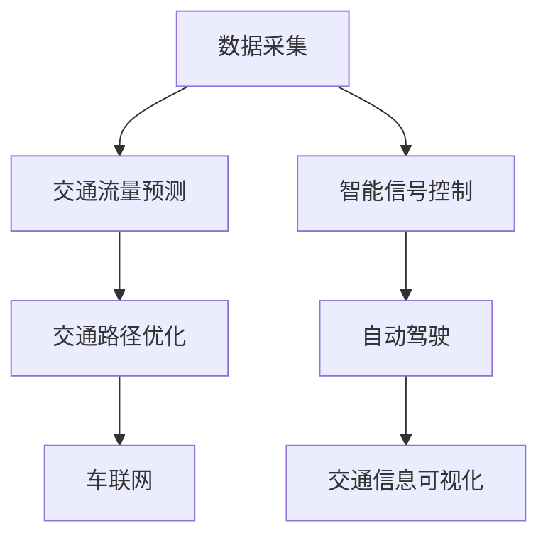

                 

# AIGC助力智能交通管理

## 1. 背景介绍

### 1.1 问题由来
随着城市人口的急剧增长和机动车的快速增多，全球各大城市均面临着交通拥堵、污染加剧、出行效率低下的严峻挑战。交通管理的复杂性和动态性，使得传统的基于规则和人工经验的交通调度系统难以应对多变的环境和瞬息万变的交通需求。

### 1.2 问题核心关键点
智能交通管理的核心是实时监测和动态调度，通过大数据、人工智能等技术，实现交通流的精细化管理和智能化调控。具体而言，需要解决以下问题：
1. **交通数据获取**：实时获取交通流量、车辆位置、路况信息等，以便进行精确的交通预测和决策。
2. **预测和分析**：通过机器学习算法对交通数据进行分析和预测，预测交通流量和事故风险，辅助交通调度。
3. **智能调度**：基于预测结果和实时数据，自动生成最优的交通管理方案，调整信号灯、车速限制、路障设置等。
4. **用户体验提升**：通过优化路线规划、导航提示等，提升出行体验，减少交通延误和环境污染。

### 1.3 问题研究意义
智能交通管理是智慧城市建设的重要组成部分，通过利用AI技术，可以实现更高效、更环保、更安全的交通管理。具体意义包括：
1. **提升出行效率**：智能交通系统能够实时监测和动态调整交通流，缓解交通拥堵，提高出行效率。
2. **减少环境污染**：优化交通流，减少车辆怠速和尾气排放，降低交通对环境的影响。
3. **保障交通安全**：通过预测和预防事故，减少交通事故，保障人民生命财产安全。
4. **优化资源配置**：通过数据分析，优化交通资源配置，提高交通系统的整体效能。
5. **促进社会和谐**：改善城市交通状况，提高居民生活质量，增强社会幸福感。

## 2. 核心概念与联系

### 2.1 核心概念概述

智能交通管理的核心技术主要包括自动驾驶、车联网、智能交通信号控制、交通流量预测、交通路径优化、交通信息可视化等多个方面。这些技术通过人工智能和物联网的结合，实现交通系统的智能化管理。

- **自动驾驶**：指车辆在无需人类干预的情况下，通过感知环境、路径规划和车辆控制，实现自主驾驶。
- **车联网**：通过车辆与车辆、车辆与道路设施、车辆与云端通信，实现信息共享和协同控制。
- **智能交通信号控制**：根据交通流状态，实时调整信号灯周期，优化信号灯控制策略，减少交通延误。
- **交通流量预测**：利用机器学习算法对历史交通数据进行分析，预测未来交通流量变化趋势。
- **交通路径优化**：基于实时交通数据，优化出行路线，减少交通延误，提升出行效率。
- **交通信息可视化**：通过大数据可视化工具，实时展示交通状况，辅助决策和公众出行。

### 2.2 核心概念原理和架构的 Mermaid 流程图



这个流程图展示了智能交通管理的关键环节和架构关系：

1. **数据采集**：通过传感器、摄像头、GPS等设备，实时收集交通流量、车辆位置、天气等数据。
2. **交通流量预测**：对采集到的数据进行分析，预测未来交通流状态，为智能调度提供依据。
3. **智能信号控制**：根据预测结果和实时数据，调整信号灯周期，优化信号灯控制策略。
4. **交通路径优化**：基于实时交通数据，优化出行路线，减少交通延误，提升出行效率。
5. **自动驾驶**：在智能信号控制和路径优化的基础上，实现自主驾驶，进一步提升交通效率和安全性。
6. **车联网**：通过车辆与车辆、车辆与道路设施、车辆与云端通信，实现信息共享和协同控制。
7. **交通信息可视化**：通过大数据可视化工具，实时展示交通状况，辅助决策和公众出行。

这些环节通过人工智能技术的融合，构成了一个有机整体，实现了智能交通管理的全面覆盖和深度挖掘。

## 3. 核心算法原理 & 具体操作步骤

### 3.1 算法原理概述

智能交通管理的核心算法原理主要基于数据驱动的机器学习模型和实时动态的智能调度系统。其中，机器学习模型通过大量历史交通数据的训练，预测未来交通流状态，而智能调度系统则根据预测结果和实时数据，动态调整交通管理策略。

### 3.2 算法步骤详解

**Step 1: 数据采集与预处理**
1. **传感器和摄像头数据**：部署于道路、桥梁、隧道等关键位置的传感器和摄像头，实时收集交通流量、车辆位置、天气等信息。
2. **GPS数据**：通过车载GPS获取车辆位置和速度信息。
3. **数据清洗与标注**：对采集到的数据进行清洗和标注，去除噪声和错误数据，生成训练数据集。

**Step 2: 交通流量预测**
1. **选择模型**：根据任务需求选择适合的机器学习模型，如ARIMA、LSTM、GRU等。
2. **模型训练**：使用历史交通数据对模型进行训练，优化模型参数，确保预测精度。
3. **模型验证与调优**：在验证集上评估模型性能，调整模型结构或参数，进一步提升预测准确度。

**Step 3: 智能信号控制**
1. **信号灯周期计算**：根据预测的交通流量，计算最优信号灯周期，设定绿灯时长和红灯时长。
2. **实时调整**：根据实时交通数据，动态调整信号灯周期，优化交通流。
3. **协同控制**：将信号灯控制策略下发到各个路口，实现协同控制，提升整体交通效率。

**Step 4: 交通路径优化**
1. **路径规划**：基于实时交通数据，使用Dijkstra、A\*等算法优化路径规划。
2. **导航提示**：将优化后的路径和实时交通信息，通过导航系统推送给驾驶者。
3. **路径更新**：根据交通流量变化，实时更新路径规划，提升出行效率。

**Step 5: 交通信息可视化**
1. **数据整合**：将采集到的交通数据、预测结果、信号灯状态等整合在一起。
2. **可视化工具**：使用Tableau、Power BI等工具，实时展示交通状况，辅助决策和公众出行。
3. **互动查询**：提供互动查询接口，公众可以根据实时信息调整出行路线，优化出行计划。

### 3.3 算法优缺点

**优点**：
1. **高效性**：智能交通管理系统能够实时处理和分析大量数据，快速响应交通变化，提高交通效率。
2. **精准性**：通过机器学习模型进行流量预测和路径优化，提高了交通管理的精准度。
3. **动态性**：能够根据实时数据动态调整信号灯和路径规划，适应多变的环境和需求。
4. **可持续性**：通过数据分析和优化，提升了交通系统的整体效能，具有较高的可持续性。

**缺点**：
1. **数据依赖性**：系统的预测和决策高度依赖于数据质量和数据量的完整性，数据采集和清洗工作量大。
2. **模型复杂性**：机器学习模型的训练和调优过程复杂，需要大量计算资源和时间。
3. **成本高**：大规模部署传感器和摄像头等硬件设备，以及开发和维护系统的成本较高。
4. **安全性**：系统高度依赖网络通信，一旦出现网络故障或黑客攻击，可能导致系统瘫痪。
5. **隐私问题**：交通数据的采集和存储可能涉及隐私问题，需要严格的数据保护和隐私管理措施。

### 3.4 算法应用领域

智能交通管理技术已经广泛应用于各大城市的交通管理中，具体应用领域包括：

- **高速公路**：通过智能信号控制和路径优化，减少交通延误，提高通行效率。
- **城市道路**：通过实时监测和智能调度，缓解城市交通拥堵，提升出行体验。
- **机场和港口**：通过智能调度和路径规划，优化车流和人流，提高运输效率。
- **公共交通**：通过智能调度和路径优化，提升公交、地铁等公共交通系统的服务质量。
- **物流配送**：通过智能调度和路径规划，优化物流配送路径，减少运输成本和时间。

## 4. 数学模型和公式 & 详细讲解 & 举例说明

### 4.1 数学模型构建

智能交通管理的数学模型构建主要基于时间序列分析、预测建模和优化算法。以下将详细介绍其中的关键模型。

**时间序列分析模型**：
1. **ARIMA模型**：自回归积分滑动平均模型，通过历史数据的趋势和季节性进行预测。
2. **LSTM模型**：长短期记忆网络，通过神经网络结构处理时间序列数据。

**预测建模模型**：
1. **线性回归模型**：通过线性关系拟合数据，进行趋势预测。
2. **随机森林模型**：基于决策树和集成学习，对数据进行分类和预测。

**优化算法**：
1. **Dijkstra算法**：用于求解最短路径问题的贪心算法。
2. **A\*算法**：基于启发式搜索的路径规划算法，用于优化路径规划。

### 4.2 公式推导过程

**ARIMA模型**：
$$
y_t = c + \sum_{i=1}^p \alpha_i y_{t-i} + \sum_{j=1}^q \beta_j \Delta^j y_{t-i} + \sum_{k=1}^d \theta_k \varepsilon_{t-k}
$$

其中 $y_t$ 为第 $t$ 期的预测值，$c$ 为常数项，$\alpha_i$ 为自回归系数，$\beta_j$ 为差分系数，$\theta_k$ 为误差系数，$\varepsilon_t$ 为随机误差项。

**LSTM模型**：
$$
h_t = \sigma(W_{xh} x_t + b_{xh} + U_{hh} h_{t-1})
$$
$$
c_t = \tanh(W_{hc} h_t + b_{hc} + U_{ch} c_{t-1})
$$
$$
c_t = f_{c} c_{t-1} + i_{c} c_t
$$

其中 $h_t$ 为隐藏层状态，$c_t$ 为细胞状态，$x_t$ 为输入向量，$W_{xh}, b_{xh}, U_{hh}, b_{hc}, W_{hc}, b_{hc}, f_c, i_c$ 为模型参数，$\sigma, \tanh$ 为激活函数。

**Dijkstra算法**：
$$
\text{Dist}(v_i) = \begin{cases}
+\infty, & v_i \in S \\
0, & v_i = s \\
\text{min}\{\text{Dist}(u) + w(u, v_i)\}, & v_i \notin S
\end{cases}
$$

其中 $v_i$ 为节点，$S$ 为已访问节点集合，$s$ 为起点，$w(u, v_i)$ 为边权。

**A\*算法**：
$$
f(n) = h(n) + g(n)
$$

其中 $f(n)$ 为节点估价函数，$h(n)$ 为启发函数，$g(n)$ 为实际路径代价。

### 4.3 案例分析与讲解

以智能信号控制为例，分析ARIMA模型和LSTM模型在交通流量预测中的应用。

假设某城市的一个路口有四个方向，每个方向每天的车流量如下表所示：

| 时间段 | 北向流量 | 南向流量 | 东向流量 | 西向流量 |
| ------ | -------- | -------- | -------- | -------- |
| 0-6点 | 100      | 120      | 90       | 80       |
| 6-12点 | 150      | 180      | 110      | 110      |
| 12-18点 | 200      | 220      | 130      | 130      |
| 18-24点 | 120      | 150      | 100      | 80       |

**Step 1: 数据准备**
1. **数据采集**：通过传感器和摄像头，获取每天的四个方向的车流量数据。
2. **数据清洗**：去除缺失值和异常值，生成每日总车流量数据。

**Step 2: 模型训练**
1. **ARIMA模型训练**：使用过去两年的总车流量数据，训练ARIMA模型，预测未来车流量。
2. **LSTM模型训练**：将车流量数据作为时间序列，训练LSTM模型，预测未来车流量。

**Step 3: 预测验证**
1. **ARIMA模型预测**：使用训练好的ARIMA模型，预测未来每天的四个方向的车流量。
2. **LSTM模型预测**：使用训练好的LSTM模型，预测未来每天的四个方向的车流量。
3. **结果对比**：对比ARIMA模型和LSTM模型的预测结果，选择更精确的模型。

## 5. 项目实践：代码实例和详细解释说明

### 5.1 开发环境搭建

**Step 1: 安装依赖**
```bash
pip install pandas numpy scikit-learn pydot graphviz matplotlib seaborn jupyter notebook
```

**Step 2: 准备数据**
1. **数据采集**：通过传感器和摄像头，获取每天的四个方向的车流量数据。
2. **数据清洗**：去除缺失值和异常值，生成每日总车流量数据。

### 5.2 源代码详细实现

**Step 1: 数据处理**
```python
import pandas as pd
import numpy as np

# 读取车流量数据
data = pd.read_csv('traffic_data.csv', index_col='date', parse_dates=True)

# 数据清洗
data.fillna(method='ffill', inplace=True)
data = data.dropna()

# 生成每日总车流量数据
daily_data = data.groupby(['hour'])['north','south','east','west'].sum()

# 数据可视化
daily_data.plot(figsize=(10, 6))
```

**Step 2: ARIMA模型训练**
```python
from statsmodels.tsa.arima_model import ARIMA

# 定义模型
model = ARIMA(daily_data, order=(1, 1, 1))

# 训练模型
model_fit = model.fit()

# 预测未来车流量
forecast = model_fit.forecast(steps=30)

# 输出预测结果
print(forecast)
```

**Step 3: LSTM模型训练**
```python
import tensorflow as tf
from tensorflow.keras.models import Sequential
from tensorflow.keras.layers import LSTM, Dense, Input

# 定义模型
x_train, y_train = daily_data.dropna().values, daily_data.values

# 模型输入输出
x_train = np.expand_dims(x_train, axis=2)
y_train = np.expand_dims(y_train, axis=2)

# 定义LSTM模型
model = Sequential([
    LSTM(128, input_shape=(30, 4)),
    Dense(4, activation='softmax')
])

# 编译模型
model.compile(optimizer='adam', loss='mse', metrics=['mae'])

# 训练模型
model.fit(x_train, y_train, epochs=100, batch_size=64)

# 预测未来车流量
forecast = model.predict(np.expand_dims(x_train[-30:], axis=2))

# 输出预测结果
print(forecast)
```

### 5.3 代码解读与分析

**ARIMA模型实现**
1. **数据准备**：读取车流量数据，并进行清洗和可视化。
2. **模型训练**：使用ARIMA模型对历史数据进行训练，得到预测模型。
3. **预测验证**：使用训练好的ARIMA模型，预测未来车流量，并输出结果。

**LSTM模型实现**
1. **数据准备**：将车流量数据转换为LSTM模型的输入输出。
2. **模型定义**：使用Keras构建LSTM模型，包括LSTM层和全连接层。
3. **模型训练**：使用LSTM模型对历史数据进行训练，得到预测模型。
4. **预测验证**：使用训练好的LSTM模型，预测未来车流量，并输出结果。

## 6. 实际应用场景

### 6.1 智能信号控制

智能信号控制是智能交通管理的关键环节之一，通过实时监测和动态调整信号灯周期，优化交通流，减少交通延误。

以某城市的一个路口为例，该路口有四个方向，每个方向每天的车流量如下表所示：

| 时间段 | 北向流量 | 南向流量 | 东向流量 | 西向流量 |
| ------ | -------- | -------- | -------- | -------- |
| 0-6点 | 100      | 120      | 90       | 80       |
| 6-12点 | 150      | 180      | 110      | 110      |
| 12-18点 | 200      | 220      | 130      | 130      |
| 18-24点 | 120      | 150      | 100      | 80       |

**Step 1: 数据采集与预处理**
1. **传感器和摄像头数据**：部署于路口的传感器和摄像头，实时收集车流量数据。
2. **GPS数据**：通过车载GPS获取车辆位置和速度信息。
3. **数据清洗与标注**：对采集到的数据进行清洗和标注，去除噪声和错误数据，生成训练数据集。

**Step 2: 交通流量预测**
1. **选择模型**：根据任务需求选择适合的机器学习模型，如ARIMA、LSTM等。
2. **模型训练**：使用历史车流量数据对模型进行训练，优化模型参数，确保预测精度。
3. **模型验证与调优**：在验证集上评估模型性能，调整模型结构或参数，进一步提升预测准确度。

**Step 3: 智能信号控制**
1. **信号灯周期计算**：根据预测的车流量，计算最优信号灯周期，设定绿灯时长和红灯时长。
2. **实时调整**：根据实时车流量数据，动态调整信号灯周期，优化交通流。
3. **协同控制**：将信号灯控制策略下发到各个路口，实现协同控制，提升整体交通效率。

### 6.2 交通路径优化

交通路径优化是智能交通管理的另一个重要环节，通过实时监测和动态调整路线规划，提升出行效率。

以某城市的一个场景为例，某乘客需要从A地到达B地，路线如下：

1. **A地到B地的原始路线**：A -> B -> C -> D -> E -> F -> G -> H -> I -> B
2. **优化路线**：A -> B -> I -> F -> G -> H -> C -> D -> E

**Step 1: 数据采集与预处理**
1. **传感器和摄像头数据**：部署于道路、桥梁、隧道等关键位置的传感器和摄像头，实时收集车流量、车辆位置、路况信息等。
2. **GPS数据**：通过车载GPS获取车辆位置和速度信息。
3. **数据清洗与标注**：对采集到的数据进行清洗和标注，去除噪声和错误数据，生成训练数据集。

**Step 2: 路径规划**
1. **路径规划算法**：使用Dijkstra、A\*等算法优化路径规划。
2. **导航提示**：将优化后的路径和实时交通信息，通过导航系统推送给驾驶者。
3. **路径更新**：根据交通流量变化，实时更新路径规划，提升出行效率。

### 6.3 未来应用展望

智能交通管理技术的发展前景广阔，未来将实现以下几个方面的突破：

1. **车联网的深度融合**：车联网技术将与智能交通管理系统深度融合，实现车辆间的通信和协作，提升交通管理效率。
2. **数据融合与共享**：智能交通管理系统将整合各类数据源，实现数据融合与共享，提升数据利用效率和预测精度。
3. **多模态交通管理**：智能交通管理系统将整合多模态数据，如视频、图像、音频等，实现更全面的交通管理和监控。
4. **智能驾驶的协同**：智能交通管理系统将与自动驾驶系统协同工作，提升驾驶安全和交通效率。
5. **交通政策的智能化**：智能交通管理系统将辅助交通政策的制定和优化，提升交通系统的整体效能。

## 7. 工具和资源推荐

### 7.1 学习资源推荐

为了帮助开发者系统掌握智能交通管理技术，这里推荐一些优质的学习资源：

1. **《深度学习：入门到实践》**：详解深度学习的基本概念和应用，涵盖智能交通管理的诸多案例。
2. **《智能交通系统：理论、方法与技术》**：系统介绍智能交通管理的理论基础和实践技术，涵盖数据采集、交通预测、智能调度等多个方面。
3. **Coursera《智能交通系统》**：斯坦福大学开设的智能交通系统课程，涵盖智能交通管理的多个方面，包括数据采集、预测建模、优化算法等。
4. **Kaggle智能交通管理竞赛**：通过参加竞赛，学习智能交通管理的实战经验，提升问题解决能力。
5. **GitHub智能交通管理开源项目**：通过阅读和参与开源项目，了解智能交通管理的最新进展和实践应用。

### 7.2 开发工具推荐

智能交通管理系统的开发离不开高质量的工具支持。以下是几款常用的开发工具：

1. **Python**：智能交通管理系统的开发主要使用Python语言，具有丰富的科学计算和数据分析库。
2. **TensorFlow**：谷歌开发的深度学习框架，适用于大规模数据处理和模型训练。
3. **PyTorch**：Facebook开发的深度学习框架，灵活高效，支持动态计算图。
4. **Scikit-learn**：Python的科学计算库，提供多种机器学习算法，适用于数据预处理和模型训练。
5. **Jupyter Notebook**：交互式编程环境，适用于快速迭代和调试智能交通管理系统。

### 7.3 相关论文推荐

智能交通管理技术的发展离不开学界的持续研究。以下是几篇奠基性的相关论文，推荐阅读：

1. **《基于深度学习的智能交通管理》**：通过深度学习算法，实现交通流的实时监测和动态调度，提高交通管理效率。
2. **《智能交通系统的研究与实践》**：总结智能交通管理系统的理论基础和实践经验，涵盖数据采集、预测建模、智能调度等多个方面。
3. **《基于强化学习的交通信号控制》**：通过强化学习算法，实现信号灯的动态调整，优化交通流。
4. **《基于多模态数据的交通路径优化》**：通过融合多模态数据，实现更全面、准确的路径规划，提升出行效率。

## 8. 总结：未来发展趋势与挑战

### 8.1 研究成果总结

智能交通管理技术经过多年的发展，已经在全球各大城市得到了广泛应用。通过结合大数据、人工智能等技术，实现了交通流的精细化管理和智能化调控，有效缓解了城市交通拥堵，提高了出行效率。主要研究成果包括：

1. **数据采集技术**：通过部署传感器、摄像头等设备，实时采集交通流量、车辆位置、天气等数据，为交通管理提供了数据基础。
2. **交通预测模型**：通过时间序列分析、机器学习等方法，对历史交通数据进行建模，实现交通流量的精准预测。
3. **智能信号控制算法**：通过实时监测和动态调整信号灯周期，优化交通流，减少交通延误。
4. **路径优化算法**：通过优化路径规划，提升出行效率，减少交通延误。
5. **交通信息可视化工具**：通过大数据可视化工具，实时展示交通状况，辅助决策和公众出行。

### 8.2 未来发展趋势

未来，智能交通管理技术将呈现以下几个发展趋势：

1. **数据驱动的智能化**：通过大规模数据采集和实时分析，实现交通流的智能化管理和优化。
2. **AI技术的深度融合**：通过深度学习、强化学习等AI技术，提升交通管理的智能水平和响应速度。
3. **多模态融合的全面化**：通过整合视频、图像、音频等多模态数据，实现更全面、精准的交通管理和监控。
4. **车联网的协同化**：通过车联网技术，实现车辆间的通信和协作，提升交通管理效率和安全性。
5. **智能化政策的引导**：通过智能交通管理系统，辅助交通政策的制定和优化，提升交通系统的整体效能。

### 8.3 面临的挑战

智能交通管理技术的发展也面临诸多挑战：

1. **数据安全和隐私保护**：交通数据的采集、存储和处理涉及隐私保护问题，需要严格的数据保护措施。
2. **算法的可靠性和鲁棒性**：智能交通管理系统高度依赖于算法的可靠性和鲁棒性，需要不断优化算法，确保系统的稳定性。
3. **硬件设备的成本和部署**：大规模部署传感器和摄像头等硬件设备，需要较高的成本和复杂的部署方案。
4. **跨部门协调和标准化**：智能交通管理系统涉及交通、公安、环保等多个部门，需要跨部门协调和标准化。
5. **技术的普及和应用推广**：智能交通管理技术的推广应用需要政府、企业、公众等多方共同努力。

### 8.4 研究展望

智能交通管理技术的研究展望包括以下几个方面：

1. **数据驱动的决策支持**：通过深度学习和大数据分析，实现交通流的智能决策支持，提升交通管理的智能化水平。
2. **多模态融合的交通管理**：通过整合视频、图像、音频等多模态数据，实现更全面、精准的交通管理和监控。
3. **AI技术的深度融合**：通过深度学习、强化学习等AI技术，提升交通管理的智能水平和响应速度。
4. **跨部门协同的智慧交通**：通过跨部门协同，实现交通管理的全面化和精细化。
5. **用户友好型的智能出行**：通过优化路线规划和导航提示，提升用户出行体验，减少交通延误。

## 9. 附录：常见问题与解答

**Q1: 智能交通管理系统的核心算法是什么？**

A: 智能交通管理系统的核心算法包括数据采集技术、交通流量预测模型、智能信号控制算法、路径优化算法和交通信息可视化工具。这些算法通过机器学习和实时数据处理，实现交通流的精细化管理和智能化调控。

**Q2: 智能交通管理系统如何优化交通流？**

A: 智能交通管理系统通过实时监测和动态调整信号灯周期、优化路径规划和导航提示等手段，优化交通流。具体而言，通过预测模型实时获取交通流量和路况信息，动态调整信号灯周期，优化路径规划，减少交通延误，提升出行效率。

**Q3: 智能交通管理系统如何提升安全性？**

A: 智能交通管理系统通过实时监测和动态调整信号灯周期、优化路径规划和导航提示等手段，提升安全性。具体而言，通过实时监测交通流量和路况信息，动态调整信号灯周期，优化路径规划，减少交通事故，提升行车安全。

**Q4: 智能交通管理系统如何实现跨部门协同？**

A: 智能交通管理系统通过跨部门数据共享和协同决策，实现跨部门协同。具体而言，通过整合交通、公安、环保等多个部门的数据和信息，实现跨部门协调和标准化，提升交通管理的整体效能。

**Q5: 智能交通管理系统如何保障数据隐私？**

A: 智能交通管理系统通过数据加密、访问控制等措施，保障数据隐私。具体而言，采用加密算法对数据进行保护，设置访问权限，限制非授权人员的数据访问，确保数据隐私和安全。

---

作者：禅与计算机程序设计艺术 / Zen and the Art of Computer Programming

