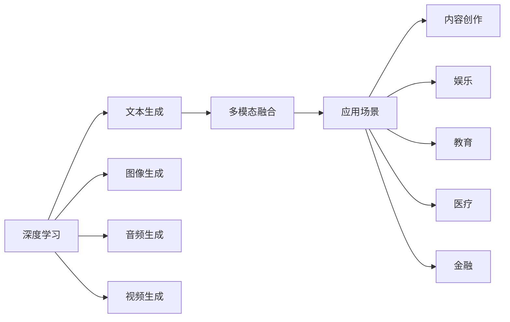

                 

# AIGC技术的普及程度分析

> 关键词：人工智能生成内容(AIGC)，技术普及，深度学习，自然语言处理，多模态融合，应用场景，行业前景

## 1. 背景介绍

随着人工智能(AI)技术的飞速发展，人工智能生成内容(AIGC)成为当前科技前沿和热点。AIGC技术通过深度学习模型，自动生成高质量的文本、图像、音频、视频等内容，满足了人们对海量、个性化、创新内容的需求。然而，尽管AIGC技术已经取得了显著的进展，其在不同行业和应用场景中的普及程度仍然参差不齐，本文章将对AIGC技术的普及程度进行详细分析。

## 2. 核心概念与联系

### 2.1 核心概念概述

为了更好地理解AIGC技术的普及程度，首先需明确以下核心概念：

- **AIGC（人工智能生成内容）**：使用人工智能技术自动生成文本、图像、音频、视频等内容，旨在提高内容创作的效率和质量。
- **深度学习**：基于神经网络的学习方式，通过大量数据训练模型，使其具备自主学习和决策能力。
- **自然语言处理(NLP)**：研究计算机如何理解、解释、处理人类语言的技术。
- **多模态融合**：将图像、文本、音频、视频等多源数据进行综合分析，提升生成内容的丰富性和真实性。
- **应用场景**：AIGC技术被广泛应用于内容创作、娱乐、教育、医疗、金融等领域，形成了多样化的应用形态。
- **行业前景**：随着技术成熟度的提升，AIGC技术将加速各行各业的数字化转型，推动经济社会的全面进步。

通过这些概念，我们可以理解AIGC技术如何基于深度学习算法，自动生成各种形式的内容，同时能够通过多模态融合提升生成内容的丰富性和真实性，并且能够基于行业应用场景实现普及和推广。

### 2.2 核心概念原理和架构的 Mermaid 流程图



## 3. 核心算法原理 & 具体操作步骤

### 3.1 算法原理概述

AIGC技术的核心算法主要是基于深度学习模型的生成模型。这些模型通常基于自回归模型（如RNN、GRU、LSTM等）或自编码模型（如VQ-VAE、GAN等），利用大规模数据集进行训练，学习生成特定类型的输出。

常见的生成模型包括：

- **语言模型**：如GPT、BERT等，用于自动生成文本内容。
- **图像生成模型**：如GAN、PixelRNN等，用于自动生成图像。
- **音频生成模型**：如WaveNet、VQ-VAE等，用于自动生成音频。
- **视频生成模型**：如PixelRNN-Video、VideoGAN等，用于自动生成视频。

这些生成模型在各自的领域内广泛应用，形成了多模态融合的AIGC技术体系。

### 3.2 算法步骤详解

#### 3.2.1 数据准备

数据准备是AIGC技术应用的基础。根据具体应用场景，需收集、清洗和标注相应的数据集。例如：

- 文本数据集：包括小说、新闻、对话等，用于训练文本生成模型。
- 图像数据集：包括图像、图片、视频帧等，用于训练图像生成模型。
- 音频数据集：包括语音、音乐等，用于训练音频生成模型。
- 视频数据集：包括视频片段、动画等，用于训练视频生成模型。

#### 3.2.2 模型选择与训练

选择合适的生成模型，并使用标注好的数据集进行训练。例如：

- 使用语言模型生成文本：如GPT-3、T5等，训练时需要设置适当的超参数，如学习率、批大小、训练轮数等。
- 使用图像生成模型生成图像：如GAN、PixelRNN等，训练时需注意损失函数的设计，如生成对抗网络中的Wasserstein距离等。
- 使用音频生成模型生成音频：如WaveNet、VQ-VAE等，训练时需考虑音频的时序性特征，如使用自注意力机制。
- 使用视频生成模型生成视频：如PixelRNN-Video、VideoGAN等，训练时需考虑视频的时序性和空间分辨率等。

#### 3.2.3 模型评估与优化

评估模型的生成效果，通常采用BLEU、ROUGE、FID等指标，通过评估指标反应用户的反馈和模型的输出质量。

例如，对文本生成模型，可以使用BLEU、ROUGE等评估生成文本与参考文本的相似度。对图像生成模型，可以使用FID、IS等评估生成图像与真实图像的差异。对音频生成模型，可以使用MOS等评估生成音频的自然度。对视频生成模型，可以使用VMAF、PSNR等评估生成视频的清晰度和流畅度。

根据评估结果，进一步调整模型参数，进行优化训练。

### 3.3 算法优缺点

#### 3.3.1 优点

AIGC技术的主要优点包括：

- **高效生成**：基于深度学习模型，可以快速生成大量高质量的内容。
- **多样化输出**：支持生成文本、图像、音频、视频等多种形式的内容。
- **广泛应用**：涵盖内容创作、娱乐、教育、医疗、金融等多个领域，应用场景广泛。

#### 3.3.2 缺点

AIGC技术的主要缺点包括：

- **缺乏创造性**：生成的内容可能缺乏独特的创意和风格，依赖输入样本。
- **伦理问题**：生成的内容可能存在版权争议、错误信息等，需严格审核和监管。
- **依赖高质量数据**：生成效果依赖标注数据的数量和质量，数据不足或标注不准确可能影响模型表现。

### 3.4 算法应用领域

#### 3.4.1 内容创作

AIGC技术在内容创作领域的应用非常广泛。例如：

- **自动写文**：利用语言模型生成文章、新闻、报告等，提高内容创作的效率。
- **自动写诗**：利用生成模型生成古诗、现代诗等，丰富文学作品的多样性。
- **自动写广告**：利用生成模型生成广告文案，提高广告创意的多样性和覆盖面。

#### 3.4.2 娱乐

AIGC技术在娱乐领域的应用也得到了广泛关注。例如：

- **自动生成音乐**：利用音频生成模型生成音乐、歌曲等，丰富音乐创作的形式和风格。
- **自动生成动画**：利用视频生成模型生成动画、短片等，提高动画制作的效率和创意。
- **自动生成游戏内容**：利用生成模型生成游戏剧情、角色等，提高游戏开发的速度和多样性。

#### 3.4.3 教育

AIGC技术在教育领域的应用潜力巨大。例如：

- **自动生成教材**：利用生成模型生成教科书、习题等，提高教材的更新速度和丰富性。
- **自动生成教学视频**：利用视频生成模型生成教学视频，提高教学视频的多样性和互动性。
- **自动生成教学问答**：利用生成模型生成教学问题、答案等，提高教学互动的效率和效果。

#### 3.4.4 医疗

AIGC技术在医疗领域的应用也逐渐兴起。例如：

- **自动生成医疗报告**：利用生成模型生成医学报告、病理报告等，提高医生的工作效率。
- **自动生成手术指导**：利用生成模型生成手术指南、演示视频等，提高手术的规范性和安全性。
- **自动生成健康建议**：利用生成模型生成健康建议、康复方案等，提高患者的治疗效果。

#### 3.4.5 金融

AIGC技术在金融领域的应用也具有很大的潜力。例如：

- **自动生成金融报告**：利用生成模型生成财务报告、市场分析报告等，提高金融分析的效率和深度。
- **自动生成投资策略**：利用生成模型生成投资建议、交易策略等，提高投资决策的准确性和及时性。
- **自动生成风险预警**：利用生成模型生成风险预警、风险报告等，提高风险管理的效率和效果。

## 4. 数学模型和公式 & 详细讲解 & 举例说明

### 4.1 数学模型构建

本节将使用数学语言对AIGC技术的生成模型进行更加严格的刻画。

假设生成的内容为 $X$，对应的标签为 $Y$。定义生成模型的概率分布为 $p(X|Y)$，通过深度学习模型训练得到 $p(X|Y)$ 的概率分布，从而实现基于标签 $Y$ 的生成。

### 4.2 公式推导过程

#### 4.2.1 文本生成

文本生成模型通常基于自回归模型，如GPT、LSTM等。假设模型为 $p(x_i|x_{<i},y)$，表示在已知输入 $x_{<i}$ 的情况下，生成下一个字符 $x_i$ 的概率。则文本生成的概率分布为：

$$
p(X|Y) = \prod_{i=1}^{n} p(x_i|x_{<i},y)
$$

#### 4.2.2 图像生成

图像生成模型通常基于生成对抗网络（GAN），如DCGAN、PixelRNN等。假设生成模型为 $G(z)$，表示将噪声向量 $z$ 转换为图像 $X$。则图像生成的概率分布为：

$$
p(X|Y) = p(G(z)|Y)
$$

其中 $z$ 为噪声向量，通常假设为高斯分布 $z \sim N(0,\sigma^2)$。

#### 4.2.3 音频生成

音频生成模型通常基于变分自编码器（VAE），如WaveNet、VQ-VAE等。假设生成模型为 $G(z)$，表示将噪声向量 $z$ 转换为音频 $X$。则音频生成的概率分布为：

$$
p(X|Y) = p(G(z)|Y)
$$

其中 $z$ 为噪声向量，通常假设为标准正态分布 $z \sim N(0,1)$。

#### 4.2.4 视频生成

视频生成模型通常基于循环神经网络（RNN），如PixelRNN-Video、VideoGAN等。假设生成模型为 $G(z)$，表示将噪声向量 $z$ 转换为视频帧 $X$。则视频生成的概率分布为：

$$
p(X|Y) = p(G(z)|Y)
$$

其中 $z$ 为噪声向量，通常假设为标准正态分布 $z \sim N(0,1)$。

### 4.3 案例分析与讲解

#### 4.3.1 文本生成案例

以语言模型GPT为例，分析其生成文本的机制。假设训练数据为英文小说，模型的输入为前N个字符，输出为下一个字符。则模型的训练目标为：

$$
\min_{\theta} \mathbb{E}_{(x,y) \sim p(X,Y)}[\log p(x|x_{<i},y)]
$$

其中 $\theta$ 为模型参数。训练过程如下：

1. 收集并清洗训练数据，生成数据集。
2. 选择适当的模型结构，如Transformer，并设定超参数。
3. 使用训练数据进行前向传播和反向传播，更新模型参数。
4. 评估模型的生成效果，调整超参数，重新训练。

#### 4.3.2 图像生成案例

以GAN为例，分析其生成图像的机制。假设生成模型为DCGAN，判别模型为CNN。模型的训练目标为：

$$
\min_{G} \max_{D} \mathbb{E}_{z \sim p(z)}[\log D(G(z))] + \mathbb{E}_{x \sim p(x)}[\log(1-D(G(x)))]
$$

其中 $G$ 为生成模型，$D$ 为判别模型，$p(z)$ 为噪声分布，$p(x)$ 为真实图像分布。训练过程如下：

1. 收集并清洗训练数据，生成数据集。
2. 选择适当的生成器和判别器结构，并设定超参数。
3. 使用训练数据进行前向传播和反向传播，更新生成器和判别器参数。
4. 评估模型的生成效果，调整超参数，重新训练。

## 5. 项目实践：代码实例和详细解释说明

### 5.1 开发环境搭建

在进行AIGC技术项目实践前，我们需要准备好开发环境。以下是使用Python进行TensorFlow开发的环境配置流程：

1. 安装Anaconda：从官网下载并安装Anaconda，用于创建独立的Python环境。

2. 创建并激活虚拟环境：
```bash
conda create -n aigc-env python=3.8 
conda activate aigc-env
```

3. 安装TensorFlow：根据CUDA版本，从官网获取对应的安装命令。例如：
```bash
conda install tensorflow-gpu -c conda-forge
```

4. 安装Keras：
```bash
pip install keras
```

5. 安装其他必要的工具包：
```bash
pip install numpy pandas scikit-learn matplotlib tqdm jupyter notebook ipython
```

完成上述步骤后，即可在`aigc-env`环境中开始AIGC技术的项目实践。

### 5.2 源代码详细实现

下面是使用TensorFlow实现文本生成模型的代码实例：

```python
import tensorflow as tf
from tensorflow.keras import layers
import numpy as np

# 定义模型
class TextGenerator(tf.keras.Model):
    def __init__(self, vocab_size, embedding_dim, rnn_units):
        super(TextGenerator, self).__init__()
        self.embedding = layers.Embedding(vocab_size, embedding_dim)
        self.gru = layers.GRU(rnn_units, return_sequences=True)
        self.dense = layers.Dense(vocab_size)

    def call(self, x):
        x = self.embedding(x)
        x = self.gru(x, return_sequences=True)
        x = self.dense(x[:, -1, :])
        return x

# 加载数据
with open('text_data.txt', 'r') as f:
    text = f.read().lower()
vocab = sorted(set(text))
vocab_size = len(vocab)
char_to_idx = {char: idx for idx, char in enumerate(vocab)}
idx_to_char = np.array(vocab)

# 构建数据集
text_length = len(text)
batch_size = 64
seq_length = 100

# 构建训练集
input_texts = []
target_texts = []
for i in range(0, text_length - seq_length, seq_length):
    input_texts.append(text[i:i+seq_length])
    target_texts.append(text[i+1:i+seq_length+1])

input_texts = np.array(input_texts)
target_texts = np.array(target_texts)

# 构建输入输出数据集
x_train = []
y_train = []
for i in range(0, len(input_texts) - seq_length, 1):
    x_train.append(input_texts[i:i+seq_length])
    y_train.append(target_texts[i:i+seq_length])

# 构建模型
model = TextGenerator(vocab_size, embedding_dim=128, rnn_units=256)
model.compile(optimizer=tf.keras.optimizers.Adam(), loss='categorical_crossentropy')

# 训练模型
model.fit(x_train, y_train, epochs=50, batch_size=batch_size)
```

### 5.3 代码解读与分析

让我们再详细解读一下关键代码的实现细节：

**TextGenerator类**：
- `__init__`方法：初始化模型的嵌入层、RNN层和输出层。
- `call`方法：实现模型的前向传播过程，包括嵌入、GRU层和输出层。

**数据准备**：
- 使用Python内置的`open`函数读取文本文件，转换为小写，并去除重复字符。
- 构建字符到索引的映射关系，方便模型训练。
- 构建训练集，将文本数据分成输入和目标，每一段输入对应下一段目标。

**模型训练**：
- 使用`TextGenerator`类定义模型结构，并进行编译。
- 使用`fit`函数训练模型，指定训练轮数和批大小。

### 5.4 运行结果展示

训练完成后，可以使用生成的模型进行文本生成。例如，输入一个前缀"once upon a time"，模型可以生成一段与前缀风格一致的文本。

## 6. 实际应用场景

### 6.1 娱乐

AIGC技术在娱乐领域的应用非常广泛。例如：

- **自动生成音乐**：利用音频生成模型生成音乐、歌曲等，丰富音乐创作的形式和风格。
- **自动生成动画**：利用视频生成模型生成动画、短片等，提高动画制作的效率和创意。
- **自动生成游戏内容**：利用生成模型生成游戏剧情、角色等，提高游戏开发的速度和多样性。

### 6.2 教育

AIGC技术在教育领域的应用潜力巨大。例如：

- **自动生成教材**：利用生成模型生成教科书、习题等，提高教材的更新速度和丰富性。
- **自动生成教学视频**：利用视频生成模型生成教学视频，提高教学视频的多样性和互动性。
- **自动生成教学问答**：利用生成模型生成教学问题、答案等，提高教学互动的效率和效果。

### 6.3 医疗

AIGC技术在医疗领域的应用也逐渐兴起。例如：

- **自动生成医疗报告**：利用生成模型生成医学报告、病理报告等，提高医生的工作效率。
- **自动生成手术指导**：利用生成模型生成手术指南、演示视频等，提高手术的规范性和安全性。
- **自动生成健康建议**：利用生成模型生成健康建议、康复方案等，提高患者的治疗效果。

### 6.4 金融

AIGC技术在金融领域的应用也具有很大的潜力。例如：

- **自动生成金融报告**：利用生成模型生成财务报告、市场分析报告等，提高金融分析的效率和深度。
- **自动生成投资策略**：利用生成模型生成投资建议、交易策略等，提高投资决策的准确性和及时性。
- **自动生成风险预警**：利用生成模型生成风险预警、风险报告等，提高风险管理的效率和效果。

## 7. 工具和资源推荐

### 7.1 学习资源推荐

为了帮助开发者系统掌握AIGC技术的理论基础和实践技巧，这里推荐一些优质的学习资源：

1. **《深度学习》课程**：斯坦福大学开设的深度学习课程，系统介绍了深度学习的核心概念和算法。
2. **《自然语言处理》课程**：自然语言处理领域的经典教材，详细讲解了自然语言处理的基本理论和前沿技术。
3. **TensorFlow官方文档**：TensorFlow的官方文档，提供了丰富的学习资料和样例代码。
4. **Keras官方文档**：Keras的官方文档，提供了简单易用的深度学习模型API。
5. **《生成对抗网络》书籍**：介绍生成对抗网络的基本原理和应用。

通过对这些资源的学习实践，相信你一定能够快速掌握AIGC技术的精髓，并用于解决实际的NLP问题。

### 7.2 开发工具推荐

高效的开发离不开优秀的工具支持。以下是几款用于AIGC技术开发的常用工具：

1. **TensorFlow**：基于Python的开源深度学习框架，灵活性强，支持分布式训练和部署。
2. **Keras**：高层次的深度学习API，易于上手，提供了丰富的预训练模型和算法。
3. **PyTorch**：基于Python的开源深度学习框架，支持动态计算图和GPU加速。
4. **Jupyter Notebook**：交互式的代码开发环境，便于实验和分享代码。
5. **Google Colab**：谷歌提供的免费Jupyter Notebook环境，支持GPU和TPU计算资源。

合理利用这些工具，可以显著提升AIGC技术的开发效率，加快创新迭代的步伐。

### 7.3 相关论文推荐

AIGC技术的发展源于学界的持续研究。以下是几篇奠基性的相关论文，推荐阅读：

1. **《Attention is All You Need》**：Transformer模型的原论文，介绍了自注意力机制的应用。
2. **《Language Models are Unsupervised Multitask Learners》**：提出语言模型的无监督学习范式，刷新了多项NLP任务SOTA。
3. **《Generative Adversarial Nets》**：生成对抗网络（GAN）的奠基论文，提出了GAN的基本结构和训练方法。
4. **《WaveNet: A Generative Model for Raw Audio》**：介绍WaveNet生成音频的原理和实现方法。
5. **《Pix2Pix》**：提出生成对抗网络在图像生成中的应用，实现了高质量的图像生成。

这些论文代表了大规模生成模型的发展脉络。通过学习这些前沿成果，可以帮助研究者把握AIGC技术的发展方向，激发更多的创新灵感。

## 8. 总结：未来发展趋势与挑战

### 8.1 未来发展趋势

展望未来，AIGC技术将呈现以下几个发展趋势：

1. **模型规模持续增大**：随着算力成本的下降和数据规模的扩张，生成模型将越来越大，生成效果将更加丰富和逼真。
2. **生成内容多样化**：生成模型将支持更多类型的内容，如视频、动画、虚拟角色等，形成多样化的应用形态。
3. **多模态融合普及**：生成模型将融合图像、文本、音频、视频等多种模态信息，生成更加丰富和逼真的内容。
4. **实时生成普及**：生成模型将支持实时生成，适应更多场景下的即时需求，如自动翻译、实时字幕等。
5. **交互生成普及**：生成模型将支持交互式生成，根据用户的输入和反馈，动态生成内容，提升用户体验。

### 8.2 面临的挑战

尽管AIGC技术已经取得了显著的进展，但在迈向更加智能化、普适化应用的过程中，它仍面临诸多挑战：

1. **数据依赖性高**：生成模型的效果依赖大量标注数据，标注成本高昂，数据采集和处理繁琐。
2. **模型复杂性高**：生成模型通常包含大量参数，训练和推理过程复杂，对计算资源要求高。
3. **伦理和法律问题**：生成的内容可能存在版权争议、错误信息等，需严格审核和监管。
4. **可解释性不足**：生成模型的决策过程缺乏可解释性，难以解释其内部工作机制和输出逻辑。
5. **鲁棒性差**：生成的内容可能存在模型偏见和过拟合，对小样本数据和噪声敏感。

### 8.3 未来突破

面对AIGC技术所面临的种种挑战，未来的研究需要在以下几个方面寻求新的突破：

1. **无监督学习**：探索无监督和半监督学习范式，降低对大量标注数据的依赖，实现更高效的内容生成。
2. **多模态融合**：将符号化的先验知识与神经网络模型进行融合，提升生成内容的丰富性和真实性。
3. **模型优化**：开发更高效的生成模型，支持实时生成和交互生成，提升用户体验。
4. **伦理和法律研究**：加强伦理和法律研究，制定相关标准和规范，确保AIGC技术的可持续发展。
5. **可解释性研究**：研究生成模型的可解释性，提供更加透明和可控的内容生成过程。

这些研究方向的探索，必将引领AIGC技术迈向更高的台阶，为构建安全、可靠、可解释、可控的智能系统铺平道路。面向未来，AIGC技术还需要与其他人工智能技术进行更深入的融合，如知识表示、因果推理、强化学习等，多路径协同发力，共同推动人工智能技术的发展。

## 9. 附录：常见问题与解答

**Q1：AIGC技术如何保证生成内容的多样性和真实性？**

A: AIGC技术通过多模态融合、数据增强、对抗生成等技术手段，保证生成内容的多样性和真实性。例如：

1. 利用多模态融合技术，将文本、图像、音频等多种数据进行综合分析，提升生成内容的丰富性和真实性。
2. 使用数据增强技术，通过回译、近义替换等方式扩充训练集，提升模型的泛化能力。
3. 引入对抗生成技术，生成对抗网络（GAN）通过对抗训练，提升生成内容的真实性和多样性。

**Q2：AIGC技术如何实现实时生成和交互生成？**

A: AIGC技术通过实时训练和交互式生成技术，实现实时生成和交互生成。例如：

1. 实时训练：使用流式数据进行模型训练，支持实时生成。
2. 交互式生成：利用生成模型和用户交互，根据用户的输入和反馈，动态生成内容，提升用户体验。

**Q3：AIGC技术在实际应用中需要注意哪些问题？**

A: AIGC技术在实际应用中需要注意以下问题：

1. 数据隐私和安全：生成的内容可能涉及用户隐私，需严格保护用户数据。
2. 伦理和法律问题：生成的内容可能存在版权争议、错误信息等，需严格审核和监管。
3. 鲁棒性问题：生成的内容可能存在模型偏见和过拟合，需进行鲁棒性测试和优化。
4. 可解释性问题：生成的内容缺乏可解释性，需提供透明和可控的内容生成过程。

---

作者：禅与计算机程序设计艺术 / Zen and the Art of Computer Programming

