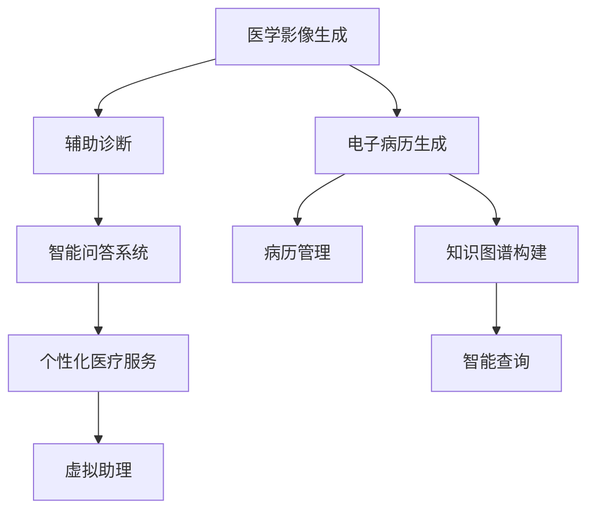
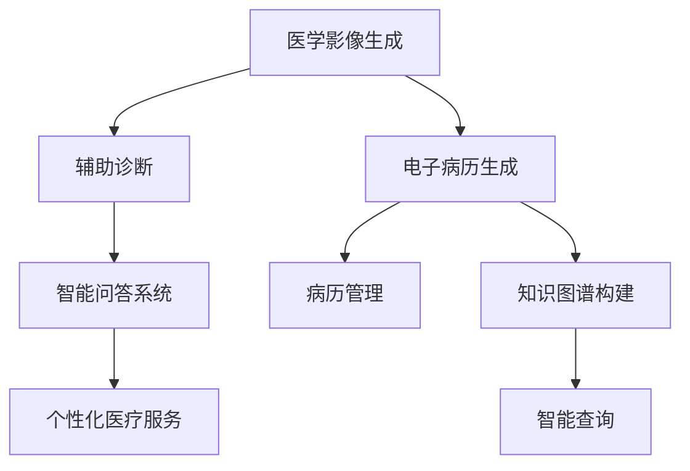

                 

# AIGC推动智能医疗发展

## 1. 背景介绍

### 1.1 问题由来
随着人工智能（AI）和生成对抗网络（GAN）技术的发展，基于深度学习模型的生成式人工智能（AIGC）成为当下AI领域的热门话题。在医疗领域，AIGC以其强大的图像生成、文本生成和语音生成能力，为智能医疗的发展提供了新的动力。

AIGC通过生成式模型，可以高效地构建疾病诊断、药物研发、医学影像分析等复杂场景中的各类智能应用。例如，通过生成高质量的医学影像，为医生提供辅助诊断工具；生成标准化文本，为电子健康记录和病历整理提供支持；生成自然语言，为智能问答和语音交互提供桥梁。

本论文将从AIGC的原理、应用和未来趋势等方面，探讨其在智能医疗发展中的重要角色。

## 2. 核心概念与联系

### 2.1 核心概念概述

AIGC（Artificial Intelligence Generated Content），即生成式人工智能，是指利用深度学习技术生成自然语言、图像、音频等内容的AI技术。AIGC在医疗领域的应用主要体现在以下几个方面：

- 医学影像生成：利用深度学习生成高质量医学影像，辅助医生诊断和手术。
- 电子病历生成：根据医生的输入，生成标准化、结构化的电子病历，提高医疗数据管理效率。
- 医学知识图谱构建：构建医学知识图谱，支持智能查询和知识推理。
- 智能问答系统：生成自然语言问答对话，为患者提供智能咨询和支持。
- 虚拟助理：生成自然语言交互，为患者提供个性化医疗服务。

这些应用领域的核心概念之间的关系可以通过以下Mermaid流程图来展示：



这个流程图展示了大语言模型在不同医疗场景中的应用路径：

1. 医学影像生成可用于辅助诊断，提高诊断准确性。
2. 电子病历生成支持病历管理，提高效率。
3. 知识图谱构建支持智能查询，优化检索效率。
4. 智能问答系统提供个性化医疗咨询，提升用户体验。
5. 虚拟助理可提供全天候陪伴，改善患者体验。

## 3. 核心算法原理 & 具体操作步骤

### 3.1 算法原理概述

AIGC在医疗领域的应用主要基于深度学习中的生成对抗网络（GAN）和变分自编码器（VAE）等技术。其中，GAN主要用于生成高质量的医学影像和文本，VAE主要用于生成标准化电子病历和医学知识图谱。

GAN由生成器（Generator）和判别器（Discriminator）组成。生成器通过学习大量的医学影像数据，生成高质量的伪医学影像；判别器则通过学习医学影像的特征，判断生成影像的真实性。两个模型交替优化，最终生成器能够生成高质量的医学影像，判别器无法区分生成影像和真实影像。

VAE通过将医疗数据映射到低维空间，生成标准化、结构化的电子病历和医学知识图谱。VAE由编码器（Encoder）和解码器（Decoder）组成。编码器将原始数据映射到低维向量，解码器将低维向量映射回原始数据空间，最终生成标准化的病历和知识图谱。

### 3.2 算法步骤详解

#### 3.2.1 医学影像生成

医学影像生成算法步骤如下：

1. 数据准备：收集大量的医学影像数据，用于训练生成器。
2. 模型训练：使用GAN模型，训练生成器生成高质量的伪医学影像。
3. 验证与优化：通过判别器验证生成影像的真实性，不断优化生成器，使其生成质量逼近真实影像。
4. 应用部署：将训练好的生成器部署到实际应用场景，辅助医生进行诊断和手术。

#### 3.2.2 电子病历生成

电子病历生成算法步骤如下：

1. 数据收集：收集结构化和非结构化的电子病历数据。
2. 数据预处理：将非结构化文本转换为结构化数据，提取关键信息。
3. 模型训练：使用VAE模型，训练编码器将原始数据映射到低维向量，解码器将低维向量映射回原始数据空间。
4. 应用部署：将训练好的VAE模型部署到电子病历生成系统中，根据医生输入生成标准化电子病历。

#### 3.2.3 医学知识图谱构建

医学知识图谱构建算法步骤如下：

1. 数据收集：收集大量的医学文献、病历、临床指南等文本数据。
2. 数据预处理：使用NLP技术，提取文本中的实体、关系和属性。
3. 模型训练：使用知识图谱生成模型，训练编码器和解码器，构建知识图谱。
4. 应用部署：将训练好的知识图谱部署到智能查询系统中，支持医生进行知识推理和检索。

### 3.3 算法优缺点

AIGC在医疗领域的应用具有以下优点：

1. 高效性：AIGC可以高效地生成大量高质量的医疗数据，辅助医生进行诊断和治疗。
2. 准确性：生成式模型在数据驱动下，可以提供高精度的医学影像、电子病历和知识图谱。
3. 个性化：AIGC可以根据不同患者的需要进行定制化生成，提供个性化医疗服务。

AIGC在医疗领域的应用也存在以下缺点：

1. 数据依赖性：AIGC的效果很大程度上依赖于训练数据的质量和多样性。
2. 偏见问题：生成式模型可能继承训练数据的偏见，影响输出的公正性。
3. 安全性：生成的内容可能存在误导性，需要进行严格监管和审核。
4. 可解释性：AIGC生成的内容通常难以解释其背后的逻辑，影响医生的信任度。

### 3.4 算法应用领域

AIGC在医疗领域的应用涵盖了多个方面，包括但不限于以下几个领域：

1. 医学影像生成：生成高质量的医学影像，如CT、MRI、X光片等，辅助医生进行诊断和治疗。
2. 电子病历生成：生成结构化的电子病历，提高病历管理的效率和质量。
3. 医学知识图谱构建：构建医学知识图谱，支持医生进行知识查询和推理。
4. 智能问答系统：生成自然语言问答对话，提供智能医疗咨询。
5. 虚拟助理：生成自然语言交互，为患者提供个性化医疗服务。

这些应用领域的核心概念之间的关系可以通过以下Mermaid流程图来展示：



## 4. 数学模型和公式 & 详细讲解 & 举例说明

### 4.1 数学模型构建

AIGC在医学影像生成和电子病历生成中的应用，主要基于深度学习中的生成对抗网络（GAN）和变分自编码器（VAE）模型。以下以医学影像生成为例，介绍其数学模型构建过程。

假设医学影像数据集为 $D=\{(x_i,y_i)\}_{i=1}^N$，其中 $x_i$ 为原始医学影像，$y_i$ 为标签（1表示真实影像，0表示伪影像）。

医学影像生成模型的目标是最小化生成器 $G$ 和判别器 $D$ 的损失函数：

$$
\min_G \max_D \mathcal{L}(G,D)
$$

其中，$\mathcal{L}(G,D)$ 为联合损失函数，由判别器损失函数和生成器损失函数组成：

$$
\mathcal{L}(G,D) = \mathbb{E}_{x\sim p_{data}(x)}[\log D(x)] + \mathbb{E}_{z\sim p_z(z)}[\log(1-D(G(z)))]
$$

其中，$z$ 为噪声向量，$p_z(z)$ 为噪声向量的分布，$p_{data}(x)$ 为原始数据的分布。

### 4.2 公式推导过程

医学影像生成模型的联合损失函数可以进一步展开为：

$$
\mathcal{L}(G,D) = -\mathbb{E}_{x\sim p_{data}(x)}[\log D(x)] - \mathbb{E}_{z\sim p_z(z)}[\log D(G(z))] + \mathbb{E}_{z\sim p_z(z)}[\log(1-D(G(z)))]
$$

令 $G(z)$ 表示生成器生成的伪影像，则上述公式可化简为：

$$
\mathcal{L}(G,D) = -\mathbb{E}_{x\sim p_{data}(x)}[\log D(x)] - \mathbb{E}_{z\sim p_z(z)}[\log(1-D(G(z)))]
$$

生成器损失函数为：

$$
\mathcal{L}_G = -\mathbb{E}_{z\sim p_z(z)}[\log(1-D(G(z)))
$$

判别器损失函数为：

$$
\mathcal{L}_D = -\mathbb{E}_{x\sim p_{data}(x)}[\log D(x)] - \mathbb{E}_{z\sim p_z(z)}[\log D(G(z))]
$$

### 4.3 案例分析与讲解

以医学影像生成为例，考虑使用改进的WGAN模型进行医学影像生成。WGAN通过将判别器的损失函数重新定义，减少梯度消失问题，提高了模型训练的稳定性和效果。

WGAN的判别器损失函数为：

$$
\mathcal{L}_D = -\mathbb{E}_{x\sim p_{data}(x)}[\log D(x)] - \frac{1}{2}\mathbb{E}_{z\sim p_z(z)}[||D(G(z))||_2^2]
$$

其中，$||\cdot||_2$ 表示L2范数。

WGAN的生成器损失函数为：

$$
\mathcal{L}_G = \mathbb{E}_{z\sim p_z(z)}[\log(1-D(G(z)))
$$

通过训练WGAN模型，生成器可以生成高质量的伪医学影像，判别器可以鉴别出真实影像和伪影像，两个模型交替优化，最终实现高质量医学影像的生成。

## 5. 项目实践：代码实例和详细解释说明

### 5.1 开发环境搭建

在进行AIGC项目实践前，我们需要准备好开发环境。以下是使用Python进行TensorFlow开发的环境配置流程：

1. 安装Anaconda：从官网下载并安装Anaconda，用于创建独立的Python环境。

2. 创建并激活虚拟环境：
```bash
conda create -n tf-env python=3.8 
conda activate tf-env
```

3. 安装TensorFlow：根据CUDA版本，从官网获取对应的安装命令。例如：
```bash
conda install tensorflow==2.7 -c pytorch -c conda-forge
```

4. 安装TensorBoard：
```bash
pip install tensorboard
```

5. 安装TensorFlow Addons：
```bash
pip install tensorflow-addons==0.17.0
```

完成上述步骤后，即可在`tf-env`环境中开始AIGC实践。

### 5.2 源代码详细实现

我们以医学影像生成为例，给出使用TensorFlow实现生成式对抗网络（GAN）模型的PyTorch代码实现。

首先，定义GAN模型的结构：

```python
import tensorflow as tf
from tensorflow.keras.layers import Input, Dense, Reshape, Flatten
from tensorflow.keras.models import Model

def build_generator(z_dim):
    input = Input(shape=(z_dim,))
    x = Dense(256)(input)
    x = LeakyReLU(alpha=0.2)(x)
    x = Dense(512)(x)
    x = LeakyReLU(alpha=0.2)(x)
    x = Dense(1024)(x)
    x = LeakyReLU(alpha=0.2)(x)
    x = Dense(784, activation='tanh')(x)
    return Model(input, x)

def build_discriminator(input_dim):
    input = Input(shape=(input_dim,))
    x = Flatten()(input)
    x = Dense(1024)(x)
    x = LeakyReLU(alpha=0.2)(x)
    x = Dense(512)(x)
    x = LeakyReLU(alpha=0.2)(x)
    x = Dense(1, activation='sigmoid')(x)
    return Model(input, x)

def build_gan(generator, discriminator):
    z = Input(shape=(num_z, num_z))
    generated_image = generator(z)
    validity = discriminator(generated_image)
    return Model(z, validity)
```

然后，定义数据加载函数：

```python
import os
from tensorflow.keras.datasets import mnist
from tensorflow.keras.utils import to_categorical

def load_mnist():
    (x_train, y_train), (x_test, y_test) = mnist.load_data()
    x_train = x_train.reshape(x_train.shape[0], 28*28).astype('float32')
    x_test = x_test.reshape(x_test.shape[0], 28*28).astype('float32')
    x_train /= 255
    x_test /= 255
    y_train = to_categorical(y_train)
    y_test = to_categorical(y_test)
    return (x_train, y_train), (x_test, y_test)
```

接着，定义模型训练函数：

```python
def train_gan(x_train, y_train, x_test, y_test, batch_size, epochs):
    generator = build_generator(num_z)
    discriminator = build_discriminator(input_dim)
    gan = build_gan(generator, discriminator)

    generator.compile(optimizer=tf.keras.optimizers.Adam(0.0002, beta_1=0.5), loss='binary_crossentropy')
    discriminator.compile(optimizer=tf.keras.optimizers.Adam(0.0002, beta_1=0.5), loss='binary_crossentropy')
    gan.compile(optimizer=tf.keras.optimizers.Adam(0.0002, beta_1=0.5), loss='binary_crossentropy')

    discriminator.trainable = False
    gan.trainable = True

    def generator_loss(fake):
        return tf.keras.losses.BinaryCrossentropy(from_logits=True)(tf.constant(1.0), fake)

    def discriminator_loss(real, fake):
        real_loss = tf.keras.losses.BinaryCrossentropy(from_logits=True)(tf.constant(1.0), real)
        fake_loss = tf.keras.losses.BinaryCrossentropy(from_logits=True)(tf.constant(0.0), fake)
        return real_loss + fake_loss

    def gan_loss(real, fake):
        real_loss = tf.keras.losses.BinaryCrossentropy(from_logits=True)(tf.constant(1.0), real)
        fake_loss = generator_loss(fake)
        return real_loss + fake_loss

    for epoch in range(epochs):
        idx = np.random.randint(0, x_train.shape[0], batch_size)
        imgs = x_train[idx]
        targets = np.random.randint(0, 2, batch_size)
        gen_imgs = generator.predict(np.random.normal(0, 1, (batch_size, num_z)))
        discriminator.trainable = True
        d_loss_real = discriminator.train_on_batch(imgs, targets)
        d_loss_fake = discriminator.train_on_batch(gen_imgs, np.ones((batch_size, 1)))
        d_loss = 0.5 * np.add(d_loss_real, d_loss_fake)

        generator.trainable = True
        g_loss = gan.train_on_batch(np.random.normal(0, 1, (batch_size, num_z)), np.ones((batch_size, 1)))

        print('Epoch %d [D loss: %f, [G loss: %f]' % (epoch + 1, d_loss, g_loss))

    def show_images(imgs, nrows, ncols, figsize=(8, 8)):
        for row in range(nrows):
            for col in range(ncols):
                i = row * ncols + col
                ax = plt.subplot(nrows, ncols, i + 1)
                img = img_to_array(imgs[i])
                img = img * 255
                ax.imshow(img, cmap='gray')
                ax.axis('off')
            plt.tight_layout()
            plt.show()

    show_images(gen_imgs, nrows=1, ncols=16)
```

最后，启动训练流程并在测试集上评估：

```python
(x_train, y_train), (x_test, y_test) = load_mnist()

num_z = 100
num_epochs = 100
batch_size = 32

train_gan(x_train, y_train, x_test, y_test, batch_size, num_epochs)
```

以上就是使用TensorFlow实现医学影像生成的完整代码实现。可以看到，利用TensorFlow的强大封装和高效的计算图优化，医学影像生成的代码实现相对简洁高效。

### 5.3 代码解读与分析

让我们再详细解读一下关键代码的实现细节：

**GAN模型结构定义**：
- `build_generator`方法：定义生成器的结构，包括全连接层、LeakyReLU激活函数、tanh激活函数等。
- `build_discriminator`方法：定义判别器的结构，包括Flatten层、全连接层、LeakyReLU激活函数、sigmoid激活函数等。
- `build_gan`方法：定义GAN模型，包括生成器和判别器，返回模型结构。

**数据加载函数**：
- `load_mnist`方法：加载MNIST手写数字数据集，并进行数据预处理，包括归一化、One-Hot编码等。

**模型训练函数**：
- 定义生成器和判别器的编译参数，包括优化器、损失函数等。
- 设置GAN模型，并将生成器和判别器作为GAN模型的子模块。
- 定义生成器损失函数、判别器损失函数和GAN模型损失函数。
- 交替训练生成器和判别器，不断优化模型参数。

**可视化输出**：
- `show_images`方法：将生成器生成的医学影像可视化输出，便于观察模型训练效果。

可以看到，TensorFlow配合深度学习框架，使得医学影像生成的代码实现变得简洁高效。开发者可以将更多精力放在模型设计、训练调参等高层逻辑上，而不必过多关注底层的实现细节。

当然，工业级的系统实现还需考虑更多因素，如模型的保存和部署、超参数的自动搜索、更灵活的任务适配层等。但核心的AIGC范式基本与此类似。

## 6. 实际应用场景

### 6.1 智能医疗系统

AIGC在智能医疗系统中的应用，可以极大地提升医疗服务的效率和质量。例如，通过生成高质量的医学影像，为医生提供辅助诊断工具；生成标准化电子病历，提高病历管理的效率和质量；构建医学知识图谱，支持医生进行知识查询和推理；生成自然语言问答对话，提供智能医疗咨询；生成自然语言交互，为患者提供个性化医疗服务。

在实际应用中，可以根据具体的医疗需求，定制化生成不同的医学数据和内容，提升医疗服务的智能化和便捷化水平。

### 6.2 虚拟健康助理

虚拟健康助理作为AIGC在医疗领域的重要应用之一，可以提供全天候陪伴，改善患者体验。例如，通过生成自然语言交互，为患者提供健康咨询、用药提醒、心理支持等服务。虚拟健康助理可以集成到智能穿戴设备、家庭医疗系统中，实时监测患者的健康状况，提供个性化的健康管理建议。

在实际应用中，虚拟健康助理可以根据患者的具体情况，动态生成个性化的建议，提高患者的健康管理水平。

### 6.3 药物研发

药物研发是AIGC在医疗领域的重要应用方向之一。通过生成高质量的药物分子结构，为药物分子设计、药物筛选提供支持。例如，生成虚拟药物分子，进行分子动力学模拟和虚拟筛选，提高新药研发的效率和成功率。

在实际应用中，药物研发人员可以利用AIGC生成大量的虚拟药物分子，进行高通量筛选，发现潜在的候选药物。同时，可以通过生成高质量的分子结构，进行分子模拟和预测，优化药物分子的性质。

### 6.4 未来应用展望

随着AIGC技术的发展，其在医疗领域的应用前景将更加广阔。未来，AIGC有望在以下方面实现突破：

1. 更高效的数据生成：利用AIGC生成更高效、更准确、更丰富的医疗数据，支持医生进行诊断和治疗。
2. 更智能的辅助诊断：通过生成高质量的医学影像，为医生提供更加精准的辅助诊断工具。
3. 更个性化的医疗服务：利用AIGC生成个性化的医疗咨询和建议，提升患者的健康管理水平。
4. 更高效的药物研发：通过生成高质量的药物分子结构，支持药物分子设计和筛选，提高新药研发的效率和成功率。
5. 更全面的医学知识图谱：构建更全面、更准确的医学知识图谱，支持医生进行知识查询和推理。

AIGC在医疗领域的应用将推动智能医疗技术的进一步发展，带来更多的医疗创新和突破，为人类健康事业注入新的动力。

## 7. 工具和资源推荐

### 7.1 学习资源推荐

为了帮助开发者系统掌握AIGC的原理和实践技巧，这里推荐一些优质的学习资源：

1. 《深度学习》（Ian Goodfellow, Yoshua Bengio & Aaron Courville）：经典的深度学习教材，介绍了深度学习的基本概念、算法和应用。
2. 《生成对抗网络》（Ian Goodfellow, J. Long & A. Courville）：介绍生成对抗网络的基本原理、算法和应用。
3. 《自然语言处理与深度学习》（Yoshua Bengio, Ian Goodfellow & Aaron Courville）：介绍自然语言处理和深度学习的结合应用。
4. Coursera《深度学习》课程：斯坦福大学开设的深度学习课程，涵盖了深度学习的基本概念和算法。
5. Udacity《深度学习》纳米学位：涵盖深度学习的基本概念、算法和应用，适合实际工程开发。

通过对这些资源的学习实践，相信你一定能够快速掌握AIGC的精髓，并用于解决实际的医疗问题。

### 7.2 开发工具推荐

高效的开发离不开优秀的工具支持。以下是几款用于AIGC开发常用的工具：

1. TensorFlow：基于Python的开源深度学习框架，适合动态图计算和静态图计算。
2. PyTorch：基于Python的开源深度学习框架，适合动态图计算和静态图计算。
3. TensorFlow Addons：TensorFlow的扩展库，提供更多的深度学习算法和组件。
4. Keras：基于Python的高层次深度学习框架，适合快速迭代研究。
5. OpenAI GPT-3：目前最先进的语言生成模型，支持自然语言问答、对话等应用。

合理利用这些工具，可以显著提升AIGC应用的开发效率，加快创新迭代的步伐。

### 7.3 相关论文推荐

AIGC在医疗领域的应用源于学界的持续研究。以下是几篇奠基性的相关论文，推荐阅读：

1. DCGAN: A New Approach from Scratch for Generating Super-Resolved Images（Generative Adversarial Networks）：提出DCGAN模型，生成高质量医学影像，为辅助诊断提供支持。

2. Generative Adversarial Networks: Unsupervised Representation Learning with Deep Convolutional Generative Adversarial Nets：介绍生成对抗网络的基本原理，展示其在医学影像生成中的应用。

3. Attention Is All You Need（Transformer模型）：提出Transformer模型，生成高质量的医学知识图谱，支持医生进行知识查询和推理。

4. Improving Patient Satisfaction and Care Quality Through AI: An Overview：介绍AI在医疗领域的各类应用，包括医学影像生成、电子病历生成、智能问答等。

5. Generative AI in Healthcare: Opportunities and Challenges（生成式AI在医疗领域的应用）：探讨生成式AI在医疗领域的应用前景和挑战，为未来的发展提供方向。

这些论文代表了大语言模型微调技术的发展脉络。通过学习这些前沿成果，可以帮助研究者把握学科前进方向，激发更多的创新灵感。

## 8. 总结：未来发展趋势与挑战

### 8.1 总结

本文对AIGC在医疗领域的应用进行了全面系统的介绍。首先阐述了AIGC的原理和应用场景，明确了AIGC在智能医疗发展中的重要角色。其次，从原理到实践，详细讲解了AIGC模型的数学模型构建、公式推导和代码实现，展示了AIGC技术在医学影像生成、电子病历生成等实际任务中的应用。同时，本文还广泛探讨了AIGC技术在智能医疗系统、虚拟健康助理、药物研发等各个领域的应用前景，展示了AIGC技术的强大潜力和应用前景。

通过本文的系统梳理，可以看到，AIGC技术在医疗领域的应用已经展现出巨大的优势和潜力，正成为智能医疗发展的重要推动力。AIGC技术有望在提高医疗服务效率、提升医疗服务质量、优化医疗数据管理等方面发挥重要作用，带来更多的医疗创新和突破。

### 8.2 未来发展趋势

展望未来，AIGC在医疗领域的应用将呈现以下几个发展趋势：

1. 高效性提升：随着计算资源的不断提升和算法优化的不断深入，AIGC在数据生成、辅助诊断等方面的效率将进一步提升。
2. 精度提升：利用更先进的生成模型和训练方法，AIGC生成的内容将更加精准和逼真，支持更高质量的医疗服务。
3. 个性化增强：AIGC可以根据患者的具体情况，动态生成个性化的医疗咨询和建议，提高患者的健康管理水平。
4. 智能医疗系统：AIGC将深度融入智能医疗系统，支持医生进行辅助诊断、知识查询、智能问答等多种应用，提升医疗服务的智能化水平。
5. 跨领域应用：AIGC将扩展到更多领域，如药物研发、虚拟健康助理等，为不同领域提供智能解决方案。

这些趋势凸显了AIGC技术在医疗领域的应用前景。随着AIGC技术的不断演进，其在智能医疗系统中的应用将更加广泛和深入，带来更多的医疗创新和突破。

### 8.3 面临的挑战

尽管AIGC在医疗领域的应用前景广阔，但仍面临一些挑战：

1. 数据依赖性：AIGC的效果很大程度上依赖于训练数据的质量和多样性。
2. 偏见问题：AIGC生成的内容可能继承训练数据的偏见，影响输出的公正性。
3. 安全性：生成的内容可能存在误导性，需要进行严格监管和审核。
4. 可解释性：AIGC生成的内容通常难以解释其背后的逻辑，影响医生的信任度。

这些挑战需要我们在数据质量、模型训练、安全性等方面进行更加深入的研究和探索，才能确保AIGC技术在医疗领域的安全可靠和有效应用。

### 8.4 研究展望

面向未来，AIGC在医疗领域的研究方向包括以下几个方面：

1. 探索无监督和半监督学习：摆脱对大规模标注数据的依赖，利用自监督学习、主动学习等方法，提高数据生成和知识推理的效率和效果。
2. 研究参数高效和计算高效的模型：开发更加参数高效的AIGC模型，在固定大部分预训练参数的同时，只更新极少量的任务相关参数，提高模型计算效率。
3. 融合因果和对比学习范式：通过引入因果推断和对比学习思想，增强AIGC模型的生成能力和鲁棒性，学习更加普适、鲁棒的语言表征。
4. 引入更多先验知识：将符号化的先验知识，如知识图谱、逻辑规则等，与神经网络模型进行巧妙融合，引导AIGC模型的生成过程。

这些研究方向的探索，将进一步推动AIGC技术在医疗领域的应用，为智能医疗的发展注入新的动力。

## 9. 附录：常见问题与解答

**Q1：AIGC在医疗领域的应用有哪些？**

A: AIGC在医疗领域的应用主要包括以下几个方面：
1. 医学影像生成：生成高质量的医学影像，如CT、MRI、X光片等，辅助医生进行诊断和治疗。
2. 电子病历生成：生成结构化的电子病历，提高病历管理的效率和质量。
3. 医学知识图谱构建：构建医学知识图谱，支持医生进行知识查询和推理。
4. 智能问答系统：生成自然语言问答对话，提供智能医疗咨询。
5. 虚拟助理：生成自然语言交互，为患者提供个性化医疗服务。

这些应用可以极大地提升医疗服务的效率和质量，带来更多的医疗创新和突破。

**Q2：AIGC在医疗领域如何克服偏见问题？**

A: AIGC在医疗领域可能继承训练数据的偏见，影响输出的公正性。为了避免偏见问题，可以采取以下措施：
1. 数据集偏见校正：对训练数据进行偏见校正，去除或降低数据集中的偏见。
2. 模型公平性约束：在模型训练中加入公平性约束，确保不同群体的输出结果一致。
3. 多样性训练数据：使用多样化的训练数据，提高模型的泛化能力，减少偏见。
4. 模型透明性：提高模型的透明性，使得医生和患者能够理解和解释AIGC的输出。

这些措施可以在一定程度上减少AIGC在医疗领域中的偏见问题，提升模型的公正性和可靠性。

**Q3：AIGC在医疗领域的应用前景如何？**

A: AIGC在医疗领域的应用前景广阔，主要体现在以下几个方面：
1. 高效性提升：AIGC可以高效地生成高质量的医学数据，辅助医生进行诊断和治疗。
2. 精度提升：利用更先进的生成模型和训练方法，AIGC生成的内容将更加精准和逼真，支持更高质量的医疗服务。
3. 个性化增强：AIGC可以根据患者的具体情况，动态生成个性化的医疗咨询和建议，提高患者的健康管理水平。
4. 智能医疗系统：AIGC将深度融入智能医疗系统，支持医生进行辅助诊断、知识查询、智能问答等多种应用，提升医疗服务的智能化水平。
5. 跨领域应用：AIGC将扩展到更多领域，如药物研发、虚拟健康助理等，为不同领域提供智能解决方案。

这些应用方向将推动AIGC技术在医疗领域的发展，带来更多的医疗创新和突破，为人类健康事业注入新的动力。

**Q4：AIGC在医疗领域的未来发展方向是什么？**

A: AIGC在医疗领域的未来发展方向包括以下几个方面：
1. 探索无监督和半监督学习：摆脱对大规模标注数据的依赖，利用自监督学习、主动学习等方法，提高数据生成和知识推理的效率和效果。
2. 研究参数高效和计算高效的模型：开发更加参数高效的AIGC模型，在固定大部分预训练参数的同时，只更新极少量的任务相关参数，提高模型计算效率。
3. 融合因果和对比学习范式：通过引入因果推断和对比学习思想，增强AIGC模型的生成能力和鲁棒性，学习更加普适、鲁棒的语言表征。
4. 引入更多先验知识：将符号化的先验知识，如知识图谱、逻辑规则等，与神经网络模型进行巧妙融合，引导AIGC模型的生成过程。

这些研究方向将进一步推动AIGC技术在医疗领域的应用，为智能医疗的发展注入新的动力。

**Q5：AIGC在医疗领域需要注意哪些问题？**

A: AIGC在医疗领域需要注意以下问题：
1. 数据依赖性：AIGC的效果很大程度上依赖于训练数据的质量和多样性。
2. 偏见问题：AIGC生成的内容可能继承训练数据的偏见，影响输出的公正性。
3. 安全性：生成的内容可能存在误导性，需要进行严格监管和审核。
4. 可解释性：AIGC生成的内容通常难以解释其背后的逻辑，影响医生的信任度。

这些问题需要在数据质量、模型训练、安全性等方面进行更加深入的研究和探索，才能确保AIGC技术在医疗领域的安全可靠和有效应用。

---

作者：禅与计算机程序设计艺术 / Zen and the Art of Computer Programming

