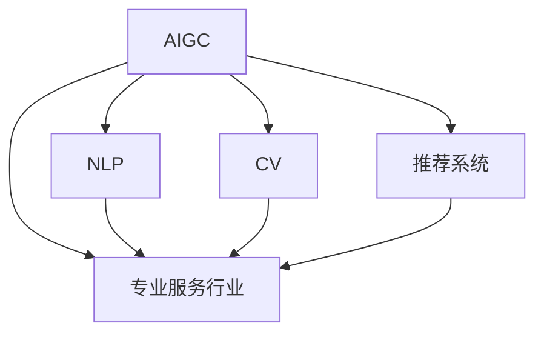

                 

# AIGC重塑专业服务行业

> 关键词：人工智能生成内容(AIGC), 专业服务行业, 自动化, 效率提升, 客户体验, 智能化转型

## 1. 背景介绍

### 1.1 问题由来
随着人工智能(AI)技术的不断成熟，人工智能生成内容(AIGC)正在逐步成为重塑各行业的新引擎。在专业服务领域，AIGC的应用正在从单一任务向全流程智能化转型，推动服务效率的提升、成本的降低和客户体验的优化。从法律咨询到医疗诊断，从金融分析到市场营销，AIGC正在赋能专业服务的各个角落。

### 1.2 问题核心关键点
AIGC在专业服务行业的应用主要体现在以下几个方面：
1. **自动化处理：** 利用AI技术自动化处理重复性、高耗时的任务，如文书撰写、数据分析、报告生成等，大幅提升工作效率。
2. **智能化决策：** 通过分析海量数据，提供数据驱动的决策支持，辅助专业服务人员做出更准确的判断。
3. **个性化服务：** 利用自然语言处理(NLP)和推荐系统，提供个性化的服务方案，满足不同客户的需求。
4. **降低成本：** 减少对人力的依赖，降低运营成本，同时提高资源利用率。
5. **提升客户体验：** 提供更快速、准确、人性化的服务，提升客户满意度。

### 1.3 问题研究意义
AIGC技术的应用，将促进专业服务行业的智能化转型，提高服务质量和效率，推动行业整体的创新和升级。对于专业服务机构而言，引入AIGC技术，能够迅速提升竞争力，抢占市场先机。而对于消费者，AIGC提供的智能服务将更加贴合其需求，提升获得感。

## 2. 核心概念与联系

### 2.1 核心概念概述

为更好地理解AIGC在专业服务行业的应用，本节将介绍几个密切相关的核心概念：

- **人工智能生成内容(AIGC)**：利用人工智能技术生成文本、图像、视频等内容，包括自然语言处理、计算机视觉、语音识别等领域的技术。
- **自然语言处理(NLP)**：通过算法让计算机理解和生成自然语言，是AIGC的核心技术之一。
- **计算机视觉(CV)**：让计算机“看”和理解图像、视频等视觉信息，辅助生成相关的文本内容。
- **推荐系统**：根据用户行为和偏好，推荐个性化的内容和服务，增强用户体验。
- **专业服务行业**：涵盖法律、医疗、金融、咨询、市场营销等多个领域，提供专业化的服务。

这些核心概念之间的逻辑关系可以通过以下Mermaid流程图来展示：



这个流程图展示了大语言模型的工作原理和优化方向。

## 3. 核心算法原理 & 具体操作步骤
### 3.1 算法原理概述

AIGC在专业服务行业的应用，本质上是利用人工智能技术生成相关内容，辅助或替代人工处理。其核心算法包括：

- **自然语言处理(NLP)**：通过语言模型、序列到序列(Seq2Seq)等算法，生成符合语法和语义规范的文本内容。
- **计算机视觉(CV)**：通过图像识别、图像生成等算法，将视觉信息转化为文本信息或进行相关生成。
- **推荐系统**：通过协同过滤、内容推荐等算法，提供个性化的服务方案。

### 3.2 算法步骤详解

**Step 1: 数据收集与预处理**
- 收集专业服务领域的各种数据，如法律文书、医疗报告、金融分析报告、市场营销文案等。
- 对数据进行清洗和预处理，去除噪声，统一格式，准备好模型训练的数据集。

**Step 2: 模型训练与优化**
- 选择合适的模型和算法，进行预训练和微调，优化模型的生成能力和泛化能力。
- 利用专业领域的标注数据，进行有监督的微调，使模型输出更贴合实际应用需求。

**Step 3: 集成部署**
- 将训练好的模型集成到专业服务系统中，提供自动化处理和智能决策功能。
- 与已有系统进行对接，确保新功能的稳定运行和用户体验的连续性。

**Step 4: 持续优化**
- 定期收集用户反馈，进行模型优化和迭代，提升模型的生成质量和用户满意度。
- 监控模型性能，及时发现并解决运行中的问题，保证系统的高效运行。

### 3.3 算法优缺点

AIGC技术在专业服务行业的应用具有以下优点：
1. **提升效率**：大幅减少人工处理的时间和成本，提高服务效率。
2. **降低成本**：减少对人力的依赖，降低运营成本，同时提高资源利用率。
3. **个性化服务**：提供更贴合用户需求的个性化服务，提升客户满意度。
4. **数据驱动决策**：通过分析海量数据，提供数据驱动的决策支持，辅助专业服务人员做出更准确的判断。
5. **智能化转型**：推动专业服务行业的智能化转型，提高服务质量和效率。

同时，AIGC技术也存在一些局限性：
1. **数据质量要求高**：模型的输出质量高度依赖于数据的质量和多样性。
2. **需要大量标注数据**：对于一些领域，特别是法律、医疗等专业领域，获取高质量的标注数据成本较高。
3. **伦理和隐私问题**：AIGC在生成内容时，可能涉及隐私和伦理问题，需要严格控制。
4. **依赖技术栈**：不同行业有不同的技术栈需求，需要针对性地进行系统集成。
5. **模型鲁棒性问题**：面对噪声数据和复杂场景，模型的鲁棒性仍需进一步提升。

尽管存在这些局限性，但AIGC技术在专业服务行业的应用前景广阔，具有巨大的商业价值和发展潜力。

### 3.4 算法应用领域

AIGC技术在专业服务行业的应用广泛，涵盖以下几个主要领域：

**1. 法律服务**
- **合同生成与审查**：利用NLP技术自动生成合同模板，辅助合同审查和修改。
- **法律文书撰写**：自动生成法律文书，如诉状、答辩状、法律意见书等。
- **案例分析**：自动分析案件，生成类似案例和判决结果。

**2. 医疗健康**
- **病历生成**：自动生成患者病历，包括病史、诊断、治疗方案等。
- **医学报告**：自动生成医学检查报告，如CT、MRI报告等。
- **个性化诊疗建议**：根据患者数据，自动生成个性化诊疗方案。

**3. 金融分析**
- **财务报告生成**：自动生成财务报表，如资产负债表、现金流量表等。
- **市场分析报告**：自动分析市场数据，生成投资分析报告。
- **风险评估**：自动评估金融产品的风险，提供风险提示。

**4. 咨询顾问**
- **咨询报告**：自动生成市场、行业、企业咨询报告。
- **智能客服**：提供智能问答，解答客户咨询。
- **数据分析**：自动分析数据，生成分析报告和趋势预测。

**5. 市场营销**
- **文案生成**：自动生成营销文案，提高营销效率。
- **广告优化**：自动优化广告投放策略，提高广告效果。
- **市场分析**：自动分析市场数据，生成市场报告和预测。

## 4. 数学模型和公式 & 详细讲解 & 举例说明

### 4.1 数学模型构建

以法律文书生成为例，我们将使用GPT-3作为语言模型，构建AIGC应用。GPT-3模型的数学模型构建如下：

假设输入为法律事实 $x$，输出为法律文书模板 $y$。模型的目标函数为最小化交叉熵损失函数：

$$
\min_{\theta} -\sum_{i=1}^N \log p(y_i | x)
$$

其中 $p(y_i | x)$ 为模型在输入 $x$ 下生成文书模板 $y_i$ 的概率。

### 4.2 公式推导过程

对于NLP任务，GPT-3模型是基于Transformer结构的，其公式推导如下：

设输入序列为 $x = (x_1, x_2, ..., x_n)$，输出序列为 $y = (y_1, y_2, ..., y_m)$。模型的计算过程如下：

1. 对输入序列 $x$ 进行分词和编码，得到 $x$ 的嵌入表示 $X$。
2. 对输出序列 $y$ 进行解码和预测，得到 $y$ 的嵌入表示 $Y$。
3. 计算预测概率 $p(y | x)$，即模型在输入 $x$ 下生成 $y$ 的概率。
4. 最小化交叉熵损失函数 $L = -\sum_{i=1}^N \log p(y_i | x)$。

### 4.3 案例分析与讲解

以合同生成为例，我们通过训练一个基于GPT-3的合同生成模型，可以自动生成符合法律规范的合同模板。具体步骤如下：

1. 收集大量的合同数据，将其标记为不同类型和用途的合同模板。
2. 利用GPT-3模型进行预训练，使其掌握法律语言的通用表示。
3. 对合同模板进行微调，使其能够自动生成新的合同模板。
4. 验证生成合同模板的准确性和规范性，确保生成内容符合法律要求。

## 5. 项目实践：代码实例和详细解释说明

### 5.1 开发环境搭建

在进行AIGC项目实践前，我们需要准备好开发环境。以下是使用Python进行PyTorch开发的环境配置流程：

1. 安装Anaconda：从官网下载并安装Anaconda，用于创建独立的Python环境。

2. 创建并激活虚拟环境：
```bash
conda create -n aigc-env python=3.8 
conda activate aigc-env
```

3. 安装PyTorch：根据CUDA版本，从官网获取对应的安装命令。例如：
```bash
conda install pytorch torchvision torchaudio cudatoolkit=11.1 -c pytorch -c conda-forge
```

4. 安装Transformers库：
```bash
pip install transformers
```

5. 安装各类工具包：
```bash
pip install numpy pandas scikit-learn matplotlib tqdm jupyter notebook ipython
```

完成上述步骤后，即可在`aigc-env`环境中开始AIGC项目实践。

### 5.2 源代码详细实现

下面我们以合同生成任务为例，给出使用Transformers库对GPT-3模型进行微调的PyTorch代码实现。

首先，定义模型训练函数：

```python
from transformers import GPT3Tokenizer, GPT3ForCausalLM

def train_model(model, optimizer, train_loader, device):
    model.train()
    for batch in train_loader:
        inputs = batch['input_ids'].to(device)
        attention_mask = batch['attention_mask'].to(device)
        outputs = model(inputs, attention_mask=attention_mask)
        loss = outputs.loss
        optimizer.zero_grad()
        loss.backward()
        optimizer.step()
```

然后，定义模型评估函数：

```python
def evaluate_model(model, test_loader, device):
    model.eval()
    total_loss = 0
    total_sample = 0
    for batch in test_loader:
        inputs = batch['input_ids'].to(device)
        attention_mask = batch['attention_mask'].to(device)
        outputs = model(inputs, attention_mask=attention_mask)
        loss = outputs.loss
        total_loss += loss.item() * len(batch)
        total_sample += len(batch)
    return total_loss / total_sample
```

接着，定义训练循环：

```python
epochs = 5
batch_size = 16
learning_rate = 2e-5

model = GPT3ForCausalLM.from_pretrained('gpt3')
tokenizer = GPT3Tokenizer.from_pretrained('gpt3')
device = torch.device('cuda') if torch.cuda.is_available() else torch.device('cpu')
optimizer = AdamW(model.parameters(), lr=learning_rate)

train_dataset = ...
val_dataset = ...

train_loader = DataLoader(train_dataset, batch_size=batch_size, shuffle=True)
val_loader = DataLoader(val_dataset, batch_size=batch_size, shuffle=False)

for epoch in range(epochs):
    train_loss = train_model(model, optimizer, train_loader, device)
    val_loss = evaluate_model(model, val_loader, device)
    print(f'Epoch {epoch+1}, train loss: {train_loss:.4f}, val loss: {val_loss:.4f}')
```

最后，启动训练流程并在测试集上评估：

```python
test_dataset = ...
test_loader = DataLoader(test_dataset, batch_size=batch_size, shuffle=False)

test_loss = evaluate_model(model, test_loader, device)
print(f'Test loss: {test_loss:.4f}')
```

以上就是使用PyTorch对GPT-3进行合同生成任务微调的完整代码实现。可以看到，得益于Transformers库的强大封装，我们可以用相对简洁的代码完成GPT-3模型的加载和微调。

### 5.3 代码解读与分析

让我们再详细解读一下关键代码的实现细节：

**train_model函数**：
- 定义模型训练函数，包含输入数据的分批处理、模型前向传播、计算损失、反向传播和参数更新等步骤。

**evaluate_model函数**：
- 定义模型评估函数，包含输入数据的分批处理、模型前向传播和损失计算，最终输出平均损失值。

**训练循环**：
- 定义训练的epoch数、批大小和学习率，进行模型加载、优化器初始化和数据集划分。
- 利用DataLoader对数据集进行批次化加载，进入训练循环。
- 在每个epoch内，先在训练集上训练，输出平均训练损失和验证集损失。

**测试集评估**：
- 定义测试集数据集，利用DataLoader进行批次化加载。
- 在测试集上评估模型，输出平均测试损失。

可以看到，PyTorch配合Transformers库使得AIGC任务的代码实现变得简洁高效。开发者可以将更多精力放在模型改进、数据处理等高层逻辑上，而不必过多关注底层的实现细节。

当然，工业级的系统实现还需考虑更多因素，如模型的保存和部署、超参数的自动搜索、更灵活的任务适配层等。但核心的AIGC范式基本与此类似。

## 6. 实际应用场景

### 6.1 智能法律服务

智能法律服务是AIGC在法律领域的重要应用场景之一。利用AIGC技术，律师可以快速生成法律文书、合同模板、案例分析报告等，大幅提升工作效率和质量。

在技术实现上，可以收集律师以往的法律文书、合同模板等作为训练数据，利用GPT-3等大语言模型进行预训练和微调。微调后的模型能够自动生成符合法律规范的文书和报告，辅助律师完成文书撰写、合同审查等任务。

### 6.2 医疗健康咨询

AIGC在医疗健康领域的应用，主要体现在病历生成、医学报告生成、诊断建议等方面。通过分析医疗数据，自动生成病历和报告，为医生提供参考，提高诊断的准确性和效率。

具体而言，可以收集各类医疗数据，包括病史、检查结果、诊断报告等，利用GPT-3等模型进行预训练和微调。微调后的模型能够自动生成病历、报告和诊断建议，辅助医生完成诊疗工作。

### 6.3 金融分析报告

金融领域的数据量庞大且复杂，利用AIGC技术，可以快速生成市场分析报告、财务报表、风险评估报告等，提高金融分析的效率和准确性。

具体而言，可以收集金融市场数据、公司财务数据等，利用GPT-3等模型进行预训练和微调。微调后的模型能够自动生成分析报告和预测，辅助分析师完成财务分析和市场研究。

### 6.4 营销文案撰写

AIGC技术在市场营销领域的应用，主要体现在文案生成、广告优化、市场分析等方面。通过分析用户行为和市场数据，自动生成营销文案和广告，提高营销效果。

具体而言，可以收集各类市场数据，包括用户行为数据、市场趋势数据等，利用GPT-3等模型进行预训练和微调。微调后的模型能够自动生成营销文案、广告和市场分析报告，辅助营销人员完成市场推广。

### 6.5 未来应用展望

随着AIGC技术的不断发展，其在专业服务行业的应用前景将更加广阔。未来，AIGC技术将更多地应用于数据处理、决策支持、个性化服务等领域，为专业服务行业带来新的变革。

在智慧医疗领域，AIGC技术将助力医生快速生成病历和报告，提高诊疗效率和准确性。在智能客服领域，AIGC技术将提供更加智能化的客户服务，提升客户满意度。在金融分析领域，AIGC技术将大幅提高数据处理和分析效率，提升金融决策的科学性和精准性。

总之，AIGC技术在专业服务行业的应用将不断拓展，为各行业带来新的机遇和挑战。

## 7. 工具和资源推荐

### 7.1 学习资源推荐

为了帮助开发者系统掌握AIGC的理论基础和实践技巧，这里推荐一些优质的学习资源：

1. 《深度学习与自然语言处理》课程：斯坦福大学开设的NLP课程，详细介绍了自然语言处理的基本概念和前沿技术。
2. 《GPT-3技术内幕》一书：详细介绍了GPT-3模型的原理、训练方法和应用案例，帮助读者深入理解AIGC技术。
3. 《Transformers从原理到实践》系列博文：由大模型技术专家撰写，深入浅出地介绍了Transformer原理、AIGC技术等前沿话题。
4. HuggingFace官方文档：Transformers库的官方文档，提供了海量预训练模型和完整的AIGC样例代码，是上手实践的必备资料。
5. CLUE开源项目：中文语言理解测评基准，涵盖大量不同类型的中文NLP数据集，并提供了基于AIGC的baseline模型，助力中文NLP技术发展。

通过对这些资源的学习实践，相信你一定能够快速掌握AIGC技术的精髓，并用于解决实际的NLP问题。

### 7.2 开发工具推荐

高效的开发离不开优秀的工具支持。以下是几款用于AIGC开发常用的工具：

1. PyTorch：基于Python的开源深度学习框架，灵活动态的计算图，适合快速迭代研究。大部分预训练语言模型都有PyTorch版本的实现。
2. TensorFlow：由Google主导开发的开源深度学习框架，生产部署方便，适合大规模工程应用。同样有丰富的预训练语言模型资源。
3. Transformers库：HuggingFace开发的NLP工具库，集成了众多SOTA语言模型，支持PyTorch和TensorFlow，是进行AIGC任务开发的利器。
4. Weights & Biases：模型训练的实验跟踪工具，可以记录和可视化模型训练过程中的各项指标，方便对比和调优。与主流深度学习框架无缝集成。
5. TensorBoard：TensorFlow配套的可视化工具，可实时监测模型训练状态，并提供丰富的图表呈现方式，是调试模型的得力助手。
6. Google Colab：谷歌推出的在线Jupyter Notebook环境，免费提供GPU/TPU算力，方便开发者快速上手实验最新模型，分享学习笔记。

合理利用这些工具，可以显著提升AIGC任务的开发效率，加快创新迭代的步伐。

### 7.3 相关论文推荐

AIGC技术的发展源于学界的持续研究。以下是几篇奠基性的相关论文，推荐阅读：

1. Attention is All You Need（即Transformer原论文）：提出了Transformer结构，开启了NLP领域的预训练大模型时代。
2. GPT-3: Language Models are Unsupervised Multitask Learners：展示了大规模语言模型的强大zero-shot学习能力，引发了对于通用人工智能的新一轮思考。
3. GPT-3的实际应用案例：展示了GPT-3在多领域的应用，如文本生成、机器翻译、代码生成等。
4. Adapter-based Parameter-Efficient Fine-Tuning：提出Adapter等参数高效微调方法，在固定大部分预训练参数的情况下，仍可取得不错的微调效果。
5. 基于AIGC的法律文书生成：研究了利用GPT-3模型自动生成法律文书的可行性，提高了法律服务的效率和准确性。

这些论文代表了大语言模型微调技术的发展脉络。通过学习这些前沿成果，可以帮助研究者把握学科前进方向，激发更多的创新灵感。

## 8. 总结：未来发展趋势与挑战

### 8.1 总结

本文对基于AIGC技术的专业服务行业进行了全面系统的介绍。首先阐述了AIGC技术在专业服务领域的应用背景和意义，明确了AIGC技术在提升效率、降低成本、优化客户体验等方面的独特价值。其次，从原理到实践，详细讲解了AIGC技术的核心算法和操作步骤，给出了AIGC任务开发的完整代码实例。同时，本文还广泛探讨了AIGC技术在法律、医疗、金融、咨询、市场营销等多个行业领域的应用前景，展示了AIGC技术的巨大潜力。

通过本文的系统梳理，可以看到，AIGC技术正在成为专业服务行业的重要范式，极大地拓展了预训练语言模型的应用边界，催生了更多的落地场景。受益于大规模语料的预训练，AIGC模型能够自动生成高质量内容，辅助或替代人工处理，提高服务效率和质量。未来，伴随AIGC技术的持续演进，专业服务行业将迎来更加智能化、高效化的发展，服务模式将发生根本性转变。

### 8.2 未来发展趋势

展望未来，AIGC技术在专业服务行业的应用将呈现以下几个发展趋势：

1. **智能化转型**：AIGC技术将推动各行业向智能化转型，提高服务效率和质量，降低成本，提升客户满意度。
2. **数据驱动决策**：通过分析海量数据，提供数据驱动的决策支持，辅助专业服务人员做出更准确的判断。
3. **个性化服务**：利用自然语言处理和推荐系统，提供个性化的服务方案，满足不同客户的需求。
4. **跨领域应用**：AIGC技术将在更多领域得到应用，如智慧医疗、智能客服、金融分析等，为各行各业带来新的变革。
5. **伦理与隐私保护**：随着AIGC技术的应用，将面临更多的伦理和隐私问题，需要加强规范和监管。
6. **技术融合**：AIGC技术将与其他人工智能技术进行更深入的融合，如知识表示、因果推理、强化学习等，多路径协同发力，共同推动NLP技术的发展。

以上趋势凸显了AIGC技术在专业服务行业的应用前景。这些方向的探索发展，必将进一步提升AIGC技术的精度和应用广度，为专业服务行业带来更大的价值。

### 8.3 面临的挑战

尽管AIGC技术在专业服务行业的应用前景广阔，但在迈向更加智能化、普适化应用的过程中，它仍面临着诸多挑战：

1. **数据质量问题**：模型的输出质量高度依赖于数据的质量和多样性，需要收集高质量的数据。
2. **标注成本高**：对于一些领域，特别是法律、医疗等专业领域，获取高质量的标注数据成本较高。
3. **伦理和隐私问题**：AIGC在生成内容时，可能涉及隐私和伦理问题，需要严格控制。
4. **技术栈复杂**：不同行业有不同的技术栈需求，需要针对性地进行系统集成。
5. **模型鲁棒性问题**：面对噪声数据和复杂场景，模型的鲁棒性仍需进一步提升。
6. **计算资源消耗大**：超大批次的训练和推理也可能遇到资源瓶颈，需要优化计算资源。

尽管存在这些挑战，但AIGC技术在专业服务行业的应用前景广阔，具有巨大的商业价值和发展潜力。

### 8.4 研究展望

面对AIGC技术面临的种种挑战，未来的研究需要在以下几个方面寻求新的突破：

1. **探索无监督和半监督学习**：摆脱对大规模标注数据的依赖，利用自监督学习、主动学习等无监督和半监督范式，最大限度利用非结构化数据，实现更加灵活高效的AIGC。
2. **研究参数高效和计算高效的AIGC范式**：开发更加参数高效的AIGC方法，在固定大部分预训练参数的同时，只更新极少量的任务相关参数。同时优化AIGC模型的计算图，减少前向传播和反向传播的资源消耗，实现更加轻量级、实时性的部署。
3. **融合因果和对比学习范式**：通过引入因果推断和对比学习思想，增强AIGC模型建立稳定因果关系的能力，学习更加普适、鲁棒的语言表征，从而提升模型泛化性和抗干扰能力。
4. **引入更多先验知识**：将符号化的先验知识，如知识图谱、逻辑规则等，与神经网络模型进行巧妙融合，引导AIGC过程学习更准确、合理的语言模型。同时加强不同模态数据的整合，实现视觉、语音等多模态信息与文本信息的协同建模。
5. **结合因果分析和博弈论工具**：将因果分析方法引入AIGC模型，识别出模型决策的关键特征，增强输出解释的因果性和逻辑性。借助博弈论工具刻画人机交互过程，主动探索并规避模型的脆弱点，提高系统稳定性。
6. **纳入伦理道德约束**：在模型训练目标中引入伦理导向的评估指标，过滤和惩罚有偏见、有害的输出倾向。同时加强人工干预和审核，建立模型行为的监管机制，确保输出符合人类价值观和伦理道德。

这些研究方向的探索，必将引领AIGC技术迈向更高的台阶，为构建安全、可靠、可解释、可控的智能系统铺平道路。面向未来，AIGC技术还需要与其他人工智能技术进行更深入的融合，如知识表示、因果推理、强化学习等，多路径协同发力，共同推动NLP技术的发展。只有勇于创新、敢于突破，才能不断拓展AIGC技术的边界，让智能技术更好地造福人类社会。

## 9. 附录：常见问题与解答

**Q1：AIGC技术在专业服务行业的应用是否局限于法律、医疗等特定领域？**

A: AIGC技术在专业服务行业的应用不仅仅局限于法律、医疗等特定领域。虽然这些领域数据量较大，适合AIGC技术的应用，但其他领域如金融、咨询、市场营销等，同样可以应用AIGC技术，实现自动化处理、个性化服务、决策支持等功能。

**Q2：AIGC技术的输出质量如何保证？**

A: AIGC技术的输出质量主要依赖于数据质量和模型训练方法。高质量的数据和高效的训练方法能够保证模型的输出质量。同时，可以通过数据增强、对抗训练等技术手段，进一步提升模型性能。

**Q3：如何避免AIGC技术的伦理和隐私问题？**

A: AIGC技术在生成内容时，可能涉及隐私和伦理问题，需要严格控制。可以采用隐私保护技术，如差分隐私、联邦学习等，保护用户隐私。同时，在模型训练和应用过程中，建立伦理导向的评估指标，避免有害内容的生成。

**Q4：AIGC技术的部署和维护有哪些注意事项？**

A: AIGC技术的部署和维护需要考虑以下因素：
1. 模型的裁剪和优化：去除不必要的层和参数，减小模型尺寸，提高推理速度。
2. 模型的量化和加速：将浮点模型转为定点模型，压缩存储空间，提高计算效率。
3. 模型的持续优化：定期收集用户反馈，进行模型优化和迭代，提升模型的生成质量和用户满意度。
4. 模型的监控和告警：实时采集系统指标，设置异常告警阈值，确保系统的高效运行。

AIGC技术的应用需要考虑系统的高效稳定运行，合理利用资源，确保用户隐私和伦理安全。

---

作者：禅与计算机程序设计艺术 / Zen and the Art of Computer Programming

