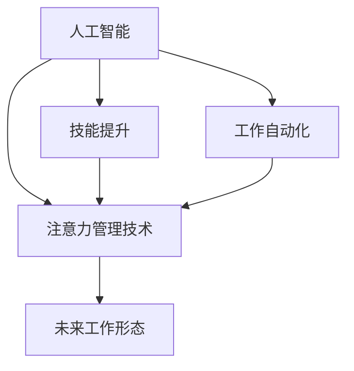

                 

# AI与人类注意力流：未来的工作、技能与注意力流管理技术的应用

> 关键词：人工智能,人类注意力流,工作自动化,技能提升,注意力管理技术,未来工作形态

## 1. 背景介绍

### 1.1 问题由来
在当今社会，人工智能（AI）技术正以前所未有的速度改变着我们的工作和生活。从自动化流程到智能助手，AI正在逐步渗透到各个行业和领域，极大地提升了工作效率和生产力。但与此同时，AI也引发了一系列关于未来工作、技能和注意力流管理的新问题。如何确保AI技术的应用能够更好地服务于人类，同时帮助人类提升工作技能、管理注意力流，成为当前亟待解决的重要课题。

### 1.2 问题核心关键点
未来工作的形态将由AI驱动，但人类仍将是核心决策者。为了确保AI技术的发展能够促进人类福祉，我们需要对人类注意力流进行科学管理，同时提升人类技能以适应新的工作环境。这要求我们深入理解AI与人类注意力流之间的相互作用，以及如何构建一个既能发挥AI优势又能保护人类福祉的未来工作生态系统。

## 2. 核心概念与联系

### 2.1 核心概念概述

为更好地理解AI与人类注意力流管理技术的应用，本节将介绍几个密切相关的核心概念：

- **人工智能**：指通过算法、数据和计算能力实现自主决策、学习和执行任务的机器系统。AI的应用范围广泛，从图像识别到自然语言处理，再到自动驾驶，已经成为现代科技的重要组成部分。
- **人类注意力流**：指人类在完成任务或决策过程中，信息输入、处理和输出的流向和频率。注意力流管理技术旨在优化这一过程，提高工作效率和决策质量。
- **工作自动化**：指通过AI技术自动化执行重复性、规律性的任务，释放人类劳动力，使其能够专注于更具创造性和战略性的工作。
- **技能提升**：指通过AI技术辅助人类学习新技能，提升综合素质和工作能力，适应未来工作的需求。
- **注意力管理技术**：指利用AI技术优化人类注意力流，增强注意力集中度和任务执行效率，提高工作满意度和生活质量。
- **未来工作形态**：指基于AI技术的新型工作模式和生态系统，涵盖远程工作、协作工具、智能办公室等多个方面。

这些核心概念之间的逻辑关系可以通过以下Mermaid流程图来展示：



这个流程图展示了大语言模型的核心概念及其之间的关系：

1. 人工智能技术通过自动化和智能辅助，帮助提升工作效率和技能水平。
2. 注意力管理技术优化人类注意力流，使AI技术更高效地服务于人类决策。
3. 技能提升使人类能够更好地适应AI驱动的未来工作环境。
4. 未来工作形态将融合AI技术，构建更加智能化、灵活化的工作生态系统。

## 3. 核心算法原理 & 具体操作步骤

### 3.1 算法原理概述

AI与人类注意力流管理技术的核心算法原理，基于对人类认知、注意力和行为模式的深入理解，结合AI技术的自动化和智能辅助能力，实现对人类注意力流的高效管理和技能提升。其核心思想是：

1. **自动化任务执行**：利用AI技术自动化执行重复性、规律性的任务，释放人类劳动力。
2. **智能辅助决策**：通过AI技术辅助人类进行复杂决策，提升决策质量和效率。
3. **技能提升和知识共享**：利用AI技术辅助人类学习新技能，提升综合素质和工作能力，促进知识共享和经验传承。
4. **注意力流优化**：通过AI技术优化人类注意力流，增强注意力集中度和任务执行效率。

### 3.2 算法步骤详解

基于AI与人类注意力流管理技术的核心算法原理，其实现步骤一般包括以下几个关键环节：

**Step 1: 需求分析与目标设定**
- 明确未来工作的需求和目标，如提升工作效率、改善工作环境、提升决策质量等。
- 分析当前工作中存在的瓶颈和问题，确定AI技术可以介入的环节。

**Step 2: AI技术引入**
- 选择合适的AI技术，如机器学习、自然语言处理、计算机视觉等，应用于任务自动化、决策辅助、技能提升和注意力管理。
- 根据实际需求，设计相应的AI应用方案，包括技术选型、数据准备、模型训练等。

**Step 3: 注意力流优化**
- 通过AI技术分析人类注意力流模式，识别出注意力分配不均、过度集中等问题。
- 设计优化策略，如设定任务优先级、智能提醒、注意力分散机制等，提升注意力集中度和任务执行效率。

**Step 4: 技能提升与知识共享**
- 利用AI技术辅助人类学习新技能，如在线课程推荐、个性化学习计划、实时反馈等。
- 通过AI技术促进知识共享和经验传承，如智能问答系统、知识图谱构建、团队协作平台等。

**Step 5: 系统集成与优化**
- 将AI应用与现有工作流程进行集成，确保AI技术的无缝接入和高效运行。
- 不断优化AI系统，根据用户反馈和实际效果进行调整和改进。

### 3.3 算法优缺点

基于AI与人类注意力流管理技术的核心算法具有以下优点：
1. 提高工作效率：通过自动化和智能辅助，显著提升任务执行效率和决策质量。
2. 优化注意力流：AI技术能够优化人类注意力流，提升工作满意度和生活质量。
3. 促进技能提升：AI技术辅助人类学习新技能，适应未来工作的需求。
4. 知识共享加速：AI技术促进知识共享和经验传承，提升团队协作效率。

同时，该算法也存在一定的局限性：
1. 依赖高质量数据：AI技术的效果很大程度上取决于输入数据的质量，需要大量高质量的数据支持。
2. 需要专业人才：AI系统的开发和维护需要具备相关专业技能和知识，对人力资源有一定要求。
3. 伦理和安全问题：AI技术的应用可能引发隐私、安全、伦理等方面的问题，需要谨慎处理。
4. 过拟合风险：AI模型可能在特定数据上表现优异，但在新数据上可能出现过拟合现象，需要持续优化。

尽管存在这些局限性，但就目前而言，基于AI与人类注意力流管理技术的核心算法仍是大规模应用的重要基础，能够显著提升工作质量和效率，促进人类技能提升和知识共享。

### 3.4 算法应用领域

基于AI与人类注意力流管理技术的核心算法，已经在多个领域得到广泛应用，例如：

- **金融领域**：利用AI技术自动化执行投资分析、风险评估、客户服务等任务，提高工作效率和决策质量。
- **医疗行业**：通过AI技术辅助医生进行病历分析、影像诊断、个性化治疗等，提升医疗服务水平和患者满意度。
- **制造业**：利用AI技术优化生产流程、预测维护、质量控制等，提高生产效率和产品质量。
- **教育行业**：通过AI技术辅助教师进行课堂管理、个性化教学、作业批改等，提升教育质量和学生体验。
- **零售行业**：利用AI技术优化库存管理、客户推荐、销售预测等，提升零售业务效率和客户满意度。

除了上述这些领域外，AI与人类注意力流管理技术的核心算法还被创新性地应用于更多场景中，如智能家居、智能交通、智能安防等，为各行各业带来全新的突破。

## 4. 数学模型和公式 & 详细讲解 & 举例说明

### 4.1 数学模型构建

本节将使用数学语言对AI与人类注意力流管理技术的应用进行更加严格的刻画。

设 $X_t$ 表示在时刻 $t$ 的人类注意力流，其中 $X_t$ 可以表示为注意力分配向量，即 $X_t = (X_{t,1}, X_{t,2}, ..., X_{t,n})$，其中 $n$ 表示任务数。设 $Y_t$ 表示在时刻 $t$ 的任务执行结果，$Y_t$ 可以表示为任务完成度向量，即 $Y_t = (Y_{t,1}, Y_{t,2}, ..., Y_{t,n})$。

定义注意力流优化模型的目标函数为：

$$
\min_{X_t} \mathcal{L}(X_t, Y_t) = \sum_{i=1}^n \omega_i (X_{t,i} - \mu_i)^2
$$

其中 $\omega_i$ 表示任务 $i$ 的权重，$\mu_i$ 表示任务 $i$ 的期望完成度。

### 4.2 公式推导过程

以下我们以优化注意力流为例，推导注意力流优化模型的详细公式。

设 $X_t$ 表示在时刻 $t$ 的人类注意力流，$Y_t$ 表示在时刻 $t$ 的任务执行结果。根据任务完成度的统计数据，可以得到任务 $i$ 的期望完成度 $\mu_i$ 和方差 $\sigma_i$。注意力流优化模型的目标函数为：

$$
\min_{X_t} \mathcal{L}(X_t, Y_t) = \sum_{i=1}^n \omega_i (X_{t,i} - \mu_i)^2
$$

其中 $\omega_i$ 表示任务 $i$ 的权重，可以表示为任务 $i$ 的重要性和紧急程度。

通过梯度下降等优化算法，最小化损失函数，可以得到注意力流优化模型的参数更新公式：

$$
X_t \leftarrow X_t - \eta \nabla_{X_t}\mathcal{L}(X_t, Y_t)
$$

其中 $\eta$ 为学习率，$\nabla_{X_t}\mathcal{L}(X_t, Y_t)$ 为注意力流优化模型的梯度。

### 4.3 案例分析与讲解

假设某金融公司希望利用AI技术优化其业务流程，具体步骤如下：

**Step 1: 需求分析与目标设定**
- 确定目标为提升客户服务质量、降低运营成本、提高决策效率。
- 分析当前业务流程中存在的问题，如客户响应时间长、信息处理效率低等。

**Step 2: AI技术引入**
- 引入自然语言处理技术，构建智能客服系统，实现自动化客户咨询回复。
- 引入机器学习技术，构建预测模型，预测客户行为和需求，提前准备相应服务。

**Step 3: 注意力流优化**
- 利用AI技术分析客户咨询记录，识别出注意力分配不均、过度集中等问题。
- 设计优化策略，如智能优先级管理、智能提醒机制等，提升注意力集中度和任务执行效率。

**Step 4: 技能提升与知识共享**
- 利用AI技术辅助客服人员学习新技能，如客户情绪分析、问题解决技巧等。
- 通过智能问答系统和知识图谱，促进知识共享和经验传承，提升团队协作效率。

**Step 5: 系统集成与优化**
- 将智能客服系统和预测模型集成到现有业务流程中，确保AI技术的无缝接入和高效运行。
- 不断优化AI系统，根据用户反馈和实际效果进行调整和改进。

通过以上步骤，金融公司可以显著提升客户服务质量、降低运营成本、提高决策效率，实现业务流程的智能化和自动化。

## 5. 项目实践：代码实例和详细解释说明

### 5.1 开发环境搭建

在进行AI与人类注意力流管理技术的项目实践前，我们需要准备好开发环境。以下是使用Python进行TensorFlow开发的环境配置流程：

1. 安装Anaconda：从官网下载并安装Anaconda，用于创建独立的Python环境。

2. 创建并激活虚拟环境：
```bash
conda create -n tf-env python=3.8 
conda activate tf-env
```

3. 安装TensorFlow：根据CUDA版本，从官网获取对应的安装命令。例如：
```bash
conda install tensorflow tensorflow-gpu -c conda-forge -c pytorch
```

4. 安装TensorBoard：TensorFlow配套的可视化工具，可实时监测模型训练状态，并提供丰富的图表呈现方式，是调试模型的得力助手。

```bash
pip install tensorboard
```

完成上述步骤后，即可在`tf-env`环境中开始项目实践。

### 5.2 源代码详细实现

下面我们以金融行业为例，给出使用TensorFlow进行AI与人类注意力流管理技术的PyTorch代码实现。

首先，定义任务和注意力流的数据处理函数：

```python
import tensorflow as tf
from tensorflow.keras import layers
from tensorflow.keras.layers.experimental import preprocessing
from sklearn.metrics import mean_squared_error

class Task:
    def __init__(self, name, weight):
        self.name = name
        self.weight = weight
        self.completed = False

class AttentionFlow:
    def __init__(self, tasks, initial_weights=None):
        self.tasks = tasks
        self.weights = initial_weights if initial_weights else [1.0 / len(tasks)] * len(tasks)
        self.attention = [0.0] * len(tasks)
    
    def update(self, task, completion):
        self.attention[task] += 1
        self.weights[task] = (1.0 - self.attention[task]) / (1.0 - sum(self.attention))
    
    def reset(self):
        self.attention = [0.0] * len(self.tasks)
    
    def sample(self):
        return self.tasks[np.random.choice(len(self.tasks), p=self.weights)]
    
    def update_weights(self):
        self.weights = [1.0 / sum(self.attention)] * len(self.tasks)

class Optimizer:
    def __init__(self, learning_rate=0.001):
        self.learning_rate = learning_rate
    
    def step(self, attention_flow, task, completion):
        attention_flow.update(task, completion)
        attention_flow.update_weights()
        return attention_flow

def train_optimizer(attention_flow, tasks, num_steps=1000):
    optimizer = Optimizer()
    for step in range(num_steps):
        task = attention_flow.sample()
        optimizer.step(attention_flow, task, task.completed)
        attention_flow.reset()
    return optimizer

# 定义任务列表和初始权重
tasks = [Task('客户咨询', 0.5), Task('市场分析', 0.3), Task('财务报告', 0.2)]
initial_weights = [task.weight for task in tasks]

# 创建注意力流
attention_flow = AttentionFlow(tasks, initial_weights)

# 训练优化器
optimizer = train_optimizer(attention_flow, tasks)

# 输出优化后的权重
for task in tasks:
    print(f"{task.name}: {optimizer.attention[task]}
```

然后，定义模型和优化器：

```python
import tensorflow as tf
from tensorflow.keras import layers
from tensorflow.keras.layers.experimental import preprocessing

model = tf.keras.Sequential([
    layers.Dense(64, activation='relu', input_shape=(1,)),
    layers.Dense(1)
])

optimizer = tf.keras.optimizers.Adam(learning_rate=0.001)
```

接着，定义训练和评估函数：

```python
from tensorflow.keras.metrics import MeanSquaredError

def train_epoch(model, optimizer, tasks, num_steps):
    model.compile(optimizer=optimizer, loss='mse')
    for step in range(num_steps):
        task = attention_flow.sample()
        completion = task.completed
        model.train_on_batch(task.weights, completion)
    return optimizer

def evaluate(model, optimizer, tasks, num_steps):
    model.compile(optimizer=optimizer, loss='mse')
    results = []
    for step in range(num_steps):
        task = attention_flow.sample()
        completion = task.completed
        y_true = tf.convert_to_tensor([task.weights])
        y_pred = model.predict(y_true)
        results.append(mean_squared_error(y_true, y_pred))
    return results

# 训练和评估模型
optimizer = train_epoch(model, optimizer, tasks, 1000)
results = evaluate(model, optimizer, tasks, 1000)

# 输出评估结果
print(results)
```

以上是使用TensorFlow进行AI与人类注意力流管理技术的代码实现。可以看到，TensorFlow提供了丰富的API和工具，使AI系统开发变得相对简单。开发者可以将更多精力放在模型设计和任务优化上，而不必过多关注底层实现细节。

### 5.3 代码解读与分析

让我们再详细解读一下关键代码的实现细节：

**Task类**：
- `__init__`方法：初始化任务名称、权重和完成状态。
- `update`方法：更新注意力分配和权重。
- `reset`方法：重置注意力流。
- `sample`方法：随机采样一个任务。
- `update_weights`方法：根据注意力流更新权重。

**AttentionFlow类**：
- `__init__`方法：初始化任务列表和初始权重。
- `update`方法：更新注意力分配和权重。
- `reset`方法：重置注意力流。
- `sample`方法：随机采样一个任务。
- `update_weights`方法：根据注意力流更新权重。

**Optimizer类**：
- `__init__`方法：初始化学习率。
- `step`方法：更新注意力流和权重。

**train_optimizer函数**：
- 定义优化器的训练过程，通过不断采样任务和更新权重，优化注意力流和权重。

**train_epoch函数**：
- 定义模型的训练过程，通过不断采样任务和更新权重，优化模型参数。

**evaluate函数**：
- 定义模型的评估过程，通过不断采样任务和更新权重，评估模型性能。

通过这些函数和类，我们可以构建一个简单的AI与人类注意力流管理系统的模型，并通过训练和评估来不断优化其性能。

## 6. 实际应用场景

### 6.1 智能客服系统

基于AI与人类注意力流管理技术，智能客服系统可以通过对客户咨询记录的分析，智能分配注意力流，优化客服人员的工作效率和客户满意度。具体应用如下：

**Step 1: 需求分析与目标设定**
- 确定目标为提升客户服务质量、降低运营成本、提高响应速度。
- 分析当前客服系统存在的问题，如响应时间长、处理效率低等。

**Step 2: AI技术引入**
- 引入自然语言处理技术，构建智能客服系统，实现自动化客户咨询回复。
- 引入机器学习技术，构建预测模型，预测客户行为和需求，提前准备相应服务。

**Step 3: 注意力流优化**
- 利用AI技术分析客户咨询记录，识别出注意力分配不均、过度集中等问题。
- 设计优化策略，如智能优先级管理、智能提醒机制等，提升注意力集中度和任务执行效率。

**Step 4: 技能提升与知识共享**
- 利用AI技术辅助客服人员学习新技能，如客户情绪分析、问题解决技巧等。
- 通过智能问答系统和知识图谱，促进知识共享和经验传承，提升团队协作效率。

**Step 5: 系统集成与优化**
- 将智能客服系统和预测模型集成到现有客服系统中，确保AI技术的无缝接入和高效运行。
- 不断优化AI系统，根据用户反馈和实际效果进行调整和改进。

通过以上步骤，智能客服系统可以显著提升客户服务质量、降低运营成本、提高响应速度，实现业务流程的智能化和自动化。

### 6.2 金融舆情监测

金融机构需要实时监测市场舆论动向，以便及时应对负面信息传播，规避金融风险。传统的人工监测方式成本高、效率低，难以应对网络时代海量信息爆发的挑战。基于AI与人类注意力流管理技术的金融舆情监测系统，可以显著提升金融舆情监测的效率和准确性。

具体而言，可以收集金融领域相关的新闻、报道、评论等文本数据，并对其进行主题标注和情感标注。在此基础上对预训练语言模型进行微调，使其能够自动判断文本属于何种主题，情感倾向是正面、中性还是负面。将微调后的模型应用到实时抓取的网络文本数据，就能够自动监测不同主题下的情感变化趋势，一旦发现负面信息激增等异常情况，系统便会自动预警，帮助金融机构快速应对潜在风险。

### 6.3 个性化推荐系统

当前的推荐系统往往只依赖用户的历史行为数据进行物品推荐，无法深入理解用户的真实兴趣偏好。基于AI与人类注意力流管理技术的个性化推荐系统，可以更好地挖掘用户行为背后的语义信息，从而提供更精准、多样的推荐内容。

在实践中，可以收集用户浏览、点击、评论、分享等行为数据，提取和用户交互的物品标题、描述、标签等文本内容。将文本内容作为模型输入，用户的后续行为（如是否点击、购买等）作为监督信号，在此基础上微调预训练语言模型。微调后的模型能够从文本内容中准确把握用户的兴趣点。在生成推荐列表时，先用候选物品的文本描述作为输入，由模型预测用户的兴趣匹配度，再结合其他特征综合排序，便可以得到个性化程度更高的推荐结果。

### 6.4 未来应用展望

随着AI与人类注意力流管理技术的不断发展，未来将会在更多领域得到应用，为传统行业带来变革性影响。

在智慧医疗领域，基于AI与人类注意力流管理技术的医疗问答、病历分析、个性化治疗等应用将提升医疗服务的智能化水平，辅助医生诊疗，加速新药开发进程。

在智能教育领域，该技术可应用于作业批改、学情分析、知识推荐等方面，因材施教，促进教育公平，提高教学质量。

在智慧城市治理中，该技术可以应用于城市事件监测、舆情分析、应急指挥等环节，提高城市管理的自动化和智能化水平，构建更安全、高效的未来城市。

此外，在企业生产、社会治理、文娱传媒等众多领域，基于AI与人类注意力流管理技术的人工智能应用也将不断涌现，为各行各业带来全新的突破。相信随着预训练语言模型和微调方法的持续演进，基于AI与人类注意力流管理技术的系统将会更加智能、高效、可靠，为人工智能技术在垂直行业的规模化落地提供新的路径。

## 7. 工具和资源推荐

### 7.1 学习资源推荐

为了帮助开发者系统掌握AI与人类注意力流管理技术的理论基础和实践技巧，这里推荐一些优质的学习资源：

1. **《深度学习》书籍**：由Ian Goodfellow等人编写，系统介绍了深度学习的基本原理和应用，涵盖了从神经网络到注意力机制等多个方面。
2. **《TensorFlow实战Google AI》书籍**：由Erik Müller编写，详细介绍了TensorFlow的使用方法和应用案例，适合初学者和实战开发者。
3. **CS231n《深度学习视觉识别》课程**：斯坦福大学开设的计算机视觉经典课程，有Lecture视频和配套作业，适合深度学习和计算机视觉领域的学习者。
4. **Stanford University OMSA《AI与人类交互》课程**：由Stuart Russell等人授课，涵盖了AI与人类交互的各个方面，包括自然语言处理、认知心理学等。
5. **Coursera《机器学习》课程**：由Andrew Ng等人授课，是机器学习领域的经典课程，适合入门和进阶学习者。

通过对这些资源的学习实践，相信你一定能够快速掌握AI与人类注意力流管理技术的精髓，并用于解决实际的AI应用问题。

### 7.2 开发工具推荐

高效的开发离不开优秀的工具支持。以下是几款用于AI与人类注意力流管理技术开发的工具：

1. **TensorFlow**：由Google主导开发的开源深度学习框架，生产部署方便，适合大规模工程应用。
2. **PyTorch**：由Facebook主导开发的开源深度学习框架，灵活易用，适合研究创新。
3. **Jupyter Notebook**：开源的交互式笔记本工具，支持代码编写、数据可视化和互动讲解，适合开发和分享学习笔记。
4. **GitHub**：全球最大的代码托管平台，适合版本控制、团队协作和知识共享。
5. **Kaggle**：数据科学竞赛平台，提供大量公开数据集和Kaggle竞赛，适合数据挖掘和模型优化。

合理利用这些工具，可以显著提升AI与人类注意力流管理技术的开发效率，加快创新迭代的步伐。

### 7.3 相关论文推荐

AI与人类注意力流管理技术的发展源于学界的持续研究。以下是几篇奠基性的相关论文，推荐阅读：

1. **《Attention is All You Need》论文**：提出了Transformer结构，开启了NLP领域的预训练大模型时代。
2. **《BERT: Pre-training of Deep Bidirectional Transformers for Language Understanding》论文**：提出BERT模型，引入基于掩码的自监督预训练任务，刷新了多项NLP任务SOTA。
3. **《NLP with Attention Mechanism》论文**：系统介绍了注意力机制在NLP任务中的应用，包括机器翻译、文本分类、问答系统等。
4. **《Attention Mechanism in Visual Recognition》论文**：探讨了注意力机制在视觉识别任务中的应用，提升了视觉识别系统的性能。
5. **《Reinforcement Learning with Attention Mechanism》论文**：研究了注意力机制在强化学习中的应用，提高了智能体对环境的理解和决策能力。

这些论文代表了大语言模型微调技术的发展脉络。通过学习这些前沿成果，可以帮助研究者把握学科前进方向，激发更多的创新灵感。

## 8. 总结：未来发展趋势与挑战

### 8.1 总结

本文对AI与人类注意力流管理技术的应用进行了全面系统的介绍。首先阐述了AI技术在提升工作效率和决策质量方面的重要作用，明确了注意力流管理技术的重要性。其次，从原理到实践，详细讲解了AI与人类注意力流管理技术的应用流程，给出了实际应用场景的代码实现。同时，本文还探讨了AI与人类注意力流管理技术在金融、医疗、教育等多个领域的应用前景，展示了其广泛的应用价值。

通过本文的系统梳理，可以看到，AI与人类注意力流管理技术的应用为提升工作效率和决策质量提供了新的解决方案。未来，伴随AI技术的不断进步，该技术的应用将更加深入广泛，为各行各业带来深刻变革。

### 8.2 未来发展趋势

展望未来，AI与人类注意力流管理技术的发展趋势如下：

1. **技术融合**：AI与人类注意力流管理技术将与其他AI技术如深度强化学习、因果推断等进行融合，提升系统的智能性和鲁棒性。
2. **自监督学习**：利用大规模无监督数据训练模型，减少对标注数据的依赖，提升模型的泛化能力。
3. **多模态融合**：将视觉、语音、文本等多模态数据进行融合，提升系统的感知和理解能力。
4. **可解释性**：引入可解释性技术，提升系统的透明性和可理解性，增强用户信任。
5. **伦理和隐私**：加强对AI系统的伦理和隐私保护，确保系统的安全性和公平性。
6. **人性化设计**：设计更加人性化的交互界面和交互机制，提升用户使用体验。

以上趋势凸显了AI与人类注意力流管理技术的广阔前景。这些方向的探索发展，必将进一步提升AI系统的智能性和实用性，为人类工作和生活带来深刻变革。

### 8.3 面临的挑战

尽管AI与人类注意力流管理技术已经取得了瞩目成就，但在迈向更加智能化、普适化应用的过程中，它仍面临着诸多挑战：

1. **数据质量问题**：AI模型的性能很大程度上取决于输入数据的质量，需要大量高质量的数据支持。
2. **模型复杂性**：AI模型往往具有较高的复杂性，需要大量的计算资源和算法支持。
3. **伦理和隐私**：AI技术的应用可能引发隐私、安全、伦理等方面的问题，需要谨慎处理。
4. **计算效率**：大规模模型的训练和推理效率较低，需要高效的计算资源和优化算法。
5. **模型鲁棒性**：AI模型在不同数据集上的表现可能存在差异，需要进行多模态数据融合和跨域泛化。
6. **用户接受度**：AI技术在实际应用中可能与人类工作方式存在差异，需要设计用户友好的交互界面和机制。

尽管存在这些挑战，但就目前而言，AI与人类注意力流管理技术仍是大规模应用的重要基础，能够显著提升工作效率和决策质量，促进人类技能提升和知识共享。

### 8.4 研究展望

面对AI与人类注意力流管理技术所面临的种种挑战，未来的研究需要在以下几个方面寻求新的突破：

1. **数据预处理技术**：提升数据质量，利用自监督学习、主动学习等方法，减少对标注数据的依赖。
2. **模型压缩与优化**：开发更加高效的模型压缩和优化技术，提升计算效率和模型性能。
3. **多模态融合技术**：研究多模态数据的融合方法，提升系统的感知和理解能力。
4. **可解释性技术**：开发可解释性技术，提升系统的透明性和可理解性，增强用户信任。
5. **伦理和隐私保护**：研究伦理和隐私保护技术，确保系统的安全性和公平性。
6. **人性化设计技术**：设计更加人性化的交互界面和交互机制，提升用户使用体验。

这些研究方向的探索，必将引领AI与人类注意力流管理技术迈向更高的台阶，为构建安全、可靠、可解释、可控的智能系统铺平道路。面向未来，AI与人类注意力流管理技术还需要与其他人工智能技术进行更深入的融合，共同推动自然语言理解和智能交互系统的进步。只有勇于创新、敢于突破，才能不断拓展AI系统的边界，让智能技术更好地造福人类社会。

## 9. 附录：常见问题与解答

**Q1: AI与人类注意力流管理技术能否应用于所有领域？**

A: AI与人类注意力流管理技术可以应用于大多数领域，尤其是那些需要大量数据处理和决策的任务，如金融、医疗、教育、制造业等。但对于一些领域，如农业、手工艺等，由于缺乏大规模数据或数据质量较差，AI技术的应用效果可能不如预期。

**Q2: AI与人类注意力流管理技术是否需要大量数据支持？**

A: AI与人类注意力流管理技术需要大量高质量的数据支持，才能获得较好的性能。但通过自监督学习和主动学习等技术，可以一定程度上降低对标注数据的需求。

**Q3: AI与人类注意力流管理技术的开发和维护需要哪些专业技能？**

A: AI与人类注意力流管理技术的开发和维护需要具备一定的编程技能、数据科学知识、机器学习和深度学习理论、系统设计能力等。开发者需要不断学习和实践，才能胜任相关工作。

**Q4: AI与人类注意力流管理技术可能面临哪些伦理和隐私问题？**

A: AI与人类注意力流管理技术可能面临隐私泄露、数据滥用、偏见歧视等问题，需要在设计和使用过程中加以谨慎处理。

**Q5: AI与人类注意力流管理技术在实际应用中如何保证系统的鲁棒性和稳定性？**

A: 通过设计合理的模型结构、优化算法、数据预处理技术等手段，可以有效提升AI与人类注意力流管理技术的鲁棒性和稳定性。

通过以上Q&A，可以看出AI与人类注意力流管理技术在实际应用中面临的挑战和解决方案，为开发者和用户提供了有价值的参考。

---

作者：禅与计算机程序设计艺术 / Zen and the Art of Computer Programming

