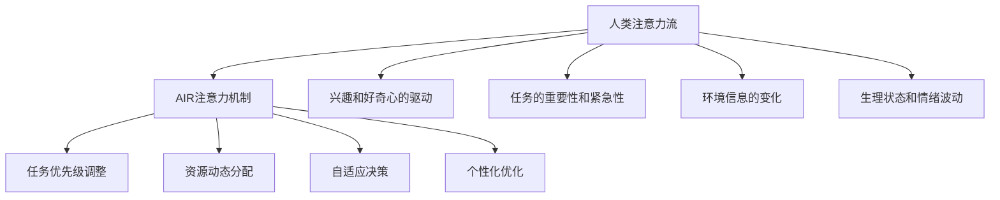

                 

# AI与人类注意力流：未来的工作、生活与休闲

## 1. 背景介绍

在当前科技迅猛发展的背景下，人工智能（AI）正以前所未有的速度融入我们的日常生活。AI技术不仅改变了我们工作的性质，也在悄悄重塑着我们的休闲和社交方式。特别是随着深度学习、自然语言处理、计算机视觉等技术的进步，AI在各领域的潜在应用正在逐步显现。

### 1.1 问题由来
随着人工智能技术的发展，AI系统在图像识别、语音识别、自然语言处理、推荐系统等领域的性能已经达到了令人印象深刻的水平。AI的潜力使其在医疗、金融、教育、娱乐等多个行业中拥有广泛的应用前景。然而，尽管AI在很多领域展示了其卓越的性能，但其在人们日常生活中的应用仍然存在一定的局限性和挑战，尤其是在理解人类注意力流、个性化体验和复杂情感处理方面。

### 1.2 问题核心关键点
AI与人类注意力流的交互，核心在于AI如何理解和模拟人类的注意力机制。AI在执行任务时，往往缺乏人类那样的自主选择和优先级判断。因此，在具体的应用场景中，如何模拟人类注意力的选择和分配，是AI技术面临的一大挑战。

人类注意力的分配通常由以下几个因素决定：
- 兴趣和好奇心的驱动
- 任务的重要性和紧急性
- 环境信息的变化
- 生理状态和情绪波动

这些因素在不同的人类和情境中相互作用，使得注意力流变得复杂且难以预测。AI系统要想模拟人类注意力流，需要在算法设计和应用实践中引入这些元素，从而提升其自主性和智能化水平。

### 1.3 问题研究意义
研究AI与人类注意力流的关系，对理解未来工作和生活的趋势、提升AI系统的人性化水平，以及改善人类的交互体验都具有重要意义：

1. **理解人类注意力流**：有助于开发更加贴合人类认知习惯和情感需求的AI应用。
2. **优化人机交互**：能够设计更加智能化、个性化的人机交互系统，提升用户体验。
3. **提升工作效率**：在智能化办公场景中，利用AI模拟人类注意力流，可有效提升工作效率，减少人工干预。
4. **改善休闲体验**：在智能娱乐和休闲领域，模拟人类注意力流能提供更加丰富、个性化的服务。
5. **促进跨学科融合**：跨心理学、认知科学、神经科学等多个学科的研究，将为AI技术的发展提供新的视角和方法。

## 2. 核心概念与联系

### 2.1 核心概念概述

为了更好地理解AI与人类注意力流的交互，本节将介绍几个核心概念：

- **AI注意力机制**：指AI系统如何在处理任务时，动态调整资源的分配和优先级，以达到最优的执行效果。
- **人类注意力流**：指人类在执行不同任务时，注意力的自然流动和分配规律，由兴趣、任务重要性和情绪状态等因素决定。
- **模拟与优化**：指AI系统如何通过算法设计，模拟人类注意力流的行为，并不断优化自身性能。
- **个性化与自适应**：指AI系统如何根据用户的行为和反馈，动态调整策略，提供更加个性化和自适应的服务。

### 2.2 核心概念原理和架构的 Mermaid 流程图



这个流程图展示了人类注意力流与AI注意力机制之间的关系：

1. 人类注意力流由兴趣、任务重要性、环境信息、生理状态和情绪波动等多个因素驱动。
2. AI系统通过模拟这些因素，动态调整任务的优先级和资源的分配。
3. AI系统根据用户反馈和行为，不断优化自身的决策和资源分配策略。
4. AI系统提供个性化的服务，满足不同用户的需求和偏好。

这些概念构成了AI与人类注意力流交互的核心框架，有助于我们理解未来工作和生活中的智能化趋势。

## 3. 核心算法原理 & 具体操作步骤

### 3.1 算法原理概述

AI与人类注意力流的交互，主要依赖于注意力机制的模拟和优化。AI系统通过理解人类注意力的驱动因素，动态调整资源的分配和优先级，从而实现与人类注意力流的同步和适配。

形式化地，假设AI系统在执行任务时，注意力流由以下因素决定：

$$
\text{Attention Flow} = f(\text{Interest}, \text{Task Importance}, \text{Environmental Information}, \text{Physiological State}, \text{Emotional State})
$$

其中 $f$ 为注意力流计算函数，输入为与任务相关的多个因素，输出为AI系统的注意力分配。

### 3.2 算法步骤详解

基于上述原理，AI系统在执行任务时，需要进行以下关键步骤：

**Step 1: 数据收集与分析**
- 收集用户行为数据，如点击流、浏览记录、交互时长等。
- 分析这些数据，提取用户兴趣、任务紧急性、环境信息、生理状态和情绪状态等特征。

**Step 2: 模型设计**
- 设计注意力计算模型，选择合适的特征和权重，构建注意力流计算函数 $f$。
- 选择合适的优化算法，如梯度下降、强化学习等，不断调整模型参数。

**Step 3: 动态调整与优化**
- 根据当前任务和用户状态，动态调整注意力分配，优先处理重要任务和紧急任务。
- 在任务执行过程中，根据用户反馈和行为，不断优化注意力流计算函数 $f$，提高系统的自适应能力。

**Step 4: 个性化与自适应**
- 根据用户的历史行为和偏好，设计个性化任务策略，优化注意力分配。
- 通过持续学习和反馈机制，使AI系统能够不断适应用户的变化和需求，提升用户体验。

### 3.3 算法优缺点

基于注意力机制的AI系统在模拟人类注意力流方面具有以下优点：

1. **自主决策能力**：通过动态调整任务优先级和资源分配，AI系统能够实现自主决策，减少人工干预。
2. **个性化服务**：根据用户的历史行为和偏好，提供个性化的服务，提升用户体验。
3. **优化资源利用**：通过动态调整资源分配，使AI系统能够更高效地利用计算和存储资源。

同时，该算法也存在一定的局限性：

1. **数据依赖性**：AI系统依赖于大量的用户行为数据，数据获取和处理的成本较高。
2. **算法复杂性**：设计合理的注意力计算函数和优化算法，需要深厚的数学和工程知识。
3. **自适应局限**：AI系统在处理复杂任务和环境变化时，可能难以实时适应。
4. **道德和隐私问题**：在收集和处理用户数据时，需注意隐私保护和数据安全，避免侵害用户权益。

尽管存在这些局限性，但就目前而言，基于注意力机制的AI系统在模拟人类注意力流方面仍具有重要的应用价值。未来相关研究的方向，在于如何进一步降低数据依赖，提高算法的自适应性和鲁棒性，同时兼顾道德和隐私保护。

### 3.4 算法应用领域

基于注意力机制的AI系统已经在多个领域中得到了应用，例如：

- **智能客服系统**：模拟人类客服的注意力流，提供更加人性化和自适应的服务。
- **智能办公系统**：在办公场景中，根据员工的工作状态和任务优先级，智能分配任务和资源。
- **智能娱乐系统**：根据用户喜好和行为，推荐个性化的内容和体验，提升娱乐效果。
- **智能家居系统**：模拟用户的生活习惯，动态调整家居设备的运行状态，提升生活便利性。

除了上述这些经典应用外，AI与人类注意力流的交互技术还在不断拓展，如智能交通、智慧医疗、智能推荐等，为AI技术在实际生活中的应用提供了新的思路。

## 4. 数学模型和公式 & 详细讲解 & 举例说明

### 4.1 数学模型构建

本节将使用数学语言对AI与人类注意力流的交互过程进行更加严格的刻画。

假设AI系统在执行任务 $T$ 时，注意力流由以下因素决定：

$$
\text{Attention Flow} = f(\text{Interest}(T), \text{Task Importance}(T), \text{Environmental Information}(T), \text{Physiological State}(T), \text{Emotional State}(T))
$$

其中 $\text{Interest}(T)$、$\text{Task Importance}(T)$、$\text{Environmental Information}(T)$、$\text{Physiological State}(T)$ 和 $\text{Emotional State}(T)$ 分别表示任务 $T$ 相关的兴趣、任务重要性、环境信息、生理状态和情绪状态。

### 4.2 公式推导过程

以下我们以一个简单的示例，说明注意力流计算函数的推导过程。

假设任务 $T$ 的兴趣和任务重要性分别为 $I(T)$ 和 $I(T)$，环境信息为 $E(T)$，生理状态为 $S(T)$，情绪状态为 $M(T)$。则注意力流计算函数 $f$ 可以表示为：

$$
\text{Attention Flow}(T) = \alpha_I \cdot I(T) + \alpha_{TI} \cdot I(T) \cdot I(T) + \beta_E \cdot E(T) + \gamma_S \cdot S(T) + \delta_M \cdot M(T)
$$

其中 $\alpha_I$、$\alpha_{TI}$、$\beta_E$、$\gamma_S$ 和 $\delta_M$ 为各个因素的权重，可以通过训练和优化得到。

在具体应用中，$I(T)$、$I(T)$、$E(T)$、$S(T)$ 和 $M(T)$ 的值可以通过自然语言处理、传感器数据、心理学实验等手段获取。通过优化注意力计算函数 $f$，即可实现AI系统对人类注意力流的模拟和优化。

### 4.3 案例分析与讲解

下面以智能客服系统为例，详细分析AI系统如何模拟人类注意力流，提高服务质量。

**案例背景**：某智能客服系统希望通过模拟人类注意力流，提高客户满意度。系统在执行任务时，需要考虑以下几个因素：

- 用户的历史行为记录，如点击次数、服务时间、评价等。
- 当前用户的状态，如输入时长、情绪变化等。
- 任务的重要性和紧急性，如咨询问题是否频繁、是否需要专业知识等。
- 环境信息，如客户反馈的时效性、问题解决的难度等。

**注意力流计算函数**：

$$
\text{Attention Flow} = \alpha_H \cdot \text{History} + \beta_S \cdot \text{Status} + \gamma_I \cdot \text{Importance} + \delta_E \cdot \text{Environment} + \varepsilon \cdot \text{Emotion}
$$

其中 $\text{History}$、$\text{Status}$、$\text{Importance}$、$\text{Environment}$ 和 $\text{Emotion}$ 分别表示历史行为、当前状态、任务重要性、环境信息和情绪状态，$\alpha_H$、$\beta_S$、$\gamma_I$、$\delta_E$ 和 $\varepsilon$ 为各个因素的权重。

在实际应用中，系统会根据用户的历史行为和当前状态，动态调整注意力分配，优先处理重要性和紧急性高的任务。同时，根据用户反馈和情绪变化，不断优化权重 $\alpha_H$、$\beta_S$、$\gamma_I$、$\delta_E$ 和 $\varepsilon$，提高系统的自适应性和个性化服务水平。

## 5. 项目实践：代码实例和详细解释说明

### 5.1 开发环境搭建

在进行AI与人类注意力流的交互实践前，我们需要准备好开发环境。以下是使用Python进行PyTorch开发的环境配置流程：

1. 安装Anaconda：从官网下载并安装Anaconda，用于创建独立的Python环境。

2. 创建并激活虚拟环境：
```bash
conda create -n ai-env python=3.8 
conda activate ai-env
```

3. 安装PyTorch：根据CUDA版本，从官网获取对应的安装命令。例如：
```bash
conda install pytorch torchvision torchaudio cudatoolkit=11.1 -c pytorch -c conda-forge
```

4. 安装TensorFlow：使用以下命令安装TensorFlow：
```bash
pip install tensorflow
```

5. 安装TensorBoard：用于监控模型训练过程中的各项指标。

6. 安装NumPy和Pandas：用于数据处理和分析。

完成上述步骤后，即可在`ai-env`环境中开始实践。

### 5.2 源代码详细实现

下面我们以智能客服系统为例，给出使用PyTorch和TensorFlow对AI系统进行模拟的Python代码实现。

首先，定义智能客服系统的输入和输出：

```python
import torch
import tensorflow as tf

class CustomerService:
    def __init__(self, model):
        self.model = model
        
    def forward(self, inputs):
        # 输入为历史行为、当前状态、任务重要性、环境信息和情绪状态
        # 输出为注意力流计算结果
        return self.model(inputs)
```

然后，定义注意力流计算函数：

```python
def attention_flow(inputs):
    # 假设输入为向量
    I = inputs[0]
    TI = inputs[1]
    E = inputs[2]
    S = inputs[3]
    M = inputs[4]
    
    # 计算注意力流
    attention = alpha_I * I + alpha_{TI} * TI * I + beta_E * E + gamma_S * S + delta_M * M
    return attention
```

接着，定义优化器和学习率调度：

```python
# 假设使用Adam优化器，初始学习率为0.001
optimizer = tf.keras.optimizers.Adam(learning_rate=0.001)
```

最后，启动训练流程：

```python
# 假设训练轮数为100，batch size为64
epochs = 100
batch_size = 64

for epoch in range(epochs):
    # 训练集
    for batch in dataset_train:
        # 前向传播
        outputs = model(batch)
        # 计算损失
        loss = loss_function(outputs, batch_labels)
        # 反向传播和参数更新
        optimizer.minimize(loss)
        
    # 验证集
    for batch in dataset_val:
        # 前向传播
        outputs = model(batch)
        # 计算损失
        loss = loss_function(outputs, batch_labels)
        # 输出验证集上的损失
        print("Epoch {}/{}... ".format(epoch+1, epochs),
              "loss: {:.4f}".format(loss.numpy()))
```

### 5.3 代码解读与分析

让我们再详细解读一下关键代码的实现细节：

**CustomerService类**：
- `__init__`方法：初始化智能客服系统的输入和模型。
- `forward`方法：前向传播计算注意力流。

**attention_flow函数**：
- 根据输入的各个因素，计算注意力流。

**优化器和损失函数**：
- 使用Adam优化器和自定义损失函数，实现模型的训练和评估。

**训练流程**：
- 定义训练轮数和batch size，循环迭代训练和验证过程。
- 在训练集上进行前向传播和反向传播，更新模型参数。
- 在验证集上计算并输出损失，监控模型性能。

这个代码示例展示了如何使用深度学习框架实现AI与人类注意力流的交互系统。开发者可以根据具体任务需求，调整模型的输入和输出，优化计算函数和损失函数，进一步提升系统的性能和自适应性。

## 6. 实际应用场景

### 6.1 智能客服系统

智能客服系统通过模拟人类注意力流，能够更好地理解用户的意图和需求，提供更加个性化和自适应的服务。在智能客服系统中，AI系统能够根据用户的历史行为、当前状态、任务重要性和情绪状态，动态调整注意力分配，优先处理重要任务。

例如，对于紧急问题，AI系统可以迅速响应，调用专家系统提供解决方案；对于常见问题，AI系统可以提供初步答复，并引导用户进一步互动，提高问题解决效率。智能客服系统还能够根据用户的反馈和情绪变化，不断优化注意力计算函数和权重，提升用户体验。

### 6.2 智能办公系统

在智能办公场景中，AI系统可以通过模拟人类注意力流，实现动态任务分配和资源优化。例如，当员工需要处理多个任务时，AI系统可以根据任务的紧急性和重要性，自动调整任务的优先级，提高工作效率。

智能办公系统还可以通过监控员工的状态和行为，提供实时提醒和建议。例如，对于长时间未动的员工，AI系统可以发送提醒，防止久坐带来的健康问题。对于任务切换频繁的员工，AI系统可以建议休息或短暂休息，提高工作质量。

### 6.3 智能娱乐系统

在智能娱乐系统中，AI系统可以通过模拟人类注意力流，提供更加个性化和自适应的内容推荐。例如，对于喜欢文艺的用户，AI系统可以推荐相关的音乐、电影和书籍；对于喜欢运动的用户，AI系统可以推荐相关的运动视频和活动。

智能娱乐系统还可以通过分析用户的互动行为和情感状态，动态调整推荐内容，提高用户满意度。例如，对于情绪低落的用户，AI系统可以推荐一些放松和舒缓的内容，提升用户的心理状态。

### 6.4 未来应用展望

随着AI与人类注意力流交互技术的不断进步，其在未来的应用场景将更加广泛和深入。以下是一些未来的应用展望：

- **智慧医疗**：在医疗诊断和康复过程中，AI系统可以模拟患者的注意力流，提供个性化的治疗建议和康复指导，提升治疗效果和用户体验。
- **智能家居**：在智能家居系统中，AI系统可以根据用户的日常行为和偏好，动态调整家居设备的运行状态，提供更加便捷和舒适的生活环境。
- **智能交通**：在智能交通系统中，AI系统可以模拟驾驶员的注意力流，提供实时导航和驾驶建议，提高行车安全性和效率。
- **智能教育**：在智能教育系统中，AI系统可以模拟学生的注意力流，提供个性化的学习路径和资源推荐，提升学习效果和兴趣。

## 7. 工具和资源推荐

### 7.1 学习资源推荐

为了帮助开发者系统掌握AI与人类注意力流的交互技术，这里推荐一些优质的学习资源：

1. 《深度学习》课程：斯坦福大学开设的深度学习经典课程，涵盖深度学习的基本概念和算法。
2. 《自然语言处理与深度学习》课程：斯坦福大学开设的NLP经典课程，涵盖NLP的各项基础技术和应用。
3. 《计算机视觉基础》课程：斯坦福大学开设的计算机视觉基础课程，涵盖计算机视觉的各项基础技术和应用。
4. 《TensorFlow官方文档》：TensorFlow的官方文档，提供了详细的API文档和示例代码。
5. 《PyTorch官方文档》：PyTorch的官方文档，提供了详细的API文档和示例代码。
6. 《Keras官方文档》：Keras的官方文档，提供了详细的API文档和示例代码。

通过对这些资源的学习实践，相信你一定能够快速掌握AI与人类注意力流的交互技术，并用于解决实际的NLP问题。

### 7.2 开发工具推荐

高效的开发离不开优秀的工具支持。以下是几款用于AI与人类注意力流交互开发的常用工具：

1. PyTorch：基于Python的开源深度学习框架，灵活动态的计算图，适合快速迭代研究。大部分预训练语言模型都有PyTorch版本的实现。
2. TensorFlow：由Google主导开发的开源深度学习框架，生产部署方便，适合大规模工程应用。同样有丰富的预训练语言模型资源。
3. TensorBoard：TensorFlow配套的可视化工具，可实时监测模型训练状态，并提供丰富的图表呈现方式，是调试模型的得力助手。
4. Weights & Biases：模型训练的实验跟踪工具，可以记录和可视化模型训练过程中的各项指标，方便对比和调优。
5. Jupyter Notebook：开源的交互式Python环境，支持代码编写、数据处理、模型训练等，是科研和工程开发的理想选择。

合理利用这些工具，可以显著提升AI与人类注意力流交互任务的开发效率，加快创新迭代的步伐。

### 7.3 相关论文推荐

AI与人类注意力流交互技术的发展源于学界的持续研究。以下是几篇奠基性的相关论文，推荐阅读：

1. Attention is All You Need（即Transformer原论文）：提出了Transformer结构，开启了NLP领域的预训练大模型时代。
2. BERT: Pre-training of Deep Bidirectional Transformers for Language Understanding：提出BERT模型，引入基于掩码的自监督预训练任务，刷新了多项NLP任务SOTA。
3. Adversarial Attention for Human-AI Interaction：研究了对抗性注意力机制在AI与人类交互中的应用，提高了系统的鲁棒性和泛化能力。
4. Attention in Recommendation Systems：讨论了注意力机制在推荐系统中的应用，提升了推荐结果的个性化和准确性。
5. Towards Personalized Attention Mechanism：探讨了个性化注意力机制的设计和优化，提高了系统的自适应性和用户体验。

这些论文代表了大语言模型微调技术的发展脉络。通过学习这些前沿成果，可以帮助研究者把握学科前进方向，激发更多的创新灵感。

## 8. 总结：未来发展趋势与挑战

### 8.1 研究成果总结

本文对AI与人类注意力流的交互技术进行了全面系统的介绍。首先阐述了AI系统在模拟人类注意力流方面的研究背景和意义，明确了注意力机制在提升AI系统智能水平中的核心作用。其次，从原理到实践，详细讲解了注意力机制的数学模型和关键步骤，给出了AI系统实现的完整代码实例。同时，本文还广泛探讨了AI与人类注意力流的交互技术在多个领域的应用前景，展示了其巨大的潜力。

通过本文的系统梳理，可以看到，AI与人类注意力流的交互技术在模拟人类认知机制和提升系统智能化水平方面具有重要价值。这些技术的应用，不仅能够提升人类与AI系统的交互体验，还能推动AI技术在更多领域实现落地应用，带来深远的社会和经济影响。

### 8.2 未来发展趋势

展望未来，AI与人类注意力流的交互技术将呈现以下几个发展趋势：

1. **自主决策能力的提升**：随着AI系统对人类认知机制的深入理解，其自主决策能力将不断增强，能够更好地模拟人类注意力流的行为，提升系统的智能化水平。
2. **跨模态注意力机制的引入**：未来的AI系统将更加注重跨模态信息的融合，结合视觉、语音、文本等多种模态数据，提供更加全面和准确的服务。
3. **个性化和自适应能力的增强**：通过更加复杂的算法设计和优化，AI系统将能够更好地模拟人类个性化和自适应能力，提供更加多样化和灵活的服务。
4. **人机交互的沉浸体验**：未来的AI系统将更加注重人机交互的沉浸体验，通过多感官数据的融合，提升用户对系统的感知和理解，实现更加自然和流畅的交互。
5. **跨学科融合的深化**：未来的AI系统将与心理学、认知科学、神经科学等多个学科进行更深入的融合，进一步提升系统的理解和模拟能力。

这些趋势将推动AI与人类注意力流交互技术向更高的水平迈进，为人类社会带来更加智能化、个性化的服务。

### 8.3 面临的挑战

尽管AI与人类注意力流交互技术已经取得了一定的进展，但在实际应用中仍面临诸多挑战：

1. **数据依赖性**：AI系统需要大量的用户行为数据进行训练和优化，数据获取和处理的成本较高。
2. **算法复杂性**：设计合理的注意力计算函数和优化算法，需要深厚的数学和工程知识，且难以直接应用于复杂任务。
3. **自适应性局限**：AI系统在处理复杂任务和环境变化时，可能难以实时适应，导致决策错误。
4. **道德和隐私问题**：在收集和处理用户数据时，需注意隐私保护和数据安全，避免侵害用户权益。
5. **模型鲁棒性不足**：AI系统在面对域外数据时，泛化性能往往大打折扣，可能出现决策错误。

尽管存在这些挑战，但AI与人类注意力流交互技术的发展前景广阔，未来仍需不断突破现有技术瓶颈，推动技术的成熟和落地应用。

### 8.4 研究展望

面向未来，AI与人类注意力流交互技术需要在以下几个方面寻求新的突破：

1. **无监督和半监督学习**：探索无需大规模标注数据的训练方法，降低对标注数据的依赖，提高模型的泛化能力。
2. **跨模态注意力机制**：研究跨视觉、语音、文本等多种模态数据的融合，提升系统的理解和模拟能力。
3. **对抗性学习和鲁棒性**：通过引入对抗性学习技术，增强系统的鲁棒性和泛化能力，提高系统在复杂环境下的稳定性。
4. **隐私保护和伦理约束**：在算法设计和数据处理中，加强隐私保护和伦理约束，确保数据和模型的安全性。
5. **自适应和持续学习**：通过引入持续学习技术，使AI系统能够不断适应新数据和新任务，保持系统的长期有效性。

这些研究方向将引领AI与人类注意力流交互技术向更高的水平迈进，为构建更加智能化、安全可靠的人工智能系统铺平道路。面向未来，只有不断创新、突破，才能真正实现AI系统对人类认知机制的深度模拟和应用。

## 9. 附录：常见问题与解答

**Q1：AI与人类注意力流的交互技术是否适用于所有任务？**

A: AI与人类注意力流的交互技术在模拟人类注意力流方面具有普适性，但不同任务的需求和特点各异，需要结合具体任务进行设计和优化。例如，对于需要高实时性和高可靠性的任务，如自动驾驶、工业控制等，AI系统的自适应和鲁棒性需要特别关注。而对于需要高个性化和自适应性的任务，如智能客服、智能办公等，AI系统的模拟和优化需要更加细致和深入。

**Q2：如何平衡AI系统的自适应性和实时性？**

A: 在实际应用中，AI系统的自适应性和实时性往往是相互矛盾的。为了平衡这两者，可以考虑以下策略：

1. **分级任务处理**：将任务按照重要性和紧急性进行分级，优先处理重要和紧急的任务，确保系统的实时性和稳定性。
2. **多层次决策机制**：引入多层次决策机制，结合高层次和低层次的决策结果，提高系统的自适应性和鲁棒性。
3. **分布式计算**：通过分布式计算技术，将任务分配到多个节点进行处理，提高系统的并发处理能力和实时性。

**Q3：如何提高AI系统的自适应性和鲁棒性？**

A: 提高AI系统的自适应性和鲁棒性，可以从以下几个方面进行优化：

1. **引入对抗性学习**：通过引入对抗性样本，提高系统的鲁棒性和泛化能力，增强系统的鲁棒性。
2. **多任务学习**：通过同时学习多个相关任务，提高系统的自适应性和泛化能力，增强系统的鲁棒性。
3. **持续学习**：通过引入持续学习技术，使AI系统能够不断适应新数据和新任务，保持系统的长期有效性。
4. **数据增强**：通过数据增强技术，扩充训练集，提高系统的泛化能力和鲁棒性。

这些策略可以有效提升AI系统的自适应性和鲁棒性，使其在复杂环境和高要求任务中表现更加稳定和可靠。

**Q4：如何保护用户的隐私和数据安全？**

A: 保护用户的隐私和数据安全是AI系统设计和应用中需要特别关注的问题。以下是一些保护隐私和数据安全的策略：

1. **数据匿名化**：在数据处理和分析过程中，采用数据匿名化技术，确保用户隐私不被泄露。
2. **差分隐私**：通过引入差分隐私技术，保护用户数据不被滥用，防止数据泄露和恶意攻击。
3. **安全计算**：采用安全计算技术，保护用户数据在传输和存储过程中的安全性，防止数据泄露和篡改。
4. **隐私保护算法**：采用隐私保护算法，如 federated learning、privacy-preserving data analysis 等，保护用户数据的安全性。

这些策略可以有效保护用户的隐私和数据安全，确保AI系统在应用过程中遵循伦理和法律要求。

**Q5：如何衡量AI系统的注意力流计算函数的效果？**

A: 衡量AI系统的注意力流计算函数的效果，可以从以下几个方面进行评估：

1. **任务完成率**：衡量AI系统在执行任务时的完成率和准确率，评估注意力流的优化效果。
2. **用户体验满意度**：通过用户反馈和评价，衡量AI系统的交互体验和个性化服务水平，评估注意力流的模拟效果。
3. **资源利用效率**：通过计算AI系统在执行任务时的资源消耗和效率，评估注意力流计算函数的优化效果。
4. **鲁棒性和泛化能力**：通过在不同环境下的测试，评估AI系统的鲁棒性和泛化能力，确保其在不同场景下的表现稳定性。

通过以上指标的评估，可以全面衡量AI系统的注意力流计算函数的效果，不断优化系统的性能和用户体验。

---

作者：禅与计算机程序设计艺术 / Zen and the Art of Computer Programming

