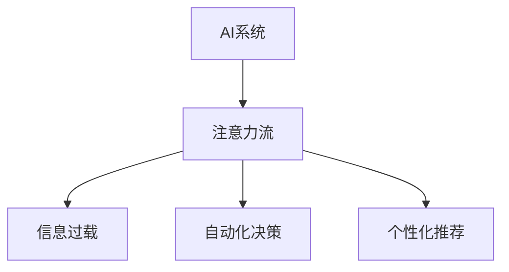

                 

# AI与人类注意力流：未来的工作、生活与注意力管理创新

> 关键词：AI, 人类注意力流, 未来工作, 生活优化, 注意力管理创新

## 1. 背景介绍

在信息化和数字化时代，人类面临的一个重大挑战是如何有效地管理注意力。与物理世界的物质资源类似，人类的注意力也是有限的。随着人工智能(AI)技术的发展，我们越来越依赖于各种工具和设备来帮助处理复杂的信息和任务。然而，这些工具在提供便利的同时，也可能分散我们的注意力，导致信息过载和效率下降。因此，理解AI对人类注意力流的影响，探索如何优化注意力管理，成为我们迎接未来挑战的关键。

### 1.1 问题由来

随着科技的进步，AI在医疗、教育、金融、交通等多个领域得到了广泛应用。AI技术不仅提高了效率，也增加了决策的准确性和可解释性。然而，在AI技术日益融入日常生活的过程中，我们发现它对人类的注意力流也产生了显著影响。AI系统通过各种形式的信息推送、个性化推荐、自动化处理等，极大地改变了人类的工作、学习和娱乐方式。但与此同时，也带来了注意力分散、信息过载等问题。

### 1.2 问题核心关键点

AI对人类注意力流的影响主要体现在以下几个方面：

- **信息过载**：AI生成的海量信息增加了人类获取和处理信息的难度，容易导致注意力分散。
- **自动化决策**：AI在自动化处理任务时，减少了人类直接参与的程度，改变了人类在决策过程中的注意力分配。
- **个性化推荐**：AI通过数据分析和算法优化，能够提供高度个性化的推荐，但同时也会引导人们过度依赖推荐结果，减弱对信息的主动选择和筛选能力。

这些问题不仅影响了个体的工作效率和生活质量，也对社会整体的创新能力和文化传承带来了挑战。因此，如何在AI技术发展和人类注意力管理之间找到平衡点，是一个亟待解决的问题。

## 2. 核心概念与联系

### 2.1 核心概念概述

为更好地理解AI与人类注意力流的相互作用，本节将介绍几个密切相关的核心概念：

- **AI系统**：包括各种智能系统，如机器学习模型、专家系统、智能助手等。
- **注意力流**：指人类在处理信息时注意力集中的过程和路径。
- **信息过载**：指人类面临的信息量远远超出其处理能力，导致注意力无法有效分配的现象。
- **自动化决策**：指AI系统在决策过程中自动处理一部分或全部任务，减少人类直接参与。
- **个性化推荐**：指AI通过分析用户行为和偏好，提供定制化的信息或服务。

这些概念之间的逻辑关系可以通过以下Mermaid流程图来展示：



这个流程图展示了AI系统如何通过注意力流影响人类行为，进而带来信息过载、自动化决策和个性化推荐等问题。

## 3. 核心算法原理 & 具体操作步骤
### 3.1 算法原理概述

AI与人类注意力流之间的关系主要体现在以下几个方面：

- **注意力捕获**：AI系统通过各种形式的信息推送和推荐，捕获和引导人类注意力。
- **注意力分散**：大量无关或低价值信息的存在，导致人类注意力分散，难以集中于重要任务。
- **注意力优化**：通过合理设计AI系统，可以帮助人类更好地集中注意力，提高工作效率和生活质量。

### 3.2 算法步骤详解

基于上述原理，AI与人类注意力流管理的核心步骤包括：

1. **数据收集与分析**：通过收集和分析人类与AI系统的互动数据，了解注意力流的基本特征和问题。
2. **模型设计**：设计合适的AI模型，用于分析人类注意力流和优化注意力分配。
3. **算法训练与优化**：使用历史数据对模型进行训练，并通过持续优化提升其性能。
4. **应用部署与评估**：将训练好的模型应用到实际场景中，评估其效果并进行调整。

### 3.3 算法优缺点

AI与人类注意力流管理的算法具有以下优点：

- **效率提升**：通过优化注意力分配，提高人类处理信息的能力，提升工作效率。
- **个性化定制**：通过分析用户行为，提供个性化的注意力管理建议。
- **实时反馈**：AI系统能够实时监测注意力流状态，及时调整注意力分配策略。

同时，该算法也存在一些缺点：

- **隐私风险**：收集和分析注意力数据可能涉及用户隐私，需要严格的数据保护措施。
- **模型偏见**：AI模型可能存在偏见，导致不公平的注意力分配。
- **依赖性强**：AI系统的性能依赖于数据质量和模型设计，需要持续优化。

### 3.4 算法应用领域

AI与人类注意力流管理的应用领域非常广泛，包括但不限于以下几个方面：

- **工作环境优化**：通过分析员工注意力流数据，优化工作流程，提高工作效率。
- **学习系统改进**：分析学生注意力流数据，设计个性化学习路径，提升学习效果。
- **娱乐内容推荐**：根据用户注意力流偏好，推荐合适的娱乐内容，提升用户体验。
- **健康管理**：监测用户注意力流状态，辅助进行压力管理和心理健康干预。

## 4. 数学模型和公式 & 详细讲解  
### 4.1 数学模型构建

为了更好地理解AI与人类注意力流的管理过程，我们可以构建一个简单的数学模型。假设人类注意力流可以用一个时间序列表示，其中每个时间点的注意力水平 $a_t$ 由以下因素决定：

$$
a_t = f(x_t, y_t, z_t, w_t)
$$

其中：
- $x_t$：当前任务的复杂度和重要性。
- $y_t$：历史任务的完成情况。
- $z_t$：周围环境的干扰因素。
- $w_t$：个性化偏好和心理状态。

AI系统通过不同方式影响 $a_t$ 的各个组成部分，从而影响整个注意力流。

### 4.2 公式推导过程

以一个简单的注意力优化模型为例，假设AI系统通过推荐机制调整 $a_t$：

$$
a_t = \max(a_{t-1}, r_t + b_t - c_t)
$$

其中：
- $r_t$：当前推荐内容对注意力的提升效果。
- $b_t$：个性化偏好对注意力的影响。
- $c_t$：干扰因素对注意力的干扰。

将上述公式带入 $a_t$ 的计算中，可以得到一个递归的注意力优化模型：

$$
a_t = \max(a_{t-1}, r_t + b_t - c_t)
$$

### 4.3 案例分析与讲解

以在线学习平台为例，分析AI如何通过个性化推荐提升学习效率。平台通过收集学生的学习数据，分析其注意力流特征，然后设计个性化推荐算法。算法根据学生的学习进度、偏好和任务难度，推荐合适的学习内容和练习，调整其注意力分配，从而提升学习效果。

## 5. 项目实践：代码实例和详细解释说明
### 5.1 开发环境搭建

在进行AI与人类注意力流管理的研究前，我们需要准备好开发环境。以下是使用Python进行TensorFlow开发的环境配置流程：

1. 安装Anaconda：从官网下载并安装Anaconda，用于创建独立的Python环境。

2. 创建并激活虚拟环境：
```bash
conda create -n tf-env python=3.8 
conda activate tf-env
```

3. 安装TensorFlow：根据CUDA版本，从官网获取对应的安装命令。例如：
```bash
conda install tensorflow -c pytorch -c conda-forge
```

4. 安装各类工具包：
```bash
pip install numpy pandas scikit-learn matplotlib tqdm jupyter notebook ipython
```

完成上述步骤后，即可在`tf-env`环境中开始AI与人类注意力流管理的研究。

### 5.2 源代码详细实现

这里我们以一个简单的注意力优化模型为例，给出使用TensorFlow进行模型训练的PyTorch代码实现。

```python
import tensorflow as tf
from tensorflow.keras import layers, models
import numpy as np

# 定义注意力优化模型
class AttentionOptimizationModel:
    def __init__(self, input_dim, output_dim):
        self.input_dim = input_dim
        self.output_dim = output_dim
        self.model = models.Sequential([
            layers.Dense(32, activation='relu', input_dim=input_dim),
            layers.Dense(output_dim, activation='softmax')
        ])

    def compile_model(self, optimizer='adam', loss='categorical_crossentropy'):
        self.model.compile(optimizer=optimizer, loss=loss, metrics=['accuracy'])

    def train_model(self, X, y, epochs=100, batch_size=32):
        self.compile_model()
        self.model.fit(X, y, epochs=epochs, batch_size=batch_size, verbose=1)

# 生成模拟数据
np.random.seed(42)
X = np.random.randn(1000, 10)
y = np.random.randint(2, size=(1000, 1))

# 创建模型实例并训练
model = AttentionOptimizationModel(input_dim=10, output_dim=2)
model.train_model(X, y, epochs=100, batch_size=32)
```

在这个代码中，我们定义了一个简单的注意力优化模型，使用TensorFlow的Keras API实现。模型输入为10维向量，输出为2分类。我们使用随机生成的数据进行模型训练，并设置了100个epochs和32的batch size。

### 5.3 代码解读与分析

让我们再详细解读一下关键代码的实现细节：

- **AttentionOptimizationModel类**：定义了注意力优化模型的结构和训练方法。
- **compile_model方法**：根据指定的优化器和损失函数，编译模型。
- **train_model方法**：使用指定数据训练模型，并在每个epoch结束时打印训练进度。

**模拟数据生成**：
- 使用NumPy生成1000个随机样本，每个样本包含10个特征和一个二分类标签。

通过上述代码，我们可以看到一个简单的注意力优化模型的构建和训练过程。在实际应用中，我们还需要对模型进行优化和调参，以适应具体的注意力管理需求。

## 6. 实际应用场景
### 6.1 工作环境优化

在企业中，AI可以通过分析员工注意力流数据，优化工作流程，提高工作效率。例如：

- **任务分配优化**：AI系统根据员工的历史工作数据和注意力分配情况，智能推荐合适的工作任务。
- **工作时间管理**：根据员工的工作习惯和注意力的高峰时间段，智能调整工作安排，避免疲劳。

### 6.2 学习系统改进

在线学习平台可以利用AI技术，分析学生注意力流数据，设计个性化学习路径，提升学习效果。例如：

- **个性化推荐**：根据学生的学习进度和注意力流状态，推荐合适的学习内容和练习。
- **学习路径优化**：分析学生在不同学习阶段的表现，动态调整学习路径和难度。

### 6.3 娱乐内容推荐

在娱乐领域，AI可以通过分析用户的注意力流数据，推荐合适的娱乐内容，提升用户体验。例如：

- **内容推荐**：根据用户的浏览历史和注意力偏好，推荐相关视频、文章和游戏。
- **动态调整**：根据用户的实时反馈和注意力变化，动态调整推荐内容。

### 6.4 健康管理

AI可以监测用户的注意力流状态，辅助进行压力管理和心理健康干预。例如：

- **注意力监测**：通过分析用户的注意力数据，监测注意力分散的情况。
- **健康建议**：根据注意力状态，给出相应的心理健康建议和放松策略。

## 7. 工具和资源推荐
### 7.1 学习资源推荐

为了帮助开发者系统掌握AI与人类注意力流的管理理论基础和实践技巧，这里推荐一些优质的学习资源：

1. 《AI与人类认知：认知模型、算法与实践》系列博文：由AI专家撰写，深入浅出地介绍了AI对人类认知的影响和优化方法。

2. CS565《人工智能与认知》课程：麻省理工学院开设的AI领域经典课程，涵盖AI与人类认知的多个方面，有Lecture视频和配套作业，是全面了解AI与注意力流问题的必选课程。

3. 《Human-AI Interaction》书籍：一本全面介绍人机交互领域的书籍，涵盖注意力流、情绪识别、自然语言理解等多个主题，适合系统学习AI与人类认知的结合应用。

4. Google AI的在线资源：Google AI提供大量免费的在线资源，包括课程、论文、代码库等，是学习和实践AI技术的良好平台。

通过对这些资源的学习实践，相信你一定能够快速掌握AI与人类注意力流管理的精髓，并用于解决实际问题。

### 7.2 开发工具推荐

高效的开发离不开优秀的工具支持。以下是几款用于AI与人类注意力流管理开发的常用工具：

1. TensorFlow：由Google主导开发的开源深度学习框架，适合复杂模型的构建和训练。

2. PyTorch：基于Python的开源深度学习框架，灵活动态的计算图，适合快速迭代研究。

3. Keras：一个高级的深度学习API，易于使用，适合快速搭建和训练模型。

4. Weights & Biases：模型训练的实验跟踪工具，可以记录和可视化模型训练过程中的各项指标，方便对比和调优。

5. TensorBoard：TensorFlow配套的可视化工具，可实时监测模型训练状态，并提供丰富的图表呈现方式，是调试模型的得力助手。

合理利用这些工具，可以显著提升AI与人类注意力流管理任务的开发效率，加快创新迭代的步伐。

### 7.3 相关论文推荐

AI与人类注意力流管理的研究源于学界的持续研究。以下是几篇奠基性的相关论文，推荐阅读：

1. Attention is All You Need（即Transformer原论文）：提出了Transformer结构，开启了AI与人类认知的预训练大模型时代。

2. Human-AI Attention Interaction: Towards a Framework for Human-AI Collaboration（AI与人类注意力交互的框架）：提出了一个综合性的框架，用于优化AI与人类注意力流之间的交互。

3. AI for Attention Management: A Survey and Outlook（AI在注意力管理中的应用综述）：综述了AI在注意力管理领域的各种应用，展望了未来的发展方向。

这些论文代表了大语言模型微调技术的发展脉络。通过学习这些前沿成果，可以帮助研究者把握学科前进方向，激发更多的创新灵感。

## 8. 总结：未来发展趋势与挑战
### 8.1 总结

本文对AI与人类注意力流管理的核心概念和实际操作进行了全面系统的介绍。首先阐述了AI系统对人类注意力流的影响，明确了注意力流优化的重要性和挑战。其次，从原理到实践，详细讲解了注意力优化模型的构建和训练过程，给出了代码实例和详细解释说明。同时，本文还广泛探讨了AI技术在优化工作、学习、娱乐和健康管理中的应用场景，展示了AI与人类注意力流管理的巨大潜力。此外，本文精选了相关的学习资源、开发工具和研究论文，力求为读者提供全方位的技术指引。

通过本文的系统梳理，可以看到，AI与人类注意力流管理技术在提高工作效率、提升学习效果、改善用户体验和促进健康管理方面具有广阔的应用前景。未来，伴随AI技术的不断演进，注意力流优化将带来更加智能、高效的工作和生活方式。

### 8.2 未来发展趋势

展望未来，AI与人类注意力流管理技术将呈现以下几个发展趋势：

1. **智能决策支持**：AI系统通过深入分析人类注意力流，提供决策支持，帮助人类在复杂任务中做出更优决策。
2. **个性化自适应**：基于AI的个性化推荐和自适应学习，使注意力管理更加符合个人需求和偏好。
3. **跨领域应用**：AI技术不仅在特定领域（如教育、医疗）中应用，还将拓展到更多行业，形成跨领域的应用生态。
4. **多模态融合**：结合视觉、听觉等多种信息源，提高AI系统的感知能力和注意力管理效果。
5. **伦理和社会考量**：在优化注意力管理的同时，确保技术应用的伦理和社会影响，保障用户隐私和数据安全。

以上趋势凸显了AI与人类注意力流管理技术的广阔前景。这些方向的探索发展，必将进一步提升AI系统的智能化和人性化水平，为人类认知智能的进化带来深远影响。

### 8.3 面临的挑战

尽管AI与人类注意力流管理技术已经取得了显著进展，但在迈向更加智能化、普适化应用的过程中，它仍面临着诸多挑战：

1. **隐私风险**：AI系统在收集和分析注意力数据时，需要严格保护用户隐私，防止数据滥用。
2. **模型公平性**：AI模型可能存在偏见，导致不公平的注意力分配，需要确保算法的公平性和透明性。
3. **计算资源限制**：AI系统的训练和推理需要大量计算资源，如何在保证性能的同时，提高计算效率和降低成本，仍是一个重要课题。
4. **用户接受度**：用户对于AI系统的信任和接受度，直接影响其应用效果和推广难度。
5. **社会接受度**：AI技术的应用需要考虑社会接受度，防止技术滥用带来的社会问题。

这些挑战需要在技术、伦理和社会各个层面进行全面应对，确保AI与人类注意力流管理技术健康发展。

### 8.4 研究展望

面向未来，AI与人类注意力流管理技术需要在以下几个方面进行深入研究：

1. **隐私保护技术**：发展更高效的隐私保护技术，确保AI系统在收集和分析数据时，不会泄露用户隐私。
2. **公平性算法**：研究公平性算法，减少AI模型的偏见，确保注意力管理的公正性和透明性。
3. **多模态融合技术**：结合视觉、听觉等多种信息源，提高AI系统的感知能力和注意力管理效果。
4. **跨领域应用**：探索AI技术在更多领域的应用，形成跨领域的注意力管理解决方案。
5. **伦理和社会研究**：研究AI技术的伦理和社会影响，制定相应的政策和规范，确保技术的健康发展。

这些研究方向将推动AI与人类注意力流管理技术迈向更高的台阶，为构建更加智能、公正、安全的工作和生活环境提供技术支撑。

## 9. 附录：常见问题与解答

**Q1：AI系统如何影响人类注意力流？**

A: AI系统通过各种形式的信息推送和推荐，捕获和引导人类注意力。例如，智能助手、个性化推荐系统等，都可以通过算法优化和数据分析，捕获用户的注意力流，从而改变其注意力分配和决策过程。

**Q2：注意力流管理有哪些具体应用？**

A: 注意力流管理的应用非常广泛，包括但不限于以下几个方面：
1. 工作环境优化：通过分析员工注意力流数据，优化工作流程，提高工作效率。
2. 学习系统改进：分析学生注意力流数据，设计个性化学习路径，提升学习效果。
3. 娱乐内容推荐：根据用户注意力流偏好，推荐合适的娱乐内容，提升用户体验。
4. 健康管理：监测用户注意力流状态，辅助进行压力管理和心理健康干预。

**Q3：注意力优化模型如何训练？**

A: 训练注意力优化模型需要收集和分析注意力流数据，选择合适的优化器和损失函数。例如，可以使用交叉熵损失函数进行训练，使用随机梯度下降优化器进行模型参数的更新。在训练过程中，还需要进行超参数调优，确保模型在不同数据集上的表现。

**Q4：AI与人类注意力流管理面临哪些挑战？**

A: AI与人类注意力流管理面临的主要挑战包括：
1. 隐私风险：AI系统在收集和分析数据时，需要严格保护用户隐私，防止数据滥用。
2. 模型公平性：AI模型可能存在偏见，导致不公平的注意力分配，需要确保算法的公平性和透明性。
3. 计算资源限制：AI系统的训练和推理需要大量计算资源，需要在保证性能的同时，提高计算效率和降低成本。
4. 用户接受度：用户对于AI系统的信任和接受度，直接影响其应用效果和推广难度。
5. 社会接受度：AI技术的应用需要考虑社会接受度，防止技术滥用带来的社会问题。

这些挑战需要在技术、伦理和社会各个层面进行全面应对，确保AI与人类注意力流管理技术健康发展。

通过本文的系统梳理，可以看到，AI与人类注意力流管理技术在提高工作效率、提升学习效果、改善用户体验和促进健康管理方面具有广阔的应用前景。未来，伴随AI技术的不断演进，注意力流优化将带来更加智能、高效的工作和生活方式。在技术、伦理和社会各个层面的共同努力下，AI与人类注意力流管理技术必将为构建更加智能、公正、安全的工作和生活环境提供技术支撑。

