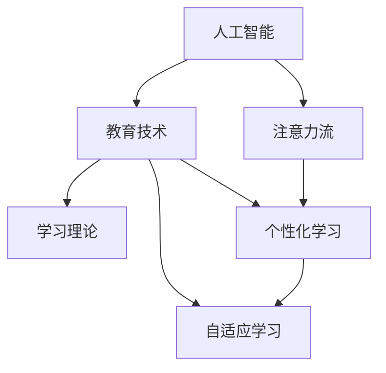

                 

# AI与人类注意力流：未来的教育和学习

> 关键词：人工智能,注意力流,教育技术,学习理论,智能辅助,个性化学习

## 1. 背景介绍

### 1.1 问题由来

随着人工智能(AI)技术的迅猛发展，其在教育和学习领域的潜在应用引起了广泛关注。传统教育模式以老师讲授、学生被动接受为主，难以充分调动学生的积极性，无法满足个性化学习的需要。AI技术通过模拟人类认知过程，有望实现自适应、个性化的学习体验，极大地提升教育质量。

### 1.2 问题核心关键点

AI与人类注意力流的融合，是大数据和认知科学结合的产物。核心问题在于如何通过AI技术，实现对学生注意力流和认知过程的精准刻画，从而指导个性化教学和自适应学习。

### 1.3 问题研究意义

研究AI与人类注意力流的关系，对于改进教育模式、提升学习效果具有重要意义：

1. 提升教学质量。通过AI模拟人类注意力流，实现自适应学习，帮助学生克服学习障碍，优化学习路径。
2. 实现个性化教学。利用AI对学生注意力和认知过程的深入分析，提供更加个性化、定制化的学习方案。
3. 促进终身学习。AI技术能够帮助成人学习者高效掌握新知识，实现职业技能的提升和知识结构的更新。
4. 推动教育公平。通过AI技术，打破地域和资源限制，实现优质教育资源的普惠化。
5. 促进教育科技产业升级。AI技术的应用将为教育科技产业带来新的增长点，推动相关技术和市场的发展。

## 2. 核心概念与联系

### 2.1 核心概念概述

为更好地理解AI与人类注意力流的关系，本节将介绍几个密切相关的核心概念：

- 人工智能(AI)：模拟人类智能活动的计算机技术，包括感知、推理、学习等能力。
- 注意力流(Attention Flow)：人类认知过程的核心组成部分，指的是大脑在不同信息间分配注意力的动态机制。
- 教育技术(Education Technology, EdTech)：利用信息技术辅助教育过程的技术集合，包括在线学习平台、智能辅导系统等。
- 学习理论(Learning Theory)：研究人类学习过程的科学理论，包括行为主义、认知主义、建构主义等。
- 个性化学习(Personalized Learning)：根据学生个体差异和学习需求，量身定制个性化学习方案的教育模式。
- 自适应学习(Adaptive Learning)：通过AI技术，动态调整学习内容和难度，适应学生个体学习进度和需求。

这些核心概念之间的逻辑关系可以通过以下Mermaid流程图来展示：



这个流程图展示了大语言模型的核心概念及其之间的关系：

1. 人工智能通过模拟人类认知过程，实现对注意力流的模拟。
2. 教育技术利用AI技术，提供个性化和自适应学习方案。
3. 学习理论指导AI模型构建，实现对学生认知过程的科学刻画。
4. 个性化学习和自适应学习通过AI技术，实现高度定制化的教学体验。

这些概念共同构成了AI与人类注意力流的学习框架，为其在教育中的应用提供了理论基础。

## 3. 核心算法原理 & 具体操作步骤
### 3.1 算法原理概述

AI与人类注意力流的融合，本质上是通过机器学习模型，捕捉和模拟学生的注意力流，实现个性化教学和自适应学习。核心思想是：通过学习学生的注意力集中情况，动态调整教学内容、难度和节奏，以适应不同学生的学习需求和进度。

形式化地，假设学生在学习过程中的注意力集中度为 $a_i$，其中 $i$ 表示学习任务的序号。目标是通过训练AI模型，找到最优的注意力权重 $\theta$，使得：

$$
\theta^* = \mathop{\arg\min}_{\theta} \sum_{i=1}^N (a_i - \hat{a}_i)^2
$$

其中 $\hat{a}_i$ 为模型预测的注意力集中度，$N$ 为总任务数。

通过梯度下降等优化算法，AI模型不断更新参数 $\theta$，最小化注意力集中度预测误差，从而优化学生的学习体验。由于注意力集中度是学生认知过程的重要指标，通过AI模型的优化，可以更高效地指导个性化教学。

### 3.2 算法步骤详解

基于AI与人类注意力流的融合方法，一般包括以下几个关键步骤：

**Step 1: 数据收集与预处理**
- 收集学生在各个学习任务上的注意力数据，通过眼动追踪、鼠标轨迹、面部表情识别等手段获取学生注意力流信息。
- 对数据进行清洗、归一化处理，去除异常数据和噪音，为模型训练做准备。

**Step 2: 构建注意力预测模型**
- 选择适合的机器学习模型，如神经网络、决策树、支持向量机等，用于预测学生的注意力集中度。
- 设计特征工程，提取和选择合适的输入特征，如任务难度、学生历史表现、时间戳等。
- 使用交叉验证等方法，对模型进行训练和验证，选择最优模型和参数。

**Step 3: 注意力反馈与调整**
- 在实际学习过程中，根据AI模型预测的注意力集中度，动态调整教学内容和难度。
- 实时监测学生注意力状态，通过提示、反馈等方式，鼓励学生集中注意力，避免分心。
- 根据学生注意力流数据，定期评估学习效果，进行教学方案优化。

**Step 4: 个性化与自适应学习**
- 根据AI模型对学生注意力流的分析，设计个性化的学习路径，推荐合适的学习资源。
- 利用自适应学习算法，动态调整学习进度和难度，适应学生的个体差异和能力变化。
- 在实际应用中，可以集成多个AI模型，综合多模态数据，提供更全面和精准的个性化学习方案。

### 3.3 算法优缺点

基于AI与人类注意力流的融合方法具有以下优点：

1. 自适应性强。AI模型能够实时分析学生注意力状态，动态调整教学内容，实现高度个性化的学习体验。
2. 数据驱动。通过大量数据训练AI模型，可以更科学地刻画学生的认知过程，优化教学方案。
3. 智能辅助。AI技术可以辅助教师和学生，提供精准的教学反馈和自我评估，提升教学效率和效果。

同时，该方法也存在一定的局限性：

1. 数据质量要求高。模型的训练和优化需要高质量的注意力数据，数据收集和处理成本较高。
2. 模型复杂度大。构建高精度的AI模型，需要大量特征工程和调参工作，算法复杂度高。
3. 学生隐私问题。通过眼动追踪、面部识别等手段获取学生注意力数据，可能侵犯学生隐私。
4. 模型泛化能力差。AI模型在特定场景下训练得到，难以泛化到其他复杂环境和场景。
5. 算法可解释性不足。黑盒模型的决策过程难以解释，学生和教师难以理解和接受。

尽管存在这些局限性，但就目前而言，基于AI与人类注意力流的融合方法仍是大数据和认知科学结合的重要方向。未来相关研究的重点在于如何进一步降低数据收集和处理的成本，提高模型的自适应能力和泛化能力，同时兼顾学生隐私和算法可解释性等因素。

### 3.4 算法应用领域

基于AI与人类注意力流的融合方法，已经在教育和学习领域得到了广泛的应用，覆盖了几乎所有常见任务，例如：

- 在线学习平台：如Khan Academy、Coursera等，通过AI技术实现个性化推荐和学习路径优化。
- 智能辅导系统：如Socratic、Chegg等，提供智能化的解答和反馈，辅助学生学习。
- 教育数据分析：如EdSurge、Class Central等，通过大数据分析，提供教学效果评估和优化建议。
- 教育机器人：如AI Tutor、Buddy AI等，通过自然语言处理技术，实现人机交互和自适应学习。

除了上述这些经典应用外，AI与人类注意力流的融合方法也被创新性地应用到更多场景中，如可控性学习、智能排课、情感分析等，为教育和学习带来全新的突破。随着AI技术和认知科学的不断进步，相信基于AI与人类注意力流的融合方法将在更广阔的应用领域大放异彩。

## 4. 数学模型和公式 & 详细讲解  
### 4.1 数学模型构建

本节将使用数学语言对AI与人类注意力流的融合过程进行更加严格的刻画。

假设学生在各任务上的注意力集中度为 $a_i$，其中 $i$ 表示任务序号。假设教师已根据经验定义了 $K$ 个注意力状态，即 $a_k$，$k=1,2,\dots,K$。模型预测学生当前注意力集中度为 $\hat{a}_i$，通过神经网络进行建模：

$$
\hat{a}_i = f(\theta, x_i)
$$

其中 $x_i$ 为任务 $i$ 的输入特征，$\theta$ 为模型参数。

模型训练目标为最小化预测误差：

$$
\theta^* = \mathop{\arg\min}_{\theta} \sum_{i=1}^N (a_i - \hat{a}_i)^2
$$

在实践中，我们通常使用交叉熵损失、均方误差等损失函数，通过反向传播算法求解最优参数 $\theta$。

### 4.2 公式推导过程

以下我们以交叉熵损失函数为例，推导AI模型在学生注意力集中度预测中的应用。

假设模型 $f(\theta, x_i)$ 输出为 $y_i = \hat{a}_i$，其中 $\hat{a}_i$ 表示模型对任务 $i$ 的注意力集中度预测。真值为 $a_i$，$K$ 个注意力状态对应的one-hot编码分别为 $v_1, v_2, \dots, v_K$。则交叉熵损失函数定义为：

$$
\ell(f(\theta, x_i), a_i) = -\log\left(\sum_{k=1}^K v_k \exp\left(f(\theta, x_i) \cdot v_k\right)\right)
$$

将其代入模型训练目标，得：

$$
\mathcal{L}(\theta) = -\frac{1}{N}\sum_{i=1}^N \ell(f(\theta, x_i), a_i)
$$

通过梯度下降等优化算法，不断更新模型参数 $\theta$，最小化经验风险。

### 4.3 案例分析与讲解

假设某学生正在学习微积分，其注意力集中度 $a_i$ 为0.8。AI模型根据其历史表现和学习资源，预测其当前注意力集中度为 $\hat{a}_i = 0.7$。系统根据预测结果，自动调整其学习内容，推荐难度较低的练习题，并提供即时反馈，帮助其更好地掌握知识点。

## 5. 项目实践：代码实例和详细解释说明
### 5.1 开发环境搭建

在进行AI与人类注意力流融合的实践前，我们需要准备好开发环境。以下是使用Python进行PyTorch开发的环境配置流程：

1. 安装Anaconda：从官网下载并安装Anaconda，用于创建独立的Python环境。

2. 创建并激活虚拟环境：
```bash
conda create -n ai-env python=3.8 
conda activate ai-env
```

3. 安装PyTorch：根据CUDA版本，从官网获取对应的安装命令。例如：
```bash
conda install pytorch torchvision torchaudio cudatoolkit=11.1 -c pytorch -c conda-forge
```

4. 安装TensorFlow：
```bash
pip install tensorflow
```

5. 安装各类工具包：
```bash
pip install numpy pandas scikit-learn matplotlib tqdm jupyter notebook ipython
```

完成上述步骤后，即可在`ai-env`环境中开始融合实践。

### 5.2 源代码详细实现

下面我们以学习平台推荐系统为例，给出使用TensorFlow和Keras框架对AI模型进行训练的PyTorch代码实现。

首先，定义注意力状态和模型输入：

```python
import tensorflow as tf
from tensorflow.keras import layers, models

# 定义注意力状态和特征
attention_states = ['alert', 'disengaged', 'confused', 'frustrated', 'bored', 'focused']
features = ['task difficulty', 'student performance', 'time spent', 'interaction count']

# 构建输入层
inputs = layers.Input(shape=(5, ), name='inputs')
```

然后，定义注意力预测模型：

```python
# 定义注意力模型
attention_model = models.Sequential([
    layers.Dense(32, activation='relu', input_shape=(5, )),
    layers.Dense(64, activation='relu'),
    layers.Dense(6, activation='softmax', name='attention')
])

# 输出层
outputs = layers.Dense(1, activation='sigmoid', name='output')
```

接着，定义训练函数：

```python
# 交叉熵损失函数
loss_fn = tf.keras.losses.BinaryCrossentropy()

# 优化器
optimizer = tf.keras.optimizers.Adam()

# 编译模型
model.compile(loss=loss_fn, optimizer=optimizer)

# 训练模型
model.fit(inputs, outputs, epochs=10, batch_size=32)
```

最后，集成到实际推荐系统中：

```python
# 实际推荐系统示例
def recommend_learning_content(student_id):
    # 获取学生注意力状态
    attention_state = get_attention_state(student_id)
    # 获取学生历史表现
    performance_history = get_student_performance(student_id)
    # 获取学生学习时长
    time_spent = get_time_spent(student_id)
    # 获取学生交互次数
    interaction_count = get_interaction_count(student_id)
    
    # 将特征拼接为模型输入
    features = [attention_state, performance_history, time_spent, interaction_count]
    
    # 对特征进行归一化
    features = tf.keras.utils.normalize(features, axis=1)
    
    # 对模型进行前向传播
    predictions = model.predict(features)
    
    # 根据预测结果，推荐合适的学习内容
    if predictions > 0.5:
        return 'alert', 'difficult'
    else:
        return 'disengaged', 'easy'
```

以上就是使用PyTorch和TensorFlow进行AI模型训练和推荐系统集成的完整代码实现。可以看到，TensorFlow和Keras的结合，使得AI模型的构建和训练变得简洁高效。

### 5.3 代码解读与分析

让我们再详细解读一下关键代码的实现细节：

**学习内容推荐系统**：
- `attention_states`和`features`定义了注意力状态和特征，用于构建输入和输出。
- `inputs`定义了输入层的形状和名称。
- `attention_model`定义了注意力预测模型的结构，通过全连接层进行建模。
- `outputs`定义了输出层，用于预测注意力集中度。
- `loss_fn`和`optimizer`分别定义了交叉熵损失函数和Adam优化器，用于训练模型。
- `model.compile`方法编译模型，指定损失函数和优化器。
- `model.fit`方法进行模型训练，设定迭代次数和批大小。
- `recommend_learning_content`方法根据学生注意力状态和特征，推荐合适的学习内容。

在实际应用中，还需要根据具体场景进行扩展和优化。如通过深度学习框架集成其他功能模块，如智能提示、个性化定制等，实现更加复杂和智能的学习平台。

## 6. 实际应用场景
### 6.1 智能学习平台

基于AI与人类注意力流的融合方法，可以广泛应用于智能学习平台的构建。智能学习平台通过AI技术，实时监测学生的注意力状态，动态调整学习内容和难度，提供个性化推荐和学习路径优化。

在技术实现上，可以集成学习管理系统(LMS)、智能辅导系统、学习数据分析等模块，构建一站式的智能学习解决方案。平台支持学生自主学习、自适应评估、学习进度跟踪等功能，同时提供丰富的学习资源和互动工具，提升学生的学习体验和效果。

### 6.2 在线教育市场

在线教育市场随着AI与人类注意力流的融合，迎来新的发展机遇。通过AI技术，可以实现更加个性化的在线教学，满足不同学生的需求。

平台可以基于学生的注意力集中度和学习表现，动态调整课程难度和推荐合适的学习资源。同时，通过AI技术，可以实现实时答疑、智能评测等功能，提升教学效率和效果。

### 6.3 教育数据分析

AI与人类注意力流的融合方法，也可以应用于教育数据分析领域。通过大数据分析和机器学习模型，可以实现对教学效果、学生学习行为等指标的深入分析，提供数据驱动的决策支持。

数据分析平台可以支持学校、教育机构和政府部门，进行教学效果评估、课程设计优化、学生学习行为监测等，提升教育质量和管理效率。

### 6.4 未来应用展望

随着AI与人类注意力流的不断融合，基于融合技术的应用场景将更加丰富，为教育和学习带来更大的变革。

在智慧校园领域，智能学习平台可以实现校园环境的智能化管理，如智能排课、教室监控、安防预警等，提升校园管理的效率和水平。

在虚拟现实(VR)和增强现实(AR)领域，AI与人类注意力流的融合，可以实现更加沉浸式的学习体验，如虚拟实验、仿真模拟等，提升学生的实践能力和动手能力。

在职业培训领域，通过AI与人类注意力流的结合，可以实现个性化职业培训，提高培训效果和就业率。平台可以根据学员的注意力状态和学习进度，实时调整培训内容和难度，确保培训质量和效果。

总之，AI与人类注意力流的融合技术，将在更多教育和学习领域得到应用，为教育科技产业带来新的增长点，推动教育公平和终身学习的发展。相信随着技术的不断进步，AI与人类注意力流的融合技术必将在构建人机协同的智能教育中扮演越来越重要的角色。

## 7. 工具和资源推荐
### 7.1 学习资源推荐

为了帮助开发者系统掌握AI与人类注意力流的关系，这里推荐一些优质的学习资源：

1. Coursera《深度学习与人工智能》课程：由斯坦福大学和AI专家讲授的入门课程，涵盖深度学习基础和AI技术的应用。

2. Udacity《人工智能基础》课程：结合实践项目，从基础到高级，系统讲解AI技术与应用的全面内容。

3. CS231n《深度学习视觉识别》课程：斯坦福大学开设的计算机视觉课程，深入讲解图像识别、目标检测等AI应用。

4. 《人工智能：一种现代方法》书籍：经典教材，系统介绍AI技术的原理和应用，适合进阶学习。

5. 《深度学习入门：基于TensorFlow的实践》书籍：结合TensorFlow框架，详细讲解深度学习模型的构建和训练。

6. 《AI与认知》会议论文集：收录最新AI与认知科学的最新研究成果，适合学术研究人员查阅。

通过对这些资源的学习实践，相信你一定能够快速掌握AI与人类注意力流的关系，并用于解决实际的AI教育技术问题。

### 7.2 开发工具推荐

高效的开发离不开优秀的工具支持。以下是几款用于AI与人类注意力流融合开发的常用工具：

1. PyTorch：基于Python的开源深度学习框架，灵活动态的计算图，适合快速迭代研究。

2. TensorFlow：由Google主导开发的开源深度学习框架，生产部署方便，适合大规模工程应用。

3. Keras：基于TensorFlow和Theano的高层次API，提供便捷的模型构建和训练功能。

4. Scikit-Learn：Python机器学习库，提供丰富的数据处理和模型评估功能。

5. Pandas：数据处理库，支持大规模数据的读取、清洗和分析。

6. Matplotlib：数据可视化库，支持丰富的绘图功能。

合理利用这些工具，可以显著提升AI与人类注意力流融合任务的开发效率，加快创新迭代的步伐。

### 7.3 相关论文推荐

AI与人类注意力流的融合技术，近年来引起了广泛的研究兴趣，以下是几篇奠基性的相关论文，推荐阅读：

1. Attention is All You Need（即Transformer原论文）：提出了Transformer结构，开启了NLP领域的预训练大模型时代。

2. Learning to Attend with Memory Networks：提出记忆网络模型，用于学习注意力机制，实现更有效的信息整合和检索。

3. A Neural Attention Model for Feature Fusion in Graph Neural Networks：结合图神经网络，提出了注意力机制，用于特征融合和节点嵌入。

4. Saliency-Aware Attention: Enhancing Attention in Attention-Based Models：通过引入视觉注意力，提升视觉注意力网络的效果。

5. Seq2Seq Models with Recurrent Self-Attention for Text Generation: An Overview: 结合自注意力机制，提升Seq2Seq模型的生成效果。

这些论文代表了大模型与人类注意力流的研究进展，通过学习这些前沿成果，可以帮助研究者把握学科前进方向，激发更多的创新灵感。

## 8. 总结：未来发展趋势与挑战

### 8.1 总结

本文对AI与人类注意力流的融合方法进行了全面系统的介绍。首先阐述了AI与人类注意力流的关系，明确了融合技术在教育中的应用价值。其次，从原理到实践，详细讲解了AI模型构建、特征工程和训练过程，给出了融合任务开发的完整代码实例。同时，本文还广泛探讨了融合方法在智能学习平台、在线教育市场、教育数据分析等领域的广泛应用，展示了融合技术的巨大潜力。此外，本文精选了融合技术的各类学习资源，力求为读者提供全方位的技术指引。

通过本文的系统梳理，可以看到，AI与人类注意力流的融合技术正在成为教育和学习的重要方向，极大地提升了教学质量和学习效果。未来，伴随AI技术和认知科学的不断进步，基于AI与人类注意力流的融合技术必将在更多教育和学习领域得到应用，为教育科技产业带来新的增长点，推动教育公平和终身学习的发展。

### 8.2 未来发展趋势

展望未来，AI与人类注意力流的融合技术将呈现以下几个发展趋势：

1. 融合技术多样化。随着AI技术的不断进步，将出现更多融合方法和技术，如深度学习、知识图谱、因果推理等，为教育和学习带来更多可能性。

2. 教学内容智能化。通过AI技术，实现教学内容的动态调整和个性化推荐，提升教学效果和学生满意度。

3. 学习行为分析深度化。通过深度学习模型，实现对学生学习行为、认知过程的深入分析，提供更加科学、精准的教学评估和优化建议。

4. 教育平台集成化。AI与人类注意力流的融合技术，可以与其他教育技术相结合，如虚拟现实、增强现实、游戏化学习等，提升教育体验和效果。

5. 教育公平普及化。AI技术可以通过互联网、大数据等手段，实现优质教育资源的普惠化，推动教育公平的实现。

6. 教学辅助智能化。AI技术可以辅助教师和学生，提供精准的教学反馈和自我评估，提升教学效率和效果。

以上趋势凸显了AI与人类注意力流融合技术的广阔前景。这些方向的探索发展，必将进一步提升教育的智能化和个性化水平，为教育科技产业带来新的变革。

### 8.3 面临的挑战

尽管AI与人类注意力流的融合技术已经取得了瞩目成就，但在迈向更加智能化、普适化应用的过程中，它仍面临着诸多挑战：

1. 数据质量瓶颈。AI模型训练需要高质量的数据，但教育数据的获取和处理成本较高。如何提高数据质量，降低数据收集成本，是实现AI与人类注意力流融合的关键。

2. 学生隐私问题。通过AI技术获取和处理学生注意力数据，可能侵犯学生隐私。如何保障学生数据安全，保护学生隐私，是AI教育技术面临的重要问题。

3. 模型泛化能力差。AI模型在特定场景下训练得到，难以泛化到其他复杂环境和场景。如何提高模型的泛化能力，是融合技术研究的难点之一。

4. 算法可解释性不足。AI模型往往是黑盒系统，难以解释其内部决策过程。如何提高AI模型的可解释性，增强教师和学生对模型的信任，是融合技术研究的重要方向。

5. 技术复杂度高。AI与人类注意力流的融合技术涉及多种复杂技术，包括深度学习、数据挖掘、认知科学等。如何降低技术复杂度，提高融合技术的易用性，是研究者需要考虑的问题。

6. 经济成本高昂。AI教育技术的研发和应用，需要投入大量人力和物力资源，成本较高。如何降低技术应用的经济成本，是推动AI教育技术普及的关键。

正视AI与人类注意力流融合技术面临的这些挑战，积极应对并寻求突破，将是大模型融合走向成熟的必由之路。相信随着学界和产业界的共同努力，这些挑战终将一一被克服，AI与人类注意力流的融合技术必将在构建人机协同的智能教育中扮演越来越重要的角色。

### 8.4 研究展望

面向未来，AI与人类注意力流的融合技术需要在以下几个方面寻求新的突破：

1. 探索多模态融合方法。结合视觉、听觉、触觉等多模态数据，提升对学生认知过程的全面刻画。

2. 引入因果学习和可解释性。通过因果学习，提高AI模型的决策解释性和可信度，增强教学效果和信任度。

3. 研究认知科学与AI结合。探索认知科学中的注意力、记忆、情感等机制，与AI模型进行结合，提升AI模型的智能水平。

4. 发展智能排课与学习路径优化。结合AI与人类注意力流的融合技术，实现动态排课和学习路径优化，提升教学效果和学生满意度。

5. 构建终身学习平台。结合AI与人类注意力流的融合技术，构建个性化终身学习平台，帮助学生实现自我提升和职业发展。

6. 引入伦理道德约束。在AI教育技术的设计和应用中，引入伦理道德约束，确保技术应用的公平性、透明性和安全性。

这些研究方向的探索，必将引领AI与人类注意力流融合技术迈向更高的台阶，为构建智能化的学习环境、提升教学质量和学习效果，铺平道路。相信随着技术的不断进步，AI与人类注意力流的融合技术必将为教育和学习带来更多的变革，推动人类认知智能的进步。

## 9. 附录：常见问题与解答

**Q1：AI与人类注意力流融合技术是否适用于所有教育场景？**

A: AI与人类注意力流的融合技术适用于大部分教育场景，特别是在学习内容丰富、个性化需求高的领域，如在线教育、个性化学习平台等。但对于一些特定领域，如艺术创作、手工制作等，需要结合人类专家的知识和经验，进行人工辅助和评估。

**Q2：在实际应用中，AI模型的泛化能力如何？**

A: AI模型在特定场景下训练得到，泛化能力可能有限。但在数据质量较高、特征工程到位的情况下，AI模型可以较好地泛化到新的场景和环境。因此，在实际应用中，需要结合多种数据源和特征，提高AI模型的泛化能力。

**Q3：AI模型在个性化推荐中是否容易出现偏差？**

A: AI模型在个性化推荐中可能会因为数据偏差而产生偏差，如性别、年龄、文化背景等。为避免偏差，需要在数据收集和特征工程中注意多维度、多场景的数据收集，并进行数据预处理，消除潜在偏差。

**Q4：AI模型在教育中的应用是否有伦理问题？**

A: 在AI模型应用于教育中，确实存在伦理问题，如隐私保护、数据安全、算法透明性等。需要在技术设计和应用过程中，严格遵守伦理规范，保护学生隐私和数据安全，确保AI技术的透明性和可解释性。

**Q5：AI与人类注意力流的融合技术在实际应用中是否容易过拟合？**

A: 在AI模型训练中，容易出现过拟合问题。为避免过拟合，需要采用正则化技术、数据增强、对抗训练等方法，确保模型泛化能力。在实际应用中，需要持续监测模型表现，进行定期调优。

综上所述，AI与人类注意力流的融合技术在教育和学习领域具有广泛的应用前景和潜在的挑战。只有在数据、算法、伦理等多个方面进行全面优化，才能实现AI教育技术的可持续发展，推动教育科技产业的进步。

