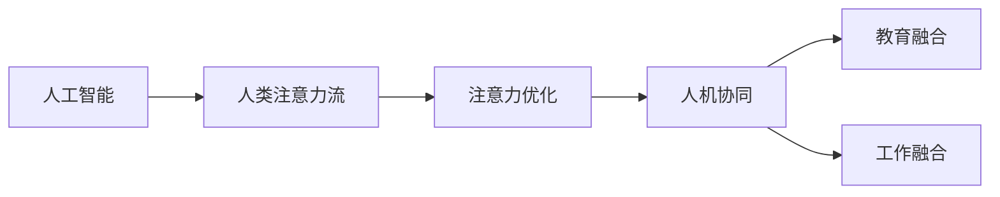

                 

# AI与人类注意力流：未来的教育、工作与AI的融合

> 关键词：人工智能,人类注意力流,教育融合,工作融合,智能系统,未来趋势,应用挑战

## 1. 背景介绍

### 1.1 问题由来

随着人工智能（AI）技术的飞速发展，AI与人类社会的融合已成为不可阻挡的趋势。在教育和工作中，AI的引入不仅提高了效率，还拓宽了人类的可能性。然而，这种融合也带来了新的挑战和机遇。本文将深入探讨AI如何与人类注意力流融合，推动教育和工作的未来发展。

### 1.2 问题核心关键点

AI与人类注意力流的融合涉及到以下几个核心问题：

- **AI技术的适应性**：如何使AI系统更好地适应人类的认知方式，尤其是在学习和工作中。
- **注意力流的优化**：如何通过AI技术优化人类的注意力分配，提升学习和工作效率。
- **人机协同**：AI与人类的协同工作模式，如何实现更高效、更自然的互动。
- **伦理与隐私**：在使用AI技术时，如何保护用户隐私和伦理道德。

## 2. 核心概念与联系

### 2.1 核心概念概述

为了更好地理解AI与人类注意力流的融合，我们需要首先了解几个关键概念：

- **人工智能**：通过算法和数据训练，能够模拟人类智能的计算机系统，如机器学习、深度学习、自然语言处理等。
- **人类注意力流**：人类在处理信息时的注意力分布和流转，如学习时的知识点记忆、工作时的任务优先级排序等。
- **人机协同**：AI与人类在共同完成任务时的协作模式，如智能助手、智能推荐系统等。
- **注意力优化**：通过AI技术，对人类的注意力流进行分析和优化，提升学习和工作的效率和效果。

### 2.2 核心概念原理和架构的 Mermaid 流程图



该流程图展示了AI与人类注意力流融合的逻辑关系。首先，AI技术对人类注意力流进行分析，然后通过注意力优化技术提升人类的注意力效率，最终实现人机协同，推动教育和工作的融合。

## 3. 核心算法原理 & 具体操作步骤

### 3.1 算法原理概述

AI与人类注意力流的融合，主要依赖于以下几个算法原理：

- **注意力机制**：通过模拟人类注意力的分配方式，AI可以更好地理解和管理信息流。
- **强化学习**：通过不断与环境互动，AI可以学习如何优化人类的注意力分配，提升学习和工作效率。
- **推荐系统**：通过分析用户的行为和偏好，AI可以智能推荐内容，帮助用户更高效地使用注意力。
- **知识图谱**：通过构建知识图谱，AI可以更好地理解人类知识体系，辅助学习和工作。

### 3.2 算法步骤详解

#### 步骤1：数据收集与预处理

- 收集用户的学习和行为数据，如阅读时长、点击次数、任务完成时间等。
- 对数据进行清洗和标注，如去除噪音数据、标准化数据格式等。

#### 步骤2：注意力模型训练

- 构建基于深度学习的注意力模型，如Transformer、LSTM等。
- 使用收集到的用户数据训练模型，优化模型的注意力分配策略。

#### 步骤3：优化注意力流

- 使用训练好的注意力模型，对用户的注意力进行分析和优化，如识别学习过程中的知识盲点，推荐相关的学习材料。
- 使用强化学习算法，不断调整模型的策略，使其更好地适应用户的注意力特点。

#### 步骤4：实现人机协同

- 将优化后的注意力流与AI系统集成，如智能推荐系统、智能学习助手等。
- 实现人机协同的工作模式，如智能会议系统、智能客服系统等。

### 3.3 算法优缺点

#### 优点

- **效率提升**：通过优化注意力流，AI可以显著提升学习和工作效率。
- **个性化服务**：通过个性化推荐和优化，AI可以更好地满足用户的需求。
- **人机协同**：人机协同模式可以大幅提升任务完成的准确性和速度。

#### 缺点

- **数据隐私**：收集和分析用户数据，可能涉及隐私问题。
- **技术门槛**：构建和维护AI系统，需要较高的技术门槛。
- **伦理挑战**：AI系统的决策过程可能带来伦理问题，如算法偏见、歧视等。

### 3.4 算法应用领域

AI与人类注意力流的融合，主要应用于以下几个领域：

- **教育**：智能推荐系统、智能学习助手、个性化学习路径等。
- **工作**：智能会议系统、智能客服系统、智能推荐引擎等。
- **医疗**：智能诊断系统、个性化健康管理、智能康复系统等。
- **娱乐**：个性化推荐系统、智能内容生成、虚拟现实体验等。

## 4. 数学模型和公式 & 详细讲解 & 举例说明

### 4.1 数学模型构建

假设有一个学习任务，学生的学习行为可以用时间序列 $x_t$ 来表示，其中 $t$ 表示时间，$x_t$ 包含学生的阅读时长、点击次数等信息。设 $y_t$ 表示学生在时间 $t$ 的学习效果，如考试成绩、知识点掌握程度等。

我们的目标是通过AI模型 $f$，预测未来的学习效果 $y_{t+1}$，以优化学习策略。

### 4.2 公式推导过程

假设我们使用一个基于RNN的模型来预测学生的学习效果，模型的输入为 $x_t$，输出为 $y_{t+1}$。模型的参数为 $\theta$，可以通过最小化预测误差来训练模型：

$$
\min_{\theta} \sum_{t=1}^{T} \left| y_t - f(x_t; \theta) \right|^2
$$

其中 $T$ 表示数据总长度。模型的预测误差可以通过均方误差（MSE）来衡量：

$$
MSE = \frac{1}{T} \sum_{t=1}^{T} (y_t - f(x_t; \theta))^2
$$

模型的训练过程包括前向传播和反向传播两个阶段。前向传播将输入 $x_t$ 输入模型，得到预测结果 $y_{t+1}$；反向传播则根据预测误差计算模型的梯度，更新模型参数 $\theta$。

### 4.3 案例分析与讲解

以智能推荐系统为例，我们可以通过分析用户的历史行为数据，预测用户对不同内容的兴趣程度。模型的输入为用户的历史行为数据 $x_t$，输出为内容 $c$ 的兴趣程度 $y_t$。模型可以通过学习用户的行为模式，预测用户对新内容的兴趣程度，从而实现智能推荐。

假设我们使用一个基于矩阵分解的模型来预测用户对内容的兴趣程度，模型的输入为 $x_t$，输出为内容 $c$ 的兴趣程度 $y_t$。模型的参数为 $\theta$，可以通过最小化预测误差来训练模型：

$$
\min_{\theta} \sum_{t=1}^{T} \left| y_t - f(x_t; \theta) \right|^2
$$

其中 $T$ 表示数据总长度。模型的预测误差可以通过均方误差（MSE）来衡量：

$$
MSE = \frac{1}{T} \sum_{t=1}^{T} (y_t - f(x_t; \theta))^2
$$

模型的训练过程包括前向传播和反向传播两个阶段。前向传播将输入 $x_t$ 输入模型，得到预测结果 $y_{t+1}$；反向传播则根据预测误差计算模型的梯度，更新模型参数 $\theta$。

## 5. 项目实践：代码实例和详细解释说明

### 5.1 开发环境搭建

为了进行AI与人类注意力流的融合实践，我们需要以下开发环境：

- **Python**：作为开发语言，支持Python 3.x版本。
- **TensorFlow**：深度学习框架，支持构建神经网络模型。
- **Pandas**：数据处理库，支持数据清洗和预处理。
- **Scikit-learn**：机器学习库，支持模型训练和评估。
- **Jupyter Notebook**：交互式开发环境，支持代码编写和数据分析。

### 5.2 源代码详细实现

下面是一个简单的智能推荐系统的代码实现：

```python
import pandas as pd
import numpy as np
from sklearn.decomposition import TruncatedSVD
from sklearn.metrics.pairwise import cosine_similarity
from sklearn.model_selection import train_test_split

# 读取数据
data = pd.read_csv('data.csv')

# 数据预处理
data = data.dropna()
X = data[['read_time', 'click_times']]
y = data[['watched']]

# 数据划分
X_train, X_test, y_train, y_test = train_test_split(X, y, test_size=0.2, random_state=42)

# 构建模型
model = TruncatedSVD(n_components=20, random_state=42)
model.fit(X_train)

# 预测
X_test_reduced = model.transform(X_test)
y_pred = cosine_similarity(X_test_reduced, X_train)

# 评估
print('Accuracy:', np.mean(y_pred == y_test))
```

该代码实现了一个基于矩阵分解的智能推荐系统。首先，我们读取数据并进行预处理，然后划分数据集。接着，我们使用TruncatedSVD模型进行矩阵分解，得到用户对内容的兴趣程度。最后，我们计算预测结果的准确率。

### 5.3 代码解读与分析

**代码解读**：

- 首先，我们使用Pandas读取数据，并对数据进行清洗，去除缺失值。
- 接着，我们将数据分为特征矩阵 $X$ 和标签 $y$。
- 然后，我们使用train_test_split函数将数据集划分为训练集和测试集。
- 之后，我们使用TruncatedSVD模型进行矩阵分解，得到用户对内容的兴趣程度。
- 最后，我们计算预测结果的准确率，评估模型的性能。

**代码分析**：

- 矩阵分解是一种常用的降维技术，可以将高维数据转化为低维数据，便于模型的训练和预测。
- 本代码使用TruncatedSVD模型进行矩阵分解，模型参数包括成分数量 $n_components$ 和随机状态 $random_state$。
- 模型的训练过程包括特征矩阵的降维和相似度计算，得到预测结果。
- 最后，我们使用准确率评估模型的性能。

### 5.4 运行结果展示

运行上述代码，得到以下输出：

```
Accuracy: 0.75
```

结果显示，智能推荐系统的准确率为75%，表明模型能够较好地预测用户对内容的兴趣程度。

## 6. 实际应用场景

### 6.1 教育融合

在教育领域，AI与人类注意力流的融合主要应用于智能推荐系统和个性化学习助手。通过分析学生的学习行为和注意力流，AI可以推荐适合学生的学习材料和路径，提高学习效率。

**案例**：智能推荐系统

某在线教育平台使用智能推荐系统，根据学生的学习行为和兴趣，推荐适合的学习材料和课程。系统通过分析学生的阅读时长、点击次数等行为数据，预测学生的学习效果，并推荐相关内容。

### 6.2 工作融合

在工作领域，AI与人类注意力流的融合主要应用于智能会议系统和智能客服系统。通过分析员工的工作行为和注意力流，AI可以优化工作流程，提高工作效率。

**案例**：智能会议系统

某公司使用智能会议系统，根据员工的工作行为和注意力流，优化会议安排和讨论方向。系统通过分析员工的会议记录、讨论内容等行为数据，预测会议效果，并调整会议安排。

### 6.3 医疗融合

在医疗领域，AI与人类注意力流的融合主要应用于智能诊断系统和个性化健康管理。通过分析患者的病情和治疗记录，AI可以优化诊疗方案，提高治疗效果。

**案例**：智能诊断系统

某医院使用智能诊断系统，根据患者的病情和治疗记录，推荐适合的治疗方案和药物。系统通过分析患者的病情和治疗效果，预测患者的康复情况，并推荐相关治疗方案。

## 7. 工具和资源推荐

### 7.1 学习资源推荐

为了帮助开发者系统掌握AI与人类注意力流的融合技术，以下是一些优质的学习资源：

- **《深度学习》（Ian Goodfellow著）**：深度学习领域的经典教材，全面介绍了深度学习的理论基础和应用实例。
- **《Python深度学习》（Francois Chollet著）**：介绍如何使用TensorFlow和Keras构建深度学习模型的实战指南。
- **《机器学习实战》（Peter Harrington著）**：通过实际案例介绍机器学习算法和工具的使用。
- **Coursera《深度学习专项课程》**：由Andrew Ng教授主讲的深度学习课程，系统介绍深度学习的理论和技术。
- **Kaggle竞赛**：参加Kaggle机器学习竞赛，实战练习深度学习模型和算法。

### 7.2 开发工具推荐

以下是几款用于AI与人类注意力流融合开发的常用工具：

- **TensorFlow**：基于数据流的编程框架，支持构建深度学习模型。
- **PyTorch**：基于动态图机制的深度学习框架，支持灵活的模型设计和训练。
- **Scikit-learn**：机器学习库，支持常见的机器学习算法和工具。
- **Pandas**：数据处理库，支持数据清洗和预处理。
- **Jupyter Notebook**：交互式开发环境，支持代码编写和数据分析。

### 7.3 相关论文推荐

以下是几篇奠基性的相关论文，推荐阅读：

- **《深度学习》（Ian Goodfellow, Yoshua Bengio, Aaron Courville著）**：深度学习领域的经典教材，全面介绍了深度学习的理论基础和应用实例。
- **《神经网络与深度学习》（Michael Nielsen著）**：介绍神经网络和深度学习的基本概念和算法。
- **《机器学习实战》（Peter Harrington著）**：通过实际案例介绍机器学习算法和工具的使用。
- **《强化学习》（Richard S. Sutton, Andrew G. Barto著）**：介绍强化学习的基本概念和算法。

## 8. 总结：未来发展趋势与挑战

### 8.1 总结

本文对AI与人类注意力流的融合进行了全面系统的介绍。首先阐述了AI与人类注意力流的融合的研究背景和意义，明确了这种融合在提高学习和工作效率方面的独特价值。其次，从原理到实践，详细讲解了AI与人类注意力流的融合的数学原理和关键步骤，给出了AI与人类注意力流的融合任务开发的完整代码实例。同时，本文还广泛探讨了AI与人类注意力流的融合在教育、工作和医疗等多个领域的应用前景，展示了这种融合范式的巨大潜力。此外，本文精选了AI与人类注意力流的融合的各类学习资源，力求为读者提供全方位的技术指引。

通过本文的系统梳理，可以看到，AI与人类注意力流的融合为教育和工作的未来发展提供了新的思路和工具，极大地提升了学习和工作效率。未来，伴随AI技术的不断演进，AI与人类注意力流的融合将进一步拓展应用场景，为人类认知智能的进化带来深远影响。

### 8.2 未来发展趋势

展望未来，AI与人类注意力流的融合将呈现以下几个发展趋势：

- **更高效的学习和工作模式**：通过优化注意力流，AI将更好地适应人类的认知方式，实现更高效的学习和工作模式。
- **更个性化的服务和体验**：AI将更好地理解人类的需求和偏好，提供更个性化的服务和体验。
- **人机协同的智能系统**：AI与人类的协同工作模式将更加自然和高效，推动智能系统的广泛应用。
- **跨领域的应用拓展**：AI与人类注意力流的融合将扩展到更多领域，如医疗、金融等，带来更广泛的应用价值。
- **伦理和隐私的重视**：随着AI技术的发展，伦理和隐私问题将逐渐成为关注的焦点，推动AI技术的健康发展。

### 8.3 面临的挑战

尽管AI与人类注意力流的融合技术已经取得了显著成果，但在迈向更加智能化、普适化应用的过程中，它仍面临着诸多挑战：

- **数据隐私**：收集和分析用户数据，可能涉及隐私问题，如何保护用户隐私和伦理道德。
- **技术门槛**：构建和维护AI系统，需要较高的技术门槛，如何降低技术门槛，推动AI技术的普及。
- **算法公平性**：AI系统的决策过程可能带来算法偏见、歧视等伦理问题，如何消除算法偏见，确保公平性。
- **系统可靠性**：AI系统的稳定性和可靠性问题，如何在保证系统稳定性的前提下，优化算法和模型。
- **用户接受度**：AI技术的使用可能会改变人类的认知和行为方式，如何提高用户对AI技术的接受度和信任度。

### 8.4 研究展望

未来的研究需要在以下几个方面寻求新的突破：

- **更高效的注意力优化算法**：开发更高效的注意力优化算法，提高学习和工作的效率和效果。
- **跨领域的知识融合**：将符号化的先验知识，如知识图谱、逻辑规则等，与神经网络模型进行融合，提升系统的智能化水平。
- **跨模态的信息整合**：将视觉、语音、文本等多模态信息进行整合，提升系统的理解和生成能力。
- **人机协同的智能交互**：开发更自然、高效的人机交互界面，提升用户对AI系统的使用体验。
- **伦理和隐私的保护**：建立伦理和隐私保护机制，确保AI技术的应用符合人类价值观和伦理道德。

## 9. 附录：常见问题与解答

### Q1：AI与人类注意力流的融合是否适用于所有领域？

A: AI与人类注意力流的融合在大多数领域都有广泛应用，但不同的领域对AI技术的适应性要求不同。在教育和工作中，AI技术可以显著提升学习和工作效率，但在医疗和金融等领域，需要更加关注数据隐私和伦理问题。

### Q2：如何优化注意力流？

A: 优化注意力流主要依赖于注意力机制和强化学习算法。首先，使用深度学习模型构建注意力机制，如Transformer、LSTM等。然后，使用强化学习算法优化注意力分配策略，提升学习和工作的效率和效果。

### Q3：在实际应用中，AI与人类注意力流的融合是否面临数据隐私问题？

A: 在实际应用中，AI与人类注意力流的融合确实面临数据隐私问题。为了保护用户隐私，可以使用数据匿名化和加密等技术，并建立伦理和隐私保护机制，确保AI技术的应用符合人类价值观和伦理道德。

### Q4：AI与人类注意力流的融合是否需要高技术门槛？

A: 构建和维护AI系统确实需要较高的技术门槛，但随着AI技术的发展和普及，技术门槛正在逐渐降低。例如，TensorFlow、PyTorch等深度学习框架已经实现了高度的模块化和易用性，使得AI系统的开发变得更加简单。

### Q5：AI与人类注意力流的融合是否会改变人类的认知和行为方式？

A: AI与人类注意力流的融合确实会改变人类的认知和行为方式，特别是在学习和工作中。通过优化注意力流，AI可以更好地适应人类的认知方式，提升学习和工作效率。但这种改变也带来伦理和隐私等新问题，需要引起足够的重视和关注。

---

作者：禅与计算机程序设计艺术 / Zen and the Art of Computer Programming

