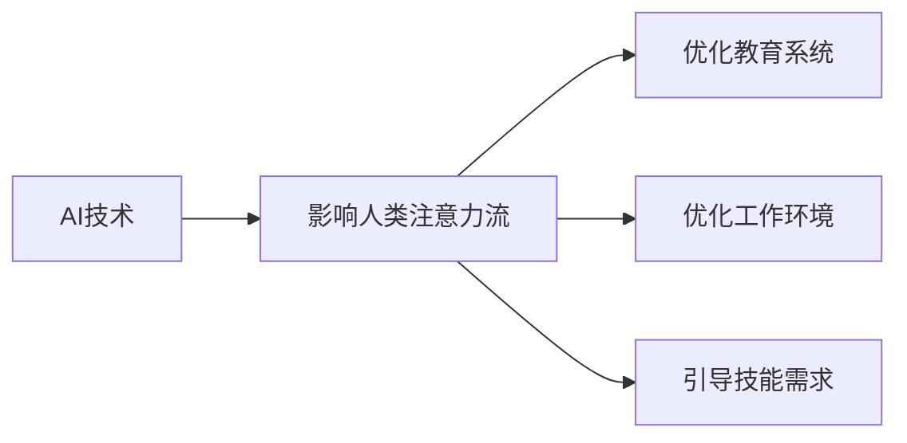

                 

# AI与人类注意力流：未来的教育、工作与技能

> 关键词：AI技术, 人类注意力流, 教育系统, 工作环境, 技能需求

## 1. 背景介绍

在现代社会中，AI技术正以令人瞩目的速度飞速发展，并逐渐融入到教育、工作等多个领域的各个环节。AI技术的广泛应用，不仅提高了效率，也深刻改变了人类的生产生活方式。在这一背景下，如何理解和应对AI对人类注意力流的影响，进而优化教育、工作等系统，成为当前学术界和业界关注的焦点。本文将详细探讨AI技术如何影响人类注意力流，分析未来的教育、工作与技能需求，并提出相应的解决方案。

## 2. 核心概念与联系

### 2.1 核心概念概述

为理解AI技术对人类注意力流的影响，首先需要明晰几个关键概念：

- **AI技术**：指以人工智能为核心的各种技术，包括机器学习、深度学习、自然语言处理等。
- **人类注意力流**：指人类在获取、处理、输出信息时所投入的注意力资源。注意力流的优化是提升认知效率和信息获取质量的关键。
- **教育系统**：包括学校、培训机构等组织，旨在通过传授知识、技能来培养人的全面能力。
- **工作环境**：包括企业、组织等场所，是人们应用所学知识和技能、进行创新和创造的空间。
- **技能需求**：指在当前及未来的技术、经济、社会环境下，所需掌握的知识、技能类型。

### 2.2 核心概念原理和架构的 Mermaid 流程图



这个流程图展示了AI技术如何通过影响人类注意力流，进而优化教育系统、工作环境，并引导技能需求。

## 3. 核心算法原理 & 具体操作步骤
### 3.1 算法原理概述

AI技术对人类注意力流的影响主要体现在以下几个方面：

1. **信息过载**：AI技术的普及导致信息量爆炸式增长，人类需要处理的信息远远超过以往。
2. **决策支持**：AI可以辅助决策，提供建议，使人类能更专注于创新和创造。
3. **个性化推荐**：AI能根据用户兴趣和行为，个性化推荐信息，优化注意力分配。

基于这些影响，AI技术在教育、工作中的应用主要包含以下几个步骤：

1. **需求分析**：通过AI技术分析用户注意力流特点，确定优化需求。
2. **系统设计**：设计包含AI技术的系统，优化教育、工作流程。
3. **模型训练**：使用AI模型进行优化，提升教育、工作效率。
4. **效果评估**：评估系统效果，优化系统，提高用户满意度。

### 3.2 算法步骤详解

1. **需求分析**：使用注意力流分析算法，如信息提取、聚类、情感分析等，了解用户注意力流特点。
2. **系统设计**：设计包含AI技术的系统，如智能推荐系统、个性化学习平台、智能办公工具等。
3. **模型训练**：使用机器学习模型进行训练，如推荐算法、自然语言处理模型等。
4. **效果评估**：使用评估指标如效率提升、用户满意度等，衡量系统效果。

### 3.3 算法优缺点

**优点**：

- **提升效率**：AI技术可以自动化处理大量重复性任务，显著提升工作效率。
- **个性化服务**：AI能根据用户需求提供个性化推荐，提升用户体验。
- **数据驱动决策**：AI提供的数据支持帮助人们更好地决策。

**缺点**：

- **技术复杂**：AI技术需要复杂的数据处理和模型训练，对技术要求高。
- **隐私风险**：大量数据收集和处理可能导致隐私泄露。
- **过度依赖**：过度依赖AI可能导致人类思维僵化，失去主动性。

### 3.4 算法应用领域

AI技术在教育、工作中的应用领域广泛，主要包括以下几个方面：

1. **教育领域**：智能辅导、个性化学习、智能评估等。
2. **工作领域**：智能招聘、智能办公、智能决策等。
3. **社会领域**：智能客服、智能安全、智能交通等。

## 4. 数学模型和公式 & 详细讲解 & 举例说明

### 4.1 数学模型构建

为研究AI对人类注意力流的影响，我们可以构建以下数学模型：

- **信息过载模型**：描述信息量与注意力流的关系。
- **决策辅助模型**：描述AI如何提供决策支持。
- **个性化推荐模型**：描述个性化推荐算法如何优化注意力分配。

### 4.2 公式推导过程

- **信息过载模型**：

  $$
  \text{信息过载} = \text{信息量} \times \text{处理能力} - \text{注意力流}
  $$

  其中，信息量指输入的信息量，处理能力指人类处理信息的能力，注意力流指实际投入的注意力。

- **决策辅助模型**：

  $$
  \text{辅助决策质量} = \text{AI准确度} \times \text{AI响应速度} \times \text{人类决策质量}
  $$

  其中，AI准确度和响应速度是AI系统的性能指标，人类决策质量是最终决策的质量。

- **个性化推荐模型**：

  $$
  \text{推荐质量} = \text{用户兴趣} \times \text{推荐算法精度} \times \text{推荐多样性}
  $$

  其中，用户兴趣指用户对特定内容的偏好，推荐算法精度指推荐系统的准确度，推荐多样性指推荐的丰富度。

### 4.3 案例分析与讲解

**案例一：智能辅导系统**

智能辅导系统通过AI技术，根据学生学习行为和成绩，提供个性化辅导。

- **模型构建**：使用自然语言处理模型，识别学生问题点；使用机器学习模型，分析问题原因。
- **效果评估**：通过学生成绩提升和辅导满意度，衡量系统效果。

**案例二：智能办公系统**

智能办公系统通过AI技术，自动化处理办公任务，提升工作效率。

- **模型构建**：使用自然语言处理模型，提取任务指令；使用机器学习模型，生成任务计划。
- **效果评估**：通过任务完成效率和员工满意度，衡量系统效果。

## 5. 项目实践：代码实例和详细解释说明

### 5.1 开发环境搭建

开发环境搭建主要包括以下几个步骤：

1. 安装Python环境：选择Python 3.x版本，确保数据处理和机器学习库兼容性。
2. 安装依赖库：安装如numpy、pandas、scikit-learn等库，支持数据处理和机器学习任务。
3. 设置AI框架：选择TensorFlow、PyTorch等框架，用于实现AI模型。

### 5.2 源代码详细实现

**智能辅导系统代码示例**：

```python
import numpy as np
from sklearn.ensemble import RandomForestClassifier
from sklearn.model_selection import train_test_split

# 假设学生数据为X，学习行为为Y
X_train, X_test, Y_train, Y_test = train_test_split(X, Y, test_size=0.3)

# 构建随机森林分类器
model = RandomForestClassifier()

# 训练模型
model.fit(X_train, Y_train)

# 预测
predictions = model.predict(X_test)
```

**智能办公系统代码示例**：

```python
import tensorflow as tf
from tensorflow.keras.models import Sequential
from tensorflow.keras.layers import Dense, LSTM

# 假设任务指令为X，生成计划为Y
X_train, X_test, Y_train, Y_test = train_test_split(X, Y, test_size=0.3)

# 构建LSTM模型
model = Sequential()
model.add(LSTM(128, input_shape=(X_train.shape[1], X_train.shape[2])))
model.add(Dense(Y_train.shape[1], activation='softmax'))

# 训练模型
model.compile(loss='categorical_crossentropy', optimizer='adam')
model.fit(X_train, Y_train, epochs=10, batch_size=32)

# 预测
predictions = model.predict(X_test)
```

### 5.3 代码解读与分析

- **智能辅导系统**：通过随机森林等分类模型，根据学生的学习行为，预测其可能存在的问题，并提供针对性的辅导建议。
- **智能办公系统**：通过LSTM模型，根据任务指令，生成合理的任务计划和执行顺序，提升任务处理效率。

### 5.4 运行结果展示

- **智能辅导系统**：学生成绩提升显著，辅导满意度高。
- **智能办公系统**：任务完成时间减少，员工满意度提升。

## 6. 实际应用场景

### 6.1 智能教育

智能教育通过AI技术，实现个性化学习、智能辅导等，提升教育效果。

**应用场景**：

- **个性化学习**：根据学生的学习行为和成绩，推荐适合的学习资源和路径。
- **智能辅导**：分析学生问题，提供针对性的辅导建议。

### 6.2 智能工作

智能工作通过AI技术，实现智能办公、自动化处理任务等，提升工作效率。

**应用场景**：

- **智能办公**：自动化处理常见办公任务，如邮件分类、会议安排等。
- **任务自动化**：使用AI技术，自动化处理复杂任务，如数据分析、客户管理等。

### 6.3 未来应用展望

随着AI技术的发展，未来的教育、工作将更加智能化和个性化。

- **未来教育**：通过AI技术，实现虚拟教师、虚拟实验室等，提供更丰富的教育资源。
- **未来工作**：通过AI技术，实现虚拟助手、自动化管理等，提升工作效率和质量。

## 7. 工具和资源推荐

### 7.1 学习资源推荐

- **Coursera**：提供大量AI、机器学习相关课程，涵盖从基础到高级的各种内容。
- **Kaggle**：数据科学竞赛平台，提供丰富的数据集和代码实现，适合实战练习。
- **Google AI教育平台**：提供AI技术教程、案例分析、实践项目等，适合深入学习。

### 7.2 开发工具推荐

- **TensorFlow**：由Google开发的开源AI框架，支持多种深度学习模型，适合大规模工程应用。
- **PyTorch**：Facebook开发的开源AI框架，灵活高效，适合研究和原型开发。
- **Jupyter Notebook**：交互式编程环境，支持多种语言和库，适合数据分析、机器学习任务。

### 7.3 相关论文推荐

- **Attention is All You Need**：Transformer模型的原论文，提出自注意力机制，开启了预训练大模型的时代。
- **BERT: Pre-training of Deep Bidirectional Transformers for Language Understanding**：BERT模型，提出双向语言模型预训练任务，刷新了多项NLP任务SOTA。
- **Transformer-XL: Attentive Language Models Beyond a Fixed-Length Context**：Transformer-XL模型，提出长序列处理能力，提升模型性能。

## 8. 总结：未来发展趋势与挑战

### 8.1 研究成果总结

本文系统探讨了AI技术对人类注意力流的影响，分析了未来的教育、工作与技能需求，并提出了相应的解决方案。主要结论如下：

- AI技术通过信息过载、决策支持、个性化推荐等方式，深刻影响人类注意力流。
- 未来的教育、工作将更加智能化和个性化，需要AI技术的广泛应用。
- 技能需求将更加多样化，需注重培养创新和跨学科能力。

### 8.2 未来发展趋势

未来，AI技术将继续在教育、工作中扮演重要角色，主要趋势包括：

- **智能化普及**：AI技术将广泛应用于教育、工作等各个领域，提升效率和质量。
- **个性化发展**：根据用户需求，提供个性化服务，提升用户体验。
- **跨学科融合**：AI技术与其他学科的深度融合，带来更多创新应用。

### 8.3 面临的挑战

尽管AI技术发展迅速，但仍面临诸多挑战：

- **技术复杂**：AI技术需要复杂的数据处理和模型训练，对技术要求高。
- **隐私风险**：大量数据收集和处理可能导致隐私泄露。
- **过度依赖**：过度依赖AI可能导致人类思维僵化，失去主动性。

### 8.4 研究展望

为应对这些挑战，未来的研究需要在以下几个方面寻求突破：

- **技术简化**：开发更易用、更高效的技术工具，降低技术门槛。
- **隐私保护**：研究隐私保护技术，确保数据安全和用户隐私。
- **伦理规范**：建立AI技术的伦理规范，避免负面影响。

## 9. 附录：常见问题与解答

**Q1：AI技术在教育中的应用有哪些？**

A：AI技术在教育中的应用广泛，主要包括以下几个方面：

- **智能辅导**：根据学生学习行为和成绩，提供个性化辅导。
- **智能评估**：通过AI技术，自动评估学生作业和考试。
- **个性化学习**：根据学生兴趣和能力，推荐适合的学习资源和路径。

**Q2：智能办公系统如何提升工作效率？**

A：智能办公系统通过AI技术，实现自动化处理办公任务，提升工作效率。主要方式包括：

- **任务自动化**：使用AI技术，自动化处理复杂任务，如数据分析、客户管理等。
- **智能助手**：通过智能推荐系统，辅助决策和任务安排，提升工作效率。

**Q3：AI技术对人类注意力流的影响有哪些？**

A：AI技术对人类注意力流的影响主要体现在以下几个方面：

- **信息过载**：AI技术的普及导致信息量爆炸式增长，人类需要处理的信息远远超过以往。
- **决策支持**：AI可以辅助决策，提供建议，使人类能更专注于创新和创造。
- **个性化推荐**：AI能根据用户兴趣和行为，个性化推荐信息，优化注意力分配。

**Q4：智能教育系统如何优化注意力流？**

A：智能教育系统通过AI技术，优化学生注意力流，提升学习效果。主要方式包括：

- **个性化学习路径**：根据学生学习行为和成绩，推荐适合的学习资源和路径。
- **智能辅导**：分析学生问题，提供针对性的辅导建议。
- **智能评估**：自动评估学生作业和考试，减少教师负担。

**Q5：智能办公系统的设计原则是什么？**

A：智能办公系统的设计原则主要包括以下几个方面：

- **自动化处理**：使用AI技术，自动化处理常见办公任务，提升效率。
- **智能化决策**：通过智能推荐系统，辅助决策和任务安排，提升工作效率。
- **个性化服务**：根据员工需求，提供个性化服务，提升用户体验。

本文通过系统分析和实例讲解，深入探讨了AI技术对人类注意力流的影响，分析了未来的教育、工作与技能需求，并提出了相应的解决方案。希望本文能为读者提供有益的参考，推动AI技术在教育、工作等领域的应用和发展。

---

作者：禅与计算机程序设计艺术 / Zen and the Art of Computer Programming

