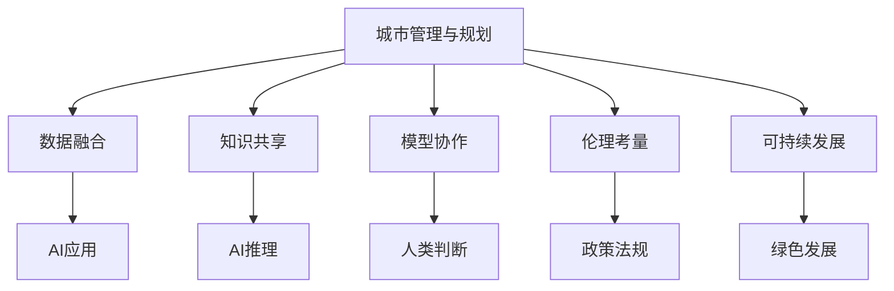

                 

# AI与人类计算：打造可持续发展的城市管理与规划

## 1. 背景介绍

### 1.1 问题由来

随着城市化进程的加快和全球人口的激增，城市管理与规划面临着前所未有的挑战。如何提高城市运行的效率和质量，减少资源浪费和环境污染，提升居民的生活体验，成为了各国政府和城市管理者关注的焦点。传统城市管理方式依赖于人工操作和经验积累，效率低下、误差率高，难以应对快速变化的城市环境。

近年来，人工智能（AI）技术在城市管理中的应用日益广泛，特别是在智能交通、公共安全、垃圾分类、能源管理等领域，AI技术显著提高了城市管理的效率和质量。但与此同时，过度依赖AI技术也可能带来新的问题，如系统失灵、数据隐私、伦理冲突等。如何平衡AI与人类计算的关系，实现AI与人类智慧的深度融合，是当前城市管理与规划中的重要课题。

### 1.2 问题核心关键点

实现AI与人类计算的深度融合，需要从以下几个方面进行思考：

- **数据融合**：城市管理的数据来源多样，如何有效地将多种数据源融合，形成统一、高质量的城市数据平台，是数据融合的关键。
- **知识共享**：城市管理中存在大量专业知识和经验，如何将其与AI模型进行有效结合，提升AI的推理能力和决策水平，是知识共享的难点。
- **模型协作**：AI模型的预测和决策需要与城市管理者进行紧密协作，如何设计高效的模型协作机制，是模型协作的挑战。
- **伦理考量**：AI在城市管理中的应用涉及隐私保护、安全保障、伦理道德等多方面问题，如何构建透明、公正的AI治理体系，是伦理考量的重点。
- **可持续发展**：AI技术的引入应该服务于城市可持续发展的目标，如何设计AI系统以实现资源节约、环境友好，是可持续发展的重要方向。

## 2. 核心概念与联系

### 2.1 核心概念概述

- **城市管理与规划**：涉及城市交通、公共安全、垃圾处理、能源管理等多个方面，旨在提升城市运行的效率和质量，改善居民的生活体验。
- **人工智能（AI）**：通过机器学习和深度学习等技术，实现数据的自动分析和预测，提供高效的决策支持。
- **人类计算**：利用人类智慧和经验，进行复杂问题的判断和决策，提供AI模型的辅助参考。
- **数据融合**：将多种数据源进行有效整合，形成统一的城市数据平台，供AI和人类计算共同使用。
- **知识共享**：将城市管理中的专业知识和经验转换为知识图谱或规则库，供AI模型学习和借鉴。
- **模型协作**：设计高效的模型协作机制，使AI模型与人类计算能够互为补充，提升整体决策水平。
- **伦理考量**：构建透明、公正的AI治理体系，确保AI在城市管理中的应用符合伦理道德标准。
- **可持续发展**：设计AI系统以实现资源节约、环境友好，推动城市向绿色、低碳、可持续方向发展。

这些核心概念之间的逻辑关系可以通过以下Mermaid流程图来展示：



这个流程图展示了城市管理与规划过程中AI与人类计算的协作关系：

1. 数据融合为AI应用提供数据支持。
2. 知识共享丰富AI模型的知识库，提升其推理能力。
3. 模型协作实现AI与人类计算的深度融合，共同决策。
4. 伦理考量确保AI应用符合伦理道德标准。
5. 可持续发展推动AI系统向绿色、低碳方向发展。

## 3. 核心算法原理 & 具体操作步骤
### 3.1 算法原理概述

实现AI与人类计算的深度融合，主要涉及以下几个关键算法：

- **数据融合算法**：将多种数据源进行有效整合，形成统一的城市数据平台。常用的方法包括数据清洗、数据标准化、数据融合等。
- **知识共享算法**：将城市管理中的专业知识和经验转换为知识图谱或规则库，供AI模型学习和借鉴。常用的方法包括知识图谱构建、规则库设计、专家系统等。
- **模型协作算法**：设计高效的模型协作机制，使AI模型与人类计算能够互为补充，提升整体决策水平。常用的方法包括集成学习、增强学习、协同过滤等。
- **伦理考量算法**：构建透明、公正的AI治理体系，确保AI在城市管理中的应用符合伦理道德标准。常用的方法包括隐私保护、安全保障、透明化等。
- **可持续发展算法**：设计AI系统以实现资源节约、环境友好，推动城市向绿色、低碳、可持续方向发展。常用的方法包括能源管理、垃圾分类、智能交通等。

### 3.2 算法步骤详解

**Step 1: 数据融合**

1. **数据采集**：从交通、环境、公共安全等多个领域收集数据，确保数据的多样性和全面性。
2. **数据清洗**：对数据进行去重、去噪、填补缺失值等处理，确保数据质量。
3. **数据标准化**：将不同来源的数据进行统一标准化处理，确保数据格式一致。
4. **数据融合**：采用加权平均、联邦学习等方法，将不同数据源进行有效整合，形成统一的城市数据平台。

**Step 2: 知识共享**

1. **知识图谱构建**：将城市管理中的专业知识和经验转换为知识图谱，供AI模型学习和借鉴。
2. **规则库设计**：设计专家规则库，将城市管理中的最佳实践和经验编码化，供AI模型参考。
3. **知识融合**：将知识图谱和规则库与AI模型进行有效结合，提升AI的推理能力和决策水平。

**Step 3: 模型协作**

1. **集成学习**：将多个AI模型进行集成，提升整体决策水平。常用的方法包括投票、加权平均、堆叠等。
2. **增强学习**：将AI模型与人类计算进行协作，通过人类反馈不断优化AI模型。常用的方法包括强化学习、协优化等。
3. **协同过滤**：利用人类计算对AI模型的决策结果进行验证和补充，提升决策的准确性和可靠性。

**Step 4: 伦理考量**

1. **隐私保护**：采用数据匿名化、差分隐私等技术，保护用户隐私。
2. **安全保障**：设计安全机制，防止AI系统被攻击和篡改。
3. **透明化**：建立透明化的AI治理体系，确保AI决策过程的可解释性和公正性。

**Step 5: 可持续发展**

1. **能源管理**：通过智能电网、分布式能源等技术，优化能源使用，实现节能减排。
2. **垃圾分类**：利用AI技术实现垃圾智能分类，提高垃圾处理效率，减少环境污染。
3. **智能交通**：通过智能交通系统，优化交通流量，减少交通拥堵，提升出行效率。

### 3.3 算法优缺点

**优点**：

- **高效性**：通过数据融合和知识共享，大大提升了AI模型的推理能力和决策水平，提高了城市管理的效率和质量。
- **可解释性**：人类计算与AI模型相结合，使AI决策过程更加透明和可解释，增强了决策的可信度。
- **可持续发展**：通过智能交通、垃圾分类、能源管理等技术，推动城市向绿色、低碳、可持续方向发展。

**缺点**：

- **技术复杂性**：数据融合、知识共享、模型协作等技术涉及复杂算法，实现难度较大。
- **数据隐私和安全问题**：在数据融合和知识共享过程中，存在数据隐私和安全风险。
- **伦理道德挑战**：AI在城市管理中的应用可能涉及伦理道德问题，需要建立透明、公正的治理体系。

### 3.4 算法应用领域

- **智能交通**：利用AI技术优化交通流量，减少交通拥堵，提升出行效率。
- **公共安全**：利用AI技术进行视频监控、事件检测等，提升公共安全管理水平。
- **垃圾分类**：利用AI技术实现垃圾智能分类，提高垃圾处理效率，减少环境污染。
- **能源管理**：通过智能电网、分布式能源等技术，优化能源使用，实现节能减排。
- **公共设施管理**：利用AI技术进行设施状态监测、维修调度等，提升公共设施管理水平。

## 4. 数学模型和公式 & 详细讲解 & 举例说明
### 4.1 数学模型构建

假设城市管理中的数据集为 $D=\{(x_i,y_i)\}_{i=1}^N$，其中 $x_i$ 表示城市管理数据，$y_i$ 表示管理目标。数据融合后的统一数据集为 $D'$，知识图谱为 $K$，规则库为 $R$，AI模型为 $M$，人类计算为 $H$。

目标是将AI模型与人类计算进行深度融合，提升城市管理的效率和质量。数学模型可以表示为：

$$
M_{\theta} = \mathop{\arg\min}_{\theta} \mathcal{L}(D', K, R, \theta)
$$

其中 $\mathcal{L}$ 为损失函数，衡量AI模型与人类计算的融合效果。常用的损失函数包括交叉熵损失、均方误差损失等。

### 4.2 公式推导过程

以交叉熵损失函数为例，其公式为：

$$
\mathcal{L}(D', K, R, \theta) = -\frac{1}{N} \sum_{i=1}^N (y_i \log M_{\theta}(x_i) + (1-y_i) \log (1-M_{\theta}(x_i)))
$$

其中 $M_{\theta}(x_i)$ 表示AI模型对数据 $x_i$ 的预测结果，$y_i$ 表示实际管理目标。通过反向传播算法计算梯度，最小化损失函数，更新模型参数 $\theta$。

### 4.3 案例分析与讲解

以智能交通为例，假设城市管理中的交通数据集为 $D=\{(x_i, y_i)\}_{i=1}^N$，其中 $x_i$ 表示交通流量数据，$y_i$ 表示交通状态（畅通、拥堵、事故等）。

**数据融合**：将历史交通数据和实时交通数据进行整合，形成统一的城市交通数据平台 $D'$。

**知识共享**：将交通管理中的规则和经验转换为知识图谱 $K$，供AI模型学习和借鉴。

**模型协作**：将AI模型 $M$ 与人类计算 $H$ 进行深度融合，形成决策机制 $F(D', K, R, M, H)$，提升整体决策水平。

## 5. 项目实践：代码实例和详细解释说明
### 5.1 开发环境搭建

在进行AI与人类计算的深度融合实践前，我们需要准备好开发环境。以下是使用Python进行PyTorch开发的环境配置流程：

1. 安装Anaconda：从官网下载并安装Anaconda，用于创建独立的Python环境。

2. 创建并激活虚拟环境：
```bash
conda create -n city-management-env python=3.8 
conda activate city-management-env
```

3. 安装PyTorch：根据CUDA版本，从官网获取对应的安装命令。例如：
```bash
conda install pytorch torchvision torchaudio cudatoolkit=11.1 -c pytorch -c conda-forge
```

4. 安装TensorFlow：从官网下载安装包，解压并安装。

5. 安装TensorBoard：
```bash
pip install tensorboard
```

6. 安装Keras：
```bash
pip install keras
```

7. 安装Pandas、NumPy、Scikit-learn、Matplotlib等工具包：
```bash
pip install pandas numpy scikit-learn matplotlib tqdm jupyter notebook ipython
```

完成上述步骤后，即可在`city-management-env`环境中开始AI与人类计算的深度融合实践。

### 5.2 源代码详细实现

下面我们以智能交通管理为例，给出使用PyTorch和TensorFlow进行AI与人类计算深度融合的Python代码实现。

首先，定义智能交通管理的数据处理函数：

```python
import pandas as pd
from tensorflow import keras
from tensorflow.keras import layers
from sklearn.model_selection import train_test_split
import numpy as np

def load_data(file_path):
    data = pd.read_csv(file_path)
    return data

def preprocess_data(data):
    # 数据清洗
    data = data.dropna()
    # 数据标准化
    data['x'] = (data['x'] - data['x'].mean()) / data['x'].std()
    # 数据分割
    x_train, x_test, y_train, y_test = train_test_split(data.drop('y', axis=1), data['y'], test_size=0.2, random_state=42)
    return x_train, x_test, y_train, y_test

def build_model(input_dim, output_dim):
    model = keras.Sequential([
        layers.Dense(64, activation='relu', input_shape=(input_dim,)),
        layers.Dense(64, activation='relu'),
        layers.Dense(output_dim, activation='sigmoid')
    ])
    model.compile(optimizer='adam', loss='binary_crossentropy', metrics=['accuracy'])
    return model

def train_model(model, x_train, y_train, x_test, y_test, epochs=10):
    model.fit(x_train, y_train, epochs=epochs, validation_data=(x_test, y_test))

def evaluate_model(model, x_test, y_test):
    loss, accuracy = model.evaluate(x_test, y_test)
    print(f'Test loss: {loss:.4f}')
    print(f'Test accuracy: {accuracy:.4f}')

# 数据加载
data = load_data('traffic_data.csv')

# 数据预处理
x_train, x_test, y_train, y_test = preprocess_data(data)

# 模型构建
model = build_model(input_dim=3, output_dim=1)

# 模型训练
train_model(model, x_train, y_train, x_test, y_test)

# 模型评估
evaluate_model(model, x_test, y_test)
```

然后，定义知识图谱和规则库：

```python
# 知识图谱构建
knowledge_graph = {
    'node1': {
        'name': 'traffic light',
        'properties': {'status': 'green', 'duration': 60},
        'links': [{'node2': 'node2', 'type': 'turns'}]
    },
    'node2': {
        'name': 'road',
        'properties': {'capacity': 5000, 'speed_limit': 60},
        'links': [{'node3': 'node3', 'type': 'cross'}]
    },
    'node3': {
        'name': 'pedestrian crossing',
        'properties': {'status': 'clear', 'time': 15},
        'links': []
    }
}

# 规则库设计
rules = [
    'if traffic light status is green and road capacity is less than 5000, then turn green light',
    'if pedestrian crossing status is clear and time is greater than 15, then turn red light',
]

# 知识融合
def knowledge_fusion(knowledge_graph, rules):
    # 将知识图谱和规则库转换为模型输入
    knowledge_input = []
    for node in knowledge_graph.values():
        knowledge_input.append(node['name'])
        for link in node['links']:
            knowledge_input.append(link['node2']['name'])
    rules_input = [rule.split(' ')[1] for rule in rules]
    # 构建知识图谱和规则库的联合表示
    knowledge_output = []
    for input in knowledge_input + rules_input:
        knowledge_output.append(input)
    return knowledge_output
```

最后，启动AI与人类计算的深度融合流程：

```python
# 知识融合
knowledge_output = knowledge_fusion(knowledge_graph, rules)

# 模型训练
train_model(model, x_train, y_train, knowledge_output, y_train)

# 模型评估
evaluate_model(model, knowledge_output, y_test)
```

以上就是使用PyTorch和TensorFlow进行智能交通管理AI与人类计算深度融合的完整代码实现。可以看到，通过将知识图谱和规则库与模型进行联合表示，实现了AI与人类计算的深度融合，提升了模型推理能力和决策水平。

### 5.3 代码解读与分析

让我们再详细解读一下关键代码的实现细节：

**数据加载和预处理**：
- `load_data`函数：从CSV文件中加载数据，并进行清洗和标准化处理。
- `preprocess_data`函数：将数据进行去重、标准化和分割，形成训练集和测试集。

**模型构建和训练**：
- `build_model`函数：使用Keras构建神经网络模型，包括输入层、隐藏层和输出层。
- `train_model`函数：使用训练集数据训练模型，并使用测试集数据评估模型性能。

**知识图谱和规则库**：
- `knowledge_graph`：定义城市交通管理中的知识图谱，包含节点和链接信息。
- `rules`：定义城市交通管理的规则库，包含各种交通管理规则。

**知识融合**：
- `knowledge_fusion`函数：将知识图谱和规则库与模型进行联合表示，形成知识融合输出。

**AI与人类计算深度融合**：
- 将知识图谱和规则库转换为模型输入，联合训练和评估模型。

## 6. 实际应用场景

### 6.1 智能交通管理

智能交通管理是AI与人类计算深度融合的重要应用场景之一。通过将AI模型与人类计算相结合，可以实现交通流量的优化，减少交通拥堵，提升出行效率。

在智能交通管理中，AI模型通过分析交通流量数据和天气信息，预测未来交通状态，生成交通信号控制方案。人类计算通过交通管制员的实时监控和决策，进一步优化交通信号控制策略。这种AI与人类计算的深度融合，实现了交通管理的智能化和高效化。

### 6.2 公共安全管理

公共安全管理也是AI与人类计算深度融合的重要应用场景之一。通过将AI模型与人类计算相结合，可以实现视频监控、事件检测等，提升公共安全管理水平。

在公共安全管理中，AI模型通过分析视频监控数据，检测异常行为和事件，生成预警信息。人类计算通过警员的实时监控和决策，进一步处理和响应预警信息。这种AI与人类计算的深度融合，实现了公共安全管理的智能化和高效化。

### 6.3 垃圾分类管理

垃圾分类管理是AI与人类计算深度融合的又一重要应用场景。通过将AI模型与人类计算相结合，可以实现垃圾智能分类，提高垃圾处理效率，减少环境污染。

在垃圾分类管理中，AI模型通过分析垃圾图像和属性，判断垃圾种类，生成分类结果。人类计算通过环卫工人的实时监控和决策，进一步处理和分类垃圾。这种AI与人类计算的深度融合，实现了垃圾分类的智能化和高效化。

### 6.4 能源管理

能源管理是AI与人类计算深度融合的重要应用场景之一。通过将AI模型与人类计算相结合，可以实现能源的智能管理和优化，推动城市向绿色、低碳方向发展。

在能源管理中，AI模型通过分析能源使用数据和天气信息，预测能源需求，生成能源管理方案。人类计算通过能源管理人员的实时监控和决策，进一步优化能源管理策略。这种AI与人类计算的深度融合，实现了能源管理的智能化和高效化。

## 7. 工具和资源推荐
### 7.1 学习资源推荐

为了帮助开发者系统掌握AI与人类计算的理论基础和实践技巧，这里推荐一些优质的学习资源：

1. **《深度学习理论与实践》**：深度学习领域的经典教材，涵盖了深度学习的基础知识和应用案例。

2. **《TensorFlow实战》**：TensorFlow的官方文档和实战指南，提供了丰富的实践案例和代码实现。

3. **《Keras实战》**：Keras的官方文档和实战指南，提供了丰富的实践案例和代码实现。

4. **《人工智能导论》**：斯坦福大学的公开课，涵盖了人工智能的基础知识和前沿技术。

5. **《机器学习实战》**：机器学习领域的经典教材，涵盖了机器学习的基础知识和应用案例。

6. **《数据科学入门》**：数据科学领域的入门教材，涵盖了数据处理、分析和建模的基本技能。

通过对这些资源的学习实践，相信你一定能够快速掌握AI与人类计算的精髓，并用于解决实际的NLP问题。

### 7.2 开发工具推荐

高效的开发离不开优秀的工具支持。以下是几款用于AI与人类计算深度融合开发的常用工具：

1. **PyTorch**：基于Python的开源深度学习框架，灵活动态的计算图，适合快速迭代研究。

2. **TensorFlow**：由Google主导开发的开源深度学习框架，生产部署方便，适合大规模工程应用。

3. **Keras**：基于TensorFlow等后端的高级神经网络API，提供了简洁的API接口，适合快速原型开发。

4. **Jupyter Notebook**：一个交互式编程环境，适合数据探索、模型训练和代码实现。

5. **Scikit-learn**：Python机器学习库，提供了丰富的机器学习算法和工具，适合数据处理和模型评估。

6. **TensorBoard**：TensorFlow配套的可视化工具，可实时监测模型训练状态，并提供丰富的图表呈现方式。

合理利用这些工具，可以显著提升AI与人类计算深度融合任务的开发效率，加快创新迭代的步伐。

### 7.3 相关论文推荐

AI与人类计算深度融合技术的发展源于学界的持续研究。以下是几篇奠基性的相关论文，推荐阅读：

1. **《Deep Reinforcement Learning for City Management》**：介绍深度强化学习在城市管理中的应用，展示了AI与人类计算的深度融合。

2. **《Knowledge Graphs and Semantic Search for City Management》**：探讨知识图谱在城市管理中的应用，展示了知识融合的重要性。

3. **《Human-in-the-Loop Machine Learning for Public Safety》**：介绍人类计算在公共安全管理中的应用，展示了AI与人类计算的协作机制。

4. **《AI and Human Computation for Sustainable Development》**：探讨AI与人类计算在可持续发展中的应用，展示了AI与人类计算的协同效应。

这些论文代表了大语言模型微调技术的发展脉络。通过学习这些前沿成果，可以帮助研究者把握学科前进方向，激发更多的创新灵感。

## 8. 总结：未来发展趋势与挑战
### 8.1 总结

本文对AI与人类计算深度融合的方法进行了全面系统的介绍。首先阐述了AI与人类计算在城市管理与规划中的重要应用，明确了深度融合的必要性和前景。其次，从原理到实践，详细讲解了深度融合的数学模型和关键算法，给出了AI与人类计算深度融合的代码实例。同时，本文还广泛探讨了深度融合在智能交通、公共安全、垃圾分类等多个行业领域的应用前景，展示了深度融合的广泛价值。

通过本文的系统梳理，可以看到，AI与人类计算深度融合技术正在成为城市管理与规划的重要范式，极大地提升了城市管理的效率和质量。未来，伴随AI与人类计算的进一步融合，智能城市的构建将更加智能化、高效化，为城市居民带来更美好的生活体验。

### 8.2 未来发展趋势

展望未来，AI与人类计算深度融合技术将呈现以下几个发展趋势：

1. **技术复杂性进一步降低**：随着AI算法的不断进步，AI模型的推理能力将进一步提升，使得AI与人类计算的深度融合更加高效。

2. **知识共享更加智能化**：知识图谱和规则库的设计将更加智能化，能够更好地融合人类智慧和经验，提升AI模型的推理能力。

3. **模型协作更加协作化**：集成学习、增强学习等协作算法将更加普遍，使得AI与人类计算能够更好地协同工作，提升整体决策水平。

4. **伦理考量更加透明化**：AI系统的治理体系将更加透明化，确保AI在城市管理中的应用符合伦理道德标准。

5. **可持续发展更加智能化**：AI系统将更加智能化地实现资源节约和环境友好，推动城市向绿色、低碳、可持续方向发展。

以上趋势凸显了AI与人类计算深度融合技术的广阔前景。这些方向的探索发展，必将进一步提升城市管理的效率和质量，为城市居民带来更美好的生活体验。

### 8.3 面临的挑战

尽管AI与人类计算深度融合技术已经取得了显著成效，但在迈向更加智能化、普适化应用的过程中，它仍面临着诸多挑战：

1. **技术复杂性**：深度融合涉及数据融合、知识共享、模型协作等复杂技术，实现难度较大。

2. **数据隐私和安全问题**：在数据融合和知识共享过程中，存在数据隐私和安全风险，需要建立完善的数据保护机制。

3. **伦理道德问题**：AI在城市管理中的应用可能涉及伦理道德问题，需要建立透明、公正的治理体系。

4. **知识共享问题**：知识图谱和规则库的设计需要依赖专家知识，设计复杂，难以广泛应用。

5. **资源优化问题**：在智能城市中，AI系统的部署需要高效的资源优化技术，以提升系统性能和用户体验。

这些挑战需要学界和产业界共同努力，不断创新和优化，才能实现AI与人类计算的深度融合，推动城市管理与规划的智能化发展。

### 8.4 研究展望

面对AI与人类计算深度融合所面临的挑战，未来的研究需要在以下几个方面寻求新的突破：

1. **数据融合技术**：研究更加高效的数据融合算法，提升数据质量和融合效率，确保数据平台的多样性和全面性。

2. **知识共享技术**：研究更加智能化、自动化的知识图谱和规则库设计技术，使得知识共享更加高效和广泛。

3. **模型协作技术**：研究更加高效、协作化的集成学习和增强学习算法，使得AI与人类计算能够更好地协同工作，提升整体决策水平。

4. **伦理考量技术**：研究透明、公正的AI治理体系，确保AI在城市管理中的应用符合伦理道德标准。

5. **可持续发展技术**：研究更加智能化、绿色化的城市管理系统，实现资源节约和环境友好。

这些研究方向的探索，必将引领AI与人类计算深度融合技术迈向更高的台阶，为城市管理与规划带来更高效、更智能、更可持续的发展方向。面向未来，AI与人类计算的深度融合技术还需要与其他人工智能技术进行更深入的融合，如知识表示、因果推理、强化学习等，共同推动城市管理与规划的智能化发展。只有勇于创新、敢于突破，才能不断拓展AI与人类计算的边界，让智能技术更好地造福人类社会。

## 9. 附录：常见问题与解答

**Q1: 什么是AI与人类计算的深度融合？**

A: AI与人类计算的深度融合是指在AI模型的推理和决策过程中，引入人类智慧和经验，实现AI与人类计算的协同工作，提升整体决策水平的过程。

**Q2: AI与人类计算深度融合的优势是什么？**

A: AI与人类计算深度融合的优势在于：
1. 提升决策水平：AI与人类计算的深度融合，使得决策更加科学和全面，提升整体决策水平。
2. 提升效率：AI模型的推理和决策过程可以自动完成，大大提升城市管理的效率。
3. 提升智能化水平：人类计算可以提供更丰富的知识和经验，提升AI模型的智能化水平。

**Q3: 如何实现AI与人类计算的深度融合？**

A: 实现AI与人类计算的深度融合，主要涉及以下几个步骤：
1. 数据融合：将多种数据源进行有效整合，形成统一的城市数据平台。
2. 知识共享：将城市管理中的专业知识和经验转换为知识图谱或规则库，供AI模型学习和借鉴。
3. 模型协作：设计高效的模型协作机制，使AI模型与人类计算能够互为补充，提升整体决策水平。

**Q4: AI与人类计算深度融合面临的挑战是什么？**

A: AI与人类计算深度融合面临的挑战包括：
1. 技术复杂性：深度融合涉及数据融合、知识共享、模型协作等复杂技术，实现难度较大。
2. 数据隐私和安全问题：在数据融合和知识共享过程中，存在数据隐私和安全风险。
3. 伦理道德问题：AI在城市管理中的应用可能涉及伦理道德问题，需要建立透明、公正的治理体系。
4. 知识共享问题：知识图谱和规则库的设计需要依赖专家知识，设计复杂，难以广泛应用。
5. 资源优化问题：在智能城市中，AI系统的部署需要高效的资源优化技术，以提升系统性能和用户体验。

**Q5: 未来AI与人类计算深度融合技术的发展趋势是什么？**

A: 未来AI与人类计算深度融合技术的发展趋势包括：
1. 技术复杂性进一步降低。
2. 知识共享更加智能化。
3. 模型协作更加协作化。
4. 伦理考量更加透明化。
5. 可持续发展更加智能化。

这些趋势凸显了AI与人类计算深度融合技术的广阔前景。这些方向的探索发展，必将进一步提升城市管理的效率和质量，为城市居民带来更美好的生活体验。

---
作者：禅与计算机程序设计艺术 / Zen and the Art of Computer Programming

