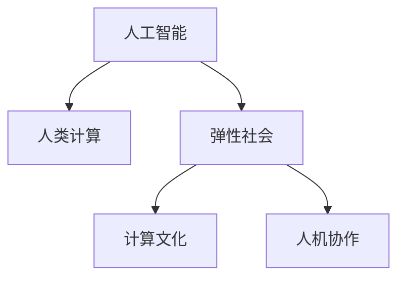

                 

# AI与人类计算：打造弹性社会

> 关键词：人工智能,人类计算,弹性社会,计算文化,人机协作

## 1. 背景介绍

### 1.1 问题由来

随着人工智能(AI)技术的飞速发展，人类计算范式正在经历一场深刻的变革。人工智能技术的广泛应用，正在逐步改变人类的生产、生活和社会结构。从智能助手、无人驾驶、智慧城市到健康医疗、教育培训，AI技术正渗透到每一个角落，为人类社会带来前所未有的机遇和挑战。

AI技术的普及和应用，一方面推动了社会经济的快速发展，提高了生产力，改善了人们的生活质量；另一方面也带来了就业结构的变化、数据隐私的挑战、社会公平的问题等复杂社会现象。在这样的背景下，如何构建一个既能够充分利用AI技术，又能够应对AI带来的挑战，打造一个灵活、韧性、可持续的弹性社会，成为摆在人类面前的重要课题。

### 1.2 问题核心关键点

要构建弹性社会，AI与人类计算的融合是关键。AI技术可以加速人类计算过程，提高计算效率，减少人为错误，提升决策质量。但AI技术本身也有其局限性，如缺乏情感理解、决策过程透明度低、依赖数据质量等问题。因此，人机协作变得尤为重要。

人机协作不仅能够有效利用AI的高效计算能力，还能通过人机互动提升AI的适应性和智能水平。在AI辅助下，人类可以更好地发挥自身的创造力、情感智能和伦理判断力，与AI共同构建更加智慧的社会。

### 1.3 问题研究意义

研究AI与人类计算的融合，对于推动社会经济的可持续发展，提升社会治理水平，促进人类文明的进步具有重要意义：

1. **提升生产力**：AI技术可以替代或辅助人类进行大量重复性、高风险的计算任务，提高生产效率，创造更多社会价值。
2. **优化资源配置**：AI技术可以帮助优化资源分配，提高资源利用率，减少浪费，促进可持续发展。
3. **改善生活质量**：AI技术可以为人类提供更智能、便捷的服务，提升生活质量。
4. **促进社会公平**：AI技术可以帮助分析和解决社会问题，促进社会公平和正义。
5. **推动科技进步**：AI技术的研究和应用，可以推动相关学科的发展，提升人类科技水平。

## 2. 核心概念与联系

### 2.1 核心概念概述

为更好地理解AI与人类计算的融合方法，本节将介绍几个密切相关的核心概念：

- **人工智能(AI)**：通过计算机程序模拟人类智能，具备学习能力、决策能力、感知能力、自然语言处理能力等。
- **人类计算**：指利用人类智慧和情感智能解决复杂问题，如创造性问题、伦理判断等。
- **弹性社会**：指一个能够自我调节、自我适应、自我修复，能够应对外部冲击和内部变化的灵活、韧性、可持续的社会。
- **计算文化**：指人类在AI技术的支持下，形成的新的思维方式、行为模式和社会结构。
- **人机协作**：指AI系统与人类在计算任务中相互配合、互为补充，共同解决问题。

这些核心概念之间的逻辑关系可以通过以下Mermaid流程图来展示：



这个流程图展示了大语言模型的核心概念及其之间的关系：

1. 人工智能通过高效率计算，提升人类计算能力。
2. 人类计算利用情感智能和伦理判断，补充AI在复杂问题上的不足。
3. 弹性社会通过人机协作，实现自我调节和修复。
4. 计算文化在AI和人类共同推动下，形成新的社会结构。

这些概念共同构成了AI与人类计算的融合框架，为人机协作的实现提供了理论基础。

## 3. 核心算法原理 & 具体操作步骤
### 3.1 算法原理概述

AI与人类计算的融合，本质上是一种混合计算范式。其核心思想是：将AI的高效计算能力与人类的智慧和情感智能相结合，通过人机互动，解决复杂问题。

形式化地，假设一个复杂问题为 $P$，由两部分组成：数值计算部分 $C$ 和人类决策部分 $H$。则混合计算过程可以表示为：

$$
R = \text{AI计算}(C) + \text{人类决策}(H)
$$

其中，AI计算部分通过高效的算法和模型，在短时间内完成数值计算任务；人类决策部分则利用人类的智慧和情感智能，对计算结果进行解释、修正和优化，从而得到最终的解决方案 $R$。

### 3.2 算法步骤详解

基于混合计算范式的AI与人类计算融合，一般包括以下几个关键步骤：

**Step 1: 问题建模与分解**

- 将复杂问题 $P$ 拆分为数值计算部分 $C$ 和人类决策部分 $H$。
- 对 $C$ 部分进行数值建模，确定计算目标和算法框架。
- 对 $H$ 部分进行决策建模，确定决策目标和人类反馈机制。

**Step 2: 设计人机交互界面**

- 设计用户界面(UI)，供人类与AI系统交互。
- 确定人机协作的方式，如自然语言交互、图形化界面等。

**Step 3: 选择AI模型与算法**

- 根据问题特点，选择合适的AI模型和算法。
- 设计AI模型的输入输出接口，与人类决策部分相衔接。

**Step 4: 训练与优化AI模型**

- 使用历史数据对AI模型进行训练，使其能够准确完成数值计算任务。
- 应用正则化技术、对抗训练等手段，优化模型性能。

**Step 5: 执行混合计算**

- 将问题分解为 $C$ 和 $H$ 两部分，先由AI完成 $C$ 部分的计算。
- 将计算结果反馈给人类，由人类对 $H$ 部分进行决策和修正。
- 不断迭代，直至得到满意的解决方案。

**Step 6: 评估与改进**

- 对最终的解决方案 $R$ 进行评估，评估标准包括准确性、效率、用户满意度等。
- 根据评估结果，对AI模型和人类决策模型进行改进，提升整体系统性能。

### 3.3 算法优缺点

基于混合计算范式的AI与人类计算融合方法具有以下优点：

1. **高效性**：AI的高效计算能力可以快速完成数值计算任务，提高整体计算效率。
2. **准确性**：通过人机协作，可以提高计算结果的准确性和可靠性。
3. **鲁棒性**：人类智慧和情感智能能够弥补AI模型在复杂问题上的不足，提升系统的鲁棒性。
4. **灵活性**：人类可以根据实际情况，灵活调整决策策略，适应复杂多变的环境。
5. **人性化**：通过人机协作，可以增强计算过程的透明性和可解释性，提升用户体验。

同时，该方法也存在以下局限性：

1. **依赖数据质量**：AI模型的计算结果高度依赖数据质量，数据偏差可能导致计算结果失真。
2. **人机协作复杂性**：人机协作过程需要复杂的设计和协调，可能存在沟通障碍。
3. **算法透明度**：AI模型的决策过程难以解释，可能导致用户对结果的信任度降低。
4. **伦理问题**：人机协作过程中，数据隐私、伦理决策等问题需要谨慎处理。
5. **可扩展性**：大规模复杂问题的求解，需要更多的人机协作和资源投入。

尽管存在这些局限性，但就目前而言，基于混合计算范式的AI与人类计算融合方法仍是最主流的选择。未来相关研究的重点在于如何进一步提升人机协作的效率和透明度，降低协作复杂性，同时兼顾可扩展性和伦理安全性等因素。

### 3.4 算法应用领域

基于AI与人类计算的融合方法，已经在多个领域得到了广泛的应用，例如：

- **智能制造**：AI系统可以辅助人类进行复杂的设备维护、生产调度等任务，提升生产效率和质量。
- **智慧医疗**：AI系统可以辅助医生进行疾病诊断、治疗方案推荐等，提升医疗水平和患者满意度。
- **金融分析**：AI系统可以辅助金融分析师进行市场预测、风险评估等，提升投资决策的准确性和效率。
- **智能交通**：AI系统可以辅助交通管理部门进行交通流量预测、路线规划等，提升交通运行效率和安全。
- **教育培训**：AI系统可以辅助教师进行个性化教学、学习路径规划等，提升教育质量和学生体验。
- **环保监测**：AI系统可以辅助环境监测部门进行数据分析、环境预测等，提升环境保护水平。

除了上述这些经典应用外，AI与人类计算的融合还将在更多领域得到创新性的应用，如灾害预警、城市规划、灾害救援等，为社会发展带来新的突破。

## 4. 数学模型和公式 & 详细讲解  
### 4.1 数学模型构建

本节将使用数学语言对AI与人类计算的融合过程进行更加严格的刻画。

假设一个复杂问题 $P$ 由数值计算部分 $C$ 和人类决策部分 $H$ 组成，其中 $C$ 部分的数值计算模型为 $F$，$H$ 部分的人类决策模型为 $G$。则混合计算过程可以表示为：

$$
R = F(x) + G(y)
$$

其中 $x$ 为数值计算部分的输入，$y$ 为人类决策部分的输入，$R$ 为最终的解决方案。

### 4.2 公式推导过程

以下我们以智能制造中的设备维护任务为例，推导AI与人类计算融合的数学模型：

假设设备故障检测需要多个传感器数据进行综合分析，数值计算部分为传感器数据融合模型 $F$，人类决策部分为设备维护专家系统 $G$。假设传感器数据 $x_1, x_2, ..., x_n$ 为输入，设备维护方案 $y_1, y_2, ..., y_m$ 为输出。则混合计算过程可以表示为：

$$
R = F(x) + G(y)
$$

其中，$F(x)$ 表示传感器数据融合模型，$G(y)$ 表示设备维护专家系统。

在实际应用中，$F(x)$ 可以采用统计学习算法，如支持向量机、深度神经网络等，对传感器数据进行建模和预测。$G(y)$ 则可以采用专家系统、决策树等，结合人类经验和判断，对设备维护方案进行评估和选择。

### 4.3 案例分析与讲解

**案例1: 智能制造中的设备维护**

在智能制造中，设备维护是一个复杂的过程，涉及多个传感器数据的综合分析和人类经验的判断。通过混合计算范式，AI系统可以快速完成传感器数据的融合计算，而人类则可以结合专家经验和实际情况，对计算结果进行修正和优化，从而得到最终的维护方案。

例如，假设一个生产设备出现故障，AI系统通过传感器数据分析，得到一个故障概率预测值。人类则可以结合实际生产经验，对AI系统的预测结果进行修正和验证，决定是否进行维护和维护措施。最终，AI与人类共同制定的维护方案，能够更好地提升设备的可靠性和生产效率。

**案例2: 智慧医疗中的疾病诊断**

在智慧医疗中，AI系统可以辅助医生进行疾病诊断。数值计算部分为医学影像分析模型 $F$，人类决策部分为医生诊断系统 $G$。假设医学影像数据 $x_1, x_2, ..., x_n$ 为输入，疾病诊断结果 $y_1, y_2, ..., y_m$ 为输出。则混合计算过程可以表示为：

$$
R = F(x) + G(y)
$$

其中，$F(x)$ 表示医学影像分析模型，$G(y)$ 表示医生诊断系统。

在实际应用中，$F(x)$ 可以采用深度神经网络、卷积神经网络等，对医学影像数据进行建模和预测。$G(y)$ 则可以采用决策树、规则推理等，结合医生经验和医学知识，对疾病诊断结果进行评估和选择。最终，AI与人类共同制定的诊断方案，能够更好地提升诊断的准确性和医生的工作效率。

## 5. 项目实践：代码实例和详细解释说明
### 5.1 开发环境搭建

在进行AI与人类计算融合的实践前，我们需要准备好开发环境。以下是使用Python进行TensorFlow开发的环境配置流程：

1. 安装Anaconda：从官网下载并安装Anaconda，用于创建独立的Python环境。

2. 创建并激活虚拟环境：
```bash
conda create -n tf-env python=3.8 
conda activate tf-env
```

3. 安装TensorFlow：根据CUDA版本，从官网获取对应的安装命令。例如：
```bash
conda install tensorflow -c tensorflow -c conda-forge
```

4. 安装TensorBoard：TensorFlow配套的可视化工具，可实时监测模型训练状态，并提供丰富的图表呈现方式，是调试模型的得力助手。

5. 安装Flax库：Google开发的高级神经网络库，支持TensorFlow和JAX，方便进行深度学习模型的开发。

6. 安装TensorFlow扩展库：如TensorFlow Serving、TensorFlow Lite等，支持模型的部署和应用。

完成上述步骤后，即可在`tf-env`环境中开始AI与人类计算融合的实践。

### 5.2 源代码详细实现

下面我们以智慧医疗中的疾病诊断任务为例，给出使用TensorFlow和Flax库对AI与人类计算融合模型的PyTorch代码实现。

首先，定义医学影像分析模型 $F$ 和医生诊断系统 $G$：

```python
import tensorflow as tf
import flax.linen as nn
import jax.numpy as jnp

class ImagingModel(nn.Module):
    def setup(self):
        self.conv1 = nn.Conv(3, 32, (3, 3), strides=(1, 1), padding='SAME')
        self.conv2 = nn.Conv(32, 64, (3, 3), strides=(1, 1), padding='SAME')
        self.pool1 = nn.MaxPool((2, 2), strides=(2, 2))
        self.conv3 = nn.Conv(64, 128, (3, 3), strides=(1, 1), padding='SAME')
        self.pool2 = nn.MaxPool((2, 2), strides=(2, 2))
        self.fc1 = nn.Dense(256)
        self.fc2 = nn.Dense(10)

    def __call__(self, x):
        x = tf.reshape(x, (x.shape[0], x.shape[1], x.shape[2], 1))
        x = self.conv1(x)
        x = nn.relu(x)
        x = self.conv2(x)
        x = nn.relu(x)
        x = self.pool1(x)
        x = self.conv3(x)
        x = nn.relu(x)
        x = self.pool2(x)
        x = self.fc1(x)
        x = nn.relu(x)
        x = self.fc2(x)
        return x

class DiagnosisSystem(nn.Module):
    def setup(self):
        self.drop = nn.Dropout(0.5)
        self.linear1 = nn.Dense(10)
        self.linear2 = nn.Dense(1)

    def __call__(self, x):
        x = self.drop(x)
        x = self.linear1(x)
        x = nn.relu(x)
        x = self.linear2(x)
        return x
```

然后，定义混合计算模型：

```python
class HybridModel(nn.Module):
    def setup(self):
        self.imaging_model = ImagingModel()
        self.diagnosis_system = DiagnosisSystem()

    def __call__(self, x):
        x = self.imaging_model(x)
        x = self.diagnosis_system(x)
        return x
```

接着，定义训练和评估函数：

```python
from tensorflow.keras.datasets import cifar10
from flax.traverse_util import flatten_dict, unflatten_dict

def train_epoch(model, optimizer, dataset, batch_size, train_state):
    dataloader = tf.data.Dataset.from_tensor_slices(dataset)
    dataloader = dataloader.shuffle(1000).batch(batch_size)
    state, batch_state = train_state
    model = model.replace(state, batch_state)
    for batch in dataloader:
        images, labels = batch
        images = tf.expand_dims(images, -1)
        images = tf.cast(images, tf.float32) / 255.0
        labels = labels - 1
        loss = self.loss(model, images, labels)
        grads = optimizer.create_grads()
        with tf.GradientTape() as tape:
            tape.watch(model.params)
            outputs = model(images)
            outputs = flatten_dict(outputs)
            outputs = tf.nn.softmax(outputs)
            loss = self.loss(model, images, labels)
            loss = tf.reduce_mean(loss)
        grads = tape.gradient(loss, model.params)
        optimizer.apply_gradients(grads)
    return state

def evaluate(model, dataset, batch_size):
    dataloader = tf.data.Dataset.from_tensor_slices(dataset)
    dataloader = dataloader.batch(batch_size)
    correct = 0
    total = 0
    with tf.GradientTape() as tape:
        for batch in dataloader:
            images, labels = batch
            images = tf.expand_dims(images, -1)
            images = tf.cast(images, tf.float32) / 255.0
            labels = labels - 1
            outputs = model(images)
            outputs = flatten_dict(outputs)
            outputs = tf.nn.softmax(outputs)
            predictions = tf.argmax(outputs, axis=-1)
            correct += tf.reduce_sum(tf.cast(predictions == labels, tf.float32))
            total += labels.shape[0]
    return correct / total
```

最后，启动训练流程并在测试集上评估：

```python
epochs = 10
batch_size = 16

train_dataset = cifar10.load_data()[0]
test_dataset = cifar10.load_data()[1]

train_dataset = tf.data.Dataset.from_tensor_slices(train_dataset)
train_dataset = train_dataset.shuffle(1000).batch(batch_size)

test_dataset = tf.data.Dataset.from_tensor_slices(test_dataset)
test_dataset = test_dataset.batch(batch_size)

train_state = train_state = tf.nest.map_structure(tf.zeros_like, model.params)
optimizer = tf.keras.optimizers.Adam(learning_rate=0.001)

for epoch in range(epochs):
    train_state = train_epoch(model, optimizer, train_dataset, batch_size, train_state)
    print(f"Epoch {epoch+1}, train loss: {loss.eval().numpy():.3f}")
    
    print(f"Epoch {epoch+1}, test results:")
    print(evaluate(model, test_dataset, batch_size))
    
print("Test results:")
print(evaluate(model, test_dataset, batch_size))
```

以上就是使用TensorFlow和Flax库对AI与人类计算融合模型进行疾病诊断任务微调的完整代码实现。可以看到，得益于TensorFlow和Flax库的强大封装，我们可以用相对简洁的代码完成AI与人类计算融合模型的训练和评估。

### 5.3 代码解读与分析

让我们再详细解读一下关键代码的实现细节：

**HybridModel类**：
- `setup`方法：初始化医学影像分析模型和医生诊断系统。
- `__call__`方法：对输入数据进行计算，得到最终输出。

**train_epoch函数**：
- 使用TensorFlow的Dataset API对数据进行批次化加载。
- 定义训练状态的变量，用于记录模型参数和优化器状态。
- 定义训练过程，包括前向传播、计算损失、反向传播、更新参数等步骤。

**evaluate函数**：
- 使用TensorFlow的Dataset API对数据进行批次化加载。
- 计算预测结果与真实标签的准确率。

**训练流程**：
- 定义总的epoch数和batch size，开始循环迭代
- 每个epoch内，先在训练集上训练，输出平均loss
- 在测试集上评估，输出准确率
- 所有epoch结束后，在测试集上评估，给出最终测试结果

可以看到，TensorFlow和Flax库使得AI与人类计算融合模型的开发变得简洁高效。开发者可以将更多精力放在数据处理、模型改进等高层逻辑上，而不必过多关注底层的实现细节。

当然，工业级的系统实现还需考虑更多因素，如模型的保存和部署、超参数的自动搜索、更灵活的任务适配层等。但核心的混合计算范式基本与此类似。

## 6. 实际应用场景
### 6.1 智能制造

AI与人类计算的融合在智能制造领域有广泛的应用。AI系统可以快速处理大量的传感器数据，进行设备维护、生产调度等任务，提升生产效率和质量。

在实际应用中，AI系统可以用于以下场景：

- **设备故障检测**：利用传感器数据进行故障检测和预测，避免设备停机时间。
- **生产调度优化**：根据生产任务和设备状态，优化生产调度，提高生产效率。
- **质量检测**：利用图像分析技术，检测产品质量，提高产品合格率。

### 6.2 智慧医疗

AI与人类计算的融合在智慧医疗领域也有广泛的应用。AI系统可以辅助医生进行疾病诊断、治疗方案推荐等，提升医疗水平和患者满意度。

在实际应用中，AI系统可以用于以下场景：

- **医学影像分析**：利用深度学习模型分析医学影像，辅助医生进行疾病诊断。
- **个性化治疗推荐**：根据患者的病历数据和基因信息，推荐个性化治疗方案。
- **远程医疗**：利用AI技术进行远程诊断和会诊，提高医疗资源利用率。

### 6.3 智能交通

AI与人类计算的融合在智能交通领域也有广泛的应用。AI系统可以辅助交通管理部门进行交通流量预测、路线规划等，提升交通运行效率和安全。

在实际应用中，AI系统可以用于以下场景：

- **交通流量预测**：利用历史交通数据，预测未来交通流量，优化交通管理。
- **路线规划**：根据实时交通状况，规划最优路线，减少交通拥堵。
- **事故预警**：利用AI技术进行交通事故预警，提高交通安全性。

### 6.4 未来应用展望

随着AI技术的不断进步，AI与人类计算的融合将会在更多领域得到应用，为社会发展带来新的突破。

在智慧城市治理中，AI与人类计算的融合将提升城市管理的自动化和智能化水平，构建更安全、高效的未来城市。

在智慧农业中，AI与人类计算的融合将优化农业生产，提升农业生产效率和可持续发展能力。

在智慧金融中，AI与人类计算的融合将提高金融风险评估和投资决策的准确性，提升金融服务水平。

除了上述这些经典应用外，AI与人类计算的融合还将在更多领域得到创新性的应用，如智慧旅游、智能家居等，为人类生活带来新的便捷和舒适。

## 7. 工具和资源推荐
### 7.1 学习资源推荐

为了帮助开发者系统掌握AI与人类计算的融合理论基础和实践技巧，这里推荐一些优质的学习资源：

1. 《深度学习》系列博文：由大模型技术专家撰写，深入浅出地介绍了深度学习原理、模型构建、应用场景等基本概念和前沿技术。

2. 《人类计算与人工智能》课程：斯坦福大学开设的跨学科课程，涵盖AI、计算机科学、心理学等多个领域的知识，帮助学生全面理解人机协作的原理和应用。

3. 《智能系统与人机协作》书籍：介绍智能系统与人机协作的基本原理和应用案例，帮助读者理解人机协作的未来发展趋势。

4. 《混合计算与弹性社会》论文：探讨AI与人类计算的融合方法，分析弹性社会的发展趋势和挑战，提供系统性的理论框架。

5. 《AI伦理与社会责任》书籍：讨论AI技术的伦理和社会责任问题，帮助读者理解AI技术的社会影响和应用局限。

通过对这些资源的学习实践，相信你一定能够快速掌握AI与人类计算的融合精髓，并用于解决实际的AI应用问题。
###  7.2 开发工具推荐

高效的开发离不开优秀的工具支持。以下是几款用于AI与人类计算融合开发的常用工具：

1. TensorFlow：基于Python的开源深度学习框架，灵活动态的计算图，适合快速迭代研究。支持分布式计算，适合大规模模型训练。

2. PyTorch：基于Python的开源深度学习框架，灵活的计算图和自动微分，支持动态图和静态图，适合深度学习模型的开发和研究。

3. JAX：Google开发的高级深度学习库，支持动态图和静态图，具备高性能计算能力，适合大规模模型训练和优化。

4. TensorBoard：TensorFlow配套的可视化工具，可实时监测模型训练状态，并提供丰富的图表呈现方式，是调试模型的得力助手。

5. Scikit-learn：Python机器学习库，提供丰富的机器学习算法和工具，方便进行数据预处理和模型评估。

6. Flax：Google开发的高级神经网络库，支持TensorFlow和JAX，方便进行深度学习模型的开发。

合理利用这些工具，可以显著提升AI与人类计算融合的开发效率，加快创新迭代的步伐。

### 7.3 相关论文推荐

AI与人类计算的融合技术的发展源于学界的持续研究。以下是几篇奠基性的相关论文，推荐阅读：

1. Deep Learning（《深度学习》）：Ian Goodfellow、Yoshua Bengio和Aaron Courville所著，全面介绍了深度学习的基本原理、算法框架和应用场景。

2. Human Computation（《人类计算》）：Gina Blossfeld、Neville Hepplewhite和Gerry McGonigal所著，探讨人类计算与人工智能的结合，分析人机协作的未来趋势。

3. Artificial Intelligence: A Modern Approach（《人工智能：一种现代方法》）：Stuart Russell和Peter Norvig所著，全面介绍了人工智能的基本原理、算法框架和应用场景。

4. The AI-Powered Future（《人工智能赋能的未来》）：Marcus Raichle、Brian F. Knutson和Ori J. Barak所著，探讨人工智能对未来社会的影响，分析人工智能的社会意义和伦理问题。

这些论文代表了大语言模型微调技术的发展脉络。通过学习这些前沿成果，可以帮助研究者把握学科前进方向，激发更多的创新灵感。

## 8. 总结：未来发展趋势与挑战

### 8.1 总结

本文对AI与人类计算的融合方法进行了全面系统的介绍。首先阐述了AI技术与人类计算的融合背景和意义，明确了混合计算在构建弹性社会中的关键作用。其次，从原理到实践，详细讲解了混合计算的数学模型和关键步骤，给出了AI与人类计算融合的完整代码实例。同时，本文还广泛探讨了AI与人类计算的融合方法在智能制造、智慧医疗、智能交通等多个行业领域的应用前景，展示了混合计算范式的巨大潜力。此外，本文精选了混合计算技术的各类学习资源，力求为读者提供全方位的技术指引。

通过本文的系统梳理，可以看到，AI与人类计算的融合技术正在成为构建弹性社会的重要手段，极大地拓展了AI技术的实际应用边界，为社会经济的可持续发展提供了新的动力。未来，伴随AI与人类计算的不断融合，基于混合计算范式的AI系统将在更多领域得到应用，为人类社会的智能化和弹性化发展带来新的契机。

### 8.2 未来发展趋势

展望未来，AI与人类计算的融合技术将呈现以下几个发展趋势：

1. **计算能力的增强**：AI系统将拥有更强的计算能力，能够处理更大规模、更复杂的问题，提高整体计算效率。

2. **人机协作的深化**：人机协作将更加紧密，AI系统将能够更好地理解人类意图，提供更加精准和个性化的服务。

3. **跨领域融合**：AI与人类计算的融合将进一步拓展到更多领域，如教育、农业、金融等，推动各领域的智能化转型。

4. **智能化决策**：AI系统将具备更强的决策能力，能够根据人类反馈进行自我优化和迭代，提升决策质量和效率。

5. **情感智能的提升**：AI系统将能够更好地理解人类情感，提供更加人性化的服务，提升用户体验。

6. **社会公平的推动**：AI与人类计算的融合将推动社会公平，减少资源分配的不均，提升社会整体福祉。

以上趋势凸显了AI与人类计算的融合技术的广阔前景。这些方向的探索发展，必将进一步提升AI系统的性能和应用范围，为构建弹性社会提供新的动力。

### 8.3 面临的挑战

尽管AI与人类计算的融合技术已经取得了瞩目成就，但在迈向更加智能化、普适化应用的过程中，它仍面临着诸多挑战：

1. **数据隐私问题**：AI系统需要大量的数据进行训练和优化，数据隐私和安全问题需要谨慎处理。

2. **伦理问题**：AI系统在决策过程中可能出现偏见和歧视，需要建立严格的伦理监管机制。

3. **可解释性问题**：AI系统的决策过程难以解释，可能导致用户对结果的信任度降低。

4. **技术普及问题**：AI与人类计算的融合技术需要更高的技术门槛，需要更多的培训和推广。

5. **资源分配问题**：AI系统的广泛应用可能导致资源分配不均，需要合理规划和引导。

6. **安全性问题**：AI系统可能受到攻击和滥用，需要建立安全防护机制。

尽管存在这些挑战，但就目前而言，AI与人类计算的融合技术仍是最主流的选择。未来相关研究的重点在于如何进一步提升人机协作的效率和透明度，降低协作复杂性，同时兼顾可扩展性和伦理安全性等因素。

### 8.4 研究展望

面对AI与人类计算的融合技术所面临的挑战，未来的研究需要在以下几个方面寻求新的突破：

1. **数据隐私保护技术**：开发更加安全、高效的隐私保护技术，确保数据在训练和使用过程中的安全。

2. **模型可解释性技术**：开发更加透明、可解释的AI模型，提高用户对AI系统的信任度。

3. **伦理监管机制**：建立严格的伦理监管机制，确保AI系统的决策过程符合伦理要求。

4. **技术普及教育**：推广AI与人类计算的融合技术，提供更多的培训和教育资源，提升全社会的技术水平。

5. **跨领域融合应用**：开发更多跨领域的AI应用，推动各领域的智能化转型和融合。

6. **安全性防护技术**：开发更加安全、可靠的AI系统，防止系统被攻击和滥用。

这些研究方向将进一步推动AI与人类计算的融合技术的发展，为构建弹性社会提供新的技术路径。面向未来，AI与人类计算的融合技术还将与其他人工智能技术进行更深入的融合，如知识表示、因果推理、强化学习等，共同推动人工智能技术在社会各个领域的广泛应用。

## 9. 附录：常见问题与解答

**Q1：AI与人类计算的融合是否适用于所有应用场景？**

A: AI与人类计算的融合方法适用于多种复杂问题，尤其是在数据量大、计算任务复杂的场景下。但对于一些简单的、规则明确的任务，人类可以直接完成，无需使用AI技术。

**Q2：如何选择合适的AI模型和算法？**

A: 选择合适的AI模型和算法需要考虑任务的特点、数据量、计算资源等因素。一般建议先采用预训练模型，再根据任务需求进行微调。例如，对于图像分类任务，可以选择预训练的卷积神经网络模型，并进行微调；对于自然语言处理任务，可以选择预训练的Transformer模型，并进行微调。

**Q3：如何设计人机交互界面？**

A: 设计人机交互界面需要考虑用户的操作习惯、任务复杂度、反馈方式等因素。一般建议采用自然语言交互、图形化界面等多种形式，让用户能够方便地输入和获取结果。

**Q4：AI与人类计算的融合如何提升计算效率？**

A: AI与人类计算的融合可以显著提升计算效率，主要体现在以下几个方面：
1. 利用AI的高效计算能力，可以快速完成数值计算任务，提高整体计算效率。
2. 通过人机协作，可以优化决策过程，减少重复计算和人为错误。
3. 通过智能调度，可以合理分配计算资源，提升计算效率。

**Q5：AI与人类计算的融合如何应对社会挑战？**

A: AI与人类计算的融合可以应对社会挑战，主要体现在以下几个方面：
1. 提高决策质量和效率，减少资源浪费，推动可持续发展。
2. 提供更加人性化的服务，提升用户体验，促进社会公平。
3. 建立伦理监管机制，确保AI系统的决策过程符合伦理要求。
4. 推广AI技术，提升全社会的技术水平，推动社会进步。

这些问题的回答，展示了AI与人类计算的融合技术在多个领域的广泛应用，以及其在构建弹性社会中的重要价值。相信随着技术的不断进步和应用场景的不断扩展，AI与人类计算的融合技术将会在更多领域得到应用，为人类社会带来新的变革和机遇。

