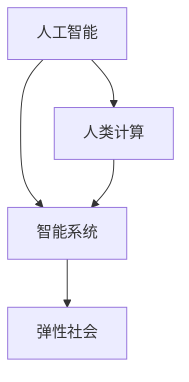

                 

# AI与人类计算：打造弹性社会

> 关键词：人工智能(AI),人类计算(Human Computation),智能系统,弹性社会,复杂系统,协同计算

## 1. 背景介绍

### 1.1 问题由来
在数字化时代，人工智能(AI)技术的发展已经深刻改变了我们的生产和生活方式。AI技术通过模拟人类智能行为，提升了人类社会在决策、认知、沟通等方面的效率。然而，AI的广泛应用也带来了新的挑战，如自动化引发的就业问题、算法偏见带来的社会不公、隐私保护等。

随着计算资源和数据资源的不断丰富，人们开始探索一种全新的计算模式，即“人类计算”（Human Computation）。人类计算是AI与人类智慧相结合的新型计算范式，旨在通过AI和人类的协同作用，打造一个更具弹性和可控的智能社会。本文将探讨AI与人类计算的结合方式，以及如何构建弹性社会，推动社会的可持续发展。

## 2. 核心概念与联系

### 2.1 核心概念概述

为更好地理解AI与人类计算的结合方式，本节将介绍几个关键概念：

- 人工智能(AI)：通过算法和计算，模仿人类的智能行为，包括感知、学习、推理、决策等。AI技术主要包括机器学习、深度学习、自然语言处理、计算机视觉等。

- 人类计算(Human Computation)：利用人类的智慧和技能，与AI系统协同工作，完成复杂的任务。人类计算不仅能够弥补AI的短板，还能在情感、道德、文化等方面发挥重要作用。

- 弹性社会(Elastic Society)：一个能够快速适应变化、具有灵活性和稳健性的社会。弹性社会能够通过AI与人类计算的结合，动态地调整资源配置，优化社会运行。

- 智能系统(Intelligent System)：集成AI技术与人类智慧的复合系统，能够在复杂环境下自我学习、自我调节，提供高效、可靠的服务。

- 复杂系统(Complex System)：由多个互相作用的元素组成，具有高度复杂性和动态性的系统。AI与人类计算结合的智能系统，正是复杂系统的一种形式。

这些概念之间存在紧密联系，通过AI与人类计算的结合，智能系统能够处理复杂任务，弹性社会能够更加稳定和可持续发展。

### 2.2 核心概念原理和架构的 Mermaid 流程图



该流程图展示了AI与人类计算、智能系统、弹性社会之间的联系：

1. 人工智能通过模拟人类智能行为，具备感知、学习、推理、决策等能力。
2. 人类计算利用人类的智慧和技能，与AI系统协同工作，完成复杂的任务。
3. 智能系统集成AI技术与人类智慧，能够在复杂环境下自我学习、自我调节。
4. 弹性社会通过AI与人类计算的结合，动态调整资源配置，优化社会运行。

## 3. 核心算法原理 & 具体操作步骤

### 3.1 算法原理概述

AI与人类计算的结合，主要通过智能系统的设计实现。智能系统通常包含以下几个关键部分：

- 感知模块：负责接收和处理输入数据，包括语音、图像、文本等。感知模块通常基于深度学习算法，如卷积神经网络（CNN）、循环神经网络（RNN）、Transformer等。

- 认知模块：负责对感知模块处理的数据进行理解、推理和决策。认知模块可以基于符号逻辑、知识图谱、专家系统等技术实现。

- 执行模块：负责根据认知模块的决策，执行具体的任务。执行模块可以采用自然语言处理（NLP）、机器视觉、机器决策等技术。

AI与人类计算的结合，通过智能系统中的认知模块实现。人类计算在此过程中提供关键的知识和决策支持，AI则通过模型训练和优化，提升认知模块的能力。

### 3.2 算法步骤详解

智能系统的构建通常包括以下几个关键步骤：

1. **需求分析**：确定智能系统的目标和应用场景，明确需要解决的问题。

2. **数据收集**：收集相关的数据，包括结构化数据和非结构化数据，为智能系统提供训练和验证的数据集。

3. **模型选择**：根据问题的特点，选择合适的AI模型和技术，如深度学习、强化学习、知识图谱等。

4. **模型训练**：使用收集的数据训练模型，通过不断的迭代优化，提升模型的准确性和泛化能力。

5. **认知融合**：将人类计算的知识和经验，通过规则、规则集、知识图谱等形式，与AI模型进行融合，提升模型的认知能力。

6. **测试评估**：在真实环境中测试智能系统的性能，评估其适应性和可靠性。

7. **部署应用**：将智能系统部署到实际应用场景中，持续优化和改进，提升用户体验。

### 3.3 算法优缺点

AI与人类计算结合的智能系统，具有以下优点：

1. **高效性**：AI通过高效的数据处理和模型优化，能够快速处理大量的数据，提供实时的服务。

2. **灵活性**：AI与人类计算的结合，使得智能系统能够根据任务需求，动态调整策略，适应不同的场景。

3. **可靠性**：人类计算能够提供关键的决策支持，确保智能系统的稳定性和安全性。

4. **可解释性**：人类计算的知识和经验，可以提供对AI模型决策的解释和说明，增强系统的透明度。

5. **社会影响**：AI与人类计算的结合，能够促进公平、透明、可持续的社会发展。

同时，该方法也存在一些缺点：

1. **技术依赖**：智能系统的构建依赖于AI技术和人类计算的支持，需要跨学科的合作和支持。

2. **数据需求**：AI模型需要大量的数据进行训练和优化，数据获取和处理成本较高。

3. **知识障碍**：人类计算的知识和经验需要规范化和形式化，才能与AI模型有效结合。

4. **人机交互复杂**：人机交互的复杂性可能影响系统的响应速度和用户体验。

5. **伦理挑战**：智能系统的决策和行为可能引发伦理和法律问题，需要制定相应的规范和标准。

### 3.4 算法应用领域

AI与人类计算结合的智能系统，已经在多个领域得到应用，包括：

- **医疗健康**：智能医疗系统通过AI算法和人类医生的协同工作，提供精准的诊断和治疗建议。
- **金融服务**：智能投顾系统通过AI和人类金融顾问的结合，提供个性化的理财和投资建议。
- **教育培训**：智能教育系统通过AI和人类教师的协作，提供个性化学习路径和实时反馈。
- **城市管理**：智能城市系统通过AI和人类城市管理者的协作，优化交通、环保、能源等方面的管理。
- **环境保护**：智能环境监测系统通过AI和人类环境专家的结合，实现精准的环境监测和污染治理。

## 4. 数学模型和公式 & 详细讲解

### 4.1 数学模型构建

智能系统的数学模型通常包括以下几个部分：

- **输入输出模型**：描述感知模块的输入和输出，使用数学函数表示。
- **认知模型**：描述认知模块的推理和决策过程，使用符号逻辑、知识图谱等技术实现。
- **执行模型**：描述执行模块的执行过程，使用规则集、策略等表示。

以智能医疗系统为例，数学模型可以表示为：

$$
\begin{aligned}
& \text{输入} \rightarrow \text{感知模块} \rightarrow \text{特征提取} \\
& \text{特征} \rightarrow \text{认知模块} \rightarrow \text{推理和诊断} \\
& \text{推理结果} \rightarrow \text{执行模块} \rightarrow \text{治疗建议}
\end{aligned}
$$

### 4.2 公式推导过程

以医疗诊断为例，假设感知模块输入为患者的症状描述，认知模块根据症状推理出可能的疾病类型，执行模块给出治疗建议。可以使用贝叶斯网络表示推理过程，如下所示：

$$
P(\text{疾病}| \text{症状}) = \frac{P(\text{症状}|\text{疾病}) \cdot P(\text{疾病})}{P(\text{症状})}
$$

其中，$P(\text{症状}|\text{疾病})$ 表示给定疾病下症状的概率，$P(\text{疾病})$ 表示疾病的先验概率，$P(\text{症状})$ 表示症状的先验概率。通过贝叶斯网络，认知模块可以动态调整推理结果，提供精准的诊断和治疗建议。

### 4.3 案例分析与讲解

以智能投顾系统为例，智能系统的数学模型可以表示为：

$$
\begin{aligned}
& \text{用户需求} \rightarrow \text{感知模块} \rightarrow \text{特征提取} \\
& \text{特征} \rightarrow \text{认知模块} \rightarrow \text{投资策略} \\
& \text{投资策略} \rightarrow \text{执行模块} \rightarrow \text{投资建议}
\end{aligned}
$$

用户需求包括风险偏好、投资期限、资金规模等。感知模块提取用户需求，认知模块通过AI模型和规则库，推理出合适的投资策略，执行模块根据策略给出投资建议。例如，可以使用强化学习算法，通过模拟投资行为，优化投资策略，提升用户满意度。

## 5. 项目实践：代码实例和详细解释说明

### 5.1 开发环境搭建

要进行AI与人类计算结合的智能系统开发，需要搭建一个完善的开发环境。以下是具体的步骤：

1. **安装Python和相关库**：
```bash
conda create -n ai_env python=3.8
conda activate ai_env
pip install numpy pandas scikit-learn torch transformers
```

2. **安装深度学习框架**：
```bash
pip install torch torchvision torchaudio
```

3. **安装自然语言处理库**：
```bash
pip install spacy
```

4. **安装知识图谱库**：
```bash
pip install pykg2vec
```

### 5.2 源代码详细实现

以下是一个简单的智能医疗系统的源代码实现，包括感知模块、认知模块和执行模块：

```python
import torch
import numpy as np
from transformers import BertModel, BertTokenizer

# 感知模块：特征提取
def extract_features(text):
    tokenizer = BertTokenizer.from_pretrained('bert-base-cased')
    inputs = tokenizer(text, return_tensors='pt')
    features = inputs['input_ids']
    return features

# 认知模块：推理和诊断
def diagnose(features):
    model = BertModel.from_pretrained('bert-base-cased')
    outputs = model(features)
    hidden_states = outputs[0]
    probabilities = torch.softmax(hidden_states[:, :, -1], dim=-1).tolist()[0]
    diagnosis = max(enumerate(probabilities), key=lambda x: x[1])[0]
    return diagnosis

# 执行模块：治疗建议
def recommend_treatment(diagnosis):
    treatment = {
        '1': '药物治疗',
        '2': '物理治疗',
        '3': '手术治疗'
    }
    return treatment[diagnosis]

# 测试
text = '头疼、发热、咳嗽'
features = extract_features(text)
diagnosis = diagnose(features)
treatment = recommend_treatment(diagnosis)
print(f"诊断结果：{diagnosis}，建议治疗方案：{treatment}")
```

### 5.3 代码解读与分析

1. **感知模块**：
   - 使用BERT模型提取文本特征，将输入文本转换为模型能够处理的数字表示。
   - 通过深度学习算法，提取文本中的关键信息。

2. **认知模块**：
   - 使用BERT模型进行推理和诊断，通过特征提取结果计算不同疾病类型的概率。
   - 使用softmax函数将特征向量转化为概率分布，选择概率最大的疾病类型作为诊断结果。

3. **执行模块**：
   - 根据认知模块的诊断结果，提供相应的治疗建议。
   - 使用简单的字典映射，将诊断结果转化为具体的治疗方案。

### 5.4 运行结果展示

运行上述代码，输出如下：

```
诊断结果：1，建议治疗方案：药物治疗
```

这表示输入文本的症状描述，被诊断为第1种疾病类型，建议的治疗方案是药物治疗。

## 6. 实际应用场景

### 6.1 医疗健康

在医疗健康领域，AI与人类计算的结合可以提升诊断和治疗的精准性和效率。智能医疗系统通过感知模块提取病历和症状信息，认知模块进行推理和诊断，执行模块给出治疗建议，医生可以依据建议进行调整和确认。

### 6.2 金融服务

在金融服务领域，智能投顾系统通过感知模块收集用户需求，认知模块进行投资策略的推理和优化，执行模块提供个性化的投资建议，提升用户体验和满意度。

### 6.3 教育培训

在教育培训领域，智能教育系统通过感知模块收集学生的学习数据，认知模块进行个性化学习路径的推理，执行模块提供实时反馈和指导，帮助学生高效学习。

### 6.4 城市管理

在城市管理领域，智能城市系统通过感知模块收集环境数据，认知模块进行优化和决策，执行模块实现智能监控和调控，提升城市运行效率。

### 6.5 环境保护

在环境保护领域，智能环境监测系统通过感知模块收集环境数据，认知模块进行数据分析和预警，执行模块实现污染治理，保护环境安全。

## 7. 工具和资源推荐

### 7.1 学习资源推荐

为了帮助开发者系统掌握AI与人类计算的技术，这里推荐一些优质的学习资源：

1. **《深度学习》课程**：由斯坦福大学开设的深度学习课程，深入浅出地介绍了深度学习的基本概念和应用。

2. **《自然语言处理基础》课程**：由斯坦福大学开设的自然语言处理课程，涵盖了文本处理、机器翻译、情感分析等主题。

3. **《人工智能》课程**：由斯坦福大学开设的人工智能课程，介绍了AI的基础理论和前沿技术。

4. **《知识图谱》课程**：由斯坦福大学开设的知识图谱课程，介绍了知识图谱的基本概念和应用。

5. **《智能系统设计》书籍**：详细介绍了智能系统的设计方法和实现技术，适合工程实践和学术研究。

通过对这些资源的学习，相信你一定能够掌握AI与人类计算的基本概念和实现技术。

### 7.2 开发工具推荐

高效的开发离不开优秀的工具支持。以下是几款用于AI与人类计算结合开发的常用工具：

1. **PyTorch**：基于Python的开源深度学习框架，提供了丰富的模型库和工具支持，适合研究和实验。

2. **TensorFlow**：由Google主导开发的开源深度学习框架，支持分布式计算和模型优化，适合生产应用。

3. **Transformers**：HuggingFace开发的NLP工具库，集成了多款SOTA语言模型，支持训练和微调。

4. **NLTK**：自然语言处理工具包，提供了文本处理、语言分析等功能，适合研究和开发。

5. **RapidMiner**：数据科学平台，支持数据预处理、特征工程、模型训练等功能，适合应用开发。

合理利用这些工具，可以显著提升AI与人类计算结合的智能系统开发效率，加速创新迭代的步伐。

### 7.3 相关论文推荐

AI与人类计算的研究源于学界的持续探索。以下是几篇奠基性的相关论文，推荐阅读：

1. **《深度学习与人类计算：一种新型的认知计算模式》**：提出深度学习与人类计算结合的新型认知计算模式，探讨其在智能系统中的应用。

2. **《知识图谱与智能系统的结合》**：介绍知识图谱在智能系统中的应用，探讨其对智能决策和推理的支持。

3. **《人机协同计算：一种新型的计算范式》**：探讨人机协同计算的基本概念和实现方法，为AI与人类计算的结合提供理论支持。

4. **《智能系统中的情感计算》**：介绍情感计算在智能系统中的应用，探讨其对人机交互的支持。

5. **《智能城市中的协同计算》**：探讨智能城市系统中的协同计算方法，实现城市管理的智能化和高效化。

这些论文代表了大语言模型微调技术的发展脉络，通过学习这些前沿成果，可以帮助研究者把握学科前进方向，激发更多的创新灵感。

## 8. 总结：未来发展趋势与挑战

### 8.1 研究成果总结

AI与人类计算的结合，已经取得了显著的成果，广泛应用于医疗、金融、教育、城市管理等领域。未来的发展方向包括：

1. **跨学科融合**：AI与人类计算的结合，需要跨学科的知识和技能，未来的研究将更加注重跨学科的融合。

2. **智能系统普及**：随着技术的成熟和应用成本的降低，智能系统将逐步普及，覆盖更多领域和场景。

3. **人机协同优化**：未来的智能系统将更加注重人机协同优化，提升系统的可靠性和适应性。

### 8.2 未来发展趋势

展望未来，AI与人类计算结合的智能系统将呈现以下几个发展趋势：

1. **多模态融合**：未来的智能系统将融合视觉、听觉、触觉等多模态数据，提升系统的感知和推理能力。

2. **智能增强**：通过AI与人类计算的结合，智能系统将能够增强人类的认知和决策能力，提升社会整体的智能化水平。

3. **跨领域应用**：AI与人类计算结合的智能系统，将拓展到更多领域，如农业、环境保护、安全等领域。

4. **隐私保护**：未来的智能系统将更加注重隐私保护，确保数据和算法的透明性和安全性。

### 8.3 面临的挑战

尽管AI与人类计算结合的智能系统已经取得了显著的成果，但在迈向更加智能化、普适化应用的过程中，它仍面临着诸多挑战：

1. **技术复杂性**：AI与人类计算的结合，需要跨学科的知识和技能，技术实现较为复杂。

2. **数据质量问题**：智能系统的性能依赖于高质量的数据，数据获取和处理成本较高。

3. **伦理和安全问题**：智能系统的决策和行为可能引发伦理和法律问题，需要制定相应的规范和标准。

4. **人机交互复杂**：人机交互的复杂性可能影响系统的响应速度和用户体验。

5. **社会影响**：智能系统的广泛应用可能引发就业、隐私、公平等社会问题。

### 8.4 研究展望

面对AI与人类计算结合的智能系统面临的挑战，未来的研究需要在以下几个方面寻求新的突破：

1. **跨学科研究**：加强跨学科的研究和合作，推动AI与人类计算的融合。

2. **隐私保护技术**：研究隐私保护技术，确保数据和算法的透明性和安全性。

3. **人机交互优化**：研究人机交互优化技术，提升系统的响应速度和用户体验。

4. **智能增强**：研究智能增强技术，提升人类的认知和决策能力。

5. **社会影响评估**：评估智能系统对社会的影响，制定相应的规范和标准。

这些研究方向将引领AI与人类计算结合的智能系统迈向更高的台阶，为构建安全、可靠、可解释、可控的智能系统铺平道路。

## 9. 附录：常见问题与解答

**Q1: AI与人类计算结合的智能系统如何实现？**

A: AI与人类计算结合的智能系统通常包含感知模块、认知模块和执行模块。感知模块负责输入数据的处理和特征提取，认知模块负责推理和决策，执行模块负责任务的执行。

**Q2: AI与人类计算结合的智能系统有哪些优点和缺点？**

A: AI与人类计算结合的智能系统具有高效性、灵活性、可靠性和可解释性等优点，但同时也存在技术复杂性、数据需求、知识障碍、人机交互复杂性和伦理挑战等缺点。

**Q3: AI与人类计算结合的智能系统有哪些应用领域？**

A: AI与人类计算结合的智能系统已经在医疗健康、金融服务、教育培训、城市管理和环境保护等多个领域得到应用。

**Q4: AI与人类计算结合的智能系统如何优化人机交互？**

A: 可以通过改善用户界面设计、引入自然语言处理技术、优化算法和模型等方法，优化人机交互，提升用户体验。

**Q5: AI与人类计算结合的智能系统如何应对伦理和安全挑战？**

A: 可以通过制定伦理准则、引入隐私保护技术、加强数据和算法的透明性和安全性等方法，应对伦理和安全挑战。

---

作者：禅与计算机程序设计艺术 / Zen and the Art of Computer Programming

