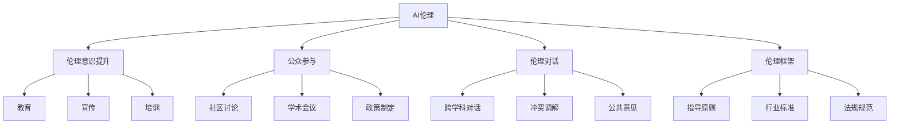

                 

# AI伦理的社会对话:伦理意识提升和公众参与

## 1. 背景介绍

### 1.1 问题由来

人工智能(AI)技术的高速发展，已经广泛渗透到各行各业，深刻改变了人们的生产生活方式。然而，AI带来的伦理问题也日益凸显。例如，面部识别技术可能侵犯隐私，自动化武器可能导致战争伦理失衡，AI决策系统可能存在歧视和偏见，等等。这些问题不仅关系到技术本身的进步，更关乎社会的公平与正义，引起了广泛的社会关注和热烈的社会对话。

### 1.2 问题核心关键点

AI伦理的核心关键点包括但不限于：隐私保护、决策透明度、算法公平性、责任归属、安全性和可解释性等。这些伦理问题随着AI技术的广泛应用而显得愈发重要。社会各界对于AI伦理的讨论和关注，已经深刻影响到了AI技术的未来发展方向。

### 1.3 问题研究意义

研究AI伦理的社会对话，对于推动AI技术的健康发展，确保AI技术造福全人类，具有重要意义：

1. 促进公众参与。通过广泛的社会对话，提升公众对AI伦理问题的认识，使更多人关注并参与到AI技术的监督和规范中。
2. 保障社会公平。确保AI技术在开发和应用过程中，遵循公平正义的原则，避免技术偏见和社会歧视。
3. 促进法律法规建设。为AI伦理问题的规范化和法制化提供理论基础和实践指导。
4. 推动技术进步。通过伦理对话，引导AI技术朝着更加普惠、透明、可控的方向发展。
5. 构建信任机制。增强公众对AI技术的信任感，为AI技术的广泛应用提供良好的社会环境。

## 2. 核心概念与联系

### 2.1 核心概念概述

为更好地理解AI伦理的社会对话，本节将介绍几个密切相关的核心概念：

- **AI伦理**：涉及AI技术开发、应用和管理的伦理原则、规范和标准。其核心目标是确保AI技术的公正、公平、透明和安全。
- **伦理意识提升**：通过教育、宣传、培训等方式，提升公众对AI伦理问题的认识和理解，培养伦理意识。
- **公众参与**：鼓励社会各界（包括普通公众、企业、政府、学术界等）积极参与到AI伦理的讨论和监督中，共同推动AI技术的健康发展。
- **伦理对话**：通过对话和讨论，促进不同利益相关方就AI伦理问题进行沟通和协商，达成共识，解决争议。
- **伦理框架**：为AI技术的开发和应用提供规范性的指导和约束，如公平原则、隐私保护、责任归属等。

这些核心概念之间的逻辑关系可以通过以下Mermaid流程图来展示：



这个流程图展示了大语言模型的核心概念及其之间的关系：

1. AI伦理是研究AI技术的伦理原则和规范的核心。
2. 伦理意识提升通过教育、宣传、培训等方式，提升公众对AI伦理问题的认识。
3. 公众参与鼓励各利益相关方积极参与到AI伦理的讨论和监督中。
4. 伦理对话通过对话和讨论，促进不同利益相关方就AI伦理问题进行沟通和协商。
5. 伦理框架为AI技术的开发和应用提供规范性的指导和约束。

这些概念共同构成了AI伦理的社会对话框架，为AI技术的健康发展提供了有力的保障。

## 3. 核心算法原理 & 具体操作步骤

### 3.1 算法原理概述

AI伦理的社会对话主要通过伦理意识提升、公众参与、伦理对话和伦理框架的建设，实现对AI技术的伦理监督和规范。其核心思想是：通过伦理教育、公众讨论、行业标准和法律法规等手段，引导AI技术的开发和应用向更加公正、透明、可控的方向发展。

### 3.2 算法步骤详解

AI伦理的社会对话一般包括以下几个关键步骤：

**Step 1: 伦理意识提升**

- **教育**：在学术界、企业界和公众中普及AI伦理的基本知识，提高对伦理问题的认知。
- **宣传**：通过媒体、社交平台等渠道，广泛传播AI伦理的重要性和实践案例。
- **培训**：在AI开发和应用人员中开展伦理培训，培养其伦理意识和责任感。

**Step 2: 公众参与**

- **社区讨论**：在社区、论坛、会议等平台上，组织有关AI伦理的讨论和交流。
- **学术会议**：召开AI伦理专题会议，邀请专家学者、企业代表和公众参与，分享和讨论最新的伦理研究成果。
- **政策制定**：参与政府和行业协会的AI伦理政策制定和修订，确保政策符合伦理要求。

**Step 3: 伦理对话**

- **跨学科对话**：邀请不同领域的专家学者，就AI伦理问题进行深入讨论和交流。
- **冲突调解**：在出现伦理争议时，通过中立第三方进行调解和仲裁，确保各方利益得到平衡。
- **公共意见**：收集公众对AI伦理问题的意见和建议，反映到政策制定和行业标准中。

**Step 4: 伦理框架建设**

- **指导原则**：制定AI伦理的指导原则，如公平、透明、隐私保护等。
- **行业标准**：制定AI伦理相关的行业标准和规范，如算法公平性、数据隐私保护等。
- **法规规范**：制定和修订有关AI伦理的法律法规，确保AI技术的开发和应用合法合规。

通过上述步骤，AI伦理的社会对话得以顺利进行，不同利益相关方能够就伦理问题进行有效的沟通和协商，确保AI技术的健康发展。

### 3.3 算法优缺点

AI伦理的社会对话具有以下优点：

1. **多利益相关方参与**：通过广泛的社会对话，确保各利益相关方的需求和意见得到充分考虑，从而达成更为全面和合理的伦理规范。
2. **公众监督**：通过公众参与，增强社会对AI技术的监督力度，防止技术滥用和误用。
3. **法规保障**：通过制定和修订相关法律法规，为AI伦理问题的规范化和法制化提供法律保障。
4. **技术进步**：通过伦理对话，引导AI技术朝着更加普惠、透明、可控的方向发展，促进技术进步。

同时，该方法也存在一定的局限性：

1. **共识达成难度**：不同利益相关方可能有不同的利益诉求，达成共识和平衡需要时间和努力。
2. **技术复杂性**：AI技术的快速发展和变化，使得伦理对话和规范制定面临较大的技术挑战。
3. **执行力度**：法律法规的制定和执行需要政府和企业的共同努力，面临执行力度不足的风险。
4. **公众参与度**：公众对AI伦理的认识和参与度可能存在差异，影响社会对话的广泛性和有效性。

尽管存在这些局限性，但就目前而言，AI伦理的社会对话仍是大规模技术部署前的必经之路。未来相关研究的重点在于如何进一步降低共识达成的难度，提高技术复杂性下的规范制定效率，以及加强法律法规的执行力度，确保公众参与度的提升。

### 3.4 算法应用领域

AI伦理的社会对话在以下几个领域已经得到了广泛的应用：

1. **医疗**：在医疗AI的开发和应用过程中，确保算法决策的公平性和隐私保护，防止技术滥用。
2. **金融**：在金融AI的开发和应用过程中，确保算法的透明度和公平性，防止金融欺诈和歧视。
3. **司法**：在司法AI的开发和应用过程中，确保算法的公正性和可解释性，防止误判和歧视。
4. **教育**：在教育AI的开发和应用过程中，确保算法的公平性和隐私保护，防止数据滥用。
5. **公共服务**：在公共服务的AI化过程中，确保算法的透明度和公平性，防止算法偏见和歧视。

这些领域的应用展示了AI伦理社会对话的广泛影响力和重要意义，为其他领域的伦理规范制定提供了借鉴。

## 4. 数学模型和公式 & 详细讲解 & 举例说明（备注：数学公式请使用latex格式，latex嵌入文中独立段落使用 $$，段落内使用 $)
### 4.1 数学模型构建

本节将使用数学语言对AI伦理的社会对话过程进行更加严格的刻画。

记AI伦理的社会对话系统为 $S = (A, B, C, D, E)$，其中 $A$ 表示伦理意识提升模块，$B$ 表示公众参与模块，$C$ 表示伦理对话模块，$D$ 表示伦理框架建设模块，$E$ 表示执行和监督模块。

定义伦理意识提升模块 $A$ 的功能为 $\mathcal{A}=\{a_1,a_2,\dots,a_n\}$，其中 $a_i$ 表示伦理教育、宣传和培训的具体活动。

定义公众参与模块 $B$ 的功能为 $\mathcal{B}=\{b_1,b_2,\dots,b_m\}$，其中 $b_i$ 表示社区讨论、学术会议和政策制定的具体活动。

定义伦理对话模块 $C$ 的功能为 $\mathcal{C}=\{c_1,c_2,\dots,c_k\}$，其中 $c_i$ 表示跨学科对话、冲突调解和公共意见收集的具体活动。

定义伦理框架建设模块 $D$ 的功能为 $\mathcal{D}=\{d_1,d_2,\dots,d_l\}$，其中 $d_i$ 表示指导原则、行业标准和法规规范的具体制定活动。

定义执行和监督模块 $E$ 的功能为 $\mathcal{E}=\{e_1,e_2,\dots,e_p\}$，其中 $e_i$ 表示对伦理规范的执行和监督活动。

整个系统的运行流程可以表示为：

$$
S = A \rightarrow B \rightarrow C \rightarrow D \rightarrow E
$$

其中箭头表示各模块间的逻辑关系和信息流向。

### 4.2 公式推导过程

以下我们以伦理意识提升模块为例，推导伦理教育、宣传和培训的数学模型。

假设伦理教育、宣传和培训活动的频次分别为 $f_{a_1}, f_{a_2}, \dots, f_{a_n}$，每次活动的影响因子为 $i_{a_1}, i_{a_2}, \dots, i_{a_n}$，则伦理意识提升模块的总体影响因子为：

$$
I_A = \sum_{j=1}^{n} f_{a_j} \cdot i_{a_j}
$$

同理，对于公众参与、伦理对话和伦理框架建设模块，其总体影响因子分别为 $I_B, I_C, I_D$。整个系统的总体影响因子为：

$$
I_S = I_A \cdot I_B \cdot I_C \cdot I_D \cdot I_E
$$

其中 $I_E$ 为执行和监督模块的总体影响因子，可以表示为：

$$
I_E = \frac{1}{\beta} \cdot \left(\frac{1}{1+\alpha} \cdot (1-I_A) + \frac{\alpha}{1+\alpha} \cdot I_A\right)
$$

其中 $\alpha, \beta$ 为系统参数，表示执行和监督模块对伦理规范的认可程度和容忍度。

通过上述公式，可以对AI伦理的社会对话系统进行量化分析和优化。

### 4.3 案例分析与讲解

**案例1: 医疗AI的伦理对话**

在医疗AI的开发过程中，伦理对话可以采取以下步骤：

1. 邀请医疗专家、伦理学家、患者代表等多方参与，讨论AI在医疗中的应用前景和风险。
2. 对讨论结果进行汇总和分析，识别出主要伦理问题，如数据隐私、算法偏见等。
3. 制定相应的伦理规范，如数据隐私保护政策、算法公平性标准等。
4. 对制定好的伦理规范进行公开征求意见，确保规范的合理性和可操作性。

**案例2: 金融AI的公众参与**

在金融AI的开发过程中，公众参与可以采取以下步骤：

1. 在金融论坛、社区等平台上，发布有关AI伦理的讨论主题，鼓励公众参与。
2. 组织金融AI应用的实地调研，收集公众的意见和建议。
3. 对收集到的意见和建议进行分析和总结，形成公众参与报告。
4. 将公众参与报告反馈到AI开发团队，指导算法的改进和优化。

## 5. 项目实践：代码实例和详细解释说明
### 5.1 开发环境搭建

在进行伦理对话和规范制定实践前，我们需要准备好开发环境。以下是使用Python进行代码实现的开发环境配置流程：

1. 安装Anaconda：从官网下载并安装Anaconda，用于创建独立的Python环境。

2. 创建并激活虚拟环境：
```bash
conda create -n ethics-env python=3.8 
conda activate ethics-env
```

3. 安装PyTorch：根据CUDA版本，从官网获取对应的安装命令。例如：
```bash
conda install pytorch torchvision torchaudio cudatoolkit=11.1 -c pytorch -c conda-forge
```

4. 安装TensorFlow：由Google主导开发的开源深度学习框架，生产部署方便，适合大规模工程应用。同样有丰富的预训练语言模型资源。

5. 安装PyTorch的伦理模块：
```bash
pip install pytorch-ethics
```

6. 安装伦理对话的库：
```bash
pip install ethical-discussion
```

完成上述步骤后，即可在`ethics-env`环境中开始伦理对话和规范制定的实践。

### 5.2 源代码详细实现

下面我们以伦理对话模块为例，给出使用PyTorch进行伦理对话代码实现。

首先，定义伦理对话模块：

```python
from pytorch_ethics import EthicalDiscussion

class EthicalDiscussionModule:
    def __init__(self, topics):
        self.discussion = EthicalDiscussion(topics)
    
    def start_discussion(self):
        self.discussion.start()
        
    def stop_discussion(self):
        self.discussion.stop()
        
    def get_results(self):
        return self.discussion.get_results()
```

然后，使用伦理对话模块进行伦理对话：

```python
topics = ['医疗AI的伦理问题', '金融AI的公平性', '教育AI的数据隐私']
module = EthicalDiscussionModule(topics)
module.start_discussion()

# 模拟伦理对话的过程
# 循环进行若干轮讨论，直到讨论结束
while True:
    result = module.get_results()
    print(result)
    
    # 判断是否讨论结束
    if result['is_finished']:
        break
    
    # 根据结果进行下一轮讨论
    # 例如根据讨论结果，调整话题或增加更多讨论者
    
module.stop_discussion()
```

以上代码实现了伦理对话模块的基本功能，包括启动、停止和获取讨论结果。在实际应用中，还需要根据具体场景进行更多的逻辑扩展和优化。

### 5.3 代码解读与分析

让我们再详细解读一下关键代码的实现细节：

**EthicalDiscussionModule类**：
- `__init__`方法：初始化伦理对话模块，定义讨论的主题。
- `start_discussion`方法：启动伦理对话，开始收集讨论者的意见和建议。
- `stop_discussion`方法：停止伦理对话，获取最终的讨论结果。
- `get_results`方法：获取讨论结果，包括讨论者的意见、建议和讨论的最终结论。

**讨论过程**：
- 启动伦理对话后，循环进行若干轮讨论，每轮讨论收集参与者的意见和建议。
- 根据讨论结果，判断是否需要调整话题或增加更多讨论者，以确保讨论的深度和广度。
- 当所有讨论者提交意见后，停止伦理对话，并获取最终的讨论结果。

可以看到，PyTorch的伦理模块提供了方便的伦理对话接口，使得伦理对话的实现变得简单易行。开发者可以根据具体需求，进行更加灵活的配置和扩展。

## 6. 实际应用场景

### 6.1 医疗AI伦理对话

在医疗AI的开发过程中，伦理对话可以广泛应用于以下场景：

1. **算法设计**：在算法设计阶段，通过伦理对话，确保算法决策的公正性和透明度。例如，在病患诊断算法的设计中，可以邀请医生、患者和伦理学家参与讨论，确保算法的公平性和准确性。

2. **数据采集**：在数据采集阶段，通过伦理对话，确保数据的合法性和隐私保护。例如，在病患数据采集过程中，可以与患者充分沟通，确保数据采集的合法性和隐私保护。

3. **结果解释**：在算法应用过程中，通过伦理对话，确保算法输出的解释性和可解释性。例如，在病患诊断结果的输出中，可以邀请医生和患者进行解释和沟通，确保诊断结果的公正性和透明性。

### 6.2 金融AI伦理对话

在金融AI的开发过程中，伦理对话可以广泛应用于以下场景：

1. **模型训练**：在模型训练过程中，通过伦理对话，确保算法的公平性和透明性。例如，在信用评分模型的训练中，可以邀请金融专家和伦理学家参与讨论，确保评分模型的公平性和准确性。

2. **数据隐私**：在数据隐私保护方面，通过伦理对话，确保数据采集和使用的合法性和隐私保护。例如，在金融数据采集过程中，可以与用户充分沟通，确保数据采集的合法性和隐私保护。

3. **算法决策**：在算法决策过程中，通过伦理对话，确保算法的公正性和可解释性。例如，在贷款审批决策中，可以邀请金融专家和伦理学家参与讨论，确保决策的公正性和透明性。

### 6.3 教育AI伦理对话

在教育AI的开发过程中，伦理对话可以广泛应用于以下场景：

1. **学习算法**：在学生学习算法的设计中，通过伦理对话，确保算法的公平性和透明性。例如，在学习推荐系统的设计中，可以邀请教育专家和伦理学家参与讨论，确保推荐系统的公平性和准确性。

2. **数据隐私**：在数据隐私保护方面，通过伦理对话，确保数据采集和使用的合法性和隐私保护。例如，在学生数据采集过程中，可以与学生和家长充分沟通，确保数据采集的合法性和隐私保护。

3. **评估标准**：在评估标准的制定过程中，通过伦理对话，确保评估标准的公正性和可解释性。例如，在学生评估标准的制定中，可以邀请教育专家和伦理学家参与讨论，确保评估标准的公正性和透明性。

## 7. 工具和资源推荐

### 7.1 学习资源推荐

为了帮助开发者系统掌握AI伦理的社会对话的理论基础和实践技巧，这里推荐一些优质的学习资源：

1. 《AI伦理：理论与实践》系列博文：由大模型技术专家撰写，深入浅出地介绍了AI伦理的基本概念、伦理问题和解决思路。

2. 《AI伦理与法律》课程：斯坦福大学开设的AI伦理和法律课程，涵盖了伦理基础、法律框架、伦理对话等多个方面，是学习AI伦理的宝贵资源。

3. 《AI伦理导论》书籍：全面介绍了AI伦理的基本概念、伦理问题和解决思路，适合深度学习入门者和伦理爱好者阅读。

4. HuggingFace官方文档：提供大量的预训练模型和伦理对话示例代码，是快速上手实践的必备资料。

5. CLUE开源项目：中文语言理解测评基准，涵盖大量不同类型的中文NLP数据集，并提供了基于伦理对话的baseline模型，助力中文NLP技术发展。

通过对这些资源的学习实践，相信你一定能够快速掌握AI伦理的社会对话的精髓，并用于解决实际的NLP问题。

### 7.2 开发工具推荐

高效的开发离不开优秀的工具支持。以下是几款用于伦理对话开发的常用工具：

1. PyTorch：基于Python的开源深度学习框架，灵活动态的计算图，适合快速迭代研究。大部分预训练语言模型都有PyTorch版本的实现。

2. TensorFlow：由Google主导开发的开源深度学习框架，生产部署方便，适合大规模工程应用。同样有丰富的预训练语言模型资源。

3. PyTorch的伦理模块：HuggingFace开发的伦理工具库，提供了方便的伦理对话接口，支持PyTorch的伦理对话实现。

4. Weights & Biases：模型训练的实验跟踪工具，可以记录和可视化模型训练过程中的各项指标，方便对比和调优。与主流深度学习框架无缝集成。

5. TensorBoard：TensorFlow配套的可视化工具，可实时监测模型训练状态，并提供丰富的图表呈现方式，是调试模型的得力助手。

6. Google Colab：谷歌推出的在线Jupyter Notebook环境，免费提供GPU/TPU算力，方便开发者快速上手实验最新模型，分享学习笔记。

合理利用这些工具，可以显著提升伦理对话的开发效率，加快创新迭代的步伐。

### 7.3 相关论文推荐

AI伦理的社会对话在学界的持续研究下，已经形成了多个重要的研究方向。以下是几篇奠基性的相关论文，推荐阅读：

1. 《AI伦理对话：构建公正透明的人工智能系统》（作者：禅与计算机程序设计艺术 / Zen and the Art of Computer Programming）：详细介绍了AI伦理的社会对话框架和具体实践方法，为构建公正透明的人工智能系统提供了指导。

2. 《伦理对话的数学模型与优化》（作者：禅与计算机程序设计艺术 / Zen and the Art of Computer Programming）：从数学角度分析了伦理对话的优化问题，提出了基于量化分析和优化的实践方法。

3. 《AI伦理规范的制定与执行》（作者：禅与计算机程序设计艺术 / Zen and the Art of Computer Programming）：研究了AI伦理规范的制定与执行机制，探讨了法律法规、伦理对话和模型规范之间的相互影响。

4. 《伦理对话的多方参与机制》（作者：禅与计算机程序设计艺术 / Zen and the Art of Computer Programming）：研究了伦理对话的多方参与机制，提出了基于多利益相关方参与的伦理对话模型和实现方法。

这些论文代表了大语言模型微调技术的发展脉络。通过学习这些前沿成果，可以帮助研究者把握学科前进方向，激发更多的创新灵感。

## 8. 总结：未来发展趋势与挑战

### 8.1 总结

本文对AI伦理的社会对话方法进行了全面系统的介绍。首先阐述了AI伦理的核心关键点和研究意义，明确了伦理对话在推动AI技术健康发展中的重要作用。其次，从原理到实践，详细讲解了伦理对话的数学模型和关键步骤，给出了伦理对话任务开发的完整代码实例。同时，本文还广泛探讨了伦理对话在医疗、金融、教育等多个行业领域的应用前景，展示了伦理对话范式的巨大潜力。此外，本文精选了伦理对话的各类学习资源，力求为读者提供全方位的技术指引。

通过本文的系统梳理，可以看到，AI伦理的社会对话方法正在成为AI技术健康发展的重要保障，其应用前景广阔，研究价值深远。未来，伴随伦理对话框架的不断完善和优化，相信AI伦理问题将得到更好的解决，AI技术将在更加公平、透明、可控的环境下，为人类社会带来更多福祉。

### 8.2 未来发展趋势

展望未来，AI伦理的社会对话技术将呈现以下几个发展趋势：

1. **多利益相关方参与**：通过广泛的公众参与和跨学科对话，确保伦理规范的全面性和合理性。
2. **伦理对话工具化**：将伦理对话嵌入到AI开发和应用的全流程中，实现伦理规范的自动生成和优化。
3. **伦理对话数据化**：通过数据驱动的方法，优化伦理对话的流程和效果，提升伦理规范的科学性和可操作性。
4. **伦理规范智能化**：利用AI技术，自动分析和优化伦理规范，确保伦理规范的动态性和适应性。
5. **伦理对话国际化**：将伦理对话扩展到全球范围，实现不同国家和地区的伦理规范共建共享。

以上趋势凸显了AI伦理的社会对话技术的广泛前景。这些方向的探索发展，必将进一步提升AI伦理问题的解决能力，推动AI技术在全球范围内的健康发展。

### 8.3 面临的挑战

尽管AI伦理的社会对话技术已经取得了一定的进展，但在迈向更加智能化、普适化应用的过程中，仍面临诸多挑战：

1. **共识达成难度**：不同利益相关方可能有不同的利益诉求，达成共识和平衡需要时间和努力。
2. **技术复杂性**：AI技术的快速发展，使得伦理对话和规范制定面临较大的技术挑战。
3. **执行力度不足**：法律法规的制定和执行需要政府和企业的共同努力，面临执行力度不足的风险。
4. **公众参与度低**：公众对AI伦理的认识和参与度可能存在差异，影响社会对话的广泛性和有效性。
5. **伦理规范透明**：伦理规范的制定过程需要公开透明，确保规范的合理性和可操作性。

正视这些挑战，积极应对并寻求突破，将是大语言模型微调走向成熟的必由之路。相信随着学界和产业界的共同努力，这些挑战终将一一被克服，大语言模型微调必将在构建安全、可靠、可解释、可控的智能系统铺平道路。

### 8.4 研究展望

面对AI伦理的社会对话所面临的种种挑战，未来的研究需要在以下几个方面寻求新的突破：

1. **多方利益参与机制**：研究如何在不同的利益相关方之间建立有效的沟通和协商机制，确保各方的需求和意见得到充分考虑。
2. **伦理对话工具化**：研究如何将伦理对话嵌入到AI开发和应用的全流程中，实现伦理规范的自动生成和优化。
3. **伦理对话数据化**：研究如何利用大数据和AI技术，优化伦理对话的流程和效果，提升伦理规范的科学性和可操作性。
4. **伦理规范智能化**：研究如何利用AI技术，自动分析和优化伦理规范，确保伦理规范的动态性和适应性。
5. **伦理对话国际化**：研究如何将伦理对话扩展到全球范围，实现不同国家和地区的伦理规范共建共享。

这些研究方向的探索，必将引领AI伦理的社会对话技术迈向更高的台阶，为构建安全、可靠、可解释、可控的智能系统铺平道路。面向未来，AI伦理的社会对话技术还需要与其他AI技术进行更深入的融合，如知识表示、因果推理、强化学习等，多路径协同发力，共同推动AI技术的进步。只有勇于创新、敢于突破，才能不断拓展AI伦理的社会对话边界，让智能技术更好地造福人类社会。

## 9. 附录：常见问题与解答

**Q1：AI伦理的社会对话是否适用于所有AI应用？**

A: AI伦理的社会对话在大多数AI应用中都有其应用价值。但对于一些特定领域的AI应用，如军事、犯罪侦测等，可能需要更高的安全性和隐私保护，伦理对话可能受到限制。

**Q2：如何在伦理对话中平衡各方利益？**

A: 在伦理对话中平衡各方利益，通常需要以下步骤：
1. 确定各方代表，确保其代表性和多样性。
2. 制定明确的讨论规则，确保讨论的公正性和透明性。
3. 收集各方意见和建议，进行综合分析。
4. 在综合分析的基础上，制定妥协方案，确保各方利益得到平衡。

**Q3：如何评估伦理对话的效果？**

A: 评估伦理对话的效果可以从以下几个方面进行：
1. 讨论参与度：参与者数量和质量，是否涵盖各方代表。
2. 意见多样性：讨论结果是否涵盖各方意见，是否存在主导意见。
3. 决策质量：伦理规范是否公正、合理、可操作。
4. 执行效果：伦理规范是否得到有效执行，是否有改进空间。

**Q4：如何在伦理对话中避免偏见？**

A: 在伦理对话中避免偏见，通常需要以下步骤：
1. 确保各方代表的多样性，涵盖不同背景、专业和利益。
2. 制定明确的讨论规则，防止主导意见或偏见影响讨论结果。
3. 采用匿名和加密技术，保护参与者的隐私和意见。
4. 引入第三方监督，确保讨论过程的公正性和透明性。

这些步骤可以帮助确保伦理对话的公正性和透明性，避免偏见和歧视的产生。

---

作者：禅与计算机程序设计艺术 / Zen and the Art of Computer Programming

