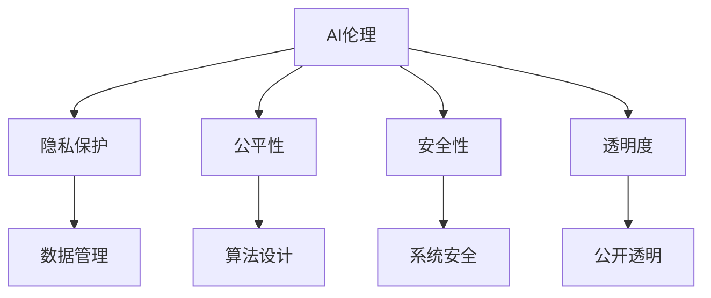

                 

# AI伦理的社会对话:伦理意识提升和公众参与

## 1. 背景介绍

随着人工智能（AI）技术的迅猛发展，其在各个领域的应用不断拓展，从医疗、教育到金融、交通，AI正在改变我们的生活方式和思维方式。然而，AI技术的应用也带来了诸多伦理问题，如隐私保护、公平性、安全性、透明度等，这些问题引起了公众和政策制定者的广泛关注。AI伦理的社会对话不仅是技术问题的探讨，更是关系到社会公平、法治、文化价值观等多方面的问题。因此，如何提升公众对AI伦理的意识，鼓励公众参与，成为一个重要的课题。

### 1.1 问题由来

AI技术的快速发展，使得其在许多领域的应用取得了显著的成果。例如，自动驾驶技术、智能推荐系统、医疗影像诊断等。然而，这些技术的应用也引发了诸多伦理问题，包括但不限于：

- **隐私保护**：在数据收集和使用的过程中，如何保护用户的隐私权利，防止数据滥用和泄露。
- **公平性**：AI算法可能存在偏见和歧视，如何确保算法的公平性，避免对特定群体的歧视。
- **安全性**：AI系统在处理复杂任务时，可能会出现错误或漏洞，如何保障系统的安全性，避免对人类造成伤害。
- **透明度**：AI系统的决策过程往往是“黑箱”，如何提高系统的透明度，让用户理解其决策依据。

这些问题不仅影响技术本身的发展，还关系到社会的稳定和公众的信任。因此，提升公众对AI伦理的意识，鼓励公众参与，是解决这些问题的重要途径。

## 2. 核心概念与联系

### 2.1 核心概念概述

为了更好地理解AI伦理的社会对话和公众参与，本节将介绍几个关键概念：

- **AI伦理**：涉及人工智能技术开发和应用中的道德和伦理问题，旨在确保AI技术的发展符合社会价值观和法律规范。
- **隐私保护**：指在数据处理过程中，确保个人信息不被滥用或泄露，保护用户的隐私权。
- **公平性**：指AI算法在数据处理和决策过程中，避免对特定群体产生歧视，确保所有用户的权益。
- **安全性**：指AI系统在运行过程中，避免因错误或漏洞导致对人类造成伤害。
- **透明度**：指AI系统的决策过程和算法逻辑应尽可能公开，使用户能够理解其工作机制和决策依据。

这些概念之间有着紧密的联系，共同构成了AI伦理的核心框架。

### 2.2 核心概念原理和架构的 Mermaid 流程图



这个流程图展示了AI伦理的核心概念及其之间的关系：

1. AI伦理是所有概念的顶层，指导和约束其他概念的实现。
2. 隐私保护、公平性、安全性和透明度是AI伦理的具体表现，共同构成AI伦理的子集。
3. 数据管理是隐私保护的基础，算法设计是公平性的核心，系统安全是安全性的重点，公开透明是透明度的目标。

## 3. 核心算法原理 & 具体操作步骤

### 3.1 算法原理概述

AI伦理的社会对话和公众参与，主要依赖于算法和技术的支持。其中，隐私保护、公平性、安全性和透明度等伦理问题，都可以通过算法和技术手段来解决。

- **隐私保护算法**：如差分隐私、联邦学习等，能够在保护用户隐私的同时，进行数据建模和分析。
- **公平性算法**：如公平对抗算法、群集重构等，能够检测和纠正算法中的偏见，确保不同群体获得平等的待遇。
- **安全性算法**：如异常检测、鲁棒优化等，能够检测和修复系统漏洞，保障系统的安全性。
- **透明度算法**：如可解释AI、模型可视化等，能够解释系统的决策过程，提高系统的透明度。

这些算法和技术手段，为AI伦理的社会对话和公众参与提供了技术支持，使得公众能够更好地理解和参与到AI伦理问题的讨论和决策中。

### 3.2 算法步骤详解

AI伦理的社会对话和公众参与，通常包括以下几个关键步骤：

**Step 1: 数据收集和准备**
- 收集与AI伦理相关的数据，如用户隐私信息、数据采集和使用情况、算法偏见和歧视等。
- 对数据进行清洗和标注，确保数据的质量和完整性。

**Step 2: 算法设计**
- 设计隐私保护、公平性、安全性和透明度等伦理相关的算法。
- 对算法进行评估和测试，确保其有效性和准确性。

**Step 3: 算法部署和监控**
- 将算法部署到实际应用中，进行试运行。
- 对算法的运行情况进行监控和评估，及时发现和修复问题。

**Step 4: 社会对话和公众参与**
- 通过各种渠道（如会议、论坛、社交媒体等），向公众展示算法的运行情况和效果。
- 鼓励公众参与讨论，收集反馈和建议，进行算法的迭代和优化。

**Step 5: 政策制定和实施**
- 根据公众的反馈和建议，制定和实施相关政策。
- 对算法的应用进行规范和监督，确保其符合伦理要求。

### 3.3 算法优缺点

AI伦理的社会对话和公众参与，具有以下优点：

- **提高公众意识**：通过算法的公开透明，公众能够更好地理解AI伦理问题，提升对AI技术的信任度。
- **促进公平和公正**：通过公平性算法的应用，能够消除算法中的偏见和歧视，促进社会的公平和公正。
- **保障数据隐私**：通过隐私保护算法，能够保护用户隐私，防止数据滥用和泄露。
- **提高系统安全性**：通过安全性算法，能够检测和修复系统漏洞，保障系统的安全性。

同时，这些算法也存在一定的局限性：

- **算法复杂度**：设计和实现隐私保护、公平性、安全性和透明度等算法，需要较高的技术复杂度，对技术要求较高。
- **数据质量要求**：算法的有效性和准确性，高度依赖于数据的质量和完整性，数据收集和标注工作量较大。
- **模型解释性**：有些算法（如深度学习）具有“黑箱”特性，难以解释其内部工作机制，限制了公众的理解和参与。
- **算法偏见**：即使算法本身没有偏见，但训练数据中可能存在偏见，导致算法结果的偏见，需要进行反复迭代和优化。

尽管存在这些局限性，但AI伦理的社会对话和公众参与，无疑是解决AI伦理问题的重要途径。通过技术手段，可以提升公众对AI伦理的意识，增强公众的参与感和信任度，共同推动AI技术的发展和应用。

### 3.4 算法应用领域

AI伦理的社会对话和公众参与，在多个领域都有广泛的应用：

- **医疗领域**：在医疗数据采集和使用中，如何保护患者的隐私，确保算法的公平性和透明度，是医疗AI伦理的重要问题。
- **金融领域**：在金融数据处理和分析中，如何确保算法的公平性和安全性，避免对特定群体产生歧视，是金融AI伦理的重要问题。
- **教育领域**：在学生数据采集和使用中，如何保护学生的隐私，确保算法的公平性和透明度，是教育AI伦理的重要问题。
- **智能交通领域**：在智能交通数据处理和分析中，如何保护交通参与者的隐私，确保算法的公平性和安全性，是智能交通AI伦理的重要问题。
- **媒体领域**：在媒体数据采集和使用中，如何保护用户的隐私，确保算法的公平性和透明度，是媒体AI伦理的重要问题。

## 4. 数学模型和公式 & 详细讲解 & 举例说明

### 4.1 数学模型构建

AI伦理的社会对话和公众参与，涉及到隐私保护、公平性、安全性和透明度等多个方面。这里以公平性算法为例，介绍数学模型的构建。

假设有一组训练数据 $\{(x_i, y_i)\}_{i=1}^N$，其中 $x_i$ 表示输入特征，$y_i$ 表示标签。公平性算法旨在检测和纠正算法中的偏见，确保不同群体获得平等的待遇。

定义一个基于特征 $x_i$ 的公平性评估指标 $L(x)$，表示算法对不同特征的公平性。常见的公平性评估指标包括：

- 等代价误差（Equal Cost Error）：衡量算法对不同特征的错误率是否相等。
- 最大最小误差（Max Min Error）：衡量算法对不同特征的最小错误率是否相等。

公平性算法的设计目标，是通过最小化评估指标 $L(x)$，确保算法对不同特征的公平性。

### 4.2 公式推导过程

以下是公平性评估指标的推导过程。

假设算法输出为 $f(x)$，则等代价误差 $ECE$ 可以表示为：

$$
ECE = \frac{1}{N}\sum_{i=1}^N |\frac{y_i}{f(x_i)} - \frac{y_i}{1-f(x_i)}|
$$

其中 $y_i$ 为真实标签，$f(x_i)$ 为算法预测的输出。

对于最大最小误差（Max Min Error），可以定义一个最小误差函数 $E_{min}$，表示算法对每个特征的最小错误率：

$$
E_{min} = \max_{x \in X} \min(y_i, 1-y_i)
$$

其中 $X$ 表示输入特征的集合，$y_i$ 为真实标签。

定义一个公平性指标 $L(x)$，表示算法对不同特征的公平性：

$$
L(x) = \frac{1}{N}\sum_{i=1}^N (ECE - E_{min})^2
$$

公平性算法的目标是最小化公平性指标 $L(x)$，确保算法对不同特征的公平性。

### 4.3 案例分析与讲解

以面部识别算法为例，分析其公平性问题。

假设有一组面部识别数据，其中包含不同种族、性别、年龄的面部图像和标签。面部识别算法通常使用人脸特征提取和分类器进行识别。然而，在训练和测试数据中，如果种族、性别、年龄等特征与标签存在相关性，算法可能会产生偏见，导致对某些群体的识别率偏低。

例如，如果算法在训练数据中主要是以白人面部图像为主，则可能对黑人和其他种族的识别率偏低。此时，公平性算法可以检测和纠正这种偏见，确保不同种族的识别率相等。具体来说，公平性算法可以通过以下步骤实现：

1. 收集和标注不同种族、性别、年龄的人脸数据。
2. 使用数据增强技术，扩充不同群体的数据量。
3. 设计公平性评估指标，检测和纠正算法中的偏见。
4. 对公平性算法进行评估和测试，确保其有效性。
5. 将公平性算法部署到实际应用中，并进行监控和优化。

通过公平性算法，可以确保面部识别算法对不同群体的公平性，提升公众对算法的信任度。

## 5. 项目实践：代码实例和详细解释说明

### 5.1 开发环境搭建

在进行AI伦理的社会对话和公众参与的项目实践前，需要准备好开发环境。以下是使用Python进行项目实践的环境配置流程：

1. 安装Anaconda：从官网下载并安装Anaconda，用于创建独立的Python环境。

2. 创建并激活虚拟环境：
```bash
conda create -n ai_ethics python=3.8 
conda activate ai_ethics
```

3. 安装相关依赖库：
```bash
conda install numpy scipy pandas scikit-learn matplotlib seaborn
```

完成上述步骤后，即可在`ai_ethics`环境中开始项目实践。

### 5.2 源代码详细实现

这里我们以公平性算法的实现为例，展示AI伦理的社会对话和公众参与的项目实践。

```python
import numpy as np
from sklearn.metrics import confusion_matrix

# 定义公平性评估指标
def fairness_metric(y_true, y_pred):
    # 计算等代价误差
    ece = np.mean(np.abs((y_true / y_pred) - (1 - y_true) / (1 - y_pred)))
    # 计算最小误差
    min_error = np.min([np.mean(y_true == 1), np.mean(y_true == 0)])
    # 计算公平性指标
    l = np.mean((ece - min_error)**2)
    return l

# 生成模拟数据
X = np.random.randn(1000, 5)
y = np.random.randint(2, size=1000)

# 训练模型
from sklearn.linear_model import LogisticRegression
model = LogisticRegression()
model.fit(X, y)

# 计算公平性指标
l = fairness_metric(y, model.predict(X))
print(f"Fairness Metric: {l:.3f}")
```

在这个示例中，我们定义了一个公平性评估指标 `fairness_metric`，用于计算等代价误差和最小误差，并计算公平性指标。然后，我们使用模拟数据训练了一个逻辑回归模型，并计算了公平性指标。最后，打印出公平性指标的值。

### 5.3 代码解读与分析

让我们再详细解读一下关键代码的实现细节：

**代码解释**：
- 公平性评估指标 `fairness_metric`：计算等代价误差 $ECE$ 和最小误差 $E_{min}$，并计算公平性指标 $L(x)$。
- 模拟数据生成：使用`np.random.randn`生成1000个5维的随机数据，并使用`np.random.randint`生成1000个随机标签。
- 逻辑回归模型训练：使用`sklearn.linear_model.LogisticRegression`训练一个逻辑回归模型，并使用训练数据拟合模型。
- 公平性指标计算：调用 `fairness_metric` 函数，计算公平性指标 $L(x)$，并打印输出。

**代码分析**：
- 公平性评估指标的设计：等代价误差和最小误差是常用的公平性指标，通过计算这两个指标，可以检测算法对不同特征的公平性。
- 模型训练：逻辑回归模型是一种常用的分类模型，在这里用于训练公平性评估指标。
- 公平性指标的计算：公平性指标 $L(x)$ 用于评估算法的公平性，如果 $L(x)$ 值较小，说明算法对不同特征的公平性较好。
- 模拟数据的生成：使用模拟数据进行模型训练和公平性指标计算，可以避免真实数据的隐私问题。

## 6. 实际应用场景

### 6.1 医疗领域

在医疗领域，AI伦理的社会对话和公众参与具有重要意义。医疗数据的采集和使用，涉及到患者的隐私和健康信息，如何确保数据的隐私保护和公平性，是医疗AI伦理的关键问题。

具体来说，可以采取以下措施：

- **数据匿名化**：在使用医疗数据前，对数据进行匿名化处理，防止数据泄露和滥用。
- **公平性算法**：使用公平性算法，确保医疗AI算法对不同种族、性别、年龄的患者公平性，避免对特定群体的歧视。
- **透明性**：确保医疗AI算法的决策过程透明，患者能够理解算法的决策依据。
- **公众参与**：通过公开透明的方式，向公众展示医疗AI算法的应用效果，收集公众的反馈和建议，进行算法的迭代和优化。

通过这些措施，可以提升公众对医疗AI技术的信任度，保障患者的隐私和公平性，确保医疗AI技术的有效性和可靠性。

### 6.2 金融领域

在金融领域，AI伦理的社会对话和公众参与同样重要。金融数据涉及用户的财务信息，如何保护用户的隐私和公平性，是金融AI伦理的关键问题。

具体来说，可以采取以下措施：

- **数据匿名化**：在使用金融数据前，对数据进行匿名化处理，防止数据泄露和滥用。
- **公平性算法**：使用公平性算法，确保金融AI算法对不同种族、性别、年龄的用户公平性，避免对特定群体的歧视。
- **透明性**：确保金融AI算法的决策过程透明，用户能够理解算法的决策依据。
- **公众参与**：通过公开透明的方式，向公众展示金融AI算法的应用效果，收集公众的反馈和建议，进行算法的迭代和优化。

通过这些措施，可以提升公众对金融AI技术的信任度，保障用户的隐私和公平性，确保金融AI技术的有效性和可靠性。

### 6.3 智能交通领域

在智能交通领域，AI伦理的社会对话和公众参与具有重要意义。智能交通数据的采集和使用，涉及到交通参与者的隐私和行为信息，如何确保数据的隐私保护和公平性，是智能交通AI伦理的关键问题。

具体来说，可以采取以下措施：

- **数据匿名化**：在使用智能交通数据前，对数据进行匿名化处理，防止数据泄露和滥用。
- **公平性算法**：使用公平性算法，确保智能交通AI算法对不同性别、年龄的交通参与者公平性，避免对特定群体的歧视。
- **透明性**：确保智能交通AI算法的决策过程透明，交通参与者能够理解算法的决策依据。
- **公众参与**：通过公开透明的方式，向公众展示智能交通AI算法的应用效果，收集公众的反馈和建议，进行算法的迭代和优化。

通过这些措施，可以提升公众对智能交通AI技术的信任度，保障交通参与者的隐私和公平性，确保智能交通AI技术的有效性和可靠性。

## 7. 工具和资源推荐

### 7.1 学习资源推荐

为了帮助开发者系统掌握AI伦理的社会对话和公众参与的理论基础和实践技巧，这里推荐一些优质的学习资源：

1. **《人工智能伦理导论》**：这本书由著名AI伦理专家撰写，全面介绍了AI伦理的基本概念、伦理原则和应用场景，是入门学习的好书。
2. **AI伦理在线课程**：许多在线学习平台（如Coursera、edX等）提供了AI伦理的在线课程，可以帮助开发者系统学习AI伦理的理论和实践。
3. **AI伦理研究论文**：通过阅读最新的AI伦理研究论文，了解AI伦理的前沿理论和应用案例。
4. **AI伦理案例库**：一些学术机构和研究团队发布了AI伦理的案例库，供开发者学习和参考。

通过对这些资源的学习实践，相信你一定能够快速掌握AI伦理的社会对话和公众参与的精髓，并用于解决实际的伦理问题。

### 7.2 开发工具推荐

高效的开发离不开优秀的工具支持。以下是几款用于AI伦理的社会对话和公众参与开发的常用工具：

1. **GitHub**：提供了一个平台，供开发者分享和协作开发AI伦理相关的项目。
2. **Google Colab**：谷歌提供的在线Jupyter Notebook环境，方便开发者进行代码实验和分享学习笔记。
3. **Jupyter Notebook**：Python数据分析和机器学习常用的开发工具，支持多语言和多平台。
4. **Scikit-learn**：Python常用的机器学习库，提供了多种公平性算法的实现。
5. **TensorFlow**：Google提供的深度学习框架，支持分布式训练和模型部署。

合理利用这些工具，可以显著提升AI伦理的社会对话和公众参与开发的效率，加快创新迭代的步伐。

### 7.3 相关论文推荐

AI伦理的社会对话和公众参与的研究源于学界的持续研究。以下是几篇奠基性的相关论文，推荐阅读：

1. **《公平性学习：数据和算法中的公平性挑战》**：这篇论文系统地介绍了公平性学习的基本概念和应用方法，是AI伦理研究的经典之作。
2. **《隐私保护：数据匿名化和隐私增强技术》**：这篇论文介绍了隐私保护的基本技术和方法，是隐私保护研究的经典之作。
3. **《透明AI：解释AI模型的决策过程》**：这篇论文讨论了透明AI的基本概念和应用方法，是透明AI研究的经典之作。
4. **《AI伦理：技术、法律和社会》**：这篇论文从技术、法律和社会的角度，讨论了AI伦理的基本问题，是AI伦理研究的经典之作。

这些论文代表了大语言模型微调技术的发展脉络。通过学习这些前沿成果，可以帮助研究者把握学科前进方向，激发更多的创新灵感。

## 8. 总结：未来发展趋势与挑战

### 8.1 总结

本文对AI伦理的社会对话和公众参与进行了全面系统的介绍。首先阐述了AI伦理的基本概念和重要意义，明确了AI伦理的社会对话和公众参与在解决AI伦理问题中的重要作用。其次，从原理到实践，详细讲解了公平性算法的设计和实现，给出了AI伦理的社会对话和公众参与的项目实践示例。同时，本文还广泛探讨了AI伦理在医疗、金融、智能交通等多个领域的应用前景，展示了AI伦理的社会对话和公众参与的广阔前景。最后，本文精选了AI伦理的社会对话和公众参与的学习资源和开发工具，力求为开发者提供全方位的技术指引。

通过本文的系统梳理，可以看到，AI伦理的社会对话和公众参与技术正在成为AI伦理问题解决的重要途径，极大地提升了公众对AI伦理的意识，增强了公众的参与感和信任度。未来，伴随AI技术的不断发展，AI伦理的社会对话和公众参与必将在构建公平、公正、安全的AI社会中扮演越来越重要的角色。

### 8.2 未来发展趋势

展望未来，AI伦理的社会对话和公众参与技术将呈现以下几个发展趋势：

1. **隐私保护技术的发展**：随着数据隐私保护的法律法规不断完善，隐私保护技术也将不断进步，如差分隐私、联邦学习等隐私保护技术将得到更广泛的应用。
2. **公平性算法的多样化**：除了传统的公平性算法外，未来将涌现更多公平性算法，如公平对抗算法、群集重构等，进一步提升算法的公平性。
3. **透明AI技术的普及**：随着AI模型的复杂度不断增加，透明AI技术也将越来越重要，如可解释AI、模型可视化等，将得到更广泛的应用。
4. **公众参与的机制化**：公众参与将成为AI伦理问题的常态，政府和企业将建立更多机制，鼓励公众参与，提升公众的信任度和参与感。
5. **伦理标准的制定**：AI伦理标准的制定将逐步完善，政府和企业将制定更多伦理标准，规范AI技术的应用。

这些趋势凸显了AI伦理的社会对话和公众参与技术的广阔前景。这些方向的探索发展，必将进一步提升AI伦理的社会对话和公众参与的水平，为构建公平、公正、安全的AI社会提供有力的技术保障。

### 8.3 面临的挑战

尽管AI伦理的社会对话和公众参与技术已经取得了显著进展，但在迈向更加智能化、普适化应用的过程中，仍面临诸多挑战：

1. **技术复杂度**：设计和实现隐私保护、公平性、透明性等伦理相关的算法，需要较高的技术复杂度，对技术要求较高。
2. **数据质量要求**：算法的有效性和准确性，高度依赖于数据的质量和完整性，数据收集和标注工作量较大。
3. **模型解释性**：有些算法（如深度学习）具有“黑箱”特性，难以解释其内部工作机制，限制了公众的理解和参与。
4. **算法偏见**：即使算法本身没有偏见，但训练数据中可能存在偏见，导致算法结果的偏见，需要进行反复迭代和优化。
5. **政策法规**：AI伦理的社会对话和公众参与需要政策和法规的保障，但目前法律法规尚不完善，存在法律风险。

尽管存在这些挑战，但AI伦理的社会对话和公众参与技术，无疑是解决AI伦理问题的重要途径。通过技术手段，可以提升公众对AI伦理的意识，增强公众的参与感和信任度，共同推动AI技术的发展和应用。

### 8.4 研究展望

面对AI伦理的社会对话和公众参与所面临的种种挑战，未来的研究需要在以下几个方面寻求新的突破：

1. **隐私保护技术的新突破**：探索更加高效的隐私保护技术，如差分隐私、联邦学习等，确保数据隐私的保护。
2. **公平性算法的新突破**：开发更加公平性算法，如公平对抗算法、群集重构等，确保算法的公平性。
3. **透明AI技术的新突破**：引入更加透明的AI技术，如可解释AI、模型可视化等，提高系统的透明度。
4. **公众参与机制的新突破**：建立更多的公众参与机制，如公众论坛、参与式决策等，增强公众的参与感和信任度。
5. **伦理标准的新突破**：制定更多的伦理标准，规范AI技术的应用，确保AI技术的安全性和可靠性。

这些研究方向的探索，必将引领AI伦理的社会对话和公众参与技术迈向更高的台阶，为构建公平、公正、安全的AI社会铺平道路。面向未来，AI伦理的社会对话和公众参与技术还需要与其他人工智能技术进行更深入的融合，如知识表示、因果推理、强化学习等，多路径协同发力，共同推动AI技术的发展和应用。只有勇于创新、敢于突破，才能不断拓展AI伦理的社会对话和公众参与的边界，让AI技术更好地造福人类社会。

## 9. 附录：常见问题与解答

**Q1：如何进行AI伦理的社会对话和公众参与？**

A: AI伦理的社会对话和公众参与，通常包括以下几个关键步骤：

1. **数据收集和准备**：收集与AI伦理相关的数据，如用户隐私信息、数据采集和使用情况、算法偏见和歧视等。对数据进行清洗和标注，确保数据的质量和完整性。
2. **算法设计**：设计隐私保护、公平性、安全性和透明度等伦理相关的算法。对算法进行评估和测试，确保其有效性和准确性。
3. **算法部署和监控**：将算法部署到实际应用中，进行试运行。对算法的运行情况进行监控和评估，及时发现和修复问题。
4. **社会对话和公众参与**：通过各种渠道（如会议、论坛、社交媒体等），向公众展示算法的运行情况和效果。鼓励公众参与讨论，收集反馈和建议，进行算法的迭代和优化。
5. **政策制定和实施**：根据公众的反馈和建议，制定和实施相关政策。对算法的应用进行规范和监督，确保其符合伦理要求。

通过这些步骤，可以提升公众对AI伦理的意识，增强公众的参与感和信任度，共同推动AI技术的发展和应用。

**Q2：如何确保AI算法的公平性？**

A: 确保AI算法的公平性，通常可以采取以下措施：

1. **数据清洗和预处理**：清洗数据中的噪声和异常值，确保数据的质量和完整性。
2. **公平性算法设计**：使用公平性算法，如公平对抗算法、群集重构等，检测和纠正算法中的偏见，确保不同群体的公平性。
3. **评估和测试**：对公平性算法进行评估和测试，确保其有效性和准确性。
4. **透明性**：确保算法的决策过程透明，用户能够理解算法的决策依据。
5. **公众参与**：通过公开透明的方式，向公众展示算法的应用效果，收集公众的反馈和建议，进行算法的迭代和优化。

通过这些措施，可以确保AI算法的公平性，提升公众对算法的信任度，保障用户的权益。

**Q3：如何进行AI伦理的透明性建设？**

A: AI伦理的透明性建设，通常可以采取以下措施：

1. **算法可解释性**：使用可解释性算法，如线性模型、规则系统等，提高算法的可解释性。
2. **模型可视化**：使用模型可视化工具，如Shapley值、LIME等，可视化算法的决策过程。
3. **公开透明**：在算法的开发和应用过程中，公开算法的参数和决策依据，确保算法的透明性。
4. **公众参与**：通过公开透明的方式，向公众展示算法的应用效果，收集公众的反馈和建议，进行算法的迭代和优化。

通过这些措施，可以确保AI算法的透明性，提升公众对算法的信任度，保障算法的公平性和可靠性。

**Q4：如何确保AI数据隐私的保护？**

A: 确保AI数据隐私的保护，通常可以采取以下措施：

1. **数据匿名化**：在使用数据前，对数据进行匿名化处理，防止数据泄露和滥用。
2. **差分隐私**：使用差分隐私技术，确保数据隐私的保护。差分隐私技术通过加入噪声，保护用户隐私，同时不损害数据的使用价值。
3. **联邦学习**：使用联邦学习技术，确保数据隐私的保护。联邦学习技术通过在本地设备上进行模型训练，保护用户数据的安全性。
4. **隐私保护协议**：制定隐私保护协议，规范数据的使用和共享，确保数据隐私的保护。
5. **公众参与**：通过公开透明的方式，向公众展示数据隐私保护措施，收集公众的反馈和建议，进行算法的迭代和优化。

通过这些措施，可以确保AI数据隐私的保护，提升公众对AI技术的信任度，保障用户的数据权益。

**Q5：如何确保AI系统的安全性？**

A: 确保AI系统的安全性，通常可以采取以下措施：

1. **异常检测**：使用异常检测算法，检测系统中的异常行为，防止系统被攻击和滥用。
2. **鲁棒优化**：使用鲁棒优化技术，提高系统的鲁棒性和稳定性，防止系统因错误和漏洞导致的安全问题。
3. **模型鲁棒性测试**：对AI模型进行鲁棒性测试，确保模型在面对各种攻击和扰动时仍能保持稳定和正确性。
4. **安全协议**：制定安全协议，规范系统的操作和维护，确保系统的安全性。
5. **公众参与**：通过公开透明的方式，向公众展示系统的安全性措施，收集公众的反馈和建议，进行系统的迭代和优化。

通过这些措施，可以确保AI系统的安全性，提升公众对AI技术的信任度，保障系统的稳定性和可靠性。

---

作者：禅与计算机程序设计艺术 / Zen and the Art of Computer Programming

