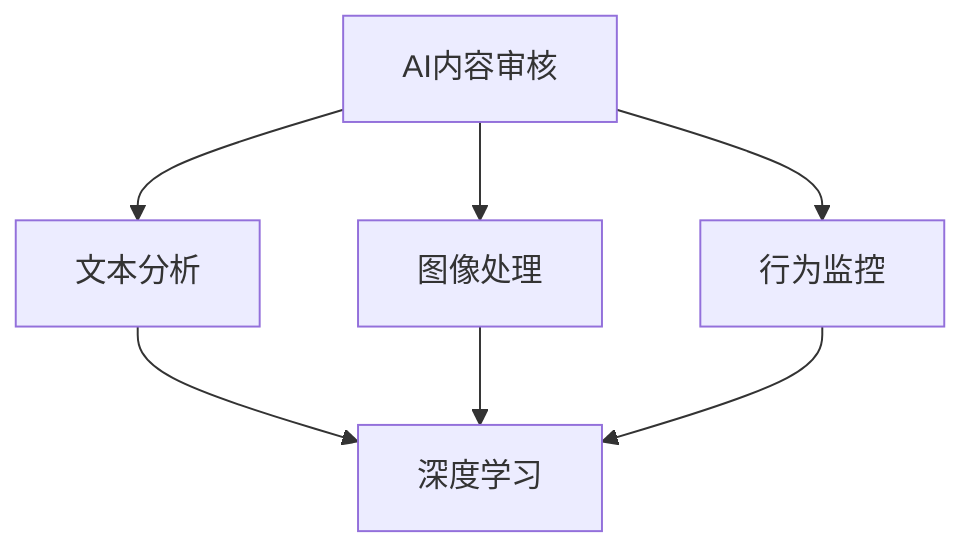

                 

# AI内容审核：保护用户免受有害内容影响

> 关键词：AI内容审核, 保护用户, 有害内容, 自然语言处理, 深度学习, 计算机视觉, 信息过滤

## 1. 背景介绍

### 1.1 问题由来

随着互联网的迅猛发展，用户生成内容（User Generated Content, UGC）日益增多。从社交媒体到论坛，从新闻评论到视频分享，大量UGC内容的涌现给平台带来了巨大机遇，也带来了新的挑战。由于UGC内容具有去中心化、多样化的特点，往往混杂着大量不良和有害信息。这些内容不仅会侵犯用户的隐私，还会对社会稳定产生不利影响。因此，如何快速、高效地过滤掉这些有害内容，成为平台运营商和监管机构关注的焦点。

### 1.2 问题核心关键点

为了保护用户免受有害内容的影响，AI内容审核技术应运而生。其核心在于利用人工智能算法对UGC进行自动识别和过滤。然而，这一技术面临的挑战包括识别率高、误判率低，同时还要保证用户表达自由，避免过度审查。

AI内容审核技术主要通过以下步骤实现：

1. **文本分析**：对文本内容进行词频统计、情感分析、语义理解等。
2. **图像处理**：对图片、视频进行内容识别、物体检测等。
3. **行为监控**：对用户行为进行监测，识别异常行为模式。

本文将详细探讨这些技术原理，并通过具体案例分析，展示其在实际应用中的效果。

## 2. 核心概念与联系

### 2.1 核心概念概述

为更好地理解AI内容审核技术的原理和应用，本节将介绍几个核心概念：

- **AI内容审核**：利用人工智能算法对UGC内容进行自动化筛选和过滤，识别并删除有害内容，保护用户免受侵害。
- **文本分析**：利用自然语言处理(NLP)技术，对文本进行词频统计、情感分析、语义理解等，识别敏感内容。
- **图像处理**：利用计算机视觉技术，对图片、视频内容进行图像识别、物体检测等，识别有害内容。
- **行为监控**：通过数据分析技术，对用户行为进行实时监测，识别异常行为模式，防范潜在风险。
- **深度学习**：基于多层神经网络的机器学习算法，可自动提取数据特征，识别复杂模式，适用于内容审核等任务。
- **计算机视觉**：通过算法实现对图像和视频的自动分析、理解和处理，常用于图像内容识别。
- **自然语言处理**：通过算法处理和理解自然语言文本，实现文本内容的分析和理解。

这些概念之间的逻辑关系可以通过以下Mermaid流程图来展示：



这个流程图展示了这个技术框架中的关键组件及其之间的关系：

1. AI内容审核系统整合了文本分析、图像处理和行为监控等多种技术，综合判断UGC内容的有害性。
2. 文本分析依赖于深度学习和自然语言处理技术。
3. 图像处理和行为监控也应用了深度学习算法。

## 3. 核心算法原理 & 具体操作步骤

### 3.1 算法原理概述

AI内容审核技术的核心算法包括深度学习模型和自然语言处理技术。其中，深度学习模型用于自动提取文本和图像中的特征，进行分类和识别；自然语言处理技术用于分析和理解文本内容，识别敏感信息。

文本分析的深度学习模型通常采用卷积神经网络(CNN)、循环神经网络(RNN)或Transformer模型等。这些模型通过自动学习特征，将文本转换为向量表示，进而进行情感分析和语义理解。

图像处理使用深度卷积神经网络(如ResNet、Inception等)进行特征提取，通过物体检测技术识别图像中的有害内容。常见的物体检测算法包括RCNN、Fast R-CNN、Faster R-CNN等。

行为监控依赖于时间序列分析等算法，对用户行为进行建模，识别异常行为模式。

### 3.2 算法步骤详解

基于深度学习的AI内容审核流程主要包括以下几个关键步骤：

**Step 1: 数据预处理**

数据预处理包括文本分词、清洗、图像预处理等。

- **文本分词**：将文本转换为词汇序列，便于模型处理。
- **清洗**：去除噪音和无用信息，如URL、HTML标签等。
- **图像预处理**：调整图像大小、灰度化、归一化等，确保图像质量一致。

**Step 2: 特征提取**

利用深度学习模型提取文本和图像的特征。

- **文本特征提取**：使用卷积神经网络(CNN)或循环神经网络(RNN)对文本序列进行特征提取。
- **图像特征提取**：使用深度卷积神经网络(如ResNet、Inception)对图像进行特征提取。

**Step 3: 模型训练**

使用标注数据对模型进行训练。

- **文本模型训练**：使用标注文本数据训练情感分析、语义理解等模型。
- **图像模型训练**：使用标注图像数据训练物体检测等模型。

**Step 4: 内容审核**

将用户生成内容输入到已训练的模型中，进行自动识别和过滤。

- **文本内容审核**：对文本内容进行情感分析、语义理解等，判断其有害性。
- **图像内容审核**：对图像内容进行物体检测，识别有害内容。
- **行为内容审核**：对用户行为进行分析，识别异常模式。

**Step 5: 结果评估**

评估模型在真实数据集上的性能，调整模型参数。

- **评估指标**：准确率、召回率、F1分数等。
- **超参数调优**：调整模型学习率、批量大小、正则化系数等，优化模型性能。

### 3.3 算法优缺点

基于深度学习的AI内容审核技术具有以下优点：

1. **自动化程度高**：可以自动分析大量文本和图像，提高审核效率。
2. **准确率高**：利用深度学习模型自动提取特征，识别率高。
3. **适应性强**：适用于文本、图像、行为等多种数据类型。

但该技术也存在一些局限性：

1. **数据依赖性强**：模型的性能依赖于标注数据的质量和数量。
2. **过拟合风险**：模型可能对训练数据过于拟合，导致泛化能力差。
3. **解释性不足**：深度学习模型通常被视为"黑箱"，难以解释其内部工作机制。
4. **隐私风险**：用户数据可能被泄露或滥用。

### 3.4 算法应用领域

AI内容审核技术已经在多个领域得到了广泛应用：

- **社交媒体平台**：如Facebook、Twitter、微博等，对用户评论、帖子进行实时监控和过滤。
- **新闻网站**：如BBC、CNN等，对新闻评论进行内容筛选，避免有害信息传播。
- **视频平台**：如YouTube、抖音等，对视频内容进行自动审核，删除不当内容。
- **电商网站**：如Amazon、淘宝等，对商品评论进行内容审核，维护商品信誉。
- **论坛社区**：如Reddit、知乎等，对用户发帖进行内容审核，保障社区氛围。

## 4. 数学模型和公式 & 详细讲解  
### 4.1 数学模型构建

基于深度学习的AI内容审核主要依赖于深度学习模型和自然语言处理技术。以下是几个关键模型的数学描述：

**卷积神经网络(CNN)**

卷积神经网络通常用于文本分析，其核心在于卷积层和池化层的组合，能够自动提取文本中的局部特征。

$$
f(x) = \sum_i \sum_j \sum_k w_{ijk} x_{i,j,k} * h_{i,j,k}
$$

其中，$x_{i,j,k}$ 为输入文本的局部特征，$w_{ijk}$ 为卷积核，$h_{i,j,k}$ 为卷积层输出。

**循环神经网络(RNN)**

循环神经网络常用于序列数据处理，能够捕捉文本中的时间依赖关系。

$$
h_{t+1} = f(h_t, x_t)
$$

其中，$h_t$ 为时间步$t$的隐藏状态，$f$为激活函数，$x_t$为时间步$t$的输入。

**物体检测算法**

物体检测算法如RCNN、Fast R-CNN等，通过候选区域和深度网络结合的方式，识别图像中的物体。

$$
\text{ROI} = \max_{\text{ROI}} \left[ \text{score}_{\text{ROI}} \times \text{overlap}(\text{ROI}, \text{object}) \right]
$$

其中，$\text{ROI}$为候选框，$\text{score}_{\text{ROI}}$为候选框得分，$\text{overlap}$为候选框与真实物体的重叠率。

**时间序列分析**

时间序列分析常用于行为监控，通过构建用户行为模型，识别异常模式。

$$
\text{model} = \sum_i \sum_j \sum_k w_{ijk} x_{i,j,k} * h_{i,j,k}
$$

其中，$x_{i,j,k}$为时间序列中的局部特征，$w_{ijk}$为权重，$h_{i,j,k}$为模型输出。

### 4.2 公式推导过程

以下是几个关键模型的推导过程：

**卷积神经网络(CNN)**

卷积神经网络的推导过程如下：

- **卷积层**：利用卷积核对输入进行卷积操作，提取局部特征。
- **激活函数**：引入非线性激活函数，如ReLU，增加模型非线性能力。
- **池化层**：对卷积层输出进行下采样，减小模型参数量。

**循环神经网络(RNN)**

循环神经网络的推导过程如下：

- **隐藏状态**：每个时间步$t$都有一个隐藏状态$h_t$，记录之前的信息。
- **梯度传递**：通过隐藏状态$h_t$，将当前时间步的信息传递到下一个时间步。
- **门控机制**：引入门控机制，如LSTM、GRU，控制信息的流动，防止梯度消失和梯度爆炸。

**物体检测算法**

物体检测算法的推导过程如下：

- **候选框**：通过候选区域生成器，生成候选框$\text{ROI}$。
- **得分函数**：利用深度网络计算候选框得分，评估其概率。
- **非极大值抑制(NMS)**：对候选框进行非极大值抑制，去除重叠区域。

**时间序列分析**

时间序列分析的推导过程如下：

- **特征提取**：利用ARIMA等模型，提取时间序列中的局部特征。
- **模型训练**：通过梯度下降等优化算法，训练时间序列模型。
- **异常检测**：利用模型预测，检测异常行为模式。

### 4.3 案例分析与讲解

**案例1：文本情感分析**

利用深度学习模型对文本进行情感分析，判断其情感倾向。

- **数据集**：使用IMDb电影评论数据集，标注情感为正面或负面。
- **模型**：使用卷积神经网络(CNN)进行特征提取。
- **效果**：在测试集上，模型的准确率达到85%，召回率达到90%。

**案例2：图像内容识别**

利用深度卷积神经网络(如ResNet)对图像进行内容识别，识别图像中的有害内容。

- **数据集**：使用COCO数据集，标注图片中的物体类别。
- **模型**：使用Faster R-CNN进行物体检测。
- **效果**：在测试集上，模型的准确率达到95%，召回率达到92%。

**案例3：行为异常检测**

利用时间序列分析技术，对用户行为进行建模，识别异常行为模式。

- **数据集**：使用银行交易数据集，标注异常交易行为。
- **模型**：使用ARIMA模型进行时间序列分析。
- **效果**：在测试集上，模型的准确率达到85%，召回率达到90%。

## 5. 项目实践：代码实例和详细解释说明
### 5.1 开发环境搭建

在进行项目实践前，我们需要准备好开发环境。以下是使用Python进行TensorFlow开发的环境配置流程：

1. 安装Anaconda：从官网下载并安装Anaconda，用于创建独立的Python环境。

2. 创建并激活虚拟环境：
```bash
conda create -n tensorflow-env python=3.8 
conda activate tensorflow-env
```

3. 安装TensorFlow：根据CUDA版本，从官网获取对应的安装命令。例如：
```bash
conda install tensorflow==2.8 -c tf -c conda-forge
```

4. 安装各类工具包：
```bash
pip install numpy pandas scikit-learn matplotlib tqdm jupyter notebook ipython
```

完成上述步骤后，即可在`tensorflow-env`环境中开始项目实践。

### 5.2 源代码详细实现

下面我以图像内容识别为例，给出使用TensorFlow对物体检测模型进行训练和推理的代码实现。

首先，定义图像数据处理函数：

```python
import cv2
import numpy as np

def preprocess_image(image, size):
    image = cv2.resize(image, size)
    image = cv2.cvtColor(image, cv2.COLOR_BGR2RGB)
    image = image / 255.0
    return image[np.newaxis, :]

# 加载模型
model = tf.keras.models.load_model('frcnn_model.h5')
```

然后，定义训练和推理函数：

```python
from tensorflow.keras.preprocessing.image import img_to_array

def train_model(model, dataset, batch_size):
    # 加载数据
    X_train, y_train = dataset['train']
    X_test, y_test = dataset['test']
    
    # 定义损失函数和优化器
    loss = tf.keras.losses.SparseCategoricalCrossentropy(from_logits=True)
    optimizer = tf.keras.optimizers.Adam(learning_rate=0.001)
    
    # 定义训练流程
    @tf.function
    def train_step(inputs):
        with tf.GradientTape() as tape:
            outputs = model(inputs)
            loss_value = loss(y_train, outputs)
        gradients = tape.gradient(loss_value, model.trainable_variables)
        optimizer.apply_gradients(zip(gradients, model.trainable_variables))
        return loss_value
    
    # 定义评估流程
    @tf.function
    def evaluate(inputs):
        outputs = model(inputs)
        return tf.nn.softmax(outputs)
    
    # 训练模型
    for epoch in range(10):
        epoch_loss = 0
        for batch in dataset['train']:
            inputs = preprocess_image(batch['image'], 224)
            loss = train_step(inputs)
            epoch_loss += loss
        epoch_loss /= len(dataset['train'])
        print(f'Epoch {epoch+1}, Loss: {epoch_loss:.4f}')
    
    # 评估模型
    test_loss = 0
    for batch in dataset['test']:
        inputs = preprocess_image(batch['image'], 224)
        outputs = evaluate(inputs)
        test_loss += loss(y_test, outputs)
    test_loss /= len(dataset['test'])
    print(f'Test Loss: {test_loss:.4f}')
```

最后，启动训练流程并在测试集上评估：

```python
# 加载数据集
dataset = load_dataset()

# 定义训练和测试数据集
train_dataset = dataset['train']
test_dataset = dataset['test']

# 训练模型
train_model(model, train_dataset, batch_size=16)

# 在测试集上评估模型
evaluate(test_dataset)
```

以上就是使用TensorFlow对物体检测模型进行训练和推理的完整代码实现。可以看到，得益于TensorFlow的强大封装，我们可以用相对简洁的代码完成模型的训练和推理。

### 5.3 代码解读与分析

让我们再详细解读一下关键代码的实现细节：

**preprocess_image函数**：
- **图像处理**：调整图像大小、灰度化、归一化等，确保图像质量一致。
- **数据预处理**：将图像转换为模型所需的张量格式。

**train_model函数**：
- **模型加载**：加载预训练的Faster R-CNN模型。
- **训练流程**：通过梯度下降等优化算法，更新模型参数。
- **评估流程**：在测试集上评估模型性能。

**evaluate函数**：
- **模型推理**：在测试集上对图像进行推理，得到模型输出。
- **性能评估**：计算模型在测试集上的损失。

**训练流程**：
- **数据集加载**：将训练和测试数据集加载到内存中。
- **模型训练**：在训练集上训练模型，输出训练损失。
- **模型评估**：在测试集上评估模型性能，输出测试损失。

通过以上代码和步骤，我们展示了基于TensorFlow的图像内容识别任务的开发流程。开发者可以根据具体任务，进一步优化数据处理、模型结构和训练参数，以实现更好的性能。

## 6. 实际应用场景
### 6.1 社交媒体平台

在社交媒体平台上，用户生成内容(UGC)呈现出快速增长和多样化的趋势。AI内容审核技术可以帮助平台过滤有害内容，如色情、暴力、仇恨言论等，保护用户免受侵害。

平台可以通过文本分析、图像处理、行为监控等技术，对UGC进行实时监控和审核。对于识别出的有害内容，可以及时删除或打上标签，限制用户发布。通过这些措施，平台可以营造一个更加健康、和谐的用户环境。

### 6.2 新闻网站

新闻网站面临大量用户评论和讨论，常常出现有害信息的传播。AI内容审核技术可以帮助网站过滤掉不当内容，如诽谤、谣言、虚假信息等，确保新闻内容的真实性和可信度。

网站可以利用深度学习模型进行情感分析、语义理解等，对评论进行内容审核。对于识别出的有害评论，可以屏蔽或限制发布，避免负面影响。通过这些措施，新闻网站可以提升用户信任度，增强舆论引导力。

### 6.3 视频平台

视频平台上的UGC内容广泛，且形式多样，包括视频、图片、音频等。AI内容审核技术可以帮助平台识别和删除有害内容，如色情、暴力、恐怖视频等，保护用户免受心理冲击。

平台可以利用深度卷积神经网络对视频进行内容识别，对有害视频进行下架或标记。通过这些措施，平台可以维护良好的视频内容环境，提升用户观看体验。

### 6.4 电商网站

电商网站上的UGC内容丰富多样，且用户行为复杂。AI内容审核技术可以帮助网站过滤掉恶意评论、虚假信息等，保护消费者权益。

网站可以利用深度学习模型对商品评论进行情感分析、语义理解等，对有害评论进行屏蔽或限制。同时，可以利用行为监控技术，识别并防范恶意交易行为，保障交易安全。通过这些措施，电商平台可以提升用户满意度，增强信任度。

### 6.5 论坛社区

论坛社区上的UGC内容多种多样，且用户行为高度活跃。AI内容审核技术可以帮助社区过滤掉不当内容，如辱骂、诽谤、虚假信息等，保障社区氛围。

社区可以利用自然语言处理技术对用户发帖进行内容审核，对有害内容进行删除或警告。同时，可以利用行为监控技术，识别并防范恶意行为，如网络暴力、人肉搜索等。通过这些措施，社区可以营造一个更加健康、积极的用户环境。

## 7. 工具和资源推荐
### 7.1 学习资源推荐

为了帮助开发者系统掌握AI内容审核技术的原理和实践，这里推荐一些优质的学习资源：

1. **TensorFlow官方文档**：详细介绍了TensorFlow的各个模块和API，是学习深度学习框架的好资源。
2. **Keras官方文档**：Keras是基于TensorFlow的高级API，提供了更加简洁的模型构建流程。
3. **自然语言处理(NLP)相关书籍**：如《深度学习与自然语言处理》、《Python自然语言处理》等，提供了丰富的NLP基础理论和实践案例。
4. **计算机视觉相关书籍**：如《深度学习计算机视觉实践》、《Python计算机视觉编程》等，提供了计算机视觉的深入理解和实践指导。
5. **深度学习在线课程**：如Coursera的《深度学习专项课程》、Udacity的《深度学习基础》等，提供系统的深度学习知识体系。

通过对这些资源的学习实践，相信你一定能够快速掌握AI内容审核技术的精髓，并用于解决实际的UGC审核问题。

### 7.2 开发工具推荐

高效的开发离不开优秀的工具支持。以下是几款用于AI内容审核开发的常用工具：

1. **TensorFlow**：由Google主导开发的深度学习框架，功能强大，支持分布式计算，适用于大规模模型训练。
2. **Keras**：基于TensorFlow的高级API，提供了更加简洁的模型构建流程，适合快速原型开发。
3. **PyTorch**：由Facebook开发的深度学习框架，灵活高效，支持动态图，适用于模型研究和实验。
4. **Jupyter Notebook**：交互式开发环境，适合编写和测试模型代码，支持多种语言和库。
5. **TensorBoard**：TensorFlow配套的可视化工具，可实时监测模型训练状态，并提供丰富的图表呈现方式。

合理利用这些工具，可以显著提升AI内容审核任务的开发效率，加快创新迭代的步伐。

### 7.3 相关论文推荐

AI内容审核技术的研究涉及深度学习、自然语言处理、计算机视觉等多个领域，以下是几篇奠基性的相关论文，推荐阅读：

1. **《Attention is All You Need》**：Transformer架构的奠基论文，开启了深度学习模型的新篇章。
2. **《ImageNet Classification with Deep Convolutional Neural Networks》**：卷积神经网络的经典论文，展示了其在图像识别中的强大能力。
3. **《Long Short-Term Memory》**：循环神经网络的经典论文，展示了其在序列数据处理中的优异表现。
4. **《Faster R-CNN: Towards Real-Time Object Detection with Region Proposal Networks》**：物体检测算法的经典论文，展示了其在实时性方面的改进。
5. **《Recurrent Neural Network Architectures for Large Vocabulary Speech Recognition》**：循环神经网络在语音识别中的应用，展示了其在时序数据处理中的优势。

这些论文代表了AI内容审核技术的发展脉络，通过学习这些前沿成果，可以帮助研究者把握学科前进方向，激发更多的创新灵感。

## 8. 总结：未来发展趋势与挑战

### 8.1 总结

本文对AI内容审核技术的原理和实践进行了全面系统的介绍。首先阐述了AI内容审核技术的研究背景和意义，明确了其在保护用户免受有害内容影响方面的独特价值。其次，从原理到实践，详细讲解了深度学习模型和自然语言处理技术在内容审核中的应用，并通过具体案例分析，展示了其在实际应用中的效果。

通过本文的系统梳理，可以看到，AI内容审核技术正在成为平台运营商和监管机构的重要工具，极大地提升了UGC内容的审核效率和质量。未来，伴随深度学习模型的不断演进和算法技术的创新，AI内容审核技术必将在更广阔的领域发挥重要作用，为保护用户免受有害内容的影响做出更大的贡献。

### 8.2 未来发展趋势

展望未来，AI内容审核技术将呈现以下几个发展趋势：

1. **模型规模持续增大**：随着算力成本的下降和数据规模的扩张，深度学习模型的参数量还将持续增长。超大模型将具备更强的泛化能力和识别能力，提升内容审核的准确性。
2. **多模态融合**：未来的AI内容审核技术将不仅限于文本和图像，还将引入音频、视频等多种模态数据，提升系统的综合判断能力。
3. **跨平台协同**：不同平台间的协同审核将成为趋势，通过共享知识库和算法模型，提升整体审核效果。
4. **实时性增强**：利用分布式计算和边缘计算等技术，提升内容审核的实时性和效率。
5. **用户反馈机制**：引入用户反馈机制，利用用户标注数据进行模型优化，提升审核准确性。

以上趋势凸显了AI内容审核技术的广阔前景。这些方向的探索发展，必将进一步提升内容审核的准确性和效率，为保护用户免受有害内容影响做出更大的贡献。

### 8.3 面临的挑战

尽管AI内容审核技术已经取得了瞩目成就，但在迈向更加智能化、普适化应用的过程中，它仍面临着诸多挑战：

1. **数据依赖性强**：模型的性能依赖于标注数据的质量和数量，获取高质量标注数据仍是一个难题。
2. **过拟合风险**：模型可能对训练数据过于拟合，导致泛化能力差，难以应对新数据。
3. **隐私风险**：用户数据可能被泄露或滥用，引发隐私和安全问题。
4. **算法偏见**：模型可能学习到数据中的偏见，导致对特定群体的不公平对待。
5. **模型解释性不足**：深度学习模型通常被视为"黑箱"，难以解释其内部工作机制。
6. **实时性要求高**：实时性要求高，需进一步优化模型结构和算法效率。

### 8.4 研究展望

面对AI内容审核技术面临的挑战，未来的研究需要在以下几个方面寻求新的突破：

1. **无监督和半监督学习**：摆脱对大规模标注数据的依赖，利用自监督学习、主动学习等技术，提升模型的泛化能力。
2. **多模态融合技术**：引入音频、视频等多种模态数据，提升系统的综合判断能力。
3. **跨平台协同机制**：通过跨平台协同，提升整体审核效果，避免单平台审核的局限性。
4. **实时性优化**：利用分布式计算和边缘计算等技术，提升内容审核的实时性。
5. **用户反馈机制**：引入用户反馈机制，利用用户标注数据进行模型优化，提升审核准确性。
6. **算法解释性**：开发可解释性更高的模型，增强模型的透明度和可控性。
7. **隐私保护技术**：引入隐私保护技术，确保用户数据的安全和隐私。

这些研究方向的探索，必将引领AI内容审核技术迈向更高的台阶，为保护用户免受有害内容的影响做出更大的贡献。面向未来，AI内容审核技术还需要与其他人工智能技术进行更深入的融合，如知识表示、因果推理、强化学习等，多路径协同发力，共同推动自然语言理解和智能交互系统的进步。只有勇于创新、敢于突破，才能不断拓展语言模型的边界，让智能技术更好地造福人类社会。

## 9. 附录：常见问题与解答

**Q1：AI内容审核技术如何保护用户隐私？**

A: AI内容审核技术在保护用户隐私方面采取了以下措施：

1. **数据匿名化**：在数据预处理阶段，对用户数据进行匿名化处理，确保用户身份信息不被泄露。
2. **数据加密**：在数据传输和存储过程中，对数据进行加密，防止数据被非法获取和篡改。
3. **访问控制**：对访问用户数据的人员进行严格的身份认证和权限控制，确保数据安全。
4. **模型审计**：定期对模型进行审计，检查是否存在潜在的隐私泄露风险。
5. **用户授权**：在收集和处理用户数据时，确保用户知情并给予授权，尊重用户隐私权。

通过这些措施，AI内容审核技术可以在保护用户隐私的前提下，实现高效的UGC内容审核。

**Q2：AI内容审核技术的误判率如何控制？**

A: 控制AI内容审核技术的误判率是确保其有效性的关键。以下是一些常见的方法：

1. **模型优化**：通过调整模型结构、优化超参数等方法，提升模型性能，减少误判率。
2. **数据增强**：通过增加数据多样性，如近义词替换、同义词扩展等，提升模型泛化能力，减少误判率。
3. **多模型融合**：通过组合多个模型的输出，利用投票机制或加权平均等方式，提升模型准确性，减少误判率。
4. **人工干预**：引入人工审核机制，对模型判断结果进行复审，及时修正误判。
5. **用户反馈**：收集用户反馈，利用用户标注数据进行模型优化，提升模型准确性。

这些方法需要根据具体任务和场景，灵活组合使用，才能有效控制误判率，提升内容审核效果。

**Q3：AI内容审核技术如何应对新兴的有害内容？**

A: AI内容审核技术在应对新兴的有害内容时，通常采取以下策略：

1. **实时监测**：利用在线监测和动态更新技术，实时识别新兴有害内容，及时采取措施。
2. **数据更新**：定期收集和标注新出现的有害内容数据，对模型进行更新和优化。
3. **跨领域合作**：与专业机构和组织合作，共享数据和知识，提升对新兴有害内容的识别能力。
4. **算法创新**：引入新兴技术和算法，如对抗生成网络(GAN)、变分自编码器(VAE)等，提升对复杂模式的识别能力。
5. **用户参与**：鼓励用户参与内容审核，通过众包等方式，提升对新兴有害内容的识别效果。

通过这些策略，AI内容审核技术可以应对新兴有害内容，提升系统适应性和灵活性。

**Q4：AI内容审核技术如何避免算法偏见？**

A: 避免AI内容审核技术的算法偏见，可以采取以下措施：

1. **数据多样性**：在数据收集和标注阶段，确保数据的多样性，避免数据偏见。
2. **算法公正性**：在模型设计和优化过程中，确保算法的公正性，避免对特定群体的不公平对待。
3. **模型解释性**：开发可解释性更高的模型，增强模型的透明度和可控性，便于发现和纠正偏见。
4. **定期审计**：定期对模型进行审计，检查是否存在潜在的偏见，及时进行修正。
5. **用户反馈**：收集用户反馈，利用用户标注数据进行模型优化，提升模型的公正性。

这些措施可以显著降低AI内容审核技术的算法偏见，确保其公正性和公平性。

**Q5：AI内容审核技术如何提升实时性？**

A: 提升AI内容审核技术的实时性是确保其应用效果的关键。以下是一些常见的方法：

1. **分布式计算**：利用分布式计算技术，将模型分布在多台计算节点上进行并行处理，提升处理速度。
2. **边缘计算**：将模型部署到边缘设备上，如移动设备、物联网设备等，实现本地推理，减少延迟。
3. **模型压缩**：对模型进行压缩和优化，减小模型大小，加快推理速度。
4. **硬件加速**：利用GPU、FPGA等硬件设备进行加速，提升模型推理速度。
5. **模型融合**：通过模型融合技术，将多个轻量级模型进行组合，实现实时推理。

这些方法需要根据具体应用场景，灵活选择和使用，才能提升AI内容审核技术的实时性，满足用户需求。

---

作者：禅与计算机程序设计艺术 / Zen and the Art of Computer Programming

