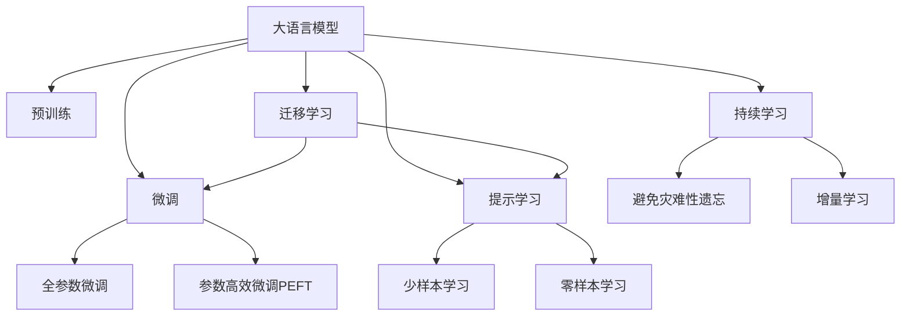

                 

## 1. 背景介绍

人工智能(AI)技术的快速发展，推动了智能算法和工具的不断创新。作为AI领域中的重要组成部分，自然语言处理(NLP)一直受到广泛关注。在NLP领域，大语言模型(LLM)通过深度学习技术，可以处理大量文本数据，并生成高质量的自然语言文本。然而，仅依靠预训练模型在特定领域的应用仍然存在一些挑战，例如数据稀缺、模型泛化能力不足等。因此，构建一个智能工具箱，以便于开发者能够更高效地将大语言模型应用于具体任务，成为当前的迫切需求。

### 1.1 问题由来

大语言模型在自然语言处理领域的应用，特别是其在机器翻译、情感分析、文本摘要等任务中的优异表现，吸引了大量研究者和开发者的关注。然而，大语言模型在实际应用中面临以下问题：

- **数据稀缺**：预训练模型通常依赖于大规模无标签数据，但在某些特定领域，获取高质量的标注数据可能非常困难。
- **模型泛化能力不足**：预训练模型往往在数据集中的常见场景表现良好，但在领域外数据或少样本场景下的泛化能力有限。
- **计算资源消耗大**：训练大语言模型需要大量的计算资源，即便是微调或推理也需要较高的算力支持。

为了解决这些问题，构建一个AI函数库显得尤为重要。AI函数库作为大语言模型系统的智能工具箱，可以提供一系列高效的工具和算法，帮助开发者更轻松地进行模型训练、微调、推理等操作，从而加速模型应用的开发进程。

## 2. 核心概念与联系

### 2.1 核心概念概述

为更好地理解AI函数库在大语言模型系统中的应用，我们先介绍几个核心概念：

- **大语言模型(LLM)**：指通过大规模无标签文本数据进行预训练，具有强大语言理解能力的深度学习模型。常见的预训练模型包括BERT、GPT等。
- **预训练(Pre-training)**：指在大规模无标签数据上，通过自监督学习任务训练模型的过程。常用的预训练任务包括语言模型、掩码语言模型等。
- **微调(Fine-tuning)**：指在预训练模型的基础上，使用下游任务的少量标注数据，通过有监督学习优化模型在该任务上的性能。微调可以显著提升模型在特定任务上的表现。
- **迁移学习(Transfer Learning)**：指将一个领域学到的知识迁移到另一个相关领域的学习范式。大语言模型通过预训练和微调，可以在新领域中快速适应。
- **参数高效微调(PEFT)**：指在微调过程中，只更新少量的模型参数，而固定大部分预训练权重不变，以提高微调效率，避免过拟合。
- **Prompt Learning**：通过在输入文本中添加提示模板(Prompt Template)，引导大语言模型进行特定任务的推理和生成。可以在不更新模型参数的情况下，实现零样本或少样本学习。

这些核心概念之间的逻辑关系可以通过以下Mermaid流程图来展示：



### 2.2 核心概念原理和架构的 Mermaid 流程图

由于篇幅限制，这里不再展示整个MERmaid图，但下面给出了核心概念原理和架构的简要描述：

- **大语言模型(LLM)**：作为智能工具箱的核心，LLM可以处理大量自然语言数据，并生成高质量的文本。
- **预训练(Pre-training)**：通过大规模无标签数据的自监督学习，预训练模型可以学习到丰富的语言知识和模式。
- **微调(Fine-tuning)**：在预训练模型的基础上，通过下游任务的少量标注数据进行有监督学习，优化模型在该任务上的性能。
- **迁移学习(Transfer Learning)**：将预训练模型在某一领域的知识迁移到另一领域，以提高模型在新领域的适应性。
- **参数高效微调(PEFT)**：通过只更新部分参数，减少微调过程中的计算资源消耗。
- **Prompt Learning**：通过精心设计输入模板，引导LLM生成特定格式的输出，提升模型的零样本或少样本学习能力。

## 3. 核心算法原理 & 具体操作步骤

### 3.1 算法原理概述

AI函数库作为大语言模型系统的智能工具箱，核心目标在于提供一系列高效的工具和算法，帮助开发者更轻松地进行模型训练、微调、推理等操作。以下是AI函数库中的一些核心算法原理：

- **模型训练与微调算法**：使用自监督学习和迁移学习等技术，在大规模无标签数据和下游任务的少量标注数据上进行模型训练和微调。
- **参数高效微调算法**：通过仅更新部分参数，减少计算资源消耗，同时保持模型性能。
- **Prompt学习算法**：通过输入文本中的提示模板，引导大语言模型进行特定任务的推理和生成。
- **数据增强与对抗训练算法**：通过数据增强和对抗训练等技术，提高模型的泛化能力和鲁棒性。

### 3.2 算法步骤详解

AI函数库中的算法步骤主要分为以下几部分：

1. **模型初始化**：使用预训练模型作为初始化参数，或者从零开始训练新模型。
2. **数据预处理**：对输入数据进行预处理，包括文本分词、数据增强等。
3. **模型训练与微调**：根据具体任务设计适当的损失函数和优化器，在标注数据上进行有监督学习，优化模型参数。
4. **参数高效微调**：通过仅更新部分参数，减少计算资源消耗，同时保持模型性能。
5. **Prompt学习**：通过设计合适的提示模板，引导大语言模型进行特定任务的推理和生成。
6. **模型评估与部署**：在测试集上评估模型性能，然后将模型部署到实际应用中。

### 3.3 算法优缺点

AI函数库中的算法具有以下优点：

- **高效性**：通过提供一系列高效的算法和工具，帮助开发者快速进行模型训练和微调，提高开发效率。
- **灵活性**：提供了多种算法选择，根据具体任务和数据特点进行灵活配置。
- **稳定性**：通过数据增强和对抗训练等技术，提高模型的泛化能力和鲁棒性。

同时，这些算法也存在一些缺点：

- **资源消耗大**：构建AI函数库需要大量计算资源，特别是在模型训练和微调过程中。
- **实现复杂**：开发和维护AI函数库需要较高的技术水平，特别是在算法实现和优化方面。
- **应用场景有限**：AI函数库的算法和工具主要针对特定的NLP任务，对于其他领域的任务可能不适用。

### 3.4 算法应用领域

AI函数库在大语言模型系统中的应用领域非常广泛，以下是一些主要的应用场景：

- **机器翻译**：通过微调和参数高效微调等技术，提升翻译模型的准确性和效率。
- **情感分析**：通过情感分类任务，训练模型识别文本中的情感倾向。
- **文本摘要**：通过文本摘要任务，训练模型自动生成文本的精简版本。
- **问答系统**：通过问答任务，训练模型回答用户提出的问题。
- **对话系统**：通过对话生成任务，训练模型生成自然流畅的对话回复。
- **代码生成**：通过代码生成任务，训练模型自动生成代码片段。
- **数据增强**：通过数据增强技术，提升模型的泛化能力和鲁棒性。

## 4. 数学模型和公式 & 详细讲解 & 举例说明

### 4.1 数学模型构建

AI函数库中的数学模型主要基于深度学习框架，使用大量的神经网络结构。以BERT模型为例，其数学模型构建如下：

- **输入编码器**：将输入文本转化为词向量表示。
- **Transformer层**：通过自注意力机制和多头注意力机制，捕捉文本中的语义信息。
- **池化层**：对Transformer层的输出进行池化，提取特征。
- **全连接层**：将池化层的输出转化为类别概率分布。

### 4.2 公式推导过程

以下以BERT模型的softmax层为例，推导其公式：

设输入为 $x$，Transformer层的输出为 $h$，softmax层的权重矩阵为 $W$，则softmax层的输出为：

$$
\text{softmax}(x) = \frac{e^{x}}{\sum_{i=1}^{n} e^{x_i}} = \frac{e^{x}}{\sum_{i=1}^{n} e^{W^T x_i}}
$$

其中 $W$ 为softmax层的权重矩阵，$n$ 为类别数。softmax层的输出为每个类别的概率分布。

### 4.3 案例分析与讲解

以情感分类任务为例，假设训练集为 $(x_1, y_1), (x_2, y_2), ..., (x_m, y_m)$，其中 $x_i$ 为输入文本，$y_i$ 为标签（1表示正面，0表示负面）。使用softmax分类器的损失函数为交叉熵损失函数：

$$
\mathcal{L} = -\frac{1}{m} \sum_{i=1}^{m} y_i \log \text{softmax}(x_i)
$$

训练过程中，使用梯度下降等优化算法，不断更新模型参数，使得损失函数 $\mathcal{L}$ 最小化。最终得到训练好的模型，可以用于情感分类任务的预测。

## 5. 项目实践：代码实例和详细解释说明

### 5.1 开发环境搭建

构建AI函数库需要一定的开发环境和工具支持。以下是开发环境的搭建步骤：

1. **安装Python环境**：
   - 安装Python 3.7或更高版本。
   - 使用虚拟环境（如virtualenv或conda）创建独立的Python环境。

2. **安装深度学习框架**：
   - 安装TensorFlow或PyTorch等深度学习框架，并配置好GPU或TPU支持。
   - 安装TensorBoard和Weights & Biases等可视化工具。

3. **安装AI函数库**：
   - 安装AI函数库及其依赖包。
   - 安装相应的预训练模型和数据集。

### 5.2 源代码详细实现

以BERT模型在情感分类任务中的应用为例，以下是代码实现：

```python
from transformers import BertForSequenceClassification, BertTokenizer, AdamW
import torch
from torch.utils.data import DataLoader
from sklearn.metrics import accuracy_score

# 初始化BERT模型和tokenizer
model = BertForSequenceClassification.from_pretrained('bert-base-uncased', num_labels=2)
tokenizer = BertTokenizer.from_pretrained('bert-base-uncased')

# 定义训练函数
def train(model, data_loader, optimizer, device, epochs):
    model.to(device)
    for epoch in range(epochs):
        model.train()
        for batch in data_loader:
            input_ids = batch['input_ids'].to(device)
            attention_mask = batch['attention_mask'].to(device)
            labels = batch['labels'].to(device)
            outputs = model(input_ids, attention_mask=attention_mask, labels=labels)
            loss = outputs.loss
            optimizer.zero_grad()
            loss.backward()
            optimizer.step()

# 定义评估函数
def evaluate(model, data_loader, device):
    model.eval()
    predictions, labels = [], []
    with torch.no_grad():
        for batch in data_loader:
            input_ids = batch['input_ids'].to(device)
            attention_mask = batch['attention_mask'].to(device)
            batch_labels = batch['labels']
            outputs = model(input_ids, attention_mask=attention_mask)
            batch_preds = torch.argmax(outputs.logits, dim=1).to('cpu').tolist()
            batch_labels = batch_labels.to('cpu').tolist()
            predictions.extend(batch_preds)
            labels.extend(batch_labels)
    accuracy = accuracy_score(labels, predictions)
    return accuracy

# 加载数据集
train_data = ...
dev_data = ...
test_data = ...

# 分割数据集
train_data_loader = DataLoader(train_data, batch_size=16, shuffle=True)
dev_data_loader = DataLoader(dev_data, batch_size=16, shuffle=False)
test_data_loader = DataLoader(test_data, batch_size=16, shuffle=False)

# 初始化优化器
optimizer = AdamW(model.parameters(), lr=1e-5)

# 训练模型
train(model, train_data_loader, optimizer, device, epochs=3)

# 评估模型
accuracy = evaluate(model, test_data_loader, device)
print(f"Accuracy: {accuracy}")
```

### 5.3 代码解读与分析

上述代码实现了BERT模型在情感分类任务中的训练和评估过程。以下是关键代码的解读和分析：

1. **模型初始化**：使用`BertForSequenceClassification`从预训练模型中初始化情感分类模型，并使用`BertTokenizer`初始化tokenizer。

2. **训练函数**：定义训练函数，对数据集进行批处理，在前向传播中计算损失函数，使用优化器更新模型参数。

3. **评估函数**：定义评估函数，对模型在测试集上的预测结果和标签进行比较，计算准确率。

4. **数据集加载**：使用`DataLoader`对数据集进行批处理，方便模型训练和评估。

5. **优化器配置**：使用AdamW优化器进行参数更新，设置合适的学习率。

6. **训练和评估**：通过多次迭代训练模型，并在测试集上评估模型性能。

## 6. 实际应用场景

### 6.1 智能客服系统

智能客服系统是大语言模型在实际应用中的重要应用场景之一。通过微调BERT模型，可以构建7x24小时不间断运行的智能客服系统，处理用户咨询，提高客户满意度和服务效率。

在实现上，可以收集企业内部的客服对话记录，将问题和最佳答复构建成监督数据，对BERT模型进行微调。微调后的模型能够自动理解用户意图，匹配最合适的答复，实现高效的智能客服。

### 6.2 金融舆情监测

金融行业对实时舆情监测的需求非常迫切。通过微调BERT模型，可以构建实时舆情监测系统，及时发现市场动向和潜在风险。

具体而言，可以收集金融领域的文本数据，并对数据进行情感分类和主题分类标注。在标注数据上微调BERT模型，使其能够自动识别金融舆情，实时监测市场动态。

### 6.3 个性化推荐系统

在电商和社交媒体等平台中，个性化推荐系统能够提高用户满意度，增加平台粘性。通过微调BERT模型，可以构建高效的个性化推荐系统。

在实现上，可以收集用户浏览、点击、评论等行为数据，提取和用户交互的物品描述、标签等文本内容。在文本数据上微调BERT模型，使其能够从文本内容中捕捉用户兴趣，生成个性化的推荐结果。

### 6.4 未来应用展望

随着AI函数库和大语言模型的不断发展，其应用场景将不断拓展。以下是一些未来可能的应用场景：

- **智能医疗**：通过微调BERT模型，构建智能诊疗系统，提高医疗诊断的准确性和效率。
- **智能教育**：通过微调BERT模型，构建智能教育系统，根据学生的学习行为和表现，提供个性化的学习建议和资源。
- **智慧城市**：通过微调BERT模型，构建智慧城市管理系统，实时监测和管理城市运行数据。
- **智能安防**：通过微调BERT模型，构建智能安防系统，提高安全监控和预警能力。

## 7. 工具和资源推荐

### 7.1 学习资源推荐

以下是一些推荐的AI函数库和学习资源：

1. **TensorFlow官方文档**：提供了丰富的教程和示例，帮助开发者掌握TensorFlow的使用。
2. **PyTorch官方文档**：提供了详细的API文档和案例代码，方便开发者快速上手。
3. **Transformers官方文档**：提供了丰富的预训练模型和微调范例，帮助开发者构建高效的智能工具箱。
4. **自然语言处理书籍**：如《自然语言处理综述》、《深度学习与自然语言处理》等，深入浅出地介绍了NLP技术。
5. **在线课程和讲座**：如Coursera的NLP课程、Google的TensorFlow Dev Summit等，提供系统的学习路径。

### 7.2 开发工具推荐

以下是一些推荐的开发工具：

1. **Jupyter Notebook**：提供了强大的代码编写和数据可视化功能，方便开发者进行模型训练和评估。
2. **TensorBoard**：提供了可视化功能，帮助开发者实时监测模型训练状态。
3. **Weights & Biases**：提供了实验跟踪功能，帮助开发者记录和比较模型训练结果。
4. **GitHub**：提供了代码版本控制和协作功能，方便开发者进行代码管理和共享。

### 7.3 相关论文推荐

以下是一些推荐的论文：

1. **Transformer论文**：由Google发布，介绍了Transformer模型的架构和原理。
2. **BERT论文**：由Google发布，介绍了BERT模型的预训练和微调过程。
3. **BERT微调技术**：介绍了BERT模型在不同任务上的微调方法和效果。
4. **深度学习自然语言处理**：介绍了NLP领域的深度学习技术和算法。

## 8. 总结：未来发展趋势与挑战

### 8.1 研究成果总结

AI函数库作为大语言模型系统的智能工具箱，已经取得了一些研究成果，如BERT模型在情感分类任务上的优异表现，智能客服系统的成功应用等。通过这些成果，可以看到AI函数库在大语言模型系统中的重要价值。

### 8.2 未来发展趋势

随着AI函数库和大语言模型的不断发展，未来的趋势可能包括以下几个方面：

1. **模型规模进一步扩大**：随着计算资源的不断提升，大语言模型的规模将进一步扩大，学习到的语言知识和模式将更加丰富。
2. **微调方法多样化**：除了传统的全参数微调外，未来将涌现更多参数高效的微调方法，如Prefix-Tuning、LoRA等。
3. **持续学习和迁移学习**：未来的模型将具备更强的持续学习和迁移学习能力，适应数据分布的变化，提高模型的泛化能力。
4. **多模态融合**：未来的模型将支持多模态数据的融合，如视觉、语音和文本数据的协同建模，提升模型的综合能力。

### 8.3 面临的挑战

尽管AI函数库和大语言模型取得了一定进展，但未来的发展仍面临一些挑战：

1. **数据稀缺**：特别是在长尾领域，获取高质量标注数据仍然是一个难题。
2. **模型泛化能力不足**：在领域外数据或少样本场景下的泛化能力有待提升。
3. **计算资源消耗大**：构建和部署大语言模型需要大量的计算资源。
4. **模型可解释性不足**：大语言模型的决策过程缺乏可解释性，难以调试和优化。
5. **安全性和伦理问题**：模型的偏见和有害信息可能对用户造成误导和伤害。

### 8.4 研究展望

为了应对这些挑战，未来的研究可能需要在以下几个方面进行探索：

1. **无监督和半监督学习**：开发更多无监督和半监督学习算法，减少对标注数据的依赖。
2. **参数高效微调**：开发更多参数高效的微调算法，提高微调的效率和效果。
3. **多模态融合**：研究多模态数据的协同建模，提升模型的综合能力。
4. **模型可解释性**：研究如何提高模型的可解释性，增强用户的信任和理解。
5. **安全性和伦理约束**：研究如何构建安全的、可控的、符合伦理道德的AI函数库。

## 9. 附录：常见问题与解答

### 9.1 Q1: 如何选择合适的预训练模型？

A: 选择合适的预训练模型需要考虑多个因素，如任务类型、数据规模、计算资源等。一般来说，BERT模型在通用语言理解和生成任务上表现较好，而GPT模型在自然语言生成任务上表现较好。

### 9.2 Q2: 如何优化模型训练过程？

A: 优化模型训练过程可以从以下几个方面入手：
- **超参数调优**：通过调整学习率、批大小、迭代次数等超参数，找到最优的训练方案。
- **数据增强**：通过数据增强技术，丰富训练集，提高模型的泛化能力。
- **正则化**：通过L2正则、Dropout等技术，避免过拟合。
- **对抗训练**：通过对抗样本训练，提高模型的鲁棒性。

### 9.3 Q3: 如何提高模型的泛化能力？

A: 提高模型的泛化能力可以从以下几个方面入手：
- **数据增强**：通过数据增强技术，丰富训练集，提高模型的泛化能力。
- **对抗训练**：通过对抗样本训练，提高模型的鲁棒性。
- **迁移学习**：通过在其他任务上进行微调，学习到更加通用的语言知识和模式。
- **多模态融合**：研究多模态数据的协同建模，提升模型的综合能力。

### 9.4 Q4: 如何在模型训练过程中避免过拟合？

A: 避免过拟合可以从以下几个方面入手：
- **数据增强**：通过数据增强技术，丰富训练集，提高模型的泛化能力。
- **正则化**：通过L2正则、Dropout等技术，避免过拟合。
- **对抗训练**：通过对抗样本训练，提高模型的鲁棒性。
- **参数高效微调**：通过仅更新部分参数，减少计算资源消耗，同时保持模型性能。

### 9.5 Q5: 如何在模型训练过程中提高效率？

A: 提高模型训练效率可以从以下几个方面入手：
- **梯度累积**：通过梯度累积技术，减少计算资源消耗。
- **混合精度训练**：通过混合精度训练技术，优化模型的计算性能。
- **模型压缩**：通过模型压缩技术，减小模型尺寸，加快推理速度。
- **分布式训练**：通过分布式训练技术，提高模型训练速度。

---
作者：禅与计算机程序设计艺术 / Zen and the Art of Computer Programming

