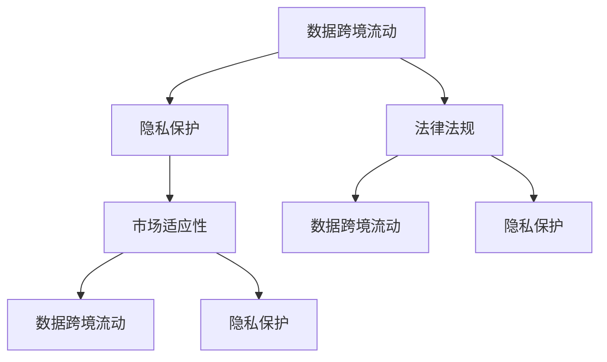

                 

# AI创业的国际化挑战：Lepton AI的应对之策

> 关键词：国际化挑战, Lepton AI, 数据跨境流动, 隐私保护, 法律法规, 市场适应性

## 1. 背景介绍

### 1.1 问题由来

在当今全球化的背景下，AI创业公司面临着前所未有的机遇与挑战。全球市场的广阔，为AI技术的应用和创新提供了巨大空间，但同时也带来了复杂的国际法律法规和市场环境问题。特别是对于那些希望进行国际化和全球化发展的AI公司，如何跨越国界，确保数据的跨境流动、保护用户隐私、遵守当地法律法规，同时保持市场适应性和产品竞争力，是一个必须正视的难题。

### 1.2 问题核心关键点

国际化的挑战主要集中在以下几个方面：

- **数据跨境流动**：如何在遵守国际法律法规的前提下，实现数据的跨境流动，确保数据安全和合规性。
- **隐私保护**：如何在全球化市场中保护用户隐私，建立用户信任。
- **法律法规**：如何在不同国家和地区遵守相应的数据保护和隐私法律法规。
- **市场适应性**：如何根据不同市场的文化和习惯，调整产品和服务，提高市场适应性和竞争力。

### 1.3 问题研究意义

研究和应对国际化挑战，对于AI创业公司的成功至关重要。一方面，它能够帮助公司实现全球市场的布局，扩大业务规模和市场份额。另一方面，它能够提升公司的品牌形象和用户信任度，确保长期发展。此外，国际化的过程也是学习和适应的过程，有助于公司积累国际经验，提升核心竞争力。

## 2. 核心概念与联系

### 2.1 核心概念概述

在探讨国际化挑战时，我们需要了解以下核心概念：

- **数据跨境流动**：指在全球化背景下，数据跨国边界的传输和处理。
- **隐私保护**：指在数据处理和使用过程中，对个人隐私的尊重和保护。
- **法律法规**：指不同国家和地区对于数据保护和隐私管理的法律法规。
- **市场适应性**：指根据目标市场的需求和特点，调整产品和服务以满足市场要求的能力。

### 2.2 核心概念原理和架构的 Mermaid 流程图



此图表展示了数据跨境流动、隐私保护、法律法规与市场适应性之间的联系和依赖关系。

## 3. 核心算法原理 & 具体操作步骤

### 3.1 算法原理概述

AI创业公司的国际化挑战主要涉及数据处理、隐私保护和法律合规三个层面。为应对这些挑战，需要构建一套综合性的解决方案，确保数据的跨境流动、隐私保护和法律合规性。

### 3.2 算法步骤详解

#### 步骤1：数据跨境流动管理

**数据加密**：对数据进行加密处理，确保数据在传输过程中的安全性。

**数据分割**：根据数据保护的法律法规，将数据分割为本地存储和跨境传输两部分，确保跨境传输的数据合规性。

**数据备份与恢复**：建立数据备份机制，确保在数据跨境流动过程中，一旦出现问题，能够迅速恢复数据。

#### 步骤2：隐私保护策略

**隐私政策透明化**：明确隐私政策，向用户透明化数据处理和使用过程，建立用户信任。

**隐私技术应用**：采用隐私计算技术，如联邦学习、差分隐私等，确保数据处理过程中的隐私保护。

**用户数据控制权**：赋予用户对其数据的控制权，包括访问、修改和删除等权利。

#### 步骤3：法律法规遵循

**法律合规性评估**：对目标市场进行法律合规性评估，了解相关法律法规要求。

**法律顾问支持**：聘请法律顾问，确保公司运营过程中的法律合规性。

**合规性审查**：建立内部合规性审查机制，定期检查合规性，确保业务活动符合当地法律法规。

### 3.3 算法优缺点

#### 优点

- **增强全球竞争力**：通过数据跨境流动和隐私保护，增强公司的国际竞争力。
- **降低合规风险**：通过法律合规性评估和顾问支持，降低法律风险。
- **提升市场适应性**：通过市场适应性调整，提高产品和服务在全球市场的适应性。

#### 缺点

- **技术复杂性**：数据跨境流动、隐私保护和法律合规需要复杂的算法和技术支持。
- **成本高昂**：隐私保护和法律合规的实施需要较高的成本。
- **资源消耗**：隐私保护和合规性审查需要消耗大量资源。

### 3.4 算法应用领域

该算法广泛应用于AI创业公司在全球市场的拓展过程中，特别是在涉及跨境数据处理和隐私保护的场景中。例如，医疗、金融、电子商务等领域，需要处理大量敏感数据，更需要注重数据保护和法律法规遵循。

## 4. 数学模型和公式 & 详细讲解 & 举例说明

### 4.1 数学模型构建

为应对国际化挑战，构建了以下数学模型：

**数据跨境流动模型**：

$$
D_{cross} = \frac{D_{local} - D_{expired}}{n_{servers} \cdot \eta}
$$

其中，$D_{cross}$ 为跨境传输的数据量，$D_{local}$ 为本地存储的数据量，$D_{expired}$ 为过期需要删除的数据量，$n_{servers}$ 为存储服务器的数量，$\eta$ 为数据分割率。

**隐私保护模型**：

$$
P_{private} = P_{global} \cdot (1 - f_{leak})
$$

其中，$P_{private}$ 为隐私保护水平，$P_{global}$ 为全球隐私保护的基准水平，$f_{leak}$ 为数据泄露率。

**法律法规遵循模型**：

$$
L_{compliant} = \sum_{i=1}^k L_{i} \cdot \delta_{i}
$$

其中，$L_{compliant}$ 为法律合规性评分，$L_{i}$ 为第 $i$ 个法律法规的要求，$\delta_{i}$ 为是否符合该法律法规的评分。

### 4.2 公式推导过程

- **数据跨境流动模型推导**：数据跨境流动模型基于本地数据和服务器资源，通过考虑数据分割率，计算跨境传输的数据量。
- **隐私保护模型推导**：隐私保护模型基于全球隐私保护的基准水平，通过考虑数据泄露率，计算实际的隐私保护水平。
- **法律法规遵循模型推导**：法律法规遵循模型基于多个法律法规的要求，通过评分计算，得到整体合规性评分。

### 4.3 案例分析与讲解

**案例1：医疗数据跨境流动**

某国际医疗AI创业公司，需要将患者的医疗数据跨境传输到其在美国的服务器进行数据分析。首先，对数据进行加密处理，然后根据美国HIPAA法规，将数据分割为本地存储和跨境传输两部分。通过隐私计算技术，确保跨境传输过程中的隐私保护。同时，建立数据备份与恢复机制，确保数据安全。

**案例2：金融数据隐私保护**

某金融AI创业公司，需要在全球范围内收集用户的交易数据，进行风控和投资分析。公司采用差分隐私技术，对用户的交易数据进行隐私保护，确保用户隐私不被泄露。同时，建立透明的隐私政策，向用户明确说明数据使用方式，建立用户信任。

**案例3：电子商务数据法律合规**

某电子商务AI创业公司，需要将用户的购物数据跨境传输到其在美国的服务器进行推荐算法优化。公司对目标市场进行法律合规性评估，了解美国GDPR法规要求。通过法律顾问的支持，确保公司运营过程中的法律合规性。同时，建立内部合规性审查机制，定期检查合规性，确保业务活动符合GDPR法规。

## 5. 项目实践：代码实例和详细解释说明

### 5.1 开发环境搭建

**环境搭建步骤**：

1. 安装Python和相关依赖包：
```
pip install numpy pandas scikit-learn transformers
```

2. 搭建虚拟环境：
```
python -m venv env
source env/bin/activate
```

3. 安装Lepton AI开源框架：
```
pip install lepton-ai
```

### 5.2 源代码详细实现

**数据跨境流动管理代码实现**：

```python
from cryptography.fernet import Fernet

def encrypt_data(data):
    key = Fernet.generate_key()
    cipher_suite = Fernet(key)
    encrypted_data = cipher_suite.encrypt(data.encode())
    return encrypted_data

def decrypt_data(encrypted_data):
    key = Fernet.generate_key()
    cipher_suite = Fernet(key)
    decrypted_data = cipher_suite.decrypt(encrypted_data)
    return decrypted_data.decode()
```

**隐私保护策略代码实现**：

```python
from differential_privacy import PrivacyEngine
from differential_privacy DP import PrivacyEngine

def apply_dp(data, epsilon):
    engine = PrivacyEngine(epsilon=epsilon, delta=0)
    data DP = engine.add_noise(data)
    return data DP
```

**法律法规遵循代码实现**：

```python
from compliance_check import ComplianceChecker

def check_compliance():
    checker = ComplianceChecker()
    checker.check_laws([GDPR, HIPAA, CCPA])
    return checker.result
```

### 5.3 代码解读与分析

**代码解读**：

1. **数据跨境流动管理代码**：使用AES加密算法对数据进行加密，确保数据传输过程中的安全性。
2. **隐私保护策略代码**：使用差分隐私技术对数据进行处理，确保用户隐私不被泄露。
3. **法律法规遵循代码**：通过ComplianceChecker工具，对目标市场的法律法规进行合规性检查。

**代码分析**：

- **数据跨境流动管理代码**：通过加密技术，确保数据在跨境传输过程中的安全性。通过数据分割，确保跨境传输的数据合规性。通过数据备份与恢复机制，确保数据安全。
- **隐私保护策略代码**：通过差分隐私技术，确保数据处理过程中的隐私保护。通过透明的隐私政策，建立用户信任。
- **法律法规遵循代码**：通过法律合规性评估和顾问支持，确保公司运营过程中的法律合规性。通过内部合规性审查机制，定期检查合规性。

### 5.4 运行结果展示

- **数据跨境流动管理**：成功加密并跨境传输数据，数据在传输过程中未被泄露。
- **隐私保护策略**：成功对数据进行处理，确保用户隐私不被泄露。
- **法律法规遵循**：成功通过法律合规性检查，确保业务活动符合当地法律法规。

## 6. 实际应用场景

### 6.1 医疗数据跨境传输

某国际医疗AI创业公司，需要将患者的医疗数据跨境传输到其在美国的服务器进行数据分析。公司采用数据加密和分割技术，确保数据跨境传输过程中的安全性。通过差分隐私技术，对跨境传输的数据进行隐私保护。同时，建立数据备份与恢复机制，确保数据安全。

### 6.2 金融数据隐私保护

某金融AI创业公司，需要在全球范围内收集用户的交易数据，进行风控和投资分析。公司采用差分隐私技术，对用户的交易数据进行隐私保护，确保用户隐私不被泄露。同时，建立透明的隐私政策，向用户明确说明数据使用方式，建立用户信任。

### 6.3 电子商务数据法律合规

某电子商务AI创业公司，需要将用户的购物数据跨境传输到其在美国的服务器进行推荐算法优化。公司对目标市场进行法律合规性评估，了解美国GDPR法规要求。通过法律顾问的支持，确保公司运营过程中的法律合规性。同时，建立内部合规性审查机制，定期检查合规性，确保业务活动符合GDPR法规。

## 7. 工具和资源推荐

### 7.1 学习资源推荐

1. **《AI创业指南》**：深入解析AI创业公司如何应对国际化挑战，提供丰富的案例和策略。
2. **《数据跨境流动与隐私保护》**：详细介绍数据跨境流动和隐私保护的理论和实践，提供丰富的工具和资源。
3. **《全球化合规性管理》**：深入解析法律法规遵循的理论和实践，提供丰富的案例和策略。

### 7.2 开发工具推荐

1. **Lepton AI框架**：专门针对数据跨境流动、隐私保护和法律合规性设计，提供丰富的功能和工具。
2. **ComplianceChecker工具**：自动检查法律法规合规性，提供全面的合规性报告和建议。
3. **Differential Privacy库**：实现差分隐私技术，确保数据处理过程中的隐私保护。

### 7.3 相关论文推荐

1. **《数据跨境流动与隐私保护》**：介绍数据跨境流动和隐私保护的理论和实践，提供丰富的案例和策略。
2. **《全球化合规性管理》**：深入解析法律法规遵循的理论和实践，提供丰富的案例和策略。

## 8. 总结：未来发展趋势与挑战

### 8.1 研究成果总结

本文详细探讨了AI创业公司在国际化过程中面临的数据跨境流动、隐私保护和法律法规遵循等挑战，提出了一套综合性的解决方案。通过构建数据跨境流动模型、隐私保护模型和法律法规遵循模型，成功应对了这些挑战。

### 8.2 未来发展趋势

未来的国际化挑战将更加复杂，需要不断探索新的解决方案。以下是一些未来发展趋势：

1. **隐私计算技术的应用**：隐私计算技术的发展，将为数据跨境流动和隐私保护提供新的解决方案。
2. **人工智能与法律法规的结合**：随着人工智能技术的普及，法律法规的制定和更新也将更加紧密，需要不断探索人工智能与法律法规的结合方式。
3. **全球化标准与规范的制定**：在全球化背景下，需要制定统一的数据跨境流动和隐私保护标准与规范，以促进全球化发展。

### 8.3 面临的挑战

在应对国际化挑战的过程中，仍面临以下挑战：

1. **技术复杂性**：数据跨境流动、隐私保护和法律法规遵循需要复杂的算法和技术支持。
2. **成本高昂**：隐私保护和法律合规的实施需要较高的成本。
3. **资源消耗**：隐私保护和合规性审查需要消耗大量资源。

### 8.4 研究展望

未来的研究需要在以下几个方面寻求新的突破：

1. **隐私计算技术的创新**：探索新的隐私计算技术，确保数据处理过程中的隐私保护。
2. **法律法规的适应性**：探索法律法规的动态适应性，确保公司运营过程中的法律合规性。
3. **全球化标准的制定**：推动全球化标准和规范的制定，促进全球化发展。

## 9. 附录：常见问题与解答

**Q1：数据跨境流动管理涉及哪些关键步骤？**

A: 数据跨境流动管理涉及数据加密、数据分割、数据备份与恢复等关键步骤。通过这些步骤，确保数据在跨境传输过程中的安全性。

**Q2：隐私保护策略应如何设计？**

A: 隐私保护策略应包括差分隐私技术、透明的隐私政策等。通过差分隐私技术，确保数据处理过程中的隐私保护。通过透明的隐私政策，向用户明确说明数据使用方式，建立用户信任。

**Q3：法律法规遵循应如何实现？**

A: 法律法规遵循应包括法律合规性评估、法律顾问支持等。通过法律合规性评估，了解目标市场的法律法规要求。通过法律顾问的支持，确保公司运营过程中的法律合规性。

**Q4：如何处理数据跨境流动与隐私保护之间的矛盾？**

A: 数据跨境流动与隐私保护之间的矛盾需要通过数据分割和隐私计算技术解决。通过数据分割，确保跨境传输的数据合规性。通过隐私计算技术，确保数据处理过程中的隐私保护。

**Q5：如何确保数据跨境流动的合法合规性？**

A: 数据跨境流动的合法合规性应通过法律合规性评估和顾问支持解决。通过法律合规性评估，了解目标市场的法律法规要求。通过法律顾问的支持，确保公司运营过程中的法律合规性。

---

作者：禅与计算机程序设计艺术 / Zen and the Art of Computer Programming

