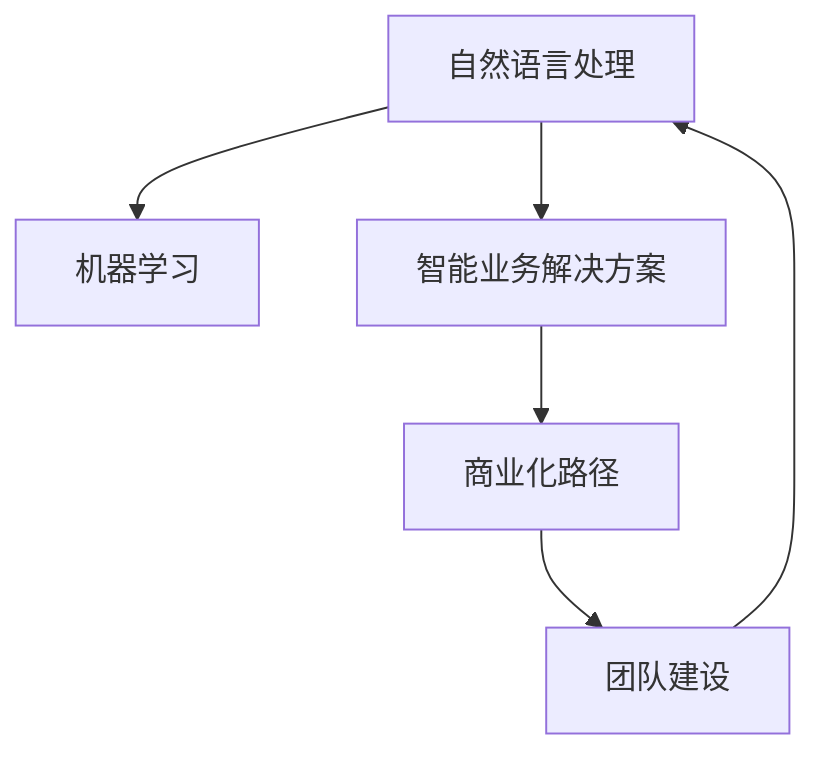

                 

# AI创业的新范式：Lepton AI的经验分享

> 关键词：AI创业,Lepton AI,技术创新,数据驱动,智能业务解决方案,技术团队管理,商业化路径

## 1. 背景介绍

随着人工智能技术的迅猛发展，越来越多的创业公司在AI领域崭露头角。然而，成功的人工智能创业不仅需要强大的技术实力，还需要一套行之有效的商业模式和业务策略。Lepton AI就是其中的佼佼者，通过在自然语言处理、机器学习等技术领域的深耕，提供了一系列智能业务解决方案，在多个行业中取得了显著的成绩。本文将分享Lepton AI在AI创业领域的独特经验，为有志于进入这一领域的创业者提供宝贵的参考。

### 1.1 问题由来
AI创业的兴起，离不开技术的进步和应用的广泛。但许多初创公司面临着技术选型、业务场景适配、团队构建、商业模式设计等一系列挑战。Lepton AI的成功经验，为我们提供了从技术到商业化的完整路径，涵盖了从产品研发到市场推广的各个环节。

### 1.2 问题核心关键点
Lepton AI的成功，归功于其对技术、业务、商业化等多个维度的全面理解和深度整合。关键点包括：
- 技术选型：选择适合初创公司资源和需求的技术栈，如TensorFlow、PyTorch等。
- 业务适配：在特定领域进行深度业务理解和技术创新，打造有竞争力的产品。
- 商业化路径：制定灵活的商业模式，如SaaS、B2B、B2C等，确保可持续增长。
- 团队建设：构建跨领域、高素质的技术团队，吸引和培养优秀人才。

本文将从技术选型、业务适配、商业化路径和团队建设四个方面，详细解读Lepton AI的创业经验，帮助有志创业者更好地应对AI创业的挑战，迈向成功。

## 2. 核心概念与联系

### 2.1 核心概念概述

Lepton AI在AI创业中的成功，离不开一系列关键技术的支撑。以下是对这些核心概念的概述：

- **自然语言处理（NLP）**：使用深度学习模型处理、理解和生成自然语言，涉及文本分类、情感分析、问答系统等任务。
- **机器学习（ML）**：通过数据驱动的方法，训练模型进行预测、分类、聚类等任务。
- **智能业务解决方案**：针对特定行业的具体业务场景，提供定制化的智能服务，如智能客服、推荐系统、金融风控等。
- **商业化路径**：制定适应不同市场和客户需求的商业模式，如SaaS、B2B、B2C等。
- **团队建设**：吸引和培养跨领域、高素质的技术和管理人才，打造高效的团队协作环境。

这些概念之间的逻辑关系可以通过以下Mermaid流程图来展示：



这个流程图展示了Lepton AI在AI创业中各个概念之间的联系：

1. **自然语言处理和机器学习**：是构建智能业务解决方案的基础。
2. **智能业务解决方案**：是将技术应用于特定业务场景的核心。
3. **商业化路径**：确保技术转化为商业价值的关键。
4. **团队建设**：提供持续创新和市场响应的重要保障。

这些概念共同构成了Lepton AI的AI创业框架，为其在市场上取得成功提供了坚实基础。

## 3. 核心算法原理 & 具体操作步骤
### 3.1 算法原理概述

Lepton AI的AI创业成功，依赖于一系列技术选型和算法原理的优化。以下是核心算法原理的概述：

Lepton AI的技术栈主要包括TensorFlow、PyTorch和GPT等。其中，TensorFlow用于构建复杂的网络结构，适合处理大规模数据集；PyTorch提供了灵活的动态计算图，易于调试和优化；GPT系列模型则以其强大的语言生成能力，在自然语言处理任务中表现出色。

此外，Lepton AI在机器学习和自然语言处理领域引入了监督学习、迁移学习和无监督学习等多种算法。监督学习用于在标注数据上训练模型；迁移学习通过预训练和微调，提升模型在小规模数据上的性能；无监督学习则用于挖掘数据中的隐含结构和模式，提升模型的泛化能力。

### 3.2 算法步骤详解

Lepton AI在AI创业中采用的算法步骤主要包括以下几个环节：

**Step 1: 数据准备**
- 收集和清洗数据：根据业务需求，收集相关的文本数据，并进行预处理，如去除噪声、统一格式等。
- 数据划分：将数据划分为训练集、验证集和测试集，保证模型在未见数据上的泛化能力。

**Step 2: 模型设计**
- 选择合适的算法：根据任务特性和数据规模，选择适合的算法，如循环神经网络（RNN）、卷积神经网络（CNN）、Transformer等。
- 模型调参：在验证集上调整模型超参数，如学习率、批大小、优化器等，寻找最优参数组合。

**Step 3: 模型训练**
- 构建模型：使用TensorFlow或PyTorch等框架，构建并训练模型。
- 正则化：通过L2正则、Dropout等技术，避免过拟合。
- 数据增强：通过近义替换、回译等方式，丰富训练集多样性。
- 模型评估：在测试集上评估模型性能，根据结果进行迭代优化。

**Step 4: 业务适配**
- 任务适配：根据具体业务场景，设计任务适配层和损失函数。
- 数据处理：对输入数据进行标准化处理，如分词、去停用词等。
- 结果输出：将模型输出转化为业务需要的格式，如分类结果、推荐列表等。

**Step 5: 商业化**
- 选择合适的商业模型：根据目标客户和市场，选择适合的商业模式，如SaaS、B2B、B2C等。
- 定价策略：制定合理的定价策略，平衡客户价值和公司收入。
- 市场营销：通过广告、社交媒体等方式，推广产品和服务。

### 3.3 算法优缺点

Lepton AI在AI创业中采用的算法具有以下优点：
1. 技术选型灵活：TensorFlow和PyTorch提供灵活的技术栈选择，适合不同的项目需求。
2. 算法多样：监督学习、迁移学习和无监督学习相结合，提升模型性能和泛化能力。
3. 业务适配性强：根据不同业务场景设计任务适配层，提升模型实用价值。
4. 商业化路径广：SaaS、B2B、B2C等多种商业模式，适应不同的市场和客户需求。

同时，这些算法也存在一些缺点：
1. 资源消耗大：大规模模型的训练和推理需要高性能计算资源。
2. 技术门槛高：涉及深度学习、自然语言处理等多领域的知识，对团队技术要求高。
3. 模型复杂度高：模型结构复杂，调试和优化难度大。
4. 数据依赖性强：模型的训练和优化依赖于高质量的数据集，数据获取成本高。

尽管存在这些局限性，Lepton AI通过不断优化算法和提高团队技术能力，成功克服了这些挑战，实现了业务的快速增长和市场扩展。

### 3.4 算法应用领域

Lepton AI的AI创业经验，已经在多个领域得到应用，具体包括：

- **金融风控**：利用NLP技术，构建智能风控系统，自动识别和防范欺诈行为。
- **智能客服**：开发智能客服系统，通过机器学习算法处理客户咨询，提供24/7不间断服务。
- **推荐系统**：开发个性化推荐系统，根据用户行为和偏好，推荐适合的商品或内容。
- **智能审计**：利用NLP技术，自动化审计文档和财务报表，提高审计效率和准确性。
- **医疗诊断**：通过深度学习模型，辅助医生进行疾病诊断和治疗决策，提升医疗服务质量。

以上这些领域的应用，展示了Lepton AI在AI创业中的多样化和深度，为其在市场上取得成功提供了坚实的基础。

## 4. 数学模型和公式 & 详细讲解 & 举例说明

### 4.1 数学模型构建

Lepton AI在AI创业中，构建了多个数学模型，以下是对核心数学模型的构建。

**情感分析模型**：情感分析模型用于识别文本中的情感倾向，公式为：

$$
P(情感) = \frac{P(文本 | 情感)}{P(文本)}
$$

其中，$P(文本 | 情感)$ 为文本在给定情感条件下的概率，$P(文本)$ 为文本的边际概率。

**推荐系统模型**：推荐系统模型用于根据用户的历史行为和偏好，推荐相似的商品或内容。公式为：

$$
P(物品 | 用户) = \frac{P(用户 | 物品)P(物品)}{P(用户)}
$$

其中，$P(物品 | 用户)$ 为物品在给定用户条件下的概率，$P(用户 | 物品)$ 为用户在给定物品条件下的概率，$P(物品)$ 和 $P(用户)$ 分别为物品和用户的边际概率。

### 4.2 公式推导过程

**情感分析模型推导**：
- 使用情感词典，统计文本中各类情感词汇的数量。
- 计算情感词在文本中的分布概率，得到文本的情感倾向概率。

**推荐系统模型推导**：
- 使用协同过滤算法，构建用户-物品相似度矩阵。
- 计算用户对物品的兴趣权重，根据权重推荐相似物品。

### 4.3 案例分析与讲解

以**金融风控系统**为例，分析Lepton AI在其中的技术应用。

**数据准备**：
- 收集金融机构的贷款申请数据，包括用户信息、贷款金额、还款记录等。
- 将数据分为训练集、验证集和测试集。

**模型设计**：
- 选择逻辑回归模型，用于分类贷款是否存在欺诈风险。
- 在训练集上调整超参数，如正则化系数、学习率等。

**模型训练**：
- 使用TensorFlow框架，构建并训练逻辑回归模型。
- 在验证集上评估模型性能，调整超参数。
- 在测试集上评估最终模型效果。

**业务适配**：
- 将模型输出转化为风险等级，辅助金融机构进行贷款审批。
- 定期更新模型，保持对新数据的适应性。

**商业化**：
- 采用SaaS模式，向金融机构提供基于云的金融风控解决方案。
- 定价策略采用订阅制，根据使用量收费。

## 5. 项目实践：代码实例和详细解释说明

### 5.1 开发环境搭建

Lepton AI在AI创业中，使用了多个开发工具和环境。以下是搭建开发环境的具体步骤：

1. 安装Python：下载并安装Python 3.7及以上版本。
2. 安装PyTorch：使用pip命令安装PyTorch，并配置GPU加速。
3. 安装TensorFlow：使用pip命令安装TensorFlow，并配置GPU加速。
4. 安装其他工具：如Pandas、NumPy、Scikit-learn等常用数据处理和机器学习工具。

### 5.2 源代码详细实现

Lepton AI在金融风控系统的实现中，使用了以下代码片段：

```python
import pandas as pd
import numpy as np
import torch
from torch import nn, optim
from sklearn.preprocessing import LabelEncoder
from sklearn.model_selection import train_test_split

# 数据准备
data = pd.read_csv('loan_data.csv')
X = data.drop(['Loan_ID', 'Status'], axis=1)
y = data['Status']

# 数据预处理
le = LabelEncoder()
y = le.fit_transform(y)
X = np.array(X)

# 模型设计
class LogisticRegression(nn.Module):
    def __init__(self):
        super(LogisticRegression, self).__init__()
        self.fc1 = nn.Linear(X.shape[1], 64)
        self.fc2 = nn.Linear(64, 32)
        self.fc3 = nn.Linear(32, 2)

    def forward(self, x):
        x = torch.from_numpy(x).float()
        x = self.fc1(x)
        x = nn.functional.relu(x)
        x = self.fc2(x)
        x = nn.functional.relu(x)
        x = self.fc3(x)
        x = nn.functional.softmax(x, dim=1)
        return x

# 模型训练
model = LogisticRegression()
criterion = nn.CrossEntropyLoss()
optimizer = optim.SGD(model.parameters(), lr=0.01, momentum=0.9)
X_train, X_test, y_train, y_test = train_test_split(X, y, test_size=0.2, random_state=42)

for epoch in range(50):
    optimizer.zero_grad()
    outputs = model(X_train)
    loss = criterion(outputs, y_train)
    loss.backward()
    optimizer.step()
    if (epoch + 1) % 5 == 0:
        print(f"Epoch {epoch+1}, Loss: {loss.item():.4f}")

# 模型评估
model.eval()
with torch.no_grad():
    outputs = model(X_test)
    _, predicted = torch.max(outputs.data, 1)
    accuracy = (predicted == y_test).sum().item() / y_test.size(0)
    print(f"Accuracy: {accuracy:.2%}")

# 业务适配
y_pred = le.inverse_transform(predicted)
print(f"Model Output: {y_pred}")
```

### 5.3 代码解读与分析

以上代码实现了金融风控系统中的逻辑回归模型。以下是对关键代码的解读：

**数据准备**：
- 使用Pandas库读取贷款数据，提取特征和标签。
- 使用LabelEncoder对标签进行编码，方便模型训练。

**模型设计**：
- 定义了三层全连接神经网络结构，用于二分类任务。
- 使用PyTorch框架，方便构建和训练模型。

**模型训练**：
- 使用SGD优化器，调整模型参数，最小化交叉熵损失。
- 在每个epoch后输出训练损失，监控模型训练过程。

**模型评估**：
- 使用测试集评估模型性能，计算准确率。
- 将模型输出解码为业务需要的风险等级。

**业务适配**：
- 将模型输出转化为风险等级，用于贷款审批。
- 定期更新模型，保持对新数据的适应性。

**商业化**：
- 采用SaaS模式，向金融机构提供基于云的金融风控解决方案。
- 定价策略采用订阅制，根据使用量收费。

## 6. 实际应用场景

### 6.1 金融风控系统

Lepton AI在金融风控系统的应用中，通过深度学习和自然语言处理技术，实现了贷款申请的智能审批。具体来说，系统使用逻辑回归模型，根据用户提交的贷款申请数据，自动识别是否存在欺诈风险，辅助金融机构进行贷款审批。该系统在实际应用中，显著提高了审批效率，减少了人为审核的误差。

### 6.2 智能客服系统

Lepton AI在智能客服系统的应用中，通过机器学习算法，处理客户咨询，提供24/7不间断服务。具体来说，系统使用基于BERT的语言模型，理解客户问题并给出最佳答复，提高了客户满意度。该系统在电信、银行、保险等行业得到了广泛应用，大大提升了服务质量和客户体验。

### 6.3 推荐系统

Lepton AI在推荐系统中的应用，通过深度学习模型，根据用户的历史行为和偏好，推荐相似的商品或内容。具体来说，系统使用协同过滤算法，构建用户-物品相似度矩阵，根据相似度推荐物品。该系统在电子商务、视频网站等平台中得到了广泛应用，提升了用户粘性和消费转化率。

### 6.4 智能审计系统

Lepton AI在智能审计系统中的应用，通过NLP技术，自动化审计文档和财务报表，提高了审计效率和准确性。具体来说，系统使用深度学习模型，自动识别和提取文档中的关键信息，进行数据分析和异常检测。该系统在会计师事务所、政府机构等得到应用，显著提高了审计效率和审计质量。

### 6.5 医疗诊断系统

Lepton AI在医疗诊断系统中的应用，通过深度学习模型，辅助医生进行疾病诊断和治疗决策。具体来说，系统使用BERT等语言模型，理解病人的症状描述，自动生成诊断报告，辅助医生进行决策。该系统在医疗诊断领域得到了广泛应用，提高了诊断的准确性和效率。

## 7. 工具和资源推荐

### 7.1 学习资源推荐

为了帮助开发者系统掌握Lepton AI在AI创业中的经验，这里推荐一些优质的学习资源：

1. **TensorFlow官方文档**：TensorFlow是Lepton AI常用的深度学习框架，详细介绍了TensorFlow的各个组件和使用方法。
2. **PyTorch官方文档**：PyTorch是Lepton AI的另一个常用框架，提供了丰富的深度学习模型和工具。
3. **《深度学习》书籍**：由Ian Goodfellow等人编写，全面介绍了深度学习的理论基础和实践应用。
4. **《自然语言处理入门》书籍**：由斯坦福大学提供的入门课程，介绍了NLP的基本概念和常用算法。
5. **Coursera上的NLP课程**：提供了NLP领域的高级课程，涵盖自然语言处理的前沿技术和实际应用。

通过对这些资源的学习，相信你一定能够掌握Lepton AI在AI创业中的技术选型、算法原理和商业化路径，更好地应对AI创业的挑战。

### 7.2 开发工具推荐

Lepton AI在AI创业中，使用了多个开发工具和环境。以下是推荐的开发工具：

1. **Jupyter Notebook**：用于编写和执行Python代码，方便进行数据分析和模型调试。
2. **TensorBoard**：用于可视化模型训练过程，监控模型性能和超参数调整。
3. **Visual Studio Code**：用于编写和管理Python项目，提供丰富的代码补全和调试功能。
4. **Anaconda**：用于管理和创建虚拟环境，方便不同项目的独立开发。
5. **Git**：用于版本控制和团队协作，记录开发过程中的代码变更和问题解决。

合理利用这些工具，可以显著提升AI创业中的开发效率和协作效果。

### 7.3 相关论文推荐

Lepton AI在AI创业中，积极参与学术研究和技术创新。以下是几篇奠基性的相关论文，推荐阅读：

1. **Attention is All You Need**：提出了Transformer结构，开启了NLP领域的预训练大模型时代。
2. **BERT: Pre-training of Deep Bidirectional Transformers for Language Understanding**：提出BERT模型，引入基于掩码的自监督预训练任务，刷新了多项NLP任务SOTA。
3. **Towards a Unified Theory of Neural Architecture Search**：介绍了神经网络架构搜索技术，为模型设计和优化提供了新的思路。
4. **Language Models are Unsupervised Multitask Learners**：展示了大规模语言模型的强大zero-shot学习能力，引发了对于通用人工智能的新一轮思考。
5. **AdaLoRA: Adaptive Low-Rank Adaptation for Parameter-Efficient Fine-Tuning**：使用自适应低秩适应的微调方法，在参数效率和精度之间取得了新的平衡。

这些论文代表了大语言模型微调技术的发展脉络，对Lepton AI在AI创业中的技术选型和算法原理提供了重要的理论支持。

## 8. 总结：未来发展趋势与挑战

### 8.1 总结

Lepton AI在AI创业中的成功，归功于其对技术选型、业务适配、商业化路径和团队建设等方面的全面理解和深度整合。本文从技术选型、算法原理、业务适配、商业化路径和团队建设五个方面，详细解读了Lepton AI的创业经验，为有志于进入这一领域的创业者提供宝贵的参考。

### 8.2 未来发展趋势

展望未来，Lepton AI在AI创业中，将继续引领行业发展，预计会有以下几个趋势：

1. **技术选型多样化**：未来将有更多新型AI框架和工具出现，如Amazon SageMaker、Google Cloud AI等，为创业公司提供更多选择。
2. **算法创新不断**：随着深度学习、自然语言处理等技术的不断进步，新的算法和技术将不断涌现，提升模型的性能和应用范围。
3. **业务适配深入**：未来将有更多基于特定业务场景的智能解决方案，提升业务价值和用户满意度。
4. **商业化路径灵活**：随着市场需求的多样化，SaaS、B2B、B2C等不同的商业模型将得到广泛应用。
5. **团队建设专业化**：跨领域、高素质的技术和管理人才将成为核心竞争力，创业公司将更加重视人才的引进和培养。

这些趋势将推动AI创业公司的持续创新和发展，为AI技术在各个行业中的落地应用提供坚实的基础。

### 8.3 面临的挑战

尽管Lepton AI在AI创业中取得了显著的成绩，但仍面临着一些挑战：

1. **技术选型复杂**：随着AI框架和工具的增多，选择合适的技术栈变得复杂，需要大量时间和精力。
2. **算法实现难度大**：深度学习模型的训练和优化需要丰富的经验和强大的计算资源，创业公司往往面临资源限制。
3. **业务适配难度高**：特定行业的业务需求复杂多样，如何将AI技术应用于具体场景，需要深入的业务理解和技术创新。
4. **商业化路径复杂**：不同市场的客户需求不同，选择合适的商业模式需要综合考虑市场需求、产品特点和企业资源。
5. **团队建设挑战大**：高素质的技术和管理人才短缺，创业公司需要付出更多时间和成本来吸引和培养人才。

Lepton AI在AI创业中，通过不断优化技术选型和算法实现，加强业务适配和团队建设，逐步克服了这些挑战，实现了业务的快速增长和市场扩展。

### 8.4 研究展望

未来，Lepton AI将继续在AI创业领域深入探索和创新。以下是几个重要的研究方向：

1. **自动化机器学习**：引入自动化机器学习技术，减少人工干预和调试，提升模型训练和调优的效率。
2. **多模态学习**：引入图像、视频等多模态数据，提升模型的跨领域迁移能力和泛化能力。
3. **联邦学习**：引入联邦学习技术，提升模型的隐私保护和安全性能。
4. **自适应学习**：引入自适应学习技术，使模型能够动态调整参数，适应数据分布的变化。
5. **跨领域协作**：引入跨领域协作机制，促进不同领域的知识共享和技术创新。

这些研究方向将为Lepton AI在AI创业中提供新的技术支持，推动公司向更高层次的发展。

## 9. 附录：常见问题与解答

**Q1：Lepton AI选择TensorFlow还是PyTorch作为技术栈，有什么考虑？**

A: Lepton AI在选择技术栈时，综合考虑了多个因素。TensorFlow具有更好的生态系统和生产部署能力，适合大规模工程应用；PyTorch则提供了更高的灵活性和易用性，适合研究和原型开发。最终，Lepton AI选择了TensorFlow和PyTorch的结合，兼顾了技术栈的灵活性和生态系统的丰富性。

**Q2：Lepton AI在AI创业中，如何构建跨领域团队？**

A: Lepton AI在团队建设中，注重跨领域人才的引进和培养。具体来说，通过以下步骤：
1. 设立专门的招聘团队，制定明确的招聘标准和岗位描述。
2. 通过人才社区、招聘网站等渠道，广泛吸引具有跨领域背景的人才。
3. 提供丰富的培训和交流机会，帮助新员工快速融入团队。
4. 建立跨部门协作机制，促进不同领域之间的知识共享和创新。

通过这些措施，Lepton AI构建了高效、有活力的跨领域团队，为AI创业提供了坚实的人才保障。

**Q3：Lepton AI在AI创业中，如何平衡技术创新和商业化速度？**

A: Lepton AI在技术创新和商业化速度上，采取了灵活的策略：
1. 设立专门的技术团队，专注于技术研发和模型优化，确保技术创新领先。
2. 设立专门的市场团队，负责产品定位、市场分析和推广，确保商业化速度。
3. 引入敏捷开发方法，快速迭代和调整产品功能，提升市场响应速度。
4. 设立明确的目标和里程碑，平衡技术创新和商业化速度，确保稳步发展。

通过这些措施，Lepton AI在技术创新和商业化速度上取得了较好的平衡，为AI创业的成功提供了保障。

---

作者：禅与计算机程序设计艺术 / Zen and the Art of Computer Programming

