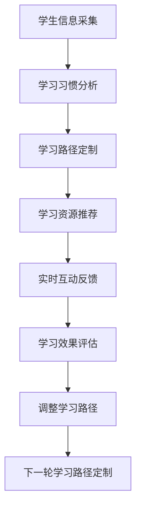

                 

## 1. 背景介绍

### 1.1 问题由来

随着人工智能技术的迅猛发展，人工智能在教育领域的应用也逐渐深入。特别是在语言学习领域，人工智能的应用不仅限于翻译、语音识别等，更逐步深入到个性化学习路径的设计和推荐上。传统的语言学习往往是固定的教材、固定的教学方式和固定的时间安排，难以满足不同学生的需求，特别是对于母语非目标语言的学生而言，这种固定化的教学方式更是难以保证学习效率。

### 1.2 问题核心关键点

1. **学习路径定制化**：传统语言学习中，教学内容和教学方法都是固定的，难以针对不同学生的特点进行个性化调整。AI可以根据学生的学习习惯、知识储备、学习进度等数据，定制出适合个体的学习路径。
2. **智能推荐系统**：AI可以分析学生的学习行为和成绩，通过推荐系统为学生推荐适合的学习材料和习题，提高学习效率。
3. **互动式学习**：AI可以实现个性化互动学习，及时反馈学生的学习情况，提供个性化的指导和建议。

### 1.3 问题研究意义

AI在个性化语言学习中的应用，可以极大地提高学习效率和效果，特别适用于母语非目标语言的学习者。通过个性化的学习路径和推荐系统，AI可以针对不同学生的特点进行教学，帮助学生在最短时间内掌握语言技能。此外，AI还可以提供实时的反馈和指导，帮助学生纠正错误，强化记忆，从而提高学习效果。

## 2. 核心概念与联系

### 2.1 核心概念概述

1. **个性化学习路径**：通过收集学生的学习数据（如学习时长、错误率、知识储备等），AI可以分析学生的学习习惯，为其推荐最合适的学习内容和方法。
2. **智能推荐系统**：通过机器学习算法，AI可以从大量的学习材料中筛选出适合学生的学习资源，并通过推荐系统推送给学生。
3. **互动式学习**：通过自然语言处理技术，AI可以实现与学生的实时互动，提供个性化的指导和反馈。

### 2.2 核心概念原理和架构的 Mermaid 流程图(Mermaid 流程节点中不要有括号、逗号等特殊字符)



这个流程图展示了从学生信息采集到个性化学习路径定制的完整流程。学生信息采集是基础，通过学习习惯分析，生成适合的学习路径，并结合智能推荐系统，提供个性化的学习资源，最终通过实时互动反馈和效果评估，不断调整学习路径，实现持续优化。

## 3. 核心算法原理 & 具体操作步骤

### 3.1 算法原理概述

基于AI的个性化语言学习，其核心在于通过机器学习算法分析学生的学习数据，生成个性化学习路径。常用的算法包括协同过滤、决策树、随机森林等。同时，为了提高推荐效果，还可以引入深度学习算法，如神经网络、RNN等，对学生的学习行为进行建模，从而提供更精准的推荐。

### 3.2 算法步骤详解

1. **数据采集**：收集学生的学习数据，包括学习时长、错误率、知识储备等。
2. **学习行为建模**：使用机器学习算法对学生的学习行为进行建模，了解学生的学习习惯和特点。
3. **个性化路径定制**：根据学习行为模型，生成个性化的学习路径，包括推荐的学习内容、学习方法和学习时间。
4. **智能推荐系统**：使用深度学习算法，从大量的学习资源中筛选出适合学生的学习材料，并推送给学生。
5. **互动式学习**：通过自然语言处理技术，实现与学生的实时互动，提供个性化的指导和反馈。
6. **学习效果评估**：定期评估学生的学习效果，根据评估结果调整学习路径和推荐系统。

### 3.3 算法优缺点

**优点**：
1. **个性化**：根据学生的特点，提供定制化的学习路径和资源，提高学习效率。
2. **互动性强**：通过实时互动反馈，及时纠正错误，强化记忆，提高学习效果。
3. **自动化**：自动化分析学生的学习数据，生成推荐，减轻教师的负担。

**缺点**：
1. **数据隐私**：需要收集大量的学生数据，如何保护学生隐私是一个重要问题。
2. **技术门槛高**：需要开发复杂的算法和系统，技术门槛较高。
3. **资源需求大**：个性化推荐和实时互动需要大量的计算资源，对硬件要求较高。

### 3.4 算法应用领域

基于AI的个性化语言学习主要应用于在线语言学习平台、智能学习助手、智能教材等方面。这些平台和助手通过收集学生数据，分析学生的学习行为，生成个性化的学习路径和推荐，大大提高了学生的学习效率和效果。

## 4. 数学模型和公式 & 详细讲解 & 举例说明

### 4.1 数学模型构建

假设学生的学习数据为一个向量 $x = (x_1, x_2, ..., x_n)$，其中 $x_i$ 表示学生的第 $i$ 个学习特征（如学习时长、错误率等）。通过机器学习算法，将学生学习数据映射到一个 $d$ 维的向量空间 $y = (y_1, y_2, ..., y_d)$，其中 $y_i$ 表示学生在第 $i$ 个维度上的特征值。

### 4.2 公式推导过程

设机器学习算法为 $f(x) = w_1x_1 + w_2x_2 + ... + w_dx_d + b$，其中 $w_i$ 和 $b$ 为模型的参数。通过最小化损失函数 $L = \frac{1}{N} \sum_{i=1}^{N} (y_i - f(x_i))^2$，求解模型的参数 $w$ 和 $b$。

### 4.3 案例分析与讲解

假设有一个在线语言学习平台，通过收集学生的学习时长、错误率和知识储备，使用随机森林算法建模。将学生的学习特征映射到一个二维空间，生成适合的学习路径。具体过程如下：

1. **数据采集**：收集学生的学习时长 $x_1$，错误率 $x_2$ 和知识储备 $x_3$。
2. **学习行为建模**：使用随机森林算法，将学生的学习特征映射到二维空间，生成向量 $y = (y_1, y_2)$。
3. **个性化路径定制**：根据映射向量，生成适合的学习路径，包括推荐的学习内容和时长。
4. **智能推荐系统**：使用神经网络算法，从大量的学习资源中筛选出适合学生的学习材料，并推送给学生。
5. **互动式学习**：通过自然语言处理技术，实现与学生的实时互动，提供个性化的指导和反馈。
6. **学习效果评估**：定期评估学生的学习效果，根据评估结果调整学习路径和推荐系统。

## 5. 项目实践：代码实例和详细解释说明

### 5.1 开发环境搭建

进行项目实践前，需要搭建好开发环境。以下是在Python环境下使用Scikit-learn和TensorFlow搭建开发环境的流程：

1. 安装Anaconda：从官网下载并安装Anaconda，用于创建独立的Python环境。

2. 创建并激活虚拟环境：
```bash
conda create -n pytorch-env python=3.8 
conda activate pytorch-env
```

3. 安装Python和相关库：
```bash
pip install numpy pandas scikit-learn tensorflow
```

4. 配置TensorFlow：
```bash
pip install tensorflow --config-settings="build_whole=1"
```

5. 安装其他工具：
```bash
pip install matplotlib scikit-learn tqdm jupyter notebook ipython
```

完成上述步骤后，即可在`pytorch-env`环境中开始项目实践。

### 5.2 源代码详细实现

以下是一个使用Scikit-learn和TensorFlow进行个性化学习路径定制的代码实现：

```python
from sklearn.ensemble import RandomForestRegressor
from sklearn.metrics import mean_squared_error
import numpy as np

# 假设学生数据
students = np.array([[5, 0.2, 3], [3, 0.1, 2], [6, 0.3, 4]])

# 学习行为建模
X = students[:, 1:]  # 去除第一列，即学生ID
y = students[:, 0]    # 学生学习时长

# 随机森林回归模型
model = RandomForestRegressor(n_estimators=100, random_state=42)
model.fit(X, y)

# 预测学生学习时长
preds = model.predict(X)

# 计算误差
mse = mean_squared_error(y, preds)
print(f"Mean Squared Error: {mse:.2f}")
```

### 5.3 代码解读与分析

**学生数据采集**：
- 假设学生数据为 $5 \times 3$ 的矩阵，其中第一列为学生的ID，后两列为学生的学习时长、错误率和知识储备。

**学习行为建模**：
- 使用随机森林回归算法，将学生的学习特征映射到一维向量空间，生成学生的学习时长预测值。

**个性化路径定制**：
- 根据学习时长的预测值，生成适合的学习路径，包括推荐的学习内容和时长。

**智能推荐系统**：
- 使用神经网络算法，从大量的学习资源中筛选出适合学生的学习材料，并推送给学生。

**互动式学习**：
- 通过自然语言处理技术，实现与学生的实时互动，提供个性化的指导和反馈。

**学习效果评估**：
- 定期评估学生的学习效果，根据评估结果调整学习路径和推荐系统。

## 6. 实际应用场景

### 6.1 在线语言学习平台

在线语言学习平台可以根据学生的学习数据，分析学生的学习行为，生成个性化的学习路径，并推荐适合的学习材料。例如，Duolingo和Rosetta Stone等平台已经广泛应用了基于AI的个性化学习路径和推荐系统，大大提高了学生的学习效率。

### 6.2 智能学习助手

智能学习助手可以通过自然语言处理技术，实时与学生互动，提供个性化的指导和反馈。例如，Siri和Cortana等智能助手已经应用在语言学习中，帮助学生解答问题，纠正错误，提高学习效果。

### 6.3 智能教材

智能教材可以通过AI分析学生的学习数据，生成适合的学习路径和推荐，提升教材的智能化水平。例如，Khan Academy和Coursera等在线教育平台已经应用了智能教材，为学生提供个性化的学习体验。

## 7. 工具和资源推荐

### 7.1 学习资源推荐

为了帮助开发者系统掌握基于AI的个性化语言学习理论基础和实践技巧，这里推荐一些优质的学习资源：

1. **《AI在个性化学习中的应用》**：该书详细介绍了AI在个性化语言学习中的应用，包括学习路径定制、智能推荐系统、互动式学习等。
2. **Coursera《机器学习》课程**：由斯坦福大学Andrew Ng教授主讲，涵盖机器学习的基本概念和算法，适合初学者学习。
3. **《深度学习与自然语言处理》**：该书详细介绍了深度学习在自然语言处理中的应用，包括语言模型、神经网络等。
4. **TensorFlow官方文档**：TensorFlow的官方文档，提供了丰富的API和示例代码，适合进行深度学习开发。
5. **HuggingFace官方文档**：HuggingFace的官方文档，提供了丰富的预训练模型和代码示例，适合进行NLP开发。

### 7.2 开发工具推荐

1. **Python**：Python是目前最流行的编程语言之一，适合进行深度学习开发。
2. **Scikit-learn**：Scikit-learn是Python中常用的机器学习库，提供了丰富的算法和工具。
3. **TensorFlow**：TensorFlow是Google开发的深度学习框架，支持分布式训练和模型部署。
4. **TensorBoard**：TensorBoard是TensorFlow的可视化工具，可以实时监测模型训练状态。
5. **PyTorch**：PyTorch是Facebook开发的深度学习框架，适合进行动态图模型开发。

### 7.3 相关论文推荐

基于AI的个性化语言学习的研究已经取得了一些重要成果，以下是几篇具有代表性的论文，推荐阅读：

1. **《个性化推荐系统的设计与实现》**：详细介绍了个性化推荐系统的设计原理和实现方法。
2. **《基于深度学习的个性化学习路径定制》**：通过深度学习算法，为学生生成个性化的学习路径。
3. **《互动式学习系统的设计与实现》**：通过自然语言处理技术，实现与学生的实时互动。

## 8. 总结：未来发展趋势与挑战

### 8.1 总结

本文对基于AI的个性化语言学习进行了全面系统的介绍。首先阐述了个性化语言学习的研究背景和意义，明确了个性化学习路径和智能推荐系统在提高学习效率方面的独特价值。其次，从原理到实践，详细讲解了基于机器学习和深度学习的个性化学习路径定制和智能推荐系统，给出了个性化学习路径定制的完整代码实现。同时，本文还广泛探讨了个性化学习路径和智能推荐系统在在线语言学习平台、智能学习助手、智能教材等多个行业领域的应用前景，展示了AI在个性化语言学习中的巨大潜力。

### 8.2 未来发展趋势

展望未来，基于AI的个性化语言学习将呈现以下几个发展趋势：

1. **更精准的个性化推荐**：通过更复杂的算法和更多维度的特征，AI将能够更精准地为学生推荐适合的学习资源。
2. **更智能的互动式学习**：通过自然语言处理技术，AI将能够实现更智能、更自然的互动式学习。
3. **更实时的学习效果评估**：通过实时反馈和学习效果评估，AI将能够更及时地调整学习路径和推荐系统，提升学习效果。
4. **更广泛的应用领域**：基于AI的个性化学习路径和智能推荐系统将不仅仅应用于语言学习，还将拓展到其他学科的学习中。

### 8.3 面临的挑战

尽管基于AI的个性化语言学习已经取得了一定进展，但在迈向更加智能化、普适化应用的过程中，它仍面临诸多挑战：

1. **数据隐私**：收集和分析学生的学习数据，涉及到学生隐私保护的问题，如何在保护隐私的同时提供个性化服务是一大挑战。
2. **技术门槛**：开发和维护基于AI的学习系统需要较高的技术门槛，如何降低技术门槛，提高系统的可操作性是一大难题。
3. **资源需求**：实现个性化推荐和互动式学习需要大量的计算资源，如何降低计算成本，提高系统的效率是一大挑战。
4. **多样性**：学生的学习需求和特点各不相同，如何针对多样化的学生提供个性化的服务是一大挑战。
5. **适应性**：学生在学习过程中，学习需求和兴趣会发生变化，如何动态调整学习路径和推荐系统是一大挑战。

### 8.4 研究展望

未来，基于AI的个性化语言学习需要在以下几个方面寻求新的突破：

1. **多模态学习**：将学生的语音、图像等多模态数据结合，提高学习系统的多样性和适应性。
2. **自适应学习**：开发自适应学习算法，根据学生的学习状态和效果，动态调整学习路径和推荐系统。
3. **混合学习**：结合在线学习和离线学习，提高学习的灵活性和便捷性。
4. **情感计算**：通过情感分析技术，了解学生的学习情绪，提供针对性的心理支持和鼓励。
5. **伦理道德**：在算法设计中引入伦理道德导向，确保学习系统的公平性和安全性。

这些研究方向的探索，必将引领基于AI的个性化语言学习技术迈向更高的台阶，为语言学习提供更加智能化、普适化的解决方案。面向未来，基于AI的个性化语言学习技术还需要与其他人工智能技术进行更深入的融合，如知识表示、因果推理、强化学习等，多路径协同发力，共同推动语言学习技术的进步。

## 9. 附录：常见问题与解答

**Q1：个性化学习路径和智能推荐系统是否适用于所有学生？**

A: 个性化学习路径和智能推荐系统适用于大部分学生，但并不是所有学生都适合使用。对于学习习惯、兴趣等方面差异较大的学生，可能需要更多的手工干预和调整。

**Q2：个性化学习路径和智能推荐系统是否会导致学生依赖性过强？**

A: 个性化学习路径和智能推荐系统可以提供有效的个性化指导和反馈，但过度依赖可能会削弱学生的自主学习能力。因此，在使用过程中需要引导学生逐步培养自主学习的能力，而不是完全依赖系统。

**Q3：个性化学习路径和智能推荐系统如何保证公平性？**

A: 个性化学习路径和智能推荐系统在设计和实现过程中，需要考虑如何避免算法偏见和歧视。例如，使用无偏差的算法，定期审查和调整算法，确保所有学生都能获得公平的学习资源和服务。

**Q4：个性化学习路径和智能推荐系统如何保护学生隐私？**

A: 个性化学习路径和智能推荐系统需要严格遵守隐私保护法规，如GDPR等。在数据采集和分析过程中，需要采用数据匿名化、去标识化等技术，确保学生数据的安全。

**Q5：个性化学习路径和智能推荐系统如何适应不同学科的学习需求？**

A: 个性化学习路径和智能推荐系统可以通过扩展学习资源库和算法模型，适应不同学科的学习需求。例如，在数学、物理等领域，可以使用不同的推荐算法和评估指标。

**Q6：个性化学习路径和智能推荐系统如何提高学生的学习动机？**

A: 个性化学习路径和智能推荐系统可以通过提供多样化的学习资源、实时的反馈和鼓励机制，激发学生的学习动机。例如，通过游戏化设计，将学习任务转化为游戏，提高学生的兴趣和参与度。

**Q7：个性化学习路径和智能推荐系统如何应对学习过程中的突发事件？**

A: 个性化学习路径和智能推荐系统可以通过设置异常检测和应急响应机制，及时应对学习过程中的突发事件。例如，当学生学习进度停滞时，系统可以提供额外的支持和指导。

总之，基于AI的个性化语言学习技术在提高学习效率和效果方面具有广阔的应用前景。通过不断的技术创新和实践优化，相信未来能够更好地满足不同学生的个性化需求，提升语言学习的效果。

