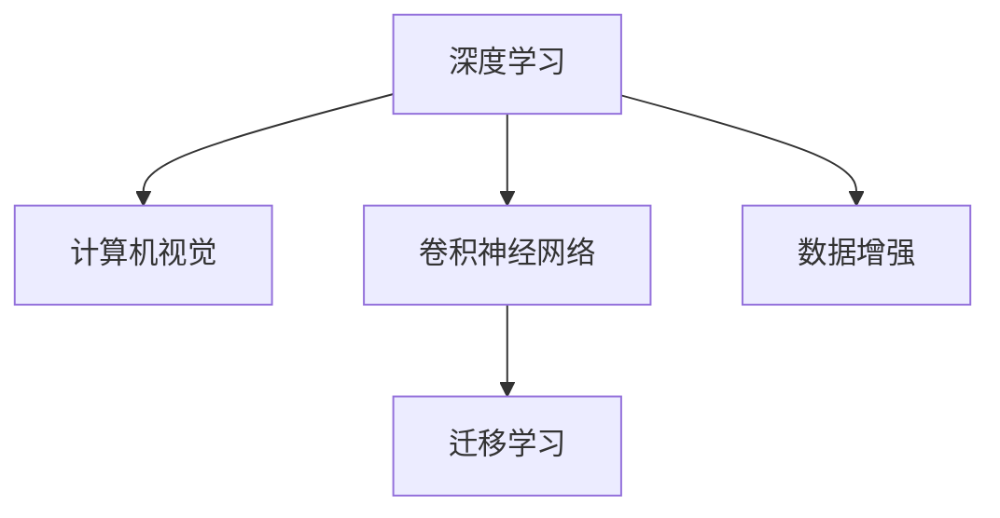

                 

## 1. 背景介绍

随着数字化技术的不断进步，越来越多的文化遗产得到了有效的保护和传承。然而，古籍作为人类历史和文化的瑰宝，由于时间流逝、环境破坏、人为损坏等多种原因，其物理状态不断恶化。传统的手工修复方法不仅耗时耗力，还面临着技艺失传的风险。在此背景下，AI技术被引入古籍修复领域，通过计算机视觉、深度学习等手段，大幅提高了修复的效率和精度，为古籍的保护和传承提供了新的思路。

### 1.1 问题由来

古籍修复工作具有复杂性和多样性的特点，传统的手工修复方法通常需要耗费大量时间和精力。每部古籍都具有独特的材质、结构、破损程度等特征，修复过程需要丰富的经验和技巧。然而，许多古籍修复技艺已经失传，古籍修复师也逐渐减少，传统修复工作面临巨大的挑战。

近年来，随着深度学习技术的发展，AI在图像识别、语音识别等领域取得了突破性进展。通过将AI技术应用到古籍修复领域，可以大大提高修复的效率和精度，同时还能保存修复师的经验和技艺，使其能够传承下去。

### 1.2 问题核心关键点

AI在古籍修复中的应用，主要是通过计算机视觉和深度学习技术，自动识别和分析古籍的破损情况，并提出修复建议。核心关键点包括：

- 数据收集：获取大量的古籍数字图像，并标注其破损情况和修复建议。
- 模型训练：基于标注数据训练深度学习模型，使其能够自动理解古籍破损的特征和修复方法。
- 应用部署：将训练好的模型部署到修复系统中，实现对古籍破损的自动识别和修复建议输出。

这些关键点共同构成了AI在古籍修复领域的基本框架，使得计算机能够通过深度学习技术，辅助古籍修复师进行高效精准的修复工作。

## 2. 核心概念与联系

### 2.1 核心概念概述

为了更好地理解AI在古籍修复中的应用，本节将介绍几个密切相关的核心概念：

- 深度学习(Deep Learning)：一种基于神经网络的机器学习技术，通过多层非线性变换，可以从原始数据中提取复杂的特征表示，用于分类、识别等任务。
- 计算机视觉(Computer Vision)：利用计算机技术模拟人类视觉系统的过程，实现图像的自动分析和识别。
- 卷积神经网络(Convolutional Neural Network, CNN)：一种特殊的神经网络结构，适合处理具有网格结构的数据，如图像和视频。
- 迁移学习(Transfer Learning)：将在一个任务上训练好的模型，应用于另一个相似的任务上，以提高新任务上的表现。
- 数据增强(Data Augmentation)：通过对训练数据进行一系列随机变换，生成更多的训练样本，以提高模型的泛化能力。

这些核心概念之间的逻辑关系可以通过以下Mermaid流程图来展示：



这个流程图展示了大语言模型的核心概念及其之间的关系：

1. 深度学习技术可以应用于计算机视觉领域，用于图像的自动识别和分析。
2. 卷积神经网络是计算机视觉中常用的模型结构，适合处理图像数据。
3. 迁移学习可以将预训练模型迁移到新任务上，提高模型性能。
4. 数据增强可以在不增加数据量的情况下，通过图像变换生成更多的训练样本。

这些概念共同构成了AI在古籍修复领域的技术基础，使得计算机能够通过深度学习技术，自动理解和分析古籍的破损情况，提出修复建议。

## 3. 核心算法原理 & 具体操作步骤

### 3.1 算法原理概述

AI在古籍修复中的应用，主要是基于计算机视觉和深度学习技术，自动识别和分析古籍的破损情况，并提出修复建议。其核心算法原理可以概括为以下几个步骤：

1. 数据收集：收集大量的古籍数字图像，并标注其破损情况和修复建议。
2. 模型训练：基于标注数据训练深度学习模型，使其能够自动理解古籍破损的特征和修复方法。
3. 应用部署：将训练好的模型部署到修复系统中，实现对古籍破损的自动识别和修复建议输出。

### 3.2 算法步骤详解

**Step 1: 数据收集**

数据收集是AI在古籍修复中至关重要的一步。需要收集大量的古籍数字图像，并对其进行破损情况的标注。标注内容可以包括：

- 破损类型：如撕裂、褪色、虫蛀等。
- 破损位置：如纸张边缘、字行之间、页面底部等。
- 修复建议：如使用何种材料、修复步骤、修复顺序等。

收集到的数据集可以包含多种类型的古籍图像，如古书籍、古文献、古碑帖等。为了提高模型的泛化能力，数据集应尽量覆盖不同类型的古籍和多种破损情况。

**Step 2: 模型训练**

基于收集到的数据集，选择适合的深度学习模型进行训练。常见的模型包括卷积神经网络(CNN)和循环神经网络(RNN)等。训练过程通常包括以下步骤：

1. 数据预处理：将原始图像数据转换为神经网络所需的输入格式，如缩放、裁剪、归一化等。
2. 模型定义：定义神经网络的结构，包括卷积层、池化层、全连接层等。
3. 训练过程：使用标注数据对模型进行训练，通过反向传播算法优化模型参数。
4. 验证和调参：在验证集上评估模型性能，调整超参数和网络结构，以提高模型精度。

训练过程中，可以使用迁移学习技术，将预训练模型迁移到新的任务上。预训练模型通常是在大规模图像数据集上训练得到的，可以提供良好的特征提取能力。

**Step 3: 应用部署**

训练好的模型可以部署到古籍修复系统中，实现对古籍破损的自动识别和修复建议输出。部署过程通常包括以下步骤：

1. 数据输入：将古籍图像输入到系统中，由模型自动分析其破损情况。
2. 结果输出：系统输出破损位置的类型和修复建议。
3. 交互验证：修复师根据输出结果进行验证，必要时进行调整。
4. 修复指导：根据验证后的结果，修复师可以进行精准的修复工作。

### 3.3 算法优缺点

AI在古籍修复中的应用，具有以下优点：

- 自动化：自动化识别和分析古籍破损情况，减少手工操作的耗时和人力成本。
- 高效性：利用深度学习技术，可以在较短时间内完成大规模的修复工作。
- 精度高：通过数据标注和模型训练，可以获得高精度的修复建议。
- 可扩展性：模型可以迁移到不同类型和不同时期的古籍修复任务中。

同时，该方法也存在一些局限性：

- 依赖数据：需要大量高质量的标注数据，数据收集和标注成本较高。
- 知识局限：模型仅能识别标注数据中的破损类型和位置，缺乏修复工艺的深度理解。
- 鲁棒性不足：对于未知的破损情况，模型的识别和修复建议可能不准确。
- 交互依赖：修复师仍需对模型的输出结果进行验证和调整，依赖人工交互。

尽管存在这些局限性，但AI在古籍修复中的应用，已经在一些实际案例中取得了显著的效果，为古籍保护和传承提供了新的思路和方法。

### 3.4 算法应用领域

AI在古籍修复中的应用，主要包括以下几个领域：

- 古书籍修复：利用AI技术自动识别和分析古书籍的破损情况，输出修复建议。
- 古文献修复：对古文献的破损位置和类型进行识别，提出修复方案。
- 古碑帖修复：识别古碑帖的破损和缺损部分，提出修复步骤和材料建议。
- 古印刷品修复：对古印刷品的破损进行识别和分类，输出修复工艺。

AI技术在古籍修复中的应用，不仅可以提高修复的效率和精度，还能保存修复师的经验和技艺，使其能够传承下去。

## 4. 数学模型和公式 & 详细讲解 & 举例说明

### 4.1 数学模型构建

AI在古籍修复中的应用，可以通过计算机视觉和深度学习技术，自动识别和分析古籍的破损情况。数学模型主要涉及以下步骤：

1. 数据表示：将古籍图像转换为神经网络所需的输入格式，如RGB图像、灰度图像等。
2. 特征提取：通过卷积神经网络等模型，提取图像中的关键特征。
3. 分类预测：将提取出的特征输入到分类器中，输出破损类型的预测结果。
4. 损失函数：定义损失函数，衡量模型预测结果与真实标签之间的差异。
5. 优化算法：使用梯度下降等优化算法，最小化损失函数。

### 4.2 公式推导过程

以卷积神经网络为例，其核心公式如下：

$$
y = h(x; \theta)
$$

其中，$x$ 表示输入的图像数据，$\theta$ 表示模型参数，$h$ 表示卷积神经网络的前向传播过程。假设输入图像的大小为 $H \times W \times C$，卷积层输出的特征图大小为 $D \times D \times F$，卷积核大小为 $k \times k$，步长为 $s$，填充大小为 $p$，则卷积操作可以表示为：

$$
y_{i,j} = \sum_{m,n} w_{m,n} x_{i-mp,j-np}
$$

其中，$w$ 表示卷积核权重，$x_{i-mp,j-np}$ 表示输入图像的局部区域。通过多个卷积层的叠加和池化层的降维，可以逐渐提取图像中的高层次特征。

### 4.3 案例分析与讲解

以古书籍修复为例，假设收集到了大量的古书籍图像，并对其破损情况进行了标注。下面以CNN为例，说明如何通过深度学习技术进行修复建议的输出。

**Step 1: 数据准备**

收集古书籍图像，并进行预处理。例如，将图像缩放到固定大小、归一化像素值等。同时，将破损情况标注为不同的类别，如撕裂、褪色、虫蛀等。

**Step 2: 模型训练**

使用卷积神经网络模型，对标注数据进行训练。例如，使用ResNet、VGG等经典模型，或基于PyTorch等框架自定义模型。在训练过程中，使用交叉熵等损失函数，通过梯度下降等优化算法，不断调整模型参数，以提高识别准确率。

**Step 3: 应用部署**

将训练好的模型部署到修复系统中，输入古籍图像，输出破损类型的预测结果。例如，模型可以输出撕裂、褪色、虫蛀等类别的概率，修复师根据预测结果进行验证和调整。

例如，一个古书籍图像经过CNN模型处理后，输出如下结果：

| 破损类型 | 概率 |
| --- | --- |
| 撕裂 | 0.8 |
| 褪色 | 0.2 |
| 虫蛀 | 0.01 |

修复师根据输出结果，对古籍进行相应的修复工作。

## 5. 项目实践：代码实例和详细解释说明

### 5.1 开发环境搭建

在进行古籍修复的AI实践前，我们需要准备好开发环境。以下是使用Python进行PyTorch开发的环境配置流程：

1. 安装Anaconda：从官网下载并安装Anaconda，用于创建独立的Python环境。

2. 创建并激活虚拟环境：
```bash
conda create -n pytorch-env python=3.8 
conda activate pytorch-env
```

3. 安装PyTorch：根据CUDA版本，从官网获取对应的安装命令。例如：
```bash
conda install pytorch torchvision torchaudio cudatoolkit=11.1 -c pytorch -c conda-forge
```

4. 安装TensorFlow：
```bash
conda install tensorflow -c conda-forge
```

5. 安装TensorBoard：
```bash
conda install tensorboard -c conda-forge
```

6. 安装Matplotlib和Numpy：
```bash
conda install matplotlib numpy
```

7. 安装Pillow库，用于图像处理：
```bash
pip install Pillow
```

完成上述步骤后，即可在`pytorch-env`环境中开始AI古籍修复的实践。

### 5.2 源代码详细实现

下面以古书籍修复为例，给出使用PyTorch实现的古书籍破损识别和修复建议输出的代码实现。

**数据处理**

首先，定义一个简单的数据处理函数，用于将图像数据转换为模型所需的格式：

```python
from PIL import Image
import numpy as np

def preprocess_image(image_path):
    img = Image.open(image_path).convert('RGB')
    img = img.resize((224, 224))
    img = np.array(img) / 255.0
    return img
```

**模型定义**

定义一个简单的卷积神经网络模型，用于古书籍破损的识别：

```python
import torch.nn as nn
import torch.nn.functional as F

class ConvNet(nn.Module):
    def __init__(self):
        super(ConvNet, self).__init__()
        self.conv1 = nn.Conv2d(3, 64, kernel_size=3, stride=1, padding=1)
        self.pool = nn.MaxPool2d(kernel_size=2, stride=2)
        self.conv2 = nn.Conv2d(64, 128, kernel_size=3, stride=1, padding=1)
        self.pool2 = nn.MaxPool2d(kernel_size=2, stride=2)
        self.fc1 = nn.Linear(128 * 7 * 7, 256)
        self.fc2 = nn.Linear(256, 3)  # 破损类型识别

    def forward(self, x):
        x = self.pool(F.relu(self.conv1(x)))
        x = self.pool2(F.relu(self.conv2(x)))
        x = x.view(-1, 128 * 7 * 7)
        x = F.relu(self.fc1(x))
        x = self.fc2(x)
        return x
```

**模型训练**

定义一个训练函数，对模型进行训练：

```python
import torch
import torch.optim as optim

def train(model, data_loader, device, epochs):
    model = model.to(device)
    optimizer = optim.Adam(model.parameters(), lr=0.001)
    criterion = nn.CrossEntropyLoss()
    for epoch in range(epochs):
        for images, labels in data_loader:
            images = images.to(device)
            labels = labels.to(device)
            optimizer.zero_grad()
            outputs = model(images)
            loss = criterion(outputs, labels)
            loss.backward()
            optimizer.step()
            if (epoch + 1) % 10 == 0:
                print(f'Epoch [{epoch+1}/{epochs}], Loss: {loss.item():.4f}')
```

**模型应用**

定义一个应用函数，将模型部署到修复系统中，输出修复建议：

```python
def predict(model, image_path):
    image = preprocess_image(image_path)
    image = image.unsqueeze(0).to(device)
    with torch.no_grad():
        outputs = model(image)
        _, predicted = torch.max(outputs, 1)
        return predicted.item()
```

### 5.3 代码解读与分析

让我们再详细解读一下关键代码的实现细节：

**数据处理函数**

`preprocess_image`函数将图像数据转换为模型所需的格式。首先，使用Pillow库打开图像，并将其转换为RGB格式。然后，将图像缩放到224x224的大小，归一化像素值，最后转换为NumPy数组，准备输入到神经网络中。

**模型定义**

`ConvNet`类定义了一个简单的卷积神经网络模型。模型由两个卷积层、两个池化层和两个全连接层组成。卷积层用于提取图像特征，池化层用于降维，全连接层用于分类。

**模型训练函数**

`train`函数定义了一个基本的训练过程。首先，将模型和数据加载器移动到GPU上。然后，定义优化器和损失函数。在每个epoch中，遍历数据集，计算损失函数，反向传播更新模型参数，并输出训练过程中的损失值。

**模型应用函数**

`predict`函数定义了一个简单的应用过程。首先将图像数据转换为模型所需的格式，然后将其输入到模型中进行前向传播，输出预测结果。由于预测结果为类别概率，因此选择概率最大的类别作为预测结果。

**实际应用**

在实际应用中，可以根据需要调整模型结构、优化器和学习率等超参数，以达到更好的效果。例如，可以添加Dropout层以减少过拟合，使用Batch Normalization层以加速训练等。

## 6. 实际应用场景

### 6.1 智能图书馆

AI在古籍修复中的应用，可以在智能图书馆系统中发挥重要作用。图书馆可以通过扫描古籍，自动检测其破损情况，并生成修复建议。图书馆管理员可以根据建议进行修复，或者将修复任务委托给专业的修复师。

**场景描述**

一个智能图书馆收集了大量的古籍，通过AI系统自动检测和识别破损情况。当图书馆管理员扫描某部古籍时，系统自动检测其破损位置，并输出修复建议。管理员可以根据建议进行修复，或者将任务委托给专业的修复师。修复完成后，图书馆管理员可以对修复效果进行评估，并反馈到系统中，进一步优化模型的性能。

**技术实现**

智能图书馆系统可以通过AI技术，实现对古籍破损的自动检测和修复建议输出。系统主要由以下模块组成：

1. 图像扫描模块：将古籍扫描成高分辨率的图像，并保存到数据库中。
2. 破损检测模块：通过AI模型对扫描图像进行破损检测，输出破损位置和类型。
3. 修复建议模块：根据破损检测结果，生成修复建议，包括修复工艺、材料、步骤等。
4. 人工审核模块：管理员可以对修复建议进行审核和调整，并将修复结果反馈到系统中。
5. 模型优化模块：根据管理员的反馈，优化AI模型，提高其识别和修复建议的准确性。

通过AI技术，智能图书馆系统可以大幅提高古籍修复的效率和精度，同时保存修复师的经验和技艺，使其能够传承下去。

### 6.2 数字化档案馆

AI在古籍修复中的应用，也可以在数字化档案馆中发挥重要作用。档案馆可以通过AI系统自动检测和修复数字化古籍，保障其长期保存和利用。

**场景描述**

一个数字化档案馆收集了大量的古籍数字化副本，通过AI系统自动检测和修复破损情况。当档案管理员扫描某部古籍时，系统自动检测其破损位置，并输出修复建议。管理员可以根据建议进行修复，或者将任务委托给专业的修复师。修复完成后，管理员可以对修复效果进行评估，并反馈到系统中，进一步优化模型的性能。

**技术实现**

数字化档案馆系统可以通过AI技术，实现对数字化古籍的自动检测和修复建议输出。系统主要由以下模块组成：

1. 数字扫描模块：将古籍数字化副本扫描成高分辨率的图像，并保存到数据库中。
2. 破损检测模块：通过AI模型对扫描图像进行破损检测，输出破损位置和类型。
3. 修复建议模块：根据破损检测结果，生成修复建议，包括修复工艺、材料、步骤等。
4. 人工审核模块：管理员可以对修复建议进行审核和调整，并将修复结果反馈到系统中。
5. 模型优化模块：根据管理员的反馈，优化AI模型，提高其识别和修复建议的准确性。

通过AI技术，数字化档案馆系统可以大幅提高古籍修复的效率和精度，同时保存修复师的经验和技艺，使其能够传承下去。

### 6.3 文化遗产保护

AI在古籍修复中的应用，还可以拓展到文化遗产保护领域，为保护和传承文化遗产提供新的思路和方法。

**场景描述**

一个文化遗产保护组织收集了大量的古籍，通过AI系统自动检测和修复破损情况。当保护组织发现某部古籍破损严重时，系统自动检测其破损位置，并输出修复建议。保护组织可以根据建议进行修复，或者将任务委托给专业的修复师。修复完成后，保护组织可以对修复效果进行评估，并反馈到系统中，进一步优化模型的性能。

**技术实现**

文化遗产保护系统可以通过AI技术，实现对古籍破损的自动检测和修复建议输出。系统主要由以下模块组成：

1. 古籍收集模块：收集大量的古籍，并将其数字化。
2. 破损检测模块：通过AI模型对扫描图像进行破损检测，输出破损位置和类型。
3. 修复建议模块：根据破损检测结果，生成修复建议，包括修复工艺、材料、步骤等。
4. 人工审核模块：修复师可以对修复建议进行审核和调整，并将修复结果反馈到系统中。
5. 模型优化模块：根据修复师的反馈，优化AI模型，提高其识别和修复建议的准确性。

通过AI技术，文化遗产保护系统可以大幅提高古籍修复的效率和精度，同时保存修复师的经验和技艺，使其能够传承下去。

## 7. 工具和资源推荐

### 7.1 学习资源推荐

为了帮助开发者系统掌握AI在古籍修复中的应用，这里推荐一些优质的学习资源：

1. 《深度学习》书籍：由Ian Goodfellow等著，深入浅出地介绍了深度学习的基本原理和实践技巧。
2. 《计算机视觉：算法与应用》书籍：由Richard Szeliski著，全面介绍了计算机视觉的基本概念和技术。
3. CS231n《计算机视觉：深度学习》课程：斯坦福大学开设的计算机视觉课程，提供丰富的视频和作业资源。
4. 《PyTorch深度学习实践》书籍：由何恺明等著，详细介绍了PyTorch框架的使用方法和实践案例。
5. TensorFlow官方文档：TensorFlow的官方文档，提供了丰富的API和教程资源。

通过对这些资源的学习实践，相信你一定能够快速掌握AI在古籍修复中的应用，并用于解决实际的NLP问题。

### 7.2 开发工具推荐

高效的开发离不开优秀的工具支持。以下是几款用于AI古籍修复开发的常用工具：

1. PyTorch：基于Python的开源深度学习框架，灵活动态的计算图，适合快速迭代研究。
2. TensorFlow：由Google主导开发的开源深度学习框架，生产部署方便，适合大规模工程应用。
3. TensorBoard：TensorFlow配套的可视化工具，可实时监测模型训练状态，并提供丰富的图表呈现方式。
4. Matplotlib：用于绘制图像和图表，方便可视化分析和调试。
5. Pillow：Python图像处理库，可以用于图像增强和预处理。

合理利用这些工具，可以显著提升AI古籍修复任务的开发效率，加快创新迭代的步伐。

### 7.3 相关论文推荐

AI在古籍修复中的应用，得益于学界的持续研究。以下是几篇奠基性的相关论文，推荐阅读：

1. "Deep Learning for Cultural Heritage Image Restoration"：由Gil Levi等著，介绍了深度学习在文化遗产修复中的应用。
2. "A Survey on Deep Learning Approaches for Heritage Image Restoration"：由Aimee Shahriari等著，综述了深度学习在文化遗产修复中的研究进展。
3. "Computer Vision and Deep Learning for Heritage Conservation"：由Arie Kahila等著，综述了计算机视觉和深度学习在文化遗产保护中的应用。
4. "Image Restoration Using Deep Learning"：由Cormac Treanor等著，介绍了深度学习在图像修复中的基本原理和实践方法。

这些论文代表了大语言模型微调技术的发展脉络。通过学习这些前沿成果，可以帮助研究者把握学科前进方向，激发更多的创新灵感。

## 8. 总结：未来发展趋势与挑战

### 8.1 总结

本文对AI在古籍修复中的应用进行了全面系统的介绍。首先，阐述了AI技术在古籍修复中的重要性和应用背景，明确了AI技术在古籍保护和传承中的独特价值。其次，从原理到实践，详细讲解了AI在古籍修复中的核心算法和操作步骤，给出了完整的代码实例和详细解释说明。同时，本文还广泛探讨了AI技术在智能图书馆、数字化档案馆、文化遗产保护等实际应用场景中的应用前景，展示了AI技术在古籍修复领域的巨大潜力。

通过本文的系统梳理，可以看到，AI技术在古籍修复中的应用，正在改变传统修复方法，为古籍保护和传承提供新的思路和方法。未来，随着深度学习技术和计算机视觉技术的不断发展，AI在古籍修复领域的应用将更加广泛和深入。

### 8.2 未来发展趋势

展望未来，AI在古籍修复中的应用将呈现以下几个发展趋势：

1. 深度学习模型的进步：深度学习模型将不断进步，识别精度和修复建议的准确性将不断提高。
2. 多模态信息融合：AI技术将与图像、声音、文本等多模态信息融合，提供更加全面和准确的修复建议。
3. 知识图谱的应用：AI技术将与知识图谱等知识表示方法结合，提供更加全面和深入的修复建议。
4. 自监督学习的应用：AI技术将利用自监督学习，在不依赖标注数据的情况下，实现更加高效和泛化的修复建议。
5. 人机交互的改进：AI技术将进一步提高人机交互的友好性和便捷性，提升修复师的工作体验。
6. 跨领域应用：AI技术将拓展到更多领域，如古物修复、古建筑保护等，为文化遗产保护提供更多的解决方案。

以上趋势凸显了AI在古籍修复领域的应用前景。这些方向的探索发展，必将进一步提升AI技术在古籍修复中的效果和效率，为古籍保护和传承提供更可靠的技术支撑。

### 8.3 面临的挑战

尽管AI在古籍修复中的应用取得了显著进展，但在迈向更加智能化、普适化应用的过程中，它仍面临着诸多挑战：

1. 数据质量问题：古籍数字图像的质量参差不齐，可能影响AI模型的训练和识别效果。
2. 知识获取问题：AI模型需要大量高质量的标注数据和修复知识，这些数据的获取成本较高。
3. 技术瓶颈问题：当前AI技术在处理复杂破损情况和精细修复工艺时，仍存在一定的局限性。
4. 伦理和法律问题：古籍修复中的AI技术需要考虑版权、隐私等问题，避免侵犯用户权益。
5. 人机协作问题：AI技术虽然可以大幅提高修复效率，但仍需要修复师进行审核和调整，人机协作仍需改进。

尽管存在这些挑战，但AI技术在古籍修复中的应用前景广阔，前景值得期待。

### 8.4 研究展望

面向未来，AI在古籍修复中的应用，需要在以下几个方面进行深入研究：

1. 高质量数据集：收集高质量的古籍数字图像，并对其进行标注，以提高AI模型的训练效果。
2. 深度学习模型：研究和开发更高效的深度学习模型，提高AI模型的识别精度和修复建议的准确性。
3. 知识融合技术：将AI技术与人文知识、历史知识等相结合，提供更加全面和深入的修复建议。
4. 自监督学习：研究和开发利用无标注数据进行训练的AI模型，降低对标注数据的依赖。
5. 跨领域应用：拓展AI技术在古物修复、古建筑保护等领域的应用，推动文化遗产保护的整体进步。
6. 人机协作：研究和开发更友好的人机交互界面，提升修复师的工作体验，优化人机协作流程。

这些研究方向将推动AI技术在古籍修复中的进步，为古籍保护和传承提供更加可靠和高效的技术方案。

## 9. 附录：常见问题与解答

**Q1：AI在古籍修复中的应用，需要哪些数据？**

A: AI在古籍修复中的应用，需要大量的古籍数字图像数据。这些数据可以来自图书馆、档案馆、文化遗产保护机构等。同时，还需要对这些图像进行标注，标注内容包括破损类型、位置、修复建议等。高质量的数据集是AI模型训练和识别的基础。

**Q2：AI在古籍修复中的应用，如何处理古籍图像？**

A: AI在古籍修复中的应用，需要对古籍图像进行预处理。预处理过程包括图像缩放、归一化、灰度化等。同时，还可以对图像进行增强处理，如随机裁剪、旋转、缩放等，以提高模型的泛化能力。预处理后的图像数据可以输入到神经网络中进行训练和识别。

**Q3：AI在古籍修复中的应用，如何选择合适的模型？**

A: AI在古籍修复中的应用，通常选择合适的卷积神经网络模型进行训练。常见的模型包括ResNet、VGG、Inception等。模型的选择应该考虑修复任务的特点，如破损类型、大小、复杂度等。同时，还需要考虑模型的计算效率和可解释性，以确保模型的实用性。

**Q4：AI在古籍修复中的应用，如何优化模型？**

A: AI在古籍修复中的应用，可以通过以下方式优化模型：
1. 数据增强：对图像数据进行随机变换，生成更多的训练样本，以提高模型的泛化能力。
2. 正则化：使用L2正则、Dropout等技术，避免过拟合，提高模型的鲁棒性。
3. 迁移学习：利用预训练模型进行迁移学习，提高新任务上的表现。
4. 模型融合：将多个模型进行融合，提高整体的识别精度和鲁棒性。
5. 超参数调优：调整学习率、批大小、优化器等超参数，以提高模型的训练效果。

**Q5：AI在古籍修复中的应用，如何评估模型效果？**

A: AI在古籍修复中的应用，通常使用准确率、召回率、F1分数等指标评估模型效果。在训练过程中，可以使用验证集评估模型的性能，调整超参数。在测试过程中，可以使用测试集评估模型的泛化能力，评估模型的实际效果。同时，还可以使用混淆矩阵、ROC曲线等可视化工具，直观地展示模型的识别效果。

通过以上问题的解答，相信你对AI在古籍修复中的应用有了更深入的理解。AI技术在古籍修复中的应用前景广阔，未来将为古籍保护和传承提供更加可靠和高效的技术方案。

