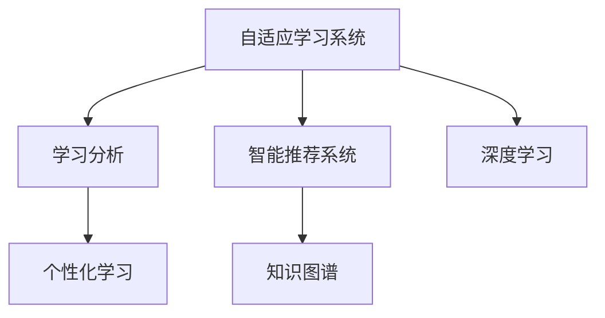

                 

# AI在教育领域的应用：个性化学习

> 关键词：人工智能,教育技术,个性化学习,自适应学习,学习分析,智能推荐系统

## 1. 背景介绍

### 1.1 问题由来
随着信息化和互联网技术的不断进步，教育领域正经历着一场深刻的变革。传统的“一刀切”式教育模式，难以满足不同学生的多样化学习需求，导致教学效果参差不齐。如何通过技术手段，实现因材施教，提升教育质量，已成为教育技术工作者关注的焦点。

### 1.2 问题核心关键点
个性化学习是一种以学生为中心的学习方式，旨在通过个性化推荐和自适应学习技术，提升学习效果，实现学生能力的最大化发展。其核心关键点包括：

- **学习分析**：通过对学生学习行为和成绩数据的分析，识别出学生的学习特点、难点和偏好。
- **自适应学习**：根据学生的学习进度和理解能力，动态调整学习内容和难度，优化学习体验。
- **智能推荐系统**：基于学生历史学习数据和实时反馈，生成个性化的学习资源和任务，提高学习效率。

### 1.3 问题研究意义
个性化学习通过技术手段，使得教育资源能够精准匹配学生需求，极大提升了学习效果和效率。具体来说，个性化学习的意义包括：

1. **因材施教**：根据每个学生的特点和需求，量身定制学习方案，提高学习兴趣和效果。
2. **提升公平性**：通过个性化推荐系统，确保每个学生都能接触到适合自己的学习资源，缩小学习差距。
3. **优化资源利用**：自适应学习系统能够动态调整学习内容和难度，有效利用学习资源，减少浪费。
4. **促进教育创新**：个性化学习推动了教育技术和教学方法的创新，为教育产业带来新的增长点。

## 2. 核心概念与联系

### 2.1 核心概念概述

为更好地理解个性化学习的应用，本节将介绍几个密切相关的核心概念：

- **自适应学习系统**：通过学习分析技术，动态调整教学内容和难度，适应学生学习节奏和能力的一种智能教学系统。
- **智能推荐系统**：基于机器学习算法，根据用户历史行为和偏好，自动推荐相关内容或商品的系统。
- **学习分析**：通过对学生学习行为、成绩和反馈数据的分析，提取有价值的信息，以指导教学和个性化学习。
- **知识图谱**：一种结构化的知识表示方式，通过图结构描述实体、属性和关系，用于辅助知识管理和推荐。
- **深度学习**：一种基于人工神经网络的机器学习范式，通过多层次网络结构，对复杂数据进行学习和推理。

这些核心概念之间的逻辑关系可以通过以下Mermaid流程图来展示：



这个流程图展示了个性化学习的核心概念及其之间的关系：

1. 自适应学习系统通过学习分析技术，动态调整教学内容和难度，适应学生学习节奏和能力。
2. 智能推荐系统基于学习分析结果，推荐个性化学习资源和任务。
3. 深度学习用于处理复杂数据，提取学生学习行为特征，提升自适应学习系统的准确性。
4. 知识图谱提供结构化的知识表示，辅助推荐系统生成推荐结果。
5. 个性化学习将上述技术融合，实现学习过程的全面优化。

## 3. 核心算法原理 & 具体操作步骤
### 3.1 算法原理概述

个性化学习系统通过结合学习分析、自适应学习、智能推荐和深度学习等技术，实现学生的个性化学习路径。其核心算法原理包括以下几个方面：

- **学习分析**：通过对学生学习行为和成绩数据的分析，提取学生学习特征，识别学生的学习偏好和难点。
- **自适应学习**：根据学生的学习进度和理解能力，动态调整学习内容和难度，适应学生学习节奏和能力。
- **智能推荐系统**：基于学生历史学习数据和实时反馈，生成个性化的学习资源和任务，提高学习效率。
- **深度学习**：通过多层网络结构，对学生学习行为数据进行特征提取和建模，提升学习分析的准确性。

### 3.2 算法步骤详解

个性化学习系统的构建一般包括以下几个关键步骤：

**Step 1: 数据收集与处理**

- 收集学生的学习行为数据、成绩数据和反馈数据。
- 对数据进行清洗、标注和标准化处理，为后续分析准备数据。

**Step 2: 学习特征提取**

- 使用深度学习模型，对学生学习行为数据进行特征提取，生成高维特征向量。
- 结合领域专家知识，对特征向量进行解释和理解，形成可解释的学习特征。

**Step 3: 学习分析与建模**

- 构建学生学习模型，如学生能力模型、学习进度模型等。
- 通过学习分析，识别学生的学习偏好、难点和能力水平。

**Step 4: 自适应学习**

- 根据学生学习模型，动态调整学习内容和难度。
- 引入自适应学习算法，如模型预测、自调整算法等，生成个性化学习路径。

**Step 5: 智能推荐**

- 构建个性化推荐模型，如协同过滤、基于内容的推荐等。
- 结合学习分析结果，生成个性化的学习资源和任务。

**Step 6: 系统集成与部署**

- 将学习分析、自适应学习、智能推荐系统等模块集成到统一的学习平台中。
- 部署学习平台，提供学生和教师端的学习应用。

### 3.3 算法优缺点

个性化学习系统的优势包括：

- **高效性**：通过自动化分析和推荐，节省了大量人力和时间成本。
- **精准性**：结合学习分析和深度学习技术，生成的个性化学习方案更加符合学生需求。
- **可扩展性**：基于模块化设计，易于扩展和集成新的学习模块和功能。

同时，个性化学习系统也存在一些局限性：

- **数据依赖性强**：系统的准确性和效果高度依赖于高质量的数据。
- **计算资源消耗高**：深度学习和机器学习模型需要大量的计算资源。
- **模型复杂度高**：复杂的推荐模型和自适应算法可能难以理解和调试。
- **隐私和安全风险**：学生的学习数据和隐私需要严格保护，避免泄露和滥用。

### 3.4 算法应用领域

个性化学习技术在教育领域的应用范围非常广泛，涵盖各个教育阶段和学科领域。以下是几个典型的应用场景：

- **基础教育**：针对中小学生的数学、语文、英语等学科，通过自适应学习系统进行个性化辅导。
- **高等教育**：针对大学生、研究生等高年级学生，通过自适应学习系统进行科研项目、论文写作等深度学习。
- **职业培训**：针对成人教育和职业培训，通过智能推荐系统提供个性化课程和资源。
- **在线教育**：针对远程教育用户，通过自适应学习系统提供个性化学习路径和任务。

## 4. 数学模型和公式 & 详细讲解 & 举例说明

### 4.1 数学模型构建

个性化学习系统的数学模型包括学生学习特征的提取、学习分析和建模、自适应学习和智能推荐等多个模块。

假设学生的学习行为数据为 $D=\{x_i\}_{i=1}^N$，其中 $x_i$ 为第 $i$ 个学生的学习行为向量。学生学习模型为 $M=\{f_k\}_{k=1}^K$，其中 $f_k$ 为第 $k$ 个学习特征，$K$ 为特征总数。

定义学生学习进度模型为 $L=\{l_k\}_{k=1}^K$，其中 $l_k$ 为第 $k$ 个特征的学习进度。定义学生能力模型为 $C=\{c_k\}_{k=1}^K$，其中 $c_k$ 为第 $k$ 个特征的学生能力。

学生学习模型 $M$ 的学习进度 $L$ 和能力 $C$ 可以通过深度学习模型进行训练和预测。

### 4.2 公式推导过程

以学生学习进度模型 $L$ 的推导为例，使用多层感知器(MLP)模型，对学习行为数据 $D$ 进行回归预测。

设 $x_i$ 为学生学习行为向量，$l_k$ 为第 $k$ 个学习进度，模型 $f_k(x)$ 为第 $k$ 个特征的回归模型，则有：

$$
l_k = f_k(x_i; \theta_k) = W_k \cdot x_i + b_k
$$

其中 $\theta_k$ 为模型参数，$W_k$ 和 $b_k$ 分别为模型权重和偏置。模型 $f_k(x)$ 的预测误差为：

$$
E_k = \frac{1}{N} \sum_{i=1}^N (l_k - f_k(x_i))^2
$$

通过最小化预测误差 $E_k$，可以训练得到最优的模型参数 $\theta_k$。

### 4.3 案例分析与讲解

假设某在线教育平台使用基于深度学习的个性化学习系统，具体实现如下：

- **学习行为数据**：收集学生在平台上观看视频、做练习、阅读文章等行为数据，生成学习行为向量 $x_i$。
- **学习进度模型**：使用多层感知器模型对学习行为数据进行回归预测，生成学生学习进度 $l_k$。
- **学生能力模型**：通过分析学生的测试成绩和作业反馈，使用逻辑回归模型对学生的知识掌握情况进行评估，生成学生能力 $c_k$。
- **自适应学习**：根据学习进度模型和能力模型，生成个性化的学习路径和任务，适应学生的学习节奏和能力。
- **智能推荐**：结合学习进度和能力，生成个性化的视频、文章、习题等学习资源，提高学习效率。

## 5. 项目实践：代码实例和详细解释说明
### 5.1 开发环境搭建

在进行个性化学习系统的开发前，我们需要准备好开发环境。以下是使用Python进行TensorFlow开发的环境配置流程：

1. 安装Anaconda：从官网下载并安装Anaconda，用于创建独立的Python环境。

2. 创建并激活虚拟环境：
```bash
conda create -n pytorch-env python=3.8 
conda activate pytorch-env
```

3. 安装TensorFlow：根据CUDA版本，从官网获取对应的安装命令。例如：
```bash
conda install tensorflow tensorflow-gpu=cuda11.1 -c pytorch -c conda-forge
```

4. 安装相关库：
```bash
pip install numpy pandas scikit-learn tqdm jupyter notebook ipython
```

完成上述步骤后，即可在`pytorch-env`环境中开始个性化学习系统的开发。

### 5.2 源代码详细实现

下面以在线教育平台为例，给出使用TensorFlow实现个性化学习系统的PyTorch代码实现。

首先，定义学习行为数据处理函数：

```python
import tensorflow as tf

def preprocess_data(data):
    # 对数据进行清洗和标准化处理
    return tf.data.Dataset.from_tensor_slices(data)
```

然后，定义学生学习进度模型和能力模型的TensorFlow实现：

```python
class LearningModel(tf.keras.Model):
    def __init__(self, input_dim, output_dim):
        super().__init__()
        self.layers = tf.keras.Sequential([
            tf.keras.layers.Dense(128, activation='relu'),
            tf.keras.layers.Dense(output_dim)
        ])
    
    def call(self, inputs):
        return self.layers(inputs)

# 定义学习进度模型
learning_model = LearningModel(input_dim=10, output_dim=K)

# 定义学生能力模型
capacity_model = tf.keras.Sequential([
    tf.keras.layers.Dense(64, activation='relu'),
    tf.keras.layers.Dense(1, activation='sigmoid')
])

# 定义自适应学习系统
def adaptive_learning(student_info):
    # 使用学习进度模型和能力模型，生成个性化学习路径和任务
    return learning_path, learning_task

# 定义智能推荐系统
def intelligent_recommendation(student_info):
    # 结合学习进度和能力，生成个性化的学习资源和任务
    return recommended_resources
```

最后，启动学习系统流程：

```python
from IPython.display import display

# 获取学生信息
student_info = get_student_info()

# 调用自适应学习系统和智能推荐系统
learning_path, learning_task = adaptive_learning(student_info)
recommended_resources = intelligent_recommendation(student_info)

# 在UI中显示个性化学习路径和资源
display(learning_path)
display(recommended_resources)
```

以上就是使用TensorFlow对个性化学习系统进行开发的完整代码实现。可以看到，TensorFlow提供了丰富的机器学习库，使得模型的构建和训练过程更加高效便捷。

### 5.3 代码解读与分析

让我们再详细解读一下关键代码的实现细节：

**preprocess_data函数**：
- 用于对原始数据进行清洗和标准化处理，生成可用于模型的学习行为向量。

**LearningModel类**：
- 定义了多层感知器模型的结构和参数，用于对学生学习行为数据进行回归预测，生成学习进度和能力。

**adaptive_learning函数**：
- 结合学生学习进度和能力，生成个性化的学习路径和任务，具体实现可根据实际需求进行设计。

**intelligent_recommendation函数**：
- 结合学习进度和能力，生成个性化的学习资源和任务，具体实现可根据实际需求进行设计。

**学习系统流程**：
- 获取学生信息，调用自适应学习系统和智能推荐系统，在UI中显示个性化学习路径和资源。

可以看出，TensorFlow的灵活性和易用性，使得个性化学习系统的开发更加高效便捷。

## 6. 实际应用场景
### 6.1 智慧课堂

基于个性化学习系统的智慧课堂，可以为每位学生提供定制化的学习方案，提升课堂教学效果。教师可以根据系统推荐的学习路径和资源，有针对性地进行课堂讲解和互动，帮助学生更好地掌握知识。

在技术实现上，可以收集学生在课堂上的互动数据、作业成绩和反馈数据，输入到个性化学习系统中，生成个性化学习路径和任务，供学生自主学习和练习。同时，系统可以实时监测学生的学习进度和理解情况，及时调整教学内容和难度，确保每个学生都能在适合自己的节奏下学习。

### 6.2 在线教育

在线教育平台可以广泛应用个性化学习系统，为每个学生提供个性化学习路径和资源，提升学习效果和效率。

在技术实现上，平台可以收集学生的在线学习数据，包括观看视频时长、做题情况、阅读文章等行为数据，输入到个性化学习系统中，生成个性化的学习路径和任务。系统可以实时监测学生的学习进度和理解情况，及时调整教学内容和难度，确保每个学生都能在适合自己的节奏下学习。

### 6.3 职业培训

职业培训中心可以应用个性化学习系统，为学员提供个性化的课程和资源，提高培训效果和职业竞争力。

在技术实现上，培训中心可以收集学员的学习数据，包括视频观看情况、练习记录和反馈等，输入到个性化学习系统中，生成个性化的学习路径和任务。系统可以实时监测学员的学习进度和理解情况，及时调整课程内容和难度，确保每个学员都能在适合自己的节奏下学习。

### 6.4 未来应用展望

随着技术的不断进步，个性化学习系统将在更多领域得到应用，为教育和学习带来新的突破：

1. **智能辅导**：结合自适应学习系统和智能推荐系统，为每个学生提供个性化的辅导和答疑，提升学习效果。
2. **虚拟课堂**：通过虚拟现实技术，构建沉浸式学习环境，提供更加丰富和生动的网络学习体验。
3. **自适应教材**：根据学生的学习进度和理解情况，动态调整教材内容和难度，适应学生的学习节奏。
4. **远程协作**：通过在线协作工具，实现学生和教师之间的互动和合作，提升远程教育的互动性和参与度。
5. **社会化学习**：通过社区和论坛等形式，实现学生之间的交流和互助，提高学习效果和兴趣。

这些应用的实现，将极大地推动教育技术的发展，为构建更加公平、高效、灵活的教育体系提供有力支持。相信随着技术的日益成熟，个性化学习系统必将在教育领域发挥更大的作用，为人类智慧的传承和发展注入新的活力。

## 7. 工具和资源推荐
### 7.1 学习资源推荐

为了帮助开发者系统掌握个性化学习技术的理论基础和实践技巧，这里推荐一些优质的学习资源：

1. 《深度学习与教育技术》系列博文：由深度学习专家撰写，全面介绍了深度学习在教育领域的应用。

2. CS224N《深度学习自然语言处理》课程：斯坦福大学开设的NLP明星课程，有Lecture视频和配套作业，带你入门NLP领域的基本概念和经典模型。

3. 《教育数据分析与机器学习》书籍：全面介绍了如何利用机器学习技术，分析教育数据，提升教育质量。

4. Kaggle教育数据集：包含丰富的教育领域数据集，供开发者练习和研究。

通过对这些资源的学习实践，相信你一定能够快速掌握个性化学习技术的精髓，并用于解决实际的NLP问题。

### 7.2 开发工具推荐

高效的开发离不开优秀的工具支持。以下是几款用于个性化学习系统开发的常用工具：

1. TensorFlow：基于Python的开源深度学习框架，灵活动态的计算图，适合快速迭代研究。

2. PyTorch：基于Python的开源深度学习框架，易于使用，支持动态图和静态图。

3. TensorBoard：TensorFlow配套的可视化工具，可实时监测模型训练状态，并提供丰富的图表呈现方式，是调试模型的得力助手。

4. Weights & Biases：模型训练的实验跟踪工具，可以记录和可视化模型训练过程中的各项指标，方便对比和调优。

5. Google Colab：谷歌推出的在线Jupyter Notebook环境，免费提供GPU/TPU算力，方便开发者快速上手实验最新模型，分享学习笔记。

合理利用这些工具，可以显著提升个性化学习系统的开发效率，加快创新迭代的步伐。

### 7.3 相关论文推荐

个性化学习技术的发展源于学界的持续研究。以下是几篇奠基性的相关论文，推荐阅读：

1. Learning to Recommend: A Factorization Approach: 提出基于矩阵分解的协同过滤算法，用于个性化推荐系统的构建。

2. Deep Learning in Education: A Survey and Meta-analysis of Research: 全面综述了深度学习在教育领域的应用，提供了丰富的数据和案例分析。

3. Adaptive Learning: A Survey: 综述了自适应学习的研究进展，提出了多种自适应学习算法和模型。

4. A Survey of Personalized Recommendation Techniques: 综述了个性化推荐技术的研究进展，提供了多种推荐算法和模型的比较分析。

这些论文代表了大规模学习技术的发展脉络。通过学习这些前沿成果，可以帮助研究者把握学科前进方向，激发更多的创新灵感。

## 8. 总结：未来发展趋势与挑战

### 8.1 总结

本文对个性化学习技术进行了全面系统的介绍。首先阐述了个性化学习的背景和意义，明确了其在提升教育质量和效率方面的独特价值。其次，从原理到实践，详细讲解了个性化学习的数学模型和关键步骤，给出了个性化学习系统开发的完整代码实例。同时，本文还广泛探讨了个性化学习在教育领域的实际应用前景，展示了其广阔的应用潜力。此外，本文精选了个性化学习技术的各类学习资源，力求为读者提供全方位的技术指引。

通过本文的系统梳理，可以看到，个性化学习技术正在成为教育技术的重要范式，极大地提升了教育资源的应用效率和效果。未来，伴随技术的不断进步，个性化学习必将在教育领域发挥更大的作用，为构建更加公平、高效、灵活的教育体系提供有力支持。

### 8.2 未来发展趋势

展望未来，个性化学习技术将呈现以下几个发展趋势：

1. **智能化程度提升**：随着深度学习和大数据分析技术的不断进步，个性化学习系统的智能化程度将大幅提升，能够更好地适应学生的多样化需求。

2. **数据驱动设计**：个性化学习系统的设计将更多地依赖于高质量的教育数据，通过数据分析和挖掘，实现更加精准的学习方案。

3. **自适应学习算法优化**：自适应学习算法将成为个性化学习系统的核心，未来的研究将更多地关注如何通过算法优化，提高自适应学习的准确性和鲁棒性。

4. **多模态学习融合**：结合视觉、语音、文本等多种模态的学习数据，能够更全面地了解学生需求，提升个性化学习的质量和效果。

5. **社会化学习拓展**：通过社区和论坛等形式，实现学生之间的互动和互助，提升学习效果和兴趣。

6. **在线教育创新**：结合虚拟现实、增强现实等技术，构建沉浸式学习环境，提供更加丰富和生动的网络学习体验。

以上趋势凸显了个性化学习技术的广阔前景。这些方向的探索发展，必将进一步提升个性化学习的效果和应用范围，为教育产业带来新的增长点。

### 8.3 面临的挑战

尽管个性化学习技术已经取得了瞩目成就，但在迈向更加智能化、普适化应用的过程中，它仍面临着诸多挑战：

1. **数据隐私和安全**：学生的学习数据和隐私需要严格保护，避免泄露和滥用。如何在保证数据隐私和安全的前提下，实现个性化学习，将是重要的研究课题。

2. **资源消耗高**：深度学习和大数据分析需要大量的计算资源，如何降低计算成本，提高学习系统的资源利用效率，将是重要的研究方向。

3. **算法复杂度高**：复杂的个性化推荐算法和自适应学习算法，可能难以理解和调试。如何简化算法模型，提高算法的可解释性和可操作性，将是重要的研究方向。

4. **模型泛化能力差**：个性化学习系统在不同场景和不同学生群体上的泛化能力较差，如何提高模型的泛化能力和适应性，将是重要的研究方向。

5. **互动体验不足**：个性化学习系统缺乏互动性，难以满足学生的多样化需求。如何增强学习系统的互动性和参与度，将是重要的研究方向。

6. **教师培训和管理**：教师需要具备一定的技术能力和培训，才能有效利用个性化学习系统。如何提高教师的培训和管理水平，将是重要的研究方向。

这些挑战需要学界和产业界共同努力，通过不断创新和优化，才能实现个性化学习的广泛应用和持续发展。

### 8.4 研究展望

面对个性化学习面临的挑战，未来的研究需要在以下几个方面寻求新的突破：

1. **大数据和多模态数据融合**：结合多源异构的数据，进行深度融合和分析，提高学习分析和个性化推荐的准确性。

2. **分布式计算和边缘计算**：通过分布式计算和边缘计算技术，降低计算成本，提高个性化学习系统的响应速度和资源利用效率。

3. **自适应学习算法的创新**：研究更加高效、鲁棒的自适应学习算法，提高个性化学习系统的适应性和鲁棒性。

4. **知识图谱与个性化学习的结合**：将知识图谱与个性化学习系统结合，提供更加全面和深入的知识支持。

5. **跨学科协作**：与心理学、教育学等学科进行深入合作，探索个性化学习系统的心理学基础和教育学应用。

这些研究方向的探索，必将引领个性化学习技术迈向更高的台阶，为教育产业带来新的变革和突破。面向未来，个性化学习技术还需要与其他人工智能技术进行更深入的融合，如知识表示、因果推理、强化学习等，多路径协同发力，共同推动自然语言理解和智能交互系统的进步。只有勇于创新、敢于突破，才能不断拓展语言模型的边界，让智能技术更好地造福人类社会。

## 9. 附录：常见问题与解答

**Q1：个性化学习系统的数据来源有哪些？**

A: 个性化学习系统的数据来源主要包括：

1. **学习行为数据**：学生在学习平台上观看视频、做练习、阅读文章等行为数据。
2. **成绩数据**：学生的考试成绩、作业评分和测试成绩等。
3. **反馈数据**：学生的学习反馈、评价和意见等。
4. **社交数据**：学生之间的互动和交流数据。

这些数据通过采集和清洗，生成高维特征向量，输入到学习分析模型中，生成学习进度和能力等关键信息。

**Q2：个性化学习系统在实际应用中如何保证数据隐私和安全？**

A: 个性化学习系统在实际应用中，需要通过以下措施保证数据隐私和安全：

1. **数据匿名化**：对学生的学习数据进行匿名化处理，避免泄露个人身份信息。
2. **数据加密**：使用数据加密技术，保护数据在传输和存储过程中的安全性。
3. **访问控制**：对数据的访问进行严格控制，只有授权人员才能访问相关数据。
4. **数据审计**：对数据的使用进行详细审计，确保数据的合法性和安全性。
5. **隐私政策**：制定明确的数据隐私政策，告知用户数据的采集、存储和使用情况。

这些措施可以有效地保护学生的隐私，确保数据的合法和安全使用。

**Q3：个性化学习系统的学习分析和推荐算法有哪些？**

A: 个性化学习系统的学习分析和推荐算法主要包括：

1. **学习分析算法**：如回归模型、逻辑回归模型、深度学习模型等，用于预测学生学习进度和能力。
2. **自适应学习算法**：如自调整算法、模型预测算法等，用于动态调整学习内容和难度。
3. **推荐算法**：如协同过滤算法、基于内容的推荐算法、深度学习推荐模型等，用于生成个性化学习资源和任务。
4. **知识图谱算法**：如知识图谱构建算法、实体关系抽取算法等，用于生成结构化的知识表示。

这些算法通过有机结合，实现学生学习行为的全面分析，生成个性化的学习路径和资源，提升学习效果。

**Q4：个性化学习系统的实际应用效果如何？**

A: 个性化学习系统在实际应用中，已经取得了显著的效果：

1. **学习效果提升**：通过个性化学习路径和资源，学生能够更加高效地掌握知识，提升学习效果。
2. **学习兴趣提高**：个性化的学习内容和任务，能够更好地满足学生的兴趣和需求，提高学习积极性和参与度。
3. **教学质量提升**：教师可以根据系统的推荐结果，进行针对性的教学和辅导，提升教学质量。
4. **资源利用效率提升**：通过动态调整学习内容和难度，能够更高效地利用学习资源，减少浪费。

这些应用效果，充分证明了个性化学习系统的价值和潜力，为教育产业带来了新的发展机遇。

---

作者：禅与计算机程序设计艺术 / Zen and the Art of Computer Programming

