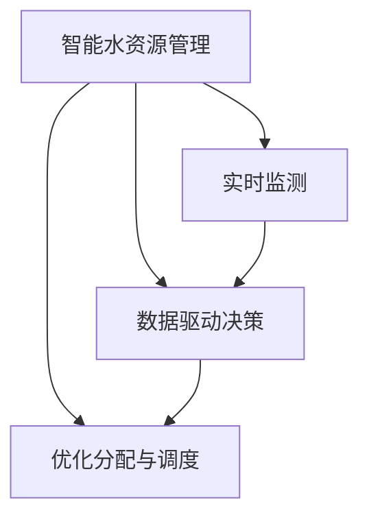

                 

# AI在智能水资源管理中的应用：减少浪费

> 关键词：智能水资源管理, AI在智能水资源管理中的应用, 减少浪费, 水资源优化, 智能灌溉, 数据驱动决策

## 1. 背景介绍

### 1.1 问题由来
随着全球气候变化和人口增长，水资源短缺问题日益严峻。据联合国统计，全球约2.1亿人面临严重的水资源短缺问题，预计到2050年，这一数字将翻一番。在农业、工业、城市供水等各个领域，水资源浪费现象普遍存在，进一步加剧了水资源的紧缺程度。

为了应对这一挑战，各国政府和机构纷纷寻求创新的解决方案。其中，智能水资源管理通过AI技术和数据分析，精准监测和优化水资源分配，有效缓解水资源浪费问题。基于AI的智能水资源管理系统，能够实时监测水资源状态，预测未来需求，优化水资源分配策略，提高用水效率，减少不必要的浪费。

### 1.2 问题核心关键点
AI在智能水资源管理中的应用主要集中在以下几个方面：

1. **实时监测和数据采集**：通过传感器、摄像头等设备，实时采集水资源状态数据，如水位、水质、流量等。

2. **数据分析和预测**：利用机器学习算法对历史和实时数据进行分析，预测未来水资源需求，为优化分配提供依据。

3. **优化决策和控制**：基于预测结果，优化灌溉、供水等策略，实时调整设备和系统，实现水资源的精准管理。

4. **反馈机制和持续改进**：建立系统的反馈机制，持续评估和调整模型，提升系统性能和准确性。

这些关键点构成了AI在智能水资源管理中的核心框架，有助于提升水资源的利用效率，减少浪费。

## 2. 核心概念与联系

### 2.1 核心概念概述

为更好地理解AI在智能水资源管理中的应用，本节将介绍几个密切相关的核心概念：

- **智能水资源管理(Smart Water Resource Management, SWRM)**：通过传感器、物联网、AI等技术，实时监测和优化水资源管理，提高水资源利用效率，减少浪费。

- **AI在智能水资源管理中的应用**：利用机器学习、深度学习等AI技术，对水资源数据进行分析、预测和优化，实现水资源的精准管理。

- **数据驱动决策(Data-Driven Decision Making)**：基于数据分析和预测，优化水资源管理决策，提高决策的科学性和准确性。

- **实时监测与控制**：通过实时数据采集和控制策略，实现水资源的动态管理，提升系统响应速度和稳定性。

- **优化分配与调度**：利用算法优化水资源的分配和调度，确保水资源的合理利用，减少不必要的水浪费。

这些核心概念之间的逻辑关系可以通过以下Mermaid流程图来展示：



这个流程图展示了大语言模型的核心概念及其之间的关系：

1. 智能水资源管理通过实时监测和数据采集获取水资源状态。
2. 数据驱动决策利用AI技术对数据进行分析，预测未来需求。
3. 优化分配与调度基于预测结果，调整水资源管理策略。

这些概念共同构成了智能水资源管理的技术框架，有助于实现高效、精准的水资源管理。

## 3. 核心算法原理 & 具体操作步骤
### 3.1 算法原理概述

AI在智能水资源管理中的核心算法原理主要包括数据分析、预测模型和优化调度等环节。其核心思想是通过数据分析和预测，优化水资源管理策略，减少不必要的水浪费。

形式化地，假设水资源状态数据为 $\{x_i\}_{i=1}^N$，目标为在未来的 $t$ 时刻，预测水资源需求 $y_t$，并根据需求进行优化分配，即：

$$
y_t = f(\{x_i\}_{i=1}^N) \\
\text{优化分配策略} = g(y_t)
$$

其中，$f$ 表示预测模型，$g$ 表示优化调度策略。通过不断迭代优化模型和策略，可以逐步提高水资源的利用效率，减少浪费。

### 3.2 算法步骤详解

基于AI的智能水资源管理通常包括以下几个关键步骤：

**Step 1: 准备数据和环境**
- 收集和预处理水资源状态数据，如水位、流量、水质等。
- 部署传感器、摄像头等监测设备，实时采集水资源状态数据。
- 搭建数据存储和管理系统，确保数据的安全性和可访问性。

**Step 2: 数据分析和特征提取**
- 利用特征提取技术，从原始数据中提取有意义的特征，如时间序列、空间分布、季节性变化等。
- 应用统计学方法，进行数据的清洗和归一化处理，去除异常值和噪音。

**Step 3: 建立预测模型**
- 选择合适的机器学习算法，如回归模型、时间序列模型、深度学习模型等，建立预测模型。
- 使用历史数据训练模型，并通过交叉验证等技术优化模型参数。
- 在模型中选择合适的评估指标，如均方误差(MSE)、均方根误差(RMSE)等，评估模型预测性能。

**Step 4: 优化决策和控制策略**
- 根据预测结果，设计优化决策和控制策略，如智能灌溉、供水调度等。
- 引入反馈机制，实时监测和调整策略，确保系统稳定运行。
- 建立多目标优化模型，综合考虑用水效率、设备成本、环境影响等因素，优化水资源分配。

**Step 5: 部署和评估**
- 将优化策略集成到实际系统中，进行实时部署和测试。
- 监测系统的运行情况，收集反馈数据，持续改进和优化模型和策略。
- 评估系统的整体性能，如节水效果、设备利用率等，进行系统优化。

以上是AI在智能水资源管理中的一般流程。在实际应用中，还需要针对具体场景和需求，进行优化设计和参数调整。

### 3.3 算法优缺点

基于AI的智能水资源管理具有以下优点：
1. 高效精准。通过数据分析和预测，可以实现水资源的精准管理，减少不必要的水浪费。
2. 自适应性强。可以根据实时数据，动态调整策略，适应不同环境和时间段的需求。
3. 节能环保。优化水资源管理，减少水资源使用量，有助于节能减排和环境保护。
4. 投资回报高。虽然初始投资较大，但通过优化管理，可以大幅降低水费支出，快速回收投资。

同时，该方法也存在一定的局限性：
1. 数据质量要求高。预测模型的准确性依赖于数据的质量和完整性，数据缺失和噪音可能导致模型失真。
2. 算法复杂度高。深度学习模型等复杂算法，需要大量计算资源和专业技能，难以快速部署。
3. 模型泛化能力不足。在特定环境和条件下，模型可能存在过拟合或泛化能力不足的问题。
4. 系统维护复杂。实时监测和控制策略需要持续维护和更新，系统管理难度较大。

尽管存在这些局限性，但AI在智能水资源管理中的应用前景广阔，未来仍有较大的提升空间。

### 3.4 算法应用领域

基于AI的智能水资源管理技术，已在多个领域得到应用，涵盖了农业灌溉、工业供水、城市供水等多个方面：

- **农业灌溉**：利用智能灌溉系统，根据土壤湿度、天气条件等数据，实时调整灌溉策略，优化灌溉用水。
- **工业供水**：在工业生产中，通过监测供水流量和质量，优化供水方案，减少不必要的水浪费。
- **城市供水**：在城市供水网络中，利用智能调度系统，优化供水路径和流量，确保供水稳定，减少漏水和损耗。

此外，AI技术还被用于水质监测、污水处理等领域，助力实现水资源的全面管理。随着AI技术的不断进步，未来将有更多的应用场景被解锁。

## 4. 数学模型和公式 & 详细讲解  
### 4.1 数学模型构建

本节将使用数学语言对基于AI的智能水资源管理进行更加严格的刻画。

假设水资源状态数据为 $\{x_i\}_{i=1}^N$，其中 $x_i$ 为第 $i$ 个时间点的数据，如水位、流量、水质等。假设目标为在未来的 $t$ 时刻，预测水资源需求 $y_t$，并根据需求进行优化分配，即：

$$
y_t = f(\{x_i\}_{i=1}^N)
$$

其中，$f$ 表示预测模型，$y_t$ 为水资源需求预测值。优化分配策略为：

$$
g(y_t) = \text{优化分配策略}
$$

优化分配策略可以是多种形式，如调整灌溉设备、调整供水流量等。通过不断迭代优化模型和策略，可以逐步提高水资源的利用效率，减少浪费。

### 4.2 公式推导过程

以下我们以时间序列预测为例，推导基于深度学习的预测模型公式。

假设水资源状态数据为时间序列 $x = \{x_t\}_{t=1}^T$，其中 $x_t$ 为第 $t$ 时刻的水资源状态数据，如水位、流量等。目标为在未来的 $t$ 时刻，预测水资源需求 $y_t$，预测模型为深度神经网络：

$$
y_t = f(x; \theta)
$$

其中，$f$ 表示深度神经网络模型，$\theta$ 为模型参数。假设 $f$ 采用LSTM或GRU模型，输入为历史数据 $x_{t-T+1:t}$，输出为预测值 $y_t$。则模型可以表示为：

$$
y_t = f(x_{t-T+1:t}; \theta) = \sum_{i=1}^I \omega_i \sigma(\phi_i(x_{t-T+1:t}))
$$

其中，$\omega_i$ 为权重，$\sigma$ 为激活函数，$\phi_i$ 为映射函数。通过训练模型，最小化损失函数，可以优化模型参数 $\theta$，提高预测准确性。

### 4.3 案例分析与讲解

**案例：智能灌溉系统的优化**

某农业基地采用基于AI的智能灌溉系统，利用实时监测数据，优化灌溉用水。具体实现步骤如下：

1. 收集和预处理灌溉用水数据，包括土壤湿度、天气条件、作物类型等。

2. 使用LSTM模型对历史数据进行训练，建立预测模型。

3. 实时监测土壤湿度和天气条件，输入模型进行预测，输出需灌溉的水量。

4. 根据预测结果，调整灌溉设备和供水策略，确保水资源的精准分配。

5. 监测系统运行情况，收集反馈数据，不断优化模型和策略。

通过上述过程，可以实现智能灌溉，减少不必要的水浪费，提高农业生产效率和效益。

## 5. 项目实践：代码实例和详细解释说明
### 5.1 开发环境搭建

在进行AI在智能水资源管理中的应用实践前，我们需要准备好开发环境。以下是使用Python进行TensorFlow开发的环境配置流程：

1. 安装Anaconda：从官网下载并安装Anaconda，用于创建独立的Python环境。

2. 创建并激活虚拟环境：
```bash
conda create -n ai-env python=3.8 
conda activate ai-env
```

3. 安装TensorFlow：
```bash
pip install tensorflow
```

4. 安装其他必要工具：
```bash
pip install pandas numpy scikit-learn matplotlib
```

完成上述步骤后，即可在`ai-env`环境中开始AI在智能水资源管理中的应用实践。

### 5.2 源代码详细实现

下面我们以时间序列预测为例，给出使用TensorFlow进行智能灌溉系统优化的PyTorch代码实现。

首先，定义时间序列预测模型：

```python
import tensorflow as tf
from tensorflow.keras.models import Sequential
from tensorflow.keras.layers import LSTM, Dense, Dropout

def build_model(input_shape, output_size):
    model = Sequential()
    model.add(LSTM(128, input_shape=input_shape))
    model.add(Dropout(0.2))
    model.add(LSTM(64))
    model.add(Dropout(0.2))
    model.add(Dense(output_size))
    return model
```

然后，定义数据预处理函数：

```python
import numpy as np
from sklearn.preprocessing import MinMaxScaler

def preprocess_data(data):
    scaler = MinMaxScaler(feature_range=(0, 1))
    scaled_data = scaler.fit_transform(data)
    x = []
    y = []
    for i in range(len(scaled_data) - 1):
        x.append(scaled_data[i:(i+1)])
        y.append(scaled_data[i+1])
    x = np.array(x)
    y = np.array(y)
    return x, y
```

接着，定义训练函数：

```python
def train_model(model, x_train, y_train, batch_size, epochs, validation_split=0.2):
    model.compile(loss='mean_squared_error', optimizer='adam')
    model.fit(x_train, y_train, batch_size=batch_size, epochs=epochs, validation_split=validation_split, verbose=1)
```

最后，启动训练流程并在测试集上评估：

```python
# 加载数据
x, y = preprocess_data(data)

# 定义模型
model = build_model(x.shape[1], 1)

# 训练模型
train_model(model, x, y, batch_size=32, epochs=50, validation_split=0.2)

# 预测并评估模型性能
test_x, test_y = preprocess_data(data[-10:])
test_x = test_x.reshape(1, 10, 1)
predicted_y = model.predict(test_x)
print('预测结果：', predicted_y)
print('实际结果：', test_y)
```

以上就是使用TensorFlow对智能灌溉系统进行优化的时间序列预测代码实现。可以看到，得益于TensorFlow的强大封装，我们可以用相对简洁的代码完成模型的搭建和训练。

### 5.3 代码解读与分析

让我们再详细解读一下关键代码的实现细节：

**时间序列预测模型**：
- 定义一个基于LSTM的深度神经网络模型，包含两个LSTM层和一个全连接层。
- 每个LSTM层后面都加了一个Dropout层，以避免过拟合。

**数据预处理**：
- 使用MinMaxScaler对原始数据进行归一化处理，确保数据在0-1之间。
- 将原始数据按时间序列切分成输入和输出，用于训练模型。

**训练函数**：
- 使用均方误差损失函数和Adam优化器训练模型。
- 在训练过程中，使用验证集评估模型性能，避免过拟合。

**训练流程**：
- 加载数据，进行预处理。
- 定义模型，并进行训练。
- 在测试集上评估模型预测性能，输出预测结果和实际结果。

可以看到，TensorFlow配合Keras封装，使得时间序列预测的代码实现变得简洁高效。开发者可以将更多精力放在数据处理、模型改进等高层逻辑上，而不必过多关注底层的实现细节。

当然，工业级的系统实现还需考虑更多因素，如模型的保存和部署、超参数的自动搜索、更灵活的任务适配层等。但核心的模型训练流程基本与此类似。

## 6. 实际应用场景
### 6.1 智能灌溉系统

AI在智能灌溉中的应用，通过实时监测和预测，优化灌溉策略，实现节水高效。具体实现步骤如下：

1. 安装土壤湿度、温度等传感器，实时监测土壤状态。

2. 利用AI模型对监测数据进行分析，预测灌溉需求。

3. 根据预测结果，调整灌溉设备，优化灌溉策略。

4. 在灌溉结束后，收集反馈数据，不断优化模型和策略。

通过上述过程，可以实现智能灌溉，减少不必要的水浪费，提高农业生产效率和效益。

### 6.2 工业供水系统

在工业供水系统中，AI通过实时监测供水流量和压力，预测未来需求，优化供水策略，减少水浪费。具体实现步骤如下：

1. 安装流量计、压力传感器等设备，实时监测供水状态。

2. 利用AI模型对监测数据进行分析，预测供水需求。

3. 根据预测结果，调整供水设备和调度策略，优化供水方案。

4. 在供水结束后，收集反馈数据，不断优化模型和策略。

通过上述过程，可以实现工业供水的智能管理，降低水浪费，提高供水效率和稳定性。

### 6.3 城市供水网络

在城市供水网络中，AI通过实时监测和优化供水路径和流量，确保供水稳定，减少漏水和损耗。具体实现步骤如下：

1. 安装流量计、压力传感器等设备，实时监测供水状态。

2. 利用AI模型对监测数据进行分析，预测供水需求。

3. 根据预测结果，调整供水设备和调度策略，优化供水方案。

4. 在供水结束后，收集反馈数据，不断优化模型和策略。

通过上述过程，可以实现城市供水的智能管理，降低水浪费，提高供水效率和稳定性。

### 6.4 未来应用展望

随着AI技术的不断进步，智能水资源管理的应用前景广阔，未来将在更多领域得到应用，为社会带来变革性影响。

在智慧农业领域，AI技术将广泛应用于智能灌溉、智能施肥、智能病虫害预测等环节，提高农业生产的自动化和智能化水平，减少资源浪费，提升农业产出。

在智能工业领域，AI技术将应用于供水、排水、污水处理等环节，提高工业生产的资源利用效率，降低资源消耗和环境污染。

在智慧城市领域，AI技术将应用于城市供水、排水、污水处理等环节，提高城市供水的自动化和智能化水平，提升城市管理的智能化和精细化程度。

此外，AI技术还被用于智能物流、智能仓储、智能能源管理等领域，助力实现资源的高效利用和优化管理。相信随着AI技术的不断成熟，智能水资源管理必将在更广阔的应用领域大放异彩，为社会经济的可持续发展提供强有力的支撑。

## 7. 工具和资源推荐
### 7.1 学习资源推荐

为了帮助开发者系统掌握AI在智能水资源管理中的应用理论基础和实践技巧，这里推荐一些优质的学习资源：

1. 《深度学习》书籍：由Ian Goodfellow等人合著，系统介绍了深度学习的基本概念和经典模型，适合深入学习。

2. 《TensorFlow官方文档》：TensorFlow官方文档，提供了丰富的API和示例代码，是TensorFlow学习的必备资源。

3. 《PyTorch官方文档》：PyTorch官方文档，提供了详细的API文档和实例代码，是PyTorch学习的必备资源。

4. 《智能水资源管理技术与应用》书籍：系统介绍了智能水资源管理的原理、技术和应用，适合理论与实践相结合的学习。

5. 《智能农业技术》在线课程：介绍智能农业的基本概念和核心技术，适合了解AI在农业中的应用。

通过对这些资源的学习实践，相信你一定能够快速掌握AI在智能水资源管理中的应用精髓，并用于解决实际的NLP问题。

### 7.2 开发工具推荐

高效的开发离不开优秀的工具支持。以下是几款用于AI在智能水资源管理中的应用开发的常用工具：

1. TensorFlow：由Google主导开发的开源深度学习框架，生产部署方便，适合大规模工程应用。

2. PyTorch：基于Python的开源深度学习框架，灵活动态的计算图，适合快速迭代研究。

3. Jupyter Notebook：开源的交互式笔记本环境，支持Python、R等多种语言，适合数据科学和机器学习研究。

4. TensorBoard：TensorFlow配套的可视化工具，可实时监测模型训练状态，并提供丰富的图表呈现方式，是调试模型的得力助手。

5. Weights & Biases：模型训练的实验跟踪工具，可以记录和可视化模型训练过程中的各项指标，方便对比和调优。

6. Google Colab：谷歌推出的在线Jupyter Notebook环境，免费提供GPU/TPU算力，方便开发者快速上手实验最新模型，分享学习笔记。

合理利用这些工具，可以显著提升AI在智能水资源管理中的应用开发效率，加快创新迭代的步伐。

### 7.3 相关论文推荐

AI在智能水资源管理中的应用研究源于学界的持续研究。以下是几篇奠基性的相关论文，推荐阅读：

1. A Survey on Smart Water Resource Management: From Concepts to Implementation：对智能水资源管理的原理、技术和应用进行了全面的综述，适合了解基础概念。

2. Machine Learning Models for Water Resource Management：介绍了机器学习在智能水资源管理中的应用，适合了解具体算法。

3. AI for Smart Agriculture: A Survey：对AI在智能农业中的应用进行了全面的综述，适合了解AI在农业中的应用。

4. A Review of Water Resource Management Using AI：对AI在智能水资源管理中的应用进行了全面的综述，适合了解具体算法和应用场景。

5. Intelligent Water Resource Management Using AI：对AI在智能水资源管理中的应用进行了全面的综述，适合了解前沿技术。

这些论文代表了大语言模型微调技术的发展脉络。通过学习这些前沿成果，可以帮助研究者把握学科前进方向，激发更多的创新灵感。

## 8. 总结：未来发展趋势与挑战

### 8.1 总结

本文对AI在智能水资源管理中的应用进行了全面系统的介绍。首先阐述了智能水资源管理的背景和意义，明确了AI在智能水资源管理中的应用核心。其次，从原理到实践，详细讲解了AI在智能水资源管理中的应用过程，给出了AI在智能水资源管理中的应用代码实现。同时，本文还广泛探讨了AI在智能水资源管理中的应用场景，展示了AI在智能水资源管理中的巨大潜力。此外，本文精选了AI在智能水资源管理中的应用学习的资源，力求为读者提供全方位的技术指引。

通过本文的系统梳理，可以看到，AI在智能水资源管理中的应用正逐渐成为水资源管理的重要手段，有助于提升水资源的利用效率，减少浪费。未来，伴随AI技术的不断进步，AI在智能水资源管理中的应用将更加广泛，为水资源的可持续利用提供强有力的支撑。

### 8.2 未来发展趋势

展望未来，AI在智能水资源管理的应用将呈现以下几个发展趋势：

1. 模型规模持续增大。随着算力成本的下降和数据规模的扩张，AI模型的参数量还将持续增长。超大规模AI模型蕴含的丰富知识，有望支撑更加复杂多变的智能水资源管理。

2. 智能系统越来越普及。越来越多的水资源管理场景将引入AI技术，实现智能灌溉、智能供水等目标。AI技术的普及将大幅提高水资源管理的自动化和智能化水平。

3. 数据驱动决策成为常态。未来的智能水资源管理系统将更加依赖于数据驱动决策，通过实时监测和预测，优化水资源管理策略，提高决策的科学性和准确性。

4. 多目标优化成为趋势。未来的智能水资源管理系统将综合考虑用水效率、设备成本、环境影响等因素，实现多目标优化。

5. 自动化水平越来越高。未来的智能水资源管理系统将具备更高的自动化水平，实现自我监测、自我调整、自我优化，提高系统的稳定性和可靠性。

6. 系统集成能力越来越强。未来的智能水资源管理系统将与其他智能系统（如智能电网、智能交通等）进行更深入的集成，实现多系统协同管理。

以上趋势凸显了AI在智能水资源管理中的广阔前景。这些方向的探索发展，必将进一步提升水资源的利用效率，减少浪费，为社会经济的可持续发展提供强有力的支撑。

### 8.3 面临的挑战

尽管AI在智能水资源管理中的应用已经取得了一定的成效，但在迈向更加智能化、普适化应用的过程中，它仍面临着诸多挑战：

1. 数据质量瓶颈。虽然AI技术依赖于数据，但水资源管理数据往往存在数据缺失、噪音等问题，数据质量不足可能导致AI模型失真。

2. 模型泛化能力不足。在特定环境和条件下，AI模型可能存在过拟合或泛化能力不足的问题，影响模型的稳定性和可靠性。

3. 系统集成难度大。智能水资源管理涉及多个系统集成，不同系统间的数据格式、协议等差异，增加了系统集成的难度。

4. 用户接受度低。由于技术复杂度高，部分用户可能对AI技术存在疑虑，影响AI技术的推广和应用。

5. 安全与隐私问题。AI技术的应用需要大量数据，数据安全和隐私保护问题需引起重视。

尽管存在这些挑战，但通过持续的技术创新和优化，AI在智能水资源管理中的应用前景广阔，未来仍有较大的提升空间。

### 8.4 研究展望

面对AI在智能水资源管理中所面临的挑战，未来的研究需要在以下几个方面寻求新的突破：

1. 数据质量提升。通过数据清洗、数据增强等技术，提高水资源管理数据的准确性和完整性。

2. 模型鲁棒性增强。引入更多先验知识，如物理模型、专家规则等，增强模型的鲁棒性和泛化能力。

3. 系统集成优化。设计标准化的数据接口和通信协议，促进不同系统间的无缝集成。

4. 用户接受度提升。通过教育和培训，提高用户对AI技术的认知和接受度，推动AI技术的普及应用。

5. 数据安全和隐私保护。引入数据加密、匿名化等技术，保障数据安全和隐私。

这些研究方向的应用，必将引领AI在智能水资源管理中的应用走向成熟，为水资源的可持续利用提供强有力的支撑。

## 9. 附录：常见问题与解答

**Q1：AI在智能水资源管理中的应用主要有哪些优势？**

A: AI在智能水资源管理中的应用主要具有以下几个优势：

1. 精准监测。通过实时监测水资源状态，准确掌握水资源需求，减少不必要的水浪费。

2. 优化决策。利用数据分析和预测，优化水资源管理决策，提高水资源利用效率。

3. 自适应性强。可以根据实时数据，动态调整策略，适应不同环境和时间段的需求。

4. 节能环保。通过优化水资源管理，减少水资源使用量，有助于节能减排和环境保护。

5. 投资回报高。虽然初始投资较大，但通过优化管理，可以大幅降低水费支出，快速回收投资。

这些优势使得AI在智能水资源管理中的应用前景广阔，未来有望在更多领域得到应用。

**Q2：AI在智能水资源管理中存在哪些挑战？**

A: AI在智能水资源管理中面临以下挑战：

1. 数据质量要求高。预测模型的准确性依赖于数据的质量和完整性，数据缺失和噪音可能导致模型失真。

2. 算法复杂度高。深度学习模型等复杂算法，需要大量计算资源和专业技能，难以快速部署。

3. 模型泛化能力不足。在特定环境和条件下，模型可能存在过拟合或泛化能力不足的问题。

4. 系统集成难度大。智能水资源管理涉及多个系统集成，不同系统间的数据格式、协议等差异，增加了系统集成的难度。

5. 用户接受度低。由于技术复杂度高，部分用户可能对AI技术存在疑虑，影响AI技术的推广和应用。

6. 安全与隐私问题。AI技术的应用需要大量数据，数据安全和隐私保护问题需引起重视。

尽管存在这些挑战，但通过持续的技术创新和优化，AI在智能水资源管理中的应用前景广阔，未来仍有较大的提升空间。

**Q3：AI在智能水资源管理中的应用主要有哪些步骤？**

A: AI在智能水资源管理中的应用主要包括以下几个关键步骤：

1. 准备数据和环境。收集和预处理水资源状态数据，部署传感器、摄像头等监测设备，搭建数据存储和管理系统。

2. 数据分析和特征提取。利用特征提取技术，从原始数据中提取有意义的特征，如时间序列、空间分布、季节性变化等。

3. 建立预测模型。选择合适的机器学习算法，如回归模型、时间序列模型、深度学习模型等，建立预测模型，使用历史数据训练模型，并通过交叉验证等技术优化模型参数。

4. 优化决策和控制策略。根据预测结果，设计优化决策和控制策略，如智能灌溉、供水调度等。

5. 部署和评估。将优化策略集成到实际系统中，进行实时部署和测试，监测系统的运行情况，收集反馈数据，持续改进和优化模型和策略。

这些步骤构成了AI在智能水资源管理中的核心流程，有助于实现水资源的精准管理，减少浪费。

**Q4：如何提高AI在智能水资源管理中的应用效果？**

A: 要提高AI在智能水资源管理中的应用效果，可以从以下几个方面入手：

1. 数据质量提升。通过数据清洗、数据增强等技术，提高水资源管理数据的准确性和完整性。

2. 模型鲁棒性增强。引入更多先验知识，如物理模型、专家规则等，增强模型的鲁棒性和泛化能力。

3. 系统集成优化。设计标准化的数据接口和通信协议，促进不同系统间的无缝集成。

4. 用户接受度提升。通过教育和培训，提高用户对AI技术的认知和接受度，推动AI技术的普及应用。

5. 数据安全和隐私保护。引入数据加密、匿名化等技术，保障数据安全和隐私。

6. 持续优化和改进。根据实际运行情况，持续优化和改进AI模型和策略，确保系统的稳定性和可靠性。

通过这些措施，可以进一步提高AI在智能水资源管理中的应用效果，实现水资源的精准管理和高效利用。

**Q5：AI在智能水资源管理中的应用主要有哪些应用场景？**

A: AI在智能水资源管理中的应用主要包括以下几个应用场景：

1. 智能灌溉系统。利用AI技术对土壤湿度、天气条件等数据进行分析，预测灌溉需求，优化灌溉策略。

2. 工业供水系统。通过实时监测供水流量和压力，预测供水需求，优化供水策略，减少水浪费。

3. 城市供水网络。通过实时监测和优化供水路径和流量，确保供水稳定，减少漏水和损耗。

4. 智慧农业。利用AI技术对农业生产数据进行分析，优化灌溉、施肥、病虫害预测等环节，提高农业生产效率。

5. 智能工业。利用AI技术对工业生产数据进行分析，优化供水、排水、污水处理等环节，提高工业生产的资源利用效率。

6. 智慧城市。利用AI技术对城市供水、排水、污水处理等环节进行分析，提高城市供水的自动化和智能化水平。

这些应用场景展示了AI在智能水资源管理中的广泛应用，有助于提升水资源的利用效率，减少浪费。

