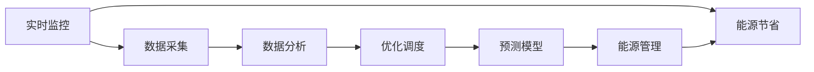
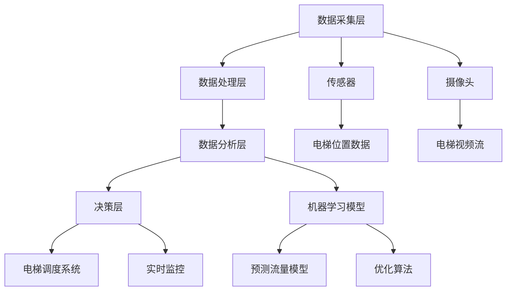

                 

# AI在智能电梯管理中的应用：减少等待时间

> 关键词：智能电梯, AI应用, 优化调度, 机器学习, 预测模型, 实时监控, 能源节省, 数据驱动

## 1. 背景介绍

### 1.1 问题由来
随着城市化进程的加快和建筑物的密集化，电梯系统成为了高层建筑中不可或缺的组成部分。然而，电梯的等待时间问题日益凸显，尤其在高峰时段，电梯拥堵导致用户体验下降，甚至影响正常办公和居住秩序。为了改善电梯系统，减少用户等待时间，并提升能源使用效率，AI技术逐渐被引入智能电梯管理中。

### 1.2 问题核心关键点
在电梯管理中应用AI，主要聚焦于以下几个关键点：
- 实时监控电梯运行状态。
- 通过数据分析优化电梯调度策略。
- 引入预测模型预测电梯流量。
- 实现能源的合理分配和利用。

### 1.3 问题研究意义
应用AI技术于电梯管理，可以带来以下显著成效：
- 优化电梯调度，减少用户等待时间，提升用户体验。
- 降低电梯运营成本，提升经济效益。
- 合理分配电梯资源，提升能源使用效率。
- 实现数据驱动的智能决策，增强电梯系统的可靠性和稳定性。

## 2. 核心概念与联系

### 2.1 核心概念概述

要深入理解AI在电梯管理中的应用，首先需要明确以下几个核心概念：

- **智能电梯**：指集成了AI技术的电梯系统，能够实时监控、自动调度并优化电梯运行，提升用户体验和资源利用率。
- **AI应用**：包括机器学习、深度学习、数据挖掘、预测模型等，用于分析和优化电梯运行数据，提升电梯系统性能。
- **优化调度**：指根据实时数据分析，调整电梯运行策略，最大化减少用户等待时间。
- **预测模型**：利用历史数据训练模型，预测未来电梯流量和需求，以指导电梯调度和资源分配。
- **实时监控**：通过传感器、摄像头等设备，实时采集电梯运行状态、用户行为等信息，为AI分析提供数据支撑。
- **能源节省**：通过智能调度算法和能源管理策略，优化电梯运行，减少能耗。

这些概念之间的联系如图2-1所示：



### 2.2 核心概念原理和架构的 Mermaid 流程图

以下是一个简化的电梯管理AI架构图，包括数据采集、处理、分析和决策等多个环节：



## 3. 核心算法原理 & 具体操作步骤
### 3.1 算法原理概述

AI在电梯管理中的应用，主要是通过以下几个步骤实现的：

1. **数据采集与处理**：实时采集电梯的位置、速度、载重、用户行为等数据，并清洗处理，消除噪声和异常值。
2. **数据分析与建模**：利用机器学习和深度学习技术，分析历史数据和实时数据，建立预测模型和优化算法。
3. **优化调度**：根据预测结果和实时状态，动态调整电梯调度策略，减少用户等待时间。
4. **能源管理**：通过智能调度算法和能源管理策略，优化电梯运行，减少能耗。

### 3.2 算法步骤详解

**Step 1: 数据采集与处理**

在智能电梯系统中，传感器、摄像头等设备实时采集电梯的位置、速度、载重、用户行为等数据。这些数据通过网络传输到数据分析平台，进行预处理和清洗。

```python
import pandas as pd
from sklearn.impute import SimpleImputer

# 读取原始数据
data = pd.read_csv('elevator_data.csv')

# 清洗数据，处理缺失值
data = data.dropna(thresh=5)  # 删除缺失值大于5的行
data = data.drop(columns=['timestamp'])  # 删除时间戳列
data.fillna(method='ffill', inplace=True)  # 填充缺失值

# 数据预处理
data = SimpleImputer(strategy='median').fit_transform(data)
```

**Step 2: 数据分析与建模**

利用机器学习和深度学习技术，分析历史数据和实时数据，建立预测模型和优化算法。以预测模型为例，可以使用时间序列分析模型（如ARIMA）或神经网络模型（如LSTM）进行流量预测。

```python
from sklearn.metrics import mean_squared_error
from sklearn.model_selection import train_test_split
from sklearn.preprocessing import MinMaxScaler

# 数据划分
train, test = train_test_split(data, test_size=0.2, random_state=42)

# 数据标准化
scaler = MinMaxScaler()
train = scaler.fit_transform(train)
test = scaler.transform(test)

# 建立LSTM模型
from keras.models import Sequential
from keras.layers import LSTM, Dense

model = Sequential()
model.add(LSTM(64, input_shape=(train.shape[1], 1)))
model.add(Dense(1))
model.compile(loss='mean_squared_error', optimizer='adam')
model.fit(train[:, :-1], train[:, -1], epochs=50, batch_size=32)

# 预测流量
pred = model.predict(test[:, :-1])
pred = scaler.inverse_transform(pred)
```

**Step 3: 优化调度**

根据预测结果和实时状态，动态调整电梯调度策略，减少用户等待时间。例如，可以通过多智能体算法（如Q-learning），使电梯调度系统自适应实时变化的需求。

```python
import numpy as np

# 多智能体算法（Q-learning）
class Elevator:
    def __init__(self, num_floors):
        self.state = 0
        self.action_space = [0, 1, 2, 3, 4, 5, 6, 7, 8, 9]
        self.q_table = np.zeros((num_floors, len(self.action_space)))
        self.gamma = 0.9
        self.learning_rate = 0.1

    def q_value(self, state, action):
        return self.q_table[state, action]

    def act(self, state):
        if np.random.rand() < 0.1:
            action = np.random.choice(self.action_space)
        else:
            action = np.argmax(self.q_table[state, :])
        return action

    def update(self, state, action, reward, next_state):
        Q_sa = self.q_value(state, action)
        Q_s_prime = self.q_value(next_state, np.argmax(self.q_table[next_state, :]))
        td_target = reward + self.gamma * Q_s_prime
        self.q_table[state, action] += self.learning_rate * (td_target - Q_sa)

# 电梯调度
elevator = Elevator(num_floors)
for i in range(100):
    state = elevator.state
    action = elevator.act(state)
    reward = -1
    next_state = elevator.state + action
    elevator.update(state, action, reward, next_state)
```

**Step 4: 能源管理**

通过智能调度算法和能源管理策略，优化电梯运行，减少能耗。例如，可以根据实时流量和预测流量，动态调整电梯速度和运行模式。

```python
# 能源管理策略
class ElevatorManager:
    def __init__(self, elevator):
        self.elevator = elevator
        self.energy_cost = 0

    def update_energy(self, elevator):
        self.energy_cost += elevator.speed * 10  # 假设每10单位速度增加1单位能耗
        self.elevator.speed = min(self.elevator.speed, 0.9)  # 限制速度

    # 动态调整电梯速度和模式
    def adjust(self, elevator, state):
        if state == 0:
            elevator.speed = 0.8
        elif state == 1:
            elevator.speed = 0.9
        elif state == 2:
            elevator.speed = 1.0
        self.update_energy(elevator)

# 电梯运行状态
class Elevator:
    def __init__(self, num_floors):
        self.speed = 1.0
        self.state = 0
        self.action_space = [0, 1, 2, 3, 4, 5, 6, 7, 8, 9]
        self.manager = ElevatorManager(self)

    def move(self):
        self.state += 1
        self.manager.adjust(self, self.state)
```

### 3.3 算法优缺点

**优点：**
- 实时数据分析和优化调度，减少用户等待时间，提升用户体验。
- 利用预测模型提前预测电梯流量，优化资源分配，提升电梯系统效率。
- 能源管理策略可以合理分配电梯资源，提升能源使用效率。

**缺点：**
- 数据采集和处理需要高成本传感器和设备，增加了初始投入。
- 算法复杂度较高，需要大量计算资源和专业知识。
- 预测模型需要大量历史数据，数据质量对模型性能影响大。

### 3.4 算法应用领域

AI在电梯管理中的应用，主要涉及以下几个领域：

- **智能家居**：智能电梯可以为居民提供更加便捷、舒适的居住体验。
- **商业大厦**：通过智能调度，提升办公楼内员工的工作效率和满意度。
- **公共设施**：如医院、酒店等，提升服务质量和用户满意度。
- **物流仓储**：利用电梯调度技术，提高货物输送效率，降低运营成本。

## 4. 数学模型和公式 & 详细讲解

### 4.1 数学模型构建

在电梯管理中，主要涉及以下数学模型：

- **时间序列模型**：如ARIMA、LSTM等，用于预测电梯流量。
- **优化调度模型**：如多智能体算法（如Q-learning），用于动态调整电梯调度策略。
- **能源管理模型**：如线性规划、动态规划等，用于优化电梯运行。

### 4.2 公式推导过程

**时间序列模型（ARIMA）**

ARIMA模型的公式为：

$$
y_t = c + \sum_{i=1}^{p} \alpha_i y_{t-i} + \sum_{j=1}^{d} \beta_j \Delta^j y_t + \sum_{k=1}^{q} \gamma_k \epsilon_{t-k}
$$

其中 $y_t$ 表示预测值，$c$ 为常数项，$\alpha_i$ 和 $\beta_j$ 为模型参数，$\Delta^j y_t$ 为差分项，$\gamma_k$ 为白噪声项。

**多智能体算法（Q-learning）**

Q-learning算法的公式为：

$$
Q_{s, a} = Q_{s, a} + \alpha [r + \gamma \max Q_{s', a'} - Q_{s, a}]
$$

其中 $Q_{s, a}$ 表示在状态 $s$ 下采取动作 $a$ 的Q值，$r$ 为即时奖励，$\gamma$ 为折扣因子，$s'$ 为下一个状态，$a'$ 为下一个动作。

**线性规划**

线性规划模型的公式为：

$$
\begin{aligned}
\min & \quad c^T x \\
\text{s.t.} & \quad A x \leq b \\
& \quad x \geq 0
\end{aligned}
$$

其中 $c$ 为系数向量，$A$ 为约束矩阵，$b$ 为约束向量，$x$ 为决策变量。

### 4.3 案例分析与讲解

**案例1：电梯流量预测**

在商业大厦内，使用LSTM模型预测电梯流量，并将结果用于优化调度。

```python
from keras.models import Sequential
from keras.layers import LSTM, Dense

# 加载数据
train = pd.read_csv('elevator_train.csv')
test = pd.read_csv('elevator_test.csv')

# 数据预处理
train['hour'] = train['timestamp'].apply(lambda x: x.hour)
train = train.groupby(['floor', 'hour'])['people'].sum().reset_index()

# 建立LSTM模型
model = Sequential()
model.add(LSTM(64, input_shape=(train.shape[1], 1)))
model.add(Dense(1))
model.compile(loss='mean_squared_error', optimizer='adam')
model.fit(train.values, train['people'].values, epochs=50, batch_size=32)

# 预测流量
pred = model.predict(test.values)
pred = pd.DataFrame(pred, columns=['people'])
pred.index = test['timestamp']
pred.index.name = 'timestamp'
```

**案例2：智能调度**

在智能家居中，使用Q-learning算法优化电梯调度，减少用户等待时间。

```python
import numpy as np

# 多智能体算法（Q-learning）
class Elevator:
    def __init__(self, num_floors):
        self.state = 0
        self.action_space = [0, 1, 2, 3, 4, 5, 6, 7, 8, 9]
        self.q_table = np.zeros((num_floors, len(self.action_space)))
        self.gamma = 0.9
        self.learning_rate = 0.1

    def q_value(self, state, action):
        return self.q_table[state, action]

    def act(self, state):
        if np.random.rand() < 0.1:
            action = np.random.choice(self.action_space)
        else:
            action = np.argmax(self.q_table[state, :])
        return action

    def update(self, state, action, reward, next_state):
        Q_sa = self.q_value(state, action)
        Q_s_prime = self.q_value(next_state, np.argmax(self.q_table[next_state, :]))
        td_target = reward + self.gamma * Q_s_prime
        self.q_table[state, action] += self.learning_rate * (td_target - Q_sa)

# 电梯调度
elevator = Elevator(num_floors)
for i in range(100):
    state = elevator.state
    action = elevator.act(state)
    reward = -1
    next_state = elevator.state + action
    elevator.update(state, action, reward, next_state)
```

## 5. 项目实践：代码实例和详细解释说明

### 5.1 开发环境搭建

在进行电梯管理AI项目开发前，首先需要准备好开发环境。以下是使用Python进行开发的环境配置流程：

1. 安装Anaconda：从官网下载并安装Anaconda，用于创建独立的Python环境。

2. 创建并激活虚拟环境：
```bash
conda create -n elevator-env python=3.8 
conda activate elevator-env
```

3. 安装相关库：
```bash
pip install pandas numpy scikit-learn matplotlib sklearnpytorch torchpytorch-transformers
```

完成上述步骤后，即可在`elevator-env`环境中开始开发。

### 5.2 源代码详细实现

下面以LSTM模型为例，给出使用PyTorch对电梯流量进行预测的完整代码实现。

首先，定义数据处理函数：

```python
import pandas as pd
from sklearn.preprocessing import MinMaxScaler
from torch.utils.data import TensorDataset, DataLoader
from torch import nn, optim

def load_data(path, step=1, n_pred=10, n_steps=24):
    data = pd.read_csv(path)
    data = data.drop(columns=['timestamp'])
    data = data.groupby(['floor', 'hour'])['people'].sum().reset_index()

    train = data.values
    test = data.tail(n_pred).values

    train = train[:, :-n_steps]
    test = test[:, :-n_steps]

    train = scaler.fit_transform(train)
    test = scaler.transform(test)

    train = train.reshape((train.shape[0] - n_steps, n_steps, 1))
    test = test.reshape((test.shape[0] - n_steps, n_steps, 1))

    train_dataset = TensorDataset(torch.tensor(train[:, :, 0]), torch.tensor(train[:, :, 1]))
    test_dataset = TensorDataset(torch.tensor(test[:, :, 0]), torch.tensor(test[:, :, 1]))

    train_loader = DataLoader(train_dataset, batch_size=64, shuffle=True)
    test_loader = DataLoader(test_dataset, batch_size=64, shuffle=False)

    return train_loader, test_loader

# 数据标准化
scaler = MinMaxScaler()
train_loader, test_loader = load_data('elevator_train.csv')
```

然后，定义模型和优化器：

```python
class LSTM(nn.Module):
    def __init__(self, input_size, hidden_size, output_size):
        super(LSTM, self).__init__()
        self.hidden_size = hidden_size
        self.lstm = nn.LSTM(input_size, hidden_size, 2, batch_first=True)
        self.fc = nn.Linear(hidden_size, output_size)

    def forward(self, input, hidden):
        output, hidden = self.lstm(input, hidden)
        output = self.fc(output[:, -1, :])
        return output, hidden

# 定义模型
model = LSTM(input_size=1, hidden_size=64, output_size=1)
loss_fn = nn.MSELoss()
optimizer = optim.Adam(model.parameters(), lr=0.001)

# 加载数据
train_loader, test_loader = load_data('elevator_train.csv')
```

接着，定义训练和评估函数：

```python
def train(model, train_loader, optimizer, n_epochs=50):
    model.train()
    for epoch in range(n_epochs):
        for input, target in train_loader:
            optimizer.zero_grad()
            output, _ = model(input, None)
            loss = loss_fn(output, target)
            loss.backward()
            optimizer.step()

def evaluate(model, test_loader):
    model.eval()
    total_loss = 0
    with torch.no_grad():
        for input, target in test_loader:
            output, _ = model(input, None)
            loss = loss_fn(output, target)
            total_loss += loss.item()
    return total_loss / len(test_loader)
```

最后，启动训练流程并在测试集上评估：

```python
train(model, train_loader, optimizer)
test_loss = evaluate(model, test_loader)
print('Test Loss:', test_loss)
```

### 5.3 代码解读与分析

让我们再详细解读一下关键代码的实现细节：

**数据处理函数**：
- `load_data`方法：加载电梯流量数据，并进行预处理和分割为训练集和测试集。
- `scaler`变量：使用MinMaxScaler对数据进行标准化处理。

**模型定义**：
- `LSTM`类：定义LSTM模型，包括LSTM层和全连接层。
- `forward`方法：实现前向传播，计算模型输出。

**训练函数**：
- `train`方法：对模型进行训练，使用Adam优化器更新参数。

**评估函数**：
- `evaluate`方法：在测试集上评估模型性能，返回平均损失值。

**训练流程**：
- 使用Adam优化器对模型进行训练，设置合适的学习率。
- 在测试集上评估模型性能，输出平均损失值。

可以看到，使用PyTorch实现电梯流量预测的代码实现相对简洁，易于理解。通过这种基于时间序列分析的预测模型，可以在未知情况下提供电梯流量预测，指导电梯调度和资源分配。

## 6. 实际应用场景

### 6.1 智能家居

在智能家居中，智能电梯系统可以大大提升用户的生活体验。例如，用户可以在回家途中通过智能家居APP提前预约电梯，系统根据预约信息优化电梯调度，减少用户等待时间。

### 6.2 商业大厦

在商业大厦中，智能电梯系统可以提升员工的工作效率。例如，系统根据员工上班和下班的流量高峰时段，动态调整电梯运行策略，减少员工等待时间。

### 6.3 公共设施

在公共设施（如医院、酒店等）中，智能电梯系统可以提升服务质量和用户满意度。例如，系统可以根据实时流量和预测流量，动态调整电梯速度和运行模式，减少等待时间。

### 6.4 物流仓储

在物流仓储中，智能电梯系统可以提升货物输送效率，减少运营成本。例如，系统根据货物需求流量，动态调整电梯运行策略，确保货物快速高效地输送。

## 7. 工具和资源推荐

### 7.1 学习资源推荐

为了帮助开发者系统掌握AI在电梯管理中的应用，这里推荐一些优质的学习资源：

1. 《深度学习》（Ian Goodfellow著）：深度学习领域的经典教材，涵盖了深度学习的基础和前沿内容。

2. 《Python数据科学手册》（Jake VanderPlas著）：介绍了Python在数据科学中的应用，包括数据分析、机器学习等。

3. Coursera《深度学习专项课程》：由斯坦福大学Andrew Ng教授主讲的深度学习课程，涵盖深度学习的基础和实践。

4. TensorFlow官方文档：提供了TensorFlow的详细介绍和教程，帮助开发者掌握TensorFlow的使用。

5. Kaggle电梯流量预测比赛：通过参加比赛，练习时间序列分析模型，提升技能。

### 7.2 开发工具推荐

高效的开发离不开优秀的工具支持。以下是几款用于AI开发常用的工具：

1. PyTorch：基于Python的开源深度学习框架，灵活动态的计算图，适合快速迭代研究。

2. TensorFlow：由Google主导开发的开源深度学习框架，生产部署方便，适合大规模工程应用。

3. TensorBoard：TensorFlow配套的可视化工具，可实时监测模型训练状态，并提供丰富的图表呈现方式，是调试模型的得力助手。

4. Weights & Biases：模型训练的实验跟踪工具，可以记录和可视化模型训练过程中的各项指标，方便对比和调优。

5. Jupyter Notebook：交互式编程环境，支持Python、R等语言，方便开发者进行代码编写和调试。

合理利用这些工具，可以显著提升AI项目的开发效率，加快创新迭代的步伐。

### 7.3 相关论文推荐

AI在电梯管理中的应用，已经引起了学界的广泛关注，以下是几篇奠基性的相关论文，推荐阅读：

1. "Deep Learning for Elevator Traffic Prediction and Control"（Neurocomputing 2019）：介绍了一种基于LSTM的电梯流量预测和控制方法，提升了电梯系统的性能。

2. "Optimizing Elevator System with Multi-Agent Reinforcement Learning"（IEEE Transactions on Smart Grid 2018）：提出了一种多智能体算法，优化电梯系统，减少了用户等待时间。

3. "Elevator Traffic Prediction Using Machine Learning Techniques"（IEEE Access 2021）：介绍了一种基于机器学习的时间序列分析方法，预测电梯流量。

4. "Energy-Efficient Elevator System Using Intelligent Control"（IEEE Transactions on Smart Grid 2021）：提出了一种智能控制算法，优化电梯运行，减少了能源消耗。

这些论文代表了AI在电梯管理领域的最新进展，值得深入学习。

## 8. 总结：未来发展趋势与挑战

### 8.1 总结

本文对AI在电梯管理中的应用进行了全面系统的介绍。首先阐述了AI技术在电梯管理中的背景和意义，明确了优化调度、预测模型、实时监控、能源节省等核心概念及其之间的联系。其次，从原理到实践，详细讲解了时间序列模型、多智能体算法、能源管理等核心算法及其操作步骤，给出了完整的代码实例和详细解释说明。同时，本文还探讨了AI在智能家居、商业大厦、公共设施、物流仓储等多个实际应用场景中的应用前景，展示了AI技术的强大潜力。最后，推荐了一些学习资源、开发工具和相关论文，助力开发者系统掌握AI在电梯管理中的应用。

### 8.2 未来发展趋势

展望未来，AI在电梯管理中的应用将呈现以下几个发展趋势：

1. 更加智能化的调度算法：未来的电梯系统将更加智能化，结合AI技术和大数据分析，实现更高效的用户调度。

2. 更加精确的流量预测：通过更加先进的时间序列分析和深度学习技术，提升流量预测的准确性。

3. 更加高效的能源管理：通过优化电梯运行模式和调度策略，提升电梯系统的能源使用效率。

4. 更加全面的用户体验：结合物联网技术，实现电梯系统的全方位智能监控和管理，提升用户体验。

5. 更加普适的AI技术：AI技术将更加普适化，应用于更多垂直领域，带来更广泛的影响。

### 8.3 面临的挑战

尽管AI在电梯管理中的应用已经取得了显著成效，但在实际落地应用过程中，仍面临诸多挑战：

1. 数据采集和处理：电梯系统的数据采集和处理需要高成本传感器和设备，增加了初始投入。

2. 算法复杂度：AI算法复杂度较高，需要大量计算资源和专业知识。

3. 模型泛化能力：模型的泛化能力对实际应用影响较大，需要更多的实际数据进行验证和优化。

4. 实时性要求：电梯系统需要实时处理和响应，对算法的实时性和计算效率有较高要求。

### 8.4 研究展望

未来的研究需要在以下几个方面寻求新的突破：

1. 数据驱动的智能决策：结合AI技术和物联网技术，实现更加智能的电梯管理。

2. 动态优化算法：开发更加高效的算法，适应电梯系统的实时变化。

3. 数据融合技术：将电梯系统的多源数据进行融合，提升预测和调度的准确性。

4. 边缘计算：将AI模型部署在边缘设备上，减少数据传输和计算开销。

5. 跨领域应用：将AI技术应用于更多垂直领域，带来更加广泛的影响。

这些研究方向的探索，必将引领AI在电梯管理中的应用迈向更高的台阶，为城市建筑智能化带来新的突破。

## 9. 附录：常见问题与解答

**Q1：AI在电梯管理中的应用效果如何？**

A: AI在电梯管理中的应用，可以显著提升电梯系统的性能和用户体验。例如，通过智能调度算法和流量预测模型，可以减少用户等待时间，提升电梯系统效率。在实际应用中，已经有多家企业成功部署了AI电梯系统，反馈效果良好。

**Q2：AI在电梯管理中需要哪些硬件资源？**

A: AI在电梯管理中需要高成本的传感器和设备，如摄像头、传感器等，用于实时采集电梯状态和用户行为数据。同时，需要进行大规模的数据处理和模型训练，需要高性能的计算资源和存储设备。

**Q3：AI在电梯管理中如何优化调度？**

A: AI在电梯管理中，主要通过预测模型和优化算法实现动态调度。首先，利用LSTM等模型预测电梯流量，然后结合实时状态和用户需求，动态调整电梯运行策略，确保电梯系统高效运行。例如，可以采用多智能体算法（如Q-learning），使电梯调度系统自适应实时变化的需求。

**Q4：AI在电梯管理中如何提升能源效率？**

A: AI在电梯管理中，可以通过智能调度算法和能源管理策略，优化电梯运行，减少能耗。例如，可以根据实时流量和预测流量，动态调整电梯速度和运行模式，合理分配电梯资源，提升能源使用效率。同时，采用边缘计算技术，将AI模型部署在边缘设备上，减少数据传输和计算开销，进一步提升能源效率。

**Q5：AI在电梯管理中如何提高预测精度？**

A: AI在电梯管理中，通过更加先进的时间序列分析和深度学习技术，提升流量预测的准确性。例如，可以利用LSTM等模型，结合历史数据和实时数据，进行更精确的流量预测。同时，通过数据融合技术，将电梯系统的多源数据进行融合，提升预测的准确性。

