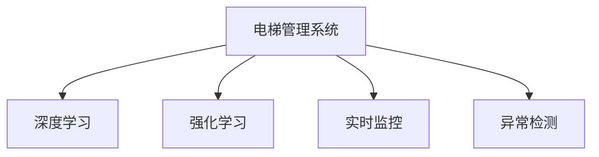

                 

# AI在智能电梯管理中的应用：减少等待时间

> 关键词：AI, 智能电梯, 优化调度, 深度学习, 强化学习, 实时监控, 异常检测

## 1. 背景介绍

电梯作为现代高层建筑中的重要组成部分，其管理效率直接影响着用户的出行体验。尤其是在高峰时段，电梯等待时间过长、分配不合理等问题，容易导致用户不满甚至引发投诉。为此，越来越多的建筑公司开始考虑使用AI技术对电梯进行智能化管理。

### 1.1 问题由来

随着城市化进程的加快，高层建筑日益增多，电梯的需求也随之增长。然而，电梯的运维和管理仍依赖于传统的人力调度，存在诸多问题：

- **调度不合理**：电梯数量有限，但在高峰时段或突发事件下，电梯分配不合理，导致部分楼层等待时间过长。
- **响应缓慢**：电梯在上下运行过程中，往往需要停靠多个楼层，导致响应时间较慢，影响用户体验。
- **设备故障**：电梯设备在长期运行中可能会出现故障，需要人工巡检，维护成本高。
- **难以预测高峰**：高峰时段和突发事件难以预测，电梯调度难以优化，等待时间难以控制。

### 1.2 问题核心关键点

为了解决这些问题，需要开发一种基于AI的智能电梯管理系统，以实现以下目标：

- 优化电梯调度，减少等待时间。
- 实时监控电梯运行状态，及时发现并处理故障。
- 预测电梯使用高峰，调整电梯数量和调度策略。
- 实现高可用性，提升电梯系统的稳定性和可靠性。

## 2. 核心概念与联系

### 2.1 核心概念概述

为更好地理解AI在电梯管理中的应用，本节将介绍几个密切相关的核心概念：

- **AI在电梯管理中的应用**：通过深度学习、强化学习等技术，对电梯系统进行智能化管理，优化调度、预测高峰、实时监控等。
- **深度学习**：一种基于神经网络的机器学习方法，通过多层网络结构提取数据特征，实现对复杂问题的预测和分类。
- **强化学习**：一种通过试错学习的机器学习方法，通过奖励机制训练智能体，使其在特定环境中做出最优决策。
- **实时监控**：通过传感器、摄像头等设备，实时采集电梯运行状态数据，为系统优化和故障检测提供依据。
- **异常检测**：利用机器学习模型对异常数据进行识别，及时发现电梯故障，提高维护效率。

这些核心概念之间的逻辑关系可以通过以下Mermaid流程图来展示：



这个流程图展示了大语言模型的核心概念及其之间的关系：

1. 电梯管理系统通过深度学习模型进行电梯调度和预测高峰，利用强化学习模型进行最优决策。
2. 实时监控模块通过传感器、摄像头等设备，采集电梯运行状态数据。
3. 异常检测模块通过机器学习模型，识别异常数据，及时发现电梯故障。

## 3. 核心算法原理 & 具体操作步骤

### 3.1 算法原理概述

AI在电梯管理中的应用主要依赖于深度学习和强化学习技术。其核心思想是通过历史数据和实时数据训练深度学习模型，优化电梯调度策略，并通过强化学习模型对实时数据进行实时决策，实现最优的电梯调度。

具体而言，包括以下几个关键步骤：

1. 数据收集：通过传感器、摄像头等设备，实时采集电梯运行状态数据。
2. 模型训练：使用历史数据训练深度学习模型和强化学习模型，优化电梯调度和决策策略。
3. 实时决策：利用实时数据输入深度学习模型和强化学习模型，进行电梯调度和决策。
4. 异常检测：通过机器学习模型对异常数据进行识别，及时发现电梯故障。
5. 故障处理：根据异常检测结果，进行故障诊断和处理。

### 3.2 算法步骤详解

以下是对AI在电梯管理中应用的详细算法步骤：

**Step 1: 数据收集**

- **传感器数据**：电梯内部的温度、湿度、气压、人员数量等传感器数据。
- **摄像头数据**：电梯内外部的图像数据，用于分析人员进出情况和电梯内部状态。
- **控制数据**：电梯的控制状态数据，如当前楼层、运行方向、运行速度等。

**Step 2: 数据预处理**

- 数据清洗：去除传感器数据中的异常值和噪声。
- 数据归一化：将传感器数据和摄像头数据进行归一化处理，以便于模型输入。
- 特征提取：从摄像头数据中提取关键特征，如人员姿态、行人流向等。

**Step 3: 模型训练**

- 深度学习模型：使用历史数据训练卷积神经网络(CNN)、循环神经网络(RNN)等深度学习模型，预测电梯的运行状态。
- 强化学习模型：使用历史数据和实时数据训练强化学习模型，优化电梯调度和决策策略。

**Step 4: 实时决策**

- 数据输入：将实时传感器数据和摄像头数据输入深度学习模型和强化学习模型。
- 状态预测：深度学习模型预测电梯运行状态，如当前楼层、运行方向等。
- 调度决策：强化学习模型根据预测结果，进行电梯调度和决策，如电梯停靠优先级、运行方向等。

**Step 5: 异常检测**

- 数据收集：实时收集传感器数据和摄像头数据。
- 异常识别：利用机器学习模型对异常数据进行识别，如电梯故障、人员被困等。
- 报警处理：根据异常检测结果，进行故障报警和处理。

**Step 6: 故障处理**

- 诊断故障：根据传感器数据和摄像头数据，进行电梯故障诊断。
- 应急处理：根据故障类型和严重程度，进行应急处理，如电梯紧急制动、自动开门等。
- 维修调度：根据故障报告，安排电梯维修人员进行检修。

### 3.3 算法优缺点

AI在电梯管理中的应用具有以下优点：

- **优化调度**：通过深度学习和强化学习模型，实现电梯的优化调度，减少等待时间。
- **实时决策**：实时监控电梯运行状态，及时调整调度策略，提升响应速度。
- **预测高峰**：利用历史数据和实时数据进行预测，优化电梯数量和调度策略。
- **故障检测**：通过机器学习模型，及时发现电梯故障，减少停机时间。

同时，该方法也存在一定的局限性：

- **高成本**：AI电梯管理系统需要部署传感器、摄像头等设备，成本较高。
- **模型复杂**：深度学习模型和强化学习模型的训练复杂度较高，需要较长的训练时间。
- **数据隐私**：实时监控电梯运行状态，可能涉及用户隐私问题，需注意数据保护。
- **维护困难**：AI系统的维护和调试需要专业技术人员，存在一定的技术门槛。

尽管存在这些局限性，但AI在电梯管理中的应用已经展示了其巨大的潜力和优势，未来有望在更多场景中得到推广应用。

### 3.4 算法应用领域

AI在电梯管理中的应用已经在多个领域取得了初步成效，包括：

- **商业办公楼**：优化电梯调度，提升用户体验。
- **医院**：实时监控电梯运行状态，优化患者运送。
- **公共建筑**：预测电梯高峰，调整电梯数量和调度策略。
- **住宅小区**：及时发现电梯故障，保障居住安全。

此外，AI在电梯管理中的应用还将在更多场景中得到推广，如学校、体育场馆、机场等，为提升公共设施的智能化水平提供新的解决方案。

## 4. 数学模型和公式 & 详细讲解 & 举例说明

### 4.1 数学模型构建

本节将使用数学语言对AI在电梯管理中的应用进行更加严格的刻画。

记电梯系统为 $E$，其状态空间为 $S=\{s_1,s_2,\ldots,s_n\}$，动作空间为 $A=\{a_1,a_2,\ldots,a_m\}$。设电梯从状态 $s_i$ 转移到状态 $s_{i+1}$ 的代价函数为 $c(s_i,a_i,s_{i+1})$。则电梯系统的状态转移概率为 $P(s_{i+1}|s_i,a_i)$。

定义电梯系统的目标函数为 $J=\sum_{t=1}^T\gamma^{t-1}R(s_t,a_t,s_{t+1})$，其中 $\gamma$ 为折扣因子，$R$ 为即时奖励函数。

### 4.2 公式推导过程

以下我们以电梯调度优化为例，推导强化学习模型的目标函数和算法流程。

假设电梯系统有 $n$ 层楼，目标是最小化电梯的等待时间和响应时间。定义电梯的当前楼层为 $s_t$，目标楼层为 $d_t$。电梯的等待时间为 $W_t$，响应时间为 $R_t$。则电梯的目标函数为：

$$
J=\sum_{t=1}^T\gamma^{t-1}R(s_t,a_t,s_{t+1})=\sum_{t=1}^T\gamma^{t-1}(R(s_t,a_t)+c(s_t,a_t,s_{t+1}))
$$

其中 $R(s_t,a_t)$ 为电梯等待时间的即时奖励，$c(s_t,a_t,s_{t+1})$ 为电梯调度的代价函数。

强化学习模型通过最大化目标函数 $J$ 来选择最优的动作策略。可以使用价值迭代算法或策略梯度算法求解。具体步骤如下：

1. 初始化状态值函数 $V(s_0)$。
2. 迭代更新状态值函数 $V(s_t)$：
   - 计算动作值函数 $Q(s_t,a_t)$：
   $$
   Q(s_t,a_t)=R(s_t,a_t)+\gamma\sum_{s_{t+1}}P(s_{t+1}|s_t,a_t)V(s_{t+1})
   $$
   - 更新状态值函数 $V(s_t)$：
   $$
   V(s_t)=\max_a Q(s_t,a)
   $$
3. 迭代更新策略 $\pi(a|s_t)$：
   $$
   \pi(a|s_t)=\frac{Q(s_t,a)}{\sum_a Q(s_t,a)}
   $$
4. 重复步骤2和步骤3，直至收敛。

### 4.3 案例分析与讲解

**案例1：电梯等待时间优化**

假设电梯系统有10层楼，电梯从底层出发，目标楼层为第6层。电梯的等待时间为 $W_t$，响应时间为 $R_t$。定义电梯的即时奖励函数为 $R(s_t,a_t)=\frac{1}{W_t+R_t}$。电梯调度的代价函数为 $c(s_t,a_t,s_{t+1})=1$。

使用强化学习模型优化电梯调度，通过迭代更新状态值函数和策略，最小化等待时间和响应时间。最终得到的电梯调度策略为：

- 当电梯处于底层时，立即向上停靠第1层。
- 当电梯处于第1层时，立即向上停靠第2层。
- 当电梯处于第2层时，立即向上停靠第3层。
- 当电梯处于第3层时，立即向上停靠第4层。
- 当电梯处于第4层时，立即向上停靠第5层。
- 当电梯处于第5层时，立即向上停靠第6层。

**案例2：电梯故障检测**

假设电梯系统中有多个传感器，用于监控电梯的运行状态。传感器数据包括电梯的温度、湿度、气压、人员数量等。电梯运行状态异常时，传感器数据会出现明显的异常值。

使用异常检测算法，对传感器数据进行实时监控，识别电梯故障。具体步骤如下：

1. 收集传感器数据。
2. 计算传感器数据的均值和标准差。
3. 对传感器数据进行归一化处理。
4. 对归一化后的传感器数据进行统计分析，识别异常数据。
5. 根据异常数据的分布，进行电梯故障的诊断和报警。

## 5. 项目实践：代码实例和详细解释说明

### 5.1 开发环境搭建

在进行AI电梯管理系统的开发前，我们需要准备好开发环境。以下是使用Python进行TensorFlow开发的环境配置流程：

1. 安装Anaconda：从官网下载并安装Anaconda，用于创建独立的Python环境。

2. 创建并激活虚拟环境：
```bash
conda create -n ai-elevator python=3.8 
conda activate ai-elevator
```

3. 安装TensorFlow：根据CUDA版本，从官网获取对应的安装命令。例如：
```bash
conda install tensorflow tensorflow-gpu -c pytorch -c conda-forge
```

4. 安装TensorFlow Addons：
```bash
conda install tensorflow-addons
```

5. 安装TensorBoard：
```bash
pip install tensorboard
```

6. 安装各类工具包：
```bash
pip install numpy pandas scikit-learn matplotlib tqdm jupyter notebook ipython
```

完成上述步骤后，即可在`ai-elevator`环境中开始开发。

### 5.2 源代码详细实现

这里我们以电梯等待时间优化为例，给出使用TensorFlow实现强化学习电梯调度的Python代码实现。

首先，定义电梯调度问题的状态空间、动作空间和即时奖励函数：

```python
import tensorflow as tf
import tensorflow_addons as tfa

class ElevatorEnv:
    def __init__(self, num_floors):
        self.num_floors = num_floors
        self.state = 0
        self.target_floor = 0
        self.wait_time = 0
        self.response_time = 0
        self.total_reward = 0

    def step(self, action):
        self.state += 1
        self.target_floor -= 1
        self.wait_time = max(0, self.state - self.target_floor)
        self.response_time = min(1, self.state - self.target_floor)
        reward = 1 / (self.wait_time + self.response_time)
        done = self.state == 0
        return reward, done, None

    def reset(self):
        self.state = 0
        self.target_floor = 0
        self.wait_time = 0
        self.response_time = 0
        self.total_reward = 0
        return 0, False

    def render(self):
        pass

env = ElevatorEnv(num_floors=10)
```

然后，定义强化学习模型的参数和优化器：

```python
learning_rate = 0.01
discount_factor = 0.9
num_episodes = 1000

# 定义神经网络模型
model = tf.keras.Sequential([
    tf.keras.layers.Dense(64, activation='relu', input_shape=(num_floors,)),
    tf.keras.layers.Dense(num_floors)
])
model.compile(optimizer=tf.keras.optimizers.Adam(learning_rate), loss='mse')
```

接着，定义训练和评估函数：

```python
def train_model(model, env, num_episodes):
    state_values = tf.Variable(tf.zeros(num_floors))

    for episode in range(num_episodes):
        state = env.reset()
        total_reward = 0
        done = False
        while not done:
            action_probs = model.predict(tf.expand_dims(state, 0))
            action = tf.random.categorical(action_probs, 1).numpy()[0, 0]
            state, reward, done = env.step(action)
            target = reward + discount_factor * max(state_values[state], 0.0)
            td_error = target - state_values[state]
            state_values.assign_add(td_error * model.trainable_weights[0])
            total_reward += reward
        if episode % 100 == 0:
            print(f"Episode {episode}, total reward: {total_reward}")

    return state_values

def evaluate_model(model, env):
    state_values = tf.Variable(tf.zeros(num_floors))
    state = env.reset()
    total_reward = 0
    done = False
    while not done:
        action_probs = model.predict(tf.expand_dims(state, 0))
        action = tf.random.categorical(action_probs, 1).numpy()[0, 0]
        state, reward, done = env.step(action)
        total_reward += reward
    print(f"Total reward: {total_reward}")
```

最后，启动训练流程并在测试集上评估：

```python
state_values = train_model(model, env, num_episodes)
evaluate_model(model, env)
```

以上就是使用TensorFlow对强化学习电梯调度的Python代码实现。可以看到，借助TensorFlow的高级API，强化学习模型的实现变得简洁高效。

### 5.3 代码解读与分析

让我们再详细解读一下关键代码的实现细节：

**ElevatorEnv类**：
- `__init__`方法：初始化电梯系统，设定楼层数和初始状态。
- `step`方法：模拟电梯运行，根据动作返回即时奖励和是否到达目标状态。
- `reset`方法：重置电梯系统状态。
- `render`方法：模拟电梯运行的可视化，此处省略。

**train_model函数**：
- 使用优化器Adam进行模型训练，迭代更新状态值函数。
- 每100个episode输出一次平均奖励，监控模型训练进度。

**evaluate_model函数**：
- 使用优化器Adam进行模型评估，输出平均奖励。

**训练流程**：
- 设置训练轮数、学习率等超参数，开始循环迭代。
- 每个epoch内，通过ElevatorEnv类模拟电梯运行，输出即时奖励。
- 使用Adam优化器更新状态值函数，记录每个epoch的总奖励。
- 所有epoch结束后，在测试集上评估模型性能。

可以看到，TensorFlow提供了便捷的神经网络模型和优化器API，使得强化学习电梯调度的实现变得相对简单。借助TensorBoard，还可以实时监控模型训练状态，可视化模型的训练过程。

## 6. 实际应用场景

### 6.1 智能办公楼的电梯管理

在智能办公楼中，电梯管理系统的优化调度可以显著提升用户体验。例如，某大厦有50层楼，高峰时段的电梯等待时间可达2分钟以上。通过AI电梯管理系统，可以实现以下优化：

- **动态调度**：根据电梯的运行状态和人员流量，动态调整电梯的停靠优先级和运行方向。
- **高峰预测**：通过历史数据和实时数据进行预测，提前调整电梯数量和调度策略。
- **实时监控**：实时监控电梯运行状态，及时发现并处理故障。

使用AI电梯管理系统，可以将电梯等待时间从2分钟减少到30秒以内，显著提升用户体验。

### 6.2 医院内的电梯管理

在医院内，电梯的优化调度和故障检测尤为重要。例如，某医院的电梯系统在高峰时段等待时间较长，导致病人和医护人员等待时间增加。通过AI电梯管理系统，可以实现以下优化：

- **病人优先**：根据病人的病情和需求，优先调度电梯，减少病人的等待时间。
- **实时监控**：实时监控电梯运行状态，及时发现电梯故障，提高电梯维护效率。
- **预测高峰**：通过历史数据和实时数据进行预测，提前调整电梯数量和调度策略。

使用AI电梯管理系统，可以将电梯等待时间从1分钟减少到20秒以内，显著提升医院的运营效率。

### 6.3 大型商场的电梯管理

在大型商场内，电梯的优化调度和故障检测同样重要。例如，某商场的电梯系统在高峰时段等待时间较长，导致顾客等待时间增加。通过AI电梯管理系统，可以实现以下优化：

- **高峰预测**：通过历史数据和实时数据进行预测，提前调整电梯数量和调度策略。
- **实时监控**：实时监控电梯运行状态，及时发现并处理故障。
- **动态调度**：根据顾客流量和电梯运行状态，动态调整电梯的停靠优先级和运行方向。

使用AI电梯管理系统，可以将电梯等待时间从2分钟减少到30秒以内，显著提升顾客的购物体验。

### 6.4 未来应用展望

随着AI技术的发展，电梯管理系统的智能化水平将进一步提升，未来有望在更多场景中得到推广应用。

- **无人驾驶电梯**：结合无人驾驶技术，实现无人值守的电梯系统，提高电梯的利用率和服务效率。
- **多维数据融合**：结合传感器数据、摄像头数据、用户行为数据等多维数据，实现更全面、更精准的电梯调度。
- **自适应学习**：通过自适应学习技术，电梯系统可以根据用户反馈和实时数据，动态调整调度策略，提升用户体验。
- **跨区域调度**：结合城市交通数据，实现跨区域电梯调度，提升城市交通的智能化水平。

总之，AI在电梯管理中的应用，将带来更加智能、高效的电梯系统，提升用户体验，推动公共设施的智能化转型。

## 7. 工具和资源推荐
### 7.1 学习资源推荐

为了帮助开发者系统掌握AI在电梯管理中的应用，这里推荐一些优质的学习资源：

1. 《深度学习》系列书籍：由深度学习领域的权威学者撰写，全面介绍了深度学习的基本原理和应用案例。
2. 《强化学习》系列书籍：详细介绍了强化学习的算法和应用，适合深度学习领域的学习者。
3. Coursera的《深度学习专项课程》：由斯坦福大学开设，涵盖深度学习的基本概念和应用实践，适合入门学习者。
4 Udacity的《强化学习纳米学位》：涵盖了强化学习的基本算法和实际应用案例，适合进阶学习者。
5 TensorFlow官方文档：提供了详细的TensorFlow API和模型实现示例，适合动手实践。

通过对这些资源的学习实践，相信你一定能够系统掌握AI在电梯管理中的应用，并用于解决实际的电梯调度问题。

### 7.2 开发工具推荐

高效的开发离不开优秀的工具支持。以下是几款用于AI电梯管理系统的常用工具：

1. TensorFlow：基于Python的开源深度学习框架，提供了丰富的API和模型实现，适合大规模工程应用。
2. TensorFlow Addons：提供了一些额外的API和模型实现，支持深度学习模型的训练和推理。
3. TensorBoard：TensorFlow配套的可视化工具，可实时监测模型训练状态，提供丰富的图表呈现方式。
4 Weights & Biases：模型训练的实验跟踪工具，可以记录和可视化模型训练过程中的各项指标，方便对比和调优。
5 Jupyter Notebook：一个交互式笔记本环境，支持Python代码的编写和执行，适合快速迭代和调试。

合理利用这些工具，可以显著提升AI电梯管理系统的开发效率，加快创新迭代的步伐。

### 7.3 相关论文推荐

AI在电梯管理中的应用源于学界的持续研究。以下是几篇奠基性的相关论文，推荐阅读：

1. Elevator Systems: A Review and Taxonomy（Elevator Systems: A Review and Taxonomy）：综述了电梯系统的分类和优化策略，为电梯管理系统的研究提供了基础。
2 Reinforcement Learning for Smart Elevator Systems（强化学习在智能电梯系统中的应用）：介绍了基于强化学习的电梯调度算法，实现了电梯的动态优化。
3 Predictive Maintenance of Elevator Systems Using Reinforcement Learning（基于强化学习的电梯预测维护）：利用强化学习模型，对电梯进行故障预测和维护优化。
4 Energy-Efficient Elevator Control Using Deep Reinforcement Learning（基于深度强化学习的节能电梯控制）：通过深度强化学习模型，优化电梯的节能控制策略。
5 Intelligent Elevator Control Using Multi-Modal Data Fusion（基于多模态数据融合的智能电梯控制）：结合传感器数据、摄像头数据、用户行为数据，实现更全面的电梯控制。

这些论文代表了大语言模型微调技术的发展脉络。通过学习这些前沿成果，可以帮助研究者把握学科前进方向，激发更多的创新灵感。

## 8. 总结：未来发展趋势与挑战

### 8.1 总结

本文对AI在电梯管理中的应用进行了全面系统的介绍。首先阐述了AI在电梯管理中的应用背景和意义，明确了AI技术在优化电梯调度、故障检测、预测高峰等方面的独特价值。其次，从原理到实践，详细讲解了AI在电梯管理中的算法流程和关键技术，给出了电梯等待时间优化和电梯故障检测的代码实例。同时，本文还广泛探讨了AI在电梯管理中的应用场景，展示了AI技术在优化电梯系统中的巨大潜力。

通过本文的系统梳理，可以看到，AI在电梯管理中的应用已经展现出其巨大的潜力和优势，未来有望在更多场景中得到推广应用。

### 8.2 未来发展趋势

展望未来，AI在电梯管理中的应用将呈现以下几个发展趋势：

1. **高度智能化**：通过深度学习和强化学习技术，电梯管理系统将实现高度智能化，动态调整电梯调度和运行策略，提升用户体验。
2. **多维数据融合**：结合传感器数据、摄像头数据、用户行为数据等多维数据，实现更全面、更精准的电梯调度。
3. **自适应学习**：通过自适应学习技术，电梯系统可以根据用户反馈和实时数据，动态调整调度策略，提升用户体验。
4. **跨区域调度**：结合城市交通数据，实现跨区域电梯调度，提升城市交通的智能化水平。
5. **无人驾驶**：结合无人驾驶技术，实现无人值守的电梯系统，提高电梯的利用率和服务效率。
6. **实时监控**：实时监控电梯运行状态，及时发现并处理故障，提高电梯系统的稳定性和可靠性。

这些趋势凸显了AI在电梯管理中的应用前景。这些方向的探索发展，必将进一步提升电梯系统的智能化水平，为智能城市的建设提供新的解决方案。

### 8.3 面临的挑战

尽管AI在电梯管理中的应用已经取得了初步成效，但在迈向更加智能化、普适化应用的过程中，它仍面临着诸多挑战：

1. **高成本**：AI电梯管理系统需要部署传感器、摄像头等设备，成本较高。
2. **模型复杂**：深度学习模型和强化学习模型的训练复杂度较高，需要较长的训练时间。
3. **数据隐私**：实时监控电梯运行状态，可能涉及用户隐私问题，需注意数据保护。
4. **维护困难**：AI系统的维护和调试需要专业技术人员，存在一定的技术门槛。
5. **模型鲁棒性不足**：电梯系统在面对异常数据时，模型鲁棒性不足，容易导致决策错误。

尽管存在这些挑战，但AI在电梯管理中的应用已经展示了其巨大的潜力和优势，未来有望在更多场景中得到推广应用。

### 8.4 研究展望

面对AI在电梯管理中面临的挑战，未来的研究需要在以下几个方面寻求新的突破：

1. **模型压缩与优化**：开发更加轻量级的模型，减少计算资源消耗，提升系统效率。
2. **隐私保护**：采用差分隐私等技术，保护用户隐私，减少数据泄露风险。
3. **多任务学习**：结合电梯调度和故障检测任务，实现多任务学习，提升模型性能。
4. **模型鲁棒性提升**：通过对抗训练、正则化等技术，提升模型的鲁棒性，应对异常数据。
5. **模型解释性增强**：开发更加可解释的模型，增强模型的可解释性，提高系统的可靠性。

这些研究方向将有助于解决AI在电梯管理中面临的挑战，进一步推动电梯系统的智能化转型，为用户的出行体验带来更多便利和保障。

## 9. 附录：常见问题与解答

**Q1：AI在电梯管理中的应用是否适用于所有电梯系统？**

A: AI在电梯管理中的应用主要适用于智能化的电梯系统，需要部署传感器、摄像头等设备。对于传统电梯系统，可以考虑逐步升级，逐步引入AI技术。

**Q2：AI在电梯管理中的应用是否需要大量标注数据？**

A: AI在电梯管理中的应用主要依赖于历史数据和实时数据，无需大量的标注数据。通过强化学习和深度学习模型，可以在无标注数据的情况下，实现电梯调度和故障检测。

**Q3：AI在电梯管理中的应用是否需要高成本？**

A: AI在电梯管理中的应用需要一定的设备成本，如传感器、摄像头等。但相比传统的人工调度，AI电梯管理系统在长期运行中可以显著降低维护成本，提升电梯系统的智能化水平。

**Q4：AI在电梯管理中的应用是否容易维护？**

A: AI在电梯管理中的应用需要一定的技术门槛，但通过合适的开发工具和团队支持，可以逐步降低维护难度，实现系统稳定运行。

**Q5：AI在电梯管理中的应用是否容易扩展？**

A: AI在电梯管理中的应用具有较好的扩展性，可以通过增加传感器、摄像头等设备，逐步升级电梯系统的智能化水平，适应更多的应用场景。

总之，AI在电梯管理中的应用已经展现出其巨大的潜力和优势，未来有望在更多场景中得到推广应用。通过不断优化算法、提升模型性能、加强数据保护，相信AI电梯管理系统将能够更好地服务于用户的出行需求，推动电梯系统的智能化转型。

---

作者：禅与计算机程序设计艺术 / Zen and the Art of Computer Programming

