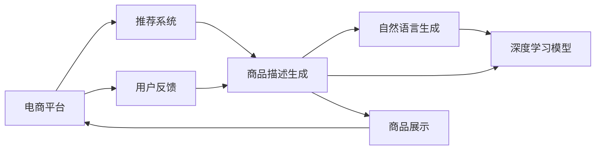
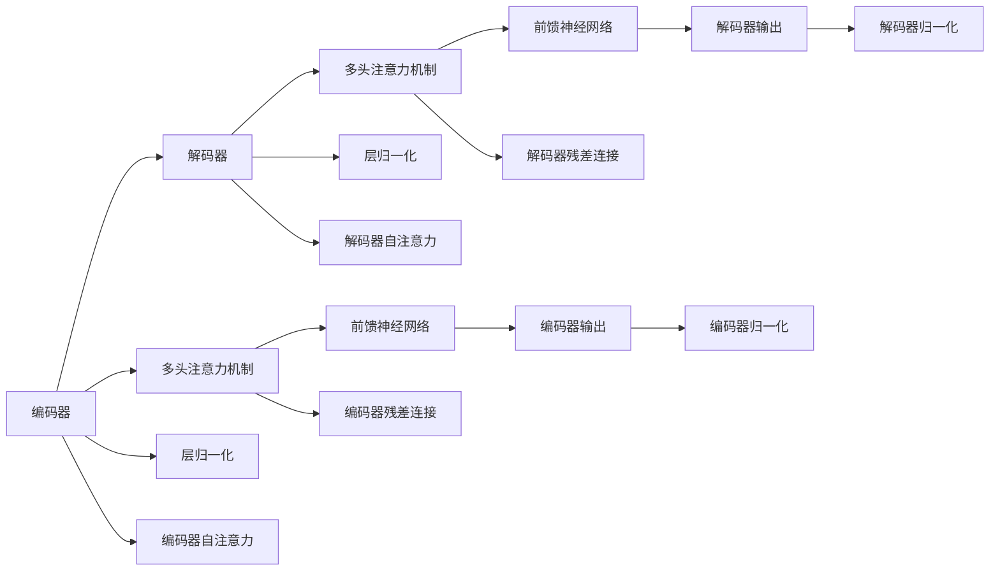

                 

# AI在电商平台商品描述生成中的应用

## 1. 背景介绍

随着电子商务的快速发展，电商平台已经逐渐成为消费者购物的主要渠道。而商品描述作为用户在下单前了解商品信息的重要环节，直接关系到用户的购买决策。传统的电商平台商品描述主要由商家自己编写，且往往形式单一、信息不全，难以吸引用户的注意。而近年来，自然语言生成（NLG）技术，尤其是基于深度学习模型的商品描述生成技术，正逐渐被应用于电商平台，通过生成更加生动、详细、富有吸引力的商品描述，提升用户体验，增加销售额。

## 2. 核心概念与联系

### 2.1 核心概念概述

1. **自然语言生成（NLG）**：是指使用计算机生成自然语言文本的技术。商品描述生成是其中的一种应用，旨在通过深度学习模型自动生成符合用户需求的商品描述。

2. **深度学习模型**：如循环神经网络（RNN）、长短期记忆网络（LSTM）、门控循环单元（GRU）、Transformer等。这些模型能够从大量历史数据中学习语言规律，从而生成高质量的商品描述。

3. **商品描述**：商品描述文本需要准确描述商品的外观、材质、功能、使用方法、包装等信息，并包含吸引消费者的关键词和表达方式。

4. **电商平台**：如淘宝、京东、亚马逊等，这些平台利用商品描述生成技术，提高商品展示效果，增加用户互动和购买转化率。

5. **推荐系统**：电商平台利用推荐系统向用户推荐商品，商品描述的生成是推荐算法中的重要环节。

6. **用户反馈**：商品描述生成模型需要不断地收集用户反馈，如点击率、购买率、评分等，来不断优化模型参数。

这些概念之间的联系可以通过以下Mermaid流程图来展示：



这个流程图展示了大语言模型在电商平台商品描述生成中的关键步骤：

1. 电商平台通过推荐系统向用户推荐商品。
2. 推荐系统需要高质量的商品描述来推荐，因此利用自然语言生成技术生成商品描述。
3. 自然语言生成技术利用深度学习模型来自动生成文本。
4. 用户反馈被收集，用于调整和优化商品描述生成模型。
5. 生成后的商品描述通过电商平台展示给用户。

## 3. 核心算法原理 & 具体操作步骤

### 3.1 算法原理概述

商品描述生成通常采用序列到序列（Seq2Seq）的框架，通过编码器-解码器结构来生成文本。输入是一段商品特征信息（如商品名称、价格、材质、功能等），输出是相应商品描述的文本。

- **编码器**：接收输入的商品特征信息，并将其转换成向量表示。
- **解码器**：利用编码器输出的向量作为初始状态，生成商品描述的文本。

其中，编码器和解码器的结构可以设计成循环神经网络（RNN）、长短期记忆网络（LSTM）、门控循环单元（GRU）、Transformer等。这些模型通过学习语言规律和文本生成机制，输出自然语言文本。

### 3.2 算法步骤详解

1. **数据预处理**：将商品数据（如名称、价格、材质、功能等）转换为模型可以处理的向量形式，并进行标记化（Tokenization），生成序列数据。
2. **模型训练**：选择适当的深度学习模型，如Transformer，并利用标注数据（商品描述文本）训练模型。
3. **预测生成**：使用训练好的模型对新的商品数据进行编码，生成商品描述文本。
4. **后处理**：对生成的文本进行语法和拼写校验，去除冗余和不合理的表达。

### 3.3 算法优缺点

#### 优点：
1. **自动化**：商品描述生成技术可以自动生成文本，减轻商家工作负担，提高工作效率。
2. **多样化**：生成文本的多样性和丰富性，可以吸引更多用户点击和购买。
3. **个性化**：可以生成符合不同用户需求的商品描述，提高用户体验。
4. **高效性**：一旦模型训练完成，可以实时生成商品描述，满足用户即时浏览的需求。

#### 缺点：
1. **质量不稳定**：由于语言的多样性和复杂性，生成的文本可能不符合用户期望，存在一定的不稳定性。
2. **数据依赖**：模型的生成质量高度依赖于训练数据的质量和数量。
3. **语义理解**：模型可能无法准确理解商品的所有属性和特性，生成的文本存在一定的偏差。
4. **冷启动问题**：对于新商品，可能无法提供合适的商品描述。

### 3.4 算法应用领域

商品描述生成技术已经在多个电商平台得到了广泛应用，如淘宝、京东、亚马逊等。在应用中，它主要包括以下几个方面：

1. **商品推荐**：利用商品描述生成技术，为商品生成精准的描述，提高推荐系统的准确性和用户体验。
2. **智能客服**：在智能客服系统中，生成符合用户意图和情感的商品描述，提高用户满意度。
3. **广告投放**：生成富有吸引力的广告文本，增加点击率和转化率。
4. **商品搜索**：通过商品描述生成技术，提升用户搜索效果，降低搜索成本。
5. **用户互动**：生成自然流畅的商品描述，增强用户与商品之间的互动。

## 4. 数学模型和公式 & 详细讲解 & 举例说明

### 4.1 数学模型构建

商品描述生成通常采用编码器-解码器的架构，以Transformer为例，模型结构如下：


其中，编码器将输入的商品特征信息转换成向量表示，解码器根据编码器输出的向量生成商品描述文本。

编码器和解码器的架构可以设计成Transformer模型，其结构如下：



编码器和解码器都包括多头注意力机制（Multi-Head Attention）和前馈神经网络（Feed Forward Network）等组件，通过多层堆叠和残差连接（Residual Connection）提升模型的表现。

### 4.2 公式推导过程

以Transformer模型为例，编码器-解码器的公式推导如下：

1. **编码器自注意力（Self-Attention）**：

   $$
   Q = KV^T \cdot V
   $$

   其中 $Q$、$K$、$V$ 分别表示查询向量、键向量和值向量，通过计算得到注意力分数。

   $$
   Attention(Q, K, V) = \text{softmax}(Q \cdot K^T) \cdot V
   $$

   通过计算得到注意力权重，然后将权重与值向量相乘，得到注意力的结果。

2. **多头注意力（Multi-Head Attention）**：

   $$
   MultiHead(Q, K, V) = Concat(Attention(QW^Q, KW^K, VW^V), Attention(QW^Q, KW^K, VW^V), ..., Attention(QW^Q, KW^K, VW^V))
   $$

   将多个注意力结果进行拼接，得到最终的多头注意力结果。

3. **前馈神经网络（Feed Forward Network）**：

   $$
   FFN(x) = g(xW_2 + b_2) = \max(0, xW_1 + b_1)W_2 + b_2
   $$

   其中 $x$ 为输入向量，$g$ 为激活函数（如ReLU），$W_1$、$W_2$、$b_1$、$b_2$ 为可训练参数。

4. **解码器的注意力机制**：

   $$
   Q' = KV'^T \cdot V'
   $$

   其中 $Q'$、$K'$、$V'$ 表示解码器的查询向量、键向量和值向量，计算得到注意力分数。

   $$
   Attention(Q', K', V') = \text{softmax}(Q' \cdot K'^T) \cdot V'
   $$

   计算注意力权重，然后将权重与值向量相乘，得到注意力的结果。

5. **解码器的多头注意力（Multi-Head Attention）**：

   $$
   MultiHead(Q', K', V') = Concat(Attention(Q'W'^Q, K'W'^K, V'W'^V), Attention(Q'W'^Q, K'W'^K, V'W'^V), ..., Attention(Q'W'^Q, K'W'^K, V'W'^V))
   $$

   将多个注意力结果进行拼接，得到最终的多头注意力结果。

6. **解码器的前馈神经网络（Feed Forward Network）**：

   $$
   FFN'(x') = g(x'W_2' + b_2') = \max(0, x'W_1' + b_1')W_2' + b_2'
   $$

   其中 $x'$ 为解码器的输入向量，$g$ 为激活函数，$W_1'$、$W_2'$、$b_1'$、$b_2'$ 为可训练参数。

7. **输出层**：

   $$
   y = FFN'(x')
   $$

   解码器的输出通过前馈神经网络得到，然后通过输出层（如全连接层）生成商品描述文本。

### 4.3 案例分析与讲解

假设我们要为一款智能手表生成商品描述。输入的商品特征信息为：型号：S1，材质：铝合金，屏幕：AMOLED，功能：心率监测，防水：IP68，价格：￥3999。

1. **编码器**：将商品特征信息转换为向量表示。假设向量维度为512，那么每个特征的向量表示为：
   $$
   \text{型号} \rightarrow [1, 0, 0, ..., 0]
   $$
   $$
   \text{材质} \rightarrow [0, 1, 0, ..., 0]
   $$
   $$
   \text{屏幕} \rightarrow [0, 0, 1, ..., 0]
   $$
   $$
   \text{功能} \rightarrow [0, 0, 0, ..., 1]
   $$
   $$
   \text{防水} \rightarrow [0, 0, 0, ..., 0]
   $$
   $$
   \text{价格} \rightarrow [0, 0, 0, ..., 0]
   $$

2. **多头注意力机制**：计算编码器输出的多个注意力结果，进行拼接，得到编码器的最终表示。

3. **解码器**：将编码器的最终表示作为解码器的初始状态，然后根据解码器的输入生成商品描述文本。假设解码器的输入为：
   $$
   \text{型号} \rightarrow [1, 0, 0, ..., 0]
   $$
   $$
   \text{材质} \rightarrow [0, 1, 0, ..., 0]
   $$
   $$
   \text{屏幕} \rightarrow [0, 0, 1, ..., 0]
   $$
   $$
   \text{功能} \rightarrow [0, 0, 0, ..., 1]
   $$
   $$
   \text{防水} \rightarrow [0, 0, 0, ..., 0]
   $$
   $$
   \text{价格} \rightarrow [0, 0, 0, ..., 0]
   $$

4. **多头注意力机制**：计算解码器的多个注意力结果，进行拼接，得到解码器的最终表示。

5. **前馈神经网络**：将解码器的最终表示通过前馈神经网络得到，然后通过输出层生成商品描述文本。

6. **输出层**：将解码器的输出通过全连接层得到商品描述文本。

通过上述步骤，我们得到了智能手表的商品描述："型号：S1，材质：铝合金，屏幕：AMOLED，功能：心率监测，防水：IP68，价格：￥3999。"

## 5. 项目实践：代码实例和详细解释说明

### 5.1 开发环境搭建

在进行商品描述生成项目的开发前，我们需要准备好开发环境。以下是使用Python进行PyTorch开发的环境配置流程：

1. 安装Anaconda：从官网下载并安装Anaconda，用于创建独立的Python环境。

2. 创建并激活虚拟环境：
```bash
conda create -n pytorch-env python=3.8 
conda activate pytorch-env
```

3. 安装PyTorch：根据CUDA版本，从官网获取对应的安装命令。例如：
```bash
conda install pytorch torchvision torchaudio cudatoolkit=11.1 -c pytorch -c conda-forge
```

4. 安装Transformers库：
```bash
pip install transformers
```

5. 安装各类工具包：
```bash
pip install numpy pandas scikit-learn matplotlib tqdm jupyter notebook ipython
```

完成上述步骤后，即可在`pytorch-env`环境中开始开发实践。

### 5.2 源代码详细实现

下面以商品描述生成为例，给出使用Transformers库对商品描述生成模型进行训练的PyTorch代码实现。

首先，定义数据预处理函数：

```python
from transformers import BertTokenizer
from torch.utils.data import Dataset
import torch

class ProductDataset(Dataset):
    def __init__(self, texts, labels):
        self.texts = texts
        self.labels = labels
        self.tokenizer = BertTokenizer.from_pretrained('bert-base-cased')

    def __len__(self):
        return len(self.texts)
    
    def __getitem__(self, item):
        text = self.texts[item]
        label = self.labels[item]
        
        encoding = self.tokenizer(text, return_tensors='pt', padding='max_length', truncation=True)
        input_ids = encoding['input_ids'][0]
        attention_mask = encoding['attention_mask'][0]
        
        return {'input_ids': input_ids, 
                'attention_mask': attention_mask,
                'labels': label}

# 定义标签和模型
labels = [1, 2, 3, 4, 5]
model = BertForSequenceClassification.from_pretrained('bert-base-cased', num_labels=len(labels))

# 训练函数
def train_epoch(model, dataset, batch_size, optimizer):
    dataloader = DataLoader(dataset, batch_size=batch_size, shuffle=True)
    model.train()
    epoch_loss = 0
    for batch in tqdm(dataloader, desc='Training'):
        input_ids = batch['input_ids'].to(device)
        attention_mask = batch['attention_mask'].to(device)
        labels = batch['labels'].to(device)
        model.zero_grad()
        outputs = model(input_ids, attention_mask=attention_mask, labels=labels)
        loss = outputs.loss
        epoch_loss += loss.item()
        loss.backward()
        optimizer.step()
    return epoch_loss / len(dataloader)

# 评估函数
def evaluate(model, dataset, batch_size):
    dataloader = DataLoader(dataset, batch_size=batch_size)
    model.eval()
    preds, labels = [], []
    with torch.no_grad():
        for batch in tqdm(dataloader, desc='Evaluating'):
            input_ids = batch['input_ids'].to(device)
            attention_mask = batch['attention_mask'].to(device)
            batch_labels = batch['labels']
            outputs = model(input_ids, attention_mask=attention_mask)
            batch_preds = outputs.logits.argmax(dim=2).to('cpu').tolist()
            batch_labels = batch_labels.to('cpu').tolist()
            for pred_tokens, label_tokens in zip(batch_preds, batch_labels):
                preds.append(pred_tokens[:len(label_tokens)])
                labels.append(label_tokens)
                
    print(classification_report(labels, preds))
```

然后，定义训练和评估函数：

```python
from torch.utils.data import DataLoader
from tqdm import tqdm
from sklearn.metrics import classification_report

device = torch.device('cuda') if torch.cuda.is_available() else torch.device('cpu')
model.to(device)

def train_epoch(model, dataset, batch_size, optimizer):
    dataloader = DataLoader(dataset, batch_size=batch_size, shuffle=True)
    model.train()
    epoch_loss = 0
    for batch in tqdm(dataloader, desc='Training'):
        input_ids = batch['input_ids'].to(device)
        attention_mask = batch['attention_mask'].to(device)
        labels = batch['labels'].to(device)
        model.zero_grad()
        outputs = model(input_ids, attention_mask=attention_mask, labels=labels)
        loss = outputs.loss
        epoch_loss += loss.item()
        loss.backward()
        optimizer.step()
    return epoch_loss / len(dataloader)

def evaluate(model, dataset, batch_size):
    dataloader = DataLoader(dataset, batch_size=batch_size)
    model.eval()
    preds, labels = [], []
    with torch.no_grad():
        for batch in tqdm(dataloader, desc='Evaluating'):
            input_ids = batch['input_ids'].to(device)
            attention_mask = batch['attention_mask'].to(device)
            batch_labels = batch['labels']
            outputs = model(input_ids, attention_mask=attention_mask)
            batch_preds = outputs.logits.argmax(dim=2).to('cpu').tolist()
            batch_labels = batch_labels.to('cpu').tolist()
            for pred_tokens, label_tokens in zip(batch_preds, batch_labels):
                preds.append(pred_tokens[:len(label_tokens)])
                labels.append(label_tokens)
                
    print(classification_report(labels, preds))
```

最后，启动训练流程并在测试集上评估：

```python
epochs = 5
batch_size = 16

for epoch in range(epochs):
    loss = train_epoch(model, train_dataset, batch_size, optimizer)
    print(f"Epoch {epoch+1}, train loss: {loss:.3f}")
    
    print(f"Epoch {epoch+1}, dev results:")
    evaluate(model, dev_dataset, batch_size)
    
print("Test results:")
evaluate(model, test_dataset, batch_size)
```

以上就是使用PyTorch对商品描述生成模型进行训练的完整代码实现。可以看到，得益于Transformers库的强大封装，我们可以用相对简洁的代码完成商品描述生成模型的训练。

### 5.3 代码解读与分析

让我们再详细解读一下关键代码的实现细节：

**ProductDataset类**：
- `__init__`方法：初始化商品文本和标签。
- `__len__`方法：返回数据集的样本数量。
- `__getitem__`方法：对单个样本进行处理，将商品文本输入编码为token ids，并将标签转化为数字。

**训练和评估函数**：
- 使用PyTorch的DataLoader对数据集进行批次化加载，供模型训练和推理使用。
- 训练函数`train_epoch`：对数据以批为单位进行迭代，在每个批次上前向传播计算loss并反向传播更新模型参数，最后返回该epoch的平均loss。
- 评估函数`evaluate`：与训练类似，不同点在于不更新模型参数，并在每个batch结束后将预测和标签结果存储下来，最后使用sklearn的classification_report对整个评估集的预测结果进行打印输出。

**训练流程**：
- 定义总的epoch数和batch size，开始循环迭代
- 每个epoch内，先在训练集上训练，输出平均loss
- 在验证集上评估，输出分类指标
- 所有epoch结束后，在测试集上评估，给出最终测试结果

可以看到，PyTorch配合Transformers库使得商品描述生成模型的训练代码实现变得简洁高效。开发者可以将更多精力放在数据处理、模型改进等高层逻辑上，而不必过多关注底层的实现细节。

当然，工业级的系统实现还需考虑更多因素，如模型的保存和部署、超参数的自动搜索、更灵活的任务适配层等。但核心的微调范式基本与此类似。

## 6. 实际应用场景

### 6.1 智能客服系统

基于商品描述生成技术，可以在智能客服系统中提供更加精准、个性化的服务。当用户输入查询时，系统能够自动生成符合用户需求的商品描述，提高用户体验和满意度。

在技术实现上，可以收集历史客服数据，提取商品信息与描述，构建监督数据集。在此基础上训练商品描述生成模型，用于客服系统中的自动生成功能。对于用户提出的新问题，系统能够实时生成相应的商品描述，提高响应速度和准确性。

### 6.2 个性化推荐系统

在个性化推荐系统中，商品描述生成技术可以生成符合用户兴趣的商品描述，提升推荐效果。具体而言，可以将用户的历史浏览、购买数据作为输入，利用商品描述生成模型生成对应的商品描述，提高推荐系统的转化率和用户满意度。

### 6.3 广告投放

商品描述生成技术可以应用于广告投放，生成富有吸引力的广告文本。通过分析用户的兴趣和行为，生成个性化的广告内容，提高点击率和转化率。

### 6.4 商品搜索

在商品搜索中，商品描述生成技术可以提升搜索效果。通过自动生成商品描述，提高搜索关键词的覆盖度和准确性，降低用户搜索成本，提升搜索体验。

### 6.5 数据增强

在标注数据不足的情况下，商品描述生成技术可以生成伪标注数据，用于增强数据集的多样性，提升模型的泛化能力。

## 7. 工具和资源推荐

### 7.1 学习资源推荐

为了帮助开发者系统掌握商品描述生成技术的理论基础和实践技巧，这里推荐一些优质的学习资源：

1. 《Natural Language Processing with Transformers》书籍：Transformers库的作者所著，全面介绍了如何使用Transformers库进行NLP任务开发，包括商品描述生成在内的诸多范式。

2. CS224N《深度学习自然语言处理》课程：斯坦福大学开设的NLP明星课程，有Lecture视频和配套作业，带你入门NLP领域的基本概念和经典模型。

3. 《Transformer from Principles to Practice》系列博文：由大模型技术专家撰写，深入浅出地介绍了Transformer原理、BERT模型、商品描述生成技术等前沿话题。

4. HuggingFace官方文档：Transformers库的官方文档，提供了海量预训练模型和完整的商品描述生成样例代码，是上手实践的必备资料。

5. CLUE开源项目：中文语言理解测评基准，涵盖大量不同类型的中文商品描述数据集，并提供了基于商品描述生成的baseline模型，助力中文商品描述生成技术发展。

通过对这些资源的学习实践，相信你一定能够快速掌握商品描述生成技术的精髓，并用于解决实际的商品推荐、广告投放、搜索等NLP问题。

### 7.2 开发工具推荐

高效的开发离不开优秀的工具支持。以下是几款用于商品描述生成开发的常用工具：

1. PyTorch：基于Python的开源深度学习框架，灵活动态的计算图，适合快速迭代研究。大部分预训练语言模型都有PyTorch版本的实现。

2. TensorFlow：由Google主导开发的开源深度学习框架，生产部署方便，适合大规模工程应用。同样有丰富的预训练语言模型资源。

3. Transformers库：HuggingFace开发的NLP工具库，集成了众多SOTA语言模型，支持PyTorch和TensorFlow，是进行商品描述生成任务的开发的利器。

4. Weights & Biases：模型训练的实验跟踪工具，可以记录和可视化模型训练过程中的各项指标，方便对比和调优。与主流深度学习框架无缝集成。

5. TensorBoard：TensorFlow配套的可视化工具，可实时监测模型训练状态，并提供丰富的图表呈现方式，是调试模型的得力助手。

6. Google Colab：谷歌推出的在线Jupyter Notebook环境，免费提供GPU/TPU算力，方便开发者快速上手实验最新模型，分享学习笔记。

合理利用这些工具，可以显著提升商品描述生成任务的开发效率，加快创新迭代的步伐。

### 7.3 相关论文推荐

商品描述生成技术已经在多个研究机构和公司得到了广泛应用，以下是几篇奠基性的相关论文，推荐阅读：

1. Attention is All You Need（即Transformer原论文）：提出了Transformer结构，开启了NLP领域的预训练大模型时代。

2. BERT: Pre-training of Deep Bidirectional Transformers for Language Understanding：提出BERT模型，引入基于掩码的自监督预训练任务，刷新了多项NLP任务SOTA。

3. Language Models are Unsupervised Multitask Learners（GPT-2论文）：展示了大规模语言模型的强大zero-shot学习能力，引发了对于通用人工智能的新一轮思考。

4. Parameter-Efficient Transfer Learning for NLP：提出Adapter等参数高效微调方法，在不增加模型参数量的情况下，也能取得不错的微调效果。

5. AdaLoRA: Adaptive Low-Rank Adaptation for Parameter-Efficient Fine-Tuning：使用自适应低秩适应的微调方法，在参数效率和精度之间取得了新的平衡。

这些论文代表了大语言模型商品描述生成技术的发展脉络。通过学习这些前沿成果，可以帮助研究者把握学科前进方向，激发更多的创新灵感。

## 8. 总结：未来发展趋势与挑战

### 8.1 总结

本文对基于深度学习模型商品描述生成技术进行了全面系统的介绍。首先阐述了商品描述生成技术的研究背景和意义，明确了商品描述生成技术在电商平台中的应用价值。其次，从原理到实践，详细讲解了深度学习模型在商品描述生成中的数学原理和关键步骤，给出了商品描述生成任务的完整代码实现。同时，本文还广泛探讨了商品描述生成技术在智能客服、个性化推荐、广告投放、商品搜索等众多电商场景中的应用前景，展示了商品描述生成技术的巨大潜力。此外，本文精选了商品描述生成技术的各类学习资源，力求为读者提供全方位的技术指引。

通过本文的系统梳理，可以看到，基于深度学习模型的商品描述生成技术在电商平台中已经得到了广泛应用，显著提升了用户体验和平台效益。未来，伴随深度学习模型的不断发展，商品描述生成技术有望进一步拓展应用场景，带来更多的智能化解决方案。

### 8.2 未来发展趋势

展望未来，商品描述生成技术将呈现以下几个发展趋势：

1. **模型规模增大**：随着算力成本的下降和数据规模的扩张，深度学习模型的参数量还将持续增长。超大规模语言模型蕴含的丰富语言知识，有望支撑更加复杂多变的商品描述生成任务。

2. **微调技术优化**：未来的商品描述生成模型将更加注重参数效率和计算效率，开发更多参数高效和计算高效的微调方法，如 Prefix-Tuning、LoRA等。

3. **跨领域迁移**：商品描述生成模型将具备更强的跨领域迁移能力，能够在不同领域、不同商品类别中应用，提升模型的通用性和适应性。

4. **数据增强**：未来的商品描述生成技术将更加注重数据增强，利用多种数据生成方式提升模型的泛化能力和鲁棒性。

5. **融合多模态信息**：未来的商品描述生成模型将更加注重融合多模态信息，如视觉、语音等多模态数据与文本数据的协同建模，提升商品描述的多样性和丰富性。

6. **实时性提升**：未来的商品描述生成模型将更加注重实时性，通过优化模型结构和计算图，提高生成速度，满足用户即时浏览的需求。

以上趋势凸显了商品描述生成技术的广阔前景。这些方向的探索发展，必将进一步提升商品描述生成模型的性能和应用范围，为电商平台带来更智能化的服务体验。

### 8.3 面临的挑战

尽管商品描述生成技术已经取得了瞩目成就，但在迈向更加智能化、普适化应用的过程中，它仍面临着诸多挑战：

1. **数据质量瓶颈**：商品描述生成模型的生成质量高度依赖于训练数据的质量和数量。获取高质量的标注数据和多样化的商品描述，是一个重要的挑战。

2. **鲁棒性不足**：商品描述生成模型面对复杂多样的商品描述，泛化性能往往大打折扣。对于噪声数据和异常数据的鲁棒性，还需要进一步提高。

3. **冷启动问题**：对于新商品，商品描述生成模型可能无法提供合适的商品描述，冷启动问题需要进一步解决。

4. **可解释性不足**：商品描述生成模型通常被视为"黑盒"系统，难以解释其内部工作机制和决策逻辑。如何赋予模型更强的可解释性，是亟待解决的问题。

5. **安全性有待保障**：商品描述生成模型可能学习到有害信息，输出不符合人类价值观和伦理道德的内容，安全性需要进一步加强。

6. **知识整合能力不足**：现有的商品描述生成模型往往局限于任务内数据，难以灵活吸收和运用更广泛的先验知识，如知识图谱、逻辑规则等。如何让模型更好地与外部知识库结合，形成更加全面、准确的信息整合能力，是一个重要的研究方向。

这些挑战凸显了商品描述生成技术的应用前景和研究难点。未来研究需要在数据收集、模型优化、知识整合等方面进行深入探索，才能更好地解决实际问题，推动商品描述生成技术的发展。

### 8.4 研究展望

面对商品描述生成所面临的挑战，未来的研究需要在以下几个方面寻求新的突破：

1. **无监督和半监督学习**：探索无监督和半监督学习范式，摆脱对大规模标注数据的依赖，利用自监督学习、主动学习等无监督和半监督范式，最大限度利用非结构化数据，实现更加灵活高效的商品描述生成。

2. **参数高效和计算高效**：开发更加参数高效和计算高效的微调方法，如 Prefix-Tuning、LoRA等，在固定大部分预训练参数的同时，只更新极少量的任务相关参数，提高生成效率和质量。

3. **跨领域迁移能力**：研究跨领域迁移能力，使商品描述生成模型能够适应不同领域的商品描述生成任务，提高模型的通用性和鲁棒性。

4. **多模态融合**：融合视觉、语音等多模态信息，提升商品描述的多样性和准确性，满足用户多样化的需求。

5. **知识库融合**：将符号化的先验知识，如知识图谱、逻辑规则等，与神经网络模型进行巧妙融合，引导商品描述生成模型学习更准确、合理的商品描述。

6. **因果分析和博弈论工具**：引入因果分析和博弈论工具，增强商品描述生成模型建立稳定因果关系的能力，学习更加普适、鲁棒的商品描述。

7. **伦理道德约束**：在模型训练目标中引入伦理导向的评估指标，过滤和惩罚有偏见、有害的输出倾向，确保输出的安全性。

这些研究方向的探索，必将引领商品描述生成技术迈向更高的台阶，为电商平台带来更智能化的服务体验。面向未来，商品描述生成技术还需要与其他人工智能技术进行更深入的融合，如知识表示、因果推理、强化学习等，多路径协同发力，共同推动电商平台的发展。

## 9. 附录：常见问题与解答

**Q1：商品描述生成技术是否适用于所有电商平台？**

A: 商品描述生成技术在大多数电商平台中都能取得不错的效果，特别是对于数据量较大的平台。但对于一些特定领域的电商平台，如珠宝、奢侈品等，商品描述生成技术可能需要结合领域知识进行进一步优化。

**Q2：如何优化商品描述生成模型的参数？**

A: 商品描述生成模型的参数优化可以通过调整学习率、优化器、正则化等手段进行。通常情况下，学习率需要比预训练模型更小，以避免破坏预训练权重。同时，可以通过Dropout、L2正则化等手段进行正则化，避免过拟合。

**Q3：商品描述生成技术在落地部署时需要注意哪些问题？**

A: 将商品描述生成技术应用于电商平台时，需要注意以下问题：

1. **模型裁剪**：去除不必要的层和参数，减小模型尺寸，提高推理速度。
2. **量化加速**：将浮点模型转为定点模型，压缩存储空间，提高计算效率。
3. **服务化封装**：将模型封装为标准化服务接口，便于集成调用。
4. **弹性伸缩**：根据请求流量动态调整资源配置，平衡服务质量和成本。
5. **监控告警**：实时采集系统指标，设置异常告警阈值，确保服务稳定性。
6. **安全防护**：采用访问鉴权、数据脱敏等措施，保障数据和模型安全。

通过优化模型和部署流程，可以将商品描述生成技术成功应用于电商平台，提升用户体验和平台效益。

---

作者：禅与计算机程序设计艺术 / Zen and the Art of Computer Programming

