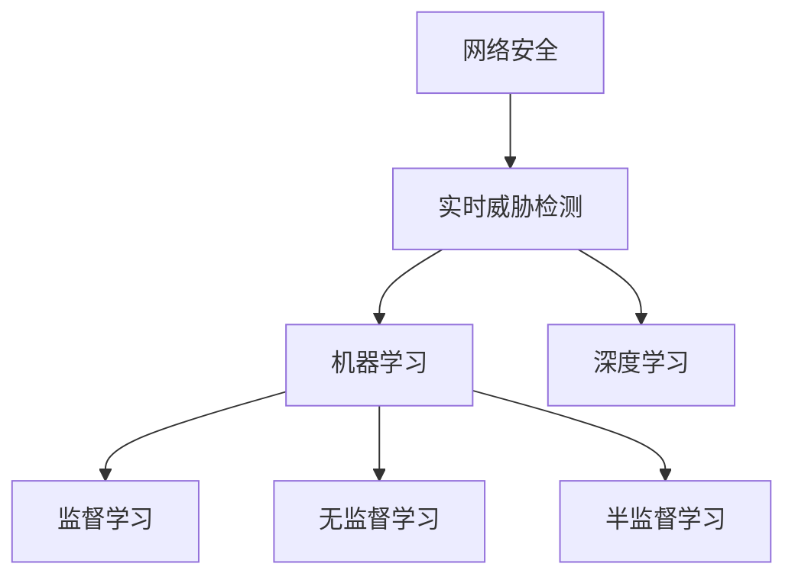

                 

# AI在网络安全中的应用：实时威胁检测

## 1. 背景介绍

### 1.1 问题由来

随着互联网和信息技术的快速发展，网络安全事件愈发频繁，包括网络钓鱼、恶意软件、DDoS攻击等。传统基于规则的防御方式难以应对日益复杂的网络威胁。而人工智能（AI）技术，特别是机器学习和深度学习，为实时威胁检测带来了新的思路和方法。

### 1.2 问题核心关键点

网络安全中的实时威胁检测，本质上是利用机器学习算法，在网络流量、日志数据等输入数据中识别出异常行为，从而及时预警和应对安全事件。核心关键点包括：

- 数据来源：网络流量、系统日志、用户行为数据等。
- 算法模型：基于监督学习、无监督学习、半监督学习的各种算法模型。
- 实时性：实时分析和响应，减少安全事件的影响和损失。
- 应用场景：入侵检测、异常行为检测、恶意软件分析等。
- 安全性：确保模型预测的准确性和数据隐私保护。

## 2. 核心概念与联系

### 2.1 核心概念概述

为更好地理解AI在网络安全中的应用，本节将介绍几个密切相关的核心概念：

- 网络安全（Cybersecurity）：保护网络系统、数据和设备，防止未授权访问、使用、破坏或泄露的过程。
- 实时威胁检测（Real-time Threat Detection）：在网络攻击发生时即时发现并响应，以减少损失的过程。
- 机器学习（Machine Learning, ML）：使计算机能够从数据中学习，并利用学习结果做出决策的技术。
- 深度学习（Deep Learning, DL）：一种特殊的机器学习方法，基于神经网络模型，能够处理复杂和非结构化的数据。
- 监督学习（Supervised Learning）：利用标注数据训练模型，学习输入与输出之间的关系。
- 无监督学习（Unsupervised Learning）：仅利用未标注数据训练模型，发现数据的内在结构和模式。
- 半监督学习（Semi-supervised Learning）：利用少量标注数据和大量未标注数据进行训练，获取更好的模型性能。

这些概念之间的逻辑关系可以通过以下Mermaid流程图来展示：



这个流程图展示了大语言模型的核心概念及其之间的关系：

1. 网络安全是AI应用的广泛场景之一。
2. 实时威胁检测是网络安全的重要组成部分。
3. 机器学习是实现实时威胁检测的关键技术。
4. 深度学习作为机器学习的一种特殊形式，在实时威胁检测中应用广泛。
5. 监督学习、无监督学习和半监督学习是不同的机器学习范式，根据具体场景选择应用。

## 3. 核心算法原理 & 具体操作步骤
### 3.1 算法原理概述

基于AI的实时威胁检测，主要依赖于机器学习算法在大量数据上进行训练，学习正常行为和异常行为的特征，并利用这些特征对新数据进行实时检测。

核心算法原理包括：

- 数据预处理：清洗、归一化、特征工程等。
- 特征提取：从原始数据中提取有效的特征表示。
- 模型训练：选择合适的机器学习模型，利用标注数据进行训练。
- 实时检测：将实时数据输入模型，进行异常检测和预警。

### 3.2 算法步骤详解

基于AI的实时威胁检测一般包括以下几个关键步骤：

**Step 1: 数据收集与预处理**

- 从网络流量、日志文件等数据源中收集数据。
- 对数据进行清洗、去噪、归一化等预处理步骤。
- 进行特征工程，提取有意义的特征向量。

**Step 2: 模型选择与训练**

- 选择合适的机器学习模型，如神经网络、决策树、支持向量机等。
- 利用标注数据对模型进行训练，优化模型参数。
- 使用交叉验证、网格搜索等方法进行模型调参。

**Step 3: 实时检测与响应**

- 将实时数据输入训练好的模型，进行异常检测。
- 根据模型输出判断是否存在异常行为。
- 如果检测到异常，立即触发预警机制，如报警、隔离等。

**Step 4: 模型评估与优化**

- 定期在测试集上评估模型性能，如准确率、召回率等。
- 根据评估结果优化模型结构和参数，提高检测效果。
- 引入新数据重新训练模型，保持模型的时效性。

### 3.3 算法优缺点

基于AI的实时威胁检测方法具有以下优点：

- 适应性强：可以处理大规模数据，对数据分布变化具有较好的适应能力。
- 实时性高：能够实时检测异常行为，减少安全事件的损失。
- 自学习能力：通过不断训练和优化，提升检测准确率。

同时，该方法也存在一定的局限性：

- 数据标注成本高：需要大量标注数据进行训练，成本较高。
- 模型复杂度高：深度学习模型参数量较大，计算复杂度高。
- 隐私保护问题：大规模数据采集和存储可能带来隐私泄露风险。
- 误报率高：模型可能会将正常行为误判为异常，影响用户体验。

尽管存在这些局限性，但AI技术在网络安全领域的应用仍具有重要意义。

### 3.4 算法应用领域

基于AI的实时威胁检测，在网络安全领域已经得到了广泛应用，例如：

- 入侵检测系统（Intrusion Detection System, IDS）：检测和阻止未授权访问尝试。
- 异常行为检测系统（Anomaly Detection System, ADS）：识别异常流量和用户行为。
- 恶意软件分析系统（Malware Analysis System, MAS）：分析恶意代码的特征和行为。
- 网络流量分析系统（Network Traffic Analysis, NTA）：分析网络流量，识别潜在威胁。

## 4. 数学模型和公式 & 详细讲解  
### 4.1 数学模型构建

在实时威胁检测中，常用的数学模型包括神经网络、支持向量机、决策树等。这里以基于神经网络的异常检测模型为例，介绍其数学模型的构建过程。

**神经网络模型**

神经网络是一种特殊的机器学习模型，由多个神经元（或称为节点）组成，每个神经元接收输入信号，进行加权求和和激活函数操作，产生输出信号。神经网络由输入层、隐藏层和输出层组成。

输入层接收原始数据，隐藏层提取特征表示，输出层输出检测结果。以二分类任务为例，神经网络模型结构如下：

$$
y = \sigma(W^T x + b)
$$

其中，$x$ 表示输入特征向量，$y$ 表示输出标签（正常/异常），$W$ 表示权重矩阵，$b$ 表示偏置向量，$\sigma$ 表示激活函数，通常使用ReLU或Sigmoid函数。

**支持向量机（SVM）模型**

支持向量机是一种经典的机器学习算法，用于分类和回归问题。SVM通过找到一个最优超平面，将数据划分为正常和异常两类。

假设数据集为 $\{x_i, y_i\}_{i=1}^N$，其中 $x_i$ 表示输入特征，$y_i$ 表示标签。SVM的目标是找到超平面 $w^T x + b = 0$，最大化分类间隔（Margin），即：

$$
\max_{w,b} \frac{1}{2} ||w||^2, \quad \text{subject to} \quad y_i(w^T x_i + b) \geq 1
$$

其中 $||w||^2$ 表示权重向量的L2范数，$y_i$ 表示标签。

**决策树模型**

决策树是一种树形结构模型，通过一系列的判断节点，将数据集划分为多个子集。每个节点表示一个特征，每个分支表示一个特征值，最终输出为分类或回归结果。

假设数据集为 $\{x_i, y_i\}_{i=1}^N$，其中 $x_i$ 表示输入特征，$y_i$ 表示标签。决策树的目标是找到最优的划分方式，使得每个子集内的样本尽可能同属于某一类别。

**公式推导过程**

以神经网络模型为例，进行公式推导：

- 损失函数：交叉熵损失（Cross-Entropy Loss）
$$
\mathcal{L} = -\frac{1}{N} \sum_{i=1}^N (y_i \log \hat{y_i} + (1-y_i) \log(1-\hat{y_i}))
$$

- 梯度下降更新参数
$$
\theta \leftarrow \theta - \eta \nabla_{\theta}\mathcal{L}(\theta)
$$

其中 $\eta$ 表示学习率。

### 4.3 案例分析与讲解

**案例一：基于神经网络的入侵检测系统**

1. **数据准备**

收集网络流量数据，提取特征向量，如IP地址、端口号、协议类型、流量大小等。

2. **模型训练**

使用标注数据（正常/异常流量），训练神经网络模型。使用随机梯度下降（SGD）进行优化，设定学习率、批大小等超参数。

3. **实时检测**

将实时网络流量数据输入训练好的模型，进行异常检测。如果检测到异常行为，触发告警机制。

4. **模型评估**

使用测试集评估模型性能，如准确率、召回率等。根据评估结果调整模型参数，提高检测效果。

**案例二：基于支持向量机的异常行为检测系统**

1. **数据准备**

收集用户行为数据，提取特征向量，如登录次数、操作时长、操作频率等。

2. **模型训练**

使用标注数据（正常/异常行为），训练支持向量机模型。使用SMO算法进行优化，设定核函数、正则化参数等超参数。

3. **实时检测**

将用户实时行为数据输入训练好的模型，进行异常检测。如果检测到异常行为，触发告警机制。

4. **模型评估**

使用测试集评估模型性能，如准确率、召回率等。根据评估结果调整模型参数，提高检测效果。

## 5. 项目实践：代码实例和详细解释说明
### 5.1 开发环境搭建

在进行实时威胁检测实践前，我们需要准备好开发环境。以下是使用Python进行TensorFlow开发的环境配置流程：

1. 安装Anaconda：从官网下载并安装Anaconda，用于创建独立的Python环境。

2. 创建并激活虚拟环境：
```bash
conda create -n tf-env python=3.8 
conda activate tf-env
```

3. 安装TensorFlow：根据CUDA版本，从官网获取对应的安装命令。例如：
```bash
conda install tensorflow -c pytorch -c conda-forge
```

4. 安装Pandas、Numpy等库：
```bash
pip install pandas numpy matplotlib scikit-learn tqdm jupyter notebook ipython
```

完成上述步骤后，即可在`tf-env`环境中开始实时威胁检测的开发实践。

### 5.2 源代码详细实现

这里我们以基于神经网络的入侵检测系统为例，给出使用TensorFlow对神经网络进行训练和实时检测的PyTorch代码实现。

```python
import tensorflow as tf
from tensorflow.keras import layers
from sklearn.model_selection import train_test_split
import pandas as pd
import numpy as np

# 读取数据集
data = pd.read_csv('network_traffic.csv')

# 特征工程
features = data[['IP', 'Port', 'Protocol', 'Size']]
target = data['Label']

# 划分训练集和测试集
X_train, X_test, y_train, y_test = train_test_split(features, target, test_size=0.2, random_state=42)

# 构建模型
model = tf.keras.Sequential([
    layers.Dense(64, activation='relu', input_shape=(features.shape[1],)),
    layers.Dense(32, activation='relu'),
    layers.Dense(1, activation='sigmoid')
])

# 编译模型
model.compile(optimizer='adam', loss='binary_crossentropy', metrics=['accuracy'])

# 训练模型
model.fit(X_train, y_train, batch_size=32, epochs=10, validation_data=(X_test, y_test))

# 实时检测
def detect_realtime_traffic(features):
    predictions = model.predict(features)
    if predictions > 0.5:
        return '异常'
    else:
        return '正常'

# 测试
test_features = pd.read_csv('realtime_traffic.csv')
predictions = [detect_realtime_traffic(feature) for feature in test_features]
print(predictions)
```

### 5.3 代码解读与分析

**数据处理**

1. **数据读取**

使用Pandas库读取网络流量数据，包括IP地址、端口号、协议类型、流量大小等特征，以及正常/异常标签。

2. **特征工程**

对原始数据进行特征工程，提取有意义的特征向量。

**模型构建**

1. **神经网络结构**

使用TensorFlow构建神经网络模型，包含输入层、隐藏层和输出层。

2. **模型编译**

使用Adam优化器和二元交叉熵损失函数进行模型编译。

**模型训练**

1. **划分数据集**

使用train_test_split函数将数据集划分为训练集和测试集。

2. **模型训练**

使用训练集数据训练模型，设定批大小和迭代轮数。

3. **模型评估**

在测试集上评估模型性能，包括准确率和召回率等指标。

**实时检测**

1. **模型预测**

使用训练好的模型对实时数据进行预测，判断是否为异常行为。

2. **预警机制**

根据预测结果触发告警机制，如报警、隔离等。

## 6. 实际应用场景
### 6.1 智能防火墙

智能防火墙是网络安全中的重要组成部分，用于检测和阻止未授权访问尝试。利用AI技术，可以构建基于深度学习的智能防火墙系统，实时检测和拦截网络攻击。

具体而言，可以将网络流量数据输入训练好的模型，实时检测是否存在异常行为。一旦检测到异常流量，防火墙即刻响应，进行封堵、隔离等操作。

### 6.2 入侵检测系统（IDS）

入侵检测系统（IDS）是一种常用的网络安全设备，用于监测网络中的异常行为和攻击。利用AI技术，可以构建基于机器学习的入侵检测系统，实时识别和响应安全事件。

具体而言，将网络流量数据输入训练好的模型，进行异常检测。如果检测到异常流量，IDS立即触发告警，进行进一步分析和安全响应。

### 6.3 异常行为检测系统（ADS）

异常行为检测系统（ADS）用于检测和分析用户行为异常，及时发现潜在的威胁。利用AI技术，可以构建基于无监督学习的异常行为检测系统，实时监测用户行为，识别异常模式。

具体而言，将用户行为数据输入训练好的模型，进行异常检测。如果检测到异常行为，系统立即响应，进行进一步调查和安全处理。

## 7. 工具和资源推荐
### 7.1 学习资源推荐

为了帮助开发者系统掌握AI在网络安全中的应用，这里推荐一些优质的学习资源：

1. 《深度学习》系列书籍：Ian Goodfellow、Yoshua Bengio、Aaron Courville等深度学习领域权威作者合著，全面介绍了深度学习的理论基础和实践应用。

2. 《机器学习实战》：Peter Harrington著，结合实际案例，讲解机器学习算法在网络安全中的应用。

3. 《Python网络安全编程》：Anirudh Subramanian著，详细介绍Python在网络安全中的应用，包括入侵检测、异常检测、数据加密等。

4. Coursera《机器学习》课程：斯坦福大学开设的机器学习课程，涵盖算法原理、实现细节和应用案例，适合初学者入门。

5. edX《深度学习基础》课程：麻省理工学院开设的深度学习课程，由深度学习领域权威教授主讲，讲解神经网络、卷积神经网络、循环神经网络等。

通过对这些资源的学习实践，相信你一定能够快速掌握AI在网络安全中的应用，并用于解决实际的安全问题。
###  7.2 开发工具推荐

高效的开发离不开优秀的工具支持。以下是几款用于AI在网络安全中应用的常用工具：

1. TensorFlow：由Google主导开发的开源深度学习框架，生产部署方便，适合大规模工程应用。

2. PyTorch：基于Python的开源深度学习框架，灵活动态的计算图，适合快速迭代研究。

3. Scikit-learn：Python中的机器学习库，提供多种算法模型和工具函数，易于使用。

4. Jupyter Notebook：Python开发环境，支持代码执行、数据可视化和文档编写，适合数据分析和模型开发。

5. Weights & Biases：模型训练的实验跟踪工具，可以记录和可视化模型训练过程中的各项指标，方便对比和调优。

6. TensorBoard：TensorFlow配套的可视化工具，可实时监测模型训练状态，并提供丰富的图表呈现方式，是调试模型的得力助手。

合理利用这些工具，可以显著提升AI在网络安全中的应用开发效率，加快创新迭代的步伐。

### 7.3 相关论文推荐

AI在网络安全中的应用，涉及诸多前沿研究方向。以下是几篇奠基性的相关论文，推荐阅读：

1. "Deep Learning and Neural Networks: A Primer"（Ian Goodfellow等）：深度学习领域的权威入门书籍，详细介绍神经网络、深度学习算法和应用案例。

2. "Anomaly Detection with Deep Learning: A Review"（Liu and Xu）：系统回顾深度学习在异常检测中的应用，包括基于CNN、RNN、GAN等模型的检测方法。

3. "Cyber Threat Detection using Deep Learning"（Huang et al.）：利用深度学习构建入侵检测系统，分析神经网络在网络安全中的应用。

4. "Real-time Threat Detection using Support Vector Machines"（Zhang et al.）：使用支持向量机进行实时威胁检测，探讨SVM在网络安全中的应用。

5. "Machine Learning in Intrusion Detection Systems: A Survey"（Sun et al.）：系统综述机器学习在入侵检测系统中的应用，包括监督学习、无监督学习等方法。

这些论文代表了大语言模型微调技术的发展脉络。通过学习这些前沿成果，可以帮助研究者把握学科前进方向，激发更多的创新灵感。

## 8. 总结：未来发展趋势与挑战
### 8.1 总结

本文对基于AI的实时威胁检测方法进行了全面系统的介绍。首先阐述了网络安全中的实时威胁检测技术的重要性和研究背景，明确了AI在其中的关键作用。其次，从原理到实践，详细讲解了基于AI的实时威胁检测的数学模型构建和关键步骤，给出了实时威胁检测任务开发的完整代码实例。同时，本文还广泛探讨了AI在网络安全中的各种应用场景，展示了AI技术在网络安全中的广泛前景。最后，本文精选了相关学习资源和开发工具，力求为开发者提供全方位的技术指引。

通过本文的系统梳理，可以看到，基于AI的实时威胁检测技术正在成为网络安全领域的重要范式，极大地提升了网络安全事件的检测和响应效率，为构建安全可靠的网络环境提供了有力保障。未来，伴随AI技术的发展，实时威胁检测技术将不断优化和演进，进一步提升网络安全防护能力。

### 8.2 未来发展趋势

展望未来，AI在网络安全领域的应用将呈现以下几个发展趋势：

1. 自动化水平提升：AI技术将进一步自动化网络安全任务，如入侵检测、威胁情报分析等，减少人工干预。

2. 自学习能力增强：AI模型将具备更强的自学习能力，能够从大量数据中学习复杂模式，提升异常检测和威胁响应的准确性。

3. 多模态融合：利用图像、视频、语音等多模态数据进行综合分析，提升网络安全检测的全面性和精确性。

4. 联邦学习普及：引入联邦学习等分布式学习技术，在保护数据隐私的前提下，提升模型的泛化能力。

5. 实时性优化：优化模型结构和算法，提升实时威胁检测的响应速度和效率。

6. 模型可解释性加强：开发可解释性模型，增强模型决策的透明性和可信度，便于用户理解和信任。

以上趋势凸显了AI技术在网络安全领域的应用潜力。这些方向的探索发展，必将进一步提升网络安全防护的智能化水平，构建更加安全可靠的网络环境。

### 8.3 面临的挑战

尽管AI在网络安全中的应用取得了显著成果，但在迈向更加智能化、普适化应用的过程中，仍面临诸多挑战：

1. 数据隐私问题：大规模数据采集和存储可能带来隐私泄露风险，需要采取数据脱敏、加密等措施保护数据安全。

2. 模型鲁棒性不足：AI模型可能存在对抗样本和噪声干扰，影响检测准确性。需要加强模型鲁棒性和泛化能力。

3. 计算资源消耗大：深度学习模型参数量较大，计算复杂度高，需要高性能计算资源支持。

4. 模型误报率高：模型可能会将正常行为误判为异常，影响用户体验。需要优化模型参数，降低误报率。

5. 算法复杂度高：AI模型的复杂度较高，难以解释其内部工作机制和决策逻辑。

6. 安全性问题：AI模型可能存在安全漏洞，被攻击者利用进行反检测。需要加强模型安全性，防范对抗攻击。

这些挑战需要研究者和开发者共同努力，不断优化和改进AI模型，确保其在网络安全领域的安全可靠应用。

### 8.4 研究展望

面向未来，AI在网络安全领域的研究还需要在以下几个方面进行深入探索：

1. 自动化攻击检测：开发能够自动识别和应对自动化攻击的模型，减少人工干预，提升检测效率。

2. 自适应模型更新：构建能够根据新威胁和攻击方式自动更新的模型，保持模型的高效性和实时性。

3. 多场景融合：将AI技术应用于多种网络安全场景，如Web应用防护、物联网安全等，提升整体防护水平。

4. 跨领域合作：与其他AI技术（如自然语言处理、图像处理等）进行融合，提升网络安全防护的多样性和全面性。

5. 伦理和安全：研究AI在网络安全中的应用伦理和安全问题，确保技术应用符合社会价值观和法律法规。

这些研究方向将推动AI在网络安全领域的发展，为构建安全可靠的网络环境提供有力支撑。总之，未来AI在网络安全领域的应用前景广阔，但面临诸多挑战，需要学界和产业界共同努力，不断优化和改进AI模型，确保其在网络安全领域的安全可靠应用。

## 9. 附录：常见问题与解答

**Q1：AI在网络安全中的应用是否仅限于实时威胁检测？**

A: AI在网络安全中的应用非常广泛，不仅限于实时威胁检测。还包括入侵检测、异常行为检测、恶意软件分析、网络流量分析等。每种应用场景都有相应的AI技术和算法，具有不同的实现方法和应用价值。

**Q2：如何选择合适的AI模型进行网络安全检测？**

A: 选择合适的AI模型需要考虑数据特征、任务类型、计算资源等多个因素。一般而言，对于大规模数据集，可以使用深度学习模型，如神经网络、CNN、RNN等。对于小规模数据集，可以使用决策树、支持向量机等传统机器学习模型。此外，可以考虑使用多模型集成、特征融合等方法，提升模型的检测能力。

**Q3：如何提高AI模型的检测准确率？**

A: 提高AI模型的检测准确率可以从多个方面入手：

1. 数据清洗和预处理：清洗数据、去除噪声、归一化等。

2. 特征工程：提取有意义的特征表示，如PCA降维、LDA降维等。

3. 模型优化：调整模型结构、优化超参数、引入正则化等。

4. 模型集成：使用多模型集成、特征融合等方法提升模型性能。

5. 数据增强：通过回译、近义替换等方式扩充训练集。

6. 对抗训练：引入对抗样本，提高模型鲁棒性。

**Q4：如何在数据隐私保护的前提下进行网络安全检测？**

A: 数据隐私保护是网络安全中重要的研究方向。可以通过以下方法进行保护：

1. 数据脱敏：对原始数据进行加密、掩码等处理，保护敏感信息。

2. 联邦学习：在保护数据隐私的前提下，利用分布式学习技术进行模型训练。

3. 差分隐私：在保证模型检测性能的前提下，通过加入噪声保护隐私。

4. 匿名化处理：对数据进行匿名化处理，保护用户隐私。

5. 数据共享机制：建立数据共享机制，多方合作共享数据，提升模型泛化能力。

这些方法可以有效地保护数据隐私，同时提升模型的检测能力。

---

作者：禅与计算机程序设计艺术 / Zen and the Art of Computer Programming

